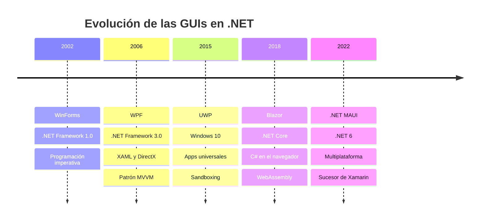

# 1. Introducción a las Interfaces Gráficas de Usuario con .NET

## Índice

- [1.1. ¿Qué es una Interfaz Gráfica de Usuario (GUI)?](#11-qué-es-una-interfaz-gráfica-de-usuario-gui)
- [1.2. Evolución Histórica de las GUIs en .NET (2002–2022)](#12-evolución-histórica-de-las-guis-in-net-20022022)
  - [1.2.1. Los orígenes: WinForms (2002)](#121-los-orígenes-winforms-2002)
  - [1.2.2. La revolución declarativa: WPF (2006)](#122-la-revolución-declarativa-wpf-2006)
  - [1.2.3. La era de las apps universales: UWP (2015)](#123-la-era-de-las-apps-universales-uwp-2015)
  - [1.2.4. La web como plataforma: Blazor (2018)](#124-la-web-como-plataforma-blazor-2018)
  - [1.2.5. El futuro multiplataforma: .NET MAUI (2022)](#125-el-futuro-multiplataforma-net-maui-2022)
- [1.3. Tabla Comparativa de Tecnologías GUI en .NET](#13-tabla-comparativa-de-tecnologías-gui-en-net)
- [1.4. Programación Orientada a Eventos](#14-programación-orientada-a-eventos)
  - [1.4.1. ¿Qué es?](#141-qué-es)
  - [1.4.2. Componentes clave](#142-componentes-clave)
  - [1.4.3. Ejemplo conceptual](#143-ejemplo-conceptual)
- [1.5. El Hilo de Interfaz de Usuario (UI Thread)](#15-el-hilo-de-interfaz-de-usuario-ui-thread)
  - [1.5.1. ¿Por qué existe?](#151-por-qué-existe)
  - [1.5.2. El problema](#152-el-problema)
  - [1.5.3. Solución con async/await](#153-solución-con-asyncawait)
- [1.6. Configuración del Entorno de Desarrollo](#16-configuración-del-entorno-de-desarrollo)
  - [1.6.1. SDK de .NET 10](#161-sdk-de-net-10)
  - [1.6.2. JetBrains Rider](#162-jetbrains-rider)
  - [1.6.3. Herramientas adicionales](#163-herramientas-adicionales)
- [1.7. Diagrama de Evolución Temporal](#17-diagrama-de-evolución-temporal)
- [1.8. ¿Por qué Aprender GUI en .NET en 2025?](#18-por-qué-aprender-gui-en-net-en-2025)
- [1.9. Resumen](#19-resumen)
- [1.10. Ejercicios de Reflexión](#110-ejercicios-de-reflexión)

---

## 1.1. ¿Qué es una Interfaz Gráfica de Usuario (GUI)?

Una **Interfaz Gráfica de Usuario** (del inglés *Graphical User Interface*, GUI) es un tipo de interfaz que permite a los usuarios interactuar con dispositivos electrónicos a través de elementos visuales como ventanas, botones, iconos y menús, en lugar de hacerlo mediante comandos de texto.

En el ecosistema **.NET**, Microsoft ha desarrollado a lo largo de los años múltiples tecnologías para la creación de aplicaciones de escritorio y web con interfaz gráfica, cada una adaptada a las necesidades tecnológicas de su época.

> 📝 **Nota del Profesor**: Esta unidad es EL FUNDAMENTO de todo lo que verás después. Entiende bien la diferencia entre WinForms (imperativo) y WPF/XAML (declarativo), porque esa distinción se repite en otras tecnologías.

---

## 1.2. Evolución Histórica de las GUIs en .NET (2002–2022)

### 1.2.1. Los orígenes: WinForms (2002)

Con el lanzamiento de **.NET Framework 1.0** en 2002, Microsoft introdujo **Windows Forms (WinForms)**, la primera tecnología oficial de GUI para .NET. WinForms ofrecía un modelo de programación imperativo, basado en arrastrar y soltar controles en un diseñador visual integrado en Visual Studio.

Su filosofía era simple: cada ventana es un objeto `Form`, y cada control (botón, cuadro de texto, etiqueta) es un objeto que se añade al formulario. Los eventos del usuario (clics, teclas pulsadas) disparan métodos llamados **manejadores de eventos** (*event handlers*).

### 1.2.2. La revolución declarativa: WPF (2006)

En 2006, con **.NET Framework 3.0**, Microsoft presentó **Windows Presentation Foundation (WPF)**. Esta tecnología introdujo un cambio de paradigma fundamental: la separación entre la interfaz visual y la lógica de negocio mediante **XAML** (*eXtensible Application Markup Language*).

WPF adoptó un modelo de renderizado basado en **DirectX**, lo que permitió gráficos más ricos, animaciones fluidas y soporte para pantallas de alta resolución (HiDPI). También introdujo el patrón **MVVM** (*Model-View-ViewModel*), que se convertiría en el estándar de la industria.

### 1.2.3. La era de las apps universales: UWP (2015)

Con Windows 10, Microsoft lanzó la **Universal Windows Platform (UWP)**, diseñada para crear aplicaciones que funcionaran en todos los dispositivos con Windows 10: PC, tablet, Xbox, HoloLens y teléfonos. Usaba también XAML pero con un subconjunto diferente de controles y una arquitectura de sandboxing más restrictiva.

UWP fue, sin embargo, una apuesta que no cuajó del todo en el mercado empresarial, y Microsoft la fue abandonando progresivamente.

> 💡 **Tip del Examinador**: En el examen pueden preguntarte cuál es la diferencia entre WinForms y WPF, o por qué MAUI es el futuro multiplataforma. Repasa esta tabla comparativa.

### 1.2.4. La web como plataforma: Blazor (2018)

**Blazor** llegó en 2018 como la respuesta de Microsoft al auge de los frameworks JavaScript (React, Angular, Vue). Permite escribir interfaces web usando **C# en lugar de JavaScript**, aprovechando WebAssembly para ejecutar código .NET directamente en el navegador.

Blazor tiene dos modalidades principales:
- **Blazor WebAssembly**: el código C# se ejecuta en el cliente (navegador).
- **Blazor Server**: la lógica se ejecuta en el servidor y se comunica en tiempo real con el cliente mediante SignalR.

### 1.2.5. El futuro multiplataforma: .NET MAUI (2022)

**.NET Multi-platform App UI (MAUI)** se presentó con **.NET 6** en 2022 como la evolución de Xamarin.Forms. MAUI permite crear aplicaciones nativas para **Windows, macOS, iOS y Android** desde una única base de código en C# y XAML.

---

## 1.3. Tabla Comparativa de Tecnologías GUI en .NET

| Tecnología | Año | Plataformas | Estado Actual |
|------------|-----|-------------|---------------|
| WinForms | 2002 | Windows | Legacy pero estable |
| WPF | 2006 | Windows | Estándar enterprise |
| UWP | 2015 | Windows 10+ | Deprecado |
| Blazor | 2018 | Web/Híbrido | Moderno |
| MAUI | 2022 | Multi | Futuro |

> 📝 **Nota del profesor**: En este curso trabajaremos principalmente con **WinForms** (por su simplicidad pedagógica) y haremos una introducción a **WPF** y **MAUI**. Aunque WinForms sea considerado *legacy*, sigue siendo ampliamente usado en el sector empresarial y es una excelente base para entender los conceptos fundamentales de programación orientada a eventos.

---

## 1.4. Programación Orientada a Eventos

### 1.4.1. ¿Qué es?

La **programación orientada a eventos** (*event-driven programming*) es un paradigma en el que el flujo del programa está determinado por **eventos**: acciones del usuario (clic de ratón, pulsación de tecla), mensajes del sistema operativo, señales de red, temporizadores, etc.

En contraste con la programación secuencial (donde el programa ejecuta instrucciones de arriba a abajo), en un programa con GUI el código espera pasivamente que ocurra algo, y cuando ocurre, **reacciona** ejecutando el manejador de eventos correspondiente.

### 1.4.2. Componentes clave

1. **Fuente del evento** (*Event Source* / *Publisher*): el objeto que genera el evento (p. ej., un `Button`).
2. **Evento**: la notificación de que algo ha ocurrido (p. ej., `Click`).
3. **Manejador de eventos** (*Event Handler* / *Subscriber*): el método que se ejecuta cuando ocurre el evento.
4. **Bucle de mensajes** (*Message Loop*): el mecanismo interno que escucha continuamente los eventos del sistema operativo y los despacha a los controles correspondientes.

### 1.4.3. Ejemplo conceptual

```csharp
// El botón es la fuente del evento
Button boton = new Button();
boton.Text = "Haz clic";

// Suscribirse al evento Click
boton.Click += (sender, e) =>
{
    MessageBox.Show("¡Has hecho clic!");
};
```

Cuando el usuario hace clic en el botón, Windows envía un mensaje `WM_LBUTTONUP` a la aplicación. El bucle de mensajes de WinForms recibe ese mensaje y llama al manejador de eventos registrado.

> 📝 **Nota del Profesor**: El UI Thread es CRÍTICO. En el examen puede aparecer una pregunta sobre qué pasa si modificas un control desde un hilo secundario. Spoiler: se produce una excepción. Aprenderás a solventarlo con Dispatcher en WPF.

---

## 1.5. El Hilo de Interfaz de Usuario (UI Thread)

### 1.5.1. ¿Por qué existe?

En una aplicación GUI, **todos los controles visuales deben manipularse desde un único hilo**: el **hilo de interfaz de usuario** (UI Thread). Esto es así porque los controles de Windows no son *thread-safe*: si dos hilos intentan modificar un control simultáneamente, se producen condiciones de carrera y comportamientos impredecibles.

### 1.5.2. El problema

Imagina que tienes una operación larga (descargar un archivo, consultar una base de datos). Si la ejecutas en el UI Thread, la ventana se congela y el usuario no puede interactuar con la aplicación. La solución es ejecutar la operación en un **hilo de fondo** (*background thread*) y, cuando termina, volver al UI Thread para actualizar la interfaz.

### 1.5.3. Solución con async/await

C# facilita este patrón con `async`/`await`:

```csharp
private async void botonDescargar_Click(object sender, EventArgs e)
{
    botonDescargar.Enabled = false;
    labelEstado.Text = "Descargando...";
    
    // Esta operación se ejecuta en un hilo de fondo
    string resultado = await Task.Run(() => OperacionLarga());
    
    // Aquí ya estamos de vuelta en el UI Thread
    labelEstado.Text = $"Completado: {resultado}";
    botonDescargar.Enabled = true;
}

private string OperacionLarga()
{
    Thread.Sleep(3000); // Simula trabajo pesado
    return "¡Éxito!";
}
```

> 💡 **Tip del Examinador**: Una pregunta clásica es "¿Qué pasa si ejecutas una operación larga en el UI Thread?" y otra es "¿Cómo se comunica un hilo secundario con la UI?". La respuesta: async/await + Dispatcher en WPF.

---

## 1.6. Configuración del Entorno de Desarrollo

### 1.6.1. SDK de .NET 10

Para este curso utilizaremos **.NET 10 SDK** (versión LTS). Puedes descargarlo desde:

```
https://dotnet.microsoft.com/download/dotnet/10.0
```

**Verificar la instalación:**

```bash
dotnet --version
# Salida esperada: 10.0.x
```

**Crear un proyecto WinForms:**

```bash
dotnet new winforms -n MiPrimeraApp
cd MiPrimeraApp
dotnet run
```

**Crear un proyecto WPF:**

```bash
dotnet new wpf -n MiAppWPF
cd MiAppWPF
dotnet run
```

### 1.6.2. JetBrains Rider

En este curso utilizaremos **JetBrains Rider** como IDE principal. Rider ofrece:

- **Diseñador visual** para WinForms y WPF.
- **Refactoring avanzado** con soporte completo para C# 14.
- **Depurador integrado** con evaluación de expresiones en tiempo real.
- **Soporte para .NET MAUI** y Blazor.
- **Integración con Git** y control de versiones.

> Los alumnos de centros educativos pueden obtener una **licencia gratuita** de JetBrains a través del programa JetBrains for Education: https://www.jetbrains.com/community/education/

### 1.6.3. Herramientas adicionales

- **xaml.io**: Herramienta online para prototipar interfaces XAML sin necesidad de instalar nada. Ideal para experimentar con WPF y MAUI durante las clases. URL: https://xaml.io

---

## 1.7. Diagrama de Evolución Temporal



---

## 1.8. ¿Por qué Aprender GUI en .NET en 2025?

A pesar de la proliferación de aplicaciones web y móviles, las **aplicaciones de escritorio** siguen siendo imprescindibles en muchos contextos:

- **Aplicaciones empresariales** internas (ERP, CRM, herramientas de gestión).
- **Software industrial** y de control de procesos.
- **Herramientas de productividad** para desarrolladores (IDEs, editores, herramientas de análisis).
- **Aplicaciones offline** que necesitan funcionar sin conexión a internet.

Aprender a desarrollar GUIs con .NET te proporciona:

1. **Comprensión del patrón Observer** y la programación orientada a eventos.
2. **Fundamentos de UX/UI** desde el código.
3. **Dominio del hilo de interfaz** y la programación asíncrona.
4. **Base sólida** para aprender WPF, MAUI y Blazor posteriormente.

> 💡 **Tip del Examinador**: En el examen, la pregunta más frecuente es: "¿Qué tecnología GUI usarías para cada caso?" La respuesta depende del contexto: WinForms para legacy/simple, WPF para enterprise Windows, MAUI para multiplataforma, Blazor para web.

---

## Resumen

- **Qué es una GUI** y por qué es importante
- **La evolución** de las tecnologías GUI en .NET
- **Programación orientada a eventos**: fuente, evento, manejador, bucle de mensajes
- **UI Thread**: por qué existe y cómo trabajar con él usando async/await
- **Configuración del entorno** de desarrollo

> 📝 **Nota del Profesor**: Si solo te llevas una cosa de esta unidad, que sea: **entiende el modelo de eventos y el UI Thread**. Son la base de TODO lo que viene después.

> 💡 **Tip del Examinador**: En el examen, la pregunta más frecuente es: "¿Qué tecnología GUI usarías para cada caso?" La respuesta depende del contexto: WinForms para legacy/simple, WPF para enterprise Windows, MAUI para multiplataforma, Blazor para web.
