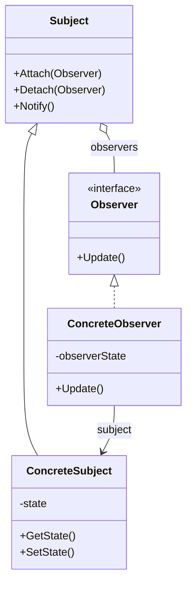
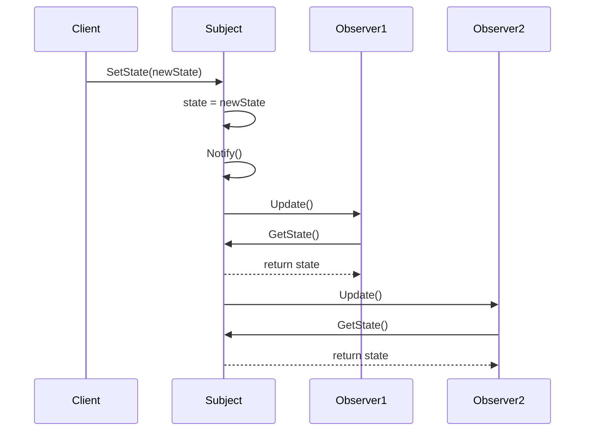

# 02 - Eventos en C# y el Patrón Observer

## 1. ¿Qué es un Evento?

En C#, un **evento** es un mecanismo que permite a un objeto (llamado **publicador** o *publisher*) notificar a otros objetos (llamados **suscriptores** o *subscribers*) cuando ocurre algo de interés. Los eventos son la base de la programación orientada a eventos en .NET y son esenciales para el desarrollo de interfaces gráficas de usuario.

Un evento es básicamente una abstracción sobre el patrón de diseño **Observer**, implementado de forma nativa en el lenguaje C#.

---

## 2. Delegados: La Base de los Eventos

### 2.1 ¿Qué es un Delegado?

Un **delegado** (*delegate*) es un tipo que representa referencias a métodos con una lista de parámetros y un tipo de retorno determinados. Los delegados son similares a los punteros a función en C/C++, pero son seguros en cuanto a tipos (*type-safe*) y están orientados a objetos.

**Declaración de un delegado:**

```csharp
// Sintaxis clásica (C# 1.0)
public delegate void MiDelegado(string mensaje);

// El delegado puede referenciar cualquier método con la misma firma
public void MostrarMensaje(string texto)
{
    Console.WriteLine(texto);
}

// Uso
MiDelegado delegado = MostrarMensaje;
delegado("¡Hola desde el delegado!");
```

### 2.2 Delegados en C# 14: Expresiones Lambda

Con las características modernas de C#, los delegados se usan frecuentemente con expresiones lambda:

```csharp
// Lambda expression con cuerpo de expresión
MiDelegado delegado = (mensaje) => Console.WriteLine(mensaje);

// Lambda con cuerpo de bloque
MiDelegado delegado2 = (mensaje) =>
{
    Console.WriteLine($"Mensaje recibido: {mensaje}");
    Console.WriteLine($"Longitud: {mensaje.Length}");
};

delegado("Hola");
delegado2("Mundo");
```

### 2.3 Delegados Genéricos Predefinidos

.NET proporciona delegados genéricos que cubren la mayoría de los casos:

| Delegado | Descripción | Ejemplo |
|----------|-------------|---------|
| `Action` | Método sin retorno | `Action<string> imprimir = Console.WriteLine;` |
| `Action<T>` | Método con parámetro sin retorno | `Action<int> cuadrado = x => Console.WriteLine(x * x);` |
| `Func<TResult>` | Método con retorno | `Func<int> obtenerNumero = () => 42;` |
| `Func<T, TResult>` | Método con parámetro y retorno | `Func<int, int> cuadrado = x => x * x;` |
| `Predicate<T>` | Método que retorna bool | `Predicate<int> esPar = x => x % 2 == 0;` |

**Ejemplo práctico:**

```csharp
// Action: sin retorno
Action<string> saludar = nombre => Console.WriteLine($"Hola, {nombre}");
saludar("Ana");

// Func: con retorno
Func<int, int, int> sumar = (a, b) => a + b;
int resultado = sumar(5, 3); // 8

// Predicate: filtrado
List<int> numeros = [1, 2, 3, 4, 5, 6, 7, 8, 9, 10];
List<int> pares = numeros.FindAll(n => n % 2 == 0);
```

### 2.4 Delegados Multicast

Un delegado puede referenciar **múltiples métodos** a la vez. Cuando se invoca, se ejecutan todos los métodos en el orden en que fueron añadidos.

```csharp
Action notificar = () => Console.WriteLine("Notificación 1");
notificar += () => Console.WriteLine("Notificación 2");
notificar += () => Console.WriteLine("Notificación 3");

// Al invocar, se ejecutan los 3 métodos
notificar();

// Salida:
// Notificación 1
// Notificación 2
// Notificación 3
```

**Importante:** En delegados multicast con retorno, solo se obtiene el valor del **último método** ejecutado.

---

## 3. Eventos en C#

### 3.1 Declaración de Eventos

Un evento se declara usando la palabra clave `event` seguida de un tipo delegado:

```csharp
public class Publicador
{
    // Declaración del evento
    public event Action<string> MensajeEnviado;
    
    public void EnviarMensaje(string mensaje)
    {
        // Invocar el evento (notificar a los suscriptores)
        MensajeEnviado?.Invoke(mensaje);
    }
}
```

### 3.2 Suscripción y Desuscripción

Los suscriptores usan `+=` para suscribirse y `-=` para desuscribirse:

```csharp
Publicador publicador = new();

// Suscripción con lambda
publicador.MensajeEnviado += mensaje => Console.WriteLine($"Recibido: {mensaje}");

// Suscripción con método
publicador.MensajeEnviado += MostrarEnPantalla;

publicador.EnviarMensaje("¡Hola a todos!");

// Desuscripción
publicador.MensajeEnviado -= MostrarEnPantalla;

void MostrarEnPantalla(string mensaje)
{
    Console.WriteLine($"[PANTALLA] {mensaje}");
}
```

### 3.3 EventHandler<TEventArgs>

La convención de .NET para eventos usa el delegado `EventHandler<TEventArgs>`:

```csharp
// Clase para datos del evento
public class MensajeEventArgs : EventArgs
{
    public string Mensaje { get; init; }
    public DateTime FechaHora { get; init; }
}

// Publicador
public class Notificador
{
    // Evento con EventHandler
    public event EventHandler<MensajeEventArgs>? MensajeRecibido;
    
    public void Notificar(string mensaje)
    {
        MensajeRecibido?.Invoke(this, new MensajeEventArgs
        {
            Mensaje = mensaje,
            FechaHora = DateTime.Now
        });
    }
}

// Uso
Notificador notificador = new();

notificador.MensajeRecibido += (sender, e) =>
{
    Console.WriteLine($"[{e.FechaHora:HH:mm:ss}] {e.Mensaje}");
};

notificador.Notificar("Sistema iniciado");
```

### 3.4 Ejemplo Completo: Sistema de Notificaciones

```csharp
namespace SistemaNotificaciones;

// Argumentos del evento
public class NotificacionEventArgs(string titulo, string mensaje, int prioridad) : EventArgs
{
    public string Titulo { get; } = titulo;
    public string Mensaje { get; } = mensaje;
    public int Prioridad { get; } = prioridad;
}

// Publicador
public class CentroNotificaciones
{
    public event EventHandler<NotificacionEventArgs>? NotificacionEnviada;
    
    public void EnviarNotificacion(string titulo, string mensaje, int prioridad = 1)
    {
        Console.WriteLine($"📢 Enviando notificación: {titulo}");
        NotificacionEnviada?.Invoke(this, new NotificacionEventArgs(titulo, mensaje, prioridad));
    }
}

// Suscriptores
public class NotificadorEmail
{
    public void SuscribirseA(CentroNotificaciones centro)
    {
        centro.NotificacionEnviada += OnNotificacionRecibida;
    }
    
    private void OnNotificacionRecibida(object? sender, NotificacionEventArgs e)
    {
        if (e.Prioridad >= 2)
        {
            Console.WriteLine($"📧 Email enviado: {e.Titulo}");
        }
    }
}

public class NotificadorSMS
{
    public void SuscribirseA(CentroNotificaciones centro)
    {
        centro.NotificacionEnviada += OnNotificacionRecibida;
    }
    
    private void OnNotificacionRecibida(object? sender, NotificacionEventArgs e)
    {
        if (e.Prioridad >= 3)
        {
            Console.WriteLine($"📱 SMS enviado: {e.Titulo}");
        }
    }
}

// Programa principal
public class Program
{
    public static void Main()
    {
        CentroNotificaciones centro = new();
        NotificadorEmail email = new();
        NotificadorSMS sms = new();
        
        email.SuscribirseA(centro);
        sms.SuscribirseA(centro);
        
        centro.EnviarNotificacion("Info", "Sistema iniciado", prioridad: 1);
        centro.EnviarNotificacion("Alerta", "Memoria al 80%", prioridad: 2);
        centro.EnviarNotificacion("Crítico", "¡Servidor caído!", prioridad: 3);
    }
}

// Salida:
// 📢 Enviando notificación: Info
// 📢 Enviando notificación: Alerta
// 📧 Email enviado: Alerta
// 📢 Enviando notificación: Crítico
// 📧 Email enviado: Crítico
// 📱 SMS enviado: Crítico
```

---

## 4. El Patrón Observer

### 4.1 ¿Qué es el Patrón Observer?

El **patrón Observer** (también conocido como *Publish-Subscribe*) es un patrón de diseño de comportamiento que define una dependencia de uno a muchos entre objetos, de manera que cuando un objeto cambia su estado, todos sus dependientes son notificados y actualizados automáticamente.

**Participantes:**

1. **Subject** (Sujeto/Publicador): mantiene una lista de observadores y los notifica de cambios.
2. **Observer** (Observador/Suscriptor): define una interfaz para recibir notificaciones.
3. **ConcreteSubject**: implementación concreta del sujeto.
4. **ConcreteObserver**: implementación concreta del observador.

### 4.2 Diagrama UML



### 4.3 Diagrama de Secuencia



### 4.4 Implementación Clásica del Patrón Observer

```csharp
namespace PatronObserver;

// Interfaz Observer
public interface IObserver
{
    void Update(string mensaje);
}

// Clase Subject
public class Subject
{
    private readonly List<IObserver> _observers = [];
    
    public void Attach(IObserver observer)
    {
        _observers.Add(observer);
        Console.WriteLine($"✅ Observador añadido. Total: {_observers.Count}");
    }
    
    public void Detach(IObserver observer)
    {
        _observers.Remove(observer);
        Console.WriteLine($"❌ Observador eliminado. Total: {_observers.Count}");
    }
    
    protected void Notify(string mensaje)
    {
        Console.WriteLine($"📣 Notificando a {_observers.Count} observadores...");
        foreach (var observer in _observers)
        {
            observer.Update(mensaje);
        }
    }
}

// ConcreteSubject
public class EstacionMeteorologica : Subject
{
    private float _temperatura;
    
    public float Temperatura
    {
        get => _temperatura;
        set
        {
            _temperatura = value;
            Notify($"Nueva temperatura: {_temperatura}°C");
        }
    }
}

// ConcreteObservers
public class PantallaTemperatura : IObserver
{
    private readonly string _ubicacion;
    
    public PantallaTemperatura(string ubicacion)
    {
        _ubicacion = ubicacion;
    }
    
    public void Update(string mensaje)
    {
        Console.WriteLine($"🖥️  [Pantalla {_ubicacion}] {mensaje}");
    }
}

public class SistemaAlerta : IObserver
{
    public void Update(string mensaje)
    {
        Console.WriteLine($"⚠️  [Sistema Alerta] {mensaje}");
    }
}

// Uso
public class Program
{
    public static void Main()
    {
        EstacionMeteorologica estacion = new();
        
        PantallaTemperatura pantalla1 = new("Oficina");
        PantallaTemperatura pantalla2 = new("Lobby");
        SistemaAlerta alerta = new();
        
        estacion.Attach(pantalla1);
        estacion.Attach(pantalla2);
        estacion.Attach(alerta);
        
        estacion.Temperatura = 22.5f;
        estacion.Temperatura = 35.0f;
        
        estacion.Detach(pantalla2);
        
        estacion.Temperatura = 18.0f;
    }
}
```

### 4.5 Implementación con Eventos de C#

La misma funcionalidad usando el sistema de eventos de C#:

```csharp
namespace PatronObserverConEventos;

// No necesitamos interfaz IObserver, usamos eventos

public class EstacionMeteorologica
{
    private float _temperatura;
    
    // Evento que reemplaza la lista de observadores
    public event Action<float>? TemperaturaChanged;
    
    public float Temperatura
    {
        get => _temperatura;
        set
        {
            if (Math.Abs(_temperatura - value) > 0.01f)
            {
                _temperatura = value;
                TemperaturaChanged?.Invoke(_temperatura);
            }
        }
    }
}

// Los "observadores" son simplemente métodos
public class Program
{
    public static void Main()
    {
        EstacionMeteorologica estacion = new();
        
        // Suscripción directa con lambdas
        estacion.TemperaturaChanged += temp =>
            Console.WriteLine($"🖥️  [Pantalla Oficina] {temp}°C");
        
        estacion.TemperaturaChanged += temp =>
            Console.WriteLine($"🖥️  [Pantalla Lobby] {temp}°C");
        
        estacion.TemperaturaChanged += temp =>
        {
            if (temp > 30)
                Console.WriteLine($"⚠️  [Alerta] ¡Temperatura alta: {temp}°C!");
        };
        
        estacion.Temperatura = 22.5f;
        estacion.Temperatura = 35.0f;
        estacion.Temperatura = 18.0f;
    }
}
```

**Ventajas de usar eventos en C#:**

✅ Menos código boilerplate  
✅ Sintaxis más limpia  
✅ Seguridad: los suscriptores no pueden invocar el evento directamente  
✅ Soporte nativo del lenguaje  

---

## 5. Eventos en Aplicaciones GUI

### 5.1 Eventos de Controles en WinForms

```csharp
namespace WinFormsEventos;

public partial class FormularioEjemplo : Form
{
    public FormularioEjemplo()
    {
        InitializeComponent();
        
        // Suscripción a eventos de controles
        botonEnviar.Click += BotonEnviar_Click;
        textoNombre.TextChanged += TextoNombre_TextChanged;
        checkBoxAceptar.CheckedChanged += CheckBoxAceptar_CheckedChanged;
    }
    
    private void BotonEnviar_Click(object? sender, EventArgs e)
    {
        MessageBox.Show($"Enviando datos de: {textoNombre.Text}");
    }
    
    private void TextoNombre_TextChanged(object? sender, EventArgs e)
    {
        // Habilitar botón solo si hay texto
        botonEnviar.Enabled = !string.IsNullOrWhiteSpace(textoNombre.Text);
    }
    
    private void CheckBoxAceptar_CheckedChanged(object? sender, EventArgs e)
    {
        botonEnviar.Enabled = checkBoxAceptar.Checked;
    }
}
```

### 5.2 Eventos Personalizados en Controles

```csharp
namespace ControlesPersonalizados;

public class BotonContador : Button
{
    private int _contador = 0;
    
    // Evento personalizado
    public event EventHandler<int>? ContadorChanged;
    
    public BotonContador()
    {
        Click += (sender, e) =>
        {
            _contador++;
            Text = $"Clics: {_contador}";
            ContadorChanged?.Invoke(this, _contador);
        };
    }
    
    public int Contador
    {
        get => _contador;
        set
        {
            _contador = value;
            Text = $"Clics: {_contador}";
            ContadorChanged?.Invoke(this, _contador);
        }
    }
}

// Uso
public class FormularioPrincipal : Form
{
    public FormularioPrincipal()
    {
        BotonContador boton = new() { Text = "Clics: 0", Location = new Point(10, 10) };
        
        boton.ContadorChanged += (sender, contador) =>
        {
            if (contador % 10 == 0)
            {
                MessageBox.Show($"¡Llevas {contador} clics!");
            }
        };
        
        Controls.Add(boton);
    }
}
```

---

## 6. Buenas Prácticas con Eventos

### 6.1 Memory Leaks y Desuscripción

⚠️ **Problema:** Si un objeto suscrito a un evento no se desuscribe, el publicador mantiene una referencia al suscriptor, impidiendo que sea recolectado por el Garbage Collector.

```csharp
public class PantallaNotificaciones : Form
{
    private readonly CentroNotificaciones _centro;
    
    public PantallaNotificaciones(CentroNotificaciones centro)
    {
        _centro = centro;
        _centro.NotificacionEnviada += OnNotificacion; // ✅ Guardamos referencia
    }
    
    private void OnNotificacion(object? sender, NotificacionEventArgs e)
    {
        // Actualizar UI
    }
    
    protected override void OnFormClosing(FormClosingEventArgs e)
    {
        _centro.NotificacionEnviada -= OnNotificacion; // ✅ Desuscribirse
        base.OnFormClosing(e);
    }
}
```

### 6.2 Uso de WeakEventManager

Para evitar memory leaks sin desuscripción manual:

```csharp
// En lugar de:
publicador.MiEvento += MiMetodo;

// Usar WeakEventManager (WPF):
WeakEventManager<Publicador, EventArgs>
    .AddHandler(publicador, nameof(Publicador.MiEvento), MiMetodo);
```

### 6.3 Convenciones de Nomenclatura

| Elemento | Convención | Ejemplo |
|----------|------------|---------|
| Evento | PascalCase, verbo en pasado | `DataReceived`, `ButtonClicked` |
| Método manejador | `On` + nombre del evento | `OnDataReceived` |
| Invocar evento | Comprobar `null` con `?.Invoke()` | `DataReceived?.Invoke(this, e);` |
| EventArgs | Sufijo `EventArgs` | `DataReceivedEventArgs` |

### 6.4 Null Check al Invocar Eventos

```csharp
// ❌ Forma antigua (peligro de race condition)
if (MiEvento != null)
{
    MiEvento(this, EventArgs.Empty);
}

// ✅ Forma moderna (segura ante multithreading)
MiEvento?.Invoke(this, EventArgs.Empty);
```

---

## 7. Eventos Asíncronos

En aplicaciones modernas, a veces necesitamos que los manejadores de eventos sean asíncronos:

```csharp
public class DescargadorArchivos
{
    // Evento con Func<Task> para soportar async
    public event Func<string, Task>? ArchivoDescargado;
    
    public async Task DescargarAsync(string url)
    {
        Console.WriteLine($"Descargando {url}...");
        await Task.Delay(2000); // Simular descarga
        
        // Invocar eventos asíncronos
        if (ArchivoDescargado != null)
        {
            foreach (Func<string, Task> handler in ArchivoDescargado.GetInvocationList())
            {
                await handler(url);
            }
        }
    }
}

// Uso
DescargadorArchivos descargador = new();

descargador.ArchivoDescargado += async url =>
{
    Console.WriteLine($"Procesando {url}...");
    await Task.Delay(1000);
    Console.WriteLine($"✅ Archivo {url} procesado");
};

await descargador.DescargarAsync("archivo.zip");
```

---

## 8. Ejemplo Integrador: Aplicación de Bolsa de Valores

```csharp
namespace BolsaValores;

// Modelo
public record Accion(string Simbolo, decimal Precio, DateTime Timestamp);

// EventArgs
public class PrecioChangedEventArgs(Accion accion, decimal precioAnterior) : EventArgs
{
    public Accion Accion { get; } = accion;
    public decimal PrecioAnterior { get; } = precioAnterior;
    public decimal Cambio => Accion.Precio - PrecioAnterior;
    public decimal CambioPorcentaje => (Cambio / PrecioAnterior) * 100;
}

// Publicador
public class MercadoAcciones
{
    private readonly Dictionary<string, decimal> _precios = new();
    
    public event EventHandler<PrecioChangedEventArgs>? PrecioChanged;
    
    public void ActualizarPrecio(string simbolo, decimal nuevoPrecio)
    {
        decimal precioAnterior = _precios.GetValueOrDefault(simbolo, nuevoPrecio);
        _precios[simbolo] = nuevoPrecio;
        
        if (Math.Abs(precioAnterior - nuevoPrecio) > 0.001m)
        {
            Accion accion = new(simbolo, nuevoPrecio, DateTime.Now);
            PrecioChanged?.Invoke(this, new PrecioChangedEventArgs(accion, precioAnterior));
        }
    }
}

// Suscriptores
public class PanelPrecio
{
    public void SuscribirseA(MercadoAcciones mercado)
    {
        mercado.PrecioChanged += MostrarPrecio;
    }
    
    private void MostrarPrecio(object? sender, PrecioChangedEventArgs e)
    {
        string flecha = e.Cambio >= 0 ? "📈" : "📉";
        Console.WriteLine($"{flecha} {e.Accion.Simbolo}: ${e.Accion.Precio:F2} ({e.CambioPorcentaje:+0.00;-0.00}%)");
    }
}

public class SistemaAlertas
{
    private readonly decimal _umbral;
    
    public SistemaAlertas(decimal umbralPorcentaje)
    {
        _umbral = umbralPorcentaje;
    }
    
    public void SuscribirseA(MercadoAcciones mercado)
    {
        mercado.PrecioChanged += VerificarAlerta;
    }
    
    private void VerificarAlerta(object? sender, PrecioChangedEventArgs e)
    {
        if (Math.Abs(e.CambioPorcentaje) >= _umbral)
        {
            Console.WriteLine($"⚠️  ALERTA: {e.Accion.Simbolo} cambió {e.CambioPorcentaje:F2}%");
        }
    }
}

// Programa
class Program
{
    static void Main()
    {
        MercadoAcciones mercado = new();
        PanelPrecio panel = new();
        SistemaAlertas alertas = new(umbralPorcentaje: 5.0m);
        
        panel.SuscribirseA(mercado);
        alertas.SuscribirseA(mercado);
        
        mercado.ActualizarPrecio("AAPL", 150.00m);
        mercado.ActualizarPrecio("AAPL", 152.50m);
        mercado.ActualizarPrecio("AAPL", 161.00m); // Cambio > 5%
        mercado.ActualizarPrecio("MSFT", 300.00m);
    }
}
```

---

## 9. Resumen

| Concepto | Descripción |
|----------|-------------|
| Delegado | Tipo que referencia métodos con firma específica |
| Evento | Mecanismo de notificación basado en delegados |
| Observer | Patrón que define dependencia uno-a-muchos |
| EventHandler | Delegado estándar para eventos en .NET |
| Multicast | Capacidad de un delegado de referenciar múltiples métodos |
| `+=` / `-=` | Operadores para suscribir/desuscribir eventos |
| `?.Invoke()` | Forma segura de invocar eventos |

---

## 10. Ejercicios Propuestos

1. **Temporizador con Eventos**: Crea una clase `Temporizador` que dispare un evento cada segundo. Implementa tres suscriptores que muestren la hora en diferentes formatos.

2. **Sistema de Subasta**: Implementa un sistema de subasta en el que múltiples pujadores (observers) reciben notificaciones cuando se realiza una nueva puja.

3. **Monitor de Sistema**: Crea una aplicación que monitoree el uso de CPU y memoria, y dispare eventos cuando se superen ciertos umbrales.

4. **Conversor de Eventos**: Convierte el patrón Observer clásico (con interfaces) del ejemplo de la estación meteorológica a usar eventos de C#.

---

## 11. Referencias

- Documentación oficial: [Events (C# Programming Guide)](https://learn.microsoft.com/dotnet/csharp/programming-guide/events/)
- Libro: *C# 12 in a Nutshell* - Joseph Albahari
- Patrón Observer: *Design Patterns* - Gang of Four

Ver ejemplos completos en `/soluciones/02-eventos-observer/`

---

*Documento elaborado para el módulo de Programación del ciclo formativo 1º DAW · Curso 2025-2026*
