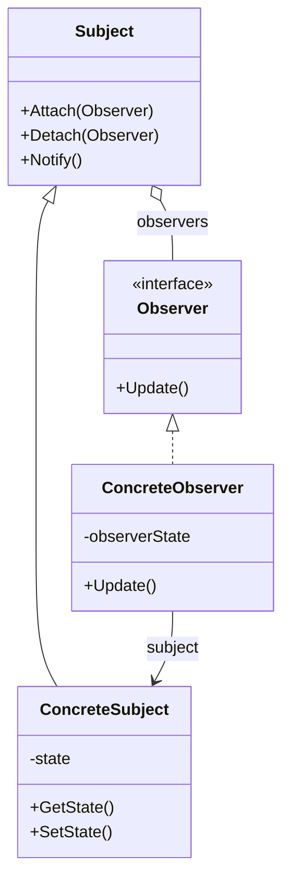
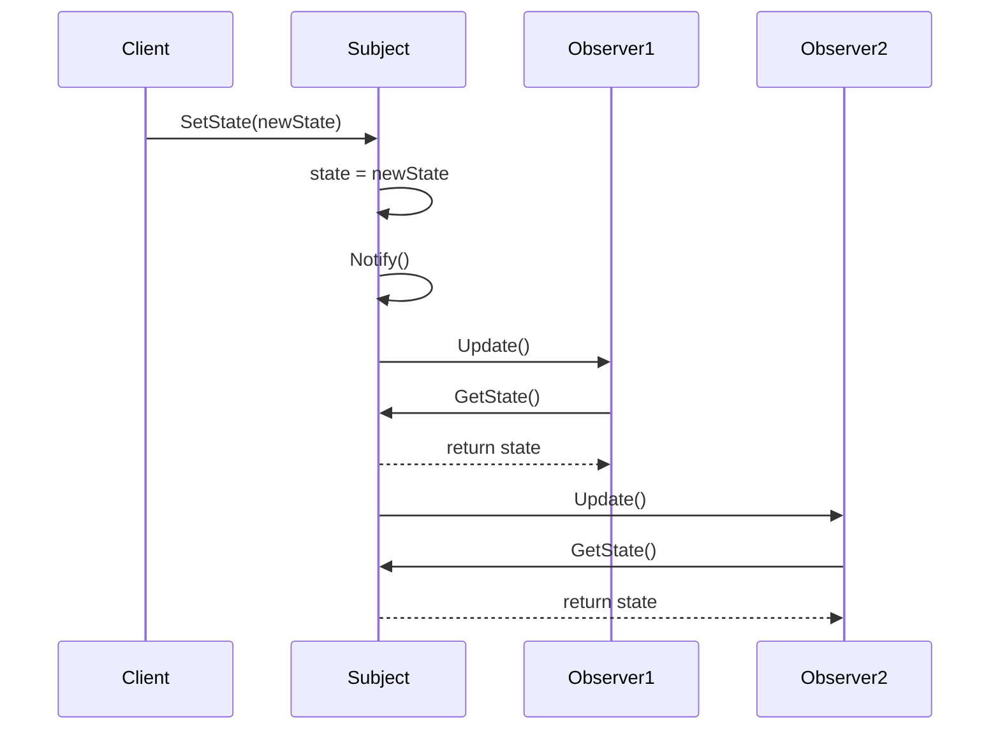

# 2. Eventos en C# y el Patrón Observer

- [2.1. ¿Qué es un Evento?](#21-qué-es-un-evento)
- [2.2. Delegados: La Base de los Eventos](#22-delegados-la-base-de-los-eventos)
  - [2.2.1. ¿Qué es un Delegado?](#221-qué-es-un-delegado)
  - [2.2.2. Delegados en C# 14: Expresiones Lambda](#222-delegados-en-c-14-expresiones-lambda)
  - [2.2.3. Delegados Genéricos Predefinidos](#223-delegados-genéricos-predefinidos)
  - [2.2.4. Delegados Multicast](#224-delegados-multicast)
- [2.3. Eventos en C#](#23-eventos-en-c)
  - [2.3.1. Declaración de Eventos](#231-declaración-de-eventos)
  - [2.3.2. Suscripción y Desuscripción](#232-suscripción-y-desuscripción)
  - [2.3.3. EventHandler\<TEventArgs\>](#233-eventhandlertcontroversialargs)
  - [2.3.4. Ejemplo Completo: Sistema de Notificaciones](#234-ejemplo-completo-sistema-de-notificaciones)
- [2.4. El Patrón Observer](#24-el-patrón-observer)
  - [2.4.1. ¿Qué es el Patrón Observer?](#241-qué-es-el-patrón-observer)
  - [2.4.2. Diagrama UML](#242-diagrama-uml)
  - [2.4.3. Diagrama de Secuencia](#243-diagrama-de-secuencia)
  - [2.4.4. Implementación Clásica del Patrón Observer](#244-implementación-clásica-del-patrón-observer)
  - [2.4.5. Implementación con Eventos de C#](#245-implementación-con-eventos-de-c)
- [2.5. INotifyPropertyChanged (Patrón PropertyChangeListener)](#25-inotifypropertychanged-patrón-propertychangelistener)
  - [2.5.1. ¿Qué es INotifyPropertyChanged?](#251-qué-es-inotifypropertychanged)
  - [2.5.2. ObservableCollection\<T\>: Colecciones Reactivas](#252-observablecollectiont-colecciones-reactivas)
  - [2.5.3. Comunicación Radio (Broadcast de Eventos)](#253-comunicación-radio-broadcast-de-eventos)
- [2.6. Eventos en Aplicaciones GUI](#26-eventos-en-aplicaciones-gui)
  - [2.6.1. Ejemplo con WinForms](#261-ejemplo-con-winforms)
  - [2.6.2. Estado Reactivo en Blazor](#262-estado-reactivo-en-blazor)
- [2.7. Buenas Prácticas con Eventos](#27-buenas-prácticas-con-eventos)
  - [2.7.1. Memory Leaks y Desuscripción](#271-memory-leaks-y-desuscripción)
  - [2.7.2. Uso de WeakEventManager](#272-uso-de-weakeventmanager)
  - [2.7.3. Convenciones de Nomenclatura](#273-convenciones-de-nomenclatura)
  - [2.7.4. Null Check al Invocar Eventos](#274-null-check-al-invocar-eventos)
- [2.8. Eventos Asíncronos](#28-eventos-asíncronos)
- [2.9. Ejemplo Integrador: Aplicación de Bolsa de Valores](#29-ejemplo-integrador-aplicación-de-bolsa-de-valores)

## 2.1. ¿Qué es un Evento?

En C#, un **evento** es un mecanismo que permite a un objeto (llamado **publicador** o *publisher*) notificar a otros objetos (llamados **suscriptores** o *subscribers*) cuando ocurre algo de interés. Los eventos son la base de la programación orientada a eventos en .NET y son esenciales para el desarrollo de interfaces gráficas de usuario.

Un evento es basically una abstracción sobre el patrón de diseño **Observer**, implementado de forma nativa en el lenguaje C#.

> 📝 **Nota del Profesor**: Los eventos y delegados son EL FUNDAMENTO de toda la programación GUI en .NET. Desde WinForms hasta WPF, MAUI y Blazor, todo funciona con eventos. Si entiendes esto bien, el resto viene solo.

---

## 2.2. Delegados: La Base de los Eventos

> 💡 **Tip del Examinador**: Pregunta frecuente de examen: "¿Cuál es la diferencia entre un delegado y un evento?"答: Un delegado es un tipo que referencia métodos; un evento es un delegado con protección (solo se puede invocar desde la clase que lo declara).

### 2.2.1. ¿Qué es un Delegado?

Un **delegado** (*delegate*) es un tipo que representa referencias a métodos con una lista de parámetros y un tipo de retorno determinados. Los delegados son similares a los punteros a función en C/C++, pero son seguros en cuanto a tipos (*type-safe*) y están orientados a objetos.

**Declaración de un delegado:**

```csharp
// Sintaxis clásica (C# 1.0)
public delegate void MiDelegado(string mensaje);

// El delegado puede referenciar cualquier método con la misma firma
public void MostrarMensaje(string texto)
{
    Console.WriteLine(texto);
}

// Uso
MiDelegado delegado = MostrarMensaje;
delegado("¡Hola desde el delegado!");
```

### 2.2.2. Delegados en C# 14: Expresiones Lambda

Con las características modernas de C#, los delegados se usan frecuentemente con expresiones lambda:

```csharp
// Lambda expression con cuerpo de expresión
MiDelegado delegado = (mensaje) => Console.WriteLine(mensaje);

// Lambda con cuerpo de bloque
MiDelegado delegado2 = (mensaje) =>
{
    Console.WriteLine($"Mensaje recibido: {mensaje}");
    Console.WriteLine($"Longitud: {mensaje.Length}");
};

delegado("Hola");
delegado2("Mundo");
```

### 2.2.3. Delegados Genéricos Predefinidos

.NET proporciona delegados genéricos que cubren la mayoría de los casos:

| Delegado | Descripción | Ejemplo |
|----------|-------------|---------|
| `Action` | Método sin retorno | `Action<string> imprimir = Console.WriteLine;` |
| `Action<T>` | Método con parámetro sin retorno | `Action<int> cuadrado = x => Console.WriteLine(x * x);` |
| `Func<TResult>` | Método con retorno | `Func<int> obtenerNumero = () => 42;` |
| `Func<T, TResult>` | Método con parámetro y retorno | `Func<int, int> cuadrado = x => x * x;` |
| `Predicate<T>` | Método que retorna bool | `Predicate<int> esPar = x => x % 2 == 0;` |

**Ejemplo práctico:**

```csharp
// Action: sin retorno
Action<string> saludar = nombre => Console.WriteLine($"Hola, {nombre}");
saludar("Ana");

// Func: con retorno
Func<int, int, int> sumar = (a, b) => a + b;
int resultado = sumar(5, 3); // 8

// Predicate: filtrado
List<int> numeros = [1, 2, 3, 4, 5, 6, 7, 8, 9, 10];
List<int> pares = numeros.FindAll(n => n % 2 == 0);
```

### 2.2.4. Delegados Multicast

Un delegado puede referenciar **múltiples métodos** a la vez. Cuando se invoca, se ejecutan todos los métodos en el orden en que fueron añadidos.

```csharp
Action notificar = () => Console.WriteLine("Notificación 1");
notificar += () => Console.WriteLine("Notificación 2");
notificar += () => Console.WriteLine("Notificación 3");

// Al invocar, se ejecutan los 3 métodos
notificar();

// Salida:
// Notificación 1
// Notificación 2
// Notificación 3
```

**Importante:** En delegados multicast con retorno, solo se obtiene el valor del **último método** ejecutado.

---

## 2.3. Eventos en C#

### 2.3.1. Declaración de Eventos

Un evento se declara usando la palabra clave `event` seguida de un tipo delegado:

```csharp
public class Publicador
{
    // Declaración del evento
    public event Action<string> MensajeEnviado;
    
    public void EnviarMensaje(string mensaje)
    {
        // Invocar el evento (notificar a los suscriptores)
        MensajeEnviado?.Invoke(mensaje);
    }
}
```

### 2.3.2. Suscripción y Desuscripción

Los suscriptores usan `+=` para suscribirse y `-=` para desuscribirse:

```csharp
Publicador publicador = new();

// Suscripción con lambda
publicador.MensajeEnviado += mensaje => Console.WriteLine($"Recibido: {mensaje}");

// Suscripción con método
publicador.MensajeEnviado += MostrarEnPantalla;

publicador.EnviarMensaje("¡Hola a todos!");

// Desuscripción
publicador.MensajeEnviado -= MostrarEnPantalla;

void MostrarEnPantalla(string mensaje)
{
    Console.WriteLine($"[PANTALLA] {mensaje}");
}
```

### 2.3.3. EventHandler<TEventArgs>

La convención de .NET para eventos usa el delegado `EventHandler<TEventArgs>`:

```csharp
// Clase para datos del evento
public class MensajeEventArgs : EventArgs
{
    public string Mensaje { get; init; }
    public DateTime FechaHora { get; init; }
}

// Publicador
public class Notificador
{
    // Evento con EventHandler
    public event EventHandler<MensajeEventArgs>? MensajeRecibido;
    
    public void Notificar(string mensaje)
    {
        MensajeRecibido?.Invoke(this, new MensajeEventArgs
        {
            Mensaje = mensaje,
            FechaHora = DateTime.Now
        });
    }
}

// Uso
Notificador notificador = new();

notificador.MensajeRecibido += (sender, e) =>
{
    Console.WriteLine($"[{e.FechaHora:HH:mm:ss}] {e.Mensaje}");
};

notificador.Notificar("Sistema iniciado");
```

### 2.3.4. Ejemplo Completo: Sistema de Notificaciones

```csharp
namespace SistemaNotificaciones;

// Argumentos del evento
public class NotificacionEventArgs(string titulo, string mensaje, int prioridad) : EventArgs
{
    public string Titulo { get; } = titulo;
    public string Mensaje { get; } = mensaje;
    public int Prioridad { get; } = prioridad;
}

// Publicador
public class CentroNotificaciones
{
    public event EventHandler<NotificacionEventArgs>? NotificacionEnviada;
    
    public void EnviarNotificacion(string titulo, string mensaje, int prioridad = 1)
    {
        Console.WriteLine($"📢 Enviando notificación: {titulo}");
        NotificacionEnviada?.Invoke(this, new NotificacionEventArgs(titulo, mensaje, prioridad));
    }
}

// Suscriptores
public class NotificadorEmail
{
    public void SuscribirseA(CentroNotificaciones centro)
    {
        centro.NotificacionEnviada += OnNotificacionRecibida;
    }
    
    private void OnNotificacionRecibida(object? sender, NotificacionEventArgs e)
    {
        if (e.Prioridad >= 2)
        {
            Console.WriteLine($"📧 Email enviado: {e.Titulo}");
        }
    }
}

public class NotificadorSMS
{
    public void SuscribirseA(CentroNotificaciones centro)
    {
        centro.NotificacionEnviada += OnNotificacionRecibida;
    }
    
    private void OnNotificacionRecibida(object? sender, NotificacionEventArgs e)
    {
        if (e.Prioridad >= 3)
        {
            Console.WriteLine($"📱 SMS enviado: {e.Titulo}");
        }
    }
}

// Programa principal
public class Program
{
    public static void Main()
    {
        CentroNotificaciones centro = new();
        NotificadorEmail email = new();
        NotificadorSMS sms = new();
        
        email.SuscribirseA(centro);
        sms.SuscribirseA(centro);
        
        centro.EnviarNotificacion("Info", "Sistema iniciado", prioridad: 1);
        centro.EnviarNotificacion("Alerta", "Memoria al 80%", prioridad: 2);
        centro.EnviarNotificacion("Crítico", "¡Servidor caído!", prioridad: 3);
    }
}

// Salida:
// 📢 Enviando notificación: Info
// 📢 Enviando notificación: Alerta
// 📧 Email enviado: Alerta
// 📢 Enviando notificación: Crítico
// 📧 Email enviado: Crítico
// 📱 SMS enviado: Crítico
```

> 📝 **Nota del Profesor**: El patrón Observer es la base de TODO. WPF usa este patrón internamente con INotifyPropertyChanged. Blazor usa SignalR para notificar cambios. MAUI usa el patrón observable. Entiende este patrón y entenderás el resto.

---

## 2.4. El Patrón Observer

### 2.4.1. ¿Qué es el Patrón Observer?

El **patrón Observer** (también conocido como *Publish-Subscribe*) es un patrón de diseño de comportamiento que define una dependencia de uno a muchos entre objetos, de manera que cuando un objeto cambia su estado, todos sus dependientes son notificados y actualizados automáticamente.

**Participantes:**

1. **Subject** (Sujeto/Publicador): mantiene una lista de observadores y los notifica de cambios.
2. **Observer** (Observador/Suscriptor): define una interfaz para recibir notificaciones.
3. **ConcreteSubject**: implementación concreta del sujeto.
4. **ConcreteObserver**: implementación concreta del observador.

### 2.4.2. Diagrama UML



### 2.4.3. Diagrama de Secuencia



### 2.4.4. Implementación Clásica del Patrón Observer

```csharp
namespace PatronObserver;

// Interfaz Observer
public interface IObserver
{
    void Update(string mensaje);
}

// Clase Subject
public class Subject
{
    private readonly List<IObserver> _observers = [];
    
    public void Attach(IObserver observer)
    {
        _observers.Add(observer);
        Console.WriteLine($"✅ Observador añadido. Total: {_observers.Count}");
    }
    
    public void Detach(IObserver observer)
    {
        _observers.Remove(observer);
        Console.WriteLine($"❌ Observador eliminado. Total: {_observers.Count}");
    }
    
    protected void Notify(string mensaje)
    {
        Console.WriteLine($"📣 Notificando a {_observers.Count} observadores...");
        foreach (var observer in _observers)
        {
            observer.Update(mensaje);
        }
    }
}

// ConcreteSubject
public class EstacionMeteorologica : Subject
{
    private float _temperatura;
    
    public float Temperatura
    {
        get => _temperatura;
        set
        {
            _temperatura = value;
            Notify($"Nueva temperatura: {_temperatura}°C");
        }
    }
}

// ConcreteObservers
public class PantallaTemperatura : IObserver
{
    private readonly string _ubicacion;
    
    public PantallaTemperatura(string ubicacion)
    {
        _ubicacion = ubicacion;
    }
    
    public void Update(string mensaje)
    {
        Console.WriteLine($"🖥️  [Pantalla {_ubicacion}] {mensaje}");
    }
}

public class SistemaAlerta : IObserver
{
    public void Update(string mensaje)
    {
        Console.WriteLine($"⚠️  [Sistema Alerta] {mensaje}");
    }
}

// Uso
public class Program
{
    public static void Main()
    {
        EstacionMeteorologica estacion = new();
        
        PantallaTemperatura pantalla1 = new("Oficina");
        PantallaTemperatura pantalla2 = new("Lobby");
        SistemaAlerta alerta = new();
        
        estacion.Attach(pantalla1);
        estacion.Attach(pantalla2);
        estacion.Attach(alerta);
        
        estacion.Temperatura = 22.5f;
        estacion.Temperatura = 35.0f;
        
        estacion.Detach(pantalla2);
        
        estacion.Temperatura = 18.0f;
    }
}
```

### 2.4.5. Implementación con Eventos de C#

La misma funcionalidad usando el sistema de eventos de C#:

```csharp
namespace PatronObserverConEventos;

// No necesitamos interfaz IObserver, usamos eventos

public class EstacionMeteorologica
{
    private float _temperatura;
    
    // Evento que reemplaza la lista de observadores
    public event Action<float>? TemperaturaChanged;
    
    public float Temperatura
    {
        get => _temperatura;
        set
        {
            if (Math.Abs(_temperatura - value) > 0.01f)
            {
                _temperatura = value;
                TemperaturaChanged?.Invoke(_temperatura);
            }
        }
    }
}

// Los "observadores" son simplemente métodos
public class Program
{
    public static void Main()
    {
        EstacionMeteorologica estacion = new();
        
        // Suscripción directa con lambdas
        estacion.TemperaturaChanged += temp =>
            Console.WriteLine($"🖥️  [Pantalla Oficina] {temp}°C");
        
        estacion.TemperaturaChanged += temp =>
            Console.WriteLine($"🖥️  [Pantalla Lobby] {temp}°C");
        
        estacion.TemperaturaChanged += temp =>
        {
            if (temp > 30)
                Console.WriteLine($"⚠️  [Alerta] ¡Temperatura alta: {temp}°C!");
        };
        
        estacion.Temperatura = 22.5f;
        estacion.Temperatura = 35.0f;
        estacion.Temperatura = 18.0f;
    }
}
```

**Ventajas de usar eventos en C#:**

✅ Menos código boilerplate  
✅ Sintaxis más limpia  
✅ Seguridad: los suscriptores no pueden invocar el evento directamente  
✅ Soporte nativo del lenguaje  

---

## 2.5. INotifyPropertyChanged (Patrón PropertyChangeListener)

### 2.5.1. ¿Qué es INotifyPropertyChanged?

Es el patrón fundamental para el data binding en WPF, MAUI y Blazor. Permite que un objeto notifique a otros cuando una propiedad cambia.

```csharp
using System.ComponentModel;
using System.Runtime.CompilerServices;

// Implementación de INotifyPropertyChanged para propiedades reactivas
public class Persona : INotifyPropertyChanged
{
    private string _nombre = "";
    private int _edad;

    public event PropertyChangedEventHandler? PropertyChanged;

    public string Nombre
    {
        get => _nombre;
        set
        {
            if (_nombre != value)
            {
                _nombre = value;
                OnPropertyChanged();           // Notifica cambio
                OnPropertyChanged(nameof(Saludo)); // Notifica propiedad dependiente
            }
        }
    }

    public int Edad
    {
        get => _edad;
        set
        {
            if (_edad != value)
            {
                _edad = value;
                OnPropertyChanged();
            }
        }
    }

    // Propiedad calculada que depende de otras
    public string Saludo => $"Hola, me llamo {_nombre} y tengo {_edad} años";

    protected virtual void OnPropertyChanged([CallerMemberName] string? propertyName = null)
    {
        PropertyChanged?.Invoke(this, new PropertyChangedEventArgs(propertyName));
    }
}

// Uso: Suscribirse a los cambios
var persona = new Persona();

// Opción 1: Suscribirse al evento genérico
persona.PropertyChanged += (sender, e) =>
{
    Console.WriteLine($"La propiedad '{e.PropertyName}' ha cambiado");
};

persona.Nombre = "Juan";  // Output: La propiedad 'Nombre' ha cambiado
persona.Edad = 25;        // Output: La propiedad 'Edad' ha cambiado
persona.Nombre = "Maria"; // Output: La propiedad 'Nombre' ha cambiado
                         // Output: La propiedad 'Saludo' ha cambiado
```

> 📝 **Nota del Profesor**: INotifyPropertyChanged es el **corazón del data binding** en WPF y MAUI. Cuando la propiedad cambia en el ViewModel, la UI se actualiza automáticamente. CommunityToolkit.Mvvm lo hace automáticamente con `[ObservableProperty]`.

### 2.5.2. ObservableCollection<T>: Colecciones Reactivas

Las **colecciones reactivas** son colecciones que implementan `INotifyCollectionChanged`, notifyando a cualquier componente interesado cuando se añade, elimina o modifica un elemento.

#### ¿Qué es ObservableCollection<T>?

```csharp
using System.Collections.ObjectModel;

// ObservableCollection es una colección que notifica cambios
ObservableCollection<string> nombres = new();

// Nos suscribimos a los cambios de la colección
nombres.CollectionChanged += (sender, e) =>
{
    Console.WriteLine($"Acción: {e.Action}");
    Console.WriteLine($"Elemento: {e.NewItems}");
};

// Añadir elemento - dispara CollectionChanged
nombres.Add("Ana");    // Output: Acción: Add, Elemento: Ana
nombres.Add("Juan");  // Output: Acción: Add, Elemento: Juan
nombres.Remove("Ana"); // Output: Acción: Remove, Elemento: Ana
```

#### ¿Por qué son importantes?

Las colecciones reactivas son fundamentales cuando necesitamos que la **UI se actualice automáticamente** cuando la colección cambia:

| Tipo de colección | Notifica cambios | Uso recomendado |
|-------------------|------------------|-----------------|
| `List<T>` | ❌ No | Lógica interna sin UI |
| `IEnumerable<T>` | ❌ No | Consulta/filtrado |
| `ObservableCollection<T>` | ✅ Sí | Data binding con UI |

#### Ejemplo práctico

```csharp
public class CarritoCompra
{
    // ObservableCollection para que la UI se actualice
    public ObservableCollection<Articulo> Articulos { get; } = new();
    
    public void Agregar(Articulo articulo)
    {
        Articulos.Add(articulo);  // La UI recibe la notificación automáticamente
    }
    
    public void Eliminar(Articulo articulo)
    {
        Articulos.Remove(articulo);  // La UI se actualiza
    }
    
    public void Vaciar()
    {
        Articulos.Clear();  // Notifica que se eliminaron todos
    }
}
```

#### Diferencia con INotifyPropertyChanged

- **INotifyPropertyChanged**: Notifica cuando una **propiedad** cambia (ej: `Nombre = "Juan"`)
- **INotifyCollectionChanged**: Notifica cuando la **colección** cambia (ej: `Add()`, `Remove()`, `Clear()`)

```csharp
public class Persona : INotifyPropertyChanged
{
    private string _nombre = "";
    public string Nombre
    {
        get => _nombre;
        set { _nombre = value; OnPropertyChanged(); }  // Notifica cambio de propiedad
    }
}

public class GrupoPersonas
{
    public ObservableCollection<Persona> Miembros { get; } = new();
    
    public void AgregarMiembro(Persona p)
    {
        Miembros.Add(p);  // Notifica cambio en la colección
    }
}
```

#### Flujo de notificaciones

```
┌─────────────────────────────────────────────────────────────┐
│                    FLUJO DE DATOS REACTIVO                   │
├─────────────────────────────────────────────────────────────┤
│                                                              │
│   ViewModel                    Binding                   UI  │
│   ┌─────────┐                 ┌──────────┐              ┌──┐ │
│   │ Prop: X │ ──OnProperty──► │ {Binding}│ ──────────► │Text│ │
│   │         │   Changed()     │          │  updates   │Box │ │
│   └─────────┘                 └──────────┘              └──┘ │
│                                                              │
│   Collection                   Binding                   UI  │
│   ┌─────────────────┐        ┌──────────┐              ┌──┐  │
│   │ ObservableCol<T>│─Col───►│{Binding} │ ──────────► │List│  │
│   │  .Add()         │Changed │ Items    │  updates   │View│  │
│   └─────────────────┘        └──────────┘              └──┘  │
│                                                              │
└─────────────────────────────────────────────────────────────┘
```

#### Casos de uso típicos

1. **Listas dinámicas**: Cuando los elementos pueden crecer o reducirse
2. **Carros de compra**: Carrito que cambia según el usuario añade/elimina
3. **Listas de tareas**: ToDo list donde se añaden/eliminan tareas
4. **Notificaciones**: Lista de mensajes que llega en tiempo real

```csharp
// Ejemplo: Gestor de tareas
public class GestorTareas
{
    public ObservableCollection<Tarea> Tareas { get; } = new();
    
    public void NuevaTarea(string descripcion)
    {
        Tareas.Add(new Tarea(descripcion));  // UI se actualiza automáticamente
    }
    
    public void CompletarTarea(Tarea tarea)
    {
        tarea.Completada = true;
        // También podemos notificar cambio en la tarea individual
    }
}

// En la UI (XAML, Blazor, etc.)
// <ListView ItemsSource="{Binding Tareas}" />
// Cuando se añade una tarea, la ListView muestra el nuevo elemento sin código adicional
```

#### Cómo consumir ObservableCollection

Para reaccionar a los cambios en una ObservableCollection, nos suscribimos al evento `CollectionChanged`:

```csharp
using System.Collections.ObjectModel;
using System.Collections.Specialized;

ObservableCollection<string> nombres = new();

// Suscribirse a los cambios
nombres.CollectionChanged += (sender, e) =>
{
    switch (e.Action)
    {
        case NotifyCollectionChangedAction.Add:
            Console.WriteLine($"➕ Añadido: {e.NewItems[0]}");
            break;
        case NotifyCollectionChangedAction.Remove:
            Console.WriteLine($"➖ Eliminado: {e.OldItems[0]}");
            break;
        case NotifyCollectionChangedAction.Reset:
            Console.WriteLine("🔄 Colección reiniciada (Clear)");
            break;
    }
};

// Probar los cambios
nombres.Add("Ana");    // ➕ Añadido: Ana
nombres.Add("Juan");  // ➕ Añadido: Juan
nombres.Remove("Ana"); // ➖ Eliminado: Ana
nombres.Clear();       // 🔄 Colección reiniciada
```

#### Suscribirse desde otro componente

```csharp
public class ControladorNotificaciones
{
    private readonly ObservableCollection<Tarea> _tareas;
    
    public ControladorNotificaciones(ObservableCollection<Tarea> tareas)
    {
        _tareas = tareas;
        
        // Nos suscribimos a los cambios de la colección
        _tareas.CollectionChanged += OnTareasChanged;
    }
    
    private void OnTareasChanged(object? sender, NotifyCollectionChangedEventArgs e)
    {
        // Aquí podemos ejecutar lógica cuando cambia la colección
        Console.WriteLine($"La colección de tareas cambió: {e.Action}");
        
        // Ejemplo: guardar en disco cuando cambia
        if (e.Action != NotifyCollectionChangedAction.Replace)
        {
            GuardarTareas();
        }
    }
    
    private void GuardarTareas()
    {
        Console.WriteLine("💾 Guardando tareas...");
    }
}

// Uso
var tareas = new ObservableCollection<Tarea>();
var controlador = new ControladorNotificaciones(tareas);

tareas.Add(new Tarea("Hacer ejercicio"));  // Dispara el evento
```

#### Propiedades de NotifyCollectionChangedEventArgs

| Propiedad | Descripción |
|-----------|-------------|
| `Action` | Tipo de acción: Add, Remove, Reset, Move, Replace |
| `NewItems` | Los elementos añadidos (null si no hay) |
| `OldItems` | Los elementos eliminados (null si no hay) |
| `NewStartingIndex` | Índice donde se añadieron los elementos |
| `OldStartingIndex` | Índice donde estaban los elementos eliminados |

> 📝 **Nota del Profesor**: ObservableCollection es la pareja perfecta de INotifyPropertyChanged. Mientras PropertyChanged sirve para propiedades individuales, CollectionChanged sirve para colecciones. Juntas forman la base del data binding reactivo.

### 2.5.3. Comunicación Radio (Broadcast de Eventos)

El patrón EventAggregator permite comunicar eventos a múltiples componentes desacoplados. En C# podemos usar un **EventAggregator** o un servicio de eventos:

```csharp
// Servicio de eventos para comunicación broadcast (patrón Pub/Sub)
public class EventAggregator
{
    // Diccionario de eventos por tipo
    private readonly Dictionary<Type, List<WeakReference>> _suscriptores = new();
    private readonly object _lock = new();

    // Suscribirse a un tipo de mensaje
    public void Suscribirse<T>(Action<T> handler)
    {
        lock (_lock)
        {
            var tipo = typeof(T);
            if (!_suscriptores.ContainsKey(tipo))
                _suscriptores[tipo] = new List<WeakReference>();

            _suscriptores[tipo].Add(new WeakReference(handler));
        }
    }

    // Publicar un mensaje (broadcast a todos los suscriptores)
    public void Publicar<T>(T mensaje)
    {
        List<WeakReference> handlers;
        
        lock (_lock)
        {
            if (!_suscriptores.TryGetValue(typeof(T), out handlers))
                return;
        }

        // Notificar a todos los suscriptores activos
        foreach (var weakRef in handlers.ToList())
        {
            if (weakRef.IsAlive && weakRef.Target is Action<T> handler)
            {
                handler(mensaje);
            }
        }
    }
}

// Definir tipos de mensajes
public record UsuarioLogueado(int Id, string Nombre, string Email);
public record Notificacion(string Mensaje, DateTime Fecha);
public record EstadoAplicacion(bool Conectado, string Usuario);

// Uso
var events = new EventAggregator();

// Componente 1: Suscribirse a login
events.Suscribirse<UsuarioLogueado>(usuario =>
{
    Console.WriteLine($"🔔 Login: Bienvenido {usuario.Nombre}");
});

// Componente 2: Suscribirse a notificaciones
events.Suscribirse<Notificacion>(notif =>
{
    Console.WriteLine($"📬 Notificación: {notif.Mensaje}");
});

// Componente 3: Estado global
events.Suscribirse<EstadoAplicacion>(estado =>
{
    Console.WriteLine($"🌐 Estado: {(estado.Conectado ? "Online" : "Offline")}");
});

// Broadcasting: Cualquier componente puede publicar
events.Publicar(new UsuarioLogueado(1, "Juan", "juan@email.com"));
events.Publicar(new Notificacion("Nuevo mensaje recibido", DateTime.Now));
events.Publicar(new EstadoAplicacion(true, "Juan"));
```

> 💡 **Tip del Examinador**: El patrón EventAggregator (o MessageBus) se usa mucho en aplicaciones WPF/MVVM para desacoplar componentes. Pregunta frecuente: "¿Cómo comunicar dos ViewModels que no se conocen?" → Usar un servicio de eventos o Messenger.

---

## 2.6. Eventos en Aplicaciones GUI

### 2.6.1. Ejemplo con WinForms

```csharp
namespace WinFormsEventos;

public partial class FormularioEjemplo : Form
{
    public FormularioEjemplo()
    {
        InitializeComponent();
        
        // Suscripción a eventos de controles
        botonEnviar.Click += BotonEnviar_Click;
        textoNombre.TextChanged += TextoNombre_TextChanged;
        checkBoxAceptar.CheckedChanged += CheckBoxAceptar_CheckedChanged;
    }
    
    private void BotonEnviar_Click(object? sender, EventArgs e)
    {
        MessageBox.Show($"Enviando datos de: {textoNombre.Text}");
    }
    
    private void TextoNombre_TextChanged(object? sender, EventArgs e)
    {
        // Habilitar botón solo si hay texto
        botonEnviar.Enabled = !string.IsNullOrWhiteSpace(textoNombre.Text);
    }
    
    private void CheckBoxAceptar_CheckedChanged(object? sender, EventArgs e)
    {
        botonEnviar.Enabled = checkBoxAceptar.Checked;
    }
}
```

### 2.5.2. Eventos Personalizados en Controles

```csharp
namespace ControlesPersonalizados;

public class BotonContador : Button
{
    private int _contador = 0;
    
    // Evento personalizado
    public event EventHandler<int>? ContadorChanged;
    
    public BotonContador()
    {
        Click += (sender, e) =>
        {
            _contador++;
            Text = $"Clics: {_contador}";
            ContadorChanged?.Invoke(this, _contador);
        };
    }
    
    public int Contador
    {
        get => _contador;
        set
        {
            _contador = value;
            Text = $"Clics: {_contador}";
            ContadorChanged?.Invoke(this, _contador);
        }
    }
}

// Uso
public class FormularioPrincipal : Form
{
    public FormularioPrincipal()
    {
        BotonContador boton = new() { Text = "Clics: 0", Location = new Point(10, 10) };
        
        boton.ContadorChanged += (sender, contador) =>
        {
            if (contador % 10 == 0)
            {
                MessageBox.Show($"¡Llevas {contador} clics!");
            }
        };
        
        Controls.Add(boton);
    }
}
```

### 2.6.2. Estado Reactivo en Blazor

En frameworks declarativos modernos como Blazor, el estado es reactivo. En Blazor usamos `@state` y `StateHasChanged()`:

```csharp
// Blazor: Equivalente a Compose @State
@page "/contador"

<h3>Contador Reactivo</h3>

<p>Valor actual: @contador</p>

<button @onclick="Incrementar">Incrementar</button>
<button @onclick="Decrementar">Decrementar</button>

@code {
    // Equivalente a: var contador by remember { mutableStateOf(0) }
    private int contador = 0;

    private void Incrementar()
    {
        contador++;
        // Equivalente a: state.value = state.value + 1 en Compose
        // Blazor detecta el cambio automáticamente en @onclick
    }

    private void Decrementar()
    {
        contador--;
    }
}
```

**Compose vs Blazor - Comparativa:**

| Compose | Blazor | Descripción |
|---------|--------|-------------|
| `@Composable` | `@code` | Lógica del componente |
| `var by remember { mutableStateOf(0) }` | `private int contador = 0` | Estado reactivo |
| `state.value++` | `contador++` | Modificar estado |
| `StateHasChanged()` | Automático en eventos | Forzar renderizado |
| `@Composable fun Button()` | `EventCallback` | Componentes reutilizables |

```csharp
// Blazor: Componente equivalente a Compose Button
// MyButton.razor
<button @onclick="OnClick" class="btn btn-primary">
    @ChildContent
</button>

@code {
    [Parameter]
    public RenderFragment? ChildContent { get; set; }

    [Parameter]
    public EventCallback OnClick { get; set; }
}

// Uso:
<MyButton OnClick="(() => Console.WriteLine(\"Clicado\"))">
    Pulsame
</MyButton>
```

> 📝 **Nota del Profesor**: Blazor es el **Compose de .NET**. Si conoces Compose, Blazor te resultará muy familiar. Ambos usan estado reactivo y renderizado automático. La diferencia es que Compose recompila la función y Blazor actualiza el DOM.

---

## 2.7. Buenas Prácticas con Eventos

### 2.7.1. Memory Leaks y Desuscripción

⚠️ **Problema:** Si un objeto suscrito a un evento no se desuscribe, el publicador mantiene una referencia al suscriptor, impidiendo que sea recolectado por el Garbage Collector.

```csharp
public class PantallaNotificaciones : Form
{
    private readonly CentroNotificaciones _centro;
    
    public PantallaNotificaciones(CentroNotificaciones centro)
    {
        _centro = centro;
        _centro.NotificacionEnviada += OnNotificacion; // ✅ Guardamos referencia
    }
    
    private void OnNotificacion(object? sender, NotificacionEventArgs e)
    {
        // Actualizar UI
    }
    
    protected override void OnFormClosing(FormClosingEventArgs e)
    {
        _centro.NotificacionEnviada -= OnNotificacion; // ✅ Desuscribirse
        base.OnFormClosing(e);
    }
}

> 💡 **Tip del Examinador**: Los memory leaks por eventos no desuscritos son un problema clásico. En el examen pueden preguntarte cómo evitarlos.答: Siempre desuscribirse en el evento Closing/Disposed, o usar WeakEventManager.

### 2.6.2. Uso de WeakEventManager

Para evitar memory leaks sin desuscripción manual:

```csharp
// En lugar de:
publicador.MiEvento += MiMetodo;

// Usar WeakEventManager (WPF):
WeakEventManager<Publicador, EventArgs>
    .AddHandler(publicador, nameof(Publicador.MiEvento), MiMetodo);
```

### 2.6.3. Convenciones de Nomenclatura

| Elemento | Convención | Ejemplo |
|----------|------------|---------|
| Evento | PascalCase, verbo en pasado | `DataReceived`, `ButtonClicked` |
| Método manejador | `On` + nombre del evento | `OnDataReceived` |
| Invocar evento | Comprobar `null` con `?.Invoke()` | `DataReceived?.Invoke(this, e);` |
| EventArgs | Sufijo `EventArgs` | `DataReceivedEventArgs` |

### 2.6.4. Null Check al Invocar Eventos

```csharp
// ❌ Forma antigua (peligro de race condition)
if (MiEvento != null)
{
    MiEvento(this, EventArgs.Empty);
}

// ✅ Forma moderna (segura ante multithreading)
MiEvento?.Invoke(this, EventArgs.Empty);
```

---

## 2.8. Eventos Asíncronos

En aplicaciones modernas, a veces necesitamos que los manejadores de eventos sean asíncronos:

```csharp
public class DescargadorArchivos
{
    // Evento con Func<Task> para soportar async
    public event Func<string, Task>? ArchivoDescargado;
    
    public async Task DescargarAsync(string url)
    {
        Console.WriteLine($"Descargando {url}...");
        await Task.Delay(2000); // Simular descarga
        
        // Invocar eventos asíncronos
        if (ArchivoDescargado != null)
        {
            foreach (Func<string, Task> handler in ArchivoDescargado.GetInvocationList())
            {
                await handler(url);
            }
        }
    }
}

// Uso
DescargadorArchivos descargador = new();

descargador.ArchivoDescargado += async url =>
{
    Console.WriteLine($"Procesando {url}...");
    await Task.Delay(1000);
    Console.WriteLine($"✅ Archivo {url} procesado");
};

await descargador.DescargarAsync("archivo.zip");
```

---

## 2.9. Ejemplo Integrador: Aplicación de Bolsa de Valores

```csharp
namespace BolsaValores;

// Modelo
public record Accion(string Simbolo, decimal Precio, DateTime Timestamp);

// EventArgs
public class PrecioChangedEventArgs(Accion accion, decimal precioAnterior) : EventArgs
{
    public Accion Accion { get; } = accion;
    public decimal PrecioAnterior { get; } = precioAnterior;
    public decimal Cambio => Accion.Precio - PrecioAnterior;
    public decimal CambioPorcentaje => (Cambio / PrecioAnterior) * 100;
}

// Null-coalescing assignment ??= (C# 9+)
// Útil para inicialización perezosa o valores por defecto
public class CachePrecios
{
    private Dictionary<string, decimal>? _cache;
    
    public Dictionary<string, decimal> ObtenerOCrear()
    {
        // Si _cache es null, crea uno nuevo; si no, usa el existente
        _cache ??= new Dictionary<string, decimal>();
        return _cache;
    }
}

// Publicador
public class MercadoAcciones
{
    private readonly Dictionary<string, decimal> _precios = new();
    
    public event EventHandler<PrecioChangedEventArgs>? PrecioChanged;
    
    public void ActualizarPrecio(string simbolo, decimal nuevoPrecio)
    {
        decimal precioAnterior = _precios.GetValueOrDefault(simbolo, nuevoPrecio);
        _precios[simbolo] = nuevoPrecio;
        
        if (Math.Abs(precioAnterior - nuevoPrecio) > 0.001m)
        {
            Accion accion = new(simbolo, nuevoPrecio, DateTime.Now);
            PrecioChanged?.Invoke(this, new PrecioChangedEventArgs(accion, precioAnterior));
        }
    }
}

// Suscriptores
public class PanelPrecio
{
    public void SuscribirseA(MercadoAcciones mercado)
    {
        mercado.PrecioChanged += MostrarPrecio;
    }
    
    private void MostrarPrecio(object? sender, PrecioChangedEventArgs e)
    {
        string flecha = e.Cambio >= 0 ? "📈" : "📉";
        Console.WriteLine($"{flecha} {e.Accion.Simbolo}: ${e.Accion.Precio:F2} ({e.CambioPorcentaje:+0.00;-0.00}%)");
    }
}

public class SistemaAlertas
{
    private readonly decimal _umbral;
    
    public SistemaAlertas(decimal umbralPorcentaje)
    {
        _umbral = umbralPorcentaje;
    }
    
    public void SuscribirseA(MercadoAcciones mercado)
    {
        mercado.PrecioChanged += VerificarAlerta;
    }
    
    private void VerificarAlerta(object? sender, PrecioChangedEventArgs e)
    {
        if (Math.Abs(e.CambioPorcentaje) >= _umbral)
        {
            Console.WriteLine($"⚠️  ALERTA: {e.Accion.Simbolo} cambió {e.CambioPorcentaje:F2}%");
        }
    }
}

// Programa
class Program
{
    static void Main()
    {
        MercadoAcciones mercado = new();
        PanelPrecio panel = new();
        SistemaAlertas alertas = new(umbralPorcentaje: 5.0m);
        
        panel.SuscribirseA(mercado);
        alertas.SuscribirseA(mercado);
        
        mercado.ActualizarPrecio("AAPL", 150.00m);
        mercado.ActualizarPrecio("AAPL", 152.50m);
        mercado.ActualizarPrecio("AAPL", 161.00m); // Cambio > 5%
        mercado.ActualizarPrecio("MSFT", 300.00m);
    }
}
```

---

## Resumen

- **Eventos**: mecanismo de notificación uno-a-muchos
- **Delegados**: tipos que referencian métodos
- **Patrón Observer**: patrón de diseño para notificaciones
- **EventHandler<T>**: convención de .NET para eventos
- **INotifyPropertyChanged**: equivalente a PropertyChangeListener (data binding)
- **EventAggregator**: comunicación radio/broadcast entre componentes
- **Blazor @state**: equivalente a Compose state (estado reactivo)
- **Memory leaks**: cómo evitarlos desuscribiendo eventos
- **Eventos asíncronos**: cómo usar async/await con eventos

> 📝 **Nota del Profesor**: Los eventos son la base de TODO en GUI. Si no entiendes esto, no entenderás bindings, Commands ni MVVM. Practica hasta que sea automático.

> 💡 **Tip del Examinador**: En el examen preguntan mucho: diferencia entre delegado y evento, cómo evitar memory leaks, cómo implementar el patrón Observer, y la diferencia entre INotifyPropertyChanged (WPF/MAUI) y el estado reactivo de Blazor.


