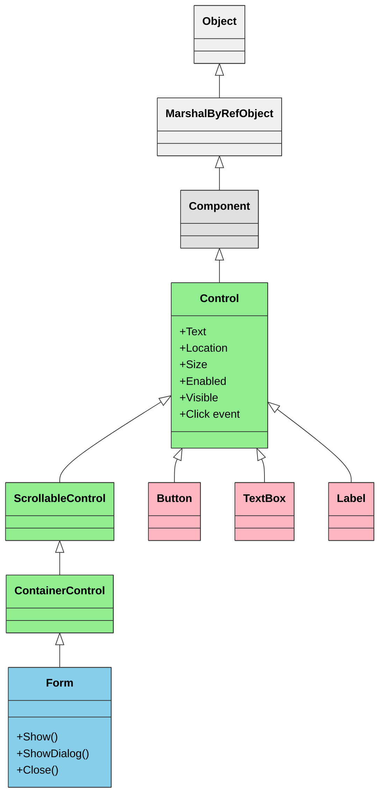
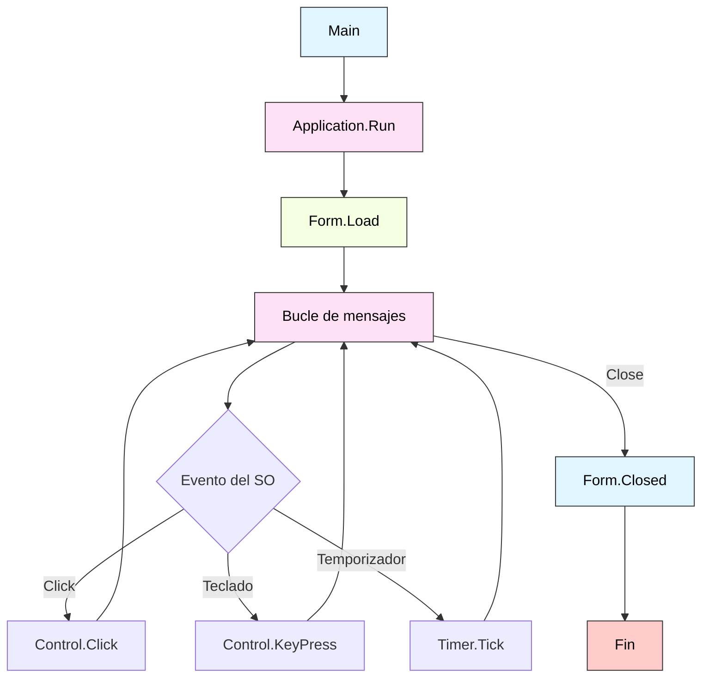

# 3. Windows Forms: La Primera GUI de .NET

- [3.1. Introducción a Windows Forms](#31-introducción-a-windows-forms)
  - [3.1.1. Contexto Histórico](#311-contexto-histórico)
- [3.2. Arquitectura de Windows Forms](#32-arquitectura-de-windows-forms)
  - [3.2.1. Jerarquía de Clases](#321-jerarquía-de-clases)
  - [3.2.2. El Application Loop](#322-el-application-loop)
- [3.3. Creación de un Formulario Básico](#33-creación-de-un-formulario-básico)
  - [3.3.1. Mediante Código (Forma Moderna - C# 14)](#331-mediante-código-forma-moderna---c-14)
  - [3.3.2. Mediante Diseñador Visual (Rider/Visual Studio)](#332-mediante-diseñador-visual-ridervisual-studio)
- [3.4. Controles Fundamentales de WinForms](#34-controles-fundamentales-de-winforms)
  - [3.4.1. Catálogo de Controles Básicos](#341-catálogo-de-controles-básicos)
  - [3.4.2. Ejemplo: Formulario de Registro](#342-ejemplo-formulario-de-registro)
- [3.5. Manejo de Eventos en WinForms](#35-manejo-de-eventos-en-winforms)
  - [3.5.1. Eventos Comunes](#351-eventos-comunes)
  - [3.5.2. Eventos de TextBox](#352-eventos-de-textbox)
  - [3.5.3. Timer y Eventos Periódicos](#353-timer-y-eventos-periódicos)
- [3.6. Layout y Posicionamiento](#36-layout-y-posicionamiento)
  - [3.6.1. Posicionamiento Absoluto vs. Anclado](#361-posicionamiento-absoluto-vs-anclado)
  - [3.6.2. TableLayoutPanel y FlowLayoutPanel](#362-tablelayoutpanel-y-flowlayoutpanel)
- [3.7. Menús y Barras de Herramientas](#37-menús-y-barra-de-herramientas)
  - [3.7.1. MenuStrip](#371-menustrip)
  - [3.7.2. ToolStrip](#372-toolstrip)
- [3.8. Ventanas de Diálogo](#38-ventanas-de-diálogo)
  - [3.8.1. MessageBox](#381-messagebox)
  - [3.8.2. OpenFileDialog y SaveFileDialog](#382-openfiledialog-y-savefiledialog)
- [3.9. Limitaciones de Windows Forms](#39-limitaciones-de-windows-forms)
  - [3.9.1. Comparación con WPF](#391-comparación-con-wpf)
  - [3.9.2. Cuándo Usar WinForms](#392-cuándo-usar-winforms)
- [3.10. Ejemplo Integrador: Calculadora](#310-ejemplo-integrador-calculadora)

## 3.1. Introducción a Windows Forms

**Windows Forms** (también conocido como WinForms) fue la primera tecnología de interfaz gráfica de usuario introducida en .NET Framework 1.0 en 2002. A pesar de ser considerada una tecnología *legacy* (heredada), sigue siendo ampliamente utilizada en el sector empresarial debido a su simplicidad, estabilidad y la gran cantidad de código existente.

> 📝 **Nota del Profesor**: WinForms es ideal para entender los fundamentos de la programación orientada a eventos. Aunque no lo usarás en proyectos profesionales nuevos, los conceptos (eventos, controladores, layout) se aplican directamente a WPF.

### 3.1.1. Contexto Histórico

Windows Forms fue la primera tecnología GUI de Microsoft para crear aplicaciones de escritorio nativas para Windows usando el framework .NET.

**Características principales:**

- ✅ **Modelo imperativo**: diseño mediante código o diseñador visual
- ✅ **Basado en GDI+**: gráficos 2D tradicionales de Windows
- ✅ **Event-driven**: arquitectura orientada a eventos
- ✅ **Fácil de aprender**: curva de aprendizaje suave
- ⚠️ **Solo Windows**: no es multiplataforma
- ⚠️ **Limitaciones visuales**: difícil personalización de la UI

---

## 3.2. Arquitectura de Windows Forms

### 3.2.1. Jerarquía de Clases



**Conceptos clave:**

- **Component**: clase base para todos los componentes (incluso los no visuales)
- **Control**: clase base para todos los controles visuales
- **Form**: clase que representa una ventana

### 3.2.2. El Application Loop

Todas las aplicaciones WinForms tienen un **bucle de mensajes** (*message loop*) que procesa eventos del sistema operativo:

```csharp
namespace MiPrimeraApp;

public static class Program
{
    [STAThread]
    static void Main()
    {
        Application.SetHighDpiMode(HighDpiMode.SystemAware);
        Application.EnableVisualStyles();
        Application.SetCompatibleTextRenderingDefault(false);
        
        // Inicia el bucle de mensajes con el formulario principal
        Application.Run(new FormPrincipal());
    }
}
```

**Atributo `[STAThread]`**: Indica que el modelo de threading COM es *Single-Threaded Apartment*, necesario para el portapapeles, drag & drop y algunas APIs de Windows.

---

## 3.3. Creación de un Formulario Básico

### 3.3.1. Mediante Código (Forma Moderna - C# 14)

```csharp
namespace EjemploBasico;

public class FormularioSaludo : Form
{
    // Primary constructor (C# 12+)
    public FormularioSaludo()
    {
        // Propiedades del formulario
        Text = "Mi Primera Aplicación";
        Size = new Size(400, 300);
        StartPosition = FormStartPosition.CenterScreen;
        
        // Crear controles
        Label etiqueta = new()
        {
            Text = "Introduce tu nombre:",
            Location = new Point(20, 20),
            Size = new Size(200, 25)
        };
        
        TextBox cajaTexto = new()
        {
            Location = new Point(20, 50),
            Size = new Size(340, 25)
        };
        
        Button boton = new()
        {
            Text = "Saludar",
            Location = new Point(20, 85),
            Size = new Size(100, 30)
        };
        
        Label resultado = new()
        {
            Location = new Point(20, 125),
            Size = new Size(340, 25),
            Font = new Font("Arial", 12, FontStyle.Bold),
            ForeColor = Color.Blue
        };
        
        // Evento del botón
        boton.Click += (sender, e) =>
        {
            if (string.IsNullOrWhiteSpace(cajaTexto.Text))
            {
                MessageBox.Show("Por favor, introduce tu nombre.", "Error",
                    MessageBoxButtons.OK, MessageBoxIcon.Warning);
                return;
            }
            
            resultado.Text = $"¡Hola, {cajaTexto.Text}!";
        };
        
        // Añadir controles al formulario
        Controls.AddRange([etiqueta, cajaTexto, boton, resultado]);
    }
}
```

### 3.3.2. Mediante Diseñador Visual (Rider/Visual Studio)

El diseñador genera código en un archivo parcial `.Designer.cs`:

```csharp
// FormularioSaludo.cs
namespace EjemploDisenador;

public partial class FormularioSaludo : Form
{
    public FormularioSaludo()
    {
        InitializeComponent(); // Llama al código generado
        
        // Eventos personalizados
        botonSaludar.Click += BotonSaludar_Click;
    }
    
    private void BotonSaludar_Click(object? sender, EventArgs e)
    {
        if (string.IsNullOrWhiteSpace(cajaTextoNombre.Text))
        {
            MessageBox.Show("Por favor, introduce tu nombre.", "Error",
                MessageBoxButtons.OK, MessageBoxIcon.Warning);
            return;
        }
        
        etiquetaResultado.Text = $"¡Hola, {cajaTextoNombre.Text}!";
    }
}
```

```csharp
// FormularioSaludo.Designer.cs (generado automáticamente)
namespace EjemploDisenador;

partial class FormularioSaludo
{
    private System.ComponentModel.IContainer components = null;
    private Button botonSaludar;
    private TextBox cajaTextoNombre;
    private Label etiquetaResultado;
    
    protected override void Dispose(bool disposing)
    {
        if (disposing && (components != null))
        {
            components.Dispose();
        }
        base.Dispose(disposing);
    }
    
    private void InitializeComponent()
    {
        this.botonSaludar = new Button();
        this.cajaTextoNombre = new TextBox();
        this.etiquetaResultado = new Label();
        this.SuspendLayout();
        
        // botonSaludar
        this.botonSaludar.Location = new Point(20, 85);
        this.botonSaludar.Name = "botonSaludar";
        this.botonSaludar.Size = new Size(100, 30);
        this.botonSaludar.Text = "Saludar";
        
        // cajaTextoNombre
        this.cajaTextoNombre.Location = new Point(20, 50);
        this.cajaTextoNombre.Size = new Size(340, 25);
        
        // etiquetaResultado
        this.etiquetaResultado.Location = new Point(20, 125);
        this.etiquetaResultado.Size = new Size(340, 25);
        
        // FormularioSaludo
        this.ClientSize = new Size(400, 300);
        this.Controls.Add(this.botonSaludar);
        this.Controls.Add(this.cajaTextoNombre);
        this.Controls.Add(this.etiquetaResultado);
        this.Name = "FormularioSaludo";
        this.Text = "Mi Primera Aplicación";
        this.ResumeLayout(false);
    }
}
```

---

## 3.4. Controles Fundamentales de WinForms

### 3.4.1. Catálogo de Controles Básicos

| Control | Propósito | Eventos Principales |
|---------|-----------|---------------------|
| `Label` | Mostrar texto estático | (ninguno, es solo lectura) |
| `TextBox` | Entrada de texto | `TextChanged`, `KeyPress` |
| `Button` | Botón clicable | `Click` |
| `CheckBox` | Casilla de verificación | `CheckedChanged` |
| `RadioButton` | Opción exclusiva | `CheckedChanged` |
| `ComboBox` | Lista desplegable | `SelectedIndexChanged` |
| `ListBox` | Lista de elementos | `SelectedIndexChanged` |
| `DateTimePicker` | Selector de fecha/hora | `ValueChanged` |
| `PictureBox` | Mostrar imágenes | `Click` |
| `ProgressBar` | Barra de progreso | (ninguno, es visual) |

### 3.4.2. Ejemplo: Formulario de Registro

```csharp
namespace FormularioRegistro;

public class FormRegistro : Form
{
    // Controles
    private readonly TextBox txtNombre;
    private readonly TextBox txtEmail;
    private readonly DateTimePicker dtpFechaNacimiento;
    private readonly ComboBox cmbPais;
    private readonly CheckBox chkAceptarTerminos;
    private readonly Button btnRegistrar;
    private readonly Label lblMensaje;
    
    public FormRegistro()
    {
        Text = "Registro de Usuario";
        Size = new Size(450, 400);
        StartPosition = FormStartPosition.CenterScreen;
        
        // Label y TextBox - Nombre
        Label lblNombre = new()
        {
            Text = "Nombre:",
            Location = new Point(20, 20),
            Size = new Size(100, 25)
        };
        
        txtNombre = new TextBox
        {
            Location = new Point(130, 20),
            Size = new Size(280, 25)
        };
        
        // Label y TextBox - Email
        Label lblEmail = new()
        {
            Text = "Email:",
            Location = new Point(20, 60),
            Size = new Size(100, 25)
        };
        
        txtEmail = new TextBox
        {
            Location = new Point(130, 60),
            Size = new Size(280, 25)
        };
        
        // Label y DateTimePicker - Fecha de Nacimiento
        Label lblFecha = new()
        {
            Text = "Fecha Nacimiento:",
            Location = new Point(20, 100),
            Size = new Size(100, 25)
        };
        
        dtpFechaNacimiento = new DateTimePicker
        {
            Location = new Point(130, 100),
            Size = new Size(280, 25),
            Format = DateTimePickerFormat.Short,
            MaxDate = DateTime.Today
        };
        
        // Label y ComboBox - País
        Label lblPais = new()
        {
            Text = "País:",
            Location = new Point(20, 140),
            Size = new Size(100, 25)
        };
        
        cmbPais = new ComboBox
        {
            Location = new Point(130, 140),
            Size = new Size(280, 25),
            DropDownStyle = ComboBoxStyle.DropDownList
        };
        cmbPais.Items.AddRange(["España", "México", "Argentina", "Colombia", "Chile"]);
        cmbPais.SelectedIndex = 0;
        
        // CheckBox - Términos
        chkAceptarTerminos = new CheckBox
        {
            Text = "Acepto los términos y condiciones",
            Location = new Point(20, 180),
            Size = new Size(300, 25)
        };
        chkAceptarTerminos.CheckedChanged += (s, e) => 
            btnRegistrar.Enabled = chkAceptarTerminos.Checked;
        
        // Botón Registrar
        btnRegistrar = new Button
        {
            Text = "Registrar",
            Location = new Point(130, 220),
            Size = new Size(120, 35),
            Enabled = false
        };
        btnRegistrar.Click += BtnRegistrar_Click;
        
        // Label Mensaje
        lblMensaje = new Label
        {
            Location = new Point(20, 270),
            Size = new Size(400, 60),
            Font = new Font("Arial", 10),
            ForeColor = Color.Green,
            Text = ""
        };
        
        // Añadir controles
        Controls.AddRange([
            lblNombre, txtNombre,
            lblEmail, txtEmail,
            lblFecha, dtpFechaNacimiento,
            lblPais, cmbPais,
            chkAceptarTerminos,
            btnRegistrar,
            lblMensaje
        ]);
    }
    
    private void BtnRegistrar_Click(object? sender, EventArgs e)
    {
        // Validaciones
        if (string.IsNullOrWhiteSpace(txtNombre.Text))
        {
            MostrarError("El nombre es obligatorio.");
            return;
        }
        
        if (!EsEmailValido(txtEmail.Text))
        {
            MostrarError("El email no es válido.");
            return;
        }
        
        int edad = DateTime.Today.Year - dtpFechaNacimiento.Value.Year;
        if (edad < 18)
        {
            MostrarError("Debes ser mayor de 18 años.");
            return;
        }
        
        // Registro exitoso
        lblMensaje.ForeColor = Color.Green;
        lblMensaje.Text = $"✅ Usuario registrado correctamente:\n" +
                         $"Nombre: {txtNombre.Text}\n" +
                         $"Email: {txtEmail.Text}\n" +
                         $"País: {cmbPais.SelectedItem}";
        
        btnRegistrar.Enabled = false;
    }
    
    private void MostrarError(string mensaje)
    {
        lblMensaje.ForeColor = Color.Red;
        lblMensaje.Text = $"❌ {mensaje}";
    }
    
    private bool EsEmailValido(string email)
    {
        return !string.IsNullOrWhiteSpace(email) && email.Contains('@') && email.Contains('.');
    }
}
```

---

## 3.5. Manejo de Eventos en WinForms

### 3.5.1. Eventos Comunes

```csharp
public class EventosEjemplo : Form
{
    public EventosEjemplo()
    {
        Button boton = new() { Text = "Clic aquí", Location = new Point(10, 10) };
        
        // Evento Click
        boton.Click += (s, e) => MessageBox.Show("¡Click!");
        
        // Evento MouseEnter / MouseLeave
        boton.MouseEnter += (s, e) => boton.BackColor = Color.LightBlue;
        boton.MouseLeave += (s, e) => boton.BackColor = SystemColors.Control;
        
        // Evento KeyDown en el formulario
        KeyPreview = true; // Necesario para capturar teclas en el Form
        KeyDown += (s, e) =>
        {
            if (e.KeyCode == Keys.Escape)
            {
                Close();
            }
        };
        
        Controls.Add(boton);
    }
}
```

### 3.5.2. Eventos de TextBox

```csharp
public class TextBoxEventos : Form
{
    public TextBoxEventos()
    {
        TextBox txt = new() { Location = new Point(10, 10), Size = new Size(200, 25) };
        Label lbl = new() { Location = new Point(10, 50), Size = new Size(300, 25) };
        
        // TextChanged: se dispara en cada cambio
        txt.TextChanged += (s, e) =>
        {
            lbl.Text = $"Caracteres: {txt.Text.Length}";
        };
        
        // KeyPress: se dispara al presionar tecla
        txt.KeyPress += (s, e) =>
        {
            // Solo permitir números
            if (!char.IsDigit(e.KeyChar) && !char.IsControl(e.KeyChar))
            {
                e.Handled = true; // Cancelar el carácter
            }
        };
        
        Controls.AddRange([txt, lbl]);
    }
}
```

### 3.5.3. Timer y Eventos Periódicos

```csharp
namespace RelojDigital;

public class FormReloj : Form
{
    private readonly Label lblHora;
    private readonly System.Windows.Forms.Timer timer;
    
    public FormReloj()
    {
        Text = "Reloj Digital";
        Size = new Size(300, 150);
        
        lblHora = new Label
        {
            Font = new Font("Consolas", 24, FontStyle.Bold),
            ForeColor = Color.DarkBlue,
            AutoSize = false,
            TextAlign = ContentAlignment.MiddleCenter,
            Dock = DockStyle.Fill
        };
        
        timer = new System.Windows.Forms.Timer
        {
            Interval = 1000 // 1 segundo
        };
        timer.Tick += (s, e) =>
        {
            lblHora.Text = DateTime.Now.ToString("HH:mm:ss");
        };
        timer.Start();
        
        // Mostrar hora inicial
        lblHora.Text = DateTime.Now.ToString("HH:mm:ss");
        
        Controls.Add(lblHora);
    }
    
    protected override void Dispose(bool disposing)
    {
        timer?.Stop();
        timer?.Dispose();
        base.Dispose(disposing);
    }
}
```

---

## 3.6. Layout y Posicionamiento

### 3.6.1. Posicionamiento Absoluto vs. Anclado

```csharp
public class LayoutEjemplo : Form
{
    public LayoutEjemplo()
    {
        Size = new Size(600, 400);
        
        // Posicionamiento absoluto (fixed)
        Button btn1 = new()
        {
            Text = "Botón Fijo",
            Location = new Point(10, 10),
            Size = new Size(100, 30)
        };
        
        // Anclaje (Anchor)
        TextBox txt = new()
        {
            Location = new Point(10, 50),
            Size = new Size(560, 25),
            Anchor = AnchorStyles.Top | AnchorStyles.Left | AnchorStyles.Right
            // Se expande horizontalmente al redimensionar
        };
        
        // Dock (acoplar a un lado)
        Panel panelInferior = new()
        {
            Dock = DockStyle.Bottom,
            Height = 50,
            BackColor = Color.LightGray
        };
        
        Button btnCerrar = new()
        {
            Text = "Cerrar",
            Location = new Point(10, 10),
            Size = new Size(100, 30)
        };
        btnCerrar.Click += (s, e) => Close();
        panelInferior.Controls.Add(btnCerrar);
        
        Controls.AddRange([btn1, txt, panelInferior]);
    }
}
```

### 3.6.2. TableLayoutPanel y FlowLayoutPanel

```csharp
public class LayoutAvanzado : Form
{
    public LayoutAvanzado()
    {
        Text = "Layouts Avanzados";
        Size = new Size(500, 400);
        
        // TableLayoutPanel: diseño de tabla
        TableLayoutPanel tabla = new()
        {
            Dock = DockStyle.Top,
            Height = 150,
            ColumnCount = 2,
            RowCount = 3
        };
        
        tabla.Controls.Add(new Label { Text = "Nombre:" }, 0, 0);
        tabla.Controls.Add(new TextBox(), 1, 0);
        tabla.Controls.Add(new Label { Text = "Apellido:" }, 0, 1);
        tabla.Controls.Add(new TextBox(), 1, 1);
        tabla.Controls.Add(new Label { Text = "Email:" }, 0, 2);
        tabla.Controls.Add(new TextBox(), 1, 2);
        
        // FlowLayoutPanel: flujo horizontal/vertical
        FlowLayoutPanel flujo = new()
        {
            Dock = DockStyle.Fill,
            FlowDirection = FlowDirection.LeftToRight,
            WrapContents = true
        };
        
        for (int i = 1; i <= 10; i++)
        {
            flujo.Controls.Add(new Button
            {
                Text = $"Botón {i}",
                Size = new Size(100, 40),
                Margin = new Padding(5)
            });
        }
        
        Controls.AddRange([tabla, flujo]);
    }
}
```

---

## 3.7. Menús y Barras de Herramientas

### 3.7.1. MenuStrip

```csharp
public class FormConMenu : Form
{
    public FormConMenu()
    {
        Text = "Aplicación con Menú";
        Size = new Size(600, 400);
        
        MenuStrip menu = new();
        
        // Menú Archivo
        ToolStripMenuItem menuArchivo = new("Archivo");
        menuArchivo.DropDownItems.Add("Nuevo", null, (s, e) => MessageBox.Show("Nuevo"));
        menuArchivo.DropDownItems.Add("Abrir", null, (s, e) => MessageBox.Show("Abrir"));
        menuArchivo.DropDownItems.Add(new ToolStripSeparator());
        menuArchivo.DropDownItems.Add("Salir", null, (s, e) => Close());
        
        // Menú Edición
        ToolStripMenuItem menuEdicion = new("Edición");
        menuEdicion.DropDownItems.Add("Copiar", null, (s, e) => MessageBox.Show("Copiar"));
        menuEdicion.DropDownItems.Add("Pegar", null, (s, e) => MessageBox.Show("Pegar"));
        
        // Menú Ayuda
        ToolStripMenuItem menuAyuda = new("Ayuda");
        menuAyuda.DropDownItems.Add("Acerca de...", null, (s, e) => 
            MessageBox.Show("Mi Aplicación v1.0", "Acerca de", 
                MessageBoxButtons.OK, MessageBoxIcon.Information));
        
        menu.Items.AddRange([menuArchivo, menuEdicion, menuAyuda]);
        
        MainMenuStrip = menu;
        Controls.Add(menu);
    }
}
```

### 3.7.2. ToolStrip

```csharp
public class FormConToolbar : Form
{
    public FormConToolbar()
    {
        Text = "Aplicación con Toolbar";
        Size = new Size(600, 400);
        
        ToolStrip toolbar = new();
        
        // Botones de la barra
        ToolStripButton btnNuevo = new()
        {
            Text = "Nuevo",
            DisplayStyle = ToolStripItemDisplayStyle.ImageAndText,
            Image = SystemIcons.WinLogo.ToBitmap() // En producción, usar iconos propios
        };
        btnNuevo.Click += (s, e) => MessageBox.Show("Nuevo documento");
        
        ToolStripButton btnGuardar = new()
        {
            Text = "Guardar",
            DisplayStyle = ToolStripItemDisplayStyle.ImageAndText
        };
        btnGuardar.Click += (s, e) => MessageBox.Show("Guardando...");
        
        toolbar.Items.AddRange([btnNuevo, new ToolStripSeparator(), btnGuardar]);
        
        Controls.Add(toolbar);
    }
}
```

---

## 3.8. Ventanas de Diálogo

### 3.8.1. MessageBox

```csharp
// Información
MessageBox.Show("Operación completada correctamente.", "Éxito",
    MessageBoxButtons.OK, MessageBoxIcon.Information);

// Advertencia
MessageBox.Show("¿Estás seguro de eliminar este archivo?", "Confirmar",
    MessageBoxButtons.YesNo, MessageBoxIcon.Warning);

// Error
MessageBox.Show("No se pudo conectar al servidor.", "Error",
    MessageBoxButtons.OK, MessageBoxIcon.Error);

// Pregunta con respuesta
DialogResult resultado = MessageBox.Show(
    "¿Deseas guardar los cambios?", "Guardar",
    MessageBoxButtons.YesNoCancel, MessageBoxIcon.Question);

if (resultado == DialogResult.Yes)
{
    // Guardar
}
else if (resultado == DialogResult.No)
{
    // No guardar
}
else
{
    // Cancelar
}
```

### 3.8.2. OpenFileDialog y SaveFileDialog

```csharp
// Abrir archivo
using OpenFileDialog dialogo = new()
{
    Title = "Seleccionar archivo",
    Filter = "Archivos de texto (*.txt)|*.txt|Todos los archivos (*.*)|*.*",
    FilterIndex = 1
};

if (dialogo.ShowDialog() == DialogResult.OK)
{
    string contenido = File.ReadAllText(dialogo.FileName);
    MessageBox.Show($"Archivo: {dialogo.FileName}\nTamaño: {contenido.Length} caracteres");
}

// Guardar archivo
using SaveFileDialog dialogoGuardar = new()
{
    Title = "Guardar archivo",
    Filter = "Archivos de texto (*.txt)|*.txt",
    DefaultExt = "txt"
};

if (dialogoGuardar.ShowDialog() == DialogResult.OK)
{
    File.WriteAllText(dialogoGuardar.FileName, "Contenido del archivo");
    MessageBox.Show("Archivo guardado correctamente.");
}
```

> 💡 **Tip del Examinador**: Pregunta clásica de examen: "¿Por qué usar WinForms o WPF?"答: WinForms para apps simples/rápidas o legacy. WPF para apps empresariales con requisitos visuales/complejos.

---

## 3.9. Limitaciones de Windows Forms

### 3.9.1. Comparación con WPF

| Aspecto | Windows Forms | WPF |
|---------|---------------|-----|
| **Modelo de diseño** | Imperativo (código) | Declarativo (XAML) |
| **Renderizado** | GDI+ (CPU) | DirectX (GPU) |
| **Estilos y temas** | Limitado, manual | Rico, basado en plantillas |
| **Data Binding** | Básico, unidireccional | Avanzado, bidireccional |
| **Arquitectura** | MVC manual | MVVM nativo |
| **Personalización** | Difícil | Fácil |
| **Resolución** | Problemas con HiDPI | Soporte nativo HiDPI |
| **Animaciones** | Limitadas | Nativas y fluidas |

### 3.9.2. Cuándo Usar WinForms

✅ **Usar WinForms cuando:**

- Necesites una aplicación simple y rápida
- Tengas código legacy que mantener
- El equipo no conozca XAML
- La interfaz sea funcional sin necesidades estéticas

❌ **Evitar WinForms cuando:**

- Necesites interfaces modernas y atractivas
- Requieras animaciones complejas
- La aplicación deba escalar a múltiples plataformas
- Necesites arquitectura MVVM robusta

---

## 3.10. Ejemplo Integrador: Calculadora

```csharp
namespace Calculadora;

public class FormCalculadora : Form
{
    private readonly TextBox txtDisplay;
    private double valorActual = 0;
    private double valorAnterior = 0;
    private string operacion = "";
    
    public FormCalculadora()
    {
        Text = "Calculadora";
        Size = new Size(300, 400);
        StartPosition = FormStartPosition.CenterScreen;
        FormBorderStyle = FormBorderStyle.FixedDialog;
        MaximizeBox = false;
        
        // Display
        txtDisplay = new TextBox
        {
            Location = new Point(10, 10),
            Size = new Size(260, 30),
            Font = new Font("Consolas", 16, FontStyle.Bold),
            TextAlign = HorizontalAlignment.Right,
            ReadOnly = true,
            Text = "0"
        };
        
        Controls.Add(txtDisplay);
        
        // Botones
        string[] botones = ["7", "8", "9", "/",
                           "4", "5", "6", "*",
                           "1", "2", "3", "-",
                           "0", "C", "=", "+"];
        
        int x = 10, y = 50;
        foreach (string texto in botones)
        {
            Button btn = new()
            {
                Text = texto,
                Location = new Point(x, y),
                Size = new Size(60, 60),
                Font = new Font("Arial", 16, FontStyle.Bold)
            };
            
            btn.Click += BotonClick;
            Controls.Add(btn);
            
            x += 65;
            if (x > 200)
            {
                x = 10;
                y += 65;
            }
        }
    }
    
    private void BotonClick(object? sender, EventArgs e)
    {
        if (sender is not Button boton) return;
        
        string texto = boton.Text;
        
        if (double.TryParse(texto, out double numero))
        {
            // Es un número
            if (txtDisplay.Text == "0" || operacion != "")
            {
                txtDisplay.Text = texto;
                if (operacion != "") operacion = "";
            }
            else
            {
                txtDisplay.Text += texto;
            }
        }
        else if (texto == "C")
        {
            txtDisplay.Text = "0";
            valorActual = 0;
            valorAnterior = 0;
            operacion = "";
        }
        else if (texto == "=")
        {
            CalcularResultado();
        }
        else
        {
            // Es una operación
            if (operacion != "")
            {
                CalcularResultado();
            }
            
            valorAnterior = double.Parse(txtDisplay.Text);
            operacion = texto;
        }
    }
    
    private void CalcularResultado()
    {
        if (operacion == "") return;
        
        valorActual = double.Parse(txtDisplay.Text);
        double resultado = operacion switch
        {
            "+" => valorAnterior + valorActual,
            "-" => valorAnterior - valorActual,
            "*" => valorAnterior * valorActual,
            "/" => valorActual != 0 ? valorAnterior / valorActual : 0,
            _ => 0
        };
        
        txtDisplay.Text = resultado.ToString();
        operacion = "";
        valorAnterior = resultado;
    }
}
```

---

## Resumen

| Concepto | Descripción |
|----------|-------------|
| **Windows Forms** | Primera tecnología GUI de .NET (2002), basada en GDI+ |
| **Modelo imperativo** | Diseño mediante código C#, no declarativo |
| **Controles fundamentales** | Button, TextBox, Label, ComboBox, ListBox, CheckBox, RadioButton |
| **Event-driven** | Arquitectura basada en eventos (Click, TextChanged, etc.) |
| **Layout** | Posicionamiento absoluto (Location) y anclaje (Anchor/Dock) |
| **Limitaciones** | Solo Windows, personalización limitada, sin data binding avanzado |

### Puntos clave

1. **WinForms usa modelo imperativo**: Se programa todo en C#, a diferencia de XAML en WPF.
2. **Jerarquía de clases**: Form hereda de ContainerControl → ScrollableControl → Control → Component → MarshalByRefObject → Object.
3. **Eventos**: El patrón es subscriptions manuales (`button.Click += handler`).
4. **Layout**: Usa `Location` + `Size` para posicionamiento, y `Anchor`/`Dock` para redimensionado.
5. **Data binding**: Básico y unidireccional, nada comparado con WPF.

> 📝 **Nota del Profesor**: WinForms es ideal para entender los fundamentos de la programación orientada a eventos. Aunque no lo usarás en proyectos profesionales nuevos, los conceptos (eventos, controladores, layout) se aplican directamente a WPF. Si dominas WinForms, entenderás mejor por qué WPF改进 (mejora) con XAML y data binding.

> 💡 **Tip del Examinador**: Pregunta clásica de examen: "¿Por qué usar WinForms o WPF?" Respuesta: WinForms para apps simples/rápidas o legacy. WPF para apps empresariales con requisitos visuales/complejos. En el examen pueden preguntarte sobre la diferencia fundamental: WinForms es imperativo (código), WPF es declarativo (XAML).

---

### Diagrama: Ciclo de vida de una aplicación WinForms



---

## Referencias

- [Windows Forms en .NET](https://learn.microsoft.com/dotnet/desktop/winforms/)
- [Control Class Documentation](https://learn.microsoft.com/dotnet/api/system.windows.forms.control)
- Libro: *Programming Windows Forms* - Charles Petzold


