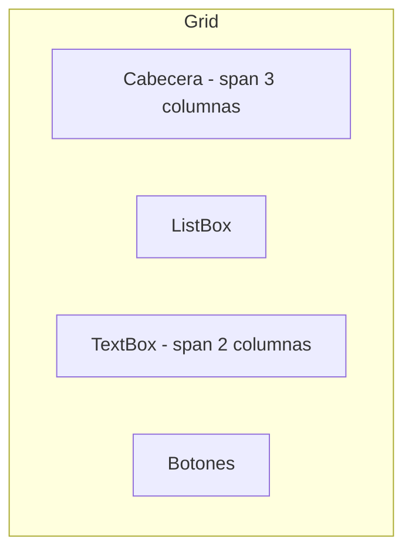
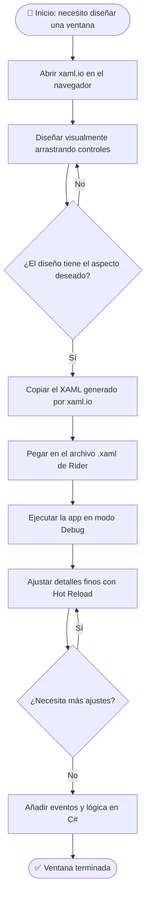

# 4. Introducción a Windows Presentation Foundation (WPF)

- [4.1. ¿Qué es WPF?](#41-qué-es-wpf)
  - [4.1.1. ¿Por qué existe WPF?](#411-por-qué-existe-wpf)
- [4.2. XAML: eXtensible Application Markup Language](#42-xaml-extensible-application-markup-language)
  - [4.2.1. ¿Qué es XAML?](#421-qué-es-xaml)
  - [4.2.2. Estructura Básica de un Archivo XAML](#422-estructura-básica-de-un-archivo-xaml)
  - [4.2.3. Relación entre XAML y C#](#423-relación-entre-xaml-y-c)
  - [4.2.4. Sintaxis XAML Avanzada](#424-sintaxis-xaml-avanzada)
    - [4.2.4.1. Propiedades como Atributos vs. Elementos](#4241-propiedades-como-atributos-vs-elementos)
    - [4.2.4.2. Content Property](#4242-content-property)
    - [4.2.4.3. Markup Extensions](#4243-markup-extensions)
- [4.3. Contenedores de Layout](#43-contenedores-de-layout)
  - [4.3.1. Grid](#431-grid)
  - [4.3.2. StackPanel](#432-stackpanel)
  - [4.3.3. DockPanel](#433-dockpanel)
  - [4.3.4. WrapPanel](#434-wrappanel)
  - [4.3.5. Canvas](#435-canvas)
  - [4.3.6. UniformGrid](#436-uniformgrid)
  - [4.3.7. Tabla Comparativa de Layouts](#437-tabla-comparativa-de-layouts)
- [4.4. Controles Básicos de WPF](#44-controles-básicos-de-wpf)
  - [4.4.1. Controles de Texto](#441-controles-de-texto)
    - [4.4.1.1. TextBlock](#4411-textblock)
    - [4.4.1.2. TextBox](#4412-textbox)
    - [4.4.1.3. PasswordBox](#4413-passwordbox)
  - [4.4.2. Controles de Acción](#442-controles-de-acción)
    - [4.4.2.1. Button](#4421-button)
    - [4.4.2.2. CheckBox](#4422-checkbox)
    - [4.4.2.3. RadioButton](#4423-radiobutton)
  - [4.4.3. Controles de Selección](#443-controles-de-selección)
    - [4.4.3.1. ComboBox](#4431-combobox)
    - [4.4.3.2. ListBox](#4432-listbox)
  - [4.4.4. Controles de Visualización](#444-controles-de-visualización)
    - [4.4.4.1. Image](#4441-image)
    - [4.4.4.2. ProgressBar](#4442-progressbar)
  - [4.4.5. Controles de Fecha y Hora](#445-controles-de-fecha-y-hora)
    - [4.4.5.1. DatePicker](#4451-datepicker)
    - [4.4.5.2. Calendar](#4452-calendar)
- [4.5. Propiedades Comunes de los Controles](#45-propiedades-comunes-de-los-controles)
  - [4.5.1. Propiedades de Tamaño y Posición](#451-propiedades-de-tamaño-y-posición)
  - [4.5.2. Propiedades de Alineación](#452-propiedades-de-alineación)
  - [4.5.3. Propiedades de Apariencia](#453-propiedades-de-apariencia)
- [4.6. Eventos en WPF](#46-eventos-en-wpf)
  - [4.6.1. Eventos Más Comunes](#461-eventos-más-comunes)
  - [4.6.2. Routed Events](#462-routed-events)
- [4.7. Hot Reload en Rider](#47-hot-reload-en-rider)
  - [4.7.1. ¿Qué es y por qué importa?](#471-qué-es-y-por-qué-importa)
  - [4.7.2. Configuración Detallada en Rider](#472-configuración-detallada-en-rider)
  - [4.7.3. Qué Funciona y Qué No — Tabla Comparativa](#473-qué-funciona-y-qué-no-—-tabla-comparativa)
  - [4.7.4. Mejores Prácticas con Hot Reload](#474-mejores-prácticas-con-hot-reload)
- [4.8. Prototipado Rápido con xaml.io](#48-prototipado-rápido-con-xamlio)
  - [4.8.1. El Problema: Rider No Tiene Diseñador Visual WPF](#481-el-problema-rider-no-tiene-diseñador-visual-wpf)
  - [4.8.2. ¿Qué es xaml.io?](#482-qué-es-xamlio)
  - [4.8.3. Flujo de Trabajo Completo: xaml.io + Rider](#483-flujo-de-trabajo-completo-xamlio-+-rider)
  - [4.8.4. Ejemplos de XAML Generado por xaml.io](#484-ejemplos-de-xaml-generado-por-xamlio)
    - [4.8.4.1. Fragmento 1 — Formulario de login básico](#4841-fragmento-1-—-formulario-de-login-básico)
    - [4.8.4.2. Fragmento 2 — Tarjeta de producto](#4842-fragmento-2-—-tarjeta-de-producto)
    - [4.8.4.3. Fragmento 3 — Barra de herramientas con botones de acción](#4843-fragmento-3-—-barra-de-herramientas-con-botones-de-acción)
    - [4.8.4.4. Fragmento 4 — Dashboard con Grid de métricas](#4844-fragmento-4-—-dashboard-con-grid-de-métricas)
  - [4.8.5. Integrar el XAML de xaml.io en un Proyecto Rider](#485-integrar-el-xaml-de-xamlio-en-un-proyecto-rider)
- [4.9. Ejemplo Completo: Formulario de Contacto](#49-ejemplo-completo-formulario-de-contacto)
  - [4.9.1. XAML](#491-xaml)
  - [4.9.2. Code-Behind (C#)](#492-code-behind-c)

## 4.1. ¿Qué es WPF?

### 4.1.1. ¿Por qué existe WPF?

Windows Forms tenía limitaciones fundamentales:

- ❌ Renderizado por CPU (GDI+) → interfaces lentas
- ❌ Personalización limitada de controles
- ❌ Difícil separación entre diseño y lógica
- ❌ Problemas con pantallas de alta resolución (HiDPI)
- ❌ Animaciones limitadas

**WPF soluciona estos problemas:**

- ✅ Renderizado por GPU (DirectX) → interfaces fluidas
- ✅ Personalización total mediante estilos y plantillas
- ✅ Separación clara: XAML (diseño) + C# (lógica)
- ✅ Soporte nativo para HiDPI/DPI-awareness
- ✅ Motor de animaciones integrado
- ✅ Data binding bidireccional avanzado
- ✅ Arquitectura MVVM nativa

> 📝 **Nota del Profesor**: WPF es EL ESTÁNDAR para aplicaciones Windows empresariales. Si dominas WPF, MAUI será muy fácil (comparte XAML). Invierte tiempo en entender bien XAML y el data binding.

---

## 4.2. XAML: eXtensible Application Markup Language

### 4.2.1. ¿Qué es XAML?

**XAML** (pronunciado "zaml") es un lenguaje de marcado declarativo basado en XML para definir interfaces de usuario. Es similar a HTML pero orientado a crear objetos .NET.

**Características clave:**

- 📝 **Declarativo**: describes *qué* quieres, no *cómo* conseguirlo
- 🎨 **Separación de responsabilidades**: diseño (XAML) vs. lógica (C#)
- 🔧 **Herramientas visuales**: diseñadores WYSIWYG en Rider/Visual Studio
- 🔄 **Sincronización**: cambios en XAML reflejan inmediatamente en el diseñador

### 4.2.2. Estructura Básica de un Archivo XAML

```xml
<Window x:Class="MiApp.MainWindow"
        xmlns="http://schemas.microsoft.com/winfx/2006/xaml/presentation"
        xmlns:x="http://schemas.microsoft.com/winfx/2006/xaml"
        Title="Mi Ventana WPF" Height="450" Width="800">
    <Grid>
        <!-- Contenido aquí -->
    </Grid>
</Window>
```

**Desglose:**

| Elemento | Descripción |
|----------|-------------|
| `x:Class` | Clase C# asociada al XAML (code-behind) |
| `xmlns` | Namespace por defecto de WPF |
| `xmlns:x` | Namespace de extensiones XAML |
| `Title`, `Height`, `Width` | Propiedades del Window |
| `<Grid>` | Contenedor de layout |

### 4.2.3. Relación entre XAML y C#

```xml
<!-- MainWindow.xaml -->
<Window x:Class="MiApp.MainWindow"
        xmlns="http://schemas.microsoft.com/winfx/2006/xaml/presentation"
        xmlns:x="http://schemas.microsoft.com/winfx/2006/xaml"
        Title="Contador" Height="200" Width="300">
    <StackPanel Margin="20">
        <TextBlock x:Name="txtContador" Text="0" FontSize="48" 
                   HorizontalAlignment="Center" />
        <Button x:Name="btnIncrementar" Content="Incrementar" 
                Height="40" Margin="0,20,0,0" />
    </StackPanel>
</Window>
```

```csharp
// MainWindow.xaml.cs
namespace MiApp;

public partial class MainWindow : Window
{
    private int contador = 0;
    
    public MainWindow()
    {
        InitializeComponent(); // Carga el XAML
        
        // Asignar eventos
        btnIncrementar.Click += (s, e) =>
        {
            contador++;
            txtContador.Text = contador.ToString();
        };
    }
}
```

### 4.2.4. Sintaxis XAML Avanzada

#### 4.2.4.1. Propiedades como Atributos vs. Elementos

```xml
<!-- Forma 1: Atributo -->
<Button Content="Haz clic" Background="Blue" />

<!-- Forma 2: Elemento (cuando el valor es complejo) -->
<Button>
    <Button.Content>
        <StackPanel>
            <Image Source="icon.png" Width="32" Height="32" />
            <TextBlock Text="Con Icono" />
        </StackPanel>
    </Button.Content>
    <Button.Background>
        <LinearGradientBrush>
            <GradientStop Color="Blue" Offset="0" />
            <GradientStop Color="LightBlue" Offset="1" />
        </LinearGradientBrush>
    </Button.Background>
</Button>
```

#### 4.2.4.2. Content Property

Cada control tiene una propiedad `Content` implícita:

```xml
<!-- Forma larga -->
<Button>
    <Button.Content>
        Texto del botón
    </Button.Content>
</Button>

<!-- Forma corta (Content es implícito) -->
<Button>
    Texto del botón
</Button>

<!-- Para paneles, la propiedad implícita es Children -->
<StackPanel>
    <TextBlock Text="Elemento 1" />
    <TextBlock Text="Elemento 2" />
</StackPanel>
```

#### 4.2.4.3. Markup Extensions

```xml
<!-- StaticResource: referencia a un recurso -->
<Button Background="{StaticResource MiColor}" />

<!-- Binding: vinculación de datos -->
<TextBlock Text="{Binding NombrePropiedad}" />

<!-- x:Null: valor nulo -->
<Button Background="{x:Null}" />

<!-- x:Static: acceso a miembros estáticos -->
<TextBlock Text="{x:Static sys:Environment.MachineName}" />
```

---

## 4.3. Contenedores de Layout

### 4.3.1. Grid

El **Grid** divide el espacio en filas y columnas, similar a una tabla HTML. Es el contenedor más versátil y usado.

```xml
<Grid>
    <!-- Definir filas y columnas -->
    <Grid.RowDefinitions>
        <RowDefinition Height="Auto" />      <!-- Altura automática -->
        <RowDefinition Height="*" />         <!-- Toma espacio restante -->
        <RowDefinition Height="50" />        <!-- Altura fija -->
    </Grid.RowDefinitions>
    
    <Grid.ColumnDefinitions>
        <ColumnDefinition Width="200" />     <!-- Ancho fijo -->
        <ColumnDefinition Width="2*" />      <!-- 2 partes del espacio -->
        <ColumnDefinition Width="*" />       <!-- 1 parte del espacio -->
    </Grid.ColumnDefinitions>
    
    <!-- Colocar elementos -->
    <TextBlock Text="Cabecera" Grid.Row="0" Grid.Column="0" 
               Grid.ColumnSpan="3" Background="LightGray" Padding="10" />
    
    <ListBox Grid.Row="1" Grid.Column="0" />
    
    <TextBox Grid.Row="1" Grid.Column="1" Grid.ColumnSpan="2" 
             VerticalScrollBarVisibility="Auto" />
    
    <StackPanel Grid.Row="2" Grid.Column="0" Grid.ColumnSpan="3" 
                Orientation="Horizontal" HorizontalAlignment="Right">
        <Button Content="Aceptar" Margin="5" Width="80" />
        <Button Content="Cancelar" Margin="5" Width="80" />
    </StackPanel>
</Grid>
```

**Propiedades de tamaño:**

| Valor | Descripción | Ejemplo |
|-------|-------------|---------|
| `Auto` | Se ajusta al contenido | `Height="Auto"` |
| `*` | Toma parte proporcional del espacio restante | `Width="*"` (1 parte) |
| `2*` | Toma 2 partes del espacio restante | `Width="2*"` |
| `100` | Tamaño fijo en pixels | `Height="100"` |

**Visualización del Grid anterior:**



### 4.3.2. StackPanel

**StackPanel** apila los elementos uno tras otro, horizontal o verticalmente.

```xml
<!-- Vertical (por defecto) -->
<StackPanel>
    <TextBlock Text="Elemento 1" Background="Red" Margin="5" />
    <TextBlock Text="Elemento 2" Background="Green" Margin="5" />
    <TextBlock Text="Elemento 3" Background="Blue" Margin="5" />
</StackPanel>

<!-- Horizontal -->
<StackPanel Orientation="Horizontal">
    <Button Content="Botón 1" Margin="5" />
    <Button Content="Botón 2" Margin="5" />
    <Button Content="Botón 3" Margin="5" />
</StackPanel>
```

**Características:**

- ✅ Simple y predecible
- ✅ Ideal para barras de herramientas, menús
- ⚠️ No colapsa elementos que no caben (se sale del contenedor)

### 4.3.3. DockPanel

**DockPanel** acopla elementos a los lados (Top, Bottom, Left, Right). El último elemento ocupa el espacio restante.

```xml
<DockPanel>
    <Menu DockPanel.Dock="Top">
        <MenuItem Header="Archivo" />
        <MenuItem Header="Editar" />
    </Menu>
    
    <StatusBar DockPanel.Dock="Bottom">
        <TextBlock Text="Listo" />
    </StatusBar>
    
    <TreeView DockPanel.Dock="Left" Width="200" />
    
    <!-- El último elemento toma el espacio restante -->
    <TextBox VerticalScrollBarVisibility="Auto" />
</DockPanel>
```

**Resultado visual:**

```
┌─────────────────────────────┐
│       Menu (Top)            │
├────────┬────────────────────┤
│ Tree   │                    │
│ View   │     TextBox        │
│(Left)  │   (espacio rest.)  │
├────────┴────────────────────┤
│    StatusBar (Bottom)       │
└─────────────────────────────┘
```

### 4.3.4. WrapPanel

**WrapPanel** coloca elementos en línea y salta a la siguiente cuando no hay espacio.

```xml
<WrapPanel Orientation="Horizontal">
    <Button Content="Botón 1" Width="100" Height="40" Margin="5" />
    <Button Content="Botón 2" Width="100" Height="40" Margin="5" />
    <Button Content="Botón 3" Width="100" Height="40" Margin="5" />
    <Button Content="Botón 4" Width="100" Height="40" Margin="5" />
    <Button Content="Botón 5" Width="100" Height="40" Margin="5" />
    <!-- Si no caben, continúa en la siguiente línea -->
</WrapPanel>
```

**Útil para:** galerías de imágenes, colecciones de botones

### 4.3.5. Canvas

**Canvas** permite posicionamiento absoluto mediante coordenadas X/Y.

```xml
<Canvas>
    <Ellipse Fill="Red" Width="50" Height="50" 
             Canvas.Left="10" Canvas.Top="10" />
    <Rectangle Fill="Blue" Width="100" Height="60" 
               Canvas.Left="80" Canvas.Top="30" />
    <TextBlock Text="Posicionado" 
               Canvas.Left="50" Canvas.Top="100" 
               FontSize="16" />
</Canvas>
```

**Uso:** gráficos, juegos, diagramas. Evitar para layouts de UI general.

### 4.3.6. UniformGrid

**UniformGrid** crea una cuadrícula donde todas las celdas tienen el mismo tamaño.

```xml
<UniformGrid Columns="3" Rows="2">
    <Button Content="1" />
    <Button Content="2" />
    <Button Content="3" />
    <Button Content="4" />
    <Button Content="5" />
    <Button Content="6" />
</UniformGrid>
```

**Resultado:** una cuadrícula 3×2 donde cada botón ocupa exactamente el espacio.

> 💡 **Tip del Examinador**: En el examen pueden preguntarte qué contenedor usar para un teclado numérico o una matriz de botones. La respuesta es **UniformGrid**. Es el más eficiente para celdas uniformes.

### 4.3.7. Tabla Comparativa de Layouts

| Layout | Uso Principal | Ventajas | Desventajas |
|--------|---------------|----------|-------------|
| `Grid` | Layout general, formularios | Muy flexible, poderoso | Más complejo de configurar |
| `StackPanel` | Listas verticales/horizontales | Simple, predecible | No adapta tamaño |
| `DockPanel` | Layouts con barras laterales | Bueno para apps tipo IDE | Menos flexible |
| `WrapPanel` | Galerías, colecciones | Responsivo | Difícil controlar orden |
| `Canvas` | Gráficos, diagramas | Control total | No responsivo |
| `UniformGrid` | Teclados, matrices uniformes | Automático y simétrico | Todas las celdas iguales |

---

## 4.4. Controles Básicos de WPF

### 4.4.1. Controles de Texto

#### 4.4.1.1. TextBlock

Muestra texto de solo lectura (equivalente a `Label` en WinForms).

```xml
<TextBlock Text="Texto simple" />

<TextBlock FontSize="24" FontWeight="Bold" Foreground="Blue">
    Texto con estilo
</TextBlock>

<TextBlock TextWrapping="Wrap" Width="200">
    Este texto se ajustará automáticamente al ancho especificado.
</TextBlock>

<!-- TextBlock con formato inline -->
<TextBlock>
    Este texto tiene una palabra en <Bold>negrita</Bold> y otra en <Italic>cursiva</Italic>.
</TextBlock>
```

#### 4.4.1.2. TextBox

Entrada de texto editable.

```xml
<!-- TextBox simple -->
<TextBox Text="Texto inicial" />

<!-- TextBox multilínea -->
<TextBox AcceptsReturn="True" TextWrapping="Wrap" 
         VerticalScrollBarVisibility="Auto" Height="100" />

<!-- TextBox con watermark (placeholder) -->
<TextBox>
    <TextBox.Style>
        <Style TargetType="TextBox">
            <Style.Triggers>
                <Trigger Property="Text" Value="">
                    <Setter Property="Background">
                        <Setter.Value>
                            <VisualBrush Stretch="None">
                                <VisualBrush.Visual>
                                    <TextBlock Text="Escribe aquí..." 
                                               Foreground="Gray" />
                                </VisualBrush.Visual>
                            </VisualBrush>
                        </Setter.Value>
                    </Setter>
                </Trigger>
            </Style.Triggers>
        </Style>
    </TextBox.Style>
</TextBox>
```

#### 4.4.1.3. PasswordBox

Entrada de contraseña oculta.

```xml
<PasswordBox x:Name="pwdPassword" PasswordChar="●" />
```

**Acceder a la contraseña en C#:**

```csharp
string password = pwdPassword.Password;
```

### 4.4.2. Controles de Acción

#### 4.4.2.1. Button

```xml
<!-- Botón simple -->
<Button Content="Haz clic" Click="Button_Click" />

<!-- Botón con contenido complejo -->
<Button Height="60" Width="120">
    <StackPanel>
        <TextBlock Text="🔍" FontSize="24" HorizontalAlignment="Center" />
        <TextBlock Text="Buscar" HorizontalAlignment="Center" />
    </StackPanel>
</Button>
```

**Code-behind:**

```csharp
private void Button_Click(object sender, RoutedEventArgs e)
{
    MessageBox.Show("¡Botón clicado!");
}
```

#### 4.4.2.2. CheckBox

```xml
<CheckBox Content="Acepto los términos" IsChecked="True" />

<CheckBox x:Name="chkNotificar" 
          Content="Recibir notificaciones por email" 
          Checked="ChkNotificar_Checked" />
```

```csharp
private void ChkNotificar_Checked(object sender, RoutedEventArgs e)
{
    bool estaActivado = chkNotificar.IsChecked == true;
    MessageBox.Show($"Notificaciones: {estaActivado}");
}
```

#### 4.4.2.3. RadioButton

```xml
<StackPanel>
    <TextBlock Text="Selecciona una opción:" Margin="0,0,0,10" />
    
    <!-- RadioButtons del mismo GroupName son mutuamente exclusivos -->
    <RadioButton Content="Opción A" GroupName="Opciones" IsChecked="True" />
    <RadioButton Content="Opción B" GroupName="Opciones" />
    <RadioButton Content="Opción C" GroupName="Opciones" />
</StackPanel>
```

### 4.4.3. Controles de Selección

#### 4.4.3.1. ComboBox

```xml
<!-- ComboBox con items definidos en XAML -->
<ComboBox SelectedIndex="0">
    <ComboBoxItem Content="España" />
    <ComboBoxItem Content="México" />
    <ComboBoxItem Content="Argentina" />
</ComboBox>

<!-- ComboBox vinculado a código -->
<ComboBox x:Name="cmbPaises" DisplayMemberPath="Name" />
```

```csharp
// C#: Poblar ComboBox
public class Pais
{
    public string Name { get; set; }
    public string Code { get; set; }
}

public MainWindow()
{
    InitializeComponent();
    
    cmbPaises.ItemsSource = new List<Pais>
    {
        new() { Name = "España", Code = "ES" },
        new() { Name = "México", Code = "MX" },
        new() { Name = "Argentina", Code = "AR" }
    };
}
```

#### 4.4.3.2. ListBox

```xml
<ListBox x:Name="lstElementos" Height="150">
    <ListBoxItem Content="Elemento 1" />
    <ListBoxItem Content="Elemento 2" />
    <ListBoxItem Content="Elemento 3" />
</ListBox>
```

```csharp
// Añadir items dinámicamente
lstElementos.Items.Add("Elemento 4");

// Obtener item seleccionado
if (lstElementos.SelectedItem != null)
{
    string seleccionado = ((ListBoxItem)lstElementos.SelectedItem).Content.ToString();
}
```

### 4.4.4. Controles de Visualización

#### 4.4.4.1. Image

```xml
<!-- Desde archivo local -->
<Image Source="/imagenes/logo.png" Width="200" Height="100" />

<!-- Desde URL -->
<Image Source="https://ejemplo.com/imagen.jpg" />

<!-- Con Stretch mode -->
<Image Source="foto.jpg" Stretch="UniformToFill" />
```

**Modos de Stretch:**

| Modo | Descripción |
|------|-------------|
| `None` | Tamaño original |
| `Fill` | Rellena todo el espacio (puede deformar) |
| `Uniform` | Escala proporcionalmente (puede dejar espacio) |
| `UniformToFill` | Escala y recorta para llenar |

#### 4.4.4.2. ProgressBar

```xml
<!-- Indeterminada (animación continua) -->
<ProgressBar IsIndeterminate="True" Height="20" />

<!-- Con valor específico -->
<ProgressBar Minimum="0" Maximum="100" Value="45" Height="20" />
```

```csharp
// Actualizar progreso
progressBar.Value = 75;
```

### 4.4.5. Controles de Fecha y Hora

#### 4.4.5.1. DatePicker

```xml
<DatePicker x:Name="dateFechaNacimiento" 
            DisplayDateStart="1900-01-01" 
            DisplayDateEnd="{x:Static sys:DateTime.Today}" />
```

```csharp
// Obtener fecha seleccionada
if (dateFechaNacimiento.SelectedDate.HasValue)
{
    DateTime fecha = dateFechaNacimiento.SelectedDate.Value;
}
```

#### 4.4.5.2. Calendar

```xml
<Calendar x:Name="calendario" 
          SelectionMode="SingleDate" 
          DisplayDate="2025-01-01" />
```

---

## 4.5. Propiedades Comunes de los Controles

### 4.5.1. Propiedades de Tamaño y Posición

```xml
<Button Width="100" Height="40" />

<Button MinWidth="80" MaxWidth="200" />

<Button Margin="10" />          <!-- 10 en todos los lados -->
<Button Margin="10,5" />        <!-- 10 horizontal, 5 vertical -->
<Button Margin="10,5,15,20" />  <!-- Izq, Arr, Der, Abajo -->

<Button Padding="10" />         <!-- Espacio interno -->
```

### 4.5.2. Propiedades de Alineación

```xml
<Button HorizontalAlignment="Left" />     <!-- Left, Center, Right, Stretch -->
<Button VerticalAlignment="Top" />        <!-- Top, Center, Bottom, Stretch -->

<TextBlock HorizontalAlignment="Center" 
           VerticalAlignment="Center" 
           Text="Centrado" />
```

### 4.5.3. Propiedades de Apariencia

```xml
<Button Background="Blue" Foreground="White" />

<Button Background="#FF5733" />  <!-- Color hexadecimal -->

<Button FontSize="16" FontWeight="Bold" FontFamily="Arial" />

<Button Opacity="0.5" />  <!-- 0 = transparente, 1 = opaco -->

<Button IsEnabled="False" />  <!-- Deshabilitado -->

<Button Visibility="Collapsed" />  <!-- Hidden, Visible, Collapsed -->
```

**Diferencia entre `Hidden` y `Collapsed`:**

- `Hidden`: oculto pero ocupa espacio
- `Collapsed`: oculto y NO ocupa espacio

---

## 4.6. Eventos en WPF

### 4.6.1. Eventos Más Comunes

```xml
<Button Click="Button_Click" 
        MouseEnter="Button_MouseEnter"
        MouseLeave="Button_MouseLeave" />

<TextBox TextChanged="TextBox_TextChanged" 
         KeyDown="TextBox_KeyDown" />

<Window Loaded="Window_Loaded" 
        Closing="Window_Closing" />
```

### 4.6.2. Routed Events

WPF introduce el concepto de **eventos enrutados** (*routed events*) que pueden propagarse hacia arriba (bubbling) o hacia abajo (tunneling) en el árbol visual.

```xml
<Grid MouseDown="Grid_MouseDown">
    <StackPanel MouseDown="StackPanel_MouseDown">
        <Button Content="Clic aquí" MouseDown="Button_MouseDown" />
    </StackPanel>
</Grid>
```

```csharp
private void Button_MouseDown(object sender, MouseButtonEventArgs e)
{
    MessageBox.Show("Evento en Button");
    // e.Handled = true; // Detiene la propagación
}

private void StackPanel_MouseDown(object sender, MouseButtonEventArgs e)
{
    MessageBox.Show("Evento en StackPanel");
}

private void Grid_MouseDown(object sender, MouseButtonEventArgs e)
{
    MessageBox.Show("Evento en Grid");
}
```

**Sin `e.Handled = true`:** Se ejecutan los 3 manejadores (bubbling).  
**Con `e.Handled = true`:** Solo se ejecuta el del Button.

---

## 4.7. Hot Reload en Rider

### 4.7.1. ¿Qué es y por qué importa?

Cuando desarrollas WPF en Rider, el flujo sin Hot Reload es lento:

```
Editar XAML → Compilar → Reiniciar app → Ver resultado → Repetir
```

Con Hot Reload, ese ciclo se reduce a:

```
Editar XAML → Guardar → Ver resultado instantáneamente
```

> 📝 **Nota del Profesor**: Hot Reload te hace MUCHO más productivo. Úsalo siempre para diseñar interfaces. Recuerda que algunos cambios (como agregar nuevos controles o cambiar el constructor) sí requieren reiniciar.

### 4.7.2. Configuración Detallada en Rider

**Paso 1 — Habilitar Hot Reload globalmente**

Ve a `Settings → Build, Execution, Deployment → Debugger → Hot Reload`:
- ✅ Activar *"Enable Hot Reload"*
- ✅ Activar *"Apply changes on file save"* (opcional pero recomendado)

**Paso 2 — Arrancar en modo Debug**

```
Run → Debug 'NombreProyecto'   (Mayús+F9 en Rider)
```

> ⚠️ Hot Reload **no funciona** en modo Release ni con `dotnet run`. Debe ser una sesión de depuración activa.

**Paso 3 — Editar el XAML y guardar**

Modifica cualquier propiedad visual en el XAML y guarda (`Ctrl+S`). Rider inyecta los cambios en el proceso en ejecución sin reiniciarlo.

**Paso 4 — Verificar que se aplicó**

El indicador de Hot Reload en la barra inferior de Rider muestra `✓ Hot Reload applied` cuando el cambio se inyectó correctamente.

### 4.7.3. Qué Funciona y Qué No — Tabla Comparativa

| Cambio en XAML | ¿Hot Reload? | Notas |
|----------------|:------------:|-------|
| Cambiar texto de un `TextBlock` | ✅ Sí | Instantáneo |
| Cambiar colores / fuentes | ✅ Sí | Instantáneo |
| Añadir/quitar controles visuales | ✅ Sí | Se refleja al guardar |
| Cambiar `Margin`, `Padding`, `Width`, `Height` | ✅ Sí | Ideal para ajuste fino |
| Cambiar `Grid.Row` / `Grid.Column` | ✅ Sí | Reposiciona el control |
| Añadir un nuevo evento (`Click="..."`) | ⚠️ Parcial | El atributo se aplica, pero el handler debe existir en C# |
| Modificar el code-behind (`.xaml.cs`) | ❌ No | Requiere reiniciar la app |
| Cambiar la firma del constructor | ❌ No | Requiere recompilar |
| Añadir nuevas propiedades de dependencia | ❌ No | Requiere reiniciar |
| Cambiar `x:Class` o namespaces | ❌ No | Cambio estructural; reiniciar |

### 4.7.4. Mejores Prácticas con Hot Reload

**1. Diseña primero, conecta la lógica después**

```xml
<!-- Paso 1: diseña la estructura en XAML con Hot Reload -->
<StackPanel Margin="20">
    <TextBlock Text="Título" FontSize="24" FontWeight="Bold" />
    <TextBox x:Name="txtEntrada" Margin="0,10" Height="35" />
    <Button Content="Aceptar" Height="35" />
    <!-- Ajusta márgenes, colores y tamaños con Hot Reload activo -->
</StackPanel>
```

```csharp
// Paso 2: añade la lógica cuando el diseño esté listo
// (esto requiere reiniciar, pero solo una vez)
private void BtnAceptar_Click(object sender, RoutedEventArgs e)
{
    // Lógica aquí
}
```

**2. Usa nombres semánticos desde el inicio**

Asigna `x:Name` a todos los controles que necesitarás en C# antes de empezar con Hot Reload. Añadir `x:Name` después no siempre se propaga bien.

**3. Aprovecha Hot Reload para ajuste fino de estilos**

```xml
<!-- Ejemplo: ajustar visualmente el espaciado de un formulario -->
<Grid Margin="20">          <!-- Prueba 10, 15, 20, 30... con Hot Reload -->
    <TextBox Height="35"    <!-- Ajusta hasta que se vea bien -->
             Margin="0,5"   <!-- Cambia en vivo -->
             FontSize="14" />
</Grid>
```

**4. Combina con xaml.io** (ver sección siguiente): diseña el boceto en xaml.io, pégalo en Rider, y usa Hot Reload para el ajuste fino.

---

## 4.8. Prototipado Rápido con xaml.io

### 4.8.1. El Problema: Rider No Tiene Diseñador Visual WPF

**Visual Studio** incluye un diseñador WYSIWYG de arrastrar y soltar para WPF: puedes ver la ventana en tiempo real mientras editas el XAML. **Rider no tiene este diseñador visual** para WPF.

| Característica | Visual Studio | Rider |
|----------------|:-------------:|:-----:|
| Diseñador visual drag & drop para WPF | ✅ Sí | ❌ No |
| Edición de XAML con autocompletado | ✅ Sí | ✅ Sí |
| Hot Reload XAML | ✅ Sí | ✅ Sí |
| Refactoring avanzado de C# | ⚠️ Básico | ✅ Excelente |
| Soporte multiplataforma | ❌ No | ✅ Sí |

> 💡 **Conclusión**: Rider es mejor para escribir y refactorizar C#, pero carece del diseñador visual. **xaml.io** cubre exactamente esa laguna.

### 4.8.2. ¿Qué es xaml.io?

**[xaml.io](https://xaml.io)** es una herramienta **online y gratuita** que permite diseñar interfaces WPF/XAML visualmente desde el navegador, sin instalar nada.

**Características:**

- 🌐 **Acceso universal**: funciona en cualquier navegador, en cualquier sistema operativo
- 👁️ **Vista previa en tiempo real**: ves el resultado mientras escribes XAML
- 🧩 **Componentes prediseñados**: biblioteca de controles WPF listos para usar
- 📋 **Exporta XAML limpio**: el código generado es compatible con Rider/Visual Studio
- 🔗 **Comparte por URL**: guarda y comparte diseños con compañeros

### 4.8.3. Flujo de Trabajo Completo: xaml.io + Rider



**Resumen del flujo en 4 pasos:**

1. **Diseña visualmente** en [xaml.io](https://xaml.io) — sin preocuparte del código
2. **Genera el XAML** — xaml.io produce código limpio y estándar
3. **Copia a Rider** — pega en tu archivo `.xaml` del proyecto
4. **Ajusta con Hot Reload** — refina márgenes, colores y tamaños en vivo

### 4.8.4. Ejemplos de XAML Generado por xaml.io

#### 4.8.4.1. Fragmento 1 — Formulario de login básico

```xml
<!-- Estructura de login generada en xaml.io y pegada en Rider -->
<StackPanel xmlns="http://schemas.microsoft.com/winfx/2006/xaml/presentation"
            xmlns:x="http://schemas.microsoft.com/winfx/2006/xaml"
            Width="300" Margin="40">

    <!-- Título centrado -->
    <TextBlock Text="Iniciar sesión"
               FontSize="22" FontWeight="Bold"
               HorizontalAlignment="Center"
               Margin="0,0,0,20" />

    <!-- Campo usuario -->
    <TextBlock Text="Usuario" Margin="0,0,0,4" />
    <TextBox x:Name="txtUsuario" Height="34" Padding="8,6" Margin="0,0,0,12" />

    <!-- Campo contraseña -->
    <TextBlock Text="Contraseña" Margin="0,0,0,4" />
    <PasswordBox x:Name="pwdContrasena" Height="34" Padding="8,6" Margin="0,0,0,20" />

    <!-- Botón de acción -->
    <Button Content="Entrar" Height="38" FontSize="14" />
</StackPanel>
```

#### 4.8.4.2. Fragmento 2 — Tarjeta de producto

```xml
<!-- Tarjeta de producto con imagen, nombre y precio -->
<Border xmlns="http://schemas.microsoft.com/winfx/2006/xaml/presentation"
        BorderBrush="#DDDDDD" BorderThickness="1"
        CornerRadius="8" Padding="16" Width="200">
    <StackPanel>
        <!-- Imagen del producto -->
        <Image Source="/Assets/producto.png"
               Height="120" Stretch="UniformToFill"
               Margin="0,0,0,10" />

        <!-- Nombre -->
        <TextBlock Text="Nombre del producto"
                   FontWeight="SemiBold" FontSize="14"
                   TextWrapping="Wrap" />

        <!-- Precio destacado -->
        <TextBlock Text="29,99 €"
                   FontSize="18" FontWeight="Bold"
                   Foreground="#E74C3C" Margin="0,6,0,0" />
    </StackPanel>
</Border>
```

#### 4.8.4.3. Fragmento 3 — Barra de herramientas con botones de acción

```xml
<!-- Toolbar generada en xaml.io: botones con icono emoji + texto -->
<StackPanel xmlns="http://schemas.microsoft.com/winfx/2006/xaml/presentation"
            Orientation="Horizontal" Background="#F0F0F0" Margin="4">

    <!-- Cada botón combina icono y etiqueta -->
    <Button Height="48" Width="70" Margin="2">
        <StackPanel>
            <TextBlock Text="📄" FontSize="18" HorizontalAlignment="Center" />
            <TextBlock Text="Nuevo" FontSize="10" HorizontalAlignment="Center" />
        </StackPanel>
    </Button>

    <Button Height="48" Width="70" Margin="2">
        <StackPanel>
            <TextBlock Text="💾" FontSize="18" HorizontalAlignment="Center" />
            <TextBlock Text="Guardar" FontSize="10" HorizontalAlignment="Center" />
        </StackPanel>
    </Button>

    <Separator Width="1" Margin="6,8" Background="#CCCCCC" />

    <Button Height="48" Width="70" Margin="2">
        <StackPanel>
            <TextBlock Text="🗑️" FontSize="18" HorizontalAlignment="Center" />
            <TextBlock Text="Borrar" FontSize="10" HorizontalAlignment="Center" />
        </StackPanel>
    </Button>
</StackPanel>
```

#### 4.8.4.4. Fragmento 4 — Dashboard con Grid de métricas

```xml
<!-- Panel de métricas en cuadrícula — ideal para dashboards -->
<UniformGrid xmlns="http://schemas.microsoft.com/winfx/2006/xaml/presentation"
             Columns="3" Margin="10">

    <!-- Cada tarjeta de métrica sigue el mismo patrón -->
    <Border Background="#3498DB" CornerRadius="6" Margin="5" Padding="16">
        <StackPanel>
            <TextBlock Text="Usuarios" Foreground="White" FontSize="13" />
            <TextBlock Text="1.234" Foreground="White" FontSize="28" FontWeight="Bold" />
        </StackPanel>
    </Border>

    <Border Background="#2ECC71" CornerRadius="6" Margin="5" Padding="16">
        <StackPanel>
            <TextBlock Text="Ventas" Foreground="White" FontSize="13" />
            <TextBlock Text="98.450 €" Foreground="White" FontSize="28" FontWeight="Bold" />
        </StackPanel>
    </Border>

    <Border Background="#E74C3C" CornerRadius="6" Margin="5" Padding="16">
        <StackPanel>
            <TextBlock Text="Errores" Foreground="White" FontSize="13" />
            <TextBlock Text="7" Foreground="White" FontSize="28" FontWeight="Bold" />
        </StackPanel>
    </Border>
</UniformGrid>
```

### 4.8.5. Integrar el XAML de xaml.io en un Proyecto Rider

El XAML que genera xaml.io usa el elemento raíz del contenedor (p.ej. `<StackPanel>` o `<Grid>`). Para usarlo en Rider, necesitas envolverlo en la estructura de `Window`:

```xml
<!-- Estructura completa del archivo MainWindow.xaml en Rider -->
<Window x:Class="MiApp.MainWindow"
        xmlns="http://schemas.microsoft.com/winfx/2006/xaml/presentation"
        xmlns:x="http://schemas.microsoft.com/winfx/2006/xaml"
        Title="Mi App" Height="400" Width="500"
        WindowStartupLocation="CenterScreen">

    <!--
        Pega aquí el contenido copiado de xaml.io.
        Si xaml.io generó un <StackPanel>, colócalo directamente aquí.
        Los atributos xmlns del elemento raíz de xaml.io se pueden eliminar,
        ya que el <Window> ya los declara.
    -->
    <StackPanel Margin="40">
        <!-- ... contenido de xaml.io ... -->
    </StackPanel>

</Window>
```

> 💡 **Truco**: Elimina los atributos `xmlns="..."` del elemento raíz pegado desde xaml.io — el `<Window>` ya los declara y duplicarlos causaría un error de compilación.

---

## 4.9. Ejemplo Completo: Formulario de Contacto

### 4.9.1. XAML

```xml
<Window x:Class="FormularioContacto.MainWindow"
        xmlns="http://schemas.microsoft.com/winfx/2006/xaml/presentation"
        xmlns:x="http://schemas.microsoft.com/winfx/2006/xaml"
        Title="Formulario de Contacto" Height="500" Width="450"
        WindowStartupLocation="CenterScreen">
    
    <Grid Margin="20">
        <Grid.RowDefinitions>
            <RowDefinition Height="Auto" />
            <RowDefinition Height="Auto" />
            <RowDefinition Height="Auto" />
            <RowDefinition Height="Auto" />
            <RowDefinition Height="Auto" />
            <RowDefinition Height="*" />
            <RowDefinition Height="Auto" />
            <RowDefinition Height="Auto" />
        </Grid.RowDefinitions>
        
        <Grid.ColumnDefinitions>
            <ColumnDefinition Width="120" />
            <ColumnDefinition Width="*" />
        </Grid.ColumnDefinitions>
        
        <!-- Nombre -->
        <TextBlock Grid.Row="0" Grid.Column="0" Text="Nombre:" 
                   VerticalAlignment="Center" Margin="0,0,10,0" />
        <TextBox Grid.Row="0" Grid.Column="1" x:Name="txtNombre" 
                 Margin="0,5" />
        
        <!-- Email -->
        <TextBlock Grid.Row="1" Grid.Column="0" Text="Email:" 
                   VerticalAlignment="Center" Margin="0,0,10,0" />
        <TextBox Grid.Row="1" Grid.Column="1" x:Name="txtEmail" 
                 Margin="0,5" />
        
        <!-- Teléfono -->
        <TextBlock Grid.Row="2" Grid.Column="0" Text="Teléfono:" 
                   VerticalAlignment="Center" Margin="0,0,10,0" />
        <TextBox Grid.Row="2" Grid.Column="1" x:Name="txtTelefono" 
                 Margin="0,5" />
        
        <!-- Asunto -->
        <TextBlock Grid.Row="3" Grid.Column="0" Text="Asunto:" 
                   VerticalAlignment="Center" Margin="0,0,10,0" />
        <ComboBox Grid.Row="3" Grid.Column="1" x:Name="cmbAsunto" 
                  Margin="0,5">
            <ComboBoxItem Content="Consulta General" IsSelected="True" />
            <ComboBoxItem Content="Soporte Técnico" />
            <ComboBoxItem Content="Ventas" />
            <ComboBoxItem Content="Otro" />
        </ComboBox>
        
        <!-- Urgente -->
        <CheckBox Grid.Row="4" Grid.Column="1" x:Name="chkUrgente" 
                  Content="Marcar como urgente" Margin="0,5" />
        
        <!-- Mensaje -->
        <TextBlock Grid.Row="5" Grid.Column="0" Text="Mensaje:" 
                   VerticalAlignment="Top" Margin="0,5,10,0" />
        <TextBox Grid.Row="5" Grid.Column="1" x:Name="txtMensaje" 
                 AcceptsReturn="True" TextWrapping="Wrap" 
                 VerticalScrollBarVisibility="Auto" Margin="0,5" />
        
        <!-- Botones -->
        <StackPanel Grid.Row="6" Grid.Column="0" Grid.ColumnSpan="2" 
                    Orientation="Horizontal" HorizontalAlignment="Right" 
                    Margin="0,10,0,0">
            <Button Content="Enviar" Width="100" Height="35" 
                    Click="BtnEnviar_Click" Margin="0,0,10,0" />
            <Button Content="Limpiar" Width="100" Height="35" 
                    Click="BtnLimpiar_Click" />
        </StackPanel>
        
        <!-- Mensaje de estado -->
        <TextBlock Grid.Row="7" Grid.Column="0" Grid.ColumnSpan="2" 
                   x:Name="txtEstado" TextWrapping="Wrap" 
                   Foreground="Green" Margin="0,10,0,0" />
    </Grid>
</Window>
```

### 4.9.2. Code-Behind (C#)

```csharp
namespace FormularioContacto;

public partial class MainWindow : Window
{
    public MainWindow()
    {
        InitializeComponent();
    }
    
    private void BtnEnviar_Click(object sender, RoutedEventArgs e)
    {
        // Validaciones
        if (string.IsNullOrWhiteSpace(txtNombre.Text))
        {
            MostrarError("El nombre es obligatorio.");
            txtNombre.Focus();
            return;
        }
        
        if (string.IsNullOrWhiteSpace(txtEmail.Text) || !txtEmail.Text.Contains('@'))
        {
            MostrarError("El email no es válido.");
            txtEmail.Focus();
            return;
        }
        
        if (string.IsNullOrWhiteSpace(txtMensaje.Text))
        {
            MostrarError("El mensaje es obligatorio.");
            txtMensaje.Focus();
            return;
        }
        
        // Construir resumen
        string asunto = ((ComboBoxItem)cmbAsunto.SelectedItem).Content.ToString() ?? "";
        string urgencia = chkUrgente.IsChecked == true ? " [URGENTE]" : "";
        
        string resumen = $"✅ Formulario enviado correctamente:\n\n" +
                        $"Nombre: {txtNombre.Text}\n" +
                        $"Email: {txtEmail.Text}\n" +
                        $"Teléfono: {txtTelefono.Text}\n" +
                        $"Asunto: {asunto}{urgencia}\n" +
                        $"Mensaje: {txtMensaje.Text}";
        
        // Raw string literal (C# 11+) - útil para mensajes multilínea con comillas
        string mensajeRaw = """
            ✅ Formulario enviado correctamente
            
            Nombre: {txtNombre.Text}
            Email: {txtEmail.Text}
            Teléfono: {txtTelefono.Text}
            """;
        
        MessageBox.Show(mensajeRaw, "Formulario Enviado", 
            MessageBoxButton.OK, MessageBoxImage.Information);
        
        txtEstado.Foreground = new SolidColorBrush(Colors.Green);
        txtEstado.Text = "✅ Formulario enviado correctamente. Gracias por contactarnos.";
        
        // Limpiar formulario
        LimpiarFormulario();
    }
    
    private void BtnLimpiar_Click(object sender, RoutedEventArgs e)
    {
        LimpiarFormulario();
        txtEstado.Text = "";
    }
    
    private void LimpiarFormulario()
    {
        txtNombre.Clear();
        txtEmail.Clear();
        txtTelefono.Clear();
        txtMensaje.Clear();
        cmbAsunto.SelectedIndex = 0;
        chkUrgente.IsChecked = false;
    }
    
    private void MostrarError(string mensaje)
    {
        txtEstado.Foreground = new SolidColorBrush(Colors.Red);
        txtEstado.Text = $"❌ {mensaje}";
    }
}
```
---

## Resumen

| Concepto | Descripción |
|----------|-------------|
| **WPF** | Windows Presentation Foundation - Framework de UI moderno de Microsoft |
| **XAML** | eXtensible Application Markup Language - Lenguaje declarativo para UI |
| **Data Binding** | Sincronización automática entre datos y UI |
| **Renderizado** | DirectX (GPU) vs GDI+ (CPU) de WinForms |
| **Hot Reload** | Cambios en tiempo real sin reiniciar |
| **xaml.io** | Herramienta online para prototipar interfaces |

### Puntos clave

1. **XAML vs Código**: XAML es declarativo (qué quieres), C# es imperativo (cómo lo haces).
2. **Contenedores de layout**: Grid (más importante), StackPanel, DockPanel, WrapPanel, Canvas.
3. **Propiedades adjuntas**: `Grid.Row`, `Canvas.Left`, etc. permiten posicionar elementos.
4. **Eventos routed**: Se propagan hacia arriba (bubbling) o hacia abajo (tunneling).
5. **Hot Reload**: Solo funciona en modo Debug, no en Release.

> 📝 **Nota del Profesor**: WPF es EL ESTÁNDAR para aplicaciones Windows empresariales. Si dominas WPF, MAUI será muy fácil (comparte XAML). Invierte tiempo en entender bien XAML y el data binding. Hot Reload te hace MUCHO más productivo.

> 💡 **Tip del Examinador**: En el examen pueden preguntarte qué contenedor usar para un teclado numérico o una matriz de botones. La respuesta es **UniformGrid**. Es el más eficiente para celdas uniformes. También pueden preguntarte sobre la diferencia entre WinForms y WPF: WPF usa DirectX (GPU), XAML declarativo, y data binding avanzado.

---

### Tabla comparativa: WPF vs WinForms

| Aspecto | WinForms | WPF |
|---------|----------|-----|
| Renderizado | GDI+ (CPU) | DirectX (GPU) |
| Lenguaje UI | C# imperativo | XAML declarativo |
| Data Binding | Básico | Avanzado bidireccional |
| Estilos/Temas | Limitado | Rico con ResourceDictionary |
| Curva aprendizaje | Baja | Media |
| Resolución | Problemas HiDPI | Soporte nativo HiDPI |

---

## Referencias

- [Layout Panels](https://learn.microsoft.com/dotnet/desktop/wpf/controls/panels-overview)
- [xaml.io](https://xaml.io) - Prototipado online de XAML (alternativa al diseñador visual de Visual Studio)


