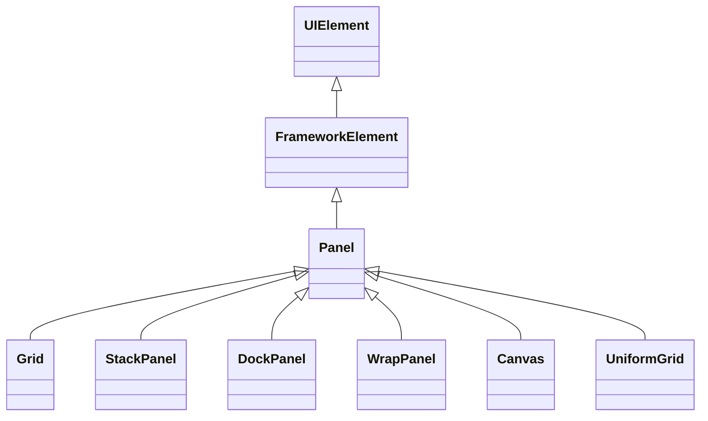
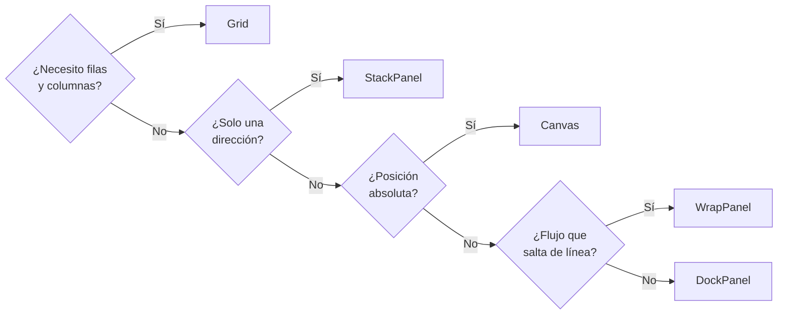
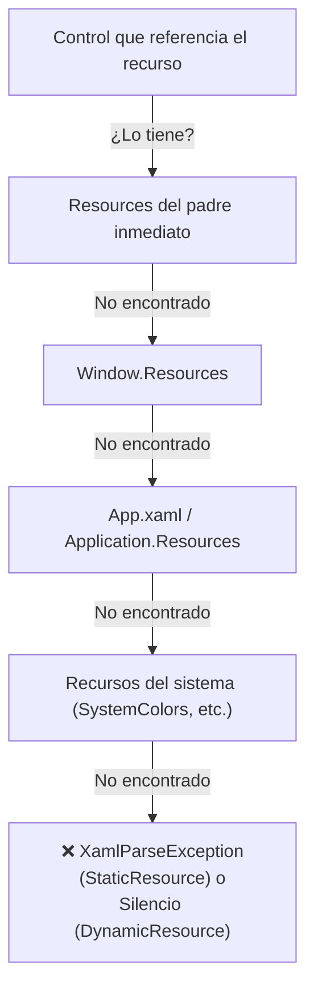
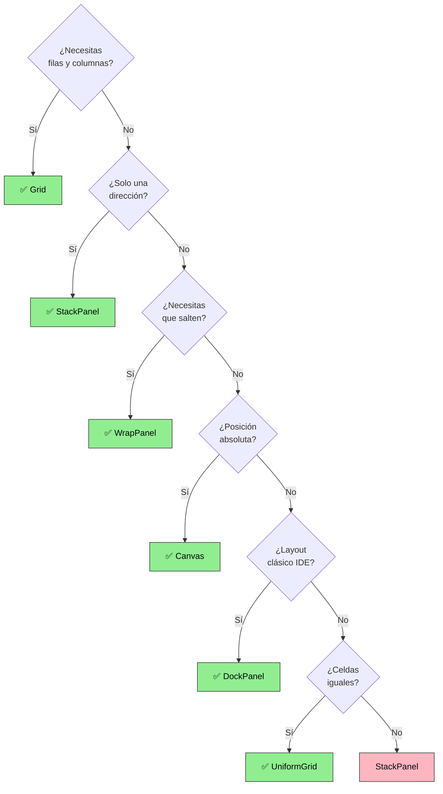

# 5. WPF: Layouts y Componentes

## Índice

- [5.1. Contenedores de Maquetación](#51-contenedores-de-maquetación)
- [5.2. Componentes de Entrada](#52-componentes-de-entrada)
- [5.3. Componentes de Acción](#53-componentes-de-acción)
- [5.4. Componentes de Selección](#54-componentes-de-selección)
- [5.5. Componentes de Visualización](#55-componentes-de-visualización)
- [5.6. Componentes de Datos Complejos](#56-componentes-de-datos-complejos)
- [5.7. Contenedores Especiales](#57-contenedores-especiales)
- [5.8. Propiedades Comunes](#58-propiedades-comunes)
- [5.9. Recursos Estáticos](#59-recursos-estáticos)

---

## 5.1. Contenedores de Maquetación

Los **contenedores de layout** (también llamados *panels*) son el esqueleto de toda interfaz WPF. Determinan cómo se distribuyen los controles hijos en el espacio disponible.

> 📝 **Nota del Profesor**: Grid es EL CONTENEDOR más importante. Úsalo para casi todo. Los demás (StackPanel, DockPanel, WrapPanel) son complementarios. Domina Grid y el resto viene solo.

### 5.1.1. Jerarquía de Panels



---

### 5.1.1. Grid

El `Grid` es el contenedor más potente y usado en WPF. Divide el espacio en **filas y columnas** y permite posicionar controles en celdas concretas.

#### 5.1.1.1. Definición de filas y columnas

| Tipo de unidad | Símbolo | Descripción |
|----------------|---------|-------------|
| Proporcional   | `*`     | Reparte el espacio sobrante proporcionalmente |
| Múltiple       | `2*`    | Doble de espacio que `*` |
| Automático     | `Auto`  | Se ajusta al contenido del hijo mayor |
| Absoluto       | `200`   | Tamaño fijo en píxeles independientes del dispositivo |

```xml
<!-- Fragmento: Grid con filas y columnas de diferentes tamaños -->
<Grid>
    <Grid.RowDefinitions>
        <RowDefinition Height="Auto" />   <!-- Fila 0: altura según contenido -->
        <RowDefinition Height="*" />      <!-- Fila 1: ocupa el espacio restante -->
        <RowDefinition Height="60" />     <!-- Fila 2: 60 unidades fijas -->
    </Grid.RowDefinitions>
    <Grid.ColumnDefinitions>
        <ColumnDefinition Width="*" />    <!-- Columna 0: 1/3 del ancho -->
        <ColumnDefinition Width="2*" />   <!-- Columna 1: 2/3 del ancho -->
    </Grid.ColumnDefinitions>

    <!-- Grid.Row y Grid.Column son propiedades adjuntas -->
    <TextBlock Grid.Row="0" Grid.Column="0" Text="Cabecera izquierda" />
    <TextBlock Grid.Row="0" Grid.Column="1" Text="Cabecera derecha" />
    <TextBox   Grid.Row="1" Grid.Column="0" Grid.ColumnSpan="2" />
    <Button    Grid.Row="2" Grid.Column="1" Content="Aceptar" />
</Grid>
```

#### 5.1.1.2. RowSpan y ColumnSpan

```xml
<!-- Fragmento: RowSpan y ColumnSpan para ocupar varias celdas -->
<Grid>
    <Grid.RowDefinitions>
        <RowDefinition Height="*" />
        <RowDefinition Height="*" />
    </Grid.RowDefinitions>
    <Grid.ColumnDefinitions>
        <ColumnDefinition Width="*" />
        <ColumnDefinition Width="*" />
        <ColumnDefinition Width="*" />
    </Grid.ColumnDefinitions>

    <!-- Ocupa las columnas 0 y 1 de la fila 0 -->
    <Button Grid.Row="0" Grid.Column="0" Grid.ColumnSpan="2" Content="Ancho doble" />

    <!-- Ocupa ambas filas de la columna 2 -->
    <ListBox Grid.Row="0" Grid.Column="2" Grid.RowSpan="2" />
</Grid>
```

#### 5.1.1.3. GridSplitter

El `GridSplitter` permite al usuario **redimensionar filas o columnas** en tiempo de ejecución arrastrando con el ratón.

```xml
<!-- Fragmento: GridSplitter para redimensionar columnas -->
<Grid>
    <Grid.ColumnDefinitions>
        <ColumnDefinition Width="200" MinWidth="80" />
        <ColumnDefinition Width="5" />     <!-- Columna exclusiva para el splitter -->
        <ColumnDefinition Width="*" />
    </Grid.ColumnDefinitions>

    <TreeView Grid.Column="0" />

    <!-- ResizeBehavior="PreviousAndNext" afecta a las columnas adyacentes -->
    <GridSplitter Grid.Column="1"
                  Width="5"
                  HorizontalAlignment="Stretch"
                  ResizeBehavior="PreviousAndNext"
                  Background="#DDDDDD" />

    <ContentControl Grid.Column="2" />
</Grid>
```

---

### 5.1.2. StackPanel

Apila los hijos en una sola dirección: vertical (por defecto) u horizontal.

```xml
<!-- Fragmento: StackPanel vertical y horizontal -->
<StackPanel Orientation="Vertical" Margin="10">
    <TextBlock Text="Nombre:" />
    <TextBox Height="30" />
    <TextBlock Text="Apellidos:" Margin="0,8,0,0" />
    <TextBox Height="30" />
</StackPanel>
```

```xml
<!-- Fragmento: StackPanel horizontal para barra de botones -->
<StackPanel Orientation="Horizontal" HorizontalAlignment="Right" Margin="0,8,0,0">
    <Button Content="Aceptar"  Width="90" Margin="0,0,8,0" />
    <Button Content="Cancelar" Width="90" />
</StackPanel>
```

---

### 5.1.3. DockPanel

Acopla los hijos a los bordes (Top, Bottom, Left, Right). El **último hijo** rellena el espacio restante por defecto.

```xml
<!-- Fragmento: DockPanel como estructura típica de ventana -->
<DockPanel LastChildFill="True">
    <!-- Barra de menú en la parte superior -->
    <Menu DockPanel.Dock="Top">
        <MenuItem Header="Archivo" />
        <MenuItem Header="Edición" />
    </Menu>

    <!-- Barra de estado en la parte inferior -->
    <StatusBar DockPanel.Dock="Bottom">
        <StatusBarItem Content="Listo" />
    </StatusBar>

    <!-- Panel lateral izquierdo -->
    <TreeView DockPanel.Dock="Left" Width="180" />

    <!-- Área central: rellena el espacio que queda -->
    <Grid />
</DockPanel>
```

---

### 5.1.4. WrapPanel

Distribuye los hijos en línea y **salta a la siguiente fila/columna** cuando no hay espacio suficiente.

```xml
<!-- Fragmento: WrapPanel para una galería de miniaturas -->
<ScrollViewer>
    <WrapPanel Orientation="Horizontal" ItemWidth="120" ItemHeight="120">
        <Border Background="LightBlue"  Margin="4" />
        <Border Background="LightGreen" Margin="4" />
        <Border Background="LightCoral" Margin="4" />
        <Border Background="Khaki"      Margin="4" />
        <Border Background="Plum"       Margin="4" />
    </WrapPanel>
</ScrollViewer>
```

---

### 5.1.5. Canvas

Posiciona los hijos con **coordenadas absolutas** (Left, Top, Right, Bottom). No gestiona tamaños: hay que indicarlos explícitamente.

```xml
<!-- Fragmento: Canvas con posicionamiento absoluto -->
<Canvas Background="WhiteSmoke">
    <!-- Canvas.Left y Canvas.Top son propiedades adjuntas -->
    <Ellipse Canvas.Left="30"  Canvas.Top="20"
             Width="60" Height="60" Fill="CornflowerBlue" />

    <Rectangle Canvas.Left="120" Canvas.Top="50"
               Width="100" Height="40" Fill="Coral" />

    <TextBlock Canvas.Left="50" Canvas.Top="110" Text="¡Hola, Canvas!" />
</Canvas>
```

---

### 5.1.6. Tabla Comparativa de Panels

| Panel        | Caso de uso principal               | Redimensiona hijos | Scroll nativo |
|--------------|-------------------------------------|--------------------|---------------|
| `Grid`       | Layouts complejos en filas/columnas | ✅                  | ❌             |
| `StackPanel` | Listas simples de elementos         | Solo en eje cruzado| ❌             |
| `DockPanel`  | Estructura de ventana clásica       | El último hijo     | ❌             |
| `WrapPanel`  | Galerías, iconos, chips             | ❌                  | ❌             |
| `Canvas`     | Dibujo, juegos, diagramas           | ❌                  | ❌             |



---

## 5.2. Componentes de Entrada

### 5.2.1. TextBox

Permite al usuario introducir y editar texto de una o varias líneas.

| Propiedad           | Tipo      | Descripción                                       |
|---------------------|-----------|---------------------------------------------------|
| `Text`              | `string`  | Texto actual del control                          |
| `MaxLength`         | `int`     | Número máximo de caracteres permitidos            |
| `IsReadOnly`        | `bool`    | Impide la edición (pero permite la selección)     |
| `AcceptsReturn`     | `bool`    | Permite múltiples líneas con la tecla Intro       |
| `TextWrapping`      | `enum`    | `Wrap` / `NoWrap` / `WrapWithOverflow`            |
| `VerticalScrollBarVisibility` | `enum` | `Auto`, `Visible`, `Hidden`, `Disabled`  |
| `SpellCheck.IsEnabled` | `bool` | Activa el corrector ortográfico integrado        |
| `CharacterCasing`   | `enum`    | `Normal`, `Upper`, `Lower`                        |

```xml
<!-- Fragmento: TextBox multilínea con placeholder simulado -->
<TextBox x:Name="txtDescripcion"
         Height="100"
         AcceptsReturn="True"
         TextWrapping="Wrap"
         VerticalScrollBarVisibility="Auto"
         MaxLength="500"
         SpellCheck.IsEnabled="True"
         ToolTip="Máximo 500 caracteres" />
```

```csharp
// Fragmento: eventos TextChanged y LostFocus en TextBox
private void TxtDescripcion_TextChanged(object sender, TextChangedEventArgs e)
{
    // Actualizar contador de caracteres en tiempo real
    lblContador.Text = $"{txtDescripcion.Text.Length}/500";
}

private void TxtDescripcion_LostFocus(object sender, RoutedEventArgs e)
{
    // Validar al perder el foco
    if (string.IsNullOrWhiteSpace(txtDescripcion.Text))
        txtDescripcion.BorderBrush = Brushes.Red;
    else
        txtDescripcion.ClearValue(BorderBrushProperty);
}
```

---

### 5.2.2. PasswordBox

Entrada de texto enmascarada para contraseñas. **No expone `Text`** sino `Password` (tipo `string`) y, por seguridad, no soporta binding directo con `{Binding}`.

| Propiedad          | Tipo     | Descripción                                     |
|--------------------|----------|-------------------------------------------------|
| `Password`         | `string` | Contraseña introducida (solo código-detrás)     |
| `PasswordChar`     | `char`   | Carácter de enmascaramiento (por defecto `●`)   |
| `MaxLength`        | `int`    | Número máximo de caracteres                     |

```xml
<!-- Fragmento: PasswordBox con su etiqueta -->
<StackPanel>
    <Label Content="Contraseña:" Target="{Binding ElementName=pwdClave}" />
    <PasswordBox x:Name="pwdClave"
                 PasswordChar="●"
                 MaxLength="32"
                 PasswordChanged="PwdClave_PasswordChanged" />
</StackPanel>
```

```csharp
// Fragmento: leer la contraseña solo cuando se necesite
private void BtnLogin_Click(object sender, RoutedEventArgs e)
{
    // Nunca almacenar en una variable local más tiempo del necesario
    string password = pwdClave.Password;
    bool valida = AuthService.Verificar(txtUsuario.Text, password);
}
```

---

### 5.2.3. Slider

Control deslizante para seleccionar un valor numérico dentro de un rango.

| Propiedad         | Tipo     | Descripción                                        |
|-------------------|----------|----------------------------------------------------|
| `Minimum`         | `double` | Valor mínimo (por defecto 0)                       |
| `Maximum`         | `double` | Valor máximo (por defecto 10)                      |
| `Value`           | `double` | Valor seleccionado actual                          |
| `Orientation`     | `enum`   | `Horizontal` (defecto) o `Vertical`                |
| `IsSnapToTickEnabled` | `bool` | El pulgar salta de tick en tick                |
| `TickFrequency`   | `double` | Distancia entre marcas                             |
| `TickPlacement`   | `enum`   | `None`, `TopLeft`, `BottomRight`, `Both`           |
| `LargeChange`     | `double` | Salto con PageUp / PageDown                        |
| `SmallChange`     | `double` | Salto con las teclas de flecha                     |

```xml
<!-- Fragmento: Slider de volumen con marcas y TextBlock sincronizado -->
<StackPanel>
    <TextBlock Text="{Binding ElementName=sldVolumen, Path=Value,
                              StringFormat='Volumen: {0:F0}%'}"
               HorizontalAlignment="Center" />
    <Slider x:Name="sldVolumen"
            Minimum="0" Maximum="100" Value="50"
            TickFrequency="10" TickPlacement="BottomRight"
            IsSnapToTickEnabled="True"
            ValueChanged="SldVolumen_ValueChanged" />
</StackPanel>
```

```csharp
// Fragmento: reaccionar al cambio de valor del Slider
private void SldVolumen_ValueChanged(object sender,
    RoutedPropertyChangedEventArgs<double> e)
{
    // e.OldValue → valor anterior; e.NewValue → valor nuevo
    MediaPlayer.Volume = e.NewValue / 100.0;
}
```

---

### 5.2.4. DatePicker

Selector de fecha con calendario desplegable.

| Propiedad            | Tipo            | Descripción                          |
|----------------------|-----------------|--------------------------------------|
| `SelectedDate`       | `DateTime?`     | Fecha seleccionada (null = ninguna)  |
| `DisplayDateStart`   | `DateTime?`     | Primera fecha seleccionable          |
| `DisplayDateEnd`     | `DateTime?`     | Última fecha seleccionable           |
| `SelectedDateFormat` | `enum`          | `Short` (defecto) o `Long`           |
| `IsDropDownOpen`     | `bool`          | Abre/cierra el calendario por código |

```xml
<!-- Fragmento: DatePicker con rango de fechas válidas -->
<StackPanel Orientation="Horizontal">
    <Label Content="Fecha de nacimiento:" />
    <DatePicker x:Name="dpNacimiento"
                DisplayDateStart="1900-01-01"
                DisplayDateEnd="{x:Static sys:DateTime.Today}"
                SelectedDateFormat="Short"
                SelectedDateChanged="DpNacimiento_SelectedDateChanged" />
</StackPanel>
```

---

## 5.3. Componentes de Acción

### 5.3.1. Button

Botón estándar que dispara un comando al hacer clic.

| Propiedad      | Tipo       | Descripción                                          |
|----------------|------------|------------------------------------------------------|
| `Content`      | `object`   | Cualquier cosa: texto, imagen, panel...              |
| `IsDefault`    | `bool`     | Se activa con la tecla Intro                         |
| `IsCancel`     | `bool`     | Se activa con la tecla Escape                        |
| `Command`      | `ICommand` | Comando MVVM asociado                                |
| `IsEnabled`    | `bool`     | Habilita o deshabilita el botón                      |

```xml
<!-- Fragmento: Button con contenido complejo (icono + texto) -->
<Button Width="140" Height="40" Padding="8,4"
        Click="BtnGuardar_Click">
    <StackPanel Orientation="Horizontal">
        <!-- El Path define un icono vectorial inline -->
        <Path Data="M17,3H5C3.89,3 3,3.9 3,5V19A2,2 0 0,0 5,21H19A2,2 0 0,0 21,19V7L17,3M19,19H5V5H16.17L19,7.83V19M12,12A3,3 0 0,0 9,15A3,3 0 0,0 12,18A3,3 0 0,0 15,15A3,3 0 0,0 12,12M6,6H15V10H6V6Z"
              Fill="White" Width="18" Height="18"
              Stretch="Uniform" VerticalAlignment="Center" />
        <TextBlock Text="Guardar" Margin="6,0,0,0"
                   VerticalAlignment="Center" Foreground="White" />
    </StackPanel>
</Button>
```

---

### 5.3.2. RepeatButton

Dispara el evento `Click` continuamente mientras el botón permanece pulsado. Útil para controles de incremento/decremento.

```xml
<!-- Fragmento: RepeatButton para incrementar un valor -->
<StackPanel Orientation="Horizontal">
    <RepeatButton Content="▼" Width="30"
                  Delay="500" Interval="100"
                  Click="BtnDecrementar_Click" />
    <TextBlock x:Name="lblValor" Text="0" Width="50"
               TextAlignment="Center" VerticalAlignment="Center" />
    <RepeatButton Content="▲" Width="30"
                  Delay="500" Interval="100"
                  Click="BtnIncrementar_Click" />
</StackPanel>
```

---

### 5.3.3. ToggleButton

Botón de dos estados: presionado (`IsChecked = true`) o suelto (`IsChecked = false`).

```xml
<!-- Fragmento: ToggleButton para activar/desactivar una opción -->
<ToggleButton x:Name="tglNegrita"
              Width="32" Height="32"
              ToolTip="Negrita (Ctrl+B)"
              Checked="TglNegrita_Checked"
              Unchecked="TglNegrita_Unchecked">
    <TextBlock Text="N" FontWeight="Bold" FontSize="14" />
</ToggleButton>
```

```csharp
// Fragmento: leer el estado de un ToggleButton
private void TglNegrita_Checked(object sender, RoutedEventArgs e)
{
    // IsChecked es bool? (nullable) porque también puede ser null en modo indeterminate
    if (tglNegrita.IsChecked == true)
        txtEditor.FontWeight = FontWeights.Bold;
}
```

---

## 5.4. Componentes de Selección

### 5.4.1. CheckBox

Casilla de verificación de dos o tres estados.

| Propiedad        | Tipo    | Descripción                                             |
|------------------|---------|---------------------------------------------------------|
| `IsChecked`      | `bool?` | `true` / `false` / `null` (indeterminado)               |
| `IsThreeState`   | `bool`  | Permite el tercer estado `null`                         |
| `Content`        | `object`| Etiqueta junto a la casilla                             |

```xml
<!-- Fragmento: CheckBox con tres estados posibles -->
<StackPanel>
    <!-- Estado determinado normal -->
    <CheckBox Content="Acepto los términos y condiciones"
              IsChecked="False" x:Name="chkTerminos" />

    <!-- Estado indeterminado: "Seleccionar todos" -->
    <CheckBox Content="Seleccionar todos"
              IsThreeState="True"
              IsChecked="{x:Null}"
              Indeterminate="ChkTodos_Indeterminate"
              Checked="ChkTodos_Checked"
              Unchecked="ChkTodos_Unchecked" />
</StackPanel>
```

---

### 5.4.2. RadioButton

Botón de opción para selección exclusiva dentro de un grupo.

```xml
<!-- Fragmento: RadioButton con GroupName para grupos independientes -->
<StackPanel>
    <TextBlock Text="Tamaño de camiseta:" FontWeight="SemiBold" />
    <!-- Todos los RadioButton del mismo GroupName son mutuamente excluyentes -->
    <RadioButton GroupName="Talla" Content="S"  IsChecked="False" />
    <RadioButton GroupName="Talla" Content="M"  IsChecked="True"  />
    <RadioButton GroupName="Talla" Content="L"  IsChecked="False" />
    <RadioButton GroupName="Talla" Content="XL" IsChecked="False" />

    <TextBlock Text="Color:" FontWeight="SemiBold" Margin="0,8,0,0"/>
    <!-- Grupo independiente: puede tener su propia selección -->
    <RadioButton GroupName="Color" Content="Rojo"  />
    <RadioButton GroupName="Color" Content="Azul"  IsChecked="True" />
    <RadioButton GroupName="Color" Content="Verde" />
</StackPanel>
```

---

### 5.4.3. ComboBox

Lista desplegable para selección de una opción.

| Propiedad              | Tipo     | Descripción                                      |
|------------------------|----------|--------------------------------------------------|
| `IsEditable`           | `bool`   | Permite escribir en el campo además de seleccionar|
| `SelectedItem`         | `object` | Elemento seleccionado actualmente                |
| `SelectedIndex`        | `int`    | Índice (-1 si no hay selección)                  |
| `ItemsSource`          | `IEnumerable` | Colección de datos para enlazar             |
| `DisplayMemberPath`    | `string` | Propiedad del objeto que se muestra como texto   |

```xml
<!-- Fragmento: ComboBox con elementos estáticos en XAML -->
<ComboBox x:Name="cmbPaises" Width="200"
          SelectedIndex="0"
          SelectionChanged="CmbPaises_SelectionChanged">
    <ComboBoxItem Content="España" />
    <ComboBoxItem Content="México" />
    <ComboBoxItem Content="Argentina" />
    <ComboBoxItem Content="Colombia" />
</ComboBox>
```

```csharp
// Fragmento: rellenar un ComboBox desde C# con una lista de objetos
private void CargarComboPaises()
{
    var paises = new List<Pais>
    {
        new Pais { Codigo = "ES", Nombre = "España" },
        new Pais { Codigo = "MX", Nombre = "México" },
        new Pais { Codigo = "AR", Nombre = "Argentina" },
    };

    // DisplayMemberPath: qué propiedad se muestra en la lista
    // SelectedValuePath: qué propiedad se usa como valor seleccionado
    cmbPaises.ItemsSource       = paises;
    cmbPaises.DisplayMemberPath = "Nombre";
    cmbPaises.SelectedValuePath = "Codigo";
    cmbPaises.SelectedIndex     = 0;
}
```

---

### 5.4.4. ListBox

Lista con selección simple o múltiple.

| Propiedad       | Tipo          | Descripción                                      |
|-----------------|---------------|--------------------------------------------------|
| `SelectionMode` | `enum`        | `Single`, `Multiple`, `Extended`                 |
| `SelectedItem`  | `object`      | Elemento seleccionado en modo `Single`           |
| `SelectedItems` | `IList`       | Elementos seleccionados en modo `Multiple`       |
| `ItemsSource`   | `IEnumerable` | Colección de datos                               |

```xml
<!-- Fragmento: ListBox con selección múltiple y plantilla personalizada -->
<ListBox x:Name="lstColores"
         SelectionMode="Multiple"
         Height="150">
    <ListBox.ItemTemplate>
        <DataTemplate>
            <!-- Cada elemento muestra un cuadrado de color y su nombre -->
            <StackPanel Orientation="Horizontal">
                <Rectangle Width="16" Height="16" Margin="0,0,8,0"
                           Fill="{Binding Codigo}" />
                <TextBlock Text="{Binding Nombre}" />
            </StackPanel>
        </DataTemplate>
    </ListBox.ItemTemplate>
</ListBox>
```

---

## 5.5. Componentes de Visualización

### 5.5.1. TextBlock

Muestra texto **de solo lectura**. Es más ligero que `Label` y soporta **inlines** (Runs, Bold, Italic, Hyperlink).

```xml
<!-- Fragmento: TextBlock con formato inline mixto -->
<TextBlock FontSize="14" TextWrapping="Wrap">
    <Run Text="Nombre: " FontWeight="Bold" />
    <Run x:Name="runNombre" Text="Juan García" />
    <LineBreak />
    <Run Text="Estado: " FontWeight="Bold" />
    <Run Text="Activo" Foreground="Green" FontStyle="Italic" />
    <LineBreak />
    <Hyperlink NavigateUri="https://example.com"
               RequestNavigate="Hyperlink_RequestNavigate">
        Ver perfil completo
    </Hyperlink>
</TextBlock>
```

---

### 5.5.2. Label

Similar a `TextBlock`, pero hereda de `ContentControl`:

- ✅ Soporta la tecla mnemónica (`_N` activa el control indicado en `Target`)
- ✅ Puede contener **cualquier visual** como contenido
- ❌ Más pesado en memoria que `TextBlock`

```xml
<!-- Fragmento: Label con tecla de acceso rápido vinculado a un TextBox -->
<StackPanel>
    <!-- Al pulsar Alt+N, el foco va a txtNombre -->
    <Label Content="_Nombre:" Target="{Binding ElementName=txtNombre}" />
    <TextBox x:Name="txtNombre" />

    <!-- Label con contenido visual en lugar de texto simple -->
    <Label>
        <StackPanel Orientation="Horizontal">
            <Image Source="/Assets/user.png" Width="16" Height="16" />
            <TextBlock Text="Usuario" Margin="4,0,0,0" />
        </StackPanel>
    </Label>
</StackPanel>
```

---

### 5.5.3. Image

Muestra imágenes en formato BMP, PNG, JPEG, GIF, TIFF, ICO, WDP.

| Valor de `Stretch` | Descripción                                             |
|--------------------|---------------------------------------------------------|
| `None`             | Tamaño original (puede desbordarse)                     |
| `Fill`             | Rellena el control (distorsiona si cambia proporción)   |
| `Uniform`          | Ajusta manteniendo proporción (puede dejar franjas)     |
| `UniformToFill`    | Rellena manteniendo proporción (puede recortar)         |

```xml
<!-- Fragmento: Image con distintos modos de escalado -->
<Grid>
    <Grid.ColumnDefinitions>
        <ColumnDefinition Width="*" />
        <ColumnDefinition Width="*" />
    </Grid.ColumnDefinitions>

    <!-- Recurso embebido en el proyecto (Build Action: Resource) -->
    <Image Grid.Column="0"
           Source="/Assets/foto.jpg"
           Stretch="Uniform"
           RenderOptions.BitmapScalingMode="HighQuality" />

    <!-- Imagen desde una URL externa -->
    <Image Grid.Column="1"
           Source="https://example.com/imagen.png"
           Stretch="UniformToFill" />
</Grid>
```

---

### 5.5.4. ProgressBar

Barra de progreso determinada (con valor conocido) o indeterminada (carga en curso).

```xml
<!-- Fragmento: ProgressBar determinada (se conoce el porcentaje) -->
<ProgressBar x:Name="pbCarga"
             Minimum="0" Maximum="100" Value="35"
             Height="20" />
```

```xml
<!-- Fragmento: ProgressBar indeterminada (animación de espera) -->
<ProgressBar IsIndeterminate="True"
             Height="20"
             Visibility="{Binding EsCargando, Converter={StaticResource BoolToVisibility}}" />
```

---

## 5.6. Componentes de Datos Complejos

### 5.6.1. DataGrid

Tabla para mostrar y editar colecciones de datos.

| Propiedad                 | Tipo     | Descripción                                        |
|---------------------------|----------|----------------------------------------------------|
| `AutoGenerateColumns`     | `bool`   | Genera columnas automáticas desde las propiedades  |
| `CanUserAddRows`          | `bool`   | Permite añadir filas nuevas                        |
| `CanUserDeleteRows`       | `bool`   | Permite eliminar filas                             |
| `CanUserSortColumns`      | `bool`   | Permite ordenar al hacer clic en cabecera          |
| `IsReadOnly`              | `bool`   | Impide la edición de todas las celdas              |
| `SelectionMode`           | `enum`   | `Single` o `Extended`                              |
| `SelectionUnit`           | `enum`   | `FullRow`, `Cell`, `CellOrRowHeader`               |
| `AlternatingRowBackground`| `Brush`  | Color alternativo de filas                         |
| `GridLinesVisibility`     | `enum`   | `All`, `Horizontal`, `Vertical`, `None`            |

```xml
<!-- Fragmento: DataGrid con columnas automáticas (rápido para prototipos) -->
<DataGrid x:Name="dgProductos"
          AutoGenerateColumns="True"
          IsReadOnly="True"
          CanUserSortColumns="True"
          AlternatingRowBackground="#F5F5F5"
          SelectionMode="Single"
          SelectionUnit="FullRow" />
```

```xml
<!-- Fragmento: DataGrid con columnas manuales y tipos específicos -->
<DataGrid x:Name="dgEmpleados"
          AutoGenerateColumns="False"
          CanUserAddRows="False"
          GridLinesVisibility="Horizontal">
    <DataGrid.Columns>
        <!-- Columna de texto -->
        <DataGridTextColumn Header="Nombre"
                            Binding="{Binding Nombre}"
                            Width="*" />

        <!-- Columna numérica con formato de moneda -->
        <DataGridTextColumn Header="Salario"
                            Binding="{Binding Salario, StringFormat=C}"
                            Width="100" />

        <!-- Columna de casilla de verificación -->
        <DataGridCheckBoxColumn Header="Activo"
                                Binding="{Binding EstaActivo}"
                                Width="60" />

        <!-- Columna con plantilla personalizada (botón de acción) -->
        <DataGridTemplateColumn Header="Acciones" Width="80">
            <DataGridTemplateColumn.CellTemplate>
                <DataTemplate>
                    <Button Content="Editar"
                            Tag="{Binding Id}"
                            Click="BtnEditar_Click" />
                </DataTemplate>
            </DataGridTemplateColumn.CellTemplate>
        </DataGridTemplateColumn>
    </DataGrid.Columns>
</DataGrid>
```

```csharp
// Fragmento: enlazar DataGrid a una colección observable
public partial class MainWindow : Window
{
    // ObservableCollection notifica cambios a la interfaz automáticamente
    private ObservableCollection<Empleado> _empleados = new();

    public MainWindow()
    {
        InitializeComponent();
        CargarEmpleados();
    }

    private void CargarEmpleados()
    {
        _empleados.Add(new Empleado { Nombre = "Ana López",    Salario = 2400m, EstaActivo = true });
        _empleados.Add(new Empleado { Nombre = "Carlos Ruiz",  Salario = 2800m, EstaActivo = false });
        _empleados.Add(new Empleado { Nombre = "María Torres", Salario = 3100m, EstaActivo = true });

        dgEmpleados.ItemsSource = _empleados;
    }
}
```

---

### 5.6.2. ListView

Lista flexible con soporte para múltiples vistas. La vista más común es `GridView`, que imita una tabla.

```xml
<!-- Fragmento: ListView con GridView para mostrar columnas -->
<ListView x:Name="lvAlumnos" SelectionMode="Single">
    <ListView.View>
        <GridView>
            <GridViewColumn Header="Nombre"     Width="160"
                            DisplayMemberBinding="{Binding Nombre}" />
            <GridViewColumn Header="Nota"       Width="80"
                            DisplayMemberBinding="{Binding Nota, StringFormat=F1}" />
            <GridViewColumn Header="Aprobado"   Width="80">
                <GridViewColumn.CellTemplate>
                    <DataTemplate>
                        <!-- Icono en función del valor booleano -->
                        <TextBlock Text="{Binding Aprobado,
                                   Converter={StaticResource BoolToIconConverter}}"
                                   HorizontalAlignment="Center" />
                    </DataTemplate>
                </GridViewColumn.CellTemplate>
            </GridViewColumn>
        </GridView>
    </ListView.View>
</ListView>
```

---

### 5.6.3. TreeView

Árbol jerárquico expandible/contraíble.

```xml
<!-- Fragmento: TreeView con HierarchicalDataTemplate para nodos recurrentes -->
<TreeView x:Name="tvCategorias" ItemsSource="{Binding Categorias}">
    <TreeView.ItemTemplate>
        <!-- HierarchicalDataTemplate define los hijos del nodo -->
        <HierarchicalDataTemplate ItemsSource="{Binding Subcategorias}">
            <StackPanel Orientation="Horizontal">
                <TextBlock Text="📁 " />
                <TextBlock Text="{Binding Nombre}" />
            </StackPanel>
        </HierarchicalDataTemplate>
    </TreeView.ItemTemplate>
</TreeView>
```

---

## 5.7. Contenedores Especiales

### 5.7.1. TabControl

Organiza el contenido en pestañas.

```xml
<!-- Fragmento: TabControl con varias pestañas -->
<TabControl>
    <TabItem Header="General">
        <StackPanel Margin="12">
            <TextBlock Text="Configuración general" />
        </StackPanel>
    </TabItem>
    <TabItem Header="Apariencia">
        <Grid Margin="12" />
    </TabItem>
    <TabItem Header="Avanzado" IsEnabled="False"> <!-- Pestaña deshabilitada -->
        <TextBlock Text="Próximamente" Margin="12" />
    </TabItem>
</TabControl>
```

---

### 5.7.2. Expander

Panel que el usuario puede expandir o contraer.

```xml
<!-- Fragmento: Expander para opciones avanzadas -->
<Expander Header="Opciones avanzadas" IsExpanded="False">
    <StackPanel Margin="12,4,0,0">
        <CheckBox Content="Modo depuración" />
        <CheckBox Content="Mostrar registro detallado" />
    </StackPanel>
</Expander>
```

---

### 5.7.3. GroupBox

Agrupa controles relacionados con un borde y título.

```xml
<!-- Fragmento: GroupBox para datos personales -->
<GroupBox Header="Datos personales" Margin="8" Padding="8">
    <StackPanel>
        <Label Content="_Nombre:" Target="{Binding ElementName=txtNombreGb}" />
        <TextBox x:Name="txtNombreGb" />
        <Label Content="_Apellidos:" Target="{Binding ElementName=txtApellidosGb}" />
        <TextBox x:Name="txtApellidosGb" />
    </StackPanel>
</GroupBox>
```

---

### 5.7.4. Border

Dibuja un borde, fondo y esquinas redondeadas alrededor de un único hijo.

```xml
<!-- Fragmento: Border como tarjeta con sombra simulada -->
<Border Background="White"
        BorderBrush="#DDDDDD"
        BorderThickness="1"
        CornerRadius="8"
        Padding="16"
        Margin="8">
    <Border.Effect>
        <!-- Sombra suave para efecto de tarjeta -->
        <DropShadowEffect BlurRadius="12" Opacity="0.15"
                          ShadowDepth="2" Direction="270" />
    </Border.Effect>
    <TextBlock Text="Tarjeta de contenido" FontSize="16" />
</Border>
```

---

### 5.7.5. Separator y ScrollViewer

```xml
<!-- Fragmento: Separator en un menú y un StackPanel -->
<StackPanel>
    <Button Content="Opción 1" />
    <Separator Margin="0,4" />  <!-- Línea horizontal divisoria -->
    <Button Content="Opción 2" />
</StackPanel>
```

```xml
<!-- Fragmento: ScrollViewer para habilitar desplazamiento en cualquier contenido -->
<ScrollViewer VerticalScrollBarVisibility="Auto"
              HorizontalScrollBarVisibility="Disabled">
    <!-- El contenido puede ser más alto que el ScrollViewer -->
    <StackPanel x:Name="panelContenido">
        <!-- Muchos elementos... -->
    </StackPanel>
</ScrollViewer>
```

---

## 5.8. Propiedades Comunes

Todos los controles que heredan de `FrameworkElement` comparten estas propiedades:

### 5.8.1. Tabla de propiedades comunes

| Propiedad               | Tipo             | Descripción                                              |
|-------------------------|------------------|----------------------------------------------------------|
| **Tamaño**              |                  |                                                          |
| `Width` / `Height`      | `double`         | Tamaño deseado (`NaN` = automático)                      |
| `MinWidth` / `MinHeight`| `double`         | Tamaño mínimo permitido                                  |
| `MaxWidth` / `MaxHeight`| `double`         | Tamaño máximo permitido                                  |
| `ActualWidth` / `ActualHeight` | `double`  | Tamaño real tras el layout (solo lectura)                |
| **Espaciado**           |                  |                                                          |
| `Margin`                | `Thickness`      | Espacio exterior: `"8"` / `"8,4"` / `"8,4,8,4"` (L,T,R,B)|
| `Padding`               | `Thickness`      | Espacio interior (solo `ContentControl` y derivados)     |
| **Alineación**          |                  |                                                          |
| `HorizontalAlignment`   | `enum`           | `Left`, `Center`, `Right`, `Stretch`                     |
| `VerticalAlignment`     | `enum`           | `Top`, `Center`, `Bottom`, `Stretch`                     |
| `HorizontalContentAlignment` | `enum`   | Alineación del contenido dentro del control              |
| `VerticalContentAlignment`   | `enum`   | Alineación vertical del contenido                        |
| **Apariencia**          |                  |                                                          |
| `Background`            | `Brush`          | Fondo (solo controles con área de fondo)                 |
| `Foreground`            | `Brush`          | Color del texto o primer plano                           |
| `BorderBrush`           | `Brush`          | Color del borde                                          |
| `BorderThickness`       | `Thickness`      | Grosor del borde                                         |
| `Opacity`               | `double`         | Transparencia: 0.0 (invisible) a 1.0 (opaco)            |
| `FontFamily`            | `FontFamily`     | Tipografía                                               |
| `FontSize`              | `double`         | Tamaño de fuente en puntos                               |
| `FontWeight`            | `enum`           | `Normal`, `SemiBold`, `Bold`, `ExtraBold`...             |
| **Visibilidad**         |                  |                                                          |
| `Visibility`            | `enum`           | `Visible`, `Hidden` (ocupa espacio), `Collapsed` (no ocupa)|
| `IsEnabled`             | `bool`           | Habilita o deshabilita el control y sus hijos            |
| `ToolTip`               | `object`         | Texto o visual del tooltip                               |

---

### 5.8.2. Ejemplos ilustrativos

```xml
<!-- Fragmento: márgenes y alineaciones más habituales -->
<Button Content="Guardar"
        Width="120"
        HorizontalAlignment="Right"
        VerticalAlignment="Bottom"
        Margin="0,0,12,12"
        Padding="8,4" />
```

```xml
<!-- Fragmento: visibilidad condicional con Collapsed -->
<StackPanel>
    <TextBlock Text="Sin resultados"
               Visibility="Collapsed"
               x:Name="lblSinResultados"
               HorizontalAlignment="Center"
               Foreground="Gray" />

    <DataGrid x:Name="dgResultados"
              Visibility="Visible" />
</StackPanel>
```

```csharp
// Fragmento: cambiar visibilidad desde código
private void MostrarResultados(bool hayDatos)
{
    // Collapsed: el control no ocupa espacio en el layout
    lblSinResultados.Visibility = hayDatos ? Visibility.Collapsed : Visibility.Visible;
    dgResultados.Visibility     = hayDatos ? Visibility.Visible   : Visibility.Collapsed;
}
```

```xml
<!-- Fragmento: control deshabilitado con opacidad visual reducida -->
<StackPanel>
    <CheckBox x:Name="chkOpcional" Content="Activar opciones adicionales"
              Checked="ChkOpcional_Checked" Unchecked="ChkOpcional_Unchecked" />

    <!-- IsEnabled="False" deshabilita el panel y todos sus hijos -->
    <GroupBox x:Name="gbOpciones" Header="Opciones" IsEnabled="False" Opacity="0.5">
        <StackPanel>
            <CheckBox Content="Opción A" />
            <CheckBox Content="Opción B" />
        </StackPanel>
    </GroupBox>
</StackPanel>
```

---

## 5.9. Recursos Estáticos

Los **recursos** en WPF permiten definir valores reutilizables (colores, estilos, plantillas...) en un único lugar y referenciarlos desde cualquier parte de la interfaz. Esto sigue el principio **DRY** (*Don't Repeat Yourself*).

### 5.9.1. Definición de recursos

Los recursos se definen en el diccionario `Resources` de cualquier elemento XAML. Se suelen agrupar en `App.xaml` (ámbito global) o en la sección `<Window.Resources>` (ámbito local a la ventana).

```xml
<!-- Fragmento: definición de recursos en Window.Resources -->
<Window.Resources>
    <!-- Recurso de color -->
    <Color x:Key="ColorPrimario">#1976D2</Color>

    <!-- Recurso de pincel que usa el color anterior -->
    <SolidColorBrush x:Key="PincelPrimario" Color="{StaticResource ColorPrimario}" />

    <!-- Recurso de grosor de borde reutilizable -->
    <Thickness x:Key="MargenEstandar">8,4,8,4</Thickness>

    <!-- Recurso de estilo aplicado a todos los Button de la ventana -->
    <Style TargetType="Button" x:Key="EstiloBotonPrimario">
        <Setter Property="Background"  Value="{StaticResource PincelPrimario}" />
        <Setter Property="Foreground"  Value="White" />
        <Setter Property="FontWeight"  Value="SemiBold" />
        <Setter Property="Padding"     Value="12,6" />
        <Setter Property="BorderThickness" Value="0" />
    </Style>
</Window.Resources>
```

---

### 5.9.2. Uso con StaticResource

```xml
<!-- Fragmento: uso de StaticResource para referenciar recursos definidos -->
<StackPanel>
    <!-- Aplicar estilo con clave -->
    <Button Content="Guardar"
            Style="{StaticResource EstiloBotonPrimario}" />

    <!-- Usar el pincel directamente -->
    <Border Background="{StaticResource PincelPrimario}"
            Height="4" />

    <!-- Referenciar margen reutilizable -->
    <TextBlock Text="Bienvenido"
               Margin="{StaticResource MargenEstandar}"
               Foreground="{StaticResource PincelPrimario}"
               FontSize="20" />
</StackPanel>
```

---

### 5.9.3. StaticResource vs DynamicResource

| Característica         | `StaticResource`                              | `DynamicResource`                                |
|------------------------|-----------------------------------------------|--------------------------------------------------|
| **Resolución**         | En tiempo de carga del XAML (una vez)         | En tiempo de ejecución (cada vez que cambia)     |
| **Rendimiento**        | ✅ Más rápido                                  | ⚠️ Ligera sobrecarga por seguimiento de cambios  |
| **Recurso cambia**     | ❌ No detecta el cambio                        | ✅ Actualiza la interfaz automáticamente          |
| **Recurso no existe**  | 💥 Excepción en tiempo de carga               | ⚠️ Silencioso (sin valor visible)                |
| **Cuándo usarlo**      | Recursos fijos (colores, estilos estáticos)   | Temas dinámicos, recursos que cambian en runtime |

```xml
<!-- Fragmento: DynamicResource para un tema intercambiable en runtime -->
<Window.Resources>
    <SolidColorBrush x:Key="ColorFondo" Color="White" />
</Window.Resources>

<Grid Background="{DynamicResource ColorFondo}">
    <!-- Al cambiar el recurso "ColorFondo" en tiempo de ejecución,
         el Grid actualizará su fondo automáticamente -->
</Grid>
```

```csharp
// Fragmento: cambiar un tema dinámico en tiempo de ejecución
private void BtnTemaOscuro_Click(object sender, RoutedEventArgs e)
{
    // Reemplaza el recurso → DynamicResource actualiza la UI al instante
    Resources["ColorFondo"] = new SolidColorBrush(Color.FromRgb(30, 30, 30));
}
```

---

### 5.9.4. Jerarquía de búsqueda de recursos



> 💡 **Regla práctica:** usa `StaticResource` por defecto. Usa `DynamicResource` solo cuando necesites que la interfaz reaccione a cambios de tema en tiempo de ejecución.

> 💡 **Tip del Examinador**: Pregunta frecuente de examen: "¿Cuál es la diferencia entre StaticResource y DynamicResource?" La respuesta: StaticResource se resuelve en tiempo de carga (más rápido), DynamicResource se resuelve en tiempo de ejecución (permite cambios dinámicos).

---

## Resumen

| Concepto | Descripción |
|----------|-------------|
| **Grid** | Contenedor más importante, divide en filas y columnas |
| **StackPanel** | Apila elementos en una dirección |
| **DockPanel** | Acopla a los bordes (Top, Bottom, Left, Right) |
| **WrapPanel** | Flujo que salta de línea |
| **Canvas** | Posicionamiento absoluto con coordenadas |
| **UniformGrid** | Cuadrícula de celdas iguales |
| **StaticResource** | Se resuelve en tiempo de carga |
| **DynamicResource** | Se resuelve en tiempo de ejecución |

### Puntos clave

1. **Grid es el contenedor principal**: Úsalo para casi todo layout complejo.
2. **RowSpan/ColumnSpan**: Permiten que un control ocupe varias celdas.
3. **Propiedades adjuntas**: Grid.Row, Grid.Column, Canvas.Left, etc.
4. **Recursos**: Definen valores reutilizables (colores, estilos) en App.xaml o Window.Resources.
5. **StaticResource vs DynamicResource**: El primero es más rápido, el segundo permite cambios dinámicos.

> 📝 **Nota del Profesor**: Grid es EL CONTENEDOR más importante. Úsalo para casi todo. Los demás (StackPanel, DockPanel, WrapPanel) son complementarios. Domina Grid y el resto viene solo. En cuanto a recursos, usa StaticResource por defecto y DynamicResource solo cuando necesites cambiar temas en tiempo de ejecución.

> 💡 **Tip del Examinador**: Pregunta frecuente: "¿Cómo hacer un teclado numérico 3x4?" Usa **UniformGrid** con Columns="3". Es más eficiente que Grid y automáticamente hace todas las celdas del mismo tamaño. Otra pregunta común: "¿Qué propiedad usar para que un control se expanda?" → **HorizontalAlignment="Stretch"** y **VerticalAlignment="Stretch"**.

---

### Diagrama: Árbol de decisión para elegir layout



---
