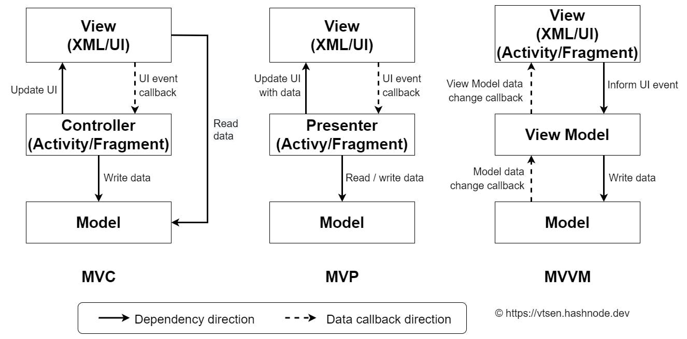
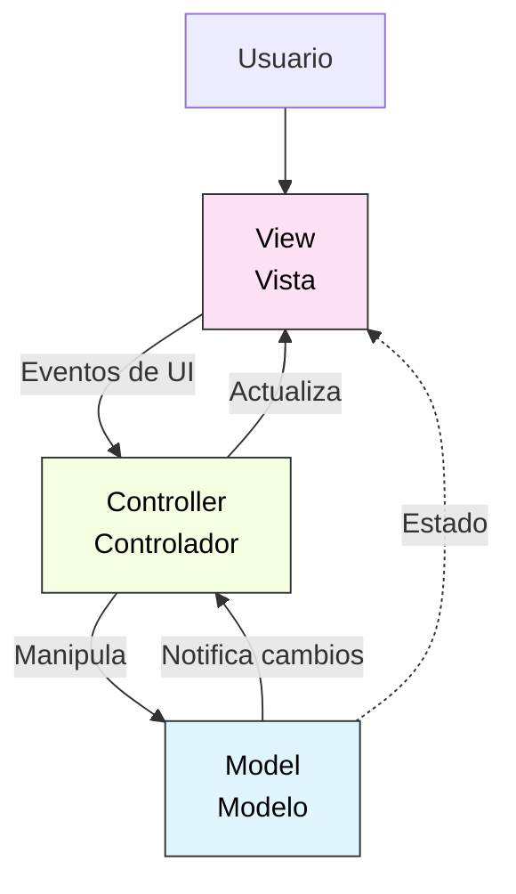
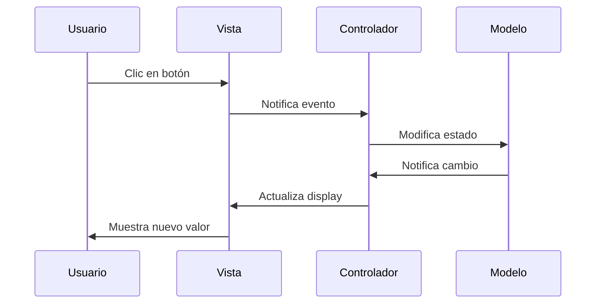
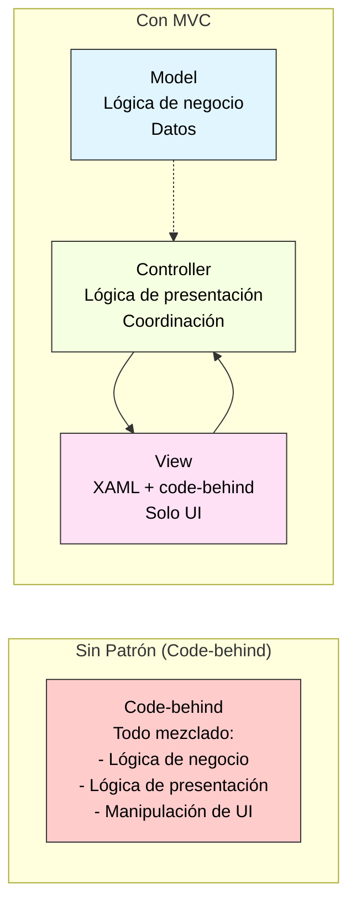
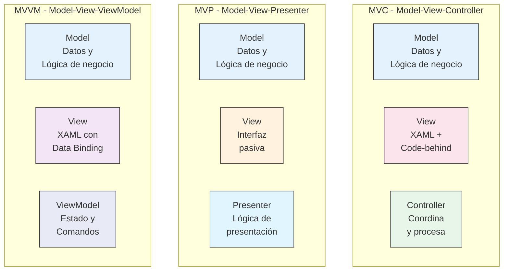
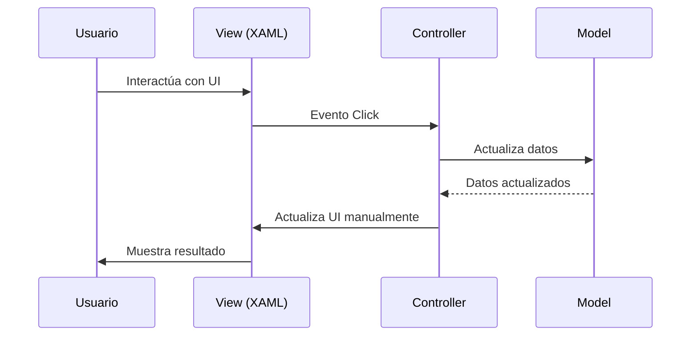
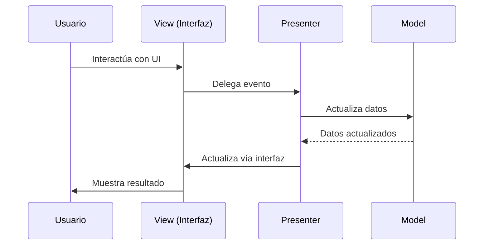
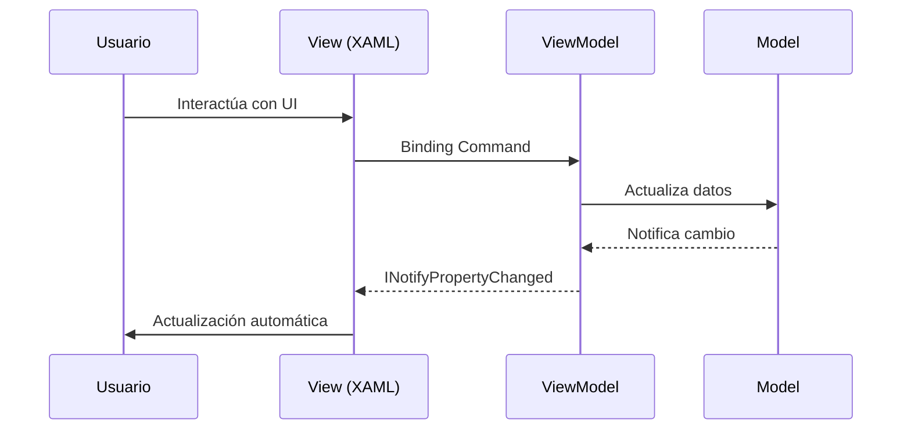
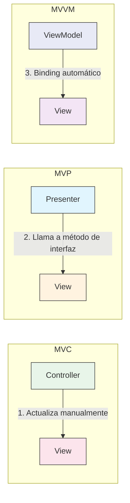
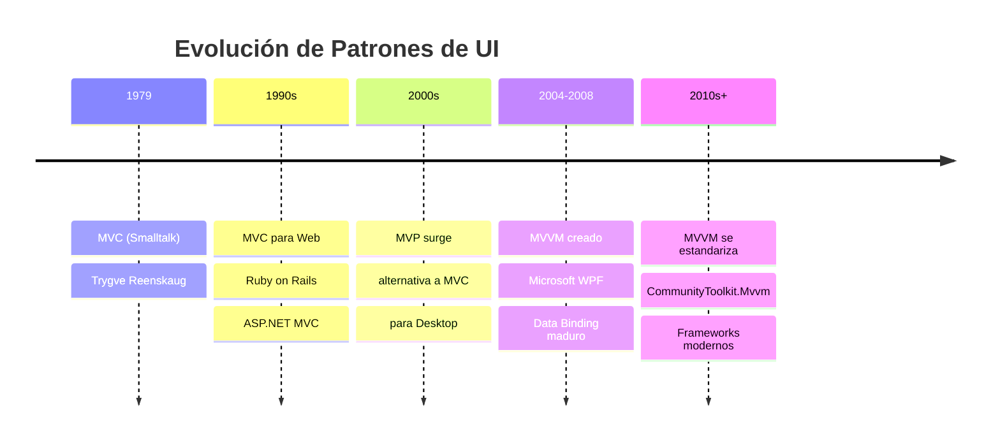

# 6. Arquitectura MVC en WPF

- [6.1. ¿Qué es MVC?](#61-qué-es-mvc)
  - [6.1.1. Historia](#611-historia)
- [6.2. Componentes de MVC](#62-componentes-de-mvc)
  - [6.2.1. Model (Modelo)](#621-model-modelo)
  - [6.2.2. View (Vista)](#622-view-vista)
  - [6.2.3. Controller (Controlador)](#623-controller-controlador)
- [6.3. Flujo de Datos en MVC](#63-flujo-de-datos-en-mvc)
- [6.4. Ejemplo 1: Contador MVC Completo](#64-ejemplo-1-contador-mvc-completo)
  - [6.4.1. Modelo](#641-modelo)
  - [6.4.2. Vista](#642-vista)
  - [6.4.3. Controlador](#643-controlador)
  - [6.4.4. Punto de Entrada](#644-punto-de-entrada)
- [6.5. Ejemplo 2: Formulario de Registro MVC](#65-ejemplo-2-formulario-de-registro-mvc)
  - [6.5.1. Modelo](#651-modelo)
  - [6.5.2. Vista](#652-vista)
  - [6.5.3. Controlador](#653-controlador)
- [6.6. Ventajas y Limitaciones de MVC](#66-ventajas-y-limitaciones-de-mvc)
  - [6.6.1. Ventajas](#661-ventajas)
  - [6.6.2. Limitaciones en WPF](#662-limitaciones-en-wpf)
- [6.7. Diagrama Comparativo: MVC vs. Aplicación sin Patrón](#67-diagrama-comparativo-mvc-vs-aplicación-sin-patrón)
- [6.8. Comparación Completa: MVC vs MVP vs MVVM](#88-comparación-completa-mvc-vs-mvp-vs-mvvm)
  - [6.8.1. Diagrama General: Los Tres Patrones](#881-diagrama-general-los-tres-patrones)
  - [6.8.2. Flujo de Datos: MVC](#882-flujo-de-datos-mvc)
  - [6.8.3. Flujo de Datos: MVP](#883-flujo-de-datos-mvp)
  - [6.8.4. Flujo de Datos: MVVM](#884-flujo-de-datos-mvvm)
  - [6.8.5. Tabla Comparativa](#885-tabla-comparativa)
  - [6.8.6. Comparación Visual: Actualización de UI](#886-comparación-visual-actualización-de-ui)
  - [6.8.7. Ejemplo Comparativo: Botón Incremental](#887-ejemplo-comparativo-botón-incremental)
  - [6.8.8. Cuándo Usar Cada Patrón](#888-cuándo-usar-cada-patrón)
  - [6.8.9. Evolución Histórica](#889-evolución-histórica)

## 6.1. ¿Qué es MVC?

**Model-View-Controller** (MVC) es un patrón arquitectónico que separa una aplicación en tres componentes interconectados, cada uno con responsabilidades específicas.

> 📝 **Nota del Profesor**: MVC se usa mucho en web (ASP.NET MVC) pero en WPF no es el patrón ideal. WPF funciona mejor con MVVM, que aprenderás en el siguiente tema. Pero entender MVC te ayuda a entender la evolución hacia MVVM.

### 6.1.1. Historia

El patrón MVC fue inventado por **Trygve Reenskaug** en **1979** en Xerox PARC para el lenguaje de programación Smalltalk. Su objetivo era separar la representación interna de la información (modelo) de la forma en que se presenta al usuario (vista).

**Hitos históricos:**

- **1979**: Invención en Smalltalk
- **1990s**: Popularización en aplicaciones web (Ruby on Rails, ASP.NET MVC)
- **2000s**: Adaptación a aplicaciones de escritorio
- **Presente**: Base de patrones modernos como MVVM

---

## 6.2. Componentes de MVC





### 6.2.1. Model (Modelo)

**Responsabilidades:**

✅ Contiene la lógica de negocio  
✅ Gestiona los datos de la aplicación  
✅ No conoce la existencia de la vista ni del controlador  
✅ Puede notificar cambios mediante eventos (opcional)  

**Ejemplo:**

```csharp
namespace MvcApp.Models;

// Modelo simple: representa datos de negocio
public class Producto
{
    public int Id { get; set; }
    public string Nombre { get; set; } = "";
    public decimal Precio { get; set; }
    public int Stock { get; set; }
    
    public decimal CalcularTotal(int cantidad)
    {
        return Precio * cantidad;
    }
    
    public bool HayStock(int cantidad)
    {
        return Stock >= cantidad;
    }
}

// Modelo con lógica de negocio
public class CarritoCompra
{
    private readonly List<(Producto producto, int cantidad)> _items = [];
    
    public IReadOnlyList<(Producto producto, int cantidad)> Items => _items.AsReadOnly();
    
    public void AgregarProducto(Producto producto, int cantidad)
    {
        if (!producto.HayStock(cantidad))
            throw new InvalidOperationException("Stock insuficiente");
        
        var itemExistente = _items.FirstOrDefault(i => i.producto.Id == producto.Id);
        if (itemExistente != default)
        {
            _items.Remove(itemExistente);
            _items.Add((producto, itemExistente.cantidad + cantidad));
        }
        else
        {
            _items.Add((producto, cantidad));
        }
    }
    
    public decimal CalcularTotal()
    {
        return _items.Sum(item => item.producto.CalcularTotal(item.cantidad));
    }
}
```

### 6.2.2. View (Vista)

**Responsabilidades:**

✅ Presenta los datos al usuario  
✅ Captura eventos de interacción (clics, teclas)  
✅ Delega la lógica al controlador  
✅ Se actualiza cuando el modelo cambia  

**Características en WPF:**

- Definida en **XAML** (estructura) + **Code-behind** (eventos)
- No contiene lógica de negocio
- Solo código de presentación

**Ejemplo XAML:**

```xml
<Window x:Class="MvcApp.Views.ContadorView"
        xmlns="http://schemas.microsoft.com/winfx/2006/xaml/presentation"
        xmlns:x="http://schemas.microsoft.com/winfx/2006/xaml"
        Title="Contador" Height="200" Width="300">
    <StackPanel Margin="20" HorizontalAlignment="Center">
        <TextBlock x:Name="txtContador" 
                   Text="0" 
                   FontSize="48" 
                   HorizontalAlignment="Center" />
        
        <StackPanel Orientation="Horizontal" 
                    HorizontalAlignment="Center" 
                    Margin="0,20,0,0">
            <Button x:Name="btnDecrementar" 
                    Content="-" 
                    Width="60" Height="40" 
                    FontSize="24" 
                    Margin="0,0,10,0" />
            
            <Button x:Name="btnIncrementar" 
                    Content="+" 
                    Width="60" Height="40" 
                    FontSize="24" 
                    Margin="10,0,0,0" />
        </StackPanel>
        
        <Button x:Name="btnReset" 
                Content="Reset" 
                Width="120" Height="35" 
                Margin="0,20,0,0" />
    </StackPanel>
</Window>
```

### 6.2.3. Controller (Controlador)

**Responsabilidades:**

✅ Intermedia entre vista y modelo  
✅ Procesa eventos de la vista  
✅ Actualiza el modelo según las acciones del usuario  
✅ Actualiza la vista cuando el modelo cambia  
✅ Contiene la lógica de presentación (no de negocio)  

**Ejemplo:**

```csharp
namespace MvcApp.Controllers;

public class ContadorController
{
    private readonly ContadorModel _model;
    private readonly ContadorView _view;
    
    public ContadorController(ContadorModel model, ContadorView view)
    {
        _model = model;
        _view = view;
        
        // Suscribirse a eventos de la vista
        _view.btnIncrementar.Click += (s, e) => Incrementar();
        _view.btnDecrementar.Click += (s, e) => Decrementar();
        _view.btnReset.Click += (s, e) => Reset();
        
        // Suscribirse a eventos del modelo
        _model.ValorChanged += ActualizarVista;
        
        // Inicializar vista
        ActualizarVista();
    }
    
    private void Incrementar()
    {
        _model.Incrementar();
    }
    
    private void Decrementar()
    {
        _model.Decrementar();
    }
    
    private void Reset()
    {
        _model.Reset();
    }
    
    private void ActualizarVista()
    {
        _view.txtContador.Text = _model.Valor.ToString();
    }
}
```

---

## 6.3. Flujo de Datos en MVC



---

## 6.4. Ejemplo 1: Contador MVC Completo

### 6.4.1. Modelo

```csharp
namespace ContadorMvc.Models;

public class ContadorModel
{
    private int _valor;
    
    public int Valor
    {
        get => _valor;
        private set
        {
            if (_valor != value)
            {
                _valor = value;
                ValorChanged?.Invoke();
            }
        }
    }
    
    public event Action? ValorChanged;
    
    public void Incrementar()
    {
        Valor++;
    }
    
    public void Decrementar()
    {
        Valor--;
    }
    
    public void Reset()
    {
        Valor = 0;
    }
}
```

### 6.4.2. Vista

```xml
<!-- ContadorView.xaml -->
<Window x:Class="ContadorMvc.Views.ContadorView"
        xmlns="http://schemas.microsoft.com/winfx/2006/xaml/presentation"
        xmlns:x="http://schemas.microsoft.com/winfx/2006/xaml"
        Title="Contador MVC" Height="250" Width="350"
        WindowStartupLocation="CenterScreen">
    
    <StackPanel Margin="30" HorizontalAlignment="Center">
        <TextBlock Text="Contador MVC" 
                   FontSize="20" FontWeight="Bold" 
                   HorizontalAlignment="Center" 
                   Margin="0,0,0,20" />
        
        <Border BorderBrush="DarkGray" BorderThickness="2" 
                Padding="20" CornerRadius="5">
            <TextBlock x:Name="txtContador" 
                       Text="0" 
                       FontSize="56" 
                       FontWeight="Bold" 
                       HorizontalAlignment="Center" 
                       Foreground="DarkBlue" />
        </Border>
        
        <StackPanel Orientation="Horizontal" 
                    HorizontalAlignment="Center" 
                    Margin="0,25,0,0">
            <Button x:Name="btnDecrementar" 
                    Content="−" 
                    Width="70" Height="50" 
                    FontSize="28" FontWeight="Bold" 
                    Margin="0,0,15,0" />
            
            <Button x:Name="btnIncrementar" 
                    Content="+" 
                    Width="70" Height="50" 
                    FontSize="28" FontWeight="Bold" 
                    Margin="15,0,0,0" />
        </StackPanel>
        
        <Button x:Name="btnReset" 
                Content="🔄 Reset" 
                Width="140" Height="40" 
                FontSize="16" 
                Margin="0,20,0,0" />
    </StackPanel>
</Window>
```

```csharp
// ContadorView.xaml.cs
namespace ContadorMvc.Views;

public partial class ContadorView : Window
{
    public ContadorView()
    {
        InitializeComponent();
    }
}
```

### 6.4.3. Controlador

```csharp
namespace ContadorMvc.Controllers;

public class ContadorController
{
    private readonly ContadorModel _model;
    private readonly ContadorView _view;
    
    public ContadorController(ContadorModel model, ContadorView view)
    {
        _model = model;
        _view = view;
        
        InicializarEventos();
        ActualizarVista();
    }
    
    private void InicializarEventos()
    {
        // Eventos de la vista
        _view.btnIncrementar.Click += (s, e) => Incrementar();
        _view.btnDecrementar.Click += (s, e) => Decrementar();
        _view.btnReset.Click += (s, e) => Reset();
        
        // Eventos del modelo
        _model.ValorChanged += ActualizarVista;
    }
    
    private void Incrementar()
    {
        _model.Incrementar();
    }
    
    private void Decrementar()
    {
        _model.Decrementar();
    }
    
    private void Reset()
    {
        _model.Reset();
    }
    
    private void ActualizarVista()
    {
        _view.txtContador.Text = _model.Valor.ToString();
        
        // Lógica de presentación: cambiar color según valor
        _view.txtContador.Foreground = _model.Valor switch
        {
            < 0 => Brushes.Red,
            0 => Brushes.DarkBlue,
            _ => Brushes.Green
        };
    }
}
```

### 6.4.4. Punto de Entrada

```csharp
namespace ContadorMvc;

public static class Program
{
    [STAThread]
    static void Main()
    {
        Application app = new();
        
        // Crear los componentes MVC
        var model = new ContadorModel();
        var view = new ContadorView();
        var controller = new ContadorController(model, view);
        
        app.Run(view);
    }
}
```

---

## 6.5. Ejemplo 2: Formulario de Registro MVC

### 6.5.1. Modelo

```csharp
namespace RegistroMvc.Models;

public class Usuario
{
    public string Nombre { get; set; } = "";
    public string Email { get; set; } = "";
    public int Edad { get; set; }
    public string Pais { get; set; } = "";
}

public class RegistroModel
{
    private readonly List<Usuario> _usuarios = [];
    
    public IReadOnlyList<Usuario> Usuarios => _usuarios.AsReadOnly();
    
    public event Action? UsuariosChanged;
    
    public void RegistrarUsuario(Usuario usuario)
    {
        // Validaciones de negocio
        if (string.IsNullOrWhiteSpace(usuario.Nombre))
            throw new ArgumentException("El nombre es obligatorio");
        
        if (!EsEmailValido(usuario.Email))
            throw new ArgumentException("El email no es válido");
        
        if (usuario.Edad < 18)
            throw new ArgumentException("Debe ser mayor de edad");
        
        if (_usuarios.Any(u => u.Email == usuario.Email))
            throw new ArgumentException("El email ya está registrado");
        
        _usuarios.Add(usuario);
        UsuariosChanged?.Invoke();
    }
    
    public void EliminarUsuario(Usuario usuario)
    {
        _usuarios.Remove(usuario);
        UsuariosChanged?.Invoke();
    }
    
    private bool EsEmailValido(string email)
    {
        return !string.IsNullOrWhiteSpace(email) && 
               email.Contains('@') && 
               email.Contains('.');
    }
}
```

### 6.5.2. Vista

```xml
<!-- RegistroView.xaml -->
<Window x:Class="RegistroMvc.Views.RegistroView"
        xmlns="http://schemas.microsoft.com/winfx/2006/xaml/presentation"
        xmlns:x="http://schemas.microsoft.com/winfx/2006/xaml"
        Title="Registro de Usuarios" Height="500" Width="700"
        WindowStartupLocation="CenterScreen">
    
    <Grid>
        <Grid.ColumnDefinitions>
            <ColumnDefinition Width="2*" />
            <ColumnDefinition Width="3*" />
        </Grid.ColumnDefinitions>
        
        <!-- Formulario -->
        <Grid Grid.Column="0" Margin="20">
            <Grid.RowDefinitions>
                <RowDefinition Height="Auto" />
                <RowDefinition Height="Auto" />
                <RowDefinition Height="Auto" />
                <RowDefinition Height="Auto" />
                <RowDefinition Height="Auto" />
                <RowDefinition Height="Auto" />
                <RowDefinition Height="*" />
            </Grid.RowDefinitions>
            
            <TextBlock Grid.Row="0" Text="Nuevo Usuario" 
                       FontSize="18" FontWeight="Bold" 
                       Margin="0,0,0,20" />
            
            <TextBlock Grid.Row="1" Text="Nombre:" />
            <TextBox Grid.Row="1" x:Name="txtNombre" 
                     Margin="0,20,0,0" />
            
            <TextBlock Grid.Row="2" Text="Email:" Margin="0,10,0,0" />
            <TextBox Grid.Row="2" x:Name="txtEmail" 
                     Margin="0,30,0,0" />
            
            <TextBlock Grid.Row="3" Text="Edad:" Margin="0,10,0,0" />
            <TextBox Grid.Row="3" x:Name="txtEdad" 
                     Margin="0,30,0,0" />
            
            <TextBlock Grid.Row="4" Text="País:" Margin="0,10,0,0" />
            <ComboBox Grid.Row="4" x:Name="cmbPais" 
                      Margin="0,30,0,0" />
            
            <Button Grid.Row="5" x:Name="btnRegistrar" 
                    Content="Registrar" 
                    Height="40" 
                    Margin="0,20,0,0" />
            
            <TextBlock Grid.Row="6" x:Name="txtMensaje" 
                       TextWrapping="Wrap" 
                       VerticalAlignment="Top" 
                       Margin="0,10,0,0" />
        </Grid>
        
        <!-- Lista de usuarios -->
        <Grid Grid.Column="1" Margin="20">
            <Grid.RowDefinitions>
                <RowDefinition Height="Auto" />
                <RowDefinition Height="*" />
                <RowDefinition Height="Auto" />
            </Grid.RowDefinitions>
            
            <TextBlock Grid.Row="0" Text="Usuarios Registrados" 
                       FontSize="18" FontWeight="Bold" 
                       Margin="0,0,0,20" />
            
            <ListBox Grid.Row="1" x:Name="lstUsuarios">
                <ListBox.ItemTemplate>
                    <DataTemplate>
                        <StackPanel Margin="5">
                            <TextBlock Text="{Binding Nombre}" 
                                       FontWeight="Bold" FontSize="14" />
                            <TextBlock Text="{Binding Email}" 
                                       Foreground="Gray" FontSize="12" />
                            <StackPanel Orientation="Horizontal">
                                <TextBlock Text="Edad: " FontSize="11" />
                                <TextBlock Text="{Binding Edad}" FontSize="11" />
                                <TextBlock Text=" | País: " FontSize="11" Margin="10,0,0,0" />
                                <TextBlock Text="{Binding Pais}" FontSize="11" />
                            </StackPanel>
                        </StackPanel>
                    </DataTemplate>
                </ListBox.ItemTemplate>
            </ListBox>
            
            <Button Grid.Row="2" x:Name="btnEliminar" 
                    Content="Eliminar Seleccionado" 
                    Height="35" 
                    Margin="0,10,0,0" />
        </Grid>
    </Grid>
</Window>
```

```csharp
// RegistroView.xaml.cs
namespace RegistroMvc.Views;

public partial class RegistroView : Window
{
    public RegistroView()
    {
        InitializeComponent();
        
        // Poblar ComboBox de países
        cmbPais.ItemsSource = new[] { "España", "México", "Argentina", "Colombia", "Chile" };
        cmbPais.SelectedIndex = 0;
    }
}
```

### 6.5.3. Controlador

```csharp
namespace RegistroMvc.Controllers;

public class RegistroController
{
    private readonly RegistroModel _model;
    private readonly RegistroView _view;
    
    public RegistroController(RegistroModel model, RegistroView view)
    {
        _model = model;
        _view = view;
        
        InicializarEventos();
        ActualizarVistaUsuarios();
    }
    
    private void InicializarEventos()
    {
        _view.btnRegistrar.Click += (s, e) => RegistrarUsuario();
        _view.btnEliminar.Click += (s, e) => EliminarUsuarioSeleccionado();
        _model.UsuariosChanged += ActualizarVistaUsuarios;
    }
    
    private void RegistrarUsuario()
    {
        try
        {
            // Validar entrada
            if (!int.TryParse(_view.txtEdad.Text, out int edad))
            {
                MostrarError("La edad debe ser un número");
                return;
            }
            
            // Crear usuario
            var usuario = new Usuario
            {
                Nombre = _view.txtNombre.Text,
                Email = _view.txtEmail.Text,
                Edad = edad,
                Pais = _view.cmbPais.SelectedItem?.ToString() ?? ""
            };
            
            // Registrar en el modelo
            _model.RegistrarUsuario(usuario);
            
            MostrarExito($"✅ Usuario '{usuario.Nombre}' registrado correctamente");
            LimpiarFormulario();
        }
        catch (ArgumentException ex)
        {
            MostrarError(ex.Message);
        }
    }
    
    private void EliminarUsuarioSeleccionado()
    {
        if (_view.lstUsuarios.SelectedItem is not Usuario usuario)
        {
            MostrarError("Selecciona un usuario primero");
            return;
        }
        
        var resultado = MessageBox.Show(
            $"¿Eliminar al usuario '{usuario.Nombre}'?",
            "Confirmar",
            MessageBoxButton.YesNo,
            MessageBoxImage.Question
        );
        
        if (resultado == MessageBoxResult.Yes)
        {
            _model.EliminarUsuario(usuario);
            MostrarExito("Usuario eliminado");
        }
    }
    
    private void ActualizarVistaUsuarios()
    {
        _view.lstUsuarios.ItemsSource = null;
        _view.lstUsuarios.ItemsSource = _model.Usuarios;
    }
    
    private void LimpiarFormulario()
    {
        _view.txtNombre.Clear();
        _view.txtEmail.Clear();
        _view.txtEdad.Clear();
        _view.cmbPais.SelectedIndex = 0;
        _view.txtNombre.Focus();
    }
    
    private void MostrarError(string mensaje)
    {
        _view.txtMensaje.Foreground = Brushes.Red;
        _view.txtMensaje.Text = $"❌ {mensaje}";
    }
    
    private void MostrarExito(string mensaje)
    {
        _view.txtMensaje.Foreground = Brushes.Green;
        _view.txtMensaje.Text = mensaje;
    }
}
```

---

## 6.6. Ventajas y Limitaciones de MVC

### 6.6.1. Ventajas

✅ **Separación de responsabilidades**: cada componente tiene un propósito claro  
✅ **Testabilidad**: modelo y controlador son fáciles de testear  
✅ **Mantenibilidad**: cambios en uno no afectan a los otros (bajo acoplamiento)  
✅ **Reutilización**: el mismo modelo puede usarse con diferentes vistas  
✅ **Paralelización**: diseñadores y programadores pueden trabajar simultáneamente  

### 6.6.2. Limitaciones en WPF

❌ **Verbosidad**: mucho código para conectar vista y controlador  
❌ **Eventos manuales**: hay que suscribirse manualmente a eventos de controles  
❌ **Actualización manual**: el controlador debe actualizar la vista explícitamente  
❌ **No aprovecha data binding**: no usa las capacidades reactivas de WPF  
❌ **Difícil de escalar**: en aplicaciones grandes, el controlador se vuelve complejo  

**Conclusión:** MVC funciona bien en aplicaciones web, pero en WPF es mejor usar **MVVM**, que está diseñado específicamente para aprovechar el data binding.

---

## 6.7. Diagrama Comparativo: MVC vs. Aplicación sin Patrón



---

## 6.8. Comparación Completa: MVC vs MVP vs MVVM

En el desarrollo de interfaces de usuario existen tres patrones principales que separan la lógica de presentación. Vamos a compararlos:

### 6.8.1. Diagrama General: Los Tres Patrones



### 6.8.2. Flujo de Datos: MVC



**Características de MVC:**
- View conoce al Controller
- Controller conoce Model y View
- **Actualización manual** de la UI
- cocok untuk web (ASP.NET MVC)

### 6.8.3. Flujo de Datos: MVP



**Características de MVP:**
- View tiene una **interfaz** implementada por Presenter
- Presenter conoce la interfaz de View (no la implementación)
- View es **pasiva** (solo muestra datos)
- Más testable que MVC

### 6.8.4. Flujo de Datos: MVVM



**Características de MVVM:**
- View y ViewModel se comunican mediante **data binding**
- **No hay código** en el code-behind
- ViewModel **no conoce** la View
- Actualización **automática** de UI

### 6.8.5. Tabla Comparativa

| Aspecto | MVC | MVP | MVVM |
|---------|-----|-----|------|
| **Nombre completo** | Model-View-Controller | Model-View-Presenter | Model-View-ViewModel |
| **Capa de presentación** | Controller | Presenter | ViewModel |
| **Comunicación View → presenter** | Eventos directos | Interfaz | Data Binding |
| **Comunicación presenter → View** | Actualización manual | Llamada a interfaz | Binding automático |
| **Actualización UI** | Manual (Controller) | Manual (Presenter) | Automática (INPC) |
| **Código en code-behind** | Sí (controladores) | Sí (conexión) | No (casi nulo) |
| **Testabilidad** | Media | Alta | Muy Alta |
| **Data Binding** | No | Opcional | **Key (Core)** |
| **Ideal para** | Web (ASP.NET) | WinForms, WPF básico | WPF, MAUI, UWP |
| **Curva de aprendizaje** | Baja | Media | Media-Alta |
| **Separación View-Logic** | Controller | Presenter | ViewModel |
| **Cuándo usar** | Aplicaciones web | Aplicaciones de escritorio | Aplicaciones modernas WPF |

### 6.8.6. Comparación Visual: Actualización de UI



### 6.8.7. Ejemplo Comparativo: Botón Incremental

**MVC:**
```csharp
// Code-behind o Controller
private void btnIncrementar_Click(object sender, RoutedEventArgs e)
{
    _contador++;
    lblContador.Text = _contador.ToString(); // Manual
}
```

**MVP:**
```csharp
// Interfaz IView
public interface IContadorView
{
    string Contador { set; }
}

// Presenter
public class ContadorPresenter
{
    private IContadorView _vista;
    public void Incrementar()
    {
        _modelo.Incrementar();
        _vista.Contador = _modelo.Valor.ToString();
    }
}
```

**MVVM:**
```csharp
// ViewModel
[ObservableProperty]
private int _contador;

[RelayCommand]
private void Incrementar()
{
    Contador++; // ¡Solo esto! La UI se actualiza sola
}
```

```xml
<!-- View (XAML) -->
<Button Content="Incrementar" Command="{Binding IncrementarCommand}"/>
<TextBlock Text="{Binding Contador}"/>
```

### 6.8.8. Cuándo Usar Cada Patrón

| Escenario | Patrón Recomendado |
|-----------|-------------------|
| Aplicación web (ASP.NET) | **MVC** |
| Windows Forms con separación | **MVP** |
| WPF básico (sin binding) | **MVP** |
| **WPF moderno con bindings** | **MVVM** |
| **MAUI, Avalonia, UWP** | **MVVM** |
| Necesitas máxima testabilidad | **MVVM** |
| Equipo nuevo en WPF | **MVVM** |

### 6.8.9. Evolución Histórica



---

> 💡 **Nota del Profesor**: En la UD10 nos centraremos en **MVVM** porque es el patrón nativo de WPF y aprovecha todo su potencial (data binding, comandos, INotifyPropertyChanged). MVC y MVP se explicitan aquí para que entiendas la evolución y puedas reconocerlos si los ves en proyectos legacy o en otras tecnologías.

---

## Resumen

| Concepto | Descripción |
|----------|-------------|
| **MVC** | Model-View-Controller - Patrón que separa datos, UI y lógica de control |
| **Model** | Datos y lógica de negocio - No conoce View ni Controller |
| **View** | Presentación - XAML + code-behind - Solo UI |
| **Controller** | Coordinación - Procesa eventos, actualiza Model y View |
| **Eventos** | Suscripción manual entre View y Controller |

### Puntos clave

1. **Flujo**: Usuario → View → Controller → Model → Controller → View
2. **Separación de responsabilidades**: Cada componente tiene un propósito claro.
3. **Eventos manuales**: El Controller se suscribe a eventos de la View.
4. **Actualización explícita**: El Controller debe actualizar la View manualmente.
5. **En WPF no es ideal**: No aprovecha data binding, es mejor usar MVVM.

> 📝 **Nota del Profesor**: MVC se usa mucho en web (ASP.NET MVC) pero en WPF no es el patrón ideal. WPF funciona mejor con MVVM, que aprenderás en el siguiente tema. Pero entender MVC te ayuda a entender la evolución hacia MVVM y por qué WPF necesitaba un patrón que aprovechara el data binding.

> 💡 **Tip del Examinador**: Pregunta frecuente: "¿Cuál es la diferencia entre MVC y MVVM?" En MVC, el Controller conoce la View y actualiza manualmente. En MVVM, el ViewModel no conoce la View, y la actualización es automática via INotifyPropertyChanged. En el examen pueden pedirte que expliques el flujo de datos en MVC: View captura evento → Controller procesa → Controller modifica Model → Controller actualiza View.

---
```
