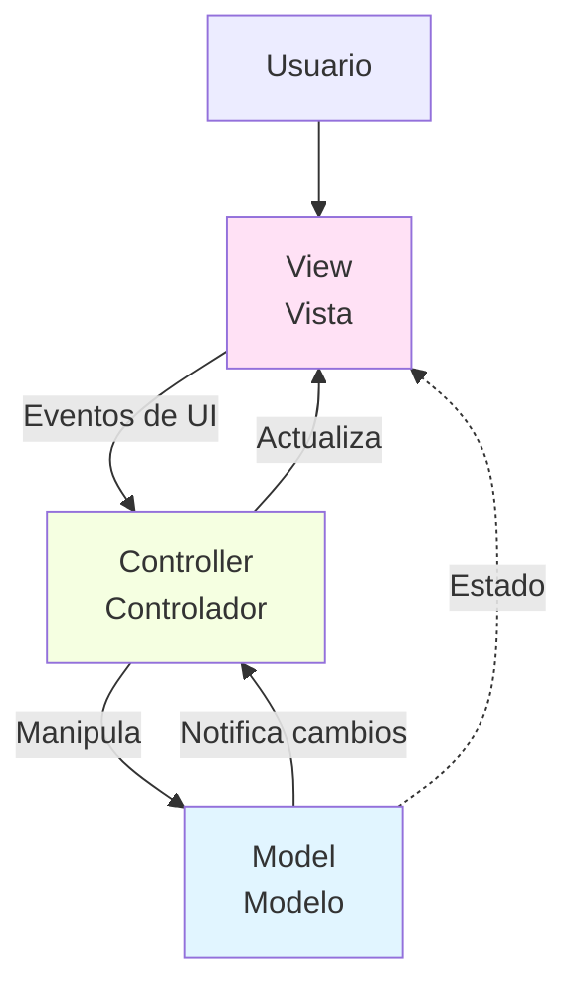
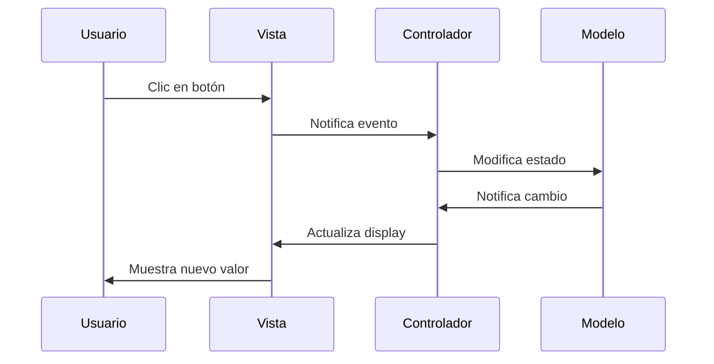
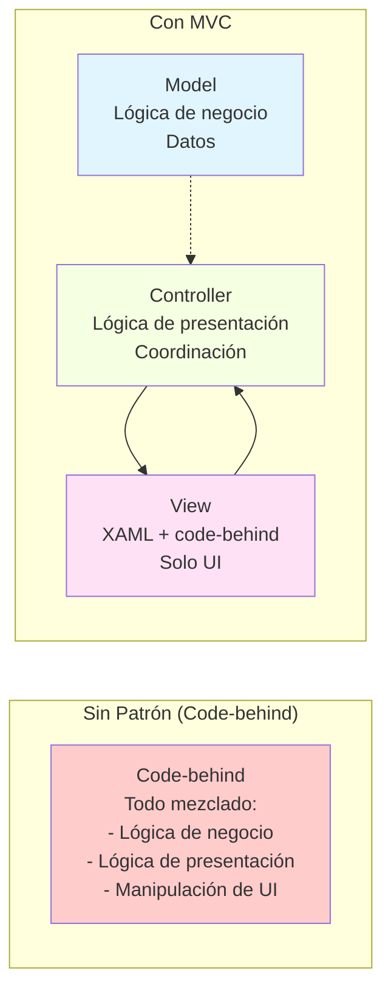

# 06 - Arquitectura MVC en WPF

## 1. ¿Qué es MVC?

**Model-View-Controller** (MVC) es un patrón arquitectónico que separa una aplicación en tres componentes interconectados, cada uno con responsabilidades específicas.

### 1.1 Historia

El patrón MVC fue inventado por **Trygve Reenskaug** en **1979** en Xerox PARC para el lenguaje de programación Smalltalk. Su objetivo era separar la representación interna de la información (modelo) de la forma en que se presenta al usuario (vista).

**Hitos históricos:**

- **1979**: Invención en Smalltalk
- **1990s**: Popularización en aplicaciones web (Ruby on Rails, ASP.NET MVC)
- **2000s**: Adaptación a aplicaciones de escritorio
- **Presente**: Base de patrones modernos como MVVM

---

## 2. Componentes de MVC



### 2.1 Model (Modelo)

**Responsabilidades:**

✅ Contiene la lógica de negocio  
✅ Gestiona los datos de la aplicación  
✅ No conoce la existencia de la vista ni del controlador  
✅ Puede notificar cambios mediante eventos (opcional)  

**Ejemplo:**

```csharp
namespace MvcApp.Models;

// Modelo simple: representa datos de negocio
public class Producto
{
    public int Id { get; set; }
    public string Nombre { get; set; } = "";
    public decimal Precio { get; set; }
    public int Stock { get; set; }
    
    public decimal CalcularTotal(int cantidad)
    {
        return Precio * cantidad;
    }
    
    public bool HayStock(int cantidad)
    {
        return Stock >= cantidad;
    }
}

// Modelo con lógica de negocio
public class CarritoCompra
{
    private readonly List<(Producto producto, int cantidad)> _items = [];
    
    public IReadOnlyList<(Producto producto, int cantidad)> Items => _items.AsReadOnly();
    
    public void AgregarProducto(Producto producto, int cantidad)
    {
        if (!producto.HayStock(cantidad))
            throw new InvalidOperationException("Stock insuficiente");
        
        var itemExistente = _items.FirstOrDefault(i => i.producto.Id == producto.Id);
        if (itemExistente != default)
        {
            _items.Remove(itemExistente);
            _items.Add((producto, itemExistente.cantidad + cantidad));
        }
        else
        {
            _items.Add((producto, cantidad));
        }
    }
    
    public decimal CalcularTotal()
    {
        return _items.Sum(item => item.producto.CalcularTotal(item.cantidad));
    }
}
```

### 2.2 View (Vista)

**Responsabilidades:**

✅ Presenta los datos al usuario  
✅ Captura eventos de interacción (clics, teclas)  
✅ Delega la lógica al controlador  
✅ Se actualiza cuando el modelo cambia  

**Características en WPF:**

- Definida en **XAML** (estructura) + **Code-behind** (eventos)
- No contiene lógica de negocio
- Solo código de presentación

**Ejemplo XAML:**

```xml
<Window x:Class="MvcApp.Views.ContadorView"
        xmlns="http://schemas.microsoft.com/winfx/2006/xaml/presentation"
        xmlns:x="http://schemas.microsoft.com/winfx/2006/xaml"
        Title="Contador" Height="200" Width="300">
    <StackPanel Margin="20" HorizontalAlignment="Center">
        <TextBlock x:Name="txtContador" 
                   Text="0" 
                   FontSize="48" 
                   HorizontalAlignment="Center" />
        
        <StackPanel Orientation="Horizontal" 
                    HorizontalAlignment="Center" 
                    Margin="0,20,0,0">
            <Button x:Name="btnDecrementar" 
                    Content="-" 
                    Width="60" Height="40" 
                    FontSize="24" 
                    Margin="0,0,10,0" />
            
            <Button x:Name="btnIncrementar" 
                    Content="+" 
                    Width="60" Height="40" 
                    FontSize="24" 
                    Margin="10,0,0,0" />
        </StackPanel>
        
        <Button x:Name="btnReset" 
                Content="Reset" 
                Width="120" Height="35" 
                Margin="0,20,0,0" />
    </StackPanel>
</Window>
```

### 2.3 Controller (Controlador)

**Responsabilidades:**

✅ Intermedia entre vista y modelo  
✅ Procesa eventos de la vista  
✅ Actualiza el modelo según las acciones del usuario  
✅ Actualiza la vista cuando el modelo cambia  
✅ Contiene la lógica de presentación (no de negocio)  

**Ejemplo:**

```csharp
namespace MvcApp.Controllers;

public class ContadorController
{
    private readonly ContadorModel _model;
    private readonly ContadorView _view;
    
    public ContadorController(ContadorModel model, ContadorView view)
    {
        _model = model;
        _view = view;
        
        // Suscribirse a eventos de la vista
        _view.btnIncrementar.Click += (s, e) => Incrementar();
        _view.btnDecrementar.Click += (s, e) => Decrementar();
        _view.btnReset.Click += (s, e) => Reset();
        
        // Suscribirse a eventos del modelo
        _model.ValorChanged += ActualizarVista;
        
        // Inicializar vista
        ActualizarVista();
    }
    
    private void Incrementar()
    {
        _model.Incrementar();
    }
    
    private void Decrementar()
    {
        _model.Decrementar();
    }
    
    private void Reset()
    {
        _model.Reset();
    }
    
    private void ActualizarVista()
    {
        _view.txtContador.Text = _model.Valor.ToString();
    }
}
```

---

## 3. Flujo de Datos en MVC



---

## 4. Ejemplo 1: Contador MVC Completo

### 4.1 Modelo

```csharp
namespace ContadorMvc.Models;

public class ContadorModel
{
    private int _valor;
    
    public int Valor
    {
        get => _valor;
        private set
        {
            if (_valor != value)
            {
                _valor = value;
                ValorChanged?.Invoke();
            }
        }
    }
    
    public event Action? ValorChanged;
    
    public void Incrementar()
    {
        Valor++;
    }
    
    public void Decrementar()
    {
        Valor--;
    }
    
    public void Reset()
    {
        Valor = 0;
    }
}
```

### 4.2 Vista

```xml
<!-- ContadorView.xaml -->
<Window x:Class="ContadorMvc.Views.ContadorView"
        xmlns="http://schemas.microsoft.com/winfx/2006/xaml/presentation"
        xmlns:x="http://schemas.microsoft.com/winfx/2006/xaml"
        Title="Contador MVC" Height="250" Width="350"
        WindowStartupLocation="CenterScreen">
    
    <StackPanel Margin="30" HorizontalAlignment="Center">
        <TextBlock Text="Contador MVC" 
                   FontSize="20" FontWeight="Bold" 
                   HorizontalAlignment="Center" 
                   Margin="0,0,0,20" />
        
        <Border BorderBrush="DarkGray" BorderThickness="2" 
                Padding="20" CornerRadius="5">
            <TextBlock x:Name="txtContador" 
                       Text="0" 
                       FontSize="56" 
                       FontWeight="Bold" 
                       HorizontalAlignment="Center" 
                       Foreground="DarkBlue" />
        </Border>
        
        <StackPanel Orientation="Horizontal" 
                    HorizontalAlignment="Center" 
                    Margin="0,25,0,0">
            <Button x:Name="btnDecrementar" 
                    Content="−" 
                    Width="70" Height="50" 
                    FontSize="28" FontWeight="Bold" 
                    Margin="0,0,15,0" />
            
            <Button x:Name="btnIncrementar" 
                    Content="+" 
                    Width="70" Height="50" 
                    FontSize="28" FontWeight="Bold" 
                    Margin="15,0,0,0" />
        </StackPanel>
        
        <Button x:Name="btnReset" 
                Content="🔄 Reset" 
                Width="140" Height="40" 
                FontSize="16" 
                Margin="0,20,0,0" />
    </StackPanel>
</Window>
```

```csharp
// ContadorView.xaml.cs
namespace ContadorMvc.Views;

public partial class ContadorView : Window
{
    public ContadorView()
    {
        InitializeComponent();
    }
}
```

### 4.3 Controlador

```csharp
namespace ContadorMvc.Controllers;

public class ContadorController
{
    private readonly ContadorModel _model;
    private readonly ContadorView _view;
    
    public ContadorController(ContadorModel model, ContadorView view)
    {
        _model = model;
        _view = view;
        
        InicializarEventos();
        ActualizarVista();
    }
    
    private void InicializarEventos()
    {
        // Eventos de la vista
        _view.btnIncrementar.Click += (s, e) => Incrementar();
        _view.btnDecrementar.Click += (s, e) => Decrementar();
        _view.btnReset.Click += (s, e) => Reset();
        
        // Eventos del modelo
        _model.ValorChanged += ActualizarVista;
    }
    
    private void Incrementar()
    {
        _model.Incrementar();
    }
    
    private void Decrementar()
    {
        _model.Decrementar();
    }
    
    private void Reset()
    {
        _model.Reset();
    }
    
    private void ActualizarVista()
    {
        _view.txtContador.Text = _model.Valor.ToString();
        
        // Lógica de presentación: cambiar color según valor
        _view.txtContador.Foreground = _model.Valor switch
        {
            < 0 => Brushes.Red,
            0 => Brushes.DarkBlue,
            _ => Brushes.Green
        };
    }
}
```

### 4.4 Punto de Entrada

```csharp
namespace ContadorMvc;

public static class Program
{
    [STAThread]
    static void Main()
    {
        Application app = new();
        
        // Crear los componentes MVC
        var model = new ContadorModel();
        var view = new ContadorView();
        var controller = new ContadorController(model, view);
        
        app.Run(view);
    }
}
```

---

## 5. Ejemplo 2: Formulario de Registro MVC

### 5.1 Modelo

```csharp
namespace RegistroMvc.Models;

public class Usuario
{
    public string Nombre { get; set; } = "";
    public string Email { get; set; } = "";
    public int Edad { get; set; }
    public string Pais { get; set; } = "";
}

public class RegistroModel
{
    private readonly List<Usuario> _usuarios = [];
    
    public IReadOnlyList<Usuario> Usuarios => _usuarios.AsReadOnly();
    
    public event Action? UsuariosChanged;
    
    public void RegistrarUsuario(Usuario usuario)
    {
        // Validaciones de negocio
        if (string.IsNullOrWhiteSpace(usuario.Nombre))
            throw new ArgumentException("El nombre es obligatorio");
        
        if (!EsEmailValido(usuario.Email))
            throw new ArgumentException("El email no es válido");
        
        if (usuario.Edad < 18)
            throw new ArgumentException("Debe ser mayor de edad");
        
        if (_usuarios.Any(u => u.Email == usuario.Email))
            throw new ArgumentException("El email ya está registrado");
        
        _usuarios.Add(usuario);
        UsuariosChanged?.Invoke();
    }
    
    public void EliminarUsuario(Usuario usuario)
    {
        _usuarios.Remove(usuario);
        UsuariosChanged?.Invoke();
    }
    
    private bool EsEmailValido(string email)
    {
        return !string.IsNullOrWhiteSpace(email) && 
               email.Contains('@') && 
               email.Contains('.');
    }
}
```

### 5.2 Vista

```xml
<!-- RegistroView.xaml -->
<Window x:Class="RegistroMvc.Views.RegistroView"
        xmlns="http://schemas.microsoft.com/winfx/2006/xaml/presentation"
        xmlns:x="http://schemas.microsoft.com/winfx/2006/xaml"
        Title="Registro de Usuarios" Height="500" Width="700"
        WindowStartupLocation="CenterScreen">
    
    <Grid>
        <Grid.ColumnDefinitions>
            <ColumnDefinition Width="2*" />
            <ColumnDefinition Width="3*" />
        </Grid.ColumnDefinitions>
        
        <!-- Formulario -->
        <Grid Grid.Column="0" Margin="20">
            <Grid.RowDefinitions>
                <RowDefinition Height="Auto" />
                <RowDefinition Height="Auto" />
                <RowDefinition Height="Auto" />
                <RowDefinition Height="Auto" />
                <RowDefinition Height="Auto" />
                <RowDefinition Height="Auto" />
                <RowDefinition Height="*" />
            </Grid.RowDefinitions>
            
            <TextBlock Grid.Row="0" Text="Nuevo Usuario" 
                       FontSize="18" FontWeight="Bold" 
                       Margin="0,0,0,20" />
            
            <TextBlock Grid.Row="1" Text="Nombre:" />
            <TextBox Grid.Row="1" x:Name="txtNombre" 
                     Margin="0,20,0,0" />
            
            <TextBlock Grid.Row="2" Text="Email:" Margin="0,10,0,0" />
            <TextBox Grid.Row="2" x:Name="txtEmail" 
                     Margin="0,30,0,0" />
            
            <TextBlock Grid.Row="3" Text="Edad:" Margin="0,10,0,0" />
            <TextBox Grid.Row="3" x:Name="txtEdad" 
                     Margin="0,30,0,0" />
            
            <TextBlock Grid.Row="4" Text="País:" Margin="0,10,0,0" />
            <ComboBox Grid.Row="4" x:Name="cmbPais" 
                      Margin="0,30,0,0" />
            
            <Button Grid.Row="5" x:Name="btnRegistrar" 
                    Content="Registrar" 
                    Height="40" 
                    Margin="0,20,0,0" />
            
            <TextBlock Grid.Row="6" x:Name="txtMensaje" 
                       TextWrapping="Wrap" 
                       VerticalAlignment="Top" 
                       Margin="0,10,0,0" />
        </Grid>
        
        <!-- Lista de usuarios -->
        <Grid Grid.Column="1" Margin="20">
            <Grid.RowDefinitions>
                <RowDefinition Height="Auto" />
                <RowDefinition Height="*" />
                <RowDefinition Height="Auto" />
            </Grid.RowDefinitions>
            
            <TextBlock Grid.Row="0" Text="Usuarios Registrados" 
                       FontSize="18" FontWeight="Bold" 
                       Margin="0,0,0,20" />
            
            <ListBox Grid.Row="1" x:Name="lstUsuarios">
                <ListBox.ItemTemplate>
                    <DataTemplate>
                        <StackPanel Margin="5">
                            <TextBlock Text="{Binding Nombre}" 
                                       FontWeight="Bold" FontSize="14" />
                            <TextBlock Text="{Binding Email}" 
                                       Foreground="Gray" FontSize="12" />
                            <StackPanel Orientation="Horizontal">
                                <TextBlock Text="Edad: " FontSize="11" />
                                <TextBlock Text="{Binding Edad}" FontSize="11" />
                                <TextBlock Text=" | País: " FontSize="11" Margin="10,0,0,0" />
                                <TextBlock Text="{Binding Pais}" FontSize="11" />
                            </StackPanel>
                        </StackPanel>
                    </DataTemplate>
                </ListBox.ItemTemplate>
            </ListBox>
            
            <Button Grid.Row="2" x:Name="btnEliminar" 
                    Content="Eliminar Seleccionado" 
                    Height="35" 
                    Margin="0,10,0,0" />
        </Grid>
    </Grid>
</Window>
```

```csharp
// RegistroView.xaml.cs
namespace RegistroMvc.Views;

public partial class RegistroView : Window
{
    public RegistroView()
    {
        InitializeComponent();
        
        // Poblar ComboBox de países
        cmbPais.ItemsSource = new[] { "España", "México", "Argentina", "Colombia", "Chile" };
        cmbPais.SelectedIndex = 0;
    }
}
```

### 5.3 Controlador

```csharp
namespace RegistroMvc.Controllers;

public class RegistroController
{
    private readonly RegistroModel _model;
    private readonly RegistroView _view;
    
    public RegistroController(RegistroModel model, RegistroView view)
    {
        _model = model;
        _view = view;
        
        InicializarEventos();
        ActualizarVistaUsuarios();
    }
    
    private void InicializarEventos()
    {
        _view.btnRegistrar.Click += (s, e) => RegistrarUsuario();
        _view.btnEliminar.Click += (s, e) => EliminarUsuarioSeleccionado();
        _model.UsuariosChanged += ActualizarVistaUsuarios;
    }
    
    private void RegistrarUsuario()
    {
        try
        {
            // Validar entrada
            if (!int.TryParse(_view.txtEdad.Text, out int edad))
            {
                MostrarError("La edad debe ser un número");
                return;
            }
            
            // Crear usuario
            var usuario = new Usuario
            {
                Nombre = _view.txtNombre.Text,
                Email = _view.txtEmail.Text,
                Edad = edad,
                Pais = _view.cmbPais.SelectedItem?.ToString() ?? ""
            };
            
            // Registrar en el modelo
            _model.RegistrarUsuario(usuario);
            
            MostrarExito($"✅ Usuario '{usuario.Nombre}' registrado correctamente");
            LimpiarFormulario();
        }
        catch (ArgumentException ex)
        {
            MostrarError(ex.Message);
        }
    }
    
    private void EliminarUsuarioSeleccionado()
    {
        if (_view.lstUsuarios.SelectedItem is not Usuario usuario)
        {
            MostrarError("Selecciona un usuario primero");
            return;
        }
        
        var resultado = MessageBox.Show(
            $"¿Eliminar al usuario '{usuario.Nombre}'?",
            "Confirmar",
            MessageBoxButton.YesNo,
            MessageBoxImage.Question
        );
        
        if (resultado == MessageBoxResult.Yes)
        {
            _model.EliminarUsuario(usuario);
            MostrarExito("Usuario eliminado");
        }
    }
    
    private void ActualizarVistaUsuarios()
    {
        _view.lstUsuarios.ItemsSource = null;
        _view.lstUsuarios.ItemsSource = _model.Usuarios;
    }
    
    private void LimpiarFormulario()
    {
        _view.txtNombre.Clear();
        _view.txtEmail.Clear();
        _view.txtEdad.Clear();
        _view.cmbPais.SelectedIndex = 0;
        _view.txtNombre.Focus();
    }
    
    private void MostrarError(string mensaje)
    {
        _view.txtMensaje.Foreground = Brushes.Red;
        _view.txtMensaje.Text = $"❌ {mensaje}";
    }
    
    private void MostrarExito(string mensaje)
    {
        _view.txtMensaje.Foreground = Brushes.Green;
        _view.txtMensaje.Text = mensaje;
    }
}
```

---

## 6. Ventajas y Limitaciones de MVC

### 6.1 Ventajas

✅ **Separación de responsabilidades**: cada componente tiene un propósito claro  
✅ **Testabilidad**: modelo y controlador son fáciles de testear  
✅ **Mantenibilidad**: cambios en uno no afectan a los otros (bajo acoplamiento)  
✅ **Reutilización**: el mismo modelo puede usarse con diferentes vistas  
✅ **Paralelización**: diseñadores y programadores pueden trabajar simultáneamente  

### 6.2 Limitaciones en WPF

❌ **Verbosidad**: mucho código para conectar vista y controlador  
❌ **Eventos manuales**: hay que suscribirse manualmente a eventos de controles  
❌ **Actualización manual**: el controlador debe actualizar la vista explícitamente  
❌ **No aprovecha data binding**: no usa las capacidades reactivas de WPF  
❌ **Difícil de escalar**: en aplicaciones grandes, el controlador se vuelve complejo  

**Conclusión:** MVC funciona bien en aplicaciones web, pero en WPF es mejor usar **MVVM**, que está diseñado específicamente para aprovechar el data binding.

---

## 7. Diagrama Comparativo: MVC vs. Aplicación sin Patrón



---

## 8. Resumen

| Concepto | Descripción |
|----------|-------------|
| MVC | Patrón que separa aplicación en Modelo, Vista y Controlador |
| Model | Lógica de negocio y datos |
| View | Presentación visual (XAML + code-behind simple) |
| Controller | Intermediario que coordina modelo y vista |
| Flujo | Usuario → Vista → Controlador → Modelo → Controlador → Vista |
| Ventaja principal | Separación clara de responsabilidades |
| Limitación en WPF | No aprovecha data binding nativo |

---

## 9. Tabla Comparativa

| Aspecto | Sin Patrón | Con MVC |
|---------|-----------|---------|
| **Separación** | ❌ Todo mezclado | ✅ Responsabilidades claras |
| **Testabilidad** | ❌ Difícil | ✅ Fácil (modelo + controlador) |
| **Mantenibilidad** | ❌ Código espagueti | ✅ Código organizado |
| **Reutilización** | ❌ Imposible | ✅ Modelo reutilizable |
| **Complejidad** | Baja (al inicio) | Media (más archivos) |
| **Data Binding** | Manual | Manual |

---

## 10. Ejercicios Propuestos

1. **Calculadora MVC**: Implementa una calculadora completa usando el patrón MVC. El modelo debe contener la lógica de cálculo.

2. **Lista de Tareas MVC**: Crea una aplicación de lista de tareas con MVC. Permite añadir, eliminar y marcar como completadas.

3. **Conversor de Moneda MVC**: Implementa un conversor con tasas de cambio en el modelo y múltiples monedas.

4. **Catálogo de Productos MVC**: Crea un catálogo con búsqueda, filtrado y gestión de inventario usando MVC.

---

## 11. Referencias

- Martin Fowler: *GUI Architectures* (https://martinfowler.com/eaaDev/uiArchs.html)
- Microsoft: *MVC Pattern* (https://learn.microsoft.com/aspnet/mvc/overview/older-versions-1/overview/understanding-models-views-and-controllers-cs)
- Gang of Four: *Design Patterns*

Ver ejemplos completos en `/soluciones/06-arquitectura-mvc/`

---

*Documento elaborado para el módulo de Programación del ciclo formativo 1º DAW · Curso 2025-2026*
