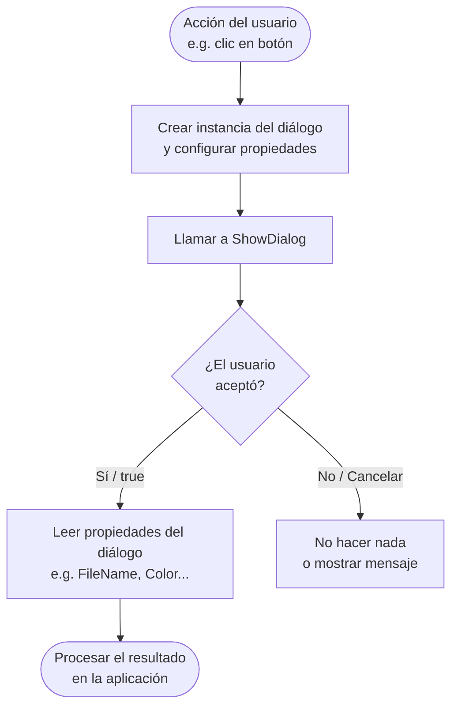

# 07 - WPF: Diálogos Predefinidos

Los diálogos predefinidos son ventanas estándar del sistema operativo o del framework que permiten al usuario realizar acciones comunes (abrir archivos, guardar, imprimir, etc.) sin necesidad de diseñarlas desde cero.

---

## 1. MessageBox

`MessageBox` es el diálogo más sencillo. Muestra un mensaje al usuario y opcionalmente espera una respuesta.

### Tipos de icono

| Valor | Icono mostrado | Uso típico |
|-------|---------------|------------|
| `MessageBoxImage.Information` | ℹ️ Azul | Información general |
| `MessageBoxImage.Warning` | ⚠️ Amarillo | Advertencia no crítica |
| `MessageBoxImage.Error` | ❌ Rojo | Error grave |
| `MessageBoxImage.Question` | ❓ Azul | Pregunta al usuario |
| `MessageBoxImage.None` | Sin icono | Mensajes neutros |

### Opciones de botones

| Valor | Botones que aparecen | Uso típico |
|-------|---------------------|------------|
| `MessageBoxButton.OK` | Aceptar | Confirmación simple |
| `MessageBoxButton.OKCancel` | Aceptar / Cancelar | Acción reversible |
| `MessageBoxButton.YesNo` | Sí / No | Decisión binaria |
| `MessageBoxButton.YesNoCancel` | Sí / No / Cancelar | Decisión con opción de salir |
| `MessageBoxButton.RetryCancel` | Reintentar / Cancelar | Operaciones que pueden fallar |
| `MessageBoxButton.AbortRetryIgnore` | Anular / Reintentar / Ignorar | Errores de proceso |

### Fragmentos de uso

```csharp
// Mensaje informativo simple (solo botón Aceptar)
MessageBox.Show("El archivo se ha guardado correctamente.",
                "Guardado",
                MessageBoxButton.OK,
                MessageBoxImage.Information);
```

```csharp
// Advertencia con botón Aceptar/Cancelar
MessageBox.Show("Los cambios no guardados se perderán.",
                "Advertencia",
                MessageBoxButton.OKCancel,
                MessageBoxImage.Warning);
```

```csharp
// Error crítico
MessageBox.Show("No se pudo conectar con la base de datos.",
                "Error",
                MessageBoxButton.OK,
                MessageBoxImage.Error);
```

```csharp
// Capturar la respuesta del usuario (Sí / No)
MessageBoxResult resultado = MessageBox.Show(
    "¿Deseas eliminar el archivo seleccionado?",
    "Confirmar eliminación",
    MessageBoxButton.YesNo,
    MessageBoxImage.Question);

if (resultado == MessageBoxResult.Yes)
{
    // El usuario confirmó → proceder con el borrado
    EliminarArchivo();
}
```

```csharp
// Título personalizado con tres opciones (Sí / No / Cancelar)
MessageBoxResult resultado = MessageBox.Show(
    "¿Guardar los cambios antes de cerrar?",
    "Mi Aplicación - Cerrar",
    MessageBoxButton.YesNoCancel,
    MessageBoxImage.Question);

switch (resultado)
{
    case MessageBoxResult.Yes:    GuardarYCerrar(); break;
    case MessageBoxResult.No:     CerrarSinGuardar(); break;
    case MessageBoxResult.Cancel: /* no hacer nada */ break;
}
```

---

## 2. OpenFileDialog

Permite al usuario seleccionar uno o varios archivos del sistema de ficheros. En WPF pertenece al espacio de nombres **`Microsoft.Win32`** (no `System.Windows.Forms`).

```csharp
using Microsoft.Win32;
```

### Fragmento con filtro de tipos de archivo

```csharp
// Abrir un archivo de texto o imagen
OpenFileDialog dialogo = new OpenFileDialog();
dialogo.Title = "Seleccionar archivo";
dialogo.Filter = "Archivos de texto (*.txt)|*.txt|Imágenes (*.png;*.jpg)|*.png;*.jpg|Todos los archivos (*.*)|*.*";
dialogo.InitialDirectory = Environment.GetFolderPath(Environment.SpecialFolder.MyDocuments);

if (dialogo.ShowDialog() == true)
{
    string ruta = dialogo.FileName;
    // Usar 'ruta' para abrir el archivo
}
```

> 💡 El filtro sigue el formato: `"Descripción (*.ext)|*.ext"`. Varios filtros se separan con `|`.

### Fragmento con selección múltiple

```csharp
// Permitir seleccionar varios archivos a la vez
OpenFileDialog dialogo = new OpenFileDialog();
dialogo.Filter = "Imágenes (*.png;*.jpg;*.bmp)|*.png;*.jpg;*.bmp";
dialogo.Multiselect = true;

if (dialogo.ShowDialog() == true)
{
    foreach (string ruta in dialogo.FileNames)
    {
        // Procesar cada archivo seleccionado
        ProcesarImagen(ruta);
    }
}
```

### Propiedades importantes

| Propiedad | Tipo | Descripción |
|-----------|------|-------------|
| `Filter` | `string` | Filtro de tipos de archivo visibles |
| `FileName` | `string` | Ruta completa del archivo seleccionado |
| `FileNames` | `string[]` | Rutas de todos los archivos (multiselección) |
| `InitialDirectory` | `string` | Carpeta que se abre por defecto |
| `Title` | `string` | Título de la ventana del diálogo |
| `Multiselect` | `bool` | Permite seleccionar varios archivos |
| `CheckFileExists` | `bool` | Valida que el archivo exista (por defecto `true`) |

---

## 3. SaveFileDialog

Similar a `OpenFileDialog` pero para guardar. También está en **`Microsoft.Win32`**.

### Fragmento con extensión por defecto y filtro

```csharp
// Guardar un archivo con extensión predeterminada
SaveFileDialog dialogo = new SaveFileDialog();
dialogo.Title = "Guardar archivo";
dialogo.DefaultExt = ".txt";
dialogo.Filter = "Archivos de texto (*.txt)|*.txt|Todos los archivos (*.*)|*.*";
dialogo.FileName = "documento_sin_titulo";

if (dialogo.ShowDialog() == true)
{
    string ruta = dialogo.FileName;
    File.WriteAllText(ruta, contenidoEditor);
}
```

### Fragmento comprobando el resultado antes de guardar

```csharp
// Verificar que el usuario no canceló antes de escribir
bool? resultado = dialogo.ShowDialog();

if (resultado.HasValue && resultado.Value)
{
    // ShowDialog devuelve bool? → comparar con true explícitamente
    GuardarContenido(dialogo.FileName);
}
else
{
    // El usuario canceló o cerró el diálogo
}
```

> ⚠️ `ShowDialog()` devuelve `bool?` (nullable). Compara siempre con `== true`, no con `!= false`.

---

## 4. FolderBrowserDialog

Permite al usuario seleccionar una **carpeta** (no un archivo). En WPF puro no existe un diálogo nativo moderno; hay varias opciones:

| Opción | Ventaja | Inconveniente |
|--------|---------|---------------|
| `System.Windows.Forms.FolderBrowserDialog` | Disponible sin NuGet | UI antigua (árbol de Windows XP) |
| `Ookii.Dialogs.Wpf.VistaFolderBrowserDialog` | UI moderna (Vista/10/11) | Requiere paquete NuGet |

### Fragmento con FolderBrowserDialog de WinForms

```csharp
// Requiere referencia a System.Windows.Forms
using System.Windows.Forms;

var dialogo = new FolderBrowserDialog();
dialogo.Description = "Selecciona la carpeta de destino";
dialogo.ShowNewFolderButton = true;

if (dialogo.ShowDialog() == DialogResult.OK)
{
    string carpeta = dialogo.SelectedPath;
    // Usar 'carpeta' como directorio de trabajo
}
```

> 💡 Para proyectos .NET 6+, añade `<UseWindowsForms>true</UseWindowsForms>` en el archivo `.csproj`.

### Fragmento con VistaFolderBrowserDialog (recomendado)

```csharp
// Instalar: dotnet add package Ookii.Dialogs.Wpf
using Ookii.Dialogs.Wpf;

var dialogo = new VistaFolderBrowserDialog();
dialogo.Description = "Selecciona la carpeta de destino";
dialogo.UseDescriptionForTitle = true;

if (dialogo.ShowDialog() == true)
{
    string carpeta = dialogo.SelectedPath;
}
```

---

## 5. ColorDialog (integración con WinForms)

WPF no incluye un `ColorDialog` nativo. Las alternativas son integrar el de WinForms o usar un control de terceros.

### Fragmento usando el ColorDialog de WinForms

```csharp
// Requiere referencia a System.Windows.Forms
using System.Windows.Forms;
using System.Windows.Media;

var dialogo = new ColorDialog();
dialogo.FullOpen = true; // Mostrar selector avanzado

if (dialogo.ShowDialog() == DialogResult.OK)
{
    System.Drawing.Color colorGdi = dialogo.Color;
    // Convertir de System.Drawing.Color a System.Windows.Media.Color
    Color colorWpf = Color.FromArgb(colorGdi.A, colorGdi.R, colorGdi.G, colorGdi.B);
    rectanguloMuestra.Fill = new SolidColorBrush(colorWpf);
}
```

> 💡 **Alternativa recomendada:** el paquete NuGet `ColorPickerWPF` o `Xceed.Wpf.Toolkit` ofrece un selector de color nativo para WPF.

---

## 6. PrintDialog

`PrintDialog` en WPF está en el espacio de nombres `System.Windows.Controls` y es completamente nativo.

### Fragmento básico para imprimir un control

```csharp
// Imprimir cualquier UIElement (un Grid, Canvas, etc.)
PrintDialog dialogo = new PrintDialog();

if (dialogo.ShowDialog() == true)
{
    // Imprimir el contenido del panel principal
    dialogo.PrintVisual(panelContenido, "Impresión de documento");
}
```

### Fragmento para impresión paginada (FlowDocument)

```csharp
// Imprimir un FlowDocument con control de páginas
PrintDialog dialogo = new PrintDialog();

if (dialogo.ShowDialog() == true)
{
    IDocumentPaginatorSource documento = flowDocumentViewer.Document;
    dialogo.PrintDocument(
        documento.DocumentPaginator,
        "Informe - Mi Aplicación");
}
```

> 💡 `PrintVisual` imprime un control visual tal cual. `PrintDocument` gestiona la paginación automáticamente para documentos largos.

---

## 7. ¿Cuándo usar cada diálogo?

| Diálogo | Usar cuando... | Ejemplo de uso |
|---------|---------------|----------------|
| `MessageBox` | Necesitas mostrar un aviso o pedir confirmación rápida | "¿Deseas salir sin guardar?" |
| `OpenFileDialog` | El usuario debe seleccionar un archivo existente | Abrir imagen, cargar configuración |
| `SaveFileDialog` | El usuario debe indicar dónde guardar un nuevo archivo | Exportar a PDF, guardar proyecto |
| `FolderBrowserDialog` | El usuario debe elegir un directorio completo | Carpeta de destino de exportación |
| `ColorDialog` | El usuario debe elegir un color | Personalizar tema de la aplicación |
| `PrintDialog` | El usuario quiere imprimir contenido | Imprimir informe, factura |

---

## 8. Flujo de uso de un diálogo



---

## 9. Diálogos Personalizados

Cuando los diálogos predefinidos no son suficientes, puedes crear tu propia ventana de diálogo.

### Fragmento: definir una ventana de diálogo personalizada (XAML)

```xml
<!-- DialogoNombreUsuario.xaml -->
<Window x:Class="MiApp.DialogoNombreUsuario"
        Title="Introduce tu nombre" Height="150" Width="350"
        ResizeMode="NoResize" WindowStartupLocation="CenterOwner">
    <StackPanel Margin="16" Spacing="8">
        <TextBlock Text="Nombre de usuario:"/>
        <TextBox x:Name="txtNombre" Width="300"/>
        <StackPanel Orientation="Horizontal" HorizontalAlignment="Right">
            <Button Content="Aceptar"  Click="BtnAceptar_Click" IsDefault="True" Margin="0,0,8,0"/>
            <Button Content="Cancelar" Click="BtnCancelar_Click" IsCancel="True"/>
        </StackPanel>
    </StackPanel>
</Window>
```

### Fragmento: código detrás del diálogo personalizado

```csharp
// DialogoNombreUsuario.xaml.cs
public partial class DialogoNombreUsuario : Window
{
    public string NombreIntroducido { get; private set; } = string.Empty;

    private void BtnAceptar_Click(object sender, RoutedEventArgs e)
    {
        NombreIntroducido = txtNombre.Text;
        DialogResult = true; // cierra con resultado positivo
    }

    private void BtnCancelar_Click(object sender, RoutedEventArgs e)
    {
        DialogResult = false; // cierra con resultado negativo
    }
}
```

### Fragmento: abrir el diálogo y recuperar el dato

```csharp
// En la ventana principal — abrir el diálogo y leer el resultado
var dialogo = new DialogoNombreUsuario();
dialogo.Owner = this; // centrar sobre la ventana padre

if (dialogo.ShowDialog() == true)
{
    // El usuario hizo clic en Aceptar
    string nombre = dialogo.NombreIntroducido;
    lblBienvenida.Content = $"Bienvenido, {nombre}";
}
```

> 💡 Asignar `DialogResult` en código detrás cierra la ventana automáticamente y devuelve ese valor a quien llamó `ShowDialog()`. Usa `IsDefault="True"` e `IsCancel="True"` en los botones para que Enter y Escape también funcionen.

---

## Resumen

| Concepto clave | Detalle |
|---------------|---------|
| `ShowDialog()` devuelve `bool?` | Compara siempre con `== true` |
| `OpenFileDialog` / `SaveFileDialog` | Espacio de nombres `Microsoft.Win32` (no WinForms) |
| `FolderBrowserDialog` | Requiere WinForms o paquete NuGet externo |
| `ColorDialog` | No existe en WPF puro; usar WinForms o NuGet |
| `PrintDialog` | Nativo en `System.Windows.Controls` |
| Diálogos personalizados | `Window` + `ShowDialog()` + `DialogResult` |
