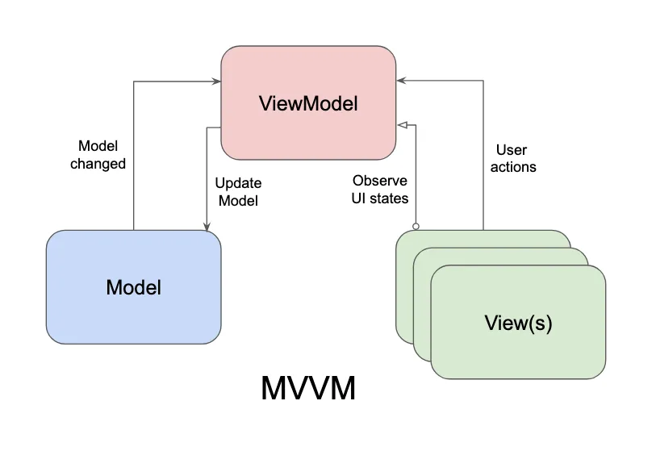
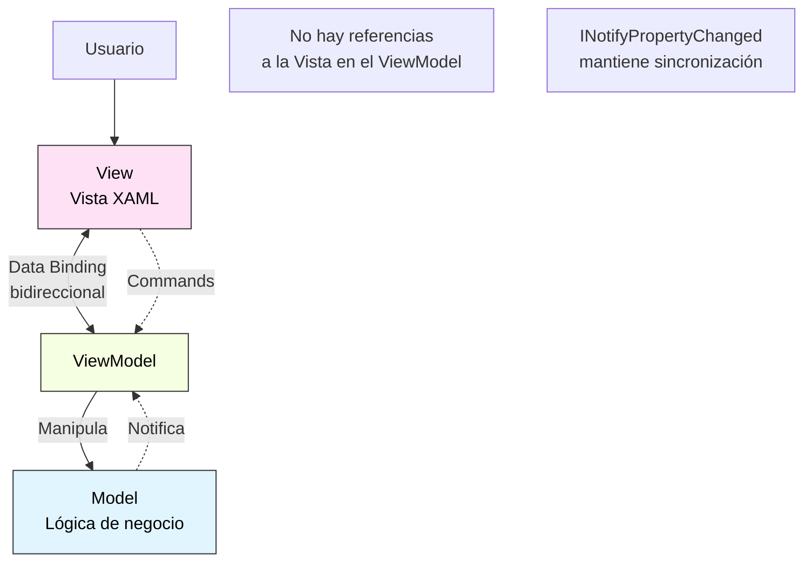
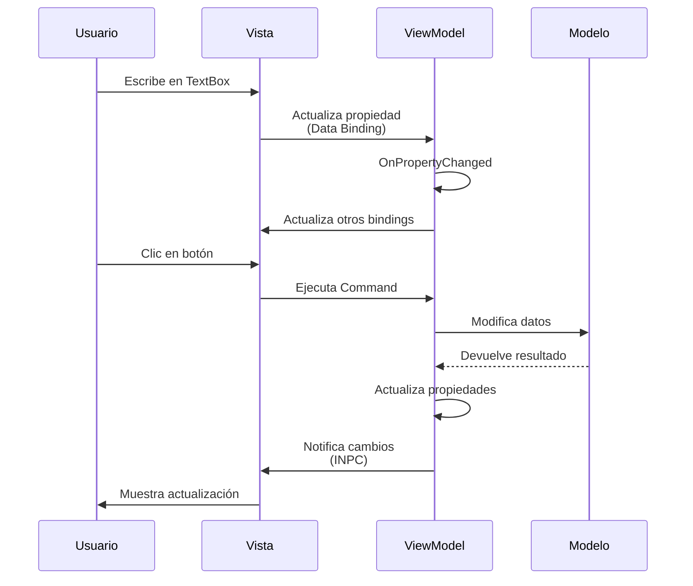
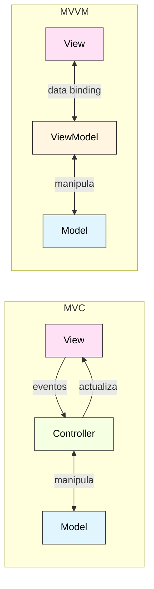

# 8. Arquitectura MVVM en WPF

- [8.1. ¿Qué es MVVM?](#81-qué-es-mvvm)
  - [8.1.1. Historia](#811-historia)
  - [8.1.2. ¿Por qué MVVM para WPF?](#812-por-qué-mvvm-para-wpf)
- [8.2. Componentes de MVVM](#82-componentes-de-mvvm)
  - [8.2.1. Model (Modelo)](#821-model-modelo)
  - [8.2.2. View (Vista)](#822-view-vista)
  - [8.2.3. ViewModel](#823-viewmodel)
- [8.3. ICommand: Comandos en lugar de Eventos](#83-icomand-comandos-en-lugar-de-eventos)
  - [8.3.1. La Interfaz ICommand](#831-la-interfaz-icomand)
  - [8.3.2. Implementación Manual](#832-implementación-manual)
  - [8.3.3. Con CommunityToolkit.Mvvm](#833-con-communitytoolkitmvvm)
- [8.4. CommunityToolkit.Mvvm: La Biblioteca Oficial](#84-communitytoolkitmvvm-la-biblioteca-oficial)
  - [8.4.1. Instalación](#841-instalación)
  - [8.4.2. Atributos Principales](#842-atributos-principales)
  - [8.4.3. Ejemplo Completo con Todos los Atributos](#843-ejemplo-completo-con-todos-los-atributos)
- [8.5. Flujo de Datos en MVVM](#85-flujo-de-datos-en-mvvm)
- [8.6. Ejemplo Completo 1: Contador MVVM](#86-ejemplo-completo-1-contador-mvvm)
  - [8.6.1. Modelo](#861-modelo)
  - [8.6.2. ViewModel](#862-viewmodel)
  - [8.6.3. Vista](#863-vista)
- [8.7. Ejemplo Completo 2: Lista de Tareas MVVM](#87-ejemplo-completo-2-lista-de-tareas-mvvm)
  - [8.7.1. Modelo](#871-modelo)
  - [8.7.2. ViewModel de Tarea Individual](#872-viewmodel-de-tarea-individual)
  - [8.7.3. ViewModel Principal](#873-viewmodel-principal)
  - [8.7.4. Vista](#874-vista)
- [8.8. Comparación: MVC vs. MVVM](#88-comparación-mvc-vs-mvvm)
  - [8.8.1. Tabla Comparativa](#881-tabla-comparativa)
  - [8.8.2. Diagrama Comparativo](#882-diagrama-comparativo)
  - [8.8.3. Código Comparativo](#883-código-comparativo)
- [8.9. Ventajas y Desventajas de MVVM](#89-ventajas-y-desventajas-de-mvvm)
  - [8.9.1. Ventajas](#891-ventajas)
  - [8.9.2. Desventajas](#892-desventajas)

## 8.1. ¿Qué es MVVM?

**Model-View-ViewModel** (MVVM) es un patrón arquitectónico diseñado específicamente para interfaces de usuario que utilizan **data binding bidireccional**. Fue inventado por Microsoft en 2005 como una variante de MVC optimizada para WPF y Silverlight.

> 📝 **Nota del Profesor**: MVVM es el PATRÓN de WPF. Si no usas MVVM, estás desperdiciando WPF. CommunityToolkit.Mvvm hace que sea muy fácil. Invierte tiempo en dominarlo.

### 8.1.1. Historia

- **2005**: John Gossman (Microsoft) inventa MVVM para WPF
- **2006**: Lanzamiento de WPF con .NET Framework 3.0
- **2010**: Popularización con Silverlight y Windows Phone
- **2022**: .NET MAUI adopta MVVM como patrón principal
- **Presente**: Estándar de facto para aplicaciones WPF, UWP y MAUI

### 8.1.2. ¿Por qué MVVM para WPF?

MVC tiene limitaciones en WPF porque:

❌ Requiere actualización manual de la vista  
❌ No aprovecha el data binding de WPF  
❌ El controlador conoce detalles de la vista  

**MVVM soluciona esto:**

✅ Data binding automático entre Vista y ViewModel  
✅ Vista y ViewModel desacoplados  
✅ No hay referencias a controles UI en el ViewModel  
✅ Testabilidad total sin UI  

---

## 8.2. Componentes de MVVM





### 8.2.1. Model (Modelo)

**Igual que en MVC:**

✅ Lógica de negocio  
✅ Acceso a datos  
✅ Validaciones de dominio  
✅ Independiente de la UI  

```csharp
namespace MvvmApp.Models;

public class Producto
{
    // Required members (C# 11+) - el compilador fuerza que se inicialicen
    public required int Id { get; init; }
    public required string Nombre { get; init; }
    public decimal Precio { get; set; }
    public int Stock { get; set; }
    
    public bool HayStock(int cantidad) => Stock >= cantidad;
    
    public void ReducirStock(int cantidad)
    {
        if (!HayStock(cantidad))
            throw new InvalidOperationException("Stock insuficiente");
        
        Stock -= cantidad;
    }
}

// Uso - el compilador avisa si no se proporciona Id o Nombre
var producto = new Producto 
{ 
    Id = 1, 
    Nombre = "Portátil", 
    Precio = 999.99m 
};
```

### 8.2.2. View (Vista)

**Diferencias con MVC:**

- ✅ Solo XAML (casi sin code-behind)
- ✅ Data binding en lugar de eventos
- ✅ Commands en lugar de event handlers
- ✅ No conoce el ViewModel (solo a través del DataContext)

```xml
<Window x:Class="MvvmApp.Views.ProductoView"
        xmlns="http://schemas.microsoft.com/winfx/2006/xaml/presentation"
        xmlns:x="http://schemas.microsoft.com/winfx/2006/xaml"
        Title="Producto" Height="300" Width="400">
    
    <StackPanel Margin="20">
        <!-- Binding automático a propiedades del ViewModel -->
        <TextBlock Text="Nombre:" />
        <TextBox Text="{Binding Nombre, UpdateSourceTrigger=PropertyChanged}" />
        
        <TextBlock Text="Precio:" Margin="0,10,0,0" />
        <TextBox Text="{Binding Precio}" />
        
        <!-- Command en lugar de Click event -->
        <Button Content="Guardar" 
                Command="{Binding GuardarCommand}" 
                Margin="0,20,0,0" />
    </StackPanel>
</Window>
```

### 8.2.3. ViewModel

**Responsabilidades:**

✅ Expone datos del modelo en formato adecuado para la vista  
✅ Implementa `INotifyPropertyChanged` para reactividad  
✅ Expone `ICommand` para acciones de usuario  
✅ Contiene lógica de presentación  
✅ NO tiene referencias a controles UI  

```csharp
using CommunityToolkit.Mvvm.ComponentModel;
using CommunityToolkit.Mvvm.Input;

namespace MvvmApp.ViewModels;

public partial class ProductoViewModel : ObservableObject
{
    private readonly Producto _producto;
    
    [ObservableProperty]
    private string _nombre = "";
    
    [ObservableProperty]
    private decimal _precio;
    
    public ProductoViewModel(Producto producto)
    {
        _producto = producto;
        Nombre = producto.Nombre;
        Precio = producto.Precio;
    }
    
    [RelayCommand]
    private void Guardar()
    {
        _producto.Nombre = Nombre;
        _producto.Precio = Precio;
        // Guardar en base de datos, etc.
    }
}
```

---

## 8.3. ICommand: Comandos en lugar de Eventos

### 8.3.1. La Interfaz ICommand

```csharp
public interface ICommand
{
    event EventHandler? CanExecuteChanged;
    bool CanExecute(object? parameter);
    void Execute(object? parameter);
}
```

**Concepto:** En lugar de manejar eventos `Click` en el code-behind, la vista se vincula a un **Command** del ViewModel.

### 8.3.2. Implementación Manual

```csharp
public class RelayCommand : ICommand
{
    private readonly Action _execute;
    private readonly Func<bool>? _canExecute;
    
    public RelayCommand(Action execute, Func<bool>? canExecute = null)
    {
        _execute = execute ?? throw new ArgumentNullException(nameof(execute));
        _canExecute = canExecute;
    }
    
    public event EventHandler? CanExecuteChanged
    {
        add => CommandManager.RequerySuggested += value;
        remove => CommandManager.RequerySuggested -= value;
    }
    
    public bool CanExecute(object? parameter)
    {
        return _canExecute?.Invoke() ?? true;
    }
    
    public void Execute(object? parameter)
    {
        _execute();
    }
}

// Uso en ViewModel
public class MiViewModel
{
    public ICommand GuardarCommand { get; }
    
    public MiViewModel()
    {
        GuardarCommand = new RelayCommand(Guardar, PuedeGuardar);
    }
    
    private void Guardar()
    {
        // Lógica de guardado
    }
    
    private bool PuedeGuardar()
    {
        return !string.IsNullOrEmpty(Nombre);
    }
    
    public string Nombre { get; set; } = "";
}
```

### 8.3.3. Con CommunityToolkit.Mvvm

```csharp
public partial class MiViewModel : ObservableObject
{
    [ObservableProperty]
    private string _nombre = "";
    
    [RelayCommand(CanExecute = nameof(PuedeGuardar))]
    private void Guardar()
    {
        // Lógica de guardado
    }
    
    private bool PuedeGuardar()
    {
        return !string.IsNullOrEmpty(Nombre);
    }
}

// El generador crea automáticamente:
// - GuardarCommand (ICommand)
// - Notificación automática cuando cambia Nombre
```

---

## 8.4. CommunityToolkit.Mvvm: La Biblioteca Oficial

### 8.4.1. Instalación

```bash
dotnet add package CommunityToolkit.Mvvm
```

### 8.4.2. Atributos Principales

| Atributo | Propósito | Genera |
|----------|-----------|--------|
| `[ObservableObject]` | Clase base | Implementación de INPC |
| `[ObservableProperty]` | Propiedad reactiva | Propiedad pública con notificación |
| `[RelayCommand]` | Comando | ICommand con Execute/CanExecute |
| `[NotifyPropertyChangedFor]` | Propiedades dependientes | Notificación en cascada |
| `[NotifyCanExecuteChangedFor]` | Actualizar comando | Reevaluar CanExecute |

> 💡 **Tip del Examinador**: En el examen, si te preguntan cómo hacer que un botón se habilite/deshabilite según una condición, la respuesta es usar `[RelayCommand]` con `CanExecute`. El botón se bindea a la propiedad `Command` y WPF automáticamente llama a `CanExecute`.

### 8.4.3. Ejemplo Completo con Todos los Atributos

```csharp
using CommunityToolkit.Mvvm.ComponentModel;
using CommunityToolkit.Mvvm.Input;

namespace MvvmAvanzado;

public partial class UsuarioViewModel : ObservableObject
{
    // Propiedades observables
    [ObservableProperty]
    [NotifyPropertyChangedFor(nameof(NombreCompleto))]
    [NotifyCanExecuteChangedFor(nameof(GuardarCommand))]
    private string _nombre = "";
    
    [ObservableProperty]
    [NotifyPropertyChangedFor(nameof(NombreCompleto))]
    private string _apellido = "";
    
    [ObservableProperty]
    [NotifyCanExecuteChangedFor(nameof(GuardarCommand))]
    private string _email = "";
    
    [ObservableProperty]
    private int _edad;
    
    // Propiedad calculada
    public string NombreCompleto => $"{Nombre} {Apellido}";
    
    // Propiedad calculada con validación
    public bool EsValido => 
        !string.IsNullOrWhiteSpace(Nombre) && 
        !string.IsNullOrWhiteSpace(Email) && 
        Edad >= 18;
    
    // Comando con CanExecute
    [RelayCommand(CanExecute = nameof(EsValido))]
    private void Guardar()
    {
        // Guardar usuario
        MessageBox.Show($"Usuario {NombreCompleto} guardado correctamente");
    }
    
    // Comando con parámetro
    [RelayCommand]
    private void Eliminar(int id)
    {
        MessageBox.Show($"Eliminando usuario con ID: {id}");
    }
    
    // Comando asíncrono
    [RelayCommand]
    private async Task CargarDatosAsync()
    {
        await Task.Delay(2000); // Simular carga
        Nombre = "Juan";
        Apellido = "Pérez";
        Email = "juan@ejemplo.com";
        Edad = 30;
    }
}
```

---

## 8.5. Flujo de Datos en MVVM



---

## 8.6. Ejemplo Completo 1: Contador MVVM

### 8.6.1. Modelo

```csharp
namespace ContadorMvvm.Models;

public class Contador
{
    public int Valor { get; private set; }
    
    public void Incrementar() => Valor++;
    public void Decrementar() => Valor--;
    public void Reset() => Valor = 0;
}
```

### 8.6.2. ViewModel

```csharp
using CommunityToolkit.Mvvm.ComponentModel;
using CommunityToolkit.Mvvm.Input;

namespace ContadorMvvm.ViewModels;

public partial class ContadorViewModel : ObservableObject
{
    private readonly Contador _contador = new();
    
    [ObservableProperty]
    private int _valor;
    
    [RelayCommand]
    private void Incrementar()
    {
        _contador.Incrementar();
        Valor = _contador.Valor;
    }
    
    [RelayCommand]
    private void Decrementar()
    {
        _contador.Decrementar();
        Valor = _contador.Valor;
    }
    
    [RelayCommand]
    private void Reset()
    {
        _contador.Reset();
        Valor = _contador.Valor;
    }
}
```

### 8.6.3. Vista

```xml
<Window x:Class="ContadorMvvm.MainWindow"
        xmlns="http://schemas.microsoft.com/winfx/2006/xaml/presentation"
        xmlns:x="http://schemas.microsoft.com/winfx/2006/xaml"
        xmlns:vm="clr-namespace:ContadorMvvm.ViewModels"
        Title="Contador MVVM" Height="250" Width="350"
        WindowStartupLocation="CenterScreen">
    
    <!-- Establecer DataContext -->
    <Window.DataContext>
        <vm:ContadorViewModel />
    </Window.DataContext>
    
    <StackPanel Margin="30" HorizontalAlignment="Center">
        <TextBlock Text="Contador MVVM" 
                   FontSize="20" FontWeight="Bold" 
                   HorizontalAlignment="Center" 
                   Margin="0,0,0,20" />
        
        <Border BorderBrush="DarkGray" BorderThickness="2" 
                Padding="20" CornerRadius="5">
            <!-- Data Binding a propiedad Valor -->
            <TextBlock Text="{Binding Valor}" 
                       FontSize="56" FontWeight="Bold" 
                       HorizontalAlignment="Center" 
                       Foreground="DarkBlue" />
        </Border>
        
        <StackPanel Orientation="Horizontal" 
                    HorizontalAlignment="Center" 
                    Margin="0,25,0,0">
            <!-- Commands en lugar de Click events -->
            <Button Content="−" 
                    Command="{Binding DecrementarCommand}" 
                    Width="70" Height="50" 
                    FontSize="28" FontWeight="Bold" 
                    Margin="0,0,15,0" />
            
            <Button Content="+" 
                    Command="{Binding IncrementarCommand}" 
                    Width="70" Height="50" 
                    FontSize="28" FontWeight="Bold" 
                    Margin="15,0,0,0" />
        </StackPanel>
        
        <Button Content="🔄 Reset" 
                Command="{Binding ResetCommand}" 
                Width="140" Height="40" 
                FontSize="16" 
                Margin="0,20,0,0" />
    </StackPanel>
</Window>
```

**Observa:** No hay code-behind. Todo es declarativo en XAML.

---

## 8.7. Ejemplo Completo 2: Lista de Tareas MVVM

### 8.7.1. Modelo

```csharp
namespace TareasMvvm.Models;

public class Tarea
{
    public int Id { get; set; }
    public string Titulo { get; set; } = "";
    public bool Completada { get; set; }
    public DateTime FechaCreacion { get; set; } = DateTime.Now;
}

public class ServicioTareas
{
    private readonly List<Tarea> _tareas = [];
    private int _siguienteId = 1;
    
    public List<Tarea> ObtenerTodas() => new(_tareas);
    
    public void Agregar(Tarea tarea)
    {
        tarea.Id = _siguienteId++;
        _tareas.Add(tarea);
    }
    
    public void Eliminar(int id)
    {
        _tareas.RemoveAll(t => t.Id == id);
    }
    
    public void Actualizar(Tarea tarea)
    {
        var index = _tareas.FindIndex(t => t.Id == tarea.Id);
        if (index >= 0)
            _tareas[index] = tarea;
    }
}
```

### 8.7.2. ViewModel de Tarea Individual

```csharp
using CommunityToolkit.Mvvm.ComponentModel;

namespace TareasMvvm.ViewModels;

public partial class TareaViewModel : ObservableObject
{
    private readonly Tarea _tarea;
    
    public int Id => _tarea.Id;
    
    [ObservableProperty]
    [NotifyPropertyChangedFor(nameof(EstiloTexto))]
    private string _titulo;
    
    [ObservableProperty]
    [NotifyPropertyChangedFor(nameof(EstiloTexto))]
    private bool _completada;
    
    public DateTime FechaCreacion => _tarea.FechaCreacion;
    
    public string EstiloTexto => Completada ? "Strikethrough" : "None";
    
    public TareaViewModel(Tarea tarea)
    {
        _tarea = tarea;
        _titulo = tarea.Titulo;
        _completada = tarea.Completada;
    }
    
    public Tarea ObtenerModelo()
    {
        _tarea.Titulo = Titulo;
        _tarea.Completada = Completada;
        return _tarea;
    }
}
```

### 8.7.3. ViewModel Principal

```csharp
using CommunityToolkit.Mvvm.ComponentModel;
using CommunityToolkit.Mvvm.Input;
using System.Collections.ObjectModel;

namespace TareasMvvm.ViewModels;

public partial class TareasViewModel : ObservableObject
{
    private readonly ServicioTareas _servicio = new();
    
    [ObservableProperty]
    private ObservableCollection<TareaViewModel> _tareas = [];
    
    [ObservableProperty]
    [NotifyCanExecuteChangedFor(nameof(AgregarTareaCommand))]
    private string _nuevaTarea = "";
    
    [ObservableProperty]
    private TareaViewModel? _tareaSeleccionada;
    
    public int TotalTareas => Tareas.Count;
    public int TareasCompletadas => Tareas.Count(t => t.Completada);
    public int TareasPendientes => Tareas.Count(t => !t.Completada);
    
    public TareasViewModel()
    {
        CargarTareas();
    }
    
    private void CargarTareas()
    {
        var tareas = _servicio.ObtenerTodas();
        Tareas = new ObservableCollection<TareaViewModel>(
            tareas.Select(t => new TareaViewModel(t))
        );
        
        // Suscribirse a cambios en cada tarea
        foreach (var tarea in Tareas)
        {
            tarea.PropertyChanged += (s, e) =>
            {
                if (e.PropertyName == nameof(TareaViewModel.Completada))
                {
                    ActualizarEstadisticas();
                }
            };
        }
    }
    
    [RelayCommand(CanExecute = nameof(PuedeAgregarTarea))]
    private void AgregarTarea()
    {
        var nuevaTarea = new Tarea { Titulo = NuevaTarea };
        _servicio.Agregar(nuevaTarea);
        
        var viewModel = new TareaViewModel(nuevaTarea);
        viewModel.PropertyChanged += (s, e) =>
        {
            if (e.PropertyName == nameof(TareaViewModel.Completada))
            {
                ActualizarEstadisticas();
            }
        };
        
        Tareas.Add(viewModel);
        NuevaTarea = "";
        ActualizarEstadisticas();
    }
    
    private bool PuedeAgregarTarea()
    {
        return !string.IsNullOrWhiteSpace(NuevaTarea);
    }
    
    [RelayCommand]
    private void EliminarTarea(TareaViewModel tarea)
    {
        _servicio.Eliminar(tarea.Id);
        Tareas.Remove(tarea);
        ActualizarEstadisticas();
    }
    
    [RelayCommand]
    private void MarcarCompletada(TareaViewModel tarea)
    {
        tarea.Completada = !tarea.Completada;
        _servicio.Actualizar(tarea.ObtenerModelo());
    }
    
    private void ActualizarEstadisticas()
    {
        OnPropertyChanged(nameof(TotalTareas));
        OnPropertyChanged(nameof(TareasCompletadas));
        OnPropertyChanged(nameof(TareasPendientes));
    }
}
```

### 8.7.4. Vista

```xml
<Window x:Class="TareasMvvm.MainWindow"
        xmlns="http://schemas.microsoft.com/winfx/2006/xaml/presentation"
        xmlns:x="http://schemas.microsoft.com/winfx/2006/xaml"
        xmlns:vm="clr-namespace:TareasMvvm.ViewModels"
        Title="Lista de Tareas MVVM" Height="550" Width="600"
        WindowStartupLocation="CenterScreen">
    
    <Window.DataContext>
        <vm:TareasViewModel />
    </Window.DataContext>
    
    <Grid Margin="20">
        <Grid.RowDefinitions>
            <RowDefinition Height="Auto" />
            <RowDefinition Height="Auto" />
            <RowDefinition Height="*" />
            <RowDefinition Height="Auto" />
        </Grid.RowDefinitions>
        
        <!-- Título -->
        <TextBlock Grid.Row="0" Text="📝 Lista de Tareas" 
                   FontSize="24" FontWeight="Bold" 
                   Margin="0,0,0,20" />
        
        <!-- Entrada de nueva tarea -->
        <Grid Grid.Row="1" Margin="0,0,0,20">
            <Grid.ColumnDefinitions>
                <ColumnDefinition Width="*" />
                <ColumnDefinition Width="Auto" />
            </Grid.ColumnDefinitions>
            
            <TextBox Grid.Column="0" 
                     Text="{Binding NuevaTarea, UpdateSourceTrigger=PropertyChanged}" 
                     FontSize="14" 
                     VerticalContentAlignment="Center">
                <TextBox.InputBindings>
                    <KeyBinding Key="Enter" 
                                Command="{Binding AgregarTareaCommand}" />
                </TextBox.InputBindings>
            </TextBox>
            
            <Button Grid.Column="1" 
                    Content="➕ Agregar" 
                    Command="{Binding AgregarTareaCommand}" 
                    Width="100" Height="35" 
                    Margin="10,0,0,0" />
        </Grid>
        
        <!-- Lista de tareas -->
        <ListBox Grid.Row="2" 
                 ItemsSource="{Binding Tareas}" 
                 SelectedItem="{Binding TareaSeleccionada}"
                 BorderBrush="LightGray" BorderThickness="1">
            <ListBox.ItemTemplate>
                <DataTemplate>
                    <Grid Margin="5">
                        <Grid.ColumnDefinitions>
                            <ColumnDefinition Width="Auto" />
                            <ColumnDefinition Width="*" />
                            <ColumnDefinition Width="Auto" />
                            <ColumnDefinition Width="Auto" />
                        </Grid.ColumnDefinitions>
                        
                        <CheckBox Grid.Column="0" 
                                  IsChecked="{Binding Completada}" 
                                  VerticalAlignment="Center" 
                                  Margin="0,0,10,0" />
                        
                        <StackPanel Grid.Column="1">
                            <TextBlock Text="{Binding Titulo}" 
                                       FontSize="14" 
                                       TextDecorations="{Binding EstiloTexto}">
                                <TextBlock.Style>
                                    <Style TargetType="TextBlock">
                                        <Style.Triggers>
                                            <DataTrigger Binding="{Binding Completada}" Value="True">
                                                <Setter Property="Foreground" Value="Gray" />
                                            </DataTrigger>
                                        </Style.Triggers>
                                    </Style>
                                </TextBlock.Style>
                            </TextBlock>
                            
                            <TextBlock Text="{Binding FechaCreacion, StringFormat='Creada: {0:dd/MM/yyyy HH:mm}'}" 
                                       FontSize="10" 
                                       Foreground="Gray" />
                        </StackPanel>
                        
                        <Button Grid.Column="2" 
                                Content="✓" 
                                Command="{Binding DataContext.MarcarCompletadaCommand, 
                                         RelativeSource={RelativeSource AncestorType=Window}}" 
                                CommandParameter="{Binding}" 
                                Width="30" Height="30" 
                                Margin="10,0,5,0" 
                                ToolTip="Marcar completada" />
                        
                        <Button Grid.Column="3" 
                                Content="🗑" 
                                Command="{Binding DataContext.EliminarTareaCommand, 
                                         RelativeSource={RelativeSource AncestorType=Window}}" 
                                CommandParameter="{Binding}" 
                                Width="30" Height="30" 
                                Margin="5,0,0,0" 
                                ToolTip="Eliminar" />
                    </Grid>
                </DataTemplate>
            </ListBox.ItemTemplate>
        </ListBox>
        
        <!-- Estadísticas -->
        <Border Grid.Row="3" 
                Background="LightGray" 
                Padding="10" 
                Margin="0,10,0,0">
            <StackPanel Orientation="Horizontal" 
                        HorizontalAlignment="Center">
                <TextBlock Text="Total: " FontWeight="Bold" />
                <TextBlock Text="{Binding TotalTareas}" Margin="0,0,20,0" />
                
                <TextBlock Text="Completadas: " FontWeight="Bold" />
                <TextBlock Text="{Binding TareasCompletadas}" 
                           Foreground="Green" Margin="0,0,20,0" />
                
                <TextBlock Text="Pendientes: " FontWeight="Bold" />
                <TextBlock Text="{Binding TareasPendientes}" 
                           Foreground="Orange" />
            </StackPanel>
        </Border>
    </Grid>
</Window>
```

---

## 8.8. Comparación: MVC vs. MVVM

### 8.8.1. Tabla Comparativa

| Aspecto | MVC | MVVM |
|---------|-----|------|
| **Vinculación** | Manual (eventos) | Automática (data binding) |
| **Actualización UI** | Explícita por Controller | Automática por INPC |
| **Testabilidad** | Buena | Excelente |
| **Referencias a UI** | Controller conoce View | ViewModel desconoce View |
| **Complejidad inicial** | Media | Media-Alta |
| **Código boilerplate** | Alto | Bajo (con Toolkit) |
| **Ideal para** | Web (ASP.NET MVC) | WPF, MAUI, UWP |
| **Data Binding** | No aprovechado | Core del patrón |

### 8.8.2. Diagrama Comparativo



### 8.8.3. Código Comparativo

**MVC (Controller):**

```csharp
// ❌ Controller conoce la vista (acoplamiento)
public class ContadorController
{
    private readonly ContadorModel _model;
    private readonly ContadorView _view;
    
    public ContadorController(ContadorModel model, ContadorView view)
    {
        _model = model;
        _view = view;
        
        // Suscripción manual a eventos
        _view.btnIncrementar.Click += (s, e) => _model.Incrementar();
        
        // Actualización manual de la vista
        _model.ValorChanged += () => _view.txtContador.Text = _model.Valor.ToString();
    }
}
```

**MVVM (ViewModel):**

```csharp
// ✅ ViewModel NO conoce la vista (desacoplado)
public partial class ContadorViewModel : ObservableObject
{
    private readonly Contador _modelo = new();
    
    [ObservableProperty]
    private int _valor;
    
    [RelayCommand]
    private void Incrementar()
    {
        _modelo.Incrementar();
        Valor = _modelo.Valor; // Notificación automática
    }
}
```

---

## 8.9. Ventajas y Desventajas de MVVM

### 8.9.1. Ventajas

✅ **Desacoplamiento total**: ViewModel no conoce la Vista  
✅ **Testabilidad**: ViewModel testeable sin UI  
✅ **Data Binding**: Sincronización automática  
✅ **Reutilización**: Mismo ViewModel con múltiples vistas  
✅ **Declarativo**: XAML describe la UI completamente  
✅ **Tooling**: Excelente soporte en IDEs modernos  
✅ **Mantenibilidad**: Código organizado y escalable  

### 8.9.2. Desventajas

❌ **Curva de aprendizaje**: Más conceptos que MVC  
❌ **Complejidad inicial**: Más archivos y estructura  
❌ **Overhead**: Más código para aplicaciones simples  
❌ **Debugging**: Bindings pueden ser difíciles de debuggear  
❌ **Performance**: Data binding tiene costo (mínimo en WPF)

---

## Resumen

| Concepto | Descripción |
|----------|-------------|
| **MVVM** | Model-View-ViewModel - Patrón diseñado para data binding |
| **ViewModel** | Expone datos y comandos, implementa INotifyPropertyChanged |
| **Data Binding** | Sincromización automática entre View y ViewModel |
| **ICommand** | Abstracción de acciones de usuario |
| **CommunityToolkit** | Biblioteca que simplifica MVVM con source generators |

### Puntos clave

1. **Desacoplamiento total**: ViewModel no conoce la View.
2. **Data binding bidireccional**: Cambios en UI actualizan ViewModel y viceversa.
3. **INotifyPropertyChanged**: Notifica cambios de propiedades a la UI.
4. **ICommand**: Commands en lugar de eventos Click.
5. **CommunityToolkit.Mvvm**: Reduce boilerplate con atributos `[ObservableProperty]` y `[RelayCommand]`.

> 📝 **Nota del Profesor**: MVVM es el PATRÓN de WPF. Si no usas MVVM, estás desperdiciando WPF. CommunityToolkit.Mvvm hace que sea muy fácil. Invierte tiempo en dominarlo. La clave está en entender INotifyPropertyChanged: cuando una propiedad cambia en el ViewModel, la UI se actualiza automáticamente.

> 💡 **Tip del Examinador**: En el examen pueden preguntarte: "¿Cómo se comunica el ViewModel con la Vista?" La respuesta es a través de INotifyPropertyChanged (para propiedades) y ICommand (para acciones). También pueden preguntarte: "¿Cómo hacer que un botón se habilite/deshabilite automáticamente?" La respuesta es usar [RelayCommand] con CanExecute y el atributo [NotifyCanExecuteChangedFor].

---


