# 9. WPF MVVM: Bindings y Reactividad

- [9.1. MVVM TRADICIONAL (sin librerías)](#91-mvvm-tradicional-sin-librerías)
  - [9.1.1. Implementación completa de INotifyPropertyChanged](#911-implementación-completa-de-inotifypropertychanged)
  - [9.1.2. Propiedad observable](#912-propiedad-observable)
  - [9.1.3. ICommand: RelayCommand básico](#913-icomand-relaycommand-básico)
  - [9.1.4. Diagrama: patrón Observer en MVVM](#914-diagrama-patrón-observer-en-mvvm)
- [9.2. MVVM CON CommunityToolkit.Mvvm](#92-mvvm-con-communitytoolkitmvvm)
  - [9.2.1. Instalación NuGet](#921-instalación-nuget)
  - [9.2.2. Comparación: ANTES (manual) vs. DESPUÉS (CommunityToolkit)](#922-comparación-antes-manual-vs-después-communitytoolkit)
  - [9.2.3. [ObservableProperty]](#923-observableproperty)
  - [9.2.4. [RelayCommand] — sincrónico](#924-relaycommand--sincrónico)
  - [9.2.5. [RelayCommand] — asincrónico](#925-relaycommand--asincrónico)
  - [9.2.6. [NotifyCanExecuteChangedFor](#926-notifycanexecutechangedfor)
  - [9.2.7. [NotifyPropertyChangedFor](#927-notifypropertychangedfor)
- [9.3. BINDINGS EN XAML](#93-bindings-en-xaml)
  - [9.3.1. OneWay (Origen → Destino)](#931-oneway-origen--destino)
  - [9.3.2. TwoWay (Origen ↔ Destino)](#932-twoway-origen--destino)
  - [9.3.3. OneTime (solo lectura inicial)](#933-onetime-solo-lectura-inicial)
  - [9.3.4. Con `UpdateSourceTrigger`](#934-con-updatesourcetrigger)
  - [9.3.5. Tabla de modos de binding](#935-tabla-de-modos-de-binding)
  - [9.3.6. OneWayToSource (Target → Source)](#936-onewaytosource-target--source)
  - [9.3.7. StringFormat - Formatear valores](#937-stringformat---formatear-valores)
  - [9.3.8. ElementName - Enlazar controles entre sí](#938-elementname---enlazar-controles-entre-sí)
  - [9.3.9. RelativeSource - Enlazar con el mismo control o padres](#939-relativesource---enlazar-con-el-mismo-control-o-padres)
  - [9.3.10. MultiBinding - Combinar varias fuentes](#9310-multibinding---combinar-varias-fuentes)
  - [9.3.11. FallbackValue y TargetNullValue](#9311-fallbackvalue-y-targetnullvalue)
  - [9.3.12. TwoWay vs OneWay + Eventos (Enfoque manual)](#9312-twowey-vs-oneway--eventos-enfoque-manual)
  - [9.3.13. partial void OnChanged - Reaccionar al cambio](#913-parcial-void-onchanged---reaccionar-al-cambio)
  - [9.3.14. Collection Binding - ItemsSource](#914-collection-binding---itemssource)
  - [9.3.15. IDataErrorInfo - Validación de Formularios](#9315-idataerrorinfo---validación-de-formularios)
    - [9.3.15.1. La Interfaz IDataErrorInfo](#93151-la-interfaz-idataerrorinfo)
    - [9.3.15.2. Implementación Básica de IDataErrorInfo](#93152-implementación-básica-de-idataerrorinfo)
    - [9.3.15.3. El Patrón FormData (DTO de Formulario)](#93153-el-patrón-formdata-dto-de-formulario)
    - [9.3.15.4. FormData Completo con Mapping](#93154-formdata-completo-con-mapping)
    - [9.3.15.5. XAML: ValidatesOnDataErrors](#93155-xaml-validatesondataerrors)
    - [9.3.15.6. Diagrama: Flujo de Validación en Tiempo Real](#93156-diagrama-flujo-de-validación-en-tiempo-real)
    - [9.3.15.7. Personalizar Plantilla de Error](#93157-personalizar-plantilla-de-error)
    - [9.3.15.8. Diferencia: IDataErrorInfo vs ValidationRules](#93158-diferencia-idataerrorinfo-vs-validationrules)
    - [9.3.15.9. ViewModel con FormData](#93159-viewmodel-con-formdata)
    - [9.3.15.10. Pros y Contras de IDataErrorInfo + FormData](#931510-pros-y-contras-de-idataerrorinfo--formdata)
    - [9.3.15.11. Resumen: FormData + IDataErrorInfo](#931511-resumen-formdata--idataerrorinfo)


> 📝 **Nota del Profesor**: El data binding es el SUPERPOWER de WPF. Si dominas binding + converters + actualización reactiva, puedes hacerInterfaces sin apenas código. USA CommunityToolkit.Mvvm para simplificar.

---

## 9.1. MVVM TRADICIONAL (sin librerías)

### 9.1.1. Implementación completa de INotifyPropertyChanged

```csharp
using System.ComponentModel;
using System.Runtime.CompilerServices;

public class ModeloBase : INotifyPropertyChanged
{
    public event PropertyChangedEventHandler? PropertyChanged;

    protected void OnPropertyChanged([CallerMemberName] string? prop = null)
        => PropertyChanged?.Invoke(this, new PropertyChangedEventArgs(prop));

    protected bool SetProperty<T>(ref T field, T value,
        [CallerMemberName] string? prop = null)
    {
        if (EqualityComparer<T>.Default.Equals(field, value)) return false;
        field = value;
        OnPropertyChanged(prop);
        return true;
    }
}
```

> **`[CallerMemberName]`** → el compilador inyecta automáticamente el nombre de la propiedad que llama al método; no hay que escribirlo a mano.

---

### 9.1.2. Propiedad observable

```csharp
public class Persona : ModeloBase
{
    private string _nombre = "";
    private int _edad;

    public string Nombre
    {
        get => _nombre;
        set => SetProperty(ref _nombre, value);   // notifica si cambia
    }

    public int Edad
    {
        get => _edad;
        set => SetProperty(ref _edad, value);
    }

    // Propiedad calculada: se notifica manualmente desde las dependencias
    public string NombreConEdad => $"{Nombre} ({Edad} años)";
}
```

---

### 9.1.3. ICommand: RelayCommand básico

```csharp
using System.Windows.Input;

public class RelayCommand : ICommand
{
    private readonly Action<object?> _execute;
    private readonly Func<object?, bool>? _canExecute;

    public RelayCommand(Action<object?> execute, Func<object?, bool>? canExecute = null)
    {
        _execute    = execute;
        _canExecute = canExecute;
    }

    public event EventHandler? CanExecuteChanged
    {
        add    => CommandManager.RequerySuggested += value;
        remove => CommandManager.RequerySuggested -= value;
    }

    public bool CanExecute(object? parameter) => _canExecute?.Invoke(parameter) ?? true;
    public void Execute(object? parameter)    => _execute(parameter);
}
```

**Uso en un ViewModel manual:**

```csharp
public class PersonaViewModel : ModeloBase
{
    private string _nombre = "";
    public string Nombre { get => _nombre; set => SetProperty(ref _nombre, value); }

    public ICommand GuardarCommand { get; }

    public PersonaViewModel()
    {
        GuardarCommand = new RelayCommand(
            execute:    _ => Guardar(),
            canExecute: _ => !string.IsNullOrWhiteSpace(Nombre));
    }

    private void Guardar() { /* lógica de guardado */ }
}
```

---

### 9.1.4. Diagrama: patrón Observer en MVVM

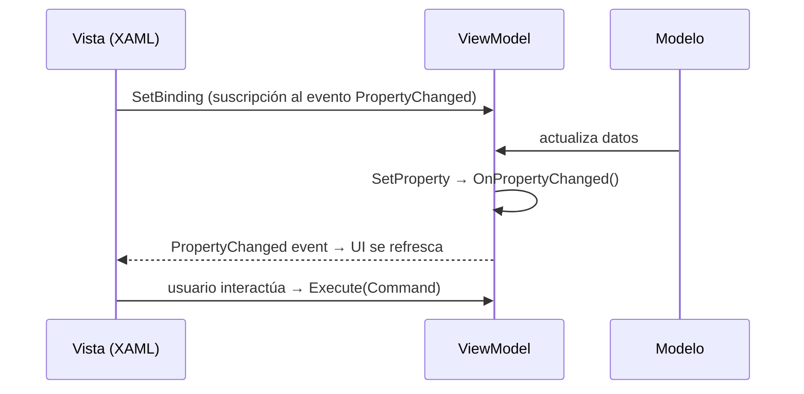

> 💡 **Tip del Examinador**: En el examen, si te preguntan cómo se comunica el ViewModel con la Vista en WPF, la respuesta es a través de **INotifyPropertyChanged** (para propiedades) y **ICommand** (para acciones).
    VM ->>  M:  actualiza estado del modelo
```

---

## 9.2. MVVM CON CommunityToolkit.Mvvm

### 9.2.1. Instalación NuGet

```bash
dotnet add package CommunityToolkit.Mvvm
```

---

### 9.2.2. Comparación: ANTES (manual) vs. DESPUÉS (CommunityToolkit)

| | **ANTES — INotifyPropertyChanged manual** | **DESPUÉS — CommunityToolkit** |
|---|---|---|
| **Boilerplate** | ~15 líneas por propiedad | 2 líneas por propiedad |
| **Campo privado** | Obligatorio, declarado a mano | Obligatorio, nombrado `_camelCase` |
| **Getter/Setter** | Escritos a mano con `SetProperty` | Generados por el compilador |
| **Notificación** | Manual con `OnPropertyChanged()` | Automática vía source generator |
| **Comandos** | Clase `RelayCommand` propia | Atributo `[RelayCommand]` |
| **Errores** | Fácil olvidar notificar | Imposible olvidar (automatizado) |

**ANTES:**
```csharp
private string _nombre = "";
public string Nombre
{
    get => _nombre;
    set { if (_nombre != value) { _nombre = value; OnPropertyChanged(); } }
}
```

**DESPUÉS:**
```csharp
[ObservableProperty]
private string _nombre = "";
// → genera automáticamente la propiedad pública `Nombre`
```

---

### 9.2.3. `[ObservableProperty]`

```csharp
using CommunityToolkit.Mvvm.ComponentModel;

public partial class PersonaViewModel : ObservableObject
{
    [ObservableProperty]
    private string _nombre = "";

    [ObservableProperty]
    private int _edad;

    [ObservableProperty]
    private bool _activo = true;
}
```

> La clase **debe ser `partial`**. El source generator crea las propiedades públicas `Nombre`, `Edad` y `Activo` en otra parte del archivo parcial.

---

### 9.2.4. `[RelayCommand]` — sincrónico

```csharp
public partial class TareasViewModel : ObservableObject
{
    [ObservableProperty]
    private string _nuevaTarea = "";

    [RelayCommand]
    private void AgregarTarea()
    {
        if (!string.IsNullOrWhiteSpace(NuevaTarea))
            Tareas.Add(NuevaTarea);
        NuevaTarea = "";
    }
}
```

> Genera `AgregarTareaCommand` de tipo `IRelayCommand`.

---

### 9.2.5. `[RelayCommand]` — asincrónico

```csharp
[RelayCommand]
private async Task CargarDatosAsync()
{
    IsLoading = true;
    try
    {
        Datos = await _servicio.ObtenerDatosAsync();
    }
    finally
    {
        IsLoading = false;
    }
}
```

> Genera `CargarDatosCommand` de tipo `IAsyncRelayCommand`.  
> Mientras se ejecuta, `CargarDatosCommand.IsRunning` es `true` (útil para mostrar spinners).

---

### 9.2.6. `[NotifyCanExecuteChangedFor]`

```csharp
public partial class LoginViewModel : ObservableObject
{
    [ObservableProperty]
    [NotifyCanExecuteChangedFor(nameof(LoginCommand))]
    private string _usuario = "";

    [ObservableProperty]
    [NotifyCanExecuteChangedFor(nameof(LoginCommand))]
    private string _contrasena = "";

    private bool PuedeHacerLogin()
        => !string.IsNullOrWhiteSpace(Usuario) && !string.IsNullOrWhiteSpace(Contrasena);

    [RelayCommand(CanExecute = nameof(PuedeHacerLogin))]
    private void Login() { /* autenticar */ }
}
```

> Cada vez que `Usuario` o `Contrasena` cambian, se notifica automáticamente a `LoginCommand` para que reevalúe si está habilitado.

---

### 9.2.7. `[NotifyPropertyChangedFor]`

```csharp
public partial class Persona : ObservableObject
{
    [ObservableProperty]
    [NotifyPropertyChangedFor(nameof(NombreCompleto))]
    private string _nombre = "";

    [ObservableProperty]
    [NotifyPropertyChangedFor(nameof(NombreCompleto))]
    private string _apellido = "";

    // Propiedad calculada: se actualiza cuando Nombre o Apellido cambian
    public string NombreCompleto => $"{Nombre} {Apellido}";
}
```

---

## 9.3. BINDINGS EN XAML

### 9.3.1. OneWay (Origen → Destino)

```xml
<!-- La UI se actualiza cuando cambia la propiedad; el usuario no puede editar -->
<TextBlock Text="{Binding FechaCreacion, Mode=OneWay}" />
<TextBlock Text="{Binding TotalCompra,   Mode=OneWay}" />
```

### 9.3.2. TwoWay (Origen ↔ Destino)

```xml
<!-- Los cambios en el TextBox actualizan la propiedad Y viceversa -->
<TextBox     Text="{Binding Nombre, Mode=TwoWay}" />
<CheckBox IsChecked="{Binding Activo, Mode=TwoWay}" />
```

### 9.3.3. OneTime (solo lectura inicial)

```xml
<!-- Se lee una sola vez al crear el control; no reacciona a cambios posteriores -->
<TextBlock Text="{Binding IdUsuario, Mode=OneTime}" />
```

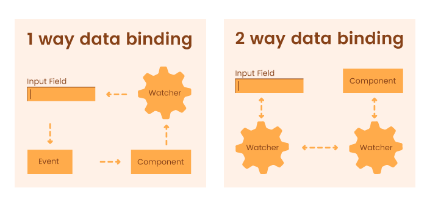

### 9.3.4. Con `UpdateSourceTrigger`

```xml
<!-- Por defecto (LostFocus): actualiza al perder el foco -->
<TextBox Text="{Binding Email}" />

<!-- PropertyChanged: actualiza con cada pulsación de tecla -->
<TextBox Text="{Binding Busqueda, UpdateSourceTrigger=PropertyChanged}" />

<!-- Explicit: solo actualiza al llamar BindingExpression.UpdateSource() -->
<TextBox x:Name="txtNombre"
         Text="{Binding Nombre, UpdateSourceTrigger=Explicit}" />
```

### 9.3.5. Tabla de modos de binding

| Modo | Flujo | Cuándo usar | Rendimiento |
|------|-------|-------------|-------------|
| `OneWay` | Source → Target | Datos de solo lectura | ⚡⚡⚡ Mejor |
| `TwoWay` | Source ↔ Target | Campos editables | ⚡⚡ Media |
| `OneTime` | Source → Target (1 vez) | Datos inmutables | ⚡⚡⚡ Mejor |
| `OneWayToSource` | Target → Source | Controles de entrada pura | ⚡⚡ Media |

### 9.3.6. OneWayToSource (Target → Source)

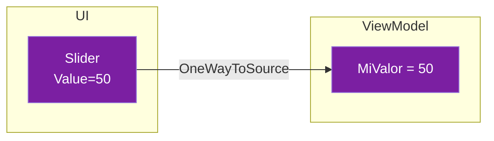

### Cuándo usar OneWayToSource

Normalmente, `OneWayToSource` se usa cuando:
1. Un control de UI escribe en el ViewModel pero el ViewModel **no debe** modificar ese control
2. Controles como `ScrollBar`, `ProgressBar` que tienen valores que el usuario manipula directamente

### Ejemplo completo

**ViewModel:**
```csharp
public partial class ScrollViewModel : ObservableObject
{
    // Esta propiedad almacena la posición del ScrollBar
    [ObservableProperty]
    private double _posicionScroll = 0;
    
    // Esta propiedad almacena el valor del Slider
    [ObservableProperty]
    private double _valorSlider = 50;
}
```

**XAML:**
```xml
<StackPanel>
    <!-- El Slider actualiza el ViewModel, pero el ViewModel no afecta al Slider -->
    <Slider x:Name="miSlider" 
            Minimum="0" 
            Maximum="100" 
            Value="{Binding ValorSlider, Mode=OneWayToSource}"
            TickFrequency="10"
            IsSnapToTickEnabled="True"/>
    
    <TextBlock Text="{Binding ValorSlider, StringFormat='Valor: {0}'}"/>
</StackPanel>
```

**Funcionamiento:**
- Cuando el usuario mueve el slider → `ValorSlider` se actualiza en el ViewModel
- Cuando el código cambia `ValorSlider = 75` → el slider **NO** se mueve

### Ejemplo con ScrollBar (caso real)

```csharp
public partial class DocumentoViewModel : ObservableObject
{
    [ObservableProperty]
    private double _posicionVertical = 0;
    
    [ObservableProperty]
    private double _posicionHorizontal = 0;
}
```

```xml
<ScrollViewer VerticalScrollBarVisibility="Auto" 
              HorizontalScrollBarVisibility="Auto">
    <RichTextBox>
        <!-- El ScrollBar reporta su posición al ViewModel -->
        <RichTextBox.Document>
            <FlowDocument>
                <!-- Contenido grande -->
            </FlowDocument>
        </RichTextBox.Document>
    </RichTextBox>
</ScrollViewer>

<!-- Opción 1: usando eventos en code-behind -->
<ScrollViewer x:Name="scroller" 
              ScrollChanged="Scroller_ScrollChanged">
    <!-- contenido -->
</ScrollViewer>
```

```csharp
// Code-behind (para ScrollViewer)
private void Scroller_ScrollChanged(object sender, ScrollChangedEventArgs e)
{
    if (DataContext is DocumentoViewModel vm)
    {
        vm.PosicionVertical = e.VerticalOffset;
        vm.PosicionHorizontal = e.HorizontalOffset;
    }
}
```

### Diferencia con TwoWay

| Aspecto | TwoWay | OneWayToSource |
|---------|--------|----------------|
| UI → ViewModel | ✅ | ✅ |
| ViewModel → UI | ✅ | ❌ |
| Uso típico | Formularios | ScrollBar, ProgressBar |

**Pros:**
- ✅ Útil para controles sin propiedad de lectura
- ✅ Permite obtener valores de controles "de solo escritura"
- ✅ El ViewModel puede leer pero no influir en el control

**Contras:**
- ❌ Uso poco común y confuso
- ❌ Violación del patrón MVVM clásico
- ❌ Difícil de entender para otros desarrolladores

---

### 9.3.7. StringFormat - Formatear valores

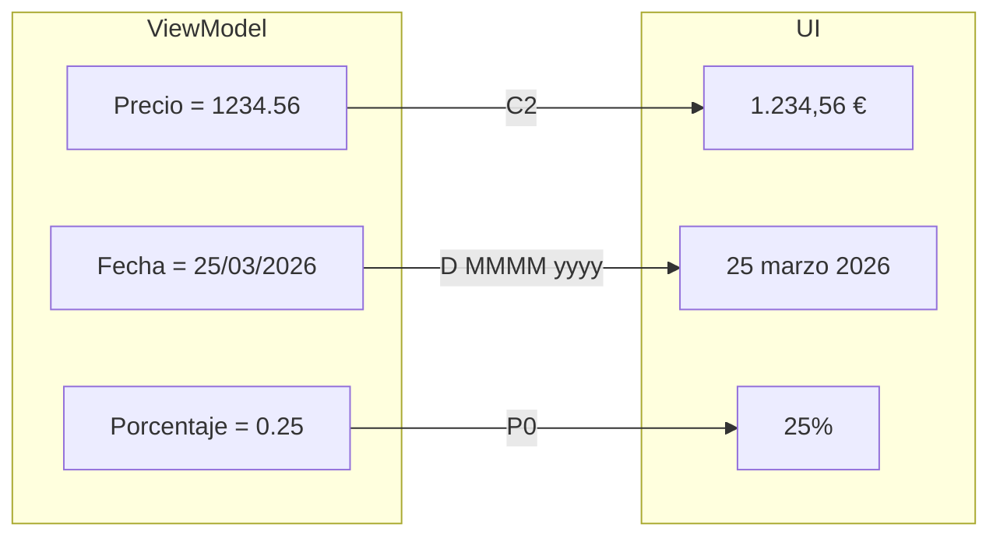

**StringFormat** permite formatear el valor de un binding **sin necesidad de crear un Converter**. Es la forma más sencilla de formateo.

### Por qué usar StringFormat

Imagina que tienes un precio en el ViewModel:
```csharp
[ObservableProperty]
private double _precio = 1234.56;
```

Sin StringFormat, verías `1234.56`. Con StringFormat, puedes ver `1.234,56 €`.

### Tipos de formato

#### 1. Formatos de número

| Formato | Descripción | Ejemplo entrada | Ejemplo salida |
|---------|-------------|----------------|---------------|
| `{0:C}` | Moneda (default) | 1234.56 | 1.234,56 € |
| `{0:C2}` | Moneda con 2 decimales | 1234.5 | 1.234,50 € |
| `{0:N}` | Número standard | 1234.56 | 1.234,56 |
| `{0:N0}` | Sin decimales | 1234.56 | 1.235 |
| `{0:N2}` | 2 decimales | 1234.567 | 1.234,57 |
| `{0:D}` | Entero | 1234 | 1234 |
| `{0:E}` | Notación científica | 1234.56 | 1.234560E+003 |
| `{0:P}` | Porcentaje | 0.25 | 25% |
| `{0:P1}` | Porcentaje con 1 decimal | 0.255 | 25.5% |

#### 2. Formatos de fecha/hora

| Formato | Descripción | Ejemplo salida |
|---------|-------------|---------------|
| `{0:d}` | Fecha corta | 25/03/2026 |
| `{0:D}` | Fecha larga | 25 de marzo de 2026 |
| `{0:dd}` | Día (2 dígitos) | 25 |
| `{0:MM}` | Mes (2 dígitos) | 03 |
| `{0:MMM}` | Mes abreviado | mar |
| `{0:MMMM}` | Mes completo | marzo |
| `{0:yyyy}` | Año (4 dígitos) | 2026 |
| `{0:HH:mm}` | Hora (24h) | 14:30 |
| `{0:hh:mm}` | Hora (12h) | 2:30 |
| `{0:t}` | Hora corta | 14:30 |
| `{0:f}` | Fecha + hora corta | 25/03/2026 14:30 |
| `{0:F}` | Fecha + hora larga | 25 de marzo de 2026 14:30:30 |
| `{0:g}` | Fecha + hora corta (general) | 25/03/2026 14:30 |

#### 3. Formatos personalizados

```xml
<!-- Combinación de fecha -->
<TextBlock Text="{Binding Fecha, StringFormat='{}{0:dd/MM/yyyy}'}"/>

<!-- Fecha con texto -->
<TextBlock Text="{Binding Fecha, StringFormat='{}{0:dd ''de'' MMMM ''de'' yyyy}'}"/>
<!-- Salida: 25 de marzo de 2026 -->

<!-- Hora -->
<TextBlock Text="{Binding Hora, StringFormat='{}{0:hh:mm:ss}'}"/>

<!-- Número con texto -->
<TextBlock Text="{Binding Temperatura, StringFormat='{}{0:N1}°C'}"/>
<!-- Salida: 25.5°C -->

<!-- Porcentaje -->
<TextBlock Text="{Binding Descuento, StringFormat='{}{0:P0}'}"/>
```

### Ejemplo completo en ViewModel

```csharp
public partial class ProductoViewModel : ObservableObject
{
    [ObservableProperty]
    private string _nombre = "Portátil";
    
    [ObservableProperty]
    private decimal _precio = 1299.99m;
    
    [ObservableProperty]
    private decimal _descuento = 0.15m;
    
    [ObservableProperty]
    private DateTime _fechaFabricacion = new(2026, 3, 25);
    
    [ObservableProperty]
    private DateTime _fechaCaducidad = new(2027, 3, 25);
    
    [ObservableProperty]
    private DateTime _ultimaActualizacion = DateTime.Now;
    
    [ObservableProperty]
    private int _stock = 42;
}
```

### Ejemplo completo en XAML

```xml
<StackPanel Margin="10">
    <!-- Moneda -->
    <TextBlock Text="{Binding Precio, StringFormat='{}{0:C2}'}"/>
    <!-- Salida: 1.299,99 € -->
    
    <!-- Descuento como porcentaje -->
    <TextBlock Text="{Binding Descuento, StringFormat='Descuento: {0:P0}'}"/>
    <!-- Salida: Descuento: 15% -->
    
    <!-- Fecha de fabricación -->
    <TextBlock Text="{Binding FechaFabricacion, StringFormat='Fabricado: {0:dd/MM/yyyy}'}"/>
    <!-- Salida: Fabricado: 25/03/2026 -->
    
    <!-- Fecha larga -->
    <TextBlock Text="{Binding FechaFabricacion, StringFormat='{}{0:D}'}"/>
    <!-- Salida: 25 de marzo de 2026 -->
    
    <!-- Hora -->
    <TextBlock Text="{Binding UltimaActualizacion, StringFormat='Actualizado: {0:HH:mm}'}"/>
    <!-- Salida: Actualizado: 14:30 -->
    
    <!-- Número con texto -->
    <TextBlock Text="{Binding Stock, StringFormat='Unidades: {0:N0}'}"/>
    <!-- Salida: Unidades: 42 -->
    
    <!-- Multiplicar por 100 para mostrar porcentaje -->
    <TextBlock Text="{Binding Descuento, StringFormat='{}{0:P0}', TargetType=double}"/>
    <!-- IMPORTANTE: Para percentages, el valor debe ser 0.15 (no 15) -->
</StackPanel>
```

### Problema común: El formato no funciona

Si StringFormat no funciona, verifica:

1. **¿Usas las llaves {}?**
   ```xml
   <!-- Correcto -->
   <TextBlock Text="{Binding Precio, StringFormat='{}{0:C2}'}"/>
   
   <!-- Incorrecto (da error) -->
   <TextBlock Text="{Binding Precio, StringFormat='{0:C2}'}"/>
   ```

2. **¿El valor es null?**
   ```xml
   <!-- Si precio es null, no muestra nada -->
   <TextBlock Text="{Binding Precio, StringFormat='{}{0:C2}', TargetNullValue='0,00 €'}"/>
   ```

3. **¿Usas la cultura correcta?**
   ```csharp
   // En código, puedes especificar cultura
   string formatted = precio.ToString("C2", CultureInfo.GetCultureInfo("es-ES"));
   ```

### StringFormat con MultiBinding

```xml
<TextBlock>
    <TextBlock.Text>
        <MultiBinding StringFormat="{}{0} - {1:C2}">
            <Binding Path="Nombre"/>
            <Binding Path="Precio"/>
        </MultiBinding>
    </TextBlock.Text>
</TextBlock>
<!-- Salida: Portátil - 1.299,99 € -->
```

### Pros y Contras

**Pros:**
- ✅ Formateo sin código adicional
- ✅ Separa lógica de presentación
- ✅ Fácil de cambiar
- ✅ Funciona con MultiBinding

**Contras:**
- ❌ Limitado a formatos predefinidos
- ❌ No permite lógica compleja (condiciones)
- ❌ Puede tener problemas con nulls

---

### 9.3.8. ElementName - Enlazar controles entre sí

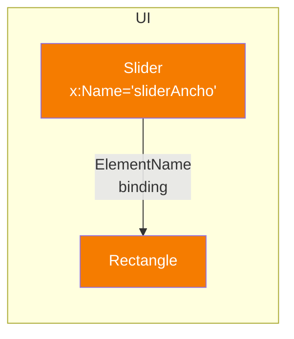

**ElementName** permite que un control se binde a **la propiedad de otro control** en la misma ventana, sin pasar por el ViewModel.

### Por qué usar ElementName

En MVVM puro, toda la comunicación debería pasar por el ViewModel. Pero a veces:
- Necesitas efectos visuales inmediatos entre controles
- No quieres añadir propiedades innecesarias al ViewModel
- Estás trabajando con animaciones o transiciones

### Ejemplo 1: Slider que controla un rectángulo

**XAML:**
```xml
<StackPanel Margin="20">
    <!-- El Slider tiene un nombre para poder referenciarlo -->
    <Slider x:Name="sliderAncho" 
            Minimum="50" 
            Maximum="400" 
            Value="200"
            TickFrequency="50"
            IsSnapToTickEnabled="True"/>
    
    <!-- El Rectangle toma su ancho del Slider directamente -->
    <!-- NO necesita propiedad en el ViewModel -->
    <Rectangle Height="50" 
               Fill="Orange" 
               HorizontalAlignment="Left"
               Width="{Binding Value, ElementName=sliderAncho}"
               Margin="0,20,0,0"/>
    
    <!-- Mostrar el valor -->
    <TextBlock Text="{Binding Value, ElementName=sliderAncho, 
                       StringFormat='Ancho: {0} px'}"/>
</StackPanel>
```

**Funcionamiento:**
1. El usuario mueve el slider
2. El rectángulo cambia de ancho inmediatamente
3. El TextBlock muestra el valor

### Ejemplo 2: Opacidad basada en Slider

```xml
<StackPanel>
    <Slider x:Name="sliderOpacidad" 
            Minimum="0" 
            Maximum="1" 
            Value="1"
            TickFrequency="0.1"
            IsSnapToTickEnabled="True"/>
    
    <Image Source="foto.jpg" 
           Opacity="{Binding Value, ElementName=sliderOpacidad}"
           Width="200" 
           Margin="0,10,0,0"/>
    
    <TextBlock Text="{Binding Value, ElementName=sliderOpacidad, 
                       StringFormat='Opacidad: {0:P0}'}"/>
</StackPanel>
```

### Ejemplo 3: Color dinámico

```xml
<StackPanel>
    <!-- Slider para color rojo -->
    <Slider x:Name="sliderRojo" Minimum="0" Maximum="255" Value="255"/>
    <!-- Slider para color verde -->
    <Slider x:Name="sliderVerde" Minimum="0" Maximum="255" Value="128"/>
    <!-- Slider para color azul -->
    <Slider x:Name="sliderAzul" Minimum="0" Maximum="255" Value="0"/>
    
    <!-- Rectángulo con color combinado -->
    <Rectangle Width="100" Height="100" Margin="0,10,0,0">
        <Rectangle.Fill>
            <SolidColorBrush>
                <SolidColorBrush.Color>
                    <MultiBinding Converter="{StaticResource RgbAColorConverter}">
                        <Binding Source="{x:Reference sliderRojo}"/>
                        <Binding Source="{x:Reference sliderVerde}"/>
                        <Binding Source="{x:Reference sliderAzul}"/>
                    </MultiBinding>
                </SolidColorBrush.Color>
            </SolidColorBrush>
        </Rectangle.Fill>
    </Rectangle>
</StackPanel>
```

### Ejemplo 4: Validación visual

```xml
<StackPanel>
    <TextBox x:Name="txtEmail" 
             Width="300"
             HorizontalAlignment="Left"/>
    
    <!-- El botón se habilita solo si el email tiene más de 5 caracteres -->
    <Button Content="Enviar" 
            Margin="0,10,0,0"
            IsEnabled="{Binding Text.Length, 
                        ElementName=txtEmail,
                        Converter={StaticResource MayorQueConverter},
                        ConverterParameter=5}"/>
</StackPanel>
```

### Converter necesario para el ejemplo 4

```csharp
public class MayorQueConverter : IValueConverter
{
    public object Convert(object value, Type targetType, 
                        object parameter, CultureInfo culture)
    {
        if (value is int longitud && parameter is string paramStr && 
            int.TryParse(paramStr, out int limite))
        {
            return longitud > limite;
        }
        return false;
    }

    public object ConvertBack(object value, Type targetType, 
                            object parameter, CultureInfo culture)
    {
        throw new NotImplementedException();
    }
}
```

### Ejemplo 5: ProgressBar + TextBox

```xml
<StackPanel Margin="20">
    <TextBox x:Name="txtProgreso"
             Text="50"
             TextChanged="TxtProgreso_TextChanged"/>
    
    <ProgressBar x:Name="progressBar"
                 Minimum="0"
                 Maximum="100"
                 Value="50"
                 Height="20"
                 Margin="0,10,0,0"/>
</StackPanel>
```

```csharp
private void TxtProgreso_TextChanged(object sender, TextChangedEventArgs e)
{
    if (int.TryParse(txtProgreso.Text, out int valor))
    {
        progressBar.Value = Math.Clamp(valor, 0, 100);
    }
}
```

### x:Reference vs ElementName

En XAML moderno, puedes usar `x:Reference` en lugar de `ElementName`:

```xml
<!-- Los dos son equivalentes -->
<Rectangle Width="{Binding Value, ElementName=sliderAncho}"/>
<Rectangle Width="{Binding Value, Source={x:Reference sliderAncho}}"/>
```

**Diferencia:**
- `ElementName`: Más común, más soporte en herramientas
- `x:Reference`: Más reciente, sintaxis más limpia

### Cuándo usar ElementName

**Usalo cuando:**
- Efectos visuales entre controles
- No quieres ensuciar el ViewModel con propiedades de UI
- Animaciones simples

**No lo uses cuando:**
- Necesitas lógica de negocio
- El valor debe estar en el ViewModel
- Necesitas testear la lógica

### Pros y Contras

**Pros:**
- ✅ Respuesta inmediata entre controles
- ✅ No necesita ViewModel
- ✅ Útil para efectos visuales
- ✅ Código simple

**Contras:**
- ❌ Acopla la UI entre sí
- ❌ Viola ligeramente MVVM
- ❌ Difícil de testar
- ❌ No funciona en DataTemplates (usa RelativeSource)

---

### 9.3.9. RelativeSource - Enlazar con el mismo control o padres

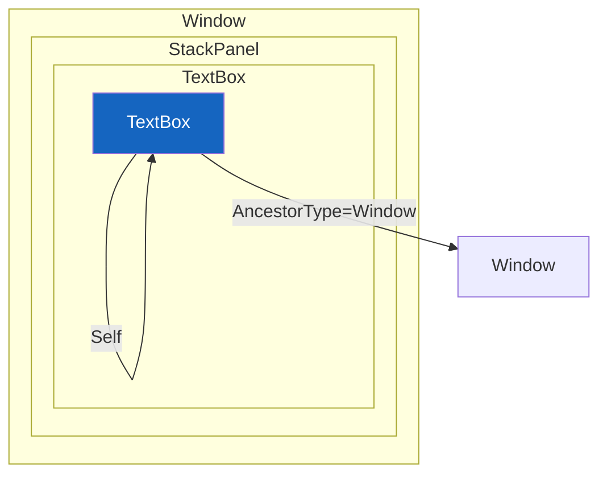

```xml
<!-- SELF: Enlazar una propiedad con otra del mismo control -->
<TextBlock Text="{Binding ActualWidth, RelativeSource={RelativeSource Self}}"
           FontSize="16"/>

<!-- ANCESTORTYPE: Enlazar con un control padre -->
<TextBlock Text="{Binding DataContext.Titulo, 
                   RelativeSource={RelativeSource AncestorType=Window}}"/>

<!-- TEMPLATEDPARENT: Para estilos y plantillas -->
<ControlTemplate>
    <Border Background="{TemplateBinding Background}">
        <!-- ... -->
    </Border>
</ControlTemplate>
```

**Self - Casos de uso:**
```xml
<!-- Habilitar botón solo si el texto tiene más de 3 caracteres -->
<TextBox x:Name="txtInput" Text="{Binding Input}"/>
<Button Content="Enviar" 
        IsEnabled="{Binding Text.Length, 
                   RelativeSource={RelativeSource Self},
                   Converter={StaticResource MayorQue3}}"/>
```

**AncestorType - Casos de uso:**
```xml
<!-- Acceder al ViewModel desde un DataTemplate -->
<DataTemplate>
    <Button Content="{Binding Nombre}"
            Command="{Binding DataContext.EliminarCommand, 
                        RelativeSource={RelativeSource AncestorType=ItemsControl}}"/>
</DataTemplate>
```

**Pros:**
- ✅ Permite bindings sin nombres explícitos
- ✅ Útil en DataTemplates y ControlTemplates
- ✅ Acceso a padres en la jerarquía

**Contras:**
- ❌ Puede ser confuso de depurar
- ❌ Acopla el control a su padre

### RelativeSource - Versión expandida con más código

**RelativeSource** es una extensión de binding que permite enlazar con:
- **Self**: El mismo control
- **AncestorType**: Un control padre en la jerarquía
- **TemplatedParent**: El control que usa la plantilla

#### RelativeSource.Self

Útil cuando quieres bindear una propiedad de un control con otra propiedad del mismo control.

**Ejemplo 1: Mostrar el ancho actual**
```xml
<TextBlock Text="{Binding ActualWidth, RelativeSource={RelativeSource Self}, 
                   StringFormat='Ancho: {0:F0} px'}"/>
```

**Ejemplo 2: Convertir una propiedad en condicional**
```xml
<!-- CheckBox que se marca solo si está habilitado -->
<CheckBox Content="Acepto términos"
          IsChecked="{Binding IsEnabled, 
                     RelativeSource={RelativeSource Self}}"/>
```

**Ejemplo 3: Estilo condicional**
```xml
<!-- En un estilo, usar Self para referenciar el propio control -->
<Style TargetType="TextBlock">
    <Style.Triggers>
        <DataTrigger Binding="{Binding ActualWidth, 
                               RelativeSource={RelativeSource Self}, 
                               Converter={StaticResource MayorQueConverter}, 
                               ConverterParameter=200}" 
                     Value="True">
            <Setter Property="FontSize" Value="20"/>
        </DataTrigger>
    </Style.Triggers>
</Style>
```

#### RelativeSource.AncestorType

Útil para acceder a controles padres o al ViewModel desde DataTemplates.

**Ejemplo 1: Acceder al Window desde cualquier lugar**
```xml
<!-- TextBlock dentro de un StackPanel que quiere acceder al Window -->
<StackPanel>
    <TextBlock Text="{Binding DataContext.Titulo, 
                       RelativeSource={RelativeSource AncestorType=Window}}"/>
</StackPanel>
```

**Ejemplo 2: Acceder al ViewModel desde un DataTemplate**
```csharp
// ViewModel
public partial class MainViewModel : ObservableObject
{
    [ObservableProperty]
    private ObservableCollection<Producto> _productos = new();
    
    [RelayCommand]
    private void Eliminar(Producto p)
    {
        Productos.Remove(p);
    }
}
```

```xml
<!-- DataTemplate para cada producto -->
<DataTemplate>
    <StackPanel Orientation="Horizontal">
        <TextBlock Text="{Binding Nombre}" Width="150"/>
        <Button Content="Eliminar"
                Command="{Binding DataContext.EliminarCommand, 
                            RelativeSource={RelativeSource AncestorType=ItemsControl}}"
                CommandParameter="{Binding}"/>
    </StackPanel>
</DataTemplate>
```

**Ejemplo 3: Buscar cualquier ancestor específico**
```xml
<!-- Buscar hacia arriba hasta encontrar un StackPanel -->
<TextBlock Text="{Binding DataContext, 
                   RelativeSource={RelativeSource AncestorType=StackPanel}}"/>
```

**Ejemplo 4: Encontrar el ancestro más cercano con nivel**
```xml
<!-- AncestorLevel=1 busca el primer ancestor del tipo especificado -->
<TextBlock Text="{Binding Name, 
                   RelativeSource={RelativeSource AncestorType=Window, 
                                           AncestorLevel=1}}"/>
```

#### RelativeSource.TemplatedParent

Se usa en ControlTemplates para acceder al control que está siendo decorado.

**Ejemplo: Botón con plantilla personalizada**
```xml
<ControlTemplate TargetType="Button">
    <Border x:Name="border" 
            Background="{TemplateBinding Background}"
            BorderBrush="{TemplateBinding BorderBrush}"
            BorderThickness="{TemplateBinding BorderThickness}"
            CornerRadius="5">
        <ContentPresenter HorizontalAlignment="Center" 
                          VerticalAlignment="Center"/>
    </Border>
    <ControlTemplate.Triggers>
        <Trigger Property="IsMouseOver" Value="True">
            <Setter TargetName="border" Property="Background" Value="Blue"/>
        </Trigger>
    </ControlTemplate.Triggers>
</ControlTemplate>
```

#### Diferencia entre ElementName y RelativeSource

| Aspecto | ElementName | RelativeSource |
|---------|-------------|---------------|
| Funciona en XAML normal | ✅ | ✅ |
| Funciona en DataTemplates | ❌ | ✅ |
| Funciona en Styles | ❌ | ✅ |
| Requiere nombre | ✅ | ❌ |
| Busca en padre | ❌ | ✅ |

---

### 9.3.10. MultiBinding - Combinar varias fuentes

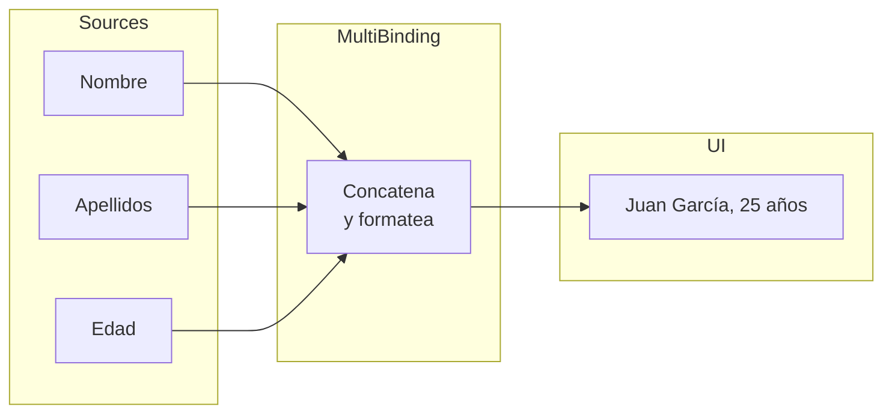

**MultiBinding** permite combinar **múltiples propiedades** en una sola. Es como tener varios binding en uno.

### Por qué usar MultiBinding

Imagina que quieres mostrar "Juan García, 25 años" pero:
- `Nombre` = "Juan" (de una propiedad)
- `Apellidos` = "García" (de otra propiedad)
- `Edad` = 25 (de otra propiedad)

Con MultiBinding puedes combinar estas tres propiedades en un solo TextBlock.

### IMultiValueConverter básico

```csharp
using System.Globalization;
using System.Windows.Data;

public class NombreCompletoConverter : IMultiValueConverter
{
    public object Convert(object[] values, Type targetType, 
                        object parameter, CultureInfo culture)
    {
        // values[0] = Nombre
        // values[1] = Apellidos
        // values[2] = Edad
        
        string nombre = values[0]?.ToString() ?? "";
        string apellidos = values[1]?.ToString() ?? "";
        int edad = values[2] is int e ? e : 0;
        
        return $"{nombre} {apellidos}, {edad} años";
    }

    public object[] ConvertBack(object value, Type[] targetTypes, 
                               object parameter, CultureInfo culture)
    {
        // ConvertBack es más complejo para MultiBinding
        // Devolvemos null para indicar que no soportamos bidireccional
        throw new NotImplementedException();
    }
}
```

### Ejemplo completo

**ViewModel:**
```csharp
public partial class PersonaViewModel : ObservableObject
{
    [ObservableProperty]
    private string _nombre = "Juan";
    
    [ObservableProperty]
    private string _apellidos = "García";
    
    [ObservableProperty]
    private int _edad = 25;
    
    [ObservableProperty]
    private DateTime _fechaNacimiento = new(2001, 3, 15);
    
    [ObservableProperty]
    private decimal _salario = 2500.50m;
}
```

**Converter para información personal:**
```csharp
public class InfoPersonalConverter : IMultiValueConverter
{
    public object Convert(object[] values, Type targetType, 
                        object parameter, CultureInfo culture)
    {
        string nombre = values[0]?.ToString() ?? "";
        string apellidos = values[1]?.ToString() ?? "";
        
        // Parameter puede modificar el formato
        if (parameter is string formato)
        {
            return formato switch
            {
                "nombreCompleto" => $"{nombre} {apellidos}".Trim(),
                "iniciales" => $"{nombre[0]}.{apellidos[0]}.".ToUpper(),
                _ => $"{nombre} {apellidos}".Trim()
            };
        }
        
        return $"{nombre} {apellidos}".Trim();
    }

    public object[] ConvertBack(object value, Type[] targetTypes, 
                               object parameter, CultureInfo culture)
    {
        throw new NotImplementedException();
    }
}
```

**Converter para fecha y salario:**
```csharp
public class FechaSalarioConverter : IMultiValueConverter
{
    public object Convert(object[] values, Type targetType, 
                        object parameter, CultureInfo culture)
    {
        if (values[0] is DateTime fecha && values[1] is decimal salario)
        {
            return $"Nacido el {fecha:dd/MM/yyyy}, cobra {salario:C2}";
        }
        return "Datos no disponibles";
    }

    public object[] ConvertBack(object value, Type[] targetTypes, 
                               object parameter, CultureInfo culture)
    {
        throw new NotImplementedException();
    }
}
```

**XAML con MultiBinding:**
```xml
<Window xmlns:conv="clr-namespace:MiApp.Converters">
    <Window.Resources>
        <conv:InfoPersonalConverter x:Key="InfoPersonalConverter"/>
        <conv:FechaSalarioConverter x:Key="FechaSalarioConverter"/>
    </Window.Resources>
    
    <StackPanel Margin="20">
        <!-- Ejemplo 1: Solo StringFormat -->
        <TextBlock FontSize="16" Margin="0,0,0,10">
            <TextBlock.Text>
                <MultiBinding StringFormat="{}{0} {1}, {2} años">
                    <Binding Path="Nombre"/>
                    <Binding Path="Apellidos"/>
                    <Binding Path="Edad"/>
                </MultiBinding>
            </TextBlock.Text>
        </TextBlock>
        
        <!-- Ejemplo 2: Con Converter personalizado -->
        <TextBlock Text="{Binding Nombre, Converter={StaticResource InfoPersonalConverter}}"
                   FontSize="16" Margin="0,0,0,10"/>
        
        <!-- Ejemplo 3: Converter con parameter -->
        <TextBlock FontSize="14" Margin="0,0,0,10">
            <TextBlock.Text>
                <MultiBinding Converter="{StaticResource InfoPersonalConverter}" 
                              ConverterParameter="iniciales">
                    <Binding Path="Nombre"/>
                    <Binding Path="Apellidos"/>
                </MultiBinding>
            </TextBlock.Text>
        </TextBlock>
        
        <!-- Ejemplo 4: Múltiples propiedades diferentes -->
        <TextBlock FontSize="14">
            <TextBlock.Text>
                <MultiBinding Converter="{StaticResource FechaSalarioConverter}">
                    <Binding Path="FechaNacimiento"/>
                    <Binding Path="Salario"/>
                </MultiBinding>
            </TextBlock.Text>
        </TextBlock>
    </StackPanel>
</Window>
```

### MultiBinding con operaciones lógicas

```csharp
public class ValidadorFormularioConverter : IMultiValueConverter
{
    public object Convert(object[] values, Type targetType, 
                        object parameter, CultureInfo culture)
    {
        // values[0] = nombre
        // values[1] = email
        // values[2] = edad
        
        bool nombreValido = !string.IsNullOrWhiteSpace(values[0]?.ToString());
        bool emailValido = values[1]?.ToString()?.Contains("@") ?? false;
        bool edadValida = values[2] is int edad && edad >= 18;
        
        if (!nombreValido) return "El nombre es obligatorio";
        if (!emailValido) return "El email no es válido";
        if (!edadValida) return "Debes ser mayor de edad";
        
        return "Formulario válido";
    }

    public object[] ConvertBack(object value, Type[] targetTypes, 
                               object parameter, CultureInfo culture)
    {
        throw new NotImplementedException();
    }
}
```

### MultiBinding con StringFormat avanzado

```xml
<!-- Formato de dirección -->
<MultiBinding StringFormat="{}{0}, {1}, {2} {3}">
    <Binding Path="Calle"/>
    <Binding Path="Ciudad"/>
    <Binding Path="CodigoPostal"/>
    <Binding Path="Pais"/>
</MultiBinding>
<!-- Salida: Gran Vía 1, Madrid, 28013, España -->

<!-- Formato de teléfono -->
<MultiBinding StringFormat="+{0} ({1}) {2}-{3}">
    <Binding Path="PrefijoPais"/>
    <Binding Path="Prefijo"/>
    <Binding Path="Numero1"/>
    <Binding Path="Numero2"/>
</MultiBinding>
<!-- Salida: +34 (91) 123-4567 -->
```

### Converter con validaciones

```csharp
public class multiplicarConverter : IMultiValueConverter
{
    public object Convert(object[] values, Type targetType, 
                        object parameter, CultureInfo culture)
    {
        // Multiplicar dos valores
        if (values[0] is int a && values[1] is int b)
        {
            return a * b;
        }
        return 0;
    }

    public object[] ConvertBack(object value, Type[] targetTypes, 
                               object parameter, CultureInfo culture)
    {
        throw new NotImplementedException();
    }
}
```

### Pros y Contras

**Pros:**
- ✅ Combina múltiples fuentes de datos
- ✅ Útil para formateos complejos
- ✅ Separa lógica de presentación

**Contras:**
- ❌ Requiere clase adicional (converter)
- ❌ Puede ser difícil de mantener

---

### 9.3.11. FallbackValue y TargetNullValue

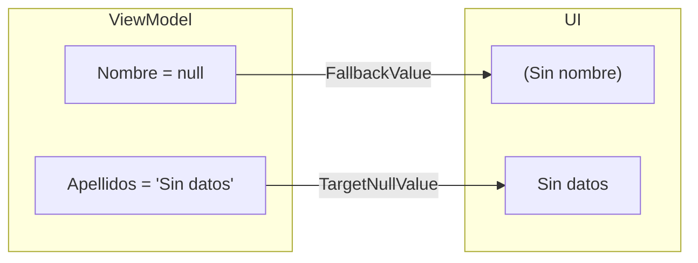

**FallbackValue** y **TargetNullValue** permiten mostrar valores por defecto cuando el binding no puede mostrar el valor esperado.

### Diferencia clave

| | FallbackValue | TargetNullValue |
|--|---------------|-----------------|
| **Cuándo se usa** | El binding **falla** (propiedad no existe) | El valor es **null** |
| **Ejemplo de fallo** | `{Binding PropiedadInexistente}` | `{Binding Nombre}` donde Nombre = null |
| **Valor por defecto** | Se muestra siempre que falla el binding | Se muestra solo cuando es null |

### Ejemplo 1: FallbackValue básico

**ViewModel:**
```csharp
public partial class PersonaViewModel : ObservableObject
{
    [ObservableProperty]
    private string _nombre = "Juan";
    
    // Esta propiedad NO existe en el ViewModel
    // [ObservableProperty]
    // private string _apellido = "García";
}
```

**XAML:**
```xml
<!-- Sin FallbackValue: NO muestra nada (binding falla) -->
<TextBlock Text="{Binding Apellido}"/>
<!-- Salida: (vacío) -->

<!-- Con FallbackValue: muestra el valor por defecto -->
<TextBlock Text="{Binding Apellido, FallbackValue='(Sin apellido)'}"/>
<!-- Salida: (Sin apellido) -->
```

### Ejemplo 2: TargetNullValue básico

**ViewModel:**
```csharp
public partial class PersonaViewModel : ObservableObject
{
    [ObservableProperty]
    private string? _nombre = null;  // nullable, inicializado a null
}
```

**XAML:**
```xml
<!-- Sin TargetNullValue: NO muestra nada -->
<TextBlock Text="{Binding Nombre}"/>
<!-- Salida: (vacío) -->

<!-- Con TargetNullValue: muestra el valor por defecto -->
<TextBlock Text="{Binding Nombre, TargetNullValue='(Sin nombre)'}"/>
<!-- Salida: (Sin nombre) -->
```

### Ejemplo 3: Combinados

```xml
<!-- FallbackValue + TargetNullValue juntos -->
<TextBlock Text="{Binding Usuario.Nombre, 
                         TargetNullValue='(Anonimo)', 
                         FallbackValue='(Error de binding)'}"/>

<!-- Explicación: -->
<!-- 1. Si Usuario es null → TargetNullValue: "(Anonimo)" -->
<!-- 2. Si Usuario existe pero Nombre es null → TargetNullValue: "(Anonimo)" -->
<!-- 3. Si la ruta del binding falla → FallbackValue: "(Error de binding)" -->
```

### Ejemplo 4: Con diferentes tipos

```csharp
public partial class ProductoViewModel : ObservableObject
{
    [ObservableProperty]
    private string? _codigo = null;
    
    [ObservableProperty]
    private int? _stock = null;
    
    [ObservableProperty]
    private decimal? _precio = null;
    
    [ObservableProperty]
    private DateTime? _fechaLanzamiento = null;
}
```

```xml
<!-- String -->
<TextBlock Text="{Binding Codigo, TargetNullValue='S/C', FallbackValue='Error'}"/>
<!-- Salida: S/C -->

<!-- Número -->
<TextBlock Text="{Binding Stock, TargetNullValue=0, FallbackValue=-1}"/>
<!-- Salida: 0 -->

<!-- Decimal -->
<TextBlock Text="{Binding Precio, TargetNullValue=0.00, StringFormat='{}{0:C2}'}"/>
<!-- Salida: 0,00 € -->

<!-- Fecha -->
<TextBlock Text="{Binding FechaLanzamiento, TargetNullValue='Por determinar', 
                       StringFormat='{}{0:dd/MM/yyyy}'}"/>
<!-- Salida: Por determinar -->
```

### Ejemplo 5: FallbackValue con tipos complejos

```xml
<!-- Converter con FallbackValue -->
<TextBlock Text="{Binding Precio, 
                         Converter={StaticResource MonedaConverter},
                         ConverterParameter=EUR,
                         FallbackValue='0,00 €'}"/>

<!-- Booleano -->
<TextBlock Text="{Binding EstaActivo, 
                         Converter={StaticResource BoolToStringConverter},
                         ConverterParameter='Sí;No',
                         FallbackValue='Desconocido'}"/>
```

### Ejemplo 6: Validación visual

```xml
<!-- Input con validación elegante -->
<TextBox>
    <TextBox.Text>
        <Binding Path="Email" 
                 UpdateSourceTrigger="PropertyChanged"
                 TargetNullValue='' 
                 FallbackValue=''>
            <Binding.ValidationRules>
                <local:EmailValidationRule/>
            </Binding.ValidationRules>
        </Binding>
    </TextBox.Text>
</TextBox>

<!-- Mostrar mensaje de error -->
<TextBlock Text="{Binding (Validation.Errors)[0].ErrorContent, 
                   RelativeSource={RelativeSource Self},
                   FallbackValue=''}"
           Foreground="Red"/>
```

### Ejemplo 7: Visibilidad condicional

```xml
<!-- Si es null, oculta el elemento -->
<StackPanel Visibility="{Binding Usuario, 
                                Converter={StaticResource NullToVisibilityConverter},
                                FallbackValue=Collapsed}">
    <!-- Contenido -->
</StackPanel>

<!-- Equivalente con TargetNullValue -->
<StackPanel>
    <StackPanel.Style>
        <Style TargetType="StackPanel">
            <Setter Property="Visibility" Value="Visible"/>
            <Style.Triggers>
                <DataTrigger Binding="{Binding Usuario}" Value="{x:Null}">
                    <Setter Property="Visibility" Value="Collapsed"/>
                </DataTrigger>
            </Style.Triggers>
        </Style>
    </StackPanel.Style>
    <!-- Contenido -->
</StackPanel>
```

### Pros y Contras

**Pros:**
- ✅ Mejora la experiencia de usuario
- ✅ Evita errores de visualización
- ✅ Valores por defecto elegantes
- ✅ Funciona con cualquier tipo

**Contras:**
- ❌ Puede ocultar errores de binding
- ❌ No funciona con todos los tipos
- ❌ FallbackValue puede ser difícil de debuggear

---

### 9.3.12. TwoWay vs OneWay + Eventos (Enfoque manual)

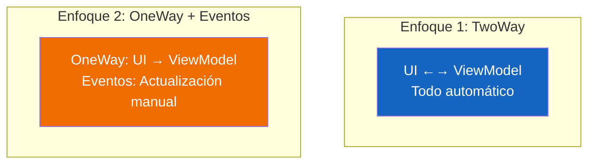

Esta es una decisión de diseño importante. Veamos ambos enfoques en detalle.

### Enfoque 1: TwoWay Binding (Recomendado para el 95% de casos)

El binding TwoWay hace todo automáticamente:
- El usuario escribe → el ViewModel se actualiza automáticamente
- El código cambia el valor → la UI se actualiza automáticamente

**ViewModel:**
```csharp
public partial class PersonaViewModel : ObservableObject
{
    [ObservableProperty]
    private string _nombre = "";
    
    [ObservableProperty]
    private string _email = "";
}
```

**XAML:**
```xml
<!-- El binding hace TODO automáticamente -->
<TextBox Text="{Binding Nombre, Mode=TwoWay, UpdateSourceTrigger=PropertyChanged}"/>
<TextBox Text="{Binding Email, Mode=TwoWay, UpdateSourceTrigger=PropertyChanged}"/>
```

**Flujo:**
1. Usuario escribe "Juan" → `_nombre` = "Juan" automáticamente
2. Código cambia `_nombre` = "Pedro" → la UI muestra "Pedro"

### Enfoque 2: OneWay + Eventos (Para casos especiales)

A veces necesitamos **control manual** antes de actualizar el ViewModel.

**ViewModel:**
```csharp
public partial class PersonaViewModel : ObservableObject
{
    [ObservableProperty]
    private string _nombre = "";
    
    // Método público para actualizar desde eventos
    public void ActualizarNombre(string valor)
    {
        Nombre = valor;
    }
}
```

**XAML:**
```xml
<!-- OneWay: solo lee del ViewModel -->
<TextBox x:Name="txtNombre" 
         Text="{Binding Nombre, Mode=OneWay}"
         TextChanged="TxtNombre_TextChanged"/>
```

**Code-behind:**
```csharp
private void TxtNombre_TextChanged(object sender, TextChangedEventArgs e)
{
    if (sender is TextBox textBox)
    {
        // Aquí tenemos CONTROL TOTAL sobre cuándo actualizar
        // Podemos añadir LÓGICA EXTRA antes de actualizar
        
        // Ejemplo 1: Solo actualizar si tiene al menos 3 caracteres
        if (textBox.Text.Length >= 3)
        {
            if (DataContext is PersonaViewModel vm)
            {
                vm.ActualizarNombre(textBox.Text);
            }
        }
    }
}
```

### Ejemplo completo: Validación con API

Uno de los casos donde OneWay + Eventos es mejor que TwoWay.

**ViewModel:**
```csharp
public partial class RegistroViewModel : ObservableObject
{
    [ObservableProperty]
    private string _email = "";
    
    [ObservableProperty]
    private bool _emailValido = false;
    
    [ObservableProperty]
    private string _mensajeError = "";
    
    // Servicio de validación
    private readonly IValidacionService _validacionService;
    
    public RegistroViewModel(IValidacionService validacionService)
    {
        _validacionService = validacionService;
    }
    
    public async Task<bool> ValidarEmailAsync(string email)
    {
        _mensajeError = "";
        
        if (string.IsNullOrWhiteSpace(email))
        {
            _mensajeError = "El email no puede estar vacío";
            return false;
        }
        
        // Validación con API externa
        bool esValido = await _validacionService.ValidarEmailAsync(email);
        
        if (!esValido)
        {
            _mensajeError = "El email ya está registrado";
        }
        
        EmailValido = esValido;
        return esValido;
    }
}
```

**XAML:**
```xml
<TextBox x:Name="txtEmail"
         Text="{Binding Email, Mode=OneWay}"
         TextChanged="TxtEmail_TextChanged"
         LostFocus="TxtEmail_LostFocus"/>

<TextBlock Text="{Binding MensajeError}" 
           Foreground="Red"
           Visibility="{Binding MensajeError, 
                          Converter={StaticResource StringToVisibilityConverter}}"/>
```

**Code-behind:**
```csharp
private async void TxtEmail_TextChanged(object sender, TextChangedEventArgs e)
{
    // Mientras escribe, no validamos (ahorramos llamadas a la API)
    // Solo limpiamos el mensaje de error
    if (DataContext is RegistroViewModel vm)
    {
        vm.MensajeError = "";
    }
}

private async void TxtEmail_LostFocus(object sender, RoutedEventArgs e)
{
    // Al perder el foco, validamos con la API
    if (sender is TextBox textBox && DataContext is RegistroViewModel vm)
    {
        await vm.ValidarEmailAsync(textBox.Text);
        
        if (!vm.EmailValido)
        {
            // Mostrar error visual
            textBox.Background = new SolidColorBrush(Color.FromRgb(255, 200, 200));
        }
        else
        {
            textBox.Background = Brushes.White;
            // Ahora sí actualizamos el ViewModel
            vm.Email = textBox.Text;
        }
    }
}
```

### Comparación detallada

| Aspecto | TwoWay | OneWay + Eventos |
|---------|--------|------------------|
| **Código** | Mínimo (solo XAML) | Más (XAML + Code-behind) |
| **Control** | Menos (automático) | Total (tú decides cuándo) |
| **MVVM** | ✅ Puro | ❌ Híbrido |
| **Mantenimiento** | Fácil | Difícil |
| **Testabilidad** | Fácil (todo en ViewModel) | Difícil (lógica en code-behind) |
| **Validación asíncrona** | Difícil | Fácil |
| **Rendimiento** | Normal | Mejor controlable |

### Cuándo usar cada uno

**Usa TwoWay cuando:**
- El 95% de los casos
- Formularios simples
- No necesitas lógica antes de actualizar
- Quieres mantener MVVM puro

**Usa OneWay + Eventos cuando:**
- Validaciones que requieren llamada a API externa
- Lógica compleja antes de actualizar
- Optimización extrema (no actualizar en cada tecleo)
- Casos donde UpdateSourceTrigger no es suficiente

### Ejemplo: Contador de caracteres

```xml
<!-- TwoWay: se actualiza automáticamente -->
<TextBox Text="{Binding Descripcion, Mode=TwoWay}"/>
<TextBlock Text="{Binding Descripcion.Length, StringFormat='{0}/100 caracteres'}"/>

<!-- OneWay + Eventos: control manual -->
<TextBox x:Name="txtDescripcion"
         Text="{Binding Descripcion, Mode=OneWay}"
         TextChanged="TxtDescripcion_TextChanged"/>
<TextBlock x:Name="txtContador" Text="0/100 caracteres"/>
```

```csharp
private void TxtDescripcion_TextChanged(object sender, TextChangedEventArgs e)
{
    if (sender is TextBox textBox)
    {
        int caracteres = textBox.Text.Length;
        
        // Actualizar contador
        txtContador.Text = $"{caracteres}/100 caracteres";
        
        // Solo actualizar ViewModel si no excede el límite
        if (caracteres <= 100 && DataContext is RegistroViewModel vm)
        {
            vm.Descripcion = textBox.Text;
        }
    }
}
```

### Pros y Contras

**Pros TwoWay:**
- ✅ Código mínimo
- ✅ MVVM puro
- ✅ Fácil mantenimiento
- ✅ Fácil de testear

**Contras TwoWay:**
- ❌ Menos control sobre cuándo se actualiza
- ❌ Difícil de validar con APIs externas

**Pros OneWay + Eventos:**
- ✅ Control total
- ✅ Lógica antes de actualizar
- ✅ Validación asíncrona fácil

**Contras OneWay + Eventos:**
- ❌ Rompe MVVM
- ❌ Más código
- ❌ Difícil de mantener
- ❌ Difícil de testear

---

### 9.3.13. partial void OnChanged - Reaccionar al cambio

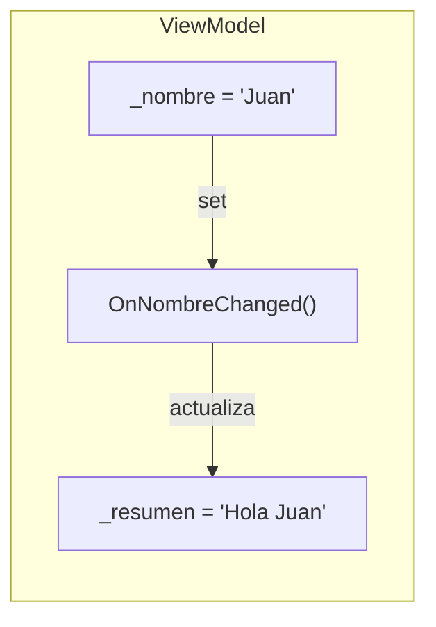

**partial void OnChanged** es un método que se ejecuta automáticamente cuando una propiedad cambia. Es la forma de "reaccionar" al cambio en el ViewModel.

### Por qué usar OnChanged

Imagina que tienes un formulario y quieres que el "resumen" se actualice automáticamente cuando el usuario cambia cualquier campo. En lugar de actualizar manualmente en cada comando, puedes usar `OnChanged`.

### Ejemplo 1: Formulario reactivo básico

**ViewModel:**
```csharp
public partial class PersonaViewModel : ObservableObject
{
    [ObservableProperty]
    private string _nombre = "";
    
    [ObservableProperty]
    private string _apellidos = "";
    
    [ObservableProperty]
    private int _edad = 0;
    
    [ObservableProperty]
    private string _ciudad = "";
    
    // Propiedad calculada que se actualiza automáticamente
    [ObservableProperty]
    private string _resumen = "Rellena el formulario";

    // Se ejecuta cuando _nombre cambia
    partial void OnNombreChanged(string value) => ActualizarResumen();
    
    // Se ejecuta cuando _apellidos cambia
    partial void OnApellidosChanged(string value) => ActualizarResumen();
    
    // Se ejecuta cuando _edad cambia
    partial void OnEdadChanged(int value) => ActualizarResumen();
    
    // Se ejecuta cuando _ciudad cambia
    partial void OnCiudadChanged(string value) => ActualizarResumen();
    
    private void ActualizarResumen()
    {
        var partes = new List<string>();
        
        if (!string.IsNullOrWhiteSpace(Nombre) || !string.IsNullOrWhiteSpace(Apellidos))
            partes.Add($"{Nombre} {Apellidos}".Trim());
        
        if (Edad > 0)
            partes.Add($"{Edad} años");
        
        if (!string.IsNullOrWhiteSpace(Ciudad))
            partes.Add($"de {Ciudad}");
        
        Resumen = partes.Count > 0 
            ? string.Join(", ", partes) 
            : "Rellena el formulario";
    }
}
```

**XAML:**
```xml
<StackPanel Margin="20">
    <TextBox Text="{Binding Nombre, Mode=TwoWay, UpdateSourceTrigger=PropertyChanged}"
             Margin="0,5"/>
    <TextBox Text="{Binding Apellidos, Mode=TwoWay, UpdateSourceTrigger=PropertyChanged}"
             Margin="0,5"/>
    <TextBox Text="{Binding Edad, Mode=TwoWay, UpdateSourceTrigger=PropertyChanged}"
             Margin="0,5"/>
    <TextBox Text="{Binding Ciudad, Mode=TwoWay, UpdateSourceTrigger=PropertyChanged}"
             Margin="0,5"/>
    
    <!-- Este TextBlock se actualiza automáticamente -->
    <TextBlock Text="{Binding Resumen}" 
               FontSize="16" 
               FontWeight="Bold"
               Margin="0,20,0,0"/>
</StackPanel>
```

### Ejemplo 2: Validación automática

```csharp
public partial class RegistroViewModel : ObservableObject
{
    [ObservableProperty]
    [NotifyPropertyChangedFor(nameof(EsFormularioValido))]
    private string _nombre = "";
    
    [ObservableProperty]
    [NotifyPropertyChangedFor(nameof(EsFormularioValido))]
    private string _email = "";
    
    [ObservableProperty]
    [NotifyPropertyChangedFor(nameof(EsFormularioValido))]
    private int _edad = 0;
    
    [ObservableProperty]
    private bool _esFormularioValido = false;
    
    [ObservableProperty]
    private string _mensajeValidacion = "";

    partial void OnNombreChanged(string value) => ValidarFormulario();
    partial void OnEmailChanged(string value) => ValidarFormulario();
    partial void OnEdadChanged(int value) => ValidarFormulario();
    
    private void ValidarFormulario()
    {
        var errores = new List<string>();
        
        if (string.IsNullOrWhiteSpace(Nombre))
            errores.Add("El nombre es obligatorio");
        
        if (string.IsNullOrWhiteSpace(Email) || !Email.Contains("@"))
            errores.Add("El email no es válido");
        
        if (Edad < 18)
            errores.Add("Debes ser mayor de edad");
        
        MensajeValidacion = errores.Count > 0 
            ? string.Join("\n", errores) 
            : "";
        
        EsFormularioValido = errores.Count == 0;
    }
}
```

### Ejemplo 3: Logging automático

```csharp
public partial class ConfiguracionViewModel : ObservableObject
{
    [ObservableProperty]
    private bool _notificaciones = false;
    
    [ObservableProperty]
    private string _tema = "Claro";
    
    private readonly ILogger<ConfiguracionViewModel> _logger;

    partial void OnNotificacionesChanged(bool value)
    {
        _logger.LogInformation("Notificaciones cambiadas a: {Valor}", value);
        GuardarConfiguracion();
    }
    
    partial void OnTemaChanged(string value)
    {
        _logger.LogInformation("Tema cambiado a: {Valor}", value);
        GuardarConfiguracion();
    }
    
    private void GuardarConfiguracion()
    {
        // Guardar en Settings
    }
}
```

### Ejemplo 4: Notificaciones CanExecute

```csharp
public partial class MainViewModel : ObservableObject
{
    [ObservableProperty]
    [NotifyCanExecuteChangedFor(nameof(GuardarCommand))]
    private bool _tieneCambios = false;
    
    [ObservableProperty]
    [NotifyCanExecuteChangedFor(nameof(EliminarCommand))]
    private bool _elementoSeleccionado = false;

    [RelayCommand(CanExecute = nameof(Guardar))]
    private void Guardar()
    {
        // Guardar cambios
        TieneCambios = false;
    }
    
    private bool Guardar() => TieneCambios;

    [RelayCommand(CanExecute = nameof(Eliminar))]
    private void Eliminar()
    {
        // Eliminar elemento
    }
    
    private bool Eliminar() => ElementoSeleccionado;
}
```

### Diferencia con eventos de UI

| | partial void OnChanged | Evento UI (TextChanged) |
|--|------------------------|------------------------|
| **Dónde** | ViewModel | Code-behind |
| **Cuándo** | Cuando la propiedad cambia | Solo cuando el usuario escribe |
| **Origen** | UI o código | Solo UI |
| **MVVM** | ✅ Puro | ❌ Rompido |

### Diferencia con NotifyPropertyChangedFor

```csharp
// Opción 1: partial void OnChanged
[ObservableProperty]
private string _nombre = "";

partial void OnNombreChanged(string value)
{
    // Código que se ejecuta cuando cambia
    Resumen = value;
}

// Opción 2: NotifyPropertyChangedFor (más simple)
[ObservableProperty]
[NotifyPropertyChangedFor(nameof(Resumen))]
private string _nombre = "";

// El atributo solo notifica a otra propiedad
// No ejecuta código adicional
```

**Usa OnChanged cuando:**
- Necesitas ejecutar código adicional
- Tienes lógica compleja

**Usa NotifyPropertyChangedFor cuando:**
- Solo necesitas notificar a otra propiedad
- No necesitas lógica adicional

### Pros y Contras

**Pros:**
- ✅ Reacciona a cualquier cambio (UI o código)
- ✅ Mantiene MVVM puro
- ✅ Código limpio
- ✅ Puede ejecutar lógica compleja

**Contras:**
- ❌ Se ejecuta cada vez que cambia (puede ser costoso)
- ❌ Hay que definir un método por cada propiedad

---

### 9.3.14. Collection Binding - ItemsSource

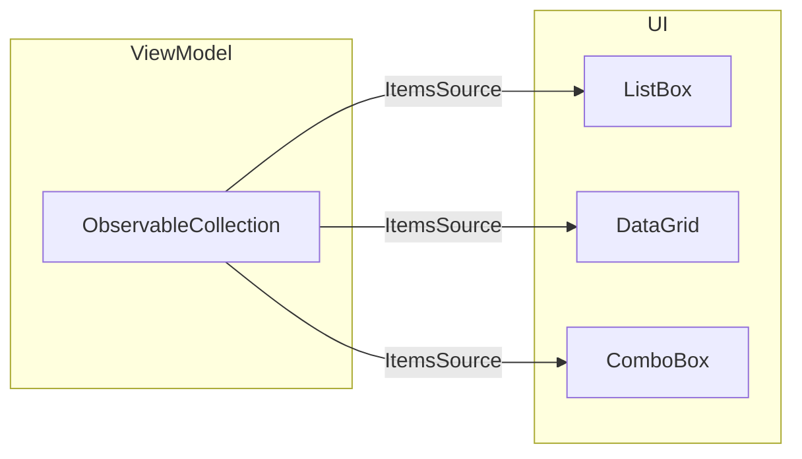

El binding de colecciones es fundamental para mostrar listas de datos en WPF. La clave es usar **ObservableCollection** en lugar de List.

### Por qué ObservableCollection

```csharp
// ❌ INCORRECTO: No notifica cambios a la UI
public List<Persona> Personas { get; set; } = new();

// ✅ CORRECTO: Notifica cambios a la UI
public ObservableCollection<Persona> Personas { get; set; } = new();
```

Cuando modificas un `ObservableCollection` (Add, Remove, Clear), la UI se actualiza automáticamente.

### Comparación: List vs ObservableCollection

| Característica | List<T> | ObservableCollection<T> |
|----------------|---------|-------------------------|
| **Notifica cambios** | ❌ No | ✅ Sí (Add/Remove/Clear) |
| **Actualización UI** | ❌ Manual | ✅ Automática |
| **Uso en Binding** | ⚠️ Limitado | ✅ Recomendado |
| **Ideal para** | Datos estáticos | Listas dinámicas |
| **Consumo memoria** | ✅ Menor | ⚠️ Ligeramente mayor |
| **Eventos** | ❌ No tiene | ✅ CollectionChanged |

```csharp
// Ejemplo: ¿Qué pasa con cada tipo?

var personas = new List<Persona>();        // ❌ No notifica
var personas = new ObservableCollection<Persona>(); // ✅ Notifica

// Cuando añadimos un elemento:
personas.Add(new Persona());  
// → ObservableCollection dispara CollectionChanged → UI se actualiza
// → List NO dispara nada → UI NO se actualiza
```

### ¿Cuándo usar cada uno?

| Situación | Recomendación |
|-----------|---------------|
| Lista que nunca cambia | `List<T>` |
| Lista con filtros dinámicos | `ObservableCollection<T>` |
| Carrito de compra | `ObservableCollection<T>` |
| DataGrid editable | `ObservableCollection<T>` |
| Datos de solo lectura | `List<T>` o `IReadOnlyList<T>` |

### Ejemplo completo: Gestión de Productos

**Modelo:**
```csharp
public class Producto
{
    public int Id { get; set; }
    public string Nombre { get; set; } = "";
    public decimal Precio { get; set; }
    public int Stock { get; set; }
    public bool EstaActivo { get; set; } = true;
}
```

**ViewModel:**
```csharp
public partial class ProductosViewModel : ObservableObject
{
    [ObservableProperty]
    private ObservableCollection<Producto> _productos = new();
    
    [ObservableProperty]
    private Producto? _productoSeleccionado;
    
    [ObservableProperty]
    private string _filtro = "";
    
    [ObservableProperty]
    private ObservableCollection<Producto> _productosFiltrados = new();
    
    public ProductosViewModel()
    {
        // Cargar datos iniciales
        CargarProductos();
    }
    
    private void CargarProductos()
    {
        // Simular carga de base de datos
        Productos.Add(new Producto { Id = 1, Nombre = "Portátil", Precio = 999.99m, Stock = 10 });
        Productos.Add(new Producto { Id = 2, Nombre = "Ratón", Precio = 29.99m, Stock = 50 });
        Productos.Add(new Producto { Id = 3, Nombre = "Teclado", Precio = 79.99m, Stock = 25 });
        
        ActualizarFiltro();
    }
    
    partial void OnFiltroChanged(string value)
    {
        ActualizarFiltro();
    }
    
    private void ActualizarFiltro()
    {
        if (string.IsNullOrWhiteSpace(Filtro))
        {
            ProductosFiltrados = new ObservableCollection<Producto>(Productos);
        }
        else
        {
            var filtrados = Productos
                .Where(p => p.Nombre.Contains(Filtro, StringComparison.OrdinalIgnoreCase))
                .ToList();
            ProductosFiltrados = new ObservableCollection<Producto>(filtrados);
        }
    }
    
    [RelayCommand]
    private void AgregarProducto()
    {
        var nuevo = new Producto 
        { 
            Id = Productos.Count + 1, 
            Nombre = "Nuevo producto",
            Precio = 0,
            Stock = 0
        };
        Productos.Add(nuevo);
    }
    
    [RelayCommand]
    private void EliminarProducto()
    {
        if (ProductoSeleccionado != null)
        {
            Productos.Remove(ProductoSeleccionado);
            ProductoSeleccionado = null;
        }
    }
}
```

### Ejemplo 1: ListBox con DataTemplate

```xml
<ListBox ItemsSource="{Binding ProductosFiltrados}"
         SelectedItem="{Binding ProductoSeleccionado}"
         Height="300">
    <ListBox.ItemTemplate>
        <DataTemplate>
            <Border Padding="10" Margin="5" Background="#F5F5F5" CornerRadius="5">
                <Grid>
                    <Grid.ColumnDefinitions>
                        <ColumnDefinition Width="*"/>
                        <ColumnDefinition Width="Auto"/>
                    </Grid.ColumnDefinitions>
                    <Grid.RowDefinitions>
                        <RowDefinition Height="Auto"/>
                        <RowDefinition Height="Auto"/>
                    </Grid.RowDefinitions>
                    
                    <TextBlock Grid.Row="0" Grid.Column="0" 
                               Text="{Binding Nombre}" 
                               FontWeight="Bold" 
                               FontSize="14"/>
                    
                    <TextBlock Grid.Row="0" Grid.Column="1" 
                               Text="{Binding Precio, StringFormat='{}{0:C2}'}"
                               Foreground="Green" 
                               FontWeight="Bold"/>
                    
                    <TextBlock Grid.Row="1" Grid.Column="0" 
                               Grid.ColumnSpan="2">
                        <Run Text="Stock: "/>
                        <Run Text="{Binding Stock}" FontWeight="Bold"/>
                    </TextBlock>
                </Grid>
            </Border>
        </DataTemplate>
    </ListBox.ItemTemplate>
</ListBox>
```

### Ejemplo 2: DataGrid con edición

```xml
<DataGrid ItemsSource="{Binding ProductosFiltrados}"
          SelectedItem="{Binding ProductoSeleccionado}"
          AutoGenerateColumns="False"
          CanUserAddRows="True"
          CanUserDeleteRows="True"
          CanUserEditRows="True"
          Height="300">
    <DataGrid.Columns>
        <DataGridTextColumn Header="ID" Binding="{Binding Id}" IsReadOnly="True"/>
        <DataGridTextColumn Header="Nombre" Binding="{Binding Nombre}" Width="*"/>
        <DataGridTextColumn Header="Precio" Binding="{Binding Precio, StringFormat='{}{0:C2}'}"/>
        <DataGridTextColumn Header="Stock" Binding="{Binding Stock}"/>
        <DataGridCheckBoxColumn Header="Activo" Binding="{Binding EstaActivo}"/>
    </DataGrid.Columns>
</DataGrid>
```

> 💡 **Nota**: El `DataGrid` binding usa `ObservableCollection<Producto>` para que cualquier cambio en la lista (añadir, eliminar, filtrar) se refleje automáticamente en la tabla. Si usaras `List<T>`, tendrías que recargar manualmente.

### Ejemplo 3: ComboBox

```xml
<ComboBox ItemsSource="{Binding Productos}"
          SelectedItem="{Binding ProductoSeleccionado}"
          DisplayMemberPath="Nombre"
          Width="200"/>
```

> 💡 **Nota**: El `ComboBox` binding requiere `ObservableCollection<T>` para que cuando la lista de opciones cambie (ej: cargar más categorías), el desplegable se actualice automáticamente.

### Ejemplo 4: ItemsControl simple

```xml
<ItemsControl ItemsSource="{Binding ProductosFiltrados}">
    <ItemsControl.ItemsPanel>
        <ItemsPanelTemplate>
            <WrapPanel/>
        </ItemsPanelTemplate>
    </ItemsControl.ItemsPanel>
    <ItemsControl.ItemTemplate>
        <DataTemplate>
            <Border Width="150" Padding="10" Margin="5" 
                    Background="LightBlue" CornerRadius="5">
                <StackPanel>
                    <TextBlock Text="{Binding Nombre}" FontWeight="Bold"/>
                    <TextBlock Text="{Binding Precio, StringFormat='{}{0:C2}'}"/>
                </StackPanel>
            </Border>
        </DataTemplate>
    </ItemsControl.ItemTemplate>
</ItemsControl>
```

### Ejemplo 5: ListView

```xml
<ListView ItemsSource="{Binding ProductosFiltrados}"
          SelectedItem="{Binding ProductoSeleccionado}">
    <ListView.View>
        <GridView>
            <GridViewColumn Header="Nombre" 
                           DisplayMemberBinding="{Binding Nombre}" 
                           Width="150"/>
            <GridViewColumn Header="Precio" 
                           DisplayMemberBinding="{Binding Precio, StringFormat='{}{0:C2}'}" 
                           Width="100"/>
            <GridViewColumn Header="Stock" 
                           DisplayMemberBinding="{Binding Stock}" 
                           Width="80"/>
        </GridView>
    </ListView.View>
</ListView>
```

> 💡 **Nota**: El `ListView` binding con `GridView` permite mostrar datos en columnas. Usa `ObservableCollection` para que los filtros o cambios en la lista se actualicen automáticamente en la vista.

### Diferencia entre controles

| Control | Uso | Ventajas |
|---------|-----|----------|
| **ListBox** | Selección única/múltiple | Plantillas flexibles |
| **DataGrid** | Tablas editables | Ordenar, editar, eliminar |
| **ComboBox** | Selección desplegable | Ahorra espacio |
| **ItemsControl** | Listas simples | Total control del layout |
| **ListView** | Listas con columnas | Como ListBox pero con columnas |

### Colecciones con CommunityToolkit

```csharp
public partial class MainViewModel : ObservableObject
{
    // ObservableProperty genera automáticamente la propiedad
    [ObservableProperty]
    private ObservableCollection<Producto> _productos = new();
    
    // Para colecciones, también podemos usar collection initializer
    [ObservableProperty]
    private ObservableCollection<Categoria> _categorias = new()
    {
        new Categoria { Id = 1, Nombre = "Electrónica" },
        new Categoria { Id = 2, Nombre = "Hogar" },
        new Categoria { Id = 3, Nombre = "Deportes" }
    };
}
```

### Pros y Contras

**Pros:**
- ✅ Binding de colecciones automáticamente
- ✅ Soporte para selección
- ✅ Plantillas personalizables
- ✅ Edición integrada (DataGrid)
- ✅ Notificaciones automáticas con ObservableCollection
- ✅ **Sin código adicional**: No necesitas recargar la lista manualmente

**Contras:**
- ❌ Requiere ObservableCollection para notificaciones (no sirve con List<T>)
- ❌ Puede requerir Virtualization para grandes listas
- ❌ DataGrid puede ser lento con muchos datos

> 💡 **Recordatorio**: Para que cualquier control de lista (DataGrid, ListView, ComboBox, ListBox) se actualice automáticamente cuando cambias los datos, **debes usar ObservableCollection<T>**. Si usas List<T>, la UI no se enterará de los cambios y verás datos obsoletos.

### 9.3.6. Diagrama: ciclo de vida de un binding

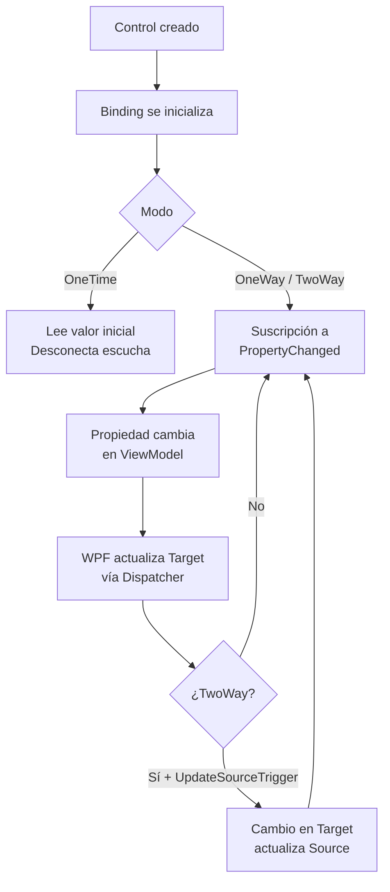

---

### 9.3.15. IDataErrorInfo - Validación de Formularios

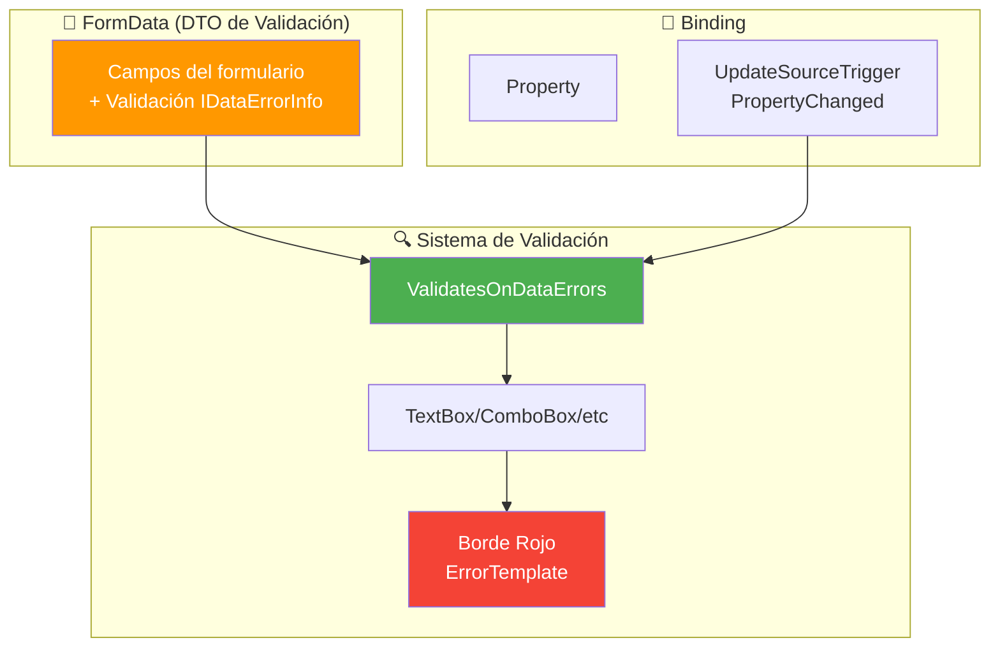

**IDataErrorInfo** es una interfaz de WPF que permite implementar validación de formularios de forma elegante, mostrando errores directamente en los controles.

#### 9.3.15.1. La Interfaz IDataErrorInfo

```csharp
public interface IDataErrorInfo
{
    // Indexador: devuelve el error de una propiedad específica
    string this[string columnName] { get; }
    
    // Error general (raramente usado en WPF)
    string Error { get; }
}
```

**¿Por qué usar IDataErrorInfo?**

| Sin IDataErrorInfo | Con IDataErrorInfo |
|-------------------|-------------------|
| Validar en el botón "Guardar" | Validación en tiempo real |
| Mensajes genéricos | Error por campo específico |
| Código duplicado | Lógica centralizada |
| UX pobre | Feedback inmediato |

#### 9.3.15.2. Implementación Básica de IDataErrorInfo

```csharp
using System.ComponentModel;
using CommunityToolkit.Mvvm.ComponentModel;

public partial class PersonaFormData : ObservableObject, IDataErrorInfo
{
    [ObservableProperty]
    private string _nombre = "";
    
    [ObservableProperty]
    private string _email = "";
    
    [ObservableProperty]
    private int _edad;
    
    // Indexador: se llama automáticamente para cada propiedad
    public string this[string columnName]
    {
        get
        {
            return columnName switch
            {
                nameof(Nombre) when string.IsNullOrWhiteSpace(Nombre)
                    => "El nombre es obligatorio.",
                nameof(Nombre) when Nombre.Length < 2
                    => "El nombre debe tener al menos 2 caracteres.",
                
                nameof(Email) when string.IsNullOrWhiteSpace(Email)
                    => "El email es obligatorio.",
                nameof(Email) when !Email.Contains('@')
                    => "El email debe contener '@'.",
                nameof(Email) when !Email.Contains('.')
                    => "El email debe tener un dominio válido.",
                
                nameof(Edad) when Edad < 18
                    => "Debes ser mayor de edad (18 años).",
                nameof(Edad) when Edad > 120
                    => "La edad no puede ser mayor de 120 años.",
                
                _ => string.Empty  // Sin error
            };
        }
    }
    
    // Rareamente usado en WPF, pero requerido por la interfaz
    public string Error => string.Empty;
    
    // Método helper para validación global
    public bool IsValid()
    {
        return string.IsNullOrEmpty(this[nameof(Nombre)]) &&
               string.IsNullOrEmpty(this[nameof(Email)]) &&
               string.IsNullOrEmpty(this[nameof(Edad)]);
    }
}
```

#### 9.3.15.3. El Patrón FormData (DTO de Formulario)

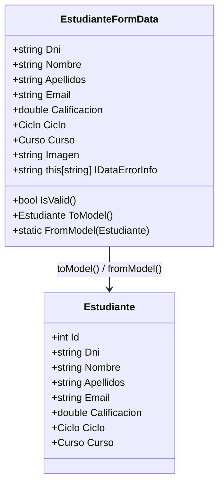

**¿Por qué FormData en lugar de validar directamente en el ViewModel?**

```csharp
// ❌ INCORRECTO: Mezclar datos de formulario con lógica de presentación
public partial class EstudianteEditViewModel : ObservableObject
{
    [ObservableProperty]
    private string _dni = "";  // Este es el campo del formulario
    
    [ObservableProperty]
    private Estudiante? _estudiante;  // Y este es el modelo
    
    // Validation mezclada con lógica de presentación
    public string this[string columnName] => columnName switch
    {
        nameof(Dni) when string.IsNullOrWhiteSpace(Dni) => "DNI obligatorio",
        // ...
    };
}

// ✅ CORRECTO: Separar FormData (datos + validación) del ViewModel (lógica de presentación)
public partial class EstudianteEditViewModel : ObservableObject
{
    [ObservableProperty]
    private EstudianteFormData _formData = new();
    
    [ObservableProperty]
    private Estudiante? _estudianteOriginal;
    
    [RelayCommand(CanExecute = nameof(CanGuardar))]
    private async Task GuardarAsync()
    {
        // El FormData ya está validado
        if (!FormData.IsValid()) return;
        
        var estudiante = FormData.ToModel(EstudianteOriginal?.Id ?? 0);
        // Guardar en repositorio...
    }
    
    private bool CanGuardar() => FormData.IsValid();
}
```

#### 9.3.15.4. FormData Completo con Mapping

```csharp
public partial class EstudianteFormData : ObservableObject, IDataErrorInfo
{
    [ObservableProperty]
    private string _dni = "";
    
    [ObservableProperty]
    private string _nombre = "";
    
    [ObservableProperty]
    private string _apellidos = "";
    
    [ObservableProperty]
    private string _email = "";
    
    [ObservableProperty]
    private double _calificacion;
    
    [ObservableProperty]
    private Ciclo _ciclo = Ciclo.DAM;
    
    [ObservableProperty]
    private Curso _curso = Curso.Primero;
    
    [ObservableProperty]
    private string? _imagen;
    
    // VALIDACIÓN CON IDATAERRORINFO
    public string this[string columnName]
    {
        get
        {
            return columnName switch
            {
                nameof(Dni) when string.IsNullOrWhiteSpace(Dni)
                    => "El DNI es obligatorio.",
                nameof(Dni) when !EsDniValido(Dni)
                    => "El DNI debe tener 8 dígitos y una letra.",
                
                nameof(Nombre) when string.IsNullOrWhiteSpace(Nombre)
                    => "El nombre es obligatorio.",
                nameof(Nombre) when Nombre.Length < 2
                    => "El nombre debe tener al menos 2 caracteres.",
                
                nameof(Apellidos) when string.IsNullOrWhiteSpace(Apellidos)
                    => "Los apellidos son obligatorios.",
                nameof(Apellidos) when Apellidos.Length < 2
                    => "Los apellidos deben tener al menos 2 caracteres.",
                
                nameof(Email) when string.IsNullOrWhiteSpace(Email)
                    => "El email es obligatorio.",
                nameof(Email) when !Email.Contains('@')
                    => "El email debe contener '@'.",
                
                nameof(Calificacion) when Calificacion < 0
                    => "La nota no puede ser negativa.",
                nameof(Calificacion) when Calificacion > 10
                    => "La nota no puede superar 10.",
                
                _ => string.Empty
            };
        }
    }
    
    public string Error => string.Empty;
    
    // Validación global
    public bool IsValid()
    {
        return string.IsNullOrEmpty(this[nameof(Dni)]) &&
               string.IsNullOrEmpty(this[nameof(Nombre)]) &&
               string.IsNullOrEmpty(this[nameof(Apellidos)]) &&
               string.IsNullOrEmpty(this[nameof(Email)]) &&
               string.IsNullOrEmpty(this[nameof(Calificacion)]);
    }
    
    // Convertir FormData a Modelo (para guardar)
    public Estudiante ToModel(int id = 0)
    {
        return new Estudiante
        {
            Id = id,
            Dni = Dni.Trim(),
            Nombre = Nombre.Trim(),
            Apellidos = Apellidos.Trim(),
            Email = Email.Trim().ToLower(),
            Calificacion = Calificacion,
            Ciclo = Ciclo,
            Curso = Curso,
            Imagen = Imagen
        };
    }
    
    // Crear FormData desde Modelo (para editar)
    public static EstudianteFormData FromModel(Estudiante estudiante)
    {
        return new EstudianteFormData
        {
            Dni = estudiante.Dni,
            Nombre = estudiante.Nombre,
            Apellidos = estudiante.Apellidos,
            Email = estudiante.Email,
            Calificacion = estudiante.Calificacion,
            Ciclo = estudiante.Ciclo,
            Curso = estudiante.Curso,
            Imagen = estudiante.Imagen
        };
    }
    
    // Helper: Validar formato DNI español
    private static bool EsDniValido(string dni)
    {
        if (string.IsNullOrWhiteSpace(dni) || dni.Length != 9)
            return false;
        
        var numeros = dni[..8];
        var letra = dni[8];
        
        if (!int.TryParse(numeros, out _))
            return false;
        
        var letrasValidas = "TRWAGMYFPDXBNJZSVQHLCKE";
        var letraCorrecta = letrasValidas[int.Parse(numeros) % 23];
        
        return char.ToUpper(letra) == letraCorrecta;
    }
}
```

#### 9.3.15.5. XAML: ValidatesOnDataErrors

```xml
<StackPanel Margin="20">
    <!-- DNI con validación en tiempo real -->
    <TextBox Text="{Binding FormData.Dni, 
                     UpdateSourceTrigger=PropertyChanged,
                     ValidatesOnDataErrors=True}"
             Width="300"/>
    
    <!-- Nombre con validación -->
    <TextBox Text="{Binding FormData.Nombre, 
                     UpdateSourceTrigger=PropertyChanged,
                     ValidatesOnDataErrors=True}"
             Width="300"/>
    
    <!-- Email con validación -->
    <TextBox Text="{Binding FormData.Email, 
                     UpdateSourceTrigger=PropertyChanged,
                     ValidatesOnDataErrors=True}"
             Width="300"/>
    
    <!-- Calificación con validación -->
    <TextBox Text="{Binding FormData.Calificacion, 
                     UpdateSourceTrigger=PropertyChanged,
                     ValidatesOnDataErrors=True}"
             Width="100"/>
    
    <!-- ComboBox con validación -->
    <ComboBox ItemsSource="{Binding Ciclos}"
              SelectedItem="{Binding FormData.Ciclo, 
                             ValidatesOnDataErrors=True}"
              Width="200"/>
    
    <!-- Botón habilitado solo si es válido -->
    <Button Content="Guardar" 
            Command="{Binding GuardarCommand}"
            IsEnabled="{Binding FormData.IsValid}"
            Margin="0,20,0,0"/>
</StackPanel>
```

#### 9.3.15.6. Diagrama: Flujo de Validación en Tiempo Real

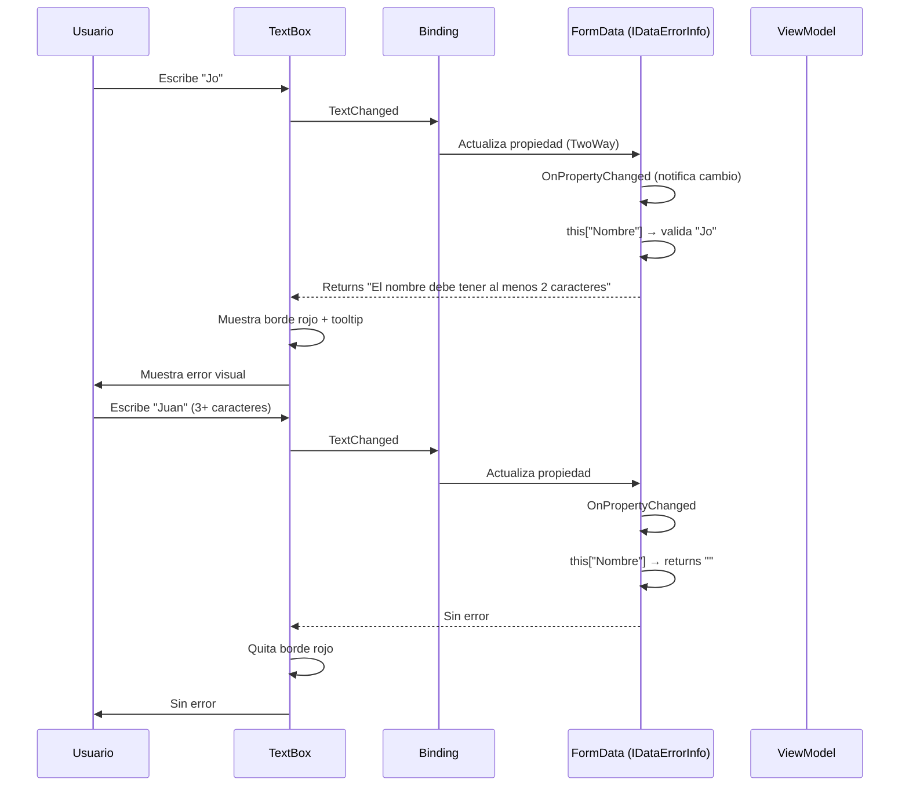

#### 9.3.15.7. Personalizar Plantilla de Error

```xml
<!-- ErrorTemplate personalizado -->
<TextBox Text="{Binding FormData.Dni, 
                 UpdateSourceTrigger=PropertyChanged,
                 ValidatesOnDataErrors=True}">
    <TextBox.Style>
        <Style TargetType="TextBox">
            <Style.Triggers>
                <Trigger Property="Validation.HasError" Value="True">
                    <Setter Property="ToolTip" 
                            Value="{Binding RelativeSource={RelativeSource Self}, 
                                          Path=(Validation.Errors)[0].ErrorContent}"/>
                    <Setter Property="BorderBrush" Value="Red"/>
                    <Setter Property="BorderThickness" Value="2"/>
                </Trigger>
            </Style.Triggers>
        </Style>
    </TextBox.Style>
</TextBox>
```

#### 9.3.15.8. Diferencia: IDataErrorInfo vs ValidationRules

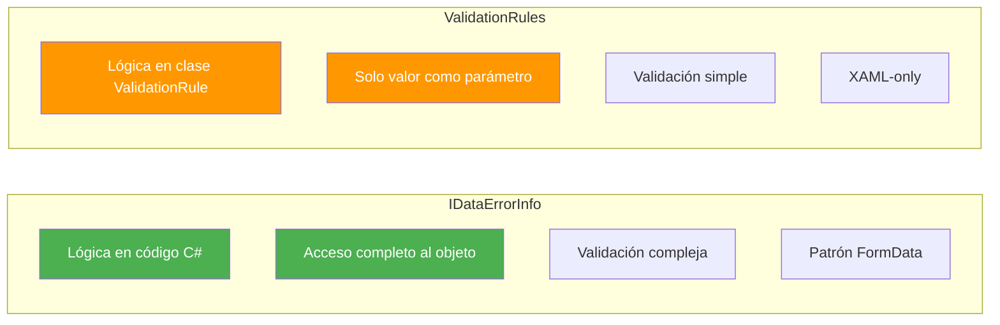

| Aspecto | IDataErrorInfo | ValidationRules |
|---------|----------------|-----------------|
| **Código** | C# completo | Clase separada |
| **Acceso a objeto** | ✅ Completo | ❌ Solo valor |
| **Lógica compleja** | ✅ Sí | ❌ Limitado |
| **Debugging** | ✅ Fácil | ⚠️ Más difícil |
| **Testing** | ✅ Unit test | ❌ Más complejo |
| **Dónde** | ViewModel/FormData | XAML |

#### 9.3.15.9. ViewModel con FormData

```csharp
public partial class EstudianteEditViewModel : ObservableObject
{
    private readonly IPersonasService _personasService;
    private readonly Estudiante? _estudianteOriginal;
    
    [ObservableProperty]
    private EstudianteFormData _formData;
    
    [ObservableProperty]
    private bool _isLoading;
    
    [ObservableProperty]
    private string _statusMessage = "";
    
    public EstudianteEditViewModel(
        IPersonasService personasService, 
        Estudiante? estudiante = null)
    {
        _personasService = personasService;
        _estudianteOriginal = estudiante;
        
        // Inicializar FormData desde el modelo (si existe)
        FormData = estudiante == null
            ? new EstudianteFormData()
            : EstudianteFormData.FromModel(estudiante);
    }
    
    [RelayCommand(CanExecute = nameof(CanGuardar))]
    private async Task GuardarAsync()
    {
        if (!FormData.IsValid())
        {
            StatusMessage = "Por favor, corrige los errores.";
            return;
        }
        
        IsLoading = true;
        StatusMessage = "Guardando...";
        
        try
        {
            var estudiante = FormData.ToModel(_estudianteOriginal?.Id ?? 0);
            
            if (_estudianteOriginal == null)
            {
                await _personasService.CreateEstudianteAsync(estudiante);
                StatusMessage = "Estudiante creado correctamente.";
            }
            else
            {
                await _personasService.UpdateEstudianteAsync(estudiante);
                StatusMessage = "Estudiante actualizado correctamente.";
            }
        }
        catch (Exception ex)
        {
            StatusMessage = $"Error: {ex.Message}";
        }
        finally
        {
            IsLoading = false;
        }
    }
    
    private bool CanGuardar() => FormData.IsValid();
}
```

#### 9.3.15.10. Pros y Contras de IDataErrorInfo + FormData

**Pros:**
- ✅ Validación en tiempo real mientras el usuario escribe
- ✅ Feedback visual inmediato (borde rojo + tooltip)
- ✅ Separación clara: FormData = datos + validación, ViewModel = lógica de presentación
- ✅ Código testeable (FormData se puede testear unitariamente)
- ✅ Mensajes de error específicos por campo
- ✅ El botón "Guardar" se deshabilita automáticamente si no es válido

**Contras:**
- ❌ Requiere implementar la interfaz IDataErrorInfo
- ❌ Necesita `ValidatesOnDataErrors=True` en cada binding
- ❌ El indexador puede crecer mucho (usar helper methods)
- ❌ Requiere mantener sincronización con validación del backend

#### 9.3.15.11. Resumen: FormData + IDataErrorInfo

```mermaid
flowchart TD
    subgraph "FormData (DTO)"
        FD1[Campos del formulario]
        FD2[Implementa IDataErrorInfo]
        FD3[Método IsValid()]
        FD4[Método ToModel() / FromModel()]
    end
    
    subgraph "XAML"
        X1[ValidatesOnDataErrors=True]
        X2[UpdateSourceTrigger=PropertyChanged]
        X3[Binding a FormData.Property]
    end
    
    subgraph "ViewModel"
        VM1[Expone FormData]
        VM2[Comandos usan FormData.IsValid()]
    end
    
    FD1 --> X1
    FD2 --> X2
    FD3 --> VM1
    FD4 --> VM2
    
    style FD1 fill:#FF9800,color:#fff
    style FD2 fill:#4CAF50,color:#fff
    style X1 fill:#2196F3,color:#fff
    style VM1 fill:#9C27B0,color:#fff
```

| Componente | Responsabilidad |
|------------|-----------------|
| **FormData** | Campos + Validación (IDataErrorInfo) + Mapping |
| **ViewModel** | Expone FormData + Lógica de presentación + Comandos |
| **XAML** | `ValidatesOnDataErrors=True` + `UpdateSourceTrigger=PropertyChanged` |

> 💡 **Tip del Examinador**: En el examen pueden preguntarte: "¿Cómo se implementa validación en tiempo real en WPF?" La respuesta es implementar `IDataErrorInfo` en el ViewModel o FormData y usar `ValidatesOnDataErrors=True` en el binding. El indexador `this[string columnName]` devuelve el mensaje de error para cada propiedad.

---

## 9.4. IValueConverter

### 9.4.1. Implementación básica

```csharp
using System.Globalization;
using System.Windows.Data;

public class NumeroAColorConverter : IValueConverter
{
    public object Convert(object value, Type targetType, object parameter, CultureInfo culture)
    {
        if (value is int n)
            return n < 0 ? Brushes.Red : n == 0 ? Brushes.Gray : Brushes.Green;
        return Brushes.Black;
    }

    public object ConvertBack(object value, Type targetType, object parameter, CultureInfo culture)
        => throw new NotImplementedException();
}
```

### 9.4.2. BooleanToVisibilityConverter

```csharp
public class BoolToVisibilityConverter : IValueConverter
{
    public object Convert(object value, Type targetType, object parameter, CultureInfo culture)
    {
        bool esVisible = value is bool b && b;
        // ConverterParameter="Inverse" invierte la lógica
        if (parameter is string p && p == "Inverse") esVisible = !esVisible;
        return esVisible ? Visibility.Visible : Visibility.Collapsed;
    }

    public object ConvertBack(object value, Type targetType, object parameter, CultureInfo culture)
        => value is Visibility v && v == Visibility.Visible;
}
```

### 9.4.3. Registro en recursos

```xml
<Window xmlns:conv="clr-namespace:MiApp.Converters">
    <Window.Resources>
        <conv:BoolToVisibilityConverter x:Key="BoolToVisibility" />
        <conv:NumeroAColorConverter     x:Key="NumeroAColor"     />
    </Window.Resources>
    <!-- ... -->
</Window>
```

### 9.4.4. Uso en binding

```xml
<!-- Visibilidad condicional -->
<TextBlock Text="¡Usuario activo!"
           Visibility="{Binding Activo,
                        Converter={StaticResource BoolToVisibility}}" />

<!-- Color dinámico -->
<TextBlock Text="{Binding Saldo}"
           Foreground="{Binding Saldo,
                        Converter={StaticResource NumeroAColor}}" />

<!-- Visibilidad inversa (parámetro) -->
<TextBlock Text="Usuario inactivo"
           Visibility="{Binding Activo,
                        Converter={StaticResource BoolToVisibility},
                        ConverterParameter=Inverse}" />
```

---

## 9.5. Converters: ¿Qué son y por qué usarlos?

### 9.5.1. ¿Qué es un Converter en WPF?

Un **Converter (Convertidor)** en WPF es una clase que transforma un valor de un tipo a otro durante el proceso de binding. Es como un "traductor" entre el ViewModel y la Vista.

```mermaid
flowchart LR
    subgraph ViewModel
        VM["IsRunning = true"]
    end
    
    subgraph Converter
        C["InverseBooleanConverter\ntrue → false"]
    end
    
    subgraph UI
        UI["Button Enabled = false"]
    end
    
    VM -->|"Binding"| C -->|"Transformado"| UI
```

### 9.5.2. ¿Por qué necesitamos Converters?

Imagina que tienes estas situaciones:

| Problema | Solución con Converter |
|----------|------------------------|
| El ViewModel tiene `bool` pero la UI necesita `Visibility` | BoolToVisibilityConverter |
| El ViewModel tiene `bool` pero quieres **invertirlo** (true → false, false → true) | InverseBooleanConverter |
| El ViewModel tiene un número pero la UI necesita un color | NumberToColorConverter |
| El ViewModel tiene una fecha pero la UI necesita texto formateado | DateToStringConverter |

**Sin converters**, tendrías que:
- Escribir código en el code-behind para cada控制
- Modificar el ViewModel para adaptarlo a la UI (violando MVVM)
- Usar eventos para transformar valores manualmente

**Con converters**, la transformación ocurre automáticamente durante el binding.

### 9.5.3. La interfaz IValueConverter

WPF proporciona la interfaz `IValueConverter` con dos métodos:

```csharp
public interface IValueConverter
{
    // Convierte del ViewModel a la UI (Source → Target)
    object Convert(object value, Type targetType, object parameter, CultureInfo culture);
    
    // Convierte de la UI al ViewModel (Target → Source) - solo para TwoWay
    object ConvertBack(object value, Type targetType, object parameter, CultureInfo culture);
}
```

### 9.5.4. Ejemplo: InverseBooleanConverter

Este es el converter que usamos en el proyecto Star Wars:

```csharp
using System.Globalization;
using System.Windows.Data;

namespace StarWars.Converters;

/// <summary>
/// Convertidor que invierte el valor de un booleano.
/// Se utiliza para habilitar/deshabilitar controles cuando la simulación está en ejecución.
/// </summary>
public class InverseBooleanConverter : IValueConverter
{
    /// <summary>
    /// Convierte un valor booleano a su valor inverso
    /// </summary>
    /// <param name="value">El valor booleano a invertir</param>
    /// <param name="targetType">El tipo de destino</param>
    /// <param name="parameter">Parámetro adicional</param>
    /// <param name="culture">Cultura actual</param>
    /// <returns>El valor booleano invertido</returns>
    public object Convert(object value, Type targetType, object parameter, CultureInfo culture)
    {
        if (value is bool boolValue)
        {
            return !boolValue;
        }
        
        return value;
    }

    /// <summary>
    /// Convierte un valor inverso de vuelta al valor original
    /// </summary>
    public object ConvertBack(object value, Type targetType, object parameter, CultureInfo culture)
    {
        if (value is bool boolValue)
        {
            return !boolValue;
        }
        
        return value;
    }
}
```

**¿Por qué necesitamos este converter?**

En el proyecto Star Wars:
- El ViewModel tiene `IsRunning = true` cuando el juego está en marcha
- Los sliders y el botón "Comenzar" deben estar **deshabilitados** cuando el juego corre
- Pero un `bool` no se puede usar directamente para `IsEnabled` (necesitamos el inverso)

```xml
<!-- En MainWindow.xaml -->
<Slider IsEnabled="{Binding IsRunning, Converter={StaticResource InverseBooleanConverter}}"/>

<Button Command="{Binding IniciarCommand}" 
        IsEnabled="{Binding IsRunning, Converter={StaticResource InverseBooleanConverter}}"/>
```

**Funcionamiento:**

```
IsRunning = false → InverseBoolean → IsEnabled = true (los controles están activos)
IsRunning = true  → InverseBoolean → IsEnabled = false (los controles están deshabilitados)
```

### 9.5.5. Converter con parámetros

Los converters pueden recibir un parámetro para modificar su comportamiento:

```csharp
public class BoolToVisibilityConverter : IValueConverter
{
    public object Convert(object value, Type targetType, object parameter, CultureInfo culture)
    {
        bool esVisible = value is bool b && b;
        
        // Si el parámetro es "Inverse", invertimos la lógica
        if (parameter is string p && p == "Inverse")
            esVisible = !esVisible;
            
        return esVisible ? Visibility.Visible : Visibility.Collapsed;
    }

    public object ConvertBack(object value, Type targetType, object parameter, CultureInfo culture)
        => value is Visibility v && v == Visibility.Visible;
}
```

**Uso con parámetro:**

```xml
<!-- Normal: true = Visible -->
<TextBlock Text="Activo" Visibility="{Binding Activo, Converter={StaticResource BoolToVisibility}}"/>

<!-- Inverso: true = Collapsed (oculto) -->
<TextBlock Text="Cargando..." Visibility="{Binding Activo, Converter={StaticResource BoolToVisibility}, ConverterParameter=Inverse}"/>
```

### 9.5.6. Converters más comunes

| Converter | Descripción | Ejemplo de uso |
|-----------|-------------|----------------|
| `BooleanToVisibilityConverter` | Convierte bool a Visibility | `Visibility="{Binding EstaActivo}"` |
| `InverseBooleanConverter` | Invierte un bool | `IsEnabled="{Binding EstaCorriendo}"` |
| `NullToVisibilityConverter` | Convierte null a Visibility | `Visibility="{Binding Usuario}"` |
| `EnumToBoolConverter` | Convierte enum a bool | Para RadioButtons |
| `DateTimeToStringConverter` | Convierte fecha a texto | `StringFormat="{}{0:dd/MM/yyyy}"` |
| `MultiplyConverter` | Multiplica valores | Para cálculos visuales |

### 9.5.7. Dónde registrar los Converters

**Opción 1: En la ventana (App.xaml)**

```xml
<Application.Resources>
    <conv:InverseBooleanConverter x:Key="InverseBooleanConverter"/>
</Application.Resources>
```

**Opción 2: En la ventana específica (MainWindow.xaml)**

```xml
<Window>
    <Window.Resources>
        <conv:InverseBooleanConverter x:Key="InverseBooleanConverter"/>
    </Window.Resources>
    <!-- ... -->
</Window>
```

**Opción 3: En un ResourceDictionary separado (Converters.xaml)**

```xml
<ResourceDictionary>
    <conv:InverseBooleanConverter x:Key="InverseBooleanConverter"/>
    <conv:BoolToVisibilityConverter x:Key="BoolToVisibilityConverter"/>
</ResourceDictionary>
```

```xml
<!-- En App.xaml -->
<Application.Resources>
    <ResourceDictionary>
        <ResourceDictionary.MergedDictionaries>
            <ResourceDictionary Source="Converters.xaml"/>
        </ResourceDictionary.MergedDictionaries>
    </ResourceDictionary>
</Application.Resources>
```

### 9.5.8. Pros y Contras de usar Converters

**Pros:**
- ✅ Separan la lógica de presentación del ViewModel
- ✅ Son reutilizables en toda la aplicación
- ✅ Mantienen el código MVVM limpio
- ✅ Se pueden testar independientemente
- ✅ Permiten cambiar la presentación sin modificar el modelo

**Contras:**
- ❌ Añaden una clase adicional por cada transformación
- ❌ Pueden ser difíciles de debuggear si el binding falla
- ❌ Requieren registro en recursos XAML

### 9.5.9. Resumen: Cuándo usar Converters

| Situación | ¿Usar Converter? |
|-----------|------------------|
| Transformar bool a Visibility | ✅ Sí |
| Invertir un bool | ✅ Sí |
| Formatear fechas/números | ✅ Sí (o usar StringFormat) |
| Cambiar colores según valores | ✅ Sí |
| Lógica compleja de presentación | ✅ Sí |
| Lógica de negocio | ❌ No (pertenece al ViewModel) |

> 📝 **Nota del Profesor**: Los Converters son fundamentales en WPF para mantener la separación de responsabilidades. El ViewModel debe trabajar con tipos de dominio (bool, enum, fechas), mientras que la Vista puede necesitar tipos de presentación (Visibility, colores, texto formateado). Los Converters hacen esta traducción sin ensuciar el ViewModel.

---

## 9.6. ValidationRules

### 9.5.1. ValidationRule personalizada

```csharp
using System.Globalization;
using System.Windows.Controls;

public class EmailValidationRule : ValidationRule
{
    public override ValidationResult Validate(object value, CultureInfo cultureInfo)
    {
        var texto = value?.ToString() ?? "";
        if (string.IsNullOrWhiteSpace(texto))
            return new ValidationResult(false, "El email no puede estar vacío.");
        if (!texto.Contains('@'))
            return new ValidationResult(false, "El email debe contener '@'.");
        return ValidationResult.ValidResult;
    }
}
```

### 9.5.2. Uso en binding

```xml
<TextBox>
    <TextBox.Text>
        <Binding Path="Email" UpdateSourceTrigger="PropertyChanged">
            <Binding.ValidationRules>
                <local:EmailValidationRule />
            </Binding.ValidationRules>
        </Binding>
    </TextBox.Text>
</TextBox>
```

> WPF muestra automáticamente el borde rojo en el control cuando la regla devuelve un error.  
> Con `<Validation.ErrorTemplate>` puedes personalizar ese indicador visual.

### 9.5.3. IDataErrorInfo

```csharp
public class PersonaViewModel : ModeloBase, IDataErrorInfo
{
    public string this[string columnName] => columnName switch
    {
        nameof(Nombre) when string.IsNullOrWhiteSpace(Nombre)
            => "El nombre es obligatorio.",
        nameof(Email) when !Email.Contains('@')
            => "El email no es válido.",
        _ => string.Empty
    };

    public string Error => string.Empty; // no se usa en WPF normalmente
}
```

```xml
<!-- Activar validación vía IDataErrorInfo -->
<TextBox Text="{Binding Nombre, ValidatesOnDataErrors=True,
                UpdateSourceTrigger=PropertyChanged}" />
```

---

## 9.7. TABLA COMPARATIVA

| Aspecto | MVVM Manual | CommunityToolkit.Mvvm |
|---------|-------------|----------------------|
| **Líneas por propiedad** | ~15 líneas | ~2 líneas |
| **Boilerplate** | Alto | Mínimo |
| **Comandos** | Clase `RelayCommand` propia | `[RelayCommand]` atributo |
| **Propensión a errores** | Alta (olvidar notificar) | Muy baja (automatizado) |
| **Legibilidad** | Baja (mucho ruido visual) | Alta (declarativo) |
| **Comandos async** | Manual (`Task` + flags) | `[RelayCommand]` + `IsRunning` |
| **Propiedades dependientes** | `OnPropertyChanged(nameof(X))` manual | `[NotifyPropertyChangedFor]` |
| **CanExecute dinámico** | `CommandManager.RequerySuggested` | `[NotifyCanExecuteChangedFor]` |
| **Rendimiento en runtime** | Similar | Similar |
| **Soporte IDE** | Básico | Excelente (IntelliSense completo) |
| **Curva de aprendizaje** | Moderada | Baja (una vez entendidos los atributos) |
| **Requiere `partial class`** | No | Sí |
| **Dependencia externa** | Ninguna | `CommunityToolkit.Mvvm` NuGet |

### 9.6.1. Diagrama: flujo de datos en MVVM

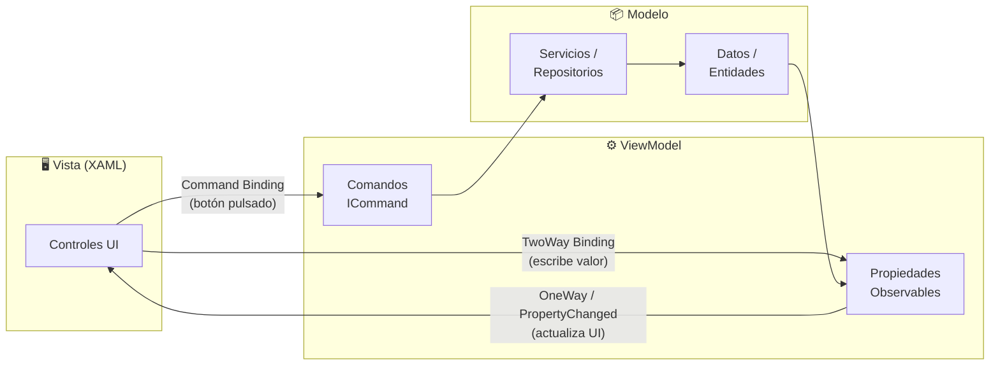

---

### Flujo de Datos Unidireccional en MVVM

El patrón MVVM usa un flujo de datos unidireccional:

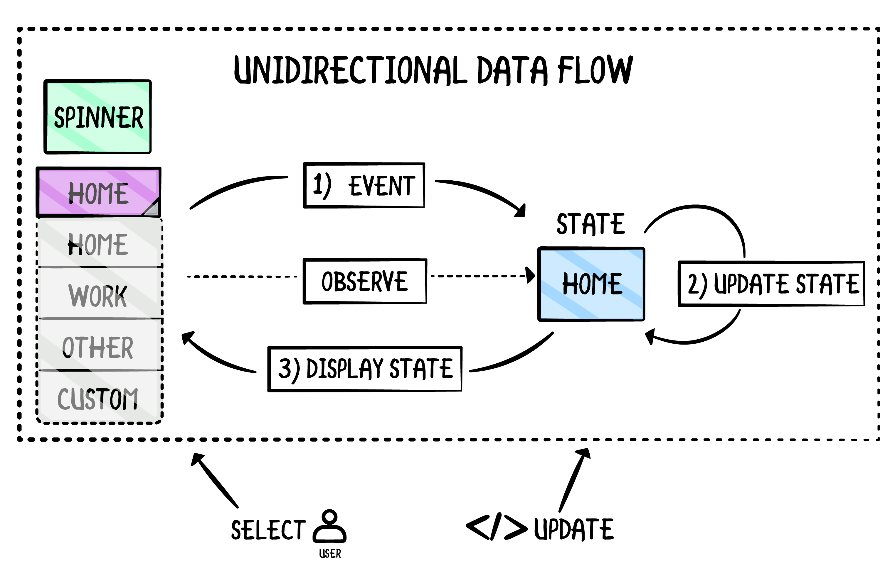

Cuando el usuario interactúa con la UI:

1. **View captura el evento** → **Command**
2. **Command ejecuta** → **ViewModel**
3. **ViewModel modifica** → **Modelo (datos/servicios)**
4. **Modelo notifica** → **ViewModel (PropertyChanged)**
5. **ViewModel actualiza** → **UI (binding)**

Este flujo unidireccional es más fácil de depurar y mantener que el bidireccional.

**Ventajas del flujo unidireccional:**

- ✅ Mayor control sobre el flujo de datos
- ✅ Más fácil de depurar
- ✅ Mejora la testabilidad
- ✅ Separación clara de responsabilidades

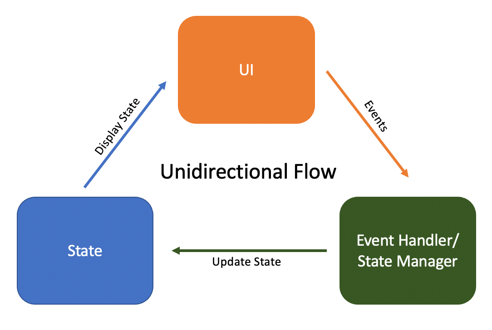

## Resumen: Todos los mecanismos de Binding

### Modos de Binding

| Modo | Flujo | Cuándo usar | Pros | Contras |
|------|-------|-------------|------|---------|
| **OneWay** | Source → Target | Datos de solo lectura | ✅ Seguro, eficiente | ❌ No editable |
| **TwoWay** | Source ↔ Target | Formularios, editables | ✅ Interactivo | ❌ Puede causar bucles |
| **OneTime** | Source → Target (1 vez) | Datos estáticos | ✅ Muy eficiente | ❌ No se actualiza |
| **OneWayToSource** | Target → Source | Controles de solo escritura | ✅ Para casos especiales | ❌ Confuso |

### Mecanismos de Binding

| Mecanismo | Descripción | Cuándo usar |
|-----------|-------------|-------------|
| **UpdateSourceTrigger** | Cuándo se actualiza el Source | PropertyChanged (inmediato), LostFocus (al salir), Explicit (manual) |
| **StringFormat** | Formatear valores | Monedas, fechas, porcentajes |
| **ElementName** | Enlazar controles entre sí | Efectos visuales entre controles |
| **RelativeSource** | Enlazar con padres o mismo | DataTemplates, acceso al Window |
| **MultiBinding** | Combinar varias fuentes | Formateos complejos |
| **FallbackValue** | Valor cuando el binding falla | Valores por defecto elegantes |
| **TargetNullValue** | Valor cuando es null | Placeholders |
| **partial void OnChanged** | Reaccionar al cambio | Propiedades calculadas |
| **ItemsSource** | Bindings de colecciones | ListBox, DataGrid, ComboBox |

### Mecanismos de Validación

| Mecanismo | Descripción | Cuándo usarlo |
|-----------|-------------|---------------|
| **ValidationRules** | Validación simple en el binding | Casos muy simples, sin acceso a otras propiedades |
| **IDataErrorInfo** | Validación con acceso completo al objeto | Validación compleja, acceso a múltiples campos |
| **FormData + IDataErrorInfo** | DTO con validación encapsulada | Patrón recomendado para formularios complejos |
| **OneWay + Eventos** | Validación manual con lógica extra | Validación asíncrona (API externa) |

### Técnicas de Rendering Condicional

| Técnica | Descripción |
|---------|-------------|
| **IValueConverter** | Transforma tipos (bool → Visibility, int → Color) |
| **DataTrigger** | Cambia propiedades según condiciones |
| **BooleanToVisibilityConverter** | Convierte bool a Visibility |

### Herramientas

| Herramienta | Descripción |
|-------------|-------------|
| **CommunityToolkit.Mvvm** | Simplifica MVVM con atributos |
| **ObservableProperty** | Notifica cambios automáticamente |
| **RelayCommand** | Comandos sin boilerplate |
| **partial void OnChanged** | Reaccionar a cambios |

> 📝 **Nota del Profesor**: El data binding es el SUPERPOWER de WPF. Si dominas binding + converters + actualización reactiva, puedes hacer interfaces sin apenas código. USA CommunityToolkit.Mvvm para simplificar. La diferencia entre manual y con Toolkit es enorme: de ~15 líneas por propiedad a 2 líneas.

> 💡 **Tip del Examinador**: Pregunta frecuente: "¿Qué es INotifyPropertyChanged y para qué sirve?"答: Es una interfaz que permite que la UI se entere cuando una propiedad del ViewModel cambia. Se usa en el setter de la propiedad para llamar a PropertyChanged. También pueden preguntar sobre la diferencia entre OneWay y TwoWay: OneWay solo muestra datos (la UI no puede cambiar el valor), TwoWay permite edición y sincroniza de vuelta al ViewModel.

---
```
