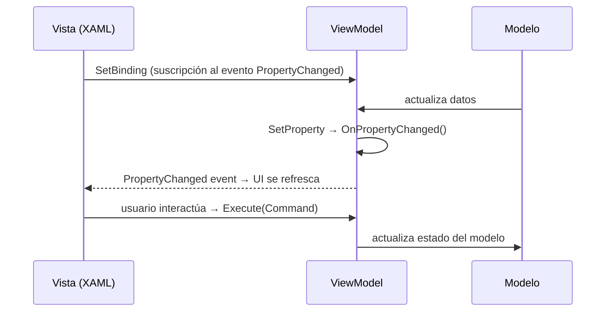
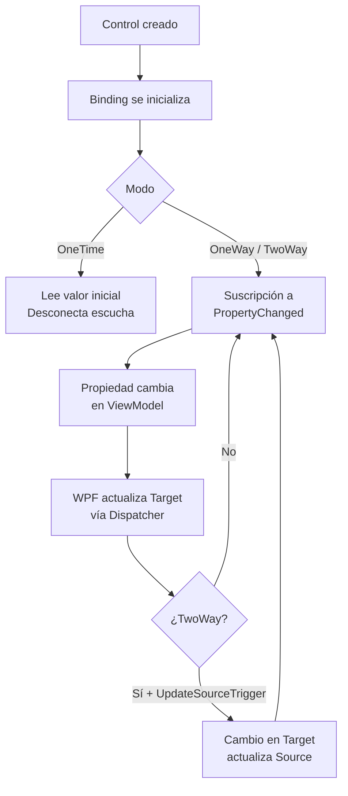
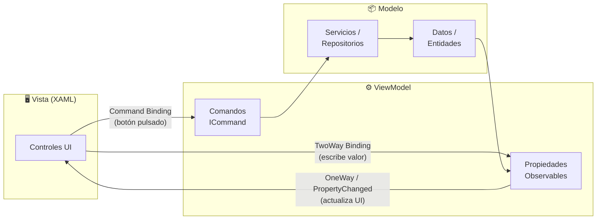

# 09 - WPF MVVM: Bindings y Reactividad

> **Fusión de contenidos:** `05-wpf-reactividad` + `08-wpf-mvvm-bindings`  
> Módulo de Programación · 1º DAW · Curso 2025-2026

---

## A. MVVM TRADICIONAL (sin librerías)

### A.1 Implementación completa de INotifyPropertyChanged

```csharp
using System.ComponentModel;
using System.Runtime.CompilerServices;

public class ModeloBase : INotifyPropertyChanged
{
    public event PropertyChangedEventHandler? PropertyChanged;

    protected void OnPropertyChanged([CallerMemberName] string? prop = null)
        => PropertyChanged?.Invoke(this, new PropertyChangedEventArgs(prop));

    protected bool SetProperty<T>(ref T field, T value,
        [CallerMemberName] string? prop = null)
    {
        if (EqualityComparer<T>.Default.Equals(field, value)) return false;
        field = value;
        OnPropertyChanged(prop);
        return true;
    }
}
```

> **`[CallerMemberName]`** → el compilador inyecta automáticamente el nombre de la propiedad que llama al método; no hay que escribirlo a mano.

---

### A.2 Propiedad observable

```csharp
public class Persona : ModeloBase
{
    private string _nombre = "";
    private int _edad;

    public string Nombre
    {
        get => _nombre;
        set => SetProperty(ref _nombre, value);   // notifica si cambia
    }

    public int Edad
    {
        get => _edad;
        set => SetProperty(ref _edad, value);
    }

    // Propiedad calculada: se notifica manualmente desde las dependencias
    public string NombreConEdad => $"{Nombre} ({Edad} años)";
}
```

---

### A.3 ICommand: RelayCommand básico

```csharp
using System.Windows.Input;

public class RelayCommand : ICommand
{
    private readonly Action<object?> _execute;
    private readonly Func<object?, bool>? _canExecute;

    public RelayCommand(Action<object?> execute, Func<object?, bool>? canExecute = null)
    {
        _execute    = execute;
        _canExecute = canExecute;
    }

    public event EventHandler? CanExecuteChanged
    {
        add    => CommandManager.RequerySuggested += value;
        remove => CommandManager.RequerySuggested -= value;
    }

    public bool CanExecute(object? parameter) => _canExecute?.Invoke(parameter) ?? true;
    public void Execute(object? parameter)    => _execute(parameter);
}
```

**Uso en un ViewModel manual:**

```csharp
public class PersonaViewModel : ModeloBase
{
    private string _nombre = "";
    public string Nombre { get => _nombre; set => SetProperty(ref _nombre, value); }

    public ICommand GuardarCommand { get; }

    public PersonaViewModel()
    {
        GuardarCommand = new RelayCommand(
            execute:    _ => Guardar(),
            canExecute: _ => !string.IsNullOrWhiteSpace(Nombre));
    }

    private void Guardar() { /* lógica de guardado */ }
}
```

---

### A.4 Diagrama: patrón Observer en MVVM



---

## B. MVVM CON CommunityToolkit.Mvvm

### B.1 Instalación NuGet

```bash
dotnet add package CommunityToolkit.Mvvm
```

---

### B.2 Comparación: ANTES (manual) vs. DESPUÉS (CommunityToolkit)

| | **ANTES — INotifyPropertyChanged manual** | **DESPUÉS — CommunityToolkit** |
|---|---|---|
| **Boilerplate** | ~15 líneas por propiedad | 2 líneas por propiedad |
| **Campo privado** | Obligatorio, declarado a mano | Obligatorio, nombrado `_camelCase` |
| **Getter/Setter** | Escritos a mano con `SetProperty` | Generados por el compilador |
| **Notificación** | Manual con `OnPropertyChanged()` | Automática vía source generator |
| **Comandos** | Clase `RelayCommand` propia | Atributo `[RelayCommand]` |
| **Errores** | Fácil olvidar notificar | Imposible olvidar (automatizado) |

**ANTES:**
```csharp
private string _nombre = "";
public string Nombre
{
    get => _nombre;
    set { if (_nombre != value) { _nombre = value; OnPropertyChanged(); } }
}
```

**DESPUÉS:**
```csharp
[ObservableProperty]
private string _nombre = "";
// → genera automáticamente la propiedad pública `Nombre`
```

---

### B.3 `[ObservableProperty]`

```csharp
using CommunityToolkit.Mvvm.ComponentModel;

public partial class PersonaViewModel : ObservableObject
{
    [ObservableProperty]
    private string _nombre = "";

    [ObservableProperty]
    private int _edad;

    [ObservableProperty]
    private bool _activo = true;
}
```

> La clase **debe ser `partial`**. El source generator crea las propiedades públicas `Nombre`, `Edad` y `Activo` en otra parte del archivo parcial.

---

### B.4 `[RelayCommand]` — sincrónico

```csharp
public partial class TareasViewModel : ObservableObject
{
    [ObservableProperty]
    private string _nuevaTarea = "";

    [RelayCommand]
    private void AgregarTarea()
    {
        if (!string.IsNullOrWhiteSpace(NuevaTarea))
            Tareas.Add(NuevaTarea);
        NuevaTarea = "";
    }
}
```

> Genera `AgregarTareaCommand` de tipo `IRelayCommand`.

---

### B.5 `[RelayCommand]` — asincrónico

```csharp
[RelayCommand]
private async Task CargarDatosAsync()
{
    IsLoading = true;
    try
    {
        Datos = await _servicio.ObtenerDatosAsync();
    }
    finally
    {
        IsLoading = false;
    }
}
```

> Genera `CargarDatosCommand` de tipo `IAsyncRelayCommand`.  
> Mientras se ejecuta, `CargarDatosCommand.IsRunning` es `true` (útil para mostrar spinners).

---

### B.6 `[NotifyCanExecuteChangedFor]`

```csharp
public partial class LoginViewModel : ObservableObject
{
    [ObservableProperty]
    [NotifyCanExecuteChangedFor(nameof(LoginCommand))]
    private string _usuario = "";

    [ObservableProperty]
    [NotifyCanExecuteChangedFor(nameof(LoginCommand))]
    private string _contrasena = "";

    private bool PuedeHacerLogin()
        => !string.IsNullOrWhiteSpace(Usuario) && !string.IsNullOrWhiteSpace(Contrasena);

    [RelayCommand(CanExecute = nameof(PuedeHacerLogin))]
    private void Login() { /* autenticar */ }
}
```

> Cada vez que `Usuario` o `Contrasena` cambian, se notifica automáticamente a `LoginCommand` para que reevalúe si está habilitado.

---

### B.7 `[NotifyPropertyChangedFor]`

```csharp
public partial class Persona : ObservableObject
{
    [ObservableProperty]
    [NotifyPropertyChangedFor(nameof(NombreCompleto))]
    private string _nombre = "";

    [ObservableProperty]
    [NotifyPropertyChangedFor(nameof(NombreCompleto))]
    private string _apellido = "";

    // Propiedad calculada: se actualiza cuando Nombre o Apellido cambian
    public string NombreCompleto => $"{Nombre} {Apellido}";
}
```

---

## C. BINDINGS EN XAML

### C.1 OneWay (Origen → Destino)

```xml
<!-- La UI se actualiza cuando cambia la propiedad; el usuario no puede editar -->
<TextBlock Text="{Binding FechaCreacion, Mode=OneWay}" />
<TextBlock Text="{Binding TotalCompra,   Mode=OneWay}" />
```

### C.2 TwoWay (Origen ↔ Destino)

```xml
<!-- Los cambios en el TextBox actualizan la propiedad Y viceversa -->
<TextBox     Text="{Binding Nombre, Mode=TwoWay}" />
<CheckBox IsChecked="{Binding Activo, Mode=TwoWay}" />
```

### C.3 OneTime (solo lectura inicial)

```xml
<!-- Se lee una sola vez al crear el control; no reacciona a cambios posteriores -->
<TextBlock Text="{Binding IdUsuario, Mode=OneTime}" />
```

### C.4 Con `UpdateSourceTrigger`

```xml
<!-- Por defecto (LostFocus): actualiza al perder el foco -->
<TextBox Text="{Binding Email}" />

<!-- PropertyChanged: actualiza con cada pulsación de tecla -->
<TextBox Text="{Binding Busqueda, UpdateSourceTrigger=PropertyChanged}" />

<!-- Explicit: solo actualiza al llamar BindingExpression.UpdateSource() -->
<TextBox x:Name="txtNombre"
         Text="{Binding Nombre, UpdateSourceTrigger=Explicit}" />
```

### C.5 Tabla de modos de binding

| Modo | Flujo | Cuándo usar | Rendimiento |
|------|-------|-------------|-------------|
| `OneWay` | Source → Target | Datos de solo lectura | ⚡⚡⚡ Mejor |
| `TwoWay` | Source ↔ Target | Campos editables | ⚡⚡ Media |
| `OneTime` | Source → Target (1 vez) | Datos inmutables | ⚡⚡⚡ Mejor |
| `OneWayToSource` | Target → Source | Controles de entrada pura | ⚡⚡ Media |

### C.6 Diagrama: ciclo de vida de un binding



---

## D. IValueConverter

### D.1 Implementación básica

```csharp
using System.Globalization;
using System.Windows.Data;

public class NumeroAColorConverter : IValueConverter
{
    public object Convert(object value, Type targetType, object parameter, CultureInfo culture)
    {
        if (value is int n)
            return n < 0 ? Brushes.Red : n == 0 ? Brushes.Gray : Brushes.Green;
        return Brushes.Black;
    }

    public object ConvertBack(object value, Type targetType, object parameter, CultureInfo culture)
        => throw new NotImplementedException();
}
```

### D.2 BooleanToVisibilityConverter

```csharp
public class BoolToVisibilityConverter : IValueConverter
{
    public object Convert(object value, Type targetType, object parameter, CultureInfo culture)
    {
        bool esVisible = value is bool b && b;
        // ConverterParameter="Inverse" invierte la lógica
        if (parameter is string p && p == "Inverse") esVisible = !esVisible;
        return esVisible ? Visibility.Visible : Visibility.Collapsed;
    }

    public object ConvertBack(object value, Type targetType, object parameter, CultureInfo culture)
        => value is Visibility v && v == Visibility.Visible;
}
```

### D.3 Registro en recursos

```xml
<Window xmlns:conv="clr-namespace:MiApp.Converters">
    <Window.Resources>
        <conv:BoolToVisibilityConverter x:Key="BoolToVisibility" />
        <conv:NumeroAColorConverter     x:Key="NumeroAColor"     />
    </Window.Resources>
    <!-- ... -->
</Window>
```

### D.4 Uso en binding

```xml
<!-- Visibilidad condicional -->
<TextBlock Text="¡Usuario activo!"
           Visibility="{Binding Activo,
                        Converter={StaticResource BoolToVisibility}}" />

<!-- Color dinámico -->
<TextBlock Text="{Binding Saldo}"
           Foreground="{Binding Saldo,
                        Converter={StaticResource NumeroAColor}}" />

<!-- Visibilidad inversa (parámetro) -->
<TextBlock Text="Usuario inactivo"
           Visibility="{Binding Activo,
                        Converter={StaticResource BoolToVisibility},
                        ConverterParameter=Inverse}" />
```

---

## E. ValidationRules

### E.1 ValidationRule personalizada

```csharp
using System.Globalization;
using System.Windows.Controls;

public class EmailValidationRule : ValidationRule
{
    public override ValidationResult Validate(object value, CultureInfo cultureInfo)
    {
        var texto = value?.ToString() ?? "";
        if (string.IsNullOrWhiteSpace(texto))
            return new ValidationResult(false, "El email no puede estar vacío.");
        if (!texto.Contains('@'))
            return new ValidationResult(false, "El email debe contener '@'.");
        return ValidationResult.ValidResult;
    }
}
```

### E.2 Uso en binding

```xml
<TextBox>
    <TextBox.Text>
        <Binding Path="Email" UpdateSourceTrigger="PropertyChanged">
            <Binding.ValidationRules>
                <local:EmailValidationRule />
            </Binding.ValidationRules>
        </Binding>
    </TextBox.Text>
</TextBox>
```

> WPF muestra automáticamente el borde rojo en el control cuando la regla devuelve un error.  
> Con `<Validation.ErrorTemplate>` puedes personalizar ese indicador visual.

### E.3 IDataErrorInfo

```csharp
public class PersonaViewModel : ModeloBase, IDataErrorInfo
{
    public string this[string columnName] => columnName switch
    {
        nameof(Nombre) when string.IsNullOrWhiteSpace(Nombre)
            => "El nombre es obligatorio.",
        nameof(Email) when !Email.Contains('@')
            => "El email no es válido.",
        _ => string.Empty
    };

    public string Error => string.Empty; // no se usa en WPF normalmente
}
```

```xml
<!-- Activar validación vía IDataErrorInfo -->
<TextBox Text="{Binding Nombre, ValidatesOnDataErrors=True,
                UpdateSourceTrigger=PropertyChanged}" />
```

---

## F. TABLA COMPARATIVA

| Aspecto | MVVM Manual | CommunityToolkit.Mvvm |
|---------|-------------|----------------------|
| **Líneas por propiedad** | ~15 líneas | ~2 líneas |
| **Boilerplate** | Alto | Mínimo |
| **Comandos** | Clase `RelayCommand` propia | `[RelayCommand]` atributo |
| **Propensión a errores** | Alta (olvidar notificar) | Muy baja (automatizado) |
| **Legibilidad** | Baja (mucho ruido visual) | Alta (declarativo) |
| **Comandos async** | Manual (`Task` + flags) | `[RelayCommand]` + `IsRunning` |
| **Propiedades dependientes** | `OnPropertyChanged(nameof(X))` manual | `[NotifyPropertyChangedFor]` |
| **CanExecute dinámico** | `CommandManager.RequerySuggested` | `[NotifyCanExecuteChangedFor]` |
| **Rendimiento en runtime** | Similar | Similar |
| **Soporte IDE** | Básico | Excelente (IntelliSense completo) |
| **Curva de aprendizaje** | Moderada | Baja (una vez entendidos los atributos) |
| **Requiere `partial class`** | No | Sí |
| **Dependencia externa** | Ninguna | `CommunityToolkit.Mvvm` NuGet |

### F.1 Diagrama: flujo de datos en MVVM



---

## Referencias

- [INotifyPropertyChanged — Microsoft Docs](https://learn.microsoft.com/dotnet/api/system.componentmodel.inotifypropertychanged)
- [CommunityToolkit.Mvvm Documentation](https://learn.microsoft.com/dotnet/communitytoolkit/mvvm/)
- [Data Binding Overview — WPF](https://learn.microsoft.com/dotnet/desktop/wpf/data/)
- [Binding Modes](https://learn.microsoft.com/dotnet/desktop/wpf/data/binding-declarations-overview)
- [IValueConverter](https://learn.microsoft.com/dotnet/api/system.windows.data.ivalueconverter)
- [ValidationRule](https://learn.microsoft.com/dotnet/api/system.windows.controls.validationrule)

---

*Documento elaborado para el módulo de Programación del ciclo formativo 1º DAW · Curso 2025-2026*
