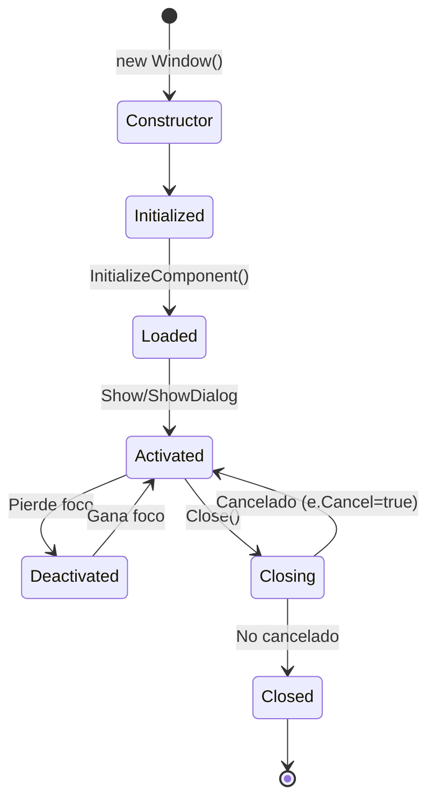
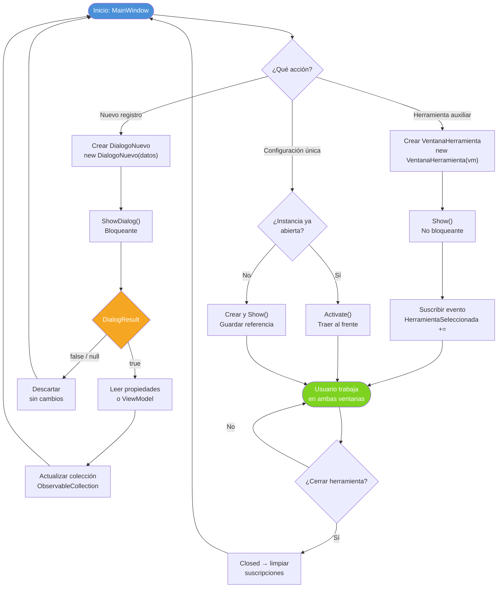

# 10 - WPF: Navegación Avanzada entre Ventanas

## 1. Introducción a la Gestión de Ventanas

En aplicaciones WPF, la gestión de múltiples ventanas y el paso de datos entre ellas es fundamental para crear interfaces complejas y user-friendly.

### 1.1 Tipos de Ventanas

| Tipo | Descripción | Uso |
|------|-------------|-----|
| **Modal** | Bloquea la interacción con otras ventanas | Diálogos, confirmaciones |
| **Modalless** | Permite interacción con otras ventanas | Ventanas secundarias, herramientas |
| **Main Window** | Ventana principal de la aplicación | Punto de entrada |

---

## 2. Show() vs ShowDialog()

### 2.1 Show(): Ventana No Modal

```csharp
// Ventana no modal: no bloquea la ventana padre
var ventanaSecundaria = new VentanaSecundaria();
ventanaSecundaria.Show();

// El código continúa inmediatamente
MessageBox.Show("Esta línea se ejecuta inmediatamente");
```

**Características:**

✅ No bloquea la ventana padre  
✅ El usuario puede interactuar con ambas ventanas  
✅ El código continúa inmediatamente  
❌ Difícil obtener resultado de la ventana  

### 2.2 ShowDialog(): Ventana Modal

```csharp
// Ventana modal: bloquea hasta que se cierre
var dialogo = new DialogoConfirmacion();
bool? resultado = dialogo.ShowDialog();

if (resultado == true)
{
    MessageBox.Show("Usuario confirmó");
}
else
{
    MessageBox.Show("Usuario canceló");
}
```

**Características:**

✅ Bloquea la ventana padre  
✅ Fácil obtener resultado (true/false/null)  
✅ Ideal para decisiones del usuario  
❌ No se puede interactuar con la ventana padre  

### 2.3 Tabla Comparativa

| Aspecto | Show() | ShowDialog() |
|---------|--------|--------------|
| **Bloqueo** | No bloquea | Bloquea ventana padre |
| **Valor de retorno** | void | bool? (DialogResult) |
| **Interacción** | Libre entre ventanas | Solo la modal |
| **Uso típico** | Herramientas, paletas | Diálogos, confirmaciones |

---

## 3. DialogResult: Retornar Resultados

### 3.1 Establecer DialogResult

```csharp
public partial class DialogoConfirmacion : Window
{
    public DialogoConfirmacion()
    {
        InitializeComponent();
    }
    
    private void BtnAceptar_Click(object sender, RoutedEventArgs e)
    {
        // Establecer resultado y cerrar
        DialogResult = true;
    }
    
    private void BtnCancelar_Click(object sender, RoutedEventArgs e)
    {
        // Establecer resultado y cerrar
        DialogResult = false;
    }
}
```

**XAML:**

```xml
<Window x:Class="DialogoConfirmacion"
        Title="Confirmación" Height="150" Width="300"
        WindowStartupLocation="CenterOwner">
    <StackPanel Margin="20">
        <TextBlock Text="¿Deseas continuar?" 
                   FontSize="14" 
                   Margin="0,0,0,20" />
        
        <StackPanel Orientation="Horizontal" HorizontalAlignment="Right">
            <Button Content="Aceptar" 
                    Click="BtnAceptar_Click" 
                    Width="80" Height="30" 
                    Margin="0,0,10,0" />
            
            <Button Content="Cancelar" 
                    Click="BtnCancelar_Click" 
                    Width="80" Height="30" />
        </StackPanel>
    </StackPanel>
</Window>
```

### 3.2 Uso del Diálogo

```csharp
private void MostrarDialogo()
{
    var dialogo = new DialogoConfirmacion();
    dialogo.Owner = this; // Establecer ventana padre
    
    bool? resultado = dialogo.ShowDialog();
    
    if (resultado == true)
    {
        // Usuario aceptó
        RealizarAccion();
    }
    else if (resultado == false)
    {
        // Usuario canceló
        CancelarAccion();
    }
    // null si cerró con X (sin establecer DialogResult)
}
```

---

## 4. Pasar Datos a Ventanas

### 4.1 Mediante Constructor

```csharp
// Ventana receptora
public partial class VentanaDetalles : Window
{
    private readonly Producto _producto;
    
    public VentanaDetalles(Producto producto)
    {
        InitializeComponent();
        _producto = producto;
        
        // Mostrar datos
        txtNombre.Text = producto.Nombre;
        txtPrecio.Text = producto.Precio.ToString("C");
    }
}

// Ventana llamadora
private void MostrarDetalles(Producto producto)
{
    var ventana = new VentanaDetalles(producto);
    ventana.ShowDialog();
}
```

### 4.2 Mediante Propiedades Públicas

```csharp
// Ventana receptora
public partial class VentanaEdicion : Window
{
    public string Titulo { get; set; } = "";
    public string Descripcion { get; set; } = "";
    
    public VentanaEdicion()
    {
        InitializeComponent();
        Loaded += (s, e) =>
        {
            txtTitulo.Text = Titulo;
            txtDescripcion.Text = Descripcion;
        };
    }
}

// Ventana llamadora
private void AbrirEdicion()
{
    var ventana = new VentanaEdicion
    {
        Titulo = "Mi Título",
        Descripcion = "Mi Descripción"
    };
    
    ventana.ShowDialog();
}
```

### 4.3 Mediante DataContext (Recomendado MVVM)

```csharp
// ViewModel
public class ProductoViewModel
{
    public string Nombre { get; set; } = "";
    public decimal Precio { get; set; }
}

// Ventana
public partial class VentanaProducto : Window
{
    public VentanaProducto()
    {
        InitializeComponent();
    }
}

// Uso
private void MostrarProducto(ProductoViewModel viewModel)
{
    var ventana = new VentanaProducto
    {
        DataContext = viewModel
    };
    
    ventana.ShowDialog();
}
```

**XAML con bindings:**

```xml
<StackPanel>
    <TextBlock Text="{Binding Nombre}" FontSize="20" />
    <TextBlock Text="{Binding Precio, StringFormat=C}" FontSize="16" />
</StackPanel>
```

---

## 5. Retornar Datos desde Ventanas

### 5.1 Mediante Propiedades Públicas

```csharp
// Ventana de entrada de datos
public partial class DialogoNuevoUsuario : Window
{
    public string Nombre => txtNombre.Text;
    public string Email => txtEmail.Text;
    public int Edad => (int)sliderEdad.Value;
    
    public DialogoNuevoUsuario()
    {
        InitializeComponent();
    }
    
    private void BtnGuardar_Click(object sender, RoutedEventArgs e)
    {
        // Validar
        if (string.IsNullOrWhiteSpace(txtNombre.Text))
        {
            MessageBox.Show("El nombre es obligatorio");
            return;
        }
        
        DialogResult = true;
    }
    
    private void BtnCancelar_Click(object sender, RoutedEventArgs e)
    {
        DialogResult = false;
    }
}

// Uso
private void AgregarNuevoUsuario()
{
    var dialogo = new DialogoNuevoUsuario();
    
    if (dialogo.ShowDialog() == true)
    {
        // Acceder a los datos
        var usuario = new Usuario
        {
            Nombre = dialogo.Nombre,
            Email = dialogo.Email,
            Edad = dialogo.Edad
        };
        
        _usuarios.Add(usuario);
    }
}
```

### 5.2 Mediante Eventos

```csharp
// Ventana que emite evento
public partial class DialogoBusqueda : Window
{
    public event EventHandler<string>? BusquedaRealizada;
    
    public DialogoBusqueda()
    {
        InitializeComponent();
    }
    
    private void BtnBuscar_Click(object sender, RoutedEventArgs e)
    {
        string termino = txtBusqueda.Text;
        BusquedaRealizada?.Invoke(this, termino);
        Close();
    }
}

// Uso
private void AbrirDialogoBusqueda()
{
    var dialogo = new DialogoBusqueda();
    
    dialogo.BusquedaRealizada += (s, termino) =>
    {
        RealizarBusqueda(termino);
    };
    
    dialogo.Show();
}
```

### 5.3 Mediante Callback

```csharp
// Ventana con callback
public partial class DialogoSeleccion : Window
{
    private readonly Action<Producto> _callback;
    
    public DialogoSeleccion(Action<Producto> callback)
    {
        InitializeComponent();
        _callback = callback;
    }
    
    private void BtnSeleccionar_Click(object sender, RoutedEventArgs e)
    {
        if (lstProductos.SelectedItem is Producto producto)
        {
            _callback(producto);
            Close();
        }
    }
}

// Uso
private void SeleccionarProducto()
{
    var dialogo = new DialogoSeleccion(producto =>
    {
        MessageBox.Show($"Seleccionado: {producto.Nombre}");
        // Hacer algo con el producto
    });
    
    dialogo.ShowDialog();
}
```

---

## 6. Ciclo de Vida de una Ventana

### 6.1 Eventos Principales

```csharp
public partial class MiVentana : Window
{
    public MiVentana()
    {
        InitializeComponent();
        
        // Antes de mostrar la ventana
        Initialized += (s, e) =>
        {
            Console.WriteLine("1. Initialized");
        };
        
        // Después de cargar el XAML
        Loaded += (s, e) =>
        {
            Console.WriteLine("2. Loaded");
        };
        
        // Al activar la ventana
        Activated += (s, e) =>
        {
            Console.WriteLine("3. Activated");
        };
        
        // Al desactivar (otra ventana toma el foco)
        Deactivated += (s, e) =>
        {
            Console.WriteLine("4. Deactivated");
        };
        
        // Antes de cerrar (cancelable)
        Closing += (s, e) =>
        {
            Console.WriteLine("5. Closing");
            
            var resultado = MessageBox.Show(
                "¿Seguro que quieres cerrar?",
                "Confirmar",
                MessageBoxButton.YesNo
            );
            
            if (resultado == MessageBoxResult.No)
            {
                e.Cancel = true; // Cancelar el cierre
            }
        };
        
        // Después de cerrar (no cancelable)
        Closed += (s, e) =>
        {
            Console.WriteLine("6. Closed");
        };
    }
}
```

### 6.2 Diagrama de Ciclo de Vida



---

## 7. Propiedades de Ventana

### 7.1 Propiedades Básicas

```xml
<Window x:Class="MiApp.MainWindow"
        Title="Mi Aplicación" 
        Height="450" Width="800"
        MinHeight="300" MinWidth="600"
        MaxHeight="1000" MaxWidth="1200"
        WindowState="Normal"
        WindowStartupLocation="CenterScreen"
        ResizeMode="CanResize"
        ShowInTaskbar="True"
        Topmost="False"
        Icon="/Images/icon.ico">
    <!-- Contenido -->
</Window>
```

| Propiedad | Valores | Descripción |
|-----------|---------|-------------|
| `WindowState` | Normal, Minimized, Maximized | Estado inicial |
| `WindowStartupLocation` | Manual, CenterScreen, CenterOwner | Posición inicial |
| `ResizeMode` | NoResize, CanMinimize, CanResize, CanResizeWithGrip | Modo de redimensionado |
| `ShowInTaskbar` | True, False | Mostrar en barra de tareas |
| `Topmost` | True, False | Siempre encima |

### 7.2 WindowStartupLocation

```csharp
// Manual: posición específica
ventana.WindowStartupLocation = WindowStartupLocation.Manual;
ventana.Left = 100;
ventana.Top = 100;

// Centro de la pantalla
ventana.WindowStartupLocation = WindowStartupLocation.CenterScreen;

// Centro de la ventana padre
ventana.Owner = this;
ventana.WindowStartupLocation = WindowStartupLocation.CenterOwner;
```

### 7.3 ResizeMode

```xml
<!-- No se puede redimensionar -->
<Window ResizeMode="NoResize" />

<!-- Solo minimizar -->
<Window ResizeMode="CanMinimize" />

<!-- Redimensionar sin grip -->
<Window ResizeMode="CanResize" />

<!-- Redimensionar con grip visible -->
<Window ResizeMode="CanResizeWithGrip" />
```

---

## 8. Gestión de Múltiples Ventanas

### 8.1 Application.Windows Collection

```csharp
// Acceder a todas las ventanas abiertas
foreach (Window ventana in Application.Current.Windows)
{
    Console.WriteLine($"Ventana: {ventana.Title}");
}

// Cerrar todas las ventanas
foreach (Window ventana in Application.Current.Windows)
{
    if (ventana != Application.Current.MainWindow)
    {
        ventana.Close();
    }
}
```

### 8.2 Owner y Owned Windows

```csharp
// Establecer ventana padre
var ventanaHija = new VentanaHija();
ventanaHija.Owner = this;
ventanaHija.Show();

// Acceder a ventanas hijas
foreach (Window hija in this.OwnedWindows)
{
    hija.Close();
}
```

**Beneficios de Owner:**

✅ La ventana hija se cierra automáticamente si se cierra la padre  
✅ WindowStartupLocation="CenterOwner" funciona  
✅ La ventana hija siempre está por encima de la padre  

### 8.3 Singleton para Ventanas Únicas

```csharp
public class GestorVentanaConfig
{
    private static VentanaConfiguracion? _instancia;
    
    public static void Mostrar()
    {
        if (_instancia == null || !_instancia.IsVisible)
        {
            _instancia = new VentanaConfiguracion();
            _instancia.Show();
        }
        else
        {
            // Traer al frente si ya está abierta
            _instancia.Activate();
            _instancia.WindowState = WindowState.Normal;
        }
    }
}

// Uso
GestorVentanaConfig.Mostrar(); // Solo se abre una instancia
```

---

## 9. Ejemplo Completo: Aplicación Multi-Ventana

### 9.1 Ventana Principal

```xml
<!-- MainWindow.xaml -->
<Window x:Class="MultiVentana.MainWindow"
        xmlns="http://schemas.microsoft.com/winfx/2006/xaml/presentation"
        xmlns:x="http://schemas.microsoft.com/winfx/2006/xaml"
        Title="Aplicación Principal" Height="400" Width="600"
        WindowStartupLocation="CenterScreen">
    
    <Grid>
        <Grid.RowDefinitions>
            <RowDefinition Height="Auto" />
            <RowDefinition Height="*" />
            <RowDefinition Height="Auto" />
        </Grid.RowDefinitions>
        
        <!-- Barra de herramientas -->
        <ToolBar Grid.Row="0">
            <Button Content="Nuevo Usuario" Click="BtnNuevoUsuario_Click" />
            <Separator />
            <Button Content="Configuración" Click="BtnConfiguracion_Click" />
            <Separator />
            <Button Content="Acerca de" Click="BtnAcercaDe_Click" />
        </ToolBar>
        
        <!-- Lista de usuarios -->
        <ListBox Grid.Row="1" x:Name="lstUsuarios" Margin="10">
            <ListBox.ItemTemplate>
                <DataTemplate>
                    <StackPanel>
                        <TextBlock Text="{Binding Nombre}" FontWeight="Bold" />
                        <TextBlock Text="{Binding Email}" FontSize="10" Foreground="Gray" />
                    </StackPanel>
                </DataTemplate>
            </ListBox.ItemTemplate>
        </ListBox>
        
        <!-- Barra de estado -->
        <StatusBar Grid.Row="2">
            <StatusBarItem>
                <TextBlock x:Name="txtEstado" Text="Listo" />
            </StatusBarItem>
        </StatusBar>
    </Grid>
</Window>
```

```csharp
// MainWindow.xaml.cs
namespace MultiVentana;

public partial class MainWindow : Window
{
    private readonly ObservableCollection<Usuario> _usuarios = new();
    
    public MainWindow()
    {
        InitializeComponent();
        lstUsuarios.ItemsSource = _usuarios;
    }
    
    private void BtnNuevoUsuario_Click(object sender, RoutedEventArgs e)
    {
        var dialogo = new DialogoNuevoUsuario
        {
            Owner = this
        };
        
        if (dialogo.ShowDialog() == true)
        {
            var usuario = new Usuario
            {
                Nombre = dialogo.Nombre,
                Email = dialogo.Email,
                Edad = dialogo.Edad
            };
            
            _usuarios.Add(usuario);
            txtEstado.Text = $"Usuario '{usuario.Nombre}' agregado";
        }
    }
    
    private void BtnConfiguracion_Click(object sender, RoutedEventArgs e)
    {
        var ventana = new VentanaConfiguracion
        {
            Owner = this
        };
        
        ventana.Show(); // No modal
    }
    
    private void BtnAcercaDe_Click(object sender, RoutedEventArgs e)
    {
        var dialogo = new DialogoAcercaDe
        {
            Owner = this
        };
        
        dialogo.ShowDialog();
    }
    
    protected override void OnClosing(CancelEventArgs e)
    {
        var resultado = MessageBox.Show(
            "¿Seguro que quieres salir?",
            "Confirmar",
            MessageBoxButton.YesNo,
            MessageBoxImage.Question
        );
        
        if (resultado == MessageBoxResult.No)
        {
            e.Cancel = true;
        }
        
        base.OnClosing(e);
    }
}
```

### 9.2 Diálogo de Nuevo Usuario

```xml
<!-- DialogoNuevoUsuario.xaml -->
<Window x:Class="MultiVentana.DialogoNuevoUsuario"
        xmlns="http://schemas.microsoft.com/winfx/2006/xaml/presentation"
        xmlns:x="http://schemas.microsoft.com/winfx/2006/xaml"
        Title="Nuevo Usuario" Height="300" Width="400"
        WindowStartupLocation="CenterOwner"
        ResizeMode="NoResize">
    
    <Grid Margin="20">
        <Grid.RowDefinitions>
            <RowDefinition Height="Auto" />
            <RowDefinition Height="Auto" />
            <RowDefinition Height="Auto" />
            <RowDefinition Height="*" />
            <RowDefinition Height="Auto" />
        </Grid.RowDefinitions>
        
        <!-- Nombre -->
        <TextBlock Grid.Row="0" Text="Nombre:" />
        <TextBox Grid.Row="0" x:Name="txtNombre" Margin="0,20,0,0" />
        
        <!-- Email -->
        <TextBlock Grid.Row="1" Text="Email:" Margin="0,10,0,0" />
        <TextBox Grid.Row="1" x:Name="txtEmail" Margin="0,30,0,0" />
        
        <!-- Edad -->
        <TextBlock Grid.Row="2" Text="Edad:" Margin="0,10,0,0" />
        <Slider Grid.Row="2" x:Name="sliderEdad" 
                Minimum="18" Maximum="100" Value="25" 
                TickFrequency="1" IsSnapToTickEnabled="True" 
                Margin="0,30,0,0" />
        <TextBlock Grid.Row="2" 
                   Text="{Binding ElementName=sliderEdad, Path=Value, StringFormat='Edad: {0:F0}'}" 
                   HorizontalAlignment="Right" 
                   Margin="0,30,0,0" />
        
        <!-- Botones -->
        <StackPanel Grid.Row="4" Orientation="Horizontal" 
                    HorizontalAlignment="Right" Margin="0,10,0,0">
            <Button Content="Guardar" Click="BtnGuardar_Click" 
                    Width="80" Height="30" Margin="0,0,10,0" />
            <Button Content="Cancelar" Click="BtnCancelar_Click" 
                    Width="80" Height="30" />
        </StackPanel>
    </Grid>
</Window>
```

```csharp
// DialogoNuevoUsuario.xaml.cs
namespace MultiVentana;

public partial class DialogoNuevoUsuario : Window
{
    public string Nombre => txtNombre.Text;
    public string Email => txtEmail.Text;
    public int Edad => (int)sliderEdad.Value;
    
    public DialogoNuevoUsuario()
    {
        InitializeComponent();
        txtNombre.Focus();
    }
    
    private void BtnGuardar_Click(object sender, RoutedEventArgs e)
    {
        if (string.IsNullOrWhiteSpace(txtNombre.Text))
        {
            MessageBox.Show("El nombre es obligatorio", "Error",
                MessageBoxButton.OK, MessageBoxIcon.Warning);
            txtNombre.Focus();
            return;
        }
        
        if (!txtEmail.Text.Contains('@'))
        {
            MessageBox.Show("El email no es válido", "Error",
                MessageBoxButton.OK, MessageBoxIcon.Warning);
            txtEmail.Focus();
            return;
        }
        
        DialogResult = true;
    }
    
    private void BtnCancelar_Click(object sender, RoutedEventArgs e)
    {
        DialogResult = false;
    }
}
```

---

## 10. Tips y Buenas Prácticas

### 10.1 Evitar Memory Leaks

```csharp
// ✅ Bien: cerrar ventanas cuando ya no se necesitan
foreach (Window ventana in Application.Current.Windows)
{
    if (ventana is VentanaSecundaria)
    {
        ventana.Close();
    }
}

// ✅ Bien: desuscribirse de eventos
ventana.Closed += MiHandler;
// ...
ventana.Closed -= MiHandler; // Desuscribir cuando ya no se necesita
```

### 10.2 Usar Owner Correctamente

```csharp
// ✅ Bien
var dialogo = new MiDialogo
{
    Owner = this, // Establece la ventana padre
    WindowStartupLocation = WindowStartupLocation.CenterOwner
};

dialogo.ShowDialog();
```

### 10.3 Validar antes de Cerrar

```csharp
protected override void OnClosing(CancelEventArgs e)
{
    if (HayCambiosSinGuardar())
    {
        var resultado = MessageBox.Show(
            "Hay cambios sin guardar. ¿Deseas guardarlos?",
            "Advertencia",
            MessageBoxButton.YesNoCancel
        );
        
        if (resultado == MessageBoxResult.Yes)
        {
            Guardar();
        }
        else if (resultado == MessageBoxResult.Cancel)
        {
            e.Cancel = true; // Cancelar el cierre
            return;
        }
    }
    
    base.OnClosing(e);
}
```

---

## 11. Resumen

| Concepto | Descripción |
|----------|-------------|
| `Show()` | Ventana no modal (no bloquea) |
| `ShowDialog()` | Ventana modal (bloquea, retorna DialogResult) |
| `DialogResult` | Resultado de un diálogo (true/false/null) |
| `Owner` | Ventana padre de una ventana hija |
| `WindowStartupLocation` | Posición inicial de la ventana |
| `Closing` | Evento antes de cerrar (cancelable) |
| `Closed` | Evento después de cerrar (no cancelable) |

---

## 12. Ejercicios Propuestos

1. **Editor de Texto**: Crea una aplicación con ventana principal que abra múltiples ventanas de edición de documentos.

2. **Gestor de Tareas**: Implementa una app con ventana principal y diálogos modales para añadir/editar tareas.

3. **Configuración Multi-Página**: Crea un diálogo de configuración con múltiples pestañas y validación antes de cerrar.

4. **Selector de Archivos**: Implementa un explorador de archivos con ventana de vista previa no modal.

---

## 13. Navegación Avanzada: Fragmentos de Código

Esta sección amplía los conceptos anteriores con fragmentos prácticos centrados en patrones reales de uso.

---

### 13.1 ShowDialog con Recuperación de Datos

```csharp
// Fragmento: abrir diálogo modal y leer datos devueltos
var dialogo = new DialogoEditarProducto(productoActual);
dialogo.Owner = this;

if (dialogo.ShowDialog() == true)
{
    // Recuperar el objeto modificado que expone la ventana
    Producto actualizado = dialogo.ProductoResultante;
    _repositorio.Actualizar(actualizado);
    RefrescarLista();
}
// Si resultado es false o null, no se hace nada
```

```csharp
// Dentro de DialogoEditarProducto: exponer el resultado
public partial class DialogoEditarProducto : Window
{
    // Propiedad que la ventana llamadora leerá tras ShowDialog
    public Producto ProductoResultante { get; private set; }

    public DialogoEditarProducto(Producto producto)
    {
        InitializeComponent();
        // Rellenar campos con los datos existentes
        txtNombre.Text = producto.Nombre;
        numPrecio.Value = (double)producto.Precio;
        ProductoResultante = producto; // valor por defecto
    }

    private void BtnGuardar_Click(object sender, RoutedEventArgs e)
    {
        // Construir el objeto resultado antes de cerrar
        ProductoResultante = new Producto(txtNombre.Text, (decimal)numPrecio.Value);
        DialogResult = true; // cierra y desbloquea al llamador
    }
}
```

---

### 13.2 Show (No Modal) con Manejo de Eventos

```csharp
// Fragmento: ventana no modal que comunica cambios en tiempo real
var panel = new PanelHerramientas();
panel.Owner = this;

// Suscribirse ANTES de Show para no perder eventos
panel.HerramientaSeleccionada += (s, herramienta) =>
{
    // Se ejecuta cada vez que el usuario elige una herramienta
    _lienzo.HerramientaActual = herramienta;
    txtEstado.Text = $"Herramienta: {herramienta.Nombre}";
};

panel.Show(); // no bloquea; el usuario puede usar ambas ventanas
```

```csharp
// Dentro de PanelHerramientas: disparar el evento
public partial class PanelHerramientas : Window
{
    // Evento genérico con dato de dominio
    public event EventHandler<Herramienta>? HerramientaSeleccionada;

    private void BtnLapiz_Click(object sender, RoutedEventArgs e)
    {
        // Notificar a todos los suscriptores
        HerramientaSeleccionada?.Invoke(this, new Herramienta("Lápiz"));
    }
}
```

---

### 13.3 Paso de Datos mediante Constructor

```csharp
// Fragmento: constructor como contrato explícito de dependencias

// ❌ Mal: constructor sin parámetros obliga a inicialización tardía
var v = new VentanaDetalle();
v.IdCliente = 42; // fácil de olvidar

// ✅ Bien: el constructor exige los datos que necesita
var ventana = new VentanaDetalle(clienteSeleccionado);
ventana.Owner = this;
ventana.ShowDialog();
```

```csharp
// Constructor que valida y almacena el argumento
public partial class VentanaDetalle : Window
{
    private readonly Cliente _cliente;

    public VentanaDetalle(Cliente cliente)
    {
        _cliente = cliente ?? throw new ArgumentNullException(nameof(cliente));
        InitializeComponent(); // siempre después de asignar campos
        DataContext = _cliente; // enlaza la UI directamente al modelo
    }
}
```

---

### 13.4 Paso de Datos mediante Propiedades

```csharp
// Fragmento: propiedades públicas para datos opcionales o configuración

var configurador = new VentanaConfigAvanzada
{
    // Propiedades de configuración inicial (todas opcionales)
    TemaInicial    = Tema.Oscuro,
    IdiomaInicial  = "es-ES",
    MostrarAvanzado = false
};

configurador.Owner = this;

if (configurador.ShowDialog() == true)
{
    // Leer la configuración elegida por el usuario
    AplicarTema(configurador.TemaSeleccionado);
}
```

```csharp
// Ventana que declara propiedades de entrada y salida
public partial class VentanaConfigAvanzada : Window
{
    // Propiedades de entrada (se establecen antes de Show)
    public Tema TemaInicial    { get; set; } = Tema.Claro;
    public string IdiomaInicial { get; set; } = "es-ES";
    public bool MostrarAvanzado { get; set; }

    // Propiedad de salida (se lee después de ShowDialog)
    public Tema TemaSeleccionado { get; private set; }

    private void BtnAplicar_Click(object sender, RoutedEventArgs e)
    {
        TemaSeleccionado = (Tema)cmbTema.SelectedValue;
        DialogResult = true;
    }
}
```

---

### 13.5 Paso de Datos con Eventos y Callbacks

```csharp
// Fragmento: callback Action<T> como alternativa ligera a eventos

// Opción A – Evento: desacoplado, varios suscriptores posibles
var selector = new VentanaSelectorColor();
selector.ColorElegido += color => lienzo.ColorPincel = color;
selector.Show();

// Opción B – Callback: más directo para un único consumidor
var selector2 = new VentanaSelectorColor(color =>
{
    lienzo.ColorPincel = color; // se ejecuta al confirmar elección
});
selector2.Show();
```

```csharp
// Implementación que soporta ambas estrategias
public partial class VentanaSelectorColor : Window
{
    public event Action<Color>? ColorElegido;     // para suscriptores externos
    private readonly Action<Color>? _callbackDirecto; // para el patrón callback

    public VentanaSelectorColor(Action<Color>? callback = null)
    {
        InitializeComponent();
        _callbackDirecto = callback;
    }

    private void BtnConfirmar_Click(object sender, RoutedEventArgs e)
    {
        var color = colorPicker.SelectedColor ?? Colors.Black;
        ColorElegido?.Invoke(color);       // notifica vía evento
        _callbackDirecto?.Invoke(color);   // notifica vía callback
        Close();
    }
}
```

---

### 13.6 ViewModel Compartido entre Ventanas

```csharp
// Fragmento: el mismo ViewModel se inyecta en dos ventanas
// para que ambas reflejen y modifiquen el mismo estado

// En la ventana principal
var vm = new PedidoViewModel();  // único origen de verdad
DataContext = vm;

// Abrir ventana secundaria con el mismo vm
var lineas = new VentanaLineasPedido(vm);
lineas.Owner = this;
lineas.Show(); // cambios en vm se propagan a ambas ventanas vía INotifyPropertyChanged
```

```csharp
// ViewModel compartido con INotifyPropertyChanged
public class PedidoViewModel : INotifyPropertyChanged
{
    public event PropertyChangedEventHandler? PropertyChanged;

    private ObservableCollection<LineaPedido> _lineas = new();
    public ObservableCollection<LineaPedido> Lineas => _lineas;

    private decimal _total;
    public decimal Total
    {
        get => _total;
        set { _total = value; PropertyChanged?.Invoke(this, new(nameof(Total))); }
    }

    public void RecalcularTotal() =>
        Total = _lineas.Sum(l => l.Subtotal); // actualiza y notifica automáticamente
}
```

```csharp
// Segunda ventana: recibe el vm y lo usa como DataContext
public partial class VentanaLineasPedido : Window
{
    public VentanaLineasPedido(PedidoViewModel vm)
    {
        InitializeComponent();
        DataContext = vm; // misma instancia → UI siempre sincronizada
    }
}
```

---

### 13.7 Patrones de DialogResult

```csharp
// Fragmento: los tres valores posibles de bool? y cuándo aparecen

bool? resultado = dialogo.ShowDialog();

switch (resultado)
{
    case true:
        // Usuario pulsó Aceptar/Guardar → DialogResult = true
        ProcesarDatos(dialogo.Datos);
        break;

    case false:
        // Usuario pulsó Cancelar → DialogResult = false
        MostrarMensaje("Operación cancelada.");
        break;

    case null:
        // Usuario cerró con Alt+F4 o el botón X sin asignar DialogResult
        // Tratar igual que cancelación suele ser la opción más segura
        MostrarMensaje("Ventana cerrada sin confirmar.");
        break;
}
```

```csharp
// Patrón habitual: colapsar null y false en la misma rama
if (dialogo.ShowDialog() == true)
{
    // Solo si confirmó explícitamente
    Guardar(dialogo.Resultado);
}
// null y false no requieren acción → no hace falta else
```

---

### 13.8 Tabla Completa de Propiedades de Window

| Propiedad | Tipo | Valores / Rango | Descripción |
|-----------|------|-----------------|-------------|
| `Title` | `string` | Cualquier texto | Título en la barra de título |
| `Width` / `Height` | `double` | > 0 | Tamaño en píxeles independientes de dispositivo |
| `MinWidth` / `MinHeight` | `double` | ≥ 0 | Tamaño mínimo al redimensionar |
| `MaxWidth` / `MaxHeight` | `double` | ≥ 0 | Tamaño máximo al redimensionar |
| `Left` / `Top` | `double` | Cualquiera | Posición absoluta en pantalla (px) |
| `WindowStyle` | `WindowStyle` | None, SingleBorderWindow, ThreeDBorderWindow, ToolWindow | Estilo del cromo de la ventana |
| `ResizeMode` | `ResizeMode` | NoResize, CanMinimize, CanResize, CanResizeWithGrip | Capacidad de redimensionado |
| `WindowState` | `WindowState` | Normal, Minimized, Maximized | Estado de visualización |
| `WindowStartupLocation` | `WindowStartupLocation` | Manual, CenterScreen, CenterOwner | Posición al abrirse |
| `Topmost` | `bool` | true / false | Permanece encima de otras ventanas |
| `ShowInTaskbar` | `bool` | true / false | Aparece en la barra de tareas |
| `Owner` | `Window?` | Referencia a ventana | Ventana propietaria (padre) |
| `Icon` | `ImageSource` | Ruta a imagen | Icono en título y barra de tareas |
| `Opacity` | `double` | 0.0 – 1.0 | Transparencia global de la ventana |
| `AllowsTransparency` | `bool` | true / false | Habilita fondo transparente (requiere `WindowStyle="None"`) |
| `SizeToContent` | `SizeToContent` | Manual, Width, Height, WidthAndHeight | Ajusta el tamaño al contenido |
| `DialogResult` | `bool?` | true / false / null | Resultado devuelto por `ShowDialog()` |
| `IsActive` | `bool` | Solo lectura | Indica si la ventana tiene el foco |

```xml
<!-- Ejemplo de ventana de herramienta flotante -->
<Window WindowStyle="ToolWindow"
        ResizeMode="CanResizeWithGrip"
        Topmost="True"
        ShowInTaskbar="False"
        SizeToContent="Height"
        AllowsTransparency="False"
        Opacity="0.95">
    <!-- contenido de la paleta de herramientas -->
</Window>
```

---

### 13.9 Diagrama de Flujo de Navegación entre Ventanas



---

## 14. Referencias

- [Window Class](https://learn.microsoft.com/dotnet/api/system.windows.window)
- [Dialog Boxes Overview](https://learn.microsoft.com/dotnet/desktop/wpf/windows/)
- [Application Management](https://learn.microsoft.com/dotnet/desktop/wpf/app-development/)

Ver ejemplos completos en `/soluciones/09-navegacion-ventanas/`

---

*Documento elaborado para el módulo de Programación del ciclo formativo 1º DAW · Curso 2025-2026*
