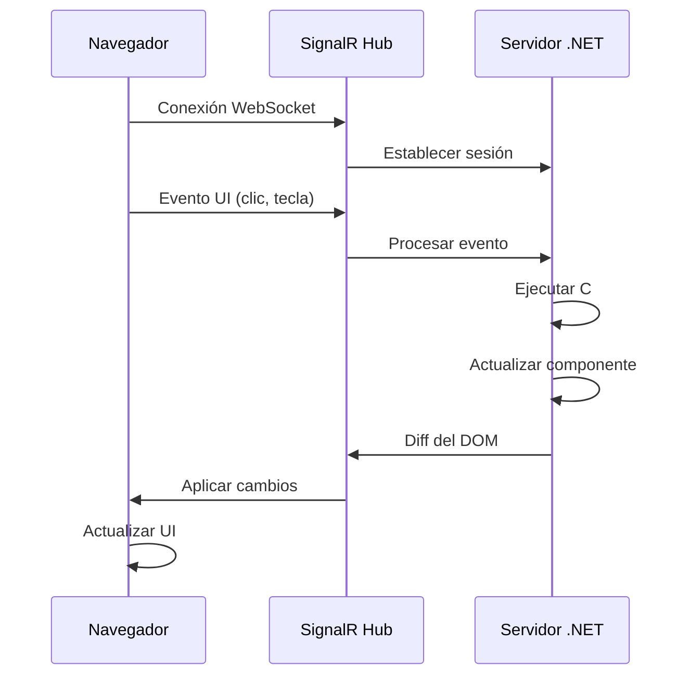
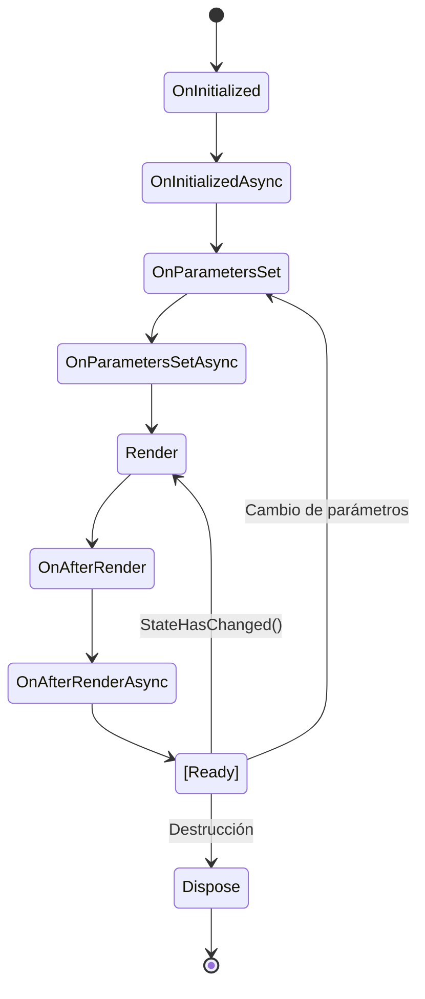

# 10 - Blazor Server: C# en la Web

## 1. ¿Qué es Blazor Server?

**Blazor Server** es un framework de Microsoft para construir **aplicaciones web interactivas** usando **C# en lugar de JavaScript**. Fue lanzado como parte de **.NET Core 3.0** en 2019 y permite crear aplicaciones web modernas con la misma experiencia que frameworks como React o Angular, pero con C#.

### 1.1 Historia y Contexto

- **2018**: Microsoft anuncia Blazor como experimento
- **2019**: Blazor Server sale en .NET Core 3.0
- **2020**: Blazor WebAssembly (WASM) lanzado
- **2025**: Blazor es una opción madura para aplicaciones web empresariales

**¿Por qué Blazor?**

✅ **Un solo lenguaje**: C# tanto en backend como frontend  
✅ **Reutilización de código**: compartir lógica entre servidor y cliente  
✅ **Ecosistema .NET**: usar NuGet packages en el frontend  
✅ **Productividad**: herramientas de Visual Studio/Rider  
✅ **Tipado fuerte**: evitar errores de JavaScript  

---

## 2. Arquitectura de Blazor Server

### 2.1 ¿Cómo Funciona?



**Flujo de Trabajo:**

1. El navegador carga una página HTML inicial
2. Se establece una conexión **SignalR** (WebSocket) con el servidor
3. Todos los eventos UI se envían al servidor
4. El servidor procesa la lógica en C#
5. SignalR envía solo los **cambios** (diff) del DOM al navegador
6. El navegador actualiza la UI

### 2.2 Ventajas y Desventajas

| Ventajas | Desventajas |
|----------|-------------|
| ✅ Ejecución rápida (en servidor) | ❌ Requiere conexión constante |
| ✅ Menos descarga inicial | ❌ Escalabilidad (conexiones activas) |
| ✅ Acceso directo a BD y APIs | ❌ Latencia en eventos UI |
| ✅ No expone código C# | ❌ No funciona offline |
| ✅ Compatible con navegadores antiguos | ❌ Consumo de recursos en servidor |

---

## 3. Creación de un Proyecto Blazor Server

### 3.1 Crear Proyecto con CLI

```bash
dotnet new blazorserver -n MiBlazorApp
cd MiBlazorApp
dotnet run
```

### 3.2 Estructura del Proyecto

```
MiBlazorApp/
├── Components/
│   ├── Layout/
│   │   ├── MainLayout.razor      # Layout principal
│   │   ├── NavMenu.razor          # Menú de navegación
│   ├── Pages/
│   │   ├── Home.razor             # Página de inicio
│   │   ├── Counter.razor          # Ejemplo de contador
│   │   ├── Weather.razor          # Ejemplo con datos
│   ├── _Imports.razor              # Imports globales
│   ├── App.razor                   # Componente raíz
│   ├── Routes.razor                # Configuración de rutas
├── wwwroot/                        # Archivos estáticos
│   ├── css/
│   ├── js/
├── Program.cs                      # Punto de entrada
└── appsettings.json               # Configuración
```

### 3.3 Program.cs

```csharp
using MiBlazorApp.Components;

var builder = WebApplication.CreateBuilder(args);

// Servicios de Blazor Server
builder.Services.AddRazorComponents()
    .AddInteractiveServerComponents();

var app = builder.Build();

if (!app.Environment.IsDevelopment())
{
    app.UseExceptionHandler("/Error");
    app.UseHsts();
}

app.UseHttpsRedirection();
app.UseStaticFiles();
app.UseAntiforgery();

app.MapRazorComponents<App>()
    .AddInteractiveServerRenderMode();

app.Run();
```

---

## 4. Componentes Razor

### 4.1 Sintaxis Básica

Un componente Razor es un archivo `.razor` que contiene HTML + C#:

```razor
@page "/saludo"

<h3>Hola desde Blazor</h3>
<p>La hora actual es: @DateTime.Now.ToString("HH:mm:ss")</p>

@code {
    // Código C# del componente
}
```

### 4.2 Directivas Comunes

| Directiva | Propósito | Ejemplo |
|-----------|-----------|---------|
| `@page` | Define ruta de navegación | `@page "/productos"` |
| `@code` | Bloque de código C# | `@code { int contador = 0; }` |
| `@inject` | Inyección de dependencias | `@inject HttpClient Http` |
| `@using` | Importar namespaces | `@using System.Net.Http` |
| `@attribute` | Añadir atributos | `@attribute [Authorize]` |
| `@implements` | Implementar interfaz | `@implements IDisposable` |

### 4.3 Ejemplo: Contador Completo

```razor
@page "/contador"

<PageTitle>Contador</PageTitle>

<h1>Contador Simple</h1>

<p>Valor actual: <strong>@contador</strong></p>

<button class="btn btn-primary" @onclick="Incrementar">
    ➕ Incrementar
</button>

<button class="btn btn-secondary" @onclick="Decrementar">
    ➖ Decrementar
</button>

<button class="btn btn-danger" @onclick="Reset">
    🔄 Reset
</button>

@code {
    private int contador = 0;

    private void Incrementar()
    {
        contador++;
    }

    private void Decrementar()
    {
        contador--;
    }

    private void Reset()
    {
        contador = 0;
    }
}
```

---

## 5. Data Binding en Blazor

### 5.1 One-Way Binding

```razor
<p>Nombre: @nombre</p>

@code {
    private string nombre = "Ana";
}
```

### 5.2 Two-Way Binding con @bind

```razor
<input @bind="nombre" />
<p>Hola, @nombre!</p>

@code {
    private string nombre = "Ana";
}
```

### 5.3 Binding con Eventos

```razor
<!-- Actualizar en cada tecla -->
<input @bind="busqueda" @bind:event="oninput" />

<!-- Actualizar al perder foco (por defecto) -->
<input @bind="email" />

@code {
    private string busqueda = "";
    private string email = "";
}
```

### 5.4 Binding de CheckBox y Select

```razor
<input type="checkbox" @bind="activo" />
<label>¿Activo? @activo</label>

<select @bind="paisSeleccionado">
    @foreach (var pais in paises)
    {
        <option value="@pais">@pais</option>
    }
</select>

<p>País seleccionado: @paisSeleccionado</p>

@code {
    private bool activo = false;
    private string paisSeleccionado = "España";
    private string[] paises = { "España", "México", "Argentina", "Colombia" };
}
```

---

## 6. Manejo de Eventos

### 6.1 Eventos Comunes

```razor
<!-- Click -->
<button @onclick="AlHacerClic">Clic aquí</button>

<!-- Eventos de teclado -->
<input @onkeydown="AlPresionarTecla" 
       @onkeyup="AlSoltarTecla" />

<!-- Eventos de mouse -->
<div @onmouseover="AlEntrarMouse" 
     @onmouseout="AlSalirMouse">
    Pasa el mouse aquí
</div>

<!-- Eventos de formulario -->
<form @onsubmit="AlEnviarFormulario">
    <input type="text" @bind="texto" />
    <button type="submit">Enviar</button>
</form>

@code {
    private string texto = "";

    private void AlHacerClic()
    {
        Console.WriteLine("¡Clic!");
    }

    private void AlPresionarTecla(KeyboardEventArgs e)
    {
        Console.WriteLine($"Tecla: {e.Key}");
    }

    private void AlSoltarTecla(KeyboardEventArgs e)
    {
        Console.WriteLine($"Soltada: {e.Key}");
    }

    private void AlEntrarMouse()
    {
        Console.WriteLine("Mouse entró");
    }

    private void AlSalirMouse()
    {
        Console.WriteLine("Mouse salió");
    }

    private void AlEnviarFormulario()
    {
        Console.WriteLine($"Enviado: {texto}");
    }
}
```

### 6.2 Pasar Parámetros a Eventos

```razor
@foreach (var item in items)
{
    <button @onclick="() => EliminarItem(item.Id)">
        Eliminar @item.Nombre
    </button>
}

@code {
    private List<Item> items = new()
    {
        new() { Id = 1, Nombre = "Item 1" },
        new() { Id = 2, Nombre = "Item 2" },
        new() { Id = 3, Nombre = "Item 3" }
    };

    private void EliminarItem(int id)
    {
        items.RemoveAll(i => i.Id == id);
    }

    private class Item
    {
        public int Id { get; set; }
        public string Nombre { get; set; } = "";
    }
}
```

---

## 7. Ciclo de Vida de Componentes

### 7.1 Métodos del Ciclo de Vida

```razor
@page "/ciclo-vida"
@implements IDisposable

<h3>Ciclo de Vida del Componente</h3>
<p>Contador: @contador</p>
<button @onclick="Incrementar">Incrementar</button>

@code {
    private int contador = 0;

    // 1. Se ejecuta ANTES de que el componente se renderice
    protected override void OnInitialized()
    {
        Console.WriteLine("1. OnInitialized");
    }

    // 2. Versión asíncrona (se ejecuta en paralelo)
    protected override async Task OnInitializedAsync()
    {
        Console.WriteLine("2. OnInitializedAsync - Inicio");
        await Task.Delay(1000); // Simular carga de datos
        Console.WriteLine("2. OnInitializedAsync - Fin");
    }

    // 3. Se ejecuta DESPUÉS de que los parámetros se establecen
    protected override void OnParametersSet()
    {
        Console.WriteLine("3. OnParametersSet");
    }

    // 4. Versión asíncrona
    protected override async Task OnParametersSetAsync()
    {
        Console.WriteLine("4. OnParametersSetAsync");
        await Task.CompletedTask;
    }

    // 5. Se ejecuta DESPUÉS del primer renderizado
    protected override void OnAfterRender(bool firstRender)
    {
        if (firstRender)
        {
            Console.WriteLine("5. OnAfterRender - Primera vez");
        }
        else
        {
            Console.WriteLine("5. OnAfterRender - Re-render");
        }
    }

    // 6. Versión asíncrona
    protected override async Task OnAfterRenderAsync(bool firstRender)
    {
        Console.WriteLine("6. OnAfterRenderAsync");
        await Task.CompletedTask;
    }

    private void Incrementar()
    {
        contador++;
    }

    // 7. Limpieza de recursos
    public void Dispose()
    {
        Console.WriteLine("7. Dispose - Limpieza");
    }
}
```

### 7.2 Diagrama del Ciclo de Vida



---

## 8. Componentes con Parámetros

### 8.1 Definir Parámetros

```razor
<!-- TarjetaUsuario.razor -->
<div class="card" style="width: 18rem;">
    <div class="card-body">
        <h5 class="card-title">@Nombre</h5>
        <p class="card-text">@Email</p>
        <p class="card-text"><small>Edad: @Edad</small></p>
        <button class="btn btn-primary" @onclick="OnClickInterno">
            Ver Detalles
        </button>
    </div>
</div>

@code {
    [Parameter]
    public string Nombre { get; set; } = "";

    [Parameter]
    public string Email { get; set; } = "";

    [Parameter]
    public int Edad { get; set; }

    [Parameter]
    public EventCallback OnClick { get; set; }

    private async Task OnClickInterno()
    {
        await OnClick.InvokeAsync();
    }
}
```

### 8.2 Usar el Componente

```razor
@page "/usuarios"

<h3>Lista de Usuarios</h3>

@foreach (var usuario in usuarios)
{
    <TarjetaUsuario Nombre="@usuario.Nombre" 
                    Email="@usuario.Email" 
                    Edad="@usuario.Edad"
                    OnClick="@(() => MostrarDetalles(usuario))" />
}

@if (usuarioSeleccionado != null)
{
    <div class="alert alert-info">
        Seleccionado: @usuarioSeleccionado.Nombre
    </div>
}

@code {
    private List<Usuario> usuarios = new()
    {
        new() { Nombre = "Ana García", Email = "ana@ejemplo.com", Edad = 28 },
        new() { Nombre = "Carlos López", Email = "carlos@ejemplo.com", Edad = 35 },
        new() { Nombre = "María Fernández", Email = "maria@ejemplo.com", Edad = 42 }
    };

    private Usuario? usuarioSeleccionado;

    private void MostrarDetalles(Usuario usuario)
    {
        usuarioSeleccionado = usuario;
    }

    private class Usuario
    {
        public string Nombre { get; set; } = "";
        public string Email { get; set; } = "";
        public int Edad { get; set; }
    }
}
```

---

## 9. Servicios e Inyección de Dependencias

### 9.1 Crear un Servicio

```csharp
// Services/TareasService.cs
namespace MiBlazorApp.Services;

public class TareasService
{
    private readonly List<Tarea> _tareas = new();

    public List<Tarea> ObtenerTodas() => new(_tareas);

    public void Agregar(Tarea tarea)
    {
        tarea.Id = _tareas.Count + 1;
        _tareas.Add(tarea);
    }

    public void Eliminar(int id)
    {
        _tareas.RemoveAll(t => t.Id == id);
    }

    public void MarcarCompletada(int id)
    {
        var tarea = _tareas.FirstOrDefault(t => t.Id == id);
        if (tarea != null)
        {
            tarea.Completada = !tarea.Completada;
        }
    }
}

public class Tarea
{
    public int Id { get; set; }
    public string Titulo { get; set; } = "";
    public bool Completada { get; set; }
}
```

### 9.2 Registrar el Servicio

```csharp
// Program.cs
builder.Services.AddSingleton<TareasService>();
// O: AddScoped, AddTransient
```

### 9.3 Inyectar y Usar el Servicio

```razor
@page "/tareas"
@inject TareasService TareasService

<h3>📝 Lista de Tareas</h3>

<div class="mb-3">
    <input class="form-control" @bind="nuevaTarea" placeholder="Nueva tarea..." />
    <button class="btn btn-primary mt-2" @onclick="AgregarTarea">Agregar</button>
</div>

<ul class="list-group">
    @foreach (var tarea in tareas)
    {
        <li class="list-group-item d-flex justify-content-between align-items-center">
            <div>
                <input type="checkbox" @bind="tarea.Completada" 
                       @oninput="() => TareasService.MarcarCompletada(tarea.Id)" />
                <span style="@(tarea.Completada ? "text-decoration: line-through;" : "")">
                    @tarea.Titulo
                </span>
            </div>
            <button class="btn btn-sm btn-danger" @onclick="() => EliminarTarea(tarea.Id)">
                🗑
            </button>
        </li>
    }
</ul>

@code {
    private List<Tarea> tareas = new();
    private string nuevaTarea = "";

    protected override void OnInitialized()
    {
        CargarTareas();
    }

    private void CargarTareas()
    {
        tareas = TareasService.ObtenerTodas();
    }

    private void AgregarTarea()
    {
        if (!string.IsNullOrWhiteSpace(nuevaTarea))
        {
            TareasService.Agregar(new Tarea { Titulo = nuevaTarea });
            CargarTareas();
            nuevaTarea = "";
        }
    }

    private void EliminarTarea(int id)
    {
        TareasService.Eliminar(id);
        CargarTareas();
    }
}
```

---

## 10. Navegación

### 10.1 NavigationManager

```razor
@page "/navegacion"
@inject NavigationManager Navigation

<h3>Navegación</h3>

<button @onclick='() => Navigation.NavigateTo("/")'>Ir a Inicio</button>
<button @onclick='() => Navigation.NavigateTo("/contador")'>Ir a Contador</button>
<button @onclick="IrAProducto">Ir a Producto 123</button>
<button @onclick="AbrirGoogle">Abrir Google (nueva pestaña)</button>

@code {
    private void IrAProducto()
    {
        Navigation.NavigateTo($"/producto/123");
    }

    private void AbrirGoogle()
    {
        Navigation.NavigateTo("https://google.com", true); // true = nueva pestaña
    }
}
```

### 10.2 Enlaces con NavLink

```razor
<NavLink href="/" Match="NavLinkMatch.All">
    Inicio
</NavLink>

<NavLink href="/contador">
    Contador
</NavLink>

<NavLink href="/tareas" ActiveClass="active">
    Tareas
</NavLink>
```

---

## 11. Comparación: Blazor vs WPF

| Aspecto | Blazor Server | WPF |
|---------|---------------|-----|
| **Plataforma** | Web (navegador) | Windows desktop |
| **Lenguaje UI** | Razor (HTML + C#) | XAML |
| **Arquitectura** | Cliente-Servidor (SignalR) | Cliente local |
| **Distribución** | URL (sin instalación) | Instalador (.exe) |
| **Actualización** | Automática (servidor) | Manual |
| **Acceso offline** | ❌ Requiere conexión | ✅ Funciona offline |
| **Multiplataforma** | ✅ Cualquier navegador | ❌ Solo Windows |
| **Performance** | Depende de latencia | ⚡ Nativo |
| **Patrón** | Componentes | MVVM |

---

## 12. Ejemplo Completo: Aplicación de Contactos

### 12.1 Modelo

```csharp
// Models/Contacto.cs
namespace MiBlazorApp.Models;

public class Contacto
{
    public int Id { get; set; }
    public string Nombre { get; set; } = "";
    public string Email { get; set; } = "";
    public string Telefono { get; set; } = "";
    public bool Favorito { get; set; }
}
```

### 12.2 Servicio

```csharp
// Services/ContactosService.cs
public class ContactosService
{
    private readonly List<Contacto> _contactos = new()
    {
        new() { Id = 1, Nombre = "Ana García", Email = "ana@ejemplo.com", Telefono = "123456789" },
        new() { Id = 2, Nombre = "Carlos López", Email = "carlos@ejemplo.com", Telefono = "987654321" }
    };

    public event Action? OnChange;

    public List<Contacto> ObtenerTodos() => new(_contactos);

    public Contacto? ObtenerPorId(int id) => _contactos.FirstOrDefault(c => c.Id == id);

    public void Agregar(Contacto contacto)
    {
        contacto.Id = _contactos.Max(c => c.Id) + 1;
        _contactos.Add(contacto);
        OnChange?.Invoke();
    }

    public void Actualizar(Contacto contacto)
    {
        var index = _contactos.FindIndex(c => c.Id == contacto.Id);
        if (index >= 0)
        {
            _contactos[index] = contacto;
            OnChange?.Invoke();
        }
    }

    public void Eliminar(int id)
    {
        _contactos.RemoveAll(c => c.Id == id);
        OnChange?.Invoke();
    }
}
```

### 12.3 Componente Principal

```razor
@page "/contactos"
@inject ContactosService ContactosService
@implements IDisposable

<h3>📇 Gestor de Contactos</h3>

<div class="row">
    <div class="col-md-4">
        <h4>Nuevo Contacto</h4>
        <div class="mb-3">
            <label>Nombre:</label>
            <input class="form-control" @bind="nuevoContacto.Nombre" />
        </div>
        <div class="mb-3">
            <label>Email:</label>
            <input class="form-control" type="email" @bind="nuevoContacto.Email" />
        </div>
        <div class="mb-3">
            <label>Teléfono:</label>
            <input class="form-control" @bind="nuevoContacto.Telefono" />
        </div>
        <div class="mb-3">
            <input type="checkbox" @bind="nuevoContacto.Favorito" />
            <label>Favorito</label>
        </div>
        <button class="btn btn-primary" @onclick="AgregarContacto">Agregar</button>
    </div>

    <div class="col-md-8">
        <h4>Lista de Contactos (@contactos.Count)</h4>
        <div class="list-group">
            @foreach (var contacto in contactos)
            {
                <div class="list-group-item">
                    <div class="d-flex justify-content-between">
                        <div>
                            <h5>
                                @contacto.Nombre
                                @if (contacto.Favorito)
                                {
                                    <span class="badge bg-warning">⭐</span>
                                }
                            </h5>
                            <p class="mb-1">📧 @contacto.Email</p>
                            <p class="mb-1">📞 @contacto.Telefono</p>
                        </div>
                        <div>
                            <button class="btn btn-sm btn-danger" @onclick="() => Eliminar(contacto.Id)">
                                🗑 Eliminar
                            </button>
                        </div>
                    </div>
                </div>
            }
        </div>
    </div>
</div>

@code {
    private List<Contacto> contactos = new();
    private Contacto nuevoContacto = new();

    protected override void OnInitialized()
    {
        ContactosService.OnChange += ActualizarLista;
        ActualizarLista();
    }

    private void ActualizarLista()
    {
        contactos = ContactosService.ObtenerTodos();
        StateHasChanged();
    }

    private void AgregarContacto()
    {
        if (!string.IsNullOrWhiteSpace(nuevoContacto.Nombre) && 
            !string.IsNullOrWhiteSpace(nuevoContacto.Email))
        {
            ContactosService.Agregar(nuevoContacto);
            nuevoContacto = new Contacto();
        }
    }

    private void Eliminar(int id)
    {
        ContactosService.Eliminar(id);
    }

    public void Dispose()
    {
        ContactosService.OnChange -= ActualizarLista;
    }
}
```

---

## 13. Resumen

| Concepto | Descripción |
|----------|-------------|
| Blazor Server | Framework web con C# ejecutado en servidor |
| SignalR | Tecnología de comunicación en tiempo real |
| Razor | Sintaxis que mezcla HTML y C# |
| @code | Bloque de código C# en componente |
| @page | Define ruta de navegación |
| @inject | Inyección de dependencias |
| @bind | Data binding bidireccional |
| EventCallback | Evento de componente hijo a padre |

---

## 14. Ejercicios Propuestos

1. **Blog Personal**: Crea una aplicación de blog con lista de posts, visualización y creación de nuevos posts.

2. **Tienda Online**: Implementa un catálogo de productos con carrito de compra y total calculado.

3. **Dashboard**: Crea un dashboard con gráficos y estadísticas simuladas.

4. **Chat Simple**: Implementa un chat básico usando SignalR directamente.

---

## 15. Referencias

- [Blazor Documentation](https://learn.microsoft.com/aspnet/core/blazor/)
- [Blazor Tutorial](https://dotnet.microsoft.com/learn/aspnet/blazor-tutorial/intro)
- [SignalR Overview](https://learn.microsoft.com/aspnet/core/signalr/)

Ver ejemplos completos en `/soluciones/10-blazor-server/`

---

*Documento elaborado para el módulo de Programación del ciclo formativo 1º DAW · Curso 2025-2026*
