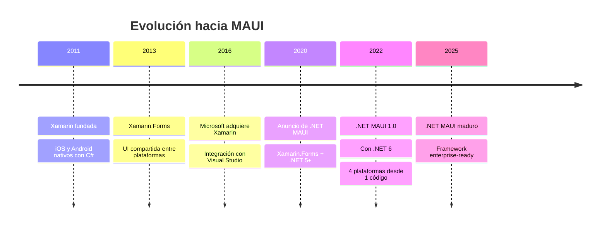
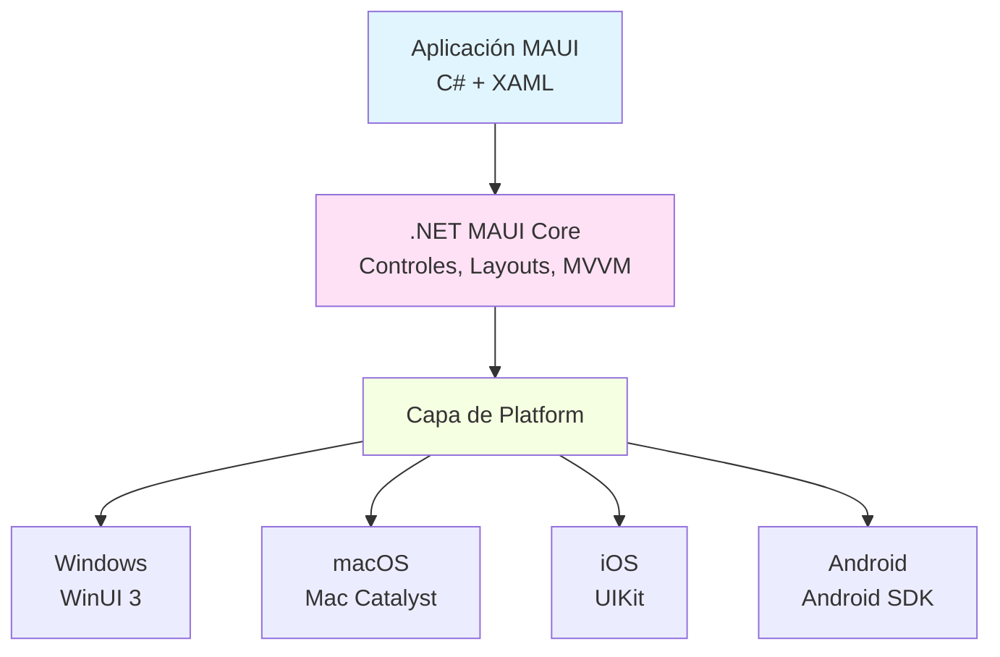

# 12 - .NET MAUI: Aplicaciones Multiplataforma

## 1. ¿Qué es .NET MAUI?

**.NET Multi-platform App UI (MAUI)** es el framework moderno de Microsoft para crear aplicaciones nativas que se ejecutan en **Windows, macOS, iOS y Android** desde una única base de código en **C# y XAML**. Es la evolución de Xamarin.Forms y fue lanzado con **.NET 6** en mayo de 2022.

### 1.1 Historia y Evolución



**¿Por qué MAUI?**

✅ **Una base de código**: Windows, macOS, iOS, Android  
✅ **UI nativa**: rendimiento y look & feel nativos  
✅ **Hot Reload**: cambios sin recompilar  
✅ **XAML compartido**: misma sintaxis que WPF  
✅ **Acceso a APIs nativas**: cámara, GPS, sensores  
✅ **MVVM**: patrón arquitectónico integrado  

---

## 2. Arquitectura de .NET MAUI

### 2.1 Capas de Abstracción



### 2.2 Single Project vs Multi-Project

**.NET MAUI usa un proyecto único** para todas las plataformas:

```
MiApp.csproj  ← Un solo proyecto para todo
├── Platforms/
│   ├── Windows/
│   ├── MacCatalyst/
│   ├── iOS/
│   └── Android/
├── Resources/
│   ├── Images/
│   ├── Fonts/
│   └── Styles/
├── Views/
├── ViewModels/
└── Models/
```

---

## 3. Creación de un Proyecto MAUI

### 3.1 Crear Proyecto con CLI

```bash
# Instalar plantillas MAUI (si no están)
dotnet new install Microsoft.Maui.Templates

# Crear proyecto
dotnet new maui -n MiAppMAUI
cd MiAppMAUI

# Ejecutar en Android
dotnet build -t:Run -f net10.0-android

# Ejecutar en Windows
dotnet build -t:Run -f net10.0-windows10.0.19041.0
```

### 3.2 Estructura del Proyecto

```
MiAppMAUI/
├── App.xaml                    # Punto de entrada UI
├── App.xaml.cs                 # Código de aplicación
├── AppShell.xaml               # Shell de navegación
├── AppShell.xaml.cs
├── MauiProgram.cs              # Configuración
├── Platforms/
│   ├── Android/
│   │   ├── MainActivity.cs
│   │   ├── AndroidManifest.xml
│   ├── iOS/
│   │   ├── AppDelegate.cs
│   │   ├── Info.plist
│   ├── Windows/
│   │   ├── App.xaml
│   │   └── app.manifest
│   └── MacCatalyst/
├── Resources/
│   ├── AppIcon/               # Icono multiplataforma
│   ├── Splash/                # Splash screen
│   ├── Images/                # Imágenes
│   ├── Fonts/                 # Fuentes personalizadas
│   └── Styles/
│       └── Colors.xaml        # Colores globales
│       └── Styles.xaml        # Estilos globales
└── Views/
    └── MainPage.xaml
```

### 3.3 MauiProgram.cs

```csharp
namespace MiAppMAUI;

public static class MauiProgram
{
    public static MauiApp CreateMauiApp()
    {
        var builder = MauiApp.CreateBuilder();
        
        builder
            .UseMauiApp<App>()
            .ConfigureFonts(fonts =>
            {
                fonts.AddFont("OpenSans-Regular.ttf", "OpenSansRegular");
                fonts.AddFont("OpenSans-Semibold.ttf", "OpenSansSemibold");
            });

        // Registrar servicios
        builder.Services.AddSingleton<MainPage>();
        builder.Services.AddSingleton<MainViewModel>();

        return builder.Build();
    }
}
```

---

## 4. XAML en MAUI

### 4.1 Similitudes y Diferencias con WPF

| Aspecto | WPF | MAUI |
|---------|-----|------|
| **Sintaxis XAML** | ✅ Igual | ✅ Muy similar |
| **Layouts** | Grid, StackPanel, etc. | Grid, VerticalStackLayout, etc. |
| **Controles** | Button, TextBox | Button, Entry |
| **Data Binding** | ✅ Igual | ✅ Igual |
| **MVVM** | ✅ Compatible | ✅ Compatible |
| **Recursos** | ResourceDictionary | ResourceDictionary |

### 4.2 Layouts en MAUI

```xml
<!-- VerticalStackLayout: apila verticalmente -->
<VerticalStackLayout>
    <Label Text="Elemento 1" />
    <Label Text="Elemento 2" />
    <Label Text="Elemento 3" />
</VerticalStackLayout>

<!-- HorizontalStackLayout: apila horizontalmente -->
<HorizontalStackLayout>
    <Button Text="Botón 1" />
    <Button Text="Botón 2" />
    <Button Text="Botón 3" />
</HorizontalStackLayout>

<!-- Grid: tabla de filas y columnas -->
<Grid RowDefinitions="Auto,*,Auto" ColumnDefinitions="*,2*">
    <Label Text="Cabecera" Grid.Row="0" Grid.ColumnSpan="2" />
    <Label Text="Izquierda" Grid.Row="1" Grid.Column="0" />
    <Label Text="Derecha" Grid.Row="1" Grid.Column="1" />
    <Button Text="Pie" Grid.Row="2" Grid.ColumnSpan="2" />
</Grid>

<!-- FlexLayout: diseño flexible -->
<FlexLayout Direction="Row" Wrap="Wrap" JustifyContent="SpaceAround">
    <Label Text="Item 1" />
    <Label Text="Item 2" />
    <Label Text="Item 3" />
</FlexLayout>

<!-- AbsoluteLayout: posicionamiento absoluto -->
<AbsoluteLayout>
    <BoxView Color="Red" AbsoluteLayout.LayoutBounds="0, 0, 100, 100" />
    <BoxView Color="Blue" AbsoluteLayout.LayoutBounds="50, 50, 100, 100" />
</AbsoluteLayout>
```

### 4.3 Controles Básicos

```xml
<!-- Label -->
<Label Text="Hola MAUI" 
       FontSize="24" 
       FontAttributes="Bold" 
       TextColor="Blue" 
       HorizontalOptions="Center" />

<!-- Entry (equivalente a TextBox) -->
<Entry Placeholder="Escribe aquí" 
       Text="{Binding Nombre}" 
       Keyboard="Text" />

<!-- Editor (multilínea) -->
<Editor Placeholder="Descripción" 
        HeightRequest="100" />

<!-- Button -->
<Button Text="Clic aquí" 
        Command="{Binding GuardarCommand}" 
        BackgroundColor="Blue" 
        TextColor="White" />

<!-- CheckBox -->
<CheckBox IsChecked="{Binding Activo}" />

<!-- Switch -->
<Switch IsToggled="{Binding Notificaciones}" />

<!-- Slider -->
<Slider Minimum="0" Maximum="100" Value="{Binding Volumen}" />

<!-- Picker (equivalente a ComboBox) -->
<Picker Title="Selecciona país" 
        ItemsSource="{Binding Paises}" 
        SelectedItem="{Binding PaisSeleccionado}" />

<!-- DatePicker -->
<DatePicker Date="{Binding FechaNacimiento}" 
            MinimumDate="01/01/1900" 
            MaximumDate="{x:Static system:DateTime.Now}" />

<!-- TimePicker -->
<TimePicker Time="{Binding HoraAlarma}" />

<!-- Image -->
<Image Source="logo.png" 
       Aspect="AspectFit" 
       HeightRequest="200" />
```

---

## 5. MVVM en MAUI

### 5.1 Instalación de CommunityToolkit.Mvvm

```bash
dotnet add package CommunityToolkit.Mvvm
```

### 5.2 Ejemplo: Contador MVVM

**Modelo:**

```csharp
namespace MiAppMAUI.Models;

public class Contador
{
    public int Valor { get; private set; }

    public void Incrementar() => Valor++;
    public void Decrementar() => Valor--;
    public void Reset() => Valor = 0;
}
```

**ViewModel:**

```csharp
using CommunityToolkit.Mvvm.ComponentModel;
using CommunityToolkit.Mvvm.Input;

namespace MiAppMAUI.ViewModels;

public partial class ContadorViewModel : ObservableObject
{
    private readonly Contador _contador = new();

    [ObservableProperty]
    private int _valor;

    [RelayCommand]
    private void Incrementar()
    {
        _contador.Incrementar();
        Valor = _contador.Valor;
    }

    [RelayCommand]
    private void Decrementar()
    {
        _contador.Decrementar();
        Valor = _contador.Valor;
    }

    [RelayCommand]
    private void Reset()
    {
        _contador.Reset();
        Valor = _contador.Valor;
    }
}
```

**Vista:**

```xml
<?xml version="1.0" encoding="utf-8" ?>
<ContentPage xmlns="http://schemas.microsoft.com/dotnet/2021/maui"
             xmlns:x="http://schemas.microsoft.com/winfx/2009/xaml"
             xmlns:vm="clr-namespace:MiAppMAUI.ViewModels"
             x:Class="MiAppMAUI.Views.ContadorPage"
             Title="Contador">

    <ContentPage.BindingContext>
        <vm:ContadorViewModel />
    </ContentPage.BindingContext>

    <VerticalStackLayout Padding="30" Spacing="25">
        <Label Text="Contador MAUI" 
               FontSize="32" 
               FontAttributes="Bold" 
               HorizontalOptions="Center" />

        <Frame BorderColor="Gray" 
               CornerRadius="10" 
               Padding="20" 
               HorizontalOptions="Center">
            <Label Text="{Binding Valor}" 
                   FontSize="72" 
                   FontAttributes="Bold" 
                   TextColor="Blue" 
                   HorizontalOptions="Center" />
        </Frame>

        <HorizontalStackLayout HorizontalOptions="Center" Spacing="10">
            <Button Text="−" 
                    Command="{Binding DecrementarCommand}" 
                    WidthRequest="80" 
                    HeightRequest="60" 
                    FontSize="32" />

            <Button Text="+" 
                    Command="{Binding IncrementarCommand}" 
                    WidthRequest="80" 
                    HeightRequest="60" 
                    FontSize="32" />
        </HorizontalStackLayout>

        <Button Text="🔄 Reset" 
                Command="{Binding ResetCommand}" 
                HorizontalOptions="Center" 
                WidthRequest="150" 
                HeightRequest="50" />
    </VerticalStackLayout>
</ContentPage>
```

**Code-Behind:**

```csharp
namespace MiAppMAUI.Views;

public partial class ContadorPage : ContentPage
{
    public ContadorPage()
    {
        InitializeComponent();
    }
}
```

---

## 6. Navegación en MAUI

### 6.1 Shell Navigation

MAUI usa **Shell** como sistema de navegación principal:

```xml
<!-- AppShell.xaml -->
<?xml version="1.0" encoding="UTF-8" ?>
<Shell xmlns="http://schemas.microsoft.com/dotnet/2021/maui"
       xmlns:x="http://schemas.microsoft.com/winfx/2009/xaml"
       xmlns:views="clr-namespace:MiAppMAUI.Views"
       x:Class="MiAppMAUI.AppShell">

    <TabBar>
        <ShellContent Title="Inicio" 
                      Icon="home.png" 
                      ContentTemplate="{DataTemplate views:MainPage}" 
                      Route="MainPage" />

        <ShellContent Title="Contador" 
                      Icon="calculator.png" 
                      ContentTemplate="{DataTemplate views:ContadorPage}" 
                      Route="ContadorPage" />

        <ShellContent Title="Tareas" 
                      Icon="tasks.png" 
                      ContentTemplate="{DataTemplate views:TareasPage}" 
                      Route="TareasPage" />
    </TabBar>

</Shell>
```

### 6.2 Navegación Programática

```csharp
// En ViewModel o Page
await Shell.Current.GoToAsync("//MainPage"); // Ruta absoluta
await Shell.Current.GoToAsync("ContadorPage"); // Ruta relativa
await Shell.Current.GoToAsync(".."); // Volver atrás

// Con parámetros
await Shell.Current.GoToAsync($"DetallesPage?id={producto.Id}");
```

### 6.3 Recibir Parámetros

```csharp
// DetallesPage.xaml.cs
[QueryProperty(nameof(ProductoId), "id")]
public partial class DetallesPage : ContentPage
{
    private int _productoId;
    
    public int ProductoId
    {
        get => _productoId;
        set
        {
            _productoId = value;
            CargarProducto(value);
        }
    }
    
    public DetallesPage()
    {
        InitializeComponent();
    }
    
    private void CargarProducto(int id)
    {
        // Cargar datos del producto
    }
}
```

---

## 7. Código Específico de Plataforma

### 7.1 Conditional Compilation

```csharp
#if ANDROID
using Android.App;
using Android.Content;
#elif IOS
using UIKit;
#elif WINDOWS
using Microsoft.UI.Xaml;
#endif

public class PlatformService
{
    public string ObtenerNombrePlataforma()
    {
#if ANDROID
        return "Android";
#elif IOS
        return "iOS";
#elif WINDOWS
        return "Windows";
#elif MACCATALYST
        return "macOS";
#else
        return "Desconocida";
#endif
    }
    
    public void MostrarAlertaNativa(string mensaje)
    {
#if ANDROID
        var activity = Platform.CurrentActivity;
        var builder = new AlertDialog.Builder(activity);
        builder.SetMessage(mensaje);
        builder.SetPositiveButton("OK", (s, e) => { });
        builder.Show();
#elif IOS
        var alert = UIAlertController.Create("Alerta", mensaje, UIAlertControllerStyle.Alert);
        alert.AddAction(UIAlertAction.Create("OK", UIAlertActionStyle.Default, null));
        UIApplication.SharedApplication.KeyWindow.RootViewController.PresentViewController(alert, true, null);
#elif WINDOWS
        // Código específico de Windows
#endif
    }
}
```

### 7.2 Carpetas Platforms/

```
Platforms/
├── Android/
│   ├── MainActivity.cs          # Actividad principal
│   ├── AndroidManifest.xml      # Permisos y configuración
│   └── Resources/               # Recursos de Android
├── iOS/
│   ├── AppDelegate.cs           # Delegado de la app
│   ├── Info.plist               # Configuración de iOS
│   └── Resources/               # Recursos de iOS
├── Windows/
│   ├── App.xaml                 # App de Windows
│   └── app.manifest             # Manifesto
└── MacCatalyst/
    ├── AppDelegate.cs
    └── Info.plist
```

---

## 8. Acceso a Funcionalidades Nativas

### 8.1 Essentials: APIs Multiplataforma

```csharp
using Microsoft.Maui.Devices;
using Microsoft.Maui.Storage;
using Microsoft.Maui.ApplicationModel;

public class EjemplosEssentials
{
    // Información del dispositivo
    public string ObtenerInfoDispositivo()
    {
        return $@"
            Plataforma: {DeviceInfo.Platform}
            Fabricante: {DeviceInfo.Manufacturer}
            Modelo: {DeviceInfo.Model}
            Versión: {DeviceInfo.VersionString}
            Tipo: {DeviceInfo.DeviceType}
        ";
    }
    
    // Geolocalización
    public async Task<string> ObtenerUbicacionAsync()
    {
        try
        {
            var location = await Geolocation.GetLastKnownLocationAsync();
            if (location == null)
            {
                location = await Geolocation.GetLocationAsync(new GeolocationRequest
                {
                    DesiredAccuracy = GeolocationAccuracy.Medium,
                    Timeout = TimeSpan.FromSeconds(30)
                });
            }
            
            return $"Lat: {location.Latitude}, Long: {location.Longitude}";
        }
        catch (Exception ex)
        {
            return $"Error: {ex.Message}";
        }
    }
    
    // Preferencias (almacenamiento clave-valor)
    public void GuardarPreferencia(string clave, string valor)
    {
        Preferences.Set(clave, valor);
    }
    
    public string ObtenerPreferencia(string clave, string valorPorDefecto = "")
    {
        return Preferences.Get(clave, valorPorDefecto);
    }
    
    // Conectividad
    public bool TieneConexion()
    {
        return Connectivity.NetworkAccess == NetworkAccess.Internet;
    }
    
    // Vibración
    public void Vibrar()
    {
        Vibration.Vibrate(TimeSpan.FromMilliseconds(500));
    }
    
    // Compartir
    public async Task CompartirTextoAsync(string texto)
    {
        await Share.RequestAsync(new ShareTextRequest
        {
            Text = texto,
            Title = "Compartir"
        });
    }
    
    // Abrir navegador
    public async Task AbrirUrlAsync(string url)
    {
        await Browser.OpenAsync(url, BrowserLaunchMode.SystemPreferred);
    }
}
```

### 8.2 Media Picker: Fotos y Videos

```csharp
public class MediaService
{
    public async Task<string> TomarFotoAsync()
    {
        try
        {
            var photo = await MediaPicker.CapturePhotoAsync();
            if (photo != null)
            {
                // Guardar en local
                var localPath = Path.Combine(FileSystem.CacheDirectory, photo.FileName);
                using var stream = await photo.OpenReadAsync();
                using var newStream = File.OpenWrite(localPath);
                await stream.CopyToAsync(newStream);
                
                return localPath;
            }
        }
        catch (Exception ex)
        {
            await Application.Current.MainPage.DisplayAlert("Error", ex.Message, "OK");
        }
        
        return null;
    }
    
    public async Task<string> SeleccionarImagenAsync()
    {
        try
        {
            var result = await MediaPicker.PickPhotoAsync();
            if (result != null)
            {
                return result.FullPath;
            }
        }
        catch (Exception ex)
        {
            await Application.Current.MainPage.DisplayAlert("Error", ex.Message, "OK");
        }
        
        return null;
    }
}
```

---

## 9. Ejemplo Completo: Aplicación de Notas

### 9.1 Modelo

```csharp
namespace NotasMAUI.Models;

public class Nota
{
    public int Id { get; set; }
    public string Titulo { get; set; } = "";
    public string Contenido { get; set; } = "";
    public DateTime FechaCreacion { get; set; } = DateTime.Now;
    public bool Favorita { get; set; }
}
```

### 9.2 Servicio

```csharp
using System.Collections.ObjectModel;

namespace NotasMAUI.Services;

public class NotasService
{
    private readonly ObservableCollection<Nota> _notas = new();
    
    public ObservableCollection<Nota> ObtenerTodas() => _notas;
    
    public void Agregar(Nota nota)
    {
        nota.Id = _notas.Count + 1;
        _notas.Add(nota);
        GuardarEnPreferencias();
    }
    
    public void Actualizar(Nota nota)
    {
        var index = _notas.IndexOf(_notas.First(n => n.Id == nota.Id));
        _notas[index] = nota;
        GuardarEnPreferencias();
    }
    
    public void Eliminar(int id)
    {
        var nota = _notas.FirstOrDefault(n => n.Id == id);
        if (nota != null)
        {
            _notas.Remove(nota);
            GuardarEnPreferencias();
        }
    }
    
    private void GuardarEnPreferencias()
    {
        // Serializar y guardar en Preferences
        var json = JsonSerializer.Serialize(_notas);
        Preferences.Set("notas", json);
    }
    
    public void CargarDesdePreferencias()
    {
        var json = Preferences.Get("notas", "[]");
        var notas = JsonSerializer.Deserialize<List<Nota>>(json);
        _notas.Clear();
        foreach (var nota in notas ?? new())
        {
            _notas.Add(nota);
        }
    }
}
```

### 9.3 ViewModel

```csharp
using CommunityToolkit.Mvvm.ComponentModel;
using CommunityToolkit.Mvvm.Input;
using System.Collections.ObjectModel;

namespace NotasMAUI.ViewModels;

public partial class NotasViewModel : ObservableObject
{
    private readonly NotasService _service;
    
    [ObservableProperty]
    private ObservableCollection<Nota> _notas = new();
    
    [ObservableProperty]
    private string _titulo = "";
    
    [ObservableProperty]
    private string _contenido = "";
    
    public NotasViewModel(NotasService service)
    {
        _service = service;
        _service.CargarDesdePreferencias();
        Notas = _service.ObtenerTodas();
    }
    
    [RelayCommand]
    private async Task AgregarNota()
    {
        if (string.IsNullOrWhiteSpace(Titulo))
        {
            await Application.Current.MainPage.DisplayAlert("Error", "El título es obligatorio", "OK");
            return;
        }
        
        var nota = new Nota
        {
            Titulo = Titulo,
            Contenido = Contenido
        };
        
        _service.Agregar(nota);
        LimpiarFormulario();
    }
    
    [RelayCommand]
    private async Task EliminarNota(Nota nota)
    {
        bool confirmar = await Application.Current.MainPage.DisplayAlert(
            "Confirmar",
            $"¿Eliminar la nota '{nota.Titulo}'?",
            "Sí",
            "No"
        );
        
        if (confirmar)
        {
            _service.Eliminar(nota.Id);
        }
    }
    
    [RelayCommand]
    private void MarcarFavorita(Nota nota)
    {
        nota.Favorita = !nota.Favorita;
        _service.Actualizar(nota);
    }
    
    private void LimpiarFormulario()
    {
        Titulo = "";
        Contenido = "";
    }
}
```

### 9.4 Vista

```xml
<?xml version="1.0" encoding="utf-8" ?>
<ContentPage xmlns="http://schemas.microsoft.com/dotnet/2021/maui"
             xmlns:x="http://schemas.microsoft.com/winfx/2009/xaml"
             xmlns:vm="clr-namespace:NotasMAUI.ViewModels"
             x:Class="NotasMAUI.Views.NotasPage"
             Title="Mis Notas">

    <ContentPage.BindingContext>
        <vm:NotasViewModel />
    </ContentPage.BindingContext>

    <Grid RowDefinitions="Auto,*" Padding="10">
        <!-- Formulario -->
        <VerticalStackLayout Grid.Row="0" Spacing="10" Padding="10">
            <Entry Placeholder="Título" 
                   Text="{Binding Titulo}" />
            
            <Editor Placeholder="Contenido" 
                    Text="{Binding Contenido}" 
                    HeightRequest="100" />
            
            <Button Text="➕ Agregar Nota" 
                    Command="{Binding AgregarNotaCommand}" 
                    BackgroundColor="Blue" 
                    TextColor="White" />
        </VerticalStackLayout>

        <!-- Lista de notas -->
        <CollectionView Grid.Row="1" 
                        ItemsSource="{Binding Notas}">
            <CollectionView.ItemTemplate>
                <DataTemplate>
                    <Frame Margin="5" Padding="10" BorderColor="LightGray">
                        <Grid ColumnDefinitions="*,Auto,Auto">
                            <VerticalStackLayout Grid.Column="0">
                                <Label Text="{Binding Titulo}" 
                                       FontSize="18" 
                                       FontAttributes="Bold" />
                                
                                <Label Text="{Binding Contenido}" 
                                       FontSize="14" 
                                       LineBreakMode="TailTruncation" 
                                       MaxLines="2" />
                                
                                <Label Text="{Binding FechaCreacion, StringFormat='{0:dd/MM/yyyy HH:mm}'}" 
                                       FontSize="10" 
                                       TextColor="Gray" />
                            </VerticalStackLayout>

                            <Button Grid.Column="1" 
                                    Text="{Binding Favorita, Converter={StaticResource BoolToStarConverter}}" 
                                    Command="{Binding Source={RelativeSource AncestorType={x:Type vm:NotasViewModel}}, Path=MarcarFavoritaCommand}" 
                                    CommandParameter="{Binding .}" 
                                    BackgroundColor="Transparent" />

                            <Button Grid.Column="2" 
                                    Text="🗑" 
                                    Command="{Binding Source={RelativeSource AncestorType={x:Type vm:NotasViewModel}}, Path=EliminarNotaCommand}" 
                                    CommandParameter="{Binding .}" 
                                    BackgroundColor="Transparent" />
                        </Grid>
                    </Frame>
                </DataTemplate>
            </CollectionView.ItemTemplate>
        </CollectionView>
    </Grid>
</ContentPage>
```

---

## 10. Comparación: WPF vs Blazor vs MAUI

| Aspecto | WPF | Blazor Server | MAUI |
|---------|-----|---------------|------|
| **Plataforma** | Windows | Web | Windows, Mac, iOS, Android |
| **Lenguaje UI** | XAML | Razor | XAML |
| **Distribución** | Instalador | URL | App Store/Play Store/Instalador |
| **Offline** | ✅ Sí | ❌ No | ✅ Sí |
| **Acceso nativo** | APIs Windows | ❌ Limitado | ✅ Completo (cámara, GPS, etc.) |
| **Performance** | ⚡⚡⚡ Nativo | ⚡ Depende latencia | ⚡⚡ Nativo |
| **Curva aprendizaje** | Media | Baja-Media | Media-Alta |
| **Hot Reload** | ✅ Sí | ✅ Sí | ✅ Sí |
| **MVVM** | ✅ Sí | ⚠️ Componentes | ✅ Sí |

---

## 11. Resumen

| Concepto | Descripción |
|----------|-------------|
| MAUI | Framework multiplataforma para Windows, Mac, iOS, Android |
| Xamarin.Forms | Predecesor de MAUI |
| Shell | Sistema de navegación integrado |
| Essentials | APIs multiplataforma (GPS, cámara, etc.) |
| Hot Reload | Cambios en tiempo real sin recompilar |
| Single Project | Un proyecto para todas las plataformas |
| Platform-specific | Código específico por plataforma |

---

## 12. Ejercicios Propuestos

1. **Lista de Compras**: Crea una app de lista de compras con persistencia local usando Preferences.

2. **Galería de Fotos**: Implementa una galería que permita tomar fotos y mostrarlas en una cuadrícula.

3. **Calculadora de Propinas**: App para calcular propinas con diferentes porcentajes.

4. **Clima**: App que muestre el clima de la ubicación actual usando una API pública.

---

## 13. Referencias

- [.NET MAUI Documentation](https://learn.microsoft.com/dotnet/maui/)
- [.NET MAUI Samples](https://github.com/dotnet/maui-samples)
- [Microsoft.Maui.Essentials](https://learn.microsoft.com/dotnet/maui/platform-integration/)

Ver ejemplos completos en `/soluciones/11-dotnet-maui/`

---

*Documento elaborado para el módulo de Programación del ciclo formativo 1º DAW · Curso 2025-2026*
