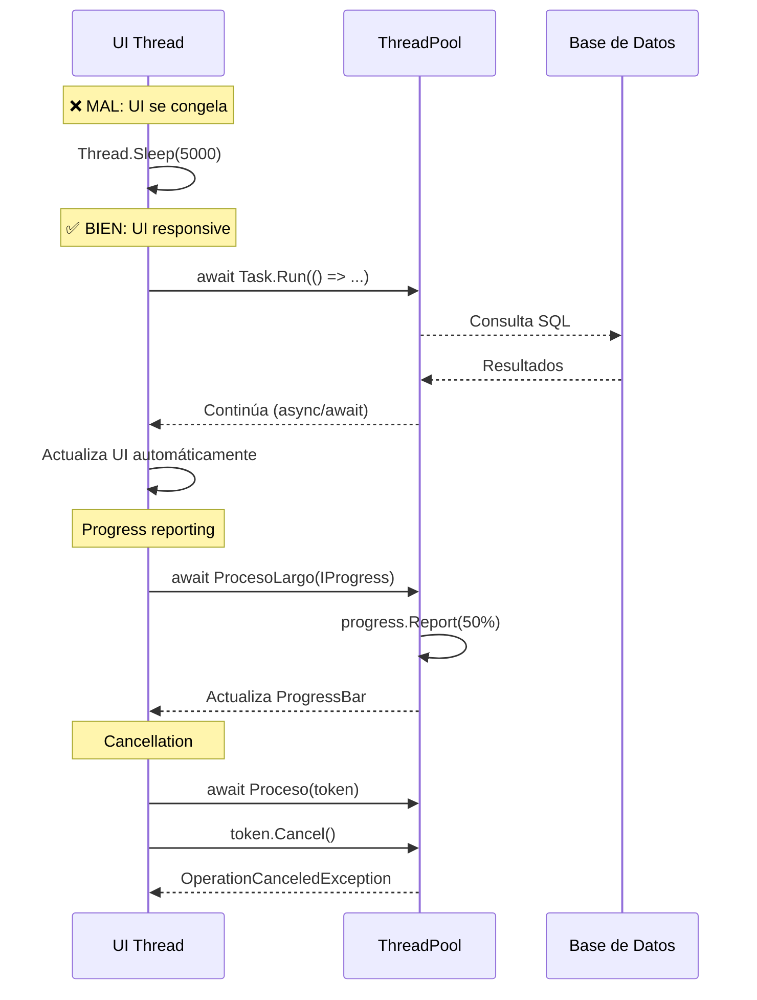

# 13. Tareas en Background: No Bloquear la Interfaz

- [13.1. El Problema: UI Bloqueada](#131-el-problema-ui-bloqueada)
  - [13.1.1. Ejemplo de problema](#1311-ejemplo-de-problema)
- [13.2. Soluciones: Thread, Task, async/await](#132-soluciones-thread-task-asyncawait)
  - [13.2.1. Thread (enfoque clásico)](#1321-thread-enfoque-clásico)
  - [13.2.2. Task.Run (enfoque moderno)](#1322-taskrun-enfoque-moderno)
  - [13.2.3. async/await (enfoque recomendado)](#1323-asyncawait-enfoque-recomendado)
- [13.3. Dispatcher: El Puente al Hilo UI](#133-dispatcher-el-puente-al-hilo-ui)
  - [13.3.1. Dispatcher.Invoke (bloqueante)](#1331-dispatcherinvoke-bloqueante)
  - [13.3.2. Dispatcher.BeginInvoke (no bloqueante)](#1332-dispatcherbegininvoke-no-bloqueante)
  - [13.3.3. Cuándo usar cada uno](#1333-cuándo-usar-cada-uno)
- [13.4. IProgress\<T\>: Reportar Progreso](#134-iprosgresst-reportar-progreso)
- [13.5. CancellationToken: Cancelar Operaciones](#135-cancellationtoken-cancelar-operaciones)
- [13.6. HttpClient y operaciones I/O](#136-httpclient-y-operaciones-io)
- [13.7. Comandos Asíncronos en MVVM](#137-comandos-asíncronos-en-mvvm)

## 13.1. El Problema: UI Bloqueada

En aplicaciones WPF, **toda la interacción con controles visuales debe ocurrir en el hilo principal (UI thread)**. Si ejecutas operaciones largas (descargas, cálculos pesados, acceso a BD) en este hilo, la interfaz se congela y el usuario no puede interactuar.

> 📝 **Nota del Profesor**: Esto es CRÍTICO. Si bloqueas el UI Thread, tu app parece rota. Usa SIEMPRE async/await para operaciones largas. Es una de las preguntas favoritas en exámenes.

### 13.1.1. Ejemplo de problema

```csharp
// ❌ MAL: Operación larga en el hilo UI
private void Button_Click(object sender, RoutedEventArgs e)
{
    // Esto congela la UI durante 5 segundos
    Thread.Sleep(5000); 
    txtResultado.Text = "Terminado";
}
```

**Consecuencias:**
- ❌ Ventana no responde
- ❌ Usuario no puede cancelar
- ❌ Animaciones y ProgressBar no se actualizan
- ❌ Mala experiencia de usuario

---

## 13.2. Soluciones: Thread, Task, async/await

### 13.2.1. Thread (enfoque clásico)

```csharp
// ⚠️ Thread manual - más control pero más complejo
private void Button_Click(object sender, RoutedEventArgs e)
{
    var thread = new Thread(() =>
    {
        // Operación en hilo secundario
        Thread.Sleep(5000);
        
        // ❌ ERROR: No puedes acceder a controles directamente
        // txtResultado.Text = "Terminado"; 
        
        // ✅ BIEN: Usar Dispatcher
        Dispatcher.Invoke(() =>
        {
            txtResultado.Text = "Terminado";
        });
    });
    
    thread.Start();
}
```

**Cuándo usar:**
- Control total sobre el ciclo de vida del hilo
- Operaciones de larga duración
- No recomendado para operaciones I/O

### 13.2.2. Task.Run (enfoque moderno)

```csharp
// ✅ MEJOR: Task.Run con Dispatcher
private void Button_Click(object sender, RoutedEventArgs e)
{
    Task.Run(() =>
    {
        // Operación en ThreadPool
        Thread.Sleep(5000);
        
        // Actualizar UI
        Dispatcher.Invoke(() =>
        {
            txtResultado.Text = "Terminado";
        });
    });
}
```

**Ventajas:**
- Usa ThreadPool (más eficiente)
- Más fácil de gestionar excepciones
- Integración con async/await

### 13.2.3. async/await (enfoque recomendado)

```csharp
// ✅ ÓPTIMO: async/await
private async void Button_Click(object sender, RoutedEventArgs e)
{
    // Deshabilitar botón durante operación
    btnEjecutar.IsEnabled = false;
    
    // Operación asíncrona
    await Task.Run(() =>
    {
        Thread.Sleep(5000);
    });
    
    // NO necesitas Dispatcher aquí - async/await lo maneja automáticamente
    txtResultado.Text = "Terminado";
    btnEjecutar.IsEnabled = true;
}
```

**Por qué es mejor:**
- El compilador maneja automáticamente el cambio de contexto
- Código más limpio y legible
- Manejo de excepciones natural con try/catch

---

## 13.3. Dispatcher: El Puente al Hilo UI

El `Dispatcher` de WPF es el mecanismo para ejecutar código en el hilo principal desde hilos secundarios.

### 13.3.1. Dispatcher.Invoke (bloqueante)

```csharp
// Espera a que se ejecute en el hilo UI
Dispatcher.Invoke(() =>
{
    txtStatus.Text = "Actualizando...";
});
```

### 13.3.2. Dispatcher.BeginInvoke (no bloqueante)

```csharp
// Encola la operación y continúa sin esperar
Dispatcher.BeginInvoke(() =>
{
    txtStatus.Text = "Actualizando...";
});
```

### 13.3.3. Cuándo usar cada uno

| Método | Bloqueante | Uso |
|--------|------------|-----|
| `Invoke` | Sí | Cuando necesitas que se ejecute antes de continuar |
| `BeginInvoke` | No | Cuando no importa el orden de ejecución |

---

## 13.4. IProgress\<T\>: Reportar Progreso

Para operaciones largas, reporta progreso sin bloquear la UI.

```csharp
private async void Button_Click(object sender, RoutedEventArgs e)
{
    var progress = new Progress<int>(value =>
    {
        // Automáticamente en el hilo UI
        progressBar.Value = value;
        txtPorcentaje.Text = $"{value}%";
    });
    
    await TareaLargaAsync(progress);
}

private async Task TareaLargaAsync(IProgress<int> progress)
{
    for (int i = 0; i <= 100; i += 10)
    {
        await Task.Delay(500); // Simula trabajo
        progress?.Report(i);
    }
}
```

**Ventajas:**
- `IProgress<T>` automáticamente ejecuta en el hilo UI
- Desacoplamiento entre lógica y actualización de UI

---

## 13.5. CancellationToken: Cancelar Operaciones

Permite al usuario cancelar operaciones en curso.

```csharp
private CancellationTokenSource? _cts;

private async void BtnIniciar_Click(object sender, RoutedEventArgs e)
{
    _cts = new CancellationTokenSource();
    btnIniciar.IsEnabled = false;
    btnCancelar.IsEnabled = true;
    
    try
    {
        await TareaLargaAsync(_cts.Token);
        txtResultado.Text = "Completado";
    }
    catch (OperationCanceledException)
    {
        txtResultado.Text = "Cancelado por el usuario";
    }
    finally
    {
        btnIniciar.IsEnabled = true;
        btnCancelar.IsEnabled = false;
    }
}

private void BtnCancelar_Click(object sender, RoutedEventArgs e)
{
    _cts?.Cancel();
}

private async Task TareaLargaAsync(CancellationToken token)
{
    for (int i = 0; i < 100; i++)
    {
        token.ThrowIfCancellationRequested(); // Verifica cancelación
        await Task.Delay(100, token);
    }
}
```

---

## 13.6. HttpClient y operaciones I/O

Para operaciones de red, **nunca uses Thread.Sleep o bloqueos**.

```csharp
// ❌ MAL
private void Button_Click(object sender, RoutedEventArgs e)
{
    var client = new HttpClient();
    var response = client.GetStringAsync("https://api.example.com/data").Result; // ❌ Bloquea y puede causar deadlock
    txtResultado.Text = response;
}

// ✅ BIEN
private async void Button_Click(object sender, RoutedEventArgs e)
{
    using var client = new HttpClient();
    var response = await client.GetStringAsync("https://api.example.com/data");
    txtResultado.Text = response;
}
```

---

## 13.7. Comandos Asíncronos en MVVM

Con CommunityToolkit.Mvvm, usa `AsyncRelayCommand`.

```csharp
[RelayCommand]
private async Task CargarDatosAsync()
{
    EsCargando = true;
    
    try
    {
        Datos = await _servicio.ObtenerDatosAsync();
    }
    catch (Exception ex)
    {
        MensajeError = ex.Message;
    }
    finally
    {
        EsCargando = false;
    }
}
```

**Binding en XAML:**

```xml
<Button Content="Cargar" Command="{Binding CargarDatosCommand}" />
<ProgressBar IsIndeterminate="{Binding CargarDatosCommand.IsRunning}" />
```

`AsyncRelayCommand` expone `IsRunning` automáticamente, que puedes enlazar a un `ProgressBar` o spinner.

---

## Resumen de patrones

| Enfoque | Complejidad | UI Segura | Progreso | Cancelación | Recomendado |
|---------|-------------|-----------|----------|-------------|-------------|
| Hilo UI directo | Baja | ❌ | ❌ | ❌ | ❌ Nunca |
| `Thread` manual | Alta | ⚠️ Con Dispatcher | Manual | Manual | Solo casos especiales |
| `Task.Run` | Media | ⚠️ Con Dispatcher | Manual | Con CancellationToken | Para CPU-bound |
| `async/await` | Baja | ✅ Automático | Con `IProgress<T>` | Con CancellationToken | ✅ Recomendado |
| `AsyncRelayCommand` | Muy baja | ✅ Automático | `IsRunning` automático | Integrado | ✅ Recomendado en MVVM |

---

## Resumen

| Concepto | Descripción |
|----------|-------------|
| **UI Thread** | Hilo principal donde se ejecutan todas las operaciones de UI |
| **Bloqueo** | Operación larga en UI Thread congela la aplicación |
| **async/await** | Patrón para operaciones asíncronas sin bloquear |
| **Dispatcher** | Puente para ejecutar código en UI Thread desde otros hilos |
| **IProgress<T>** | Reporta progreso desde tareas en background |
| **CancellationToken** | Permite cancelar operaciones en curso |

### Puntos clave

1. **No bloquees el UI Thread**: Si lo haces, la app parece rota.
2. **async/await**: El compilador maneja automáticamente el cambio de contexto.
3. **Dispatcher's Invoke vs BeginInvoke**: Bloqueante vs no bloqueante.
4. **IProgress<T>**: Reporting de progreso sin preocuparte del hilo.
5. **CancellationToken**: Permite al usuario cancelar operaciones largas.
6. **AsyncRelayCommand**: En MVVM, integra todo automáticamente.

> 📝 **Nota del Profesor**: Esto es CRÍTICO. Si bloqueas el UI Thread, tu app parece rota. Usa SIEMPRE async/await para operaciones largas. Es una de las preguntas favoritas en exámenes. Recuerda: await libera el hilo mientras espera, no consume recursos.

> 💡 **Tip del Examinador**: Pregunta frecuente: "¿Qué ocurre si haces Thread.Sleep(5000) en un botón?"答: La UI se congela durante 5 segundos porque bloqueas el UI Thread. La respuesta correcta es usar async/await con Task.Delay(5000). Otra pregunta común: "¿Para qué sirve Dispatcher?" → Para actualizar la UI desde un hilo secundario. Sin embargo, con async/await NO necesitas Dispatcher porque ya se encarga automáticamente.

---

### Diagrama: Flujo de operaciones asíncronas en WPF



---

---
