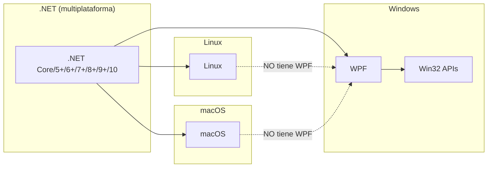
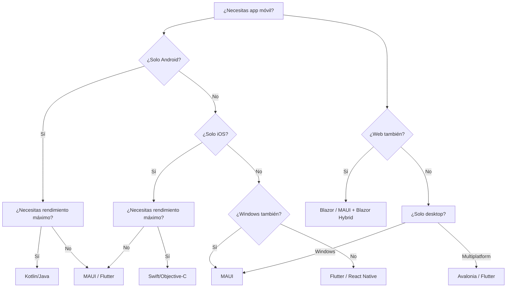
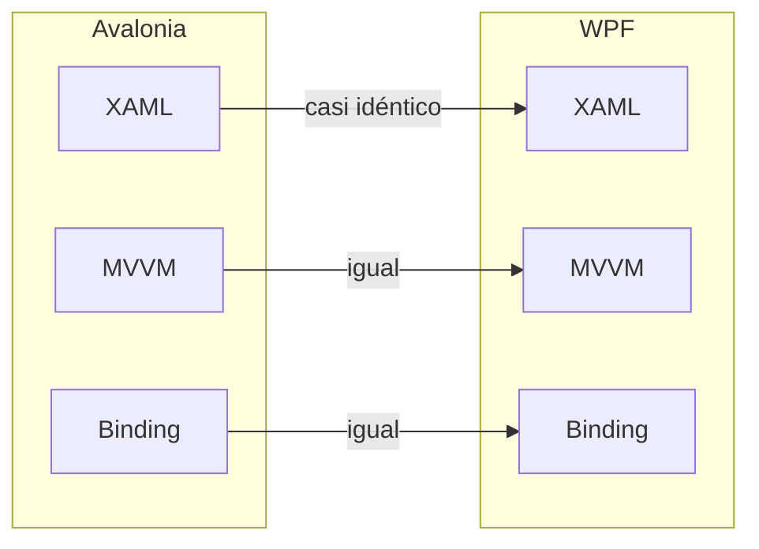
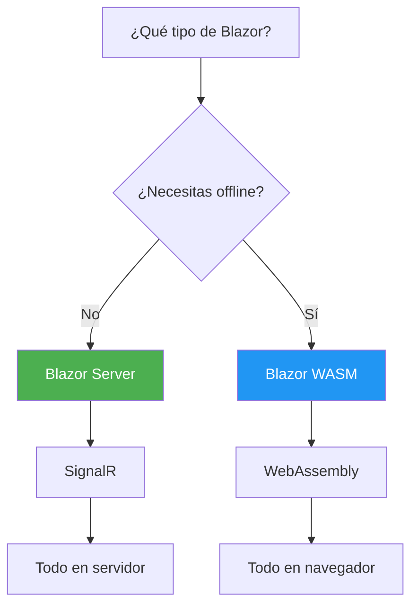
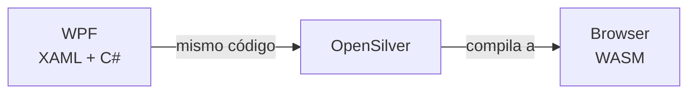
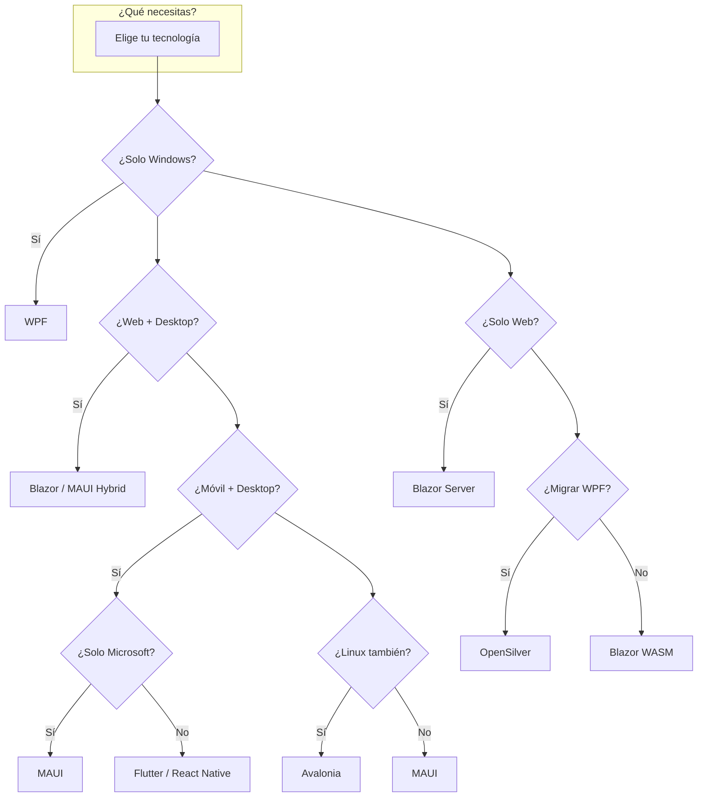
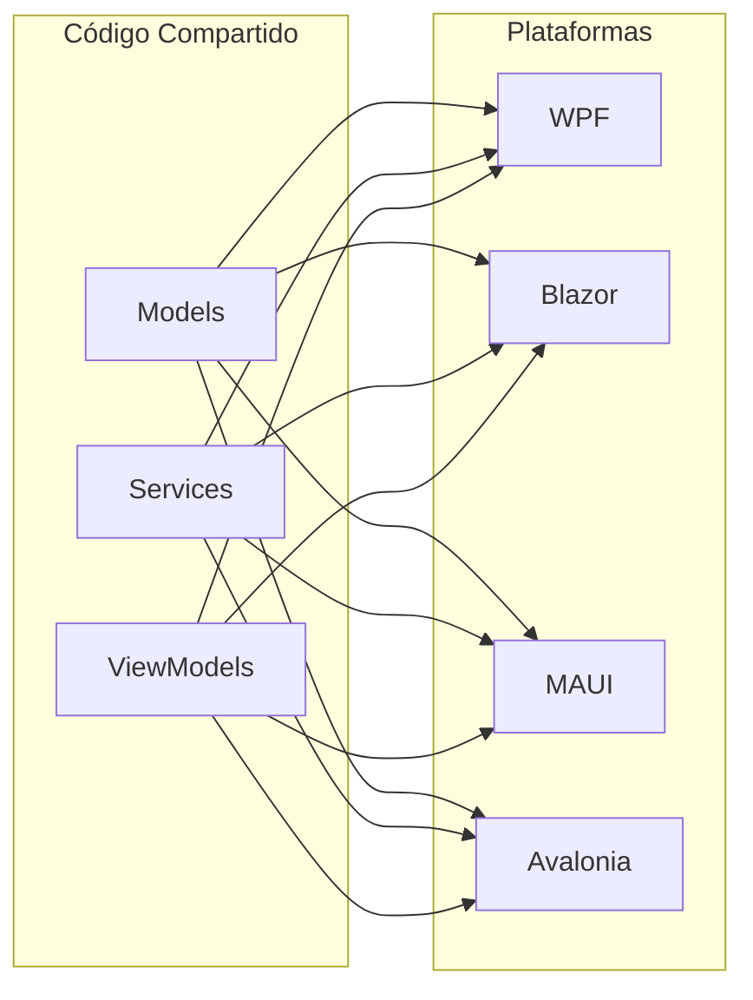

# 13. Desarrollo Multiplataforma y Alternativas

> 📝 **Nota del Profesor**: WPF solo funciona en Windows. Si necesitas multiplataforma, hay alternativas como MAUI, Avalonia, Blazor, OpenSilver, etc. Este documento explica todas las opciones para que puedas elegir la tecnología correcta para cada proyecto.

- [13. Desarrollo Multiplataforma y Alternativas](#13-desarrollo-multiplataforma-y-alternativas)
  - [13.1. El mito de "WPF multiplataforma"](#131-el-mito-de-wpf-multiplataforma)
    - [❌ WPF NO es multiplataforma](#-wpf-no-es-multiplataforma)
  - [13.2. Opciones Reales para Desarrollo Multiplataforma](#132-opciones-reales-para-desarrollo-multiplataforma)
    - [Comparativa de Tecnologías](#comparativa-de-tecnologías)
  - [13.3. .NET MAUI](#133-net-maui)
    - [Qué es y qué ofrece](#qué-es-y-qué-ofrece)
    - [Pros y Contras](#pros-y-contras)
    - [Cuándo usar MAUI](#cuándo-usar-maui)
  - [13.4. Avalonia UI](#134-avalonia-ui)
    - [La alternativa "WPF para todo"](#la-alternativa-wpf-para-todo)
    - [Pros y Contras](#pros-y-contras-1)
    - [Ejemplo de código Avalonia](#ejemplo-de-código-avalonia)
    - [Cuándo usar Avalonia](#cuándo-usar-avalonia)
  - [13.5. Blazor (Web)](#135-blazor-web)
    - [Blazor Server vs Blazor WebAssembly](#blazor-server-vs-blazor-webassembly)
    - [Comparativa Blazor Server vs WASM](#comparativa-blazor-server-vs-wasm)
    - [Pros y Contras de Blazor](#pros-y-contras-de-blazor)
    - [Cuándo usar Blazor](#cuándo-usar-blazor)
  - [13.6. OpenSilver](#136-opensilver)
    - [WPF en el navegador](#wpf-en-el-navegador)
    - [Características](#características)
    - [Pros y Contras](#pros-y-contras-2)
  - [13.7. Tabla Comparativa Completa](#137-tabla-comparativa-completa)
    - [Resumen Visual](#resumen-visual)
  - [13.8. Código Compartido entre Plataformas](#138-código-compartido-entre-plataformas)
    - [El sueño del código compartido](#el-sueño-del-código-compartido)
    - [Cómo lograrlo](#cómo-lograrlo)
  - [11.9. Resumen: Elige Sabiamente](#119-resumen-elige-sabiamente)
    - [Checklist de Decisión](#checklist-de-decisión)
  - [11.10. Recap: Lo que debes recordar](#1110-recap-lo-que-debes-recordar)


## 13.1. El mito de "WPF multiplataforma"

### ❌ WPF NO es multiplataforma

**WPF solo funciona en Windows**, incluso con .NET Core/.NET 5+.



**¿Por qué WPF solo funciona en Windows?**

WPF depende de APIs específicas de Microsoft Windows:
- DirectX (gráficos)
- Windows Desktop Window Manager (DWM)
- GDI+ (renderizado)
- Presentation Foundation (Framework de UI)

Estas APIs **no existen** en Linux ni macOS.

---

## 13.2. Opciones Reales para Desarrollo Multiplataforma

### Comparativa de Tecnologías

| Tecnología | Windows | Linux | macOS | Web | Móvil | curvas |
|------------|---------|-------|-------|-----|-------|--------|
| **WPF** | ✅ | ❌ | ❌ | ❌ | ❌ | - |
| **WinForms** | ✅ | ❌ | ❌ | ❌ | ❌ | - |
| **MAUI** | ✅ | ⚠️ | ✅ | ❌ | ✅ | Media |
| **Avalonia** | ✅ | ✅ | ✅ | ❌ | ⚠️ | Baja |
| **Blazor Server** | ✅ | ✅ | ✅ | ✅ | ⚠️ | Baja |
| **Blazor WASM** | ✅ | ✅ | ✅ | ✅ | ⚠️ | Media |
| **OpenSilver** | ✅ | ✅ | ✅ | ✅ | ❌ | Media |
| **UNO Platform** | ✅ | ✅ | ✅ | ✅ | ✅ | Alta |

---

## 13.3. .NET MAUI

### Qué es y qué ofrece

**MAUI** (.NET Multi-platform App UI) es el reemplazo de Xamarin.Forms. Permite crear aplicaciones que funcionan en:

- Windows (usando el motor de WPF)
- macOS (usando AppKit)
- iOS (usando UIKit)
- Android (usando Android Views)

### Pros y Contras

| ✅ Ventajas | ❌ Desventajas |
|------------|---------------|
| Un código para 4 plataformas |Curva de aprendizaje alta |
| Integración nativa con Visual Studio |Menor control que código nativo |
| Acceso a APIs nativas a través de Essentials |Rendimiento menor que nativo |
| Comunidad activa de Microsoft |Problemas de compatibilidad entre versiones |
| Hot Reload para desarrollo rápido |Bundle de aplicación más grande |

### Cuándo usar MAUI



**Usa MAUI cuando:**
- Necesitas app para iOS + Android desde cero
- Ya conoces WPF (la sintaxis es muy similar)
- Quieres una solución "todo en uno" de Microsoft
- El rendimiento nativo no es crítico

---

## 13.4. Avalonia UI

### La alternativa "WPF para todo"

**Avalonia** es un framework de UI multiplataforma que usa XAML (casi idéntico a WPF) y el patrón MVVM.



### Pros y Contras

| ✅ Ventajas | ❌ Desventajas |
|------------|---------------|
| XAML casi idéntico a WPF |Comunidad más pequeña que MAUI |
| Funciona en Linux/macOS/Windows |Less tooling que WPF |
| Muy buen rendimiento |No tiene "Hot Reload" como MAUI |
|ligero (menos overhead que MAUI) |No tiene acceso directo a APIs nativas |
| Código abierto y gratuito |Documentación menos extensa |
|Excelente para aplicaciones desktop |No para móvil |

### Ejemplo de código Avalonia

```xml
<!-- Avalonia - Casi idéntico a WPF -->
<Window xmlns="https://github.com/avaloniaui"
        xmlns:x="http://schemas.microsoft.com/winfx/2006/xaml"
        Title="Mi App">
    <StackPanel>
        <TextBlock Text="{Binding Mensaje}" />
        <Button Command="{Binding ClickCommand}">Clic</Button>
    </StackPanel>
</Window>
```

### Cuándo usar Avalonia

- Aplicaciones desktop para Windows + Linux + macOS
- Tienes experiencia con WPF y quieres multiplataforma
- No necesitas app móvil (solo desktop)
- Prefieres código abierto sobre soluciones Microsoft

---

## 13.5. Blazor (Web)

### Blazor Server vs Blazor WebAssembly



### Comparativa Blazor Server vs WASM

| Aspecto | Blazor Server | Blazor WASM |
|---------|---------------|-------------|
| **Funciona en** | Navegador (requiere SignalR) | Navegador (standalone) |
| **Servidor necesario** | ✅ Sí | ⚠️ Solo para hosting inicial |
| **Offline** | ❌ No | ✅ Sí (después de cargar) |
| **Tiempo de carga** | Rápido (no descarga binarios) | Lento (descarga .dlls) |
| **Consumo servidor** | Alto (cada usuario = conexión SignalR) | Bajo (solo hosting estático) |
| **SEO** | ✅ Sí | ⚠️ Limited (necesita prerendering) |

### Pros y Contras de Blazor

| ✅ Ventajas | ❌ Desventajes |
|------------|---------------|
| Usa C# en lugar de JavaScript |Carga inicial lenta (WASM) |
| Comparte código con backend .NET |Requiere servidor para Blazor Server |
| Componentes reutilizables |Ecosistema JS más grande |
| Integración con .NET ecosystem |Aprendizaje de paradigma nuevo |
| Perfecto para proyectos .NET |Bundle grande en WASM |

### Cuándo usar Blazor

- Aplicaciones web con backend .NET
- Equipo con experiencia en C#/.NET
- Necesitas reutilizar lógica de negocio
- Prefieres Type-Safe en frontend
- Proyecto nuevo que necesita web + desktop (Blazor Hybrid)

---

## 13.6. OpenSilver

### WPF en el navegador

**OpenSilver** es una implementación de WPF que corre en el navegador usando WebAssembly.



### Características

| Característica | Descripción |
|----------------|-------------|
| **XAML** | Compatible con WPF XAML |
| **C#** | Usa .NET runtime en el navegador |
| **Binding** | Data binding similar a WPF |
| **Migración** | Permite migrar apps WPF a web |

### Pros y Contras

| ✅ Ventajas | ❌ Desventajas |
|------------|---------------|
| Migra apps WPF existentes a web | Rendimiento menor que Blazor puro |
| Usa el mismo XAML | Comunidad pequeña |
| No necesita reescribir todo | Fewer features que WPF completo |

---

## 13.7. Tabla Comparativa Completa



### Resumen Visual

| Necesidad | Recomendación |
|-----------|---------------|
| **App Windows Enterprise** | WPF + CommunityToolkit |
| **App multiplataforma desktop** | Avalonia |
| **App móvil + desktop** | MAUI |
| **Web con backend .NET** | Blazor Server |
| **Web offline/PWA** | Blazor WASM |
| **Migrar WPF a web** | OpenSilver |
| **App móvil nativa** | Kotlin / Swift / Flutter |

---

## 13.8. Código Compartido entre Plataformas

### El sueño del código compartido



### Cómo lograrlo

**1. Librería de clases común**

```csharp
// SharedLibrary/Models/Tarea.cs
public class Tarea
{
    public Guid Id { get; set; }
    public string Titulo { get; set; }
    public bool Completada { get; set; }
}

// SharedLibrary/Services/ITareaService.cs
public interface ITareaService
{
    List<Tarea> GetAll();
    void Add(string titulo);
}
```

**2. Referencias en cada proyecto**

```
Solución/
├── SharedLibrary/          → Models + Services
├── AppWPF/                 → Referencia SharedLibrary
├── AppBlazor/              → Referencia SharedLibrary  
├── AppMAUI/                → Referencia SharedLibrary
└── AppAvalonia/            → Referencia SharedLibrary
```

**3. Implementación específica por plataforma**

```csharp
// AppWPF/Services/TareaService.cs (WPF con persistencia archivo)
public class TareaService : ITareaService { ... }

// AppBlazor/Services/TareaService.cs (Blazor con EF Core)
public class TareaService : ITareaService { ... }

// AppMAUI/Services/TareaService.cs (MAUI con SQLite)
public class TareaService : ITareaService { ... }
```

---

## 13.9. Resumen: Elige Sabiamente

> 💡 **Regla de oro**: No elijas tecnología por "la más nueva" o "la más популярная". Elige según:

1. **Requisitos del proyecto**: ¿Web? ¿Móvil? ¿Desktop?
2. **Equipo**: ¿Ya conocen la tecnología?
3. **Mantenimiento**: ¿Hay soporte a largo plazo?
4. **Rendimiento**: ¿Necesita velocidad nativa?

### Checklist de Decisión

- [ ] ¿Solo Windows? → **WPF**
- [ ] ¿Web con .NET? → **Blazor Server** o **WASM**
- [ ] ¿Móvil + Desktop Microsoft? → **MAUI**
- [ ] ¿Desktop multiplataforma (Linux/macOS)? → **Avalonia**
- [ ] ¿Migrar WPF a web? → **OpenSilver**
- [ ] ¿App nativa máxima rendimiento? → **Kotlin/Swift/Flutter**

---

## 13.10. Recap: Lo que debes recordar

| Concepto | Puntos Clave |
|----------|--------------|
| **WPF** | Solo Windows, XAML, MVVM, DirectX |
| **MAUI** | Multiplataforma (menos Linux), evoluciona de Xamarin |
| **Avalonia** | XAML como WPF, código abierto, excelente para Linux |
| **Blazor** | C# en navegador, Server (SignalR) o WASM |
| **OpenSilver** | WPF en navegador, para migraciones |
| **Código compartido** | Modelos y servicios en librería común |

> 📝 **Nota del Profesor**: La mejor tecnología es la que conoces bien y resuelve el problema. No gastes tiempo aprendiendo 5 frameworks si puedes dominar uno que haga todo lo que necesitas.

> 💡 **Tip del Examinador**: En el examen pueden preguntar: "¿Qué tecnología usarías para una app que funcione en Windows, Linux y macOS?" (Respuesta: Avalonia) o "¿WPF es multiplataforma?" (Respuesta: No, solo Windows).

---