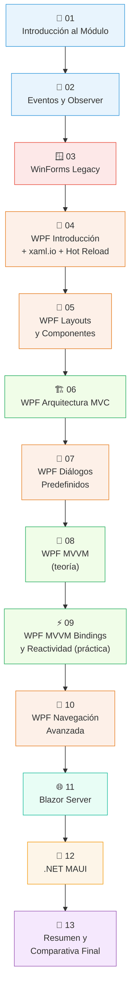
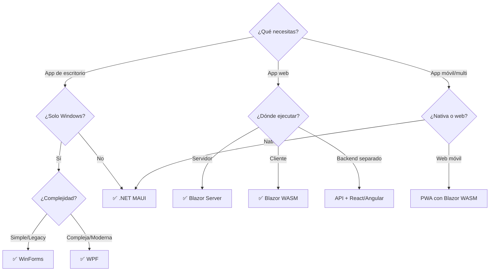
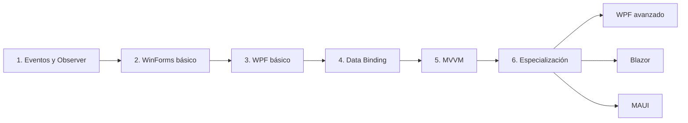
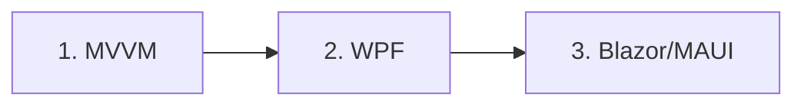

# 13 - Resumen y Comparativa Final

## 1. Recorrido del Curso

Este curso ha cubierto el desarrollo de interfaces gráficas de usuario en el ecosistema .NET, desde los fundamentos teóricos y las tecnologías legacy hasta las más modernas:

### 1.1 Tabla de Temas del Módulo

| # | Tema | Tecnología | Tipo |
|---|------|------------|------|
| 01 | Introducción al Módulo | .NET / Ecosistema | Teoría |
| 02 | Eventos y Patrón Observer | C# | Fundamentos |
| 03 | WinForms (Legado) | WinForms | Legacy |
| 04 | WPF Introducción + xaml.io + Hot Reload | WPF | Moderno |
| 05 | WPF Layouts y Componentes | WPF / XAML | Moderno |
| 06 | WPF Arquitectura MVC | WPF / MVC | Arquitectura |
| 07 | WPF Diálogos Predefinidos | WPF | Moderno |
| 08 | WPF Arquitectura MVVM (teoría) | WPF / MVVM | Arquitectura |
| 09 | WPF MVVM Bindings y Reactividad (práctica) | WPF / CommunityToolkit | Práctica |
| 10 | WPF Navegación Avanzada | WPF | Avanzado |
| 11 | Blazor Server | Blazor | Web |
| 12 | .NET MAUI | MAUI | Multiplataforma |
| 13 | Resumen y Comparativa Final | Todas | Resumen |

### 1.2 Mapa de Aprendizaje



---

## 2. Tabla Comparativa Completa

### 2.1 Comparación General

| Tecnología | Año | Plataformas | Lenguaje UI | Arquitectura | Estado | Cuándo Usar |
|------------|-----|-------------|-------------|--------------|--------|-------------|
| **WinForms** | 2002 | Windows | C# (código) | MVC manual | Legacy estable | Apps internas simples, mantenimiento legacy |
| **WPF** | 2006 | Windows | XAML + C# | MVVM | Estándar enterprise | Apps Windows complejas, enterprise |
| **Blazor Server** | 2019 | Web | Razor (HTML + C#) | Componentes | Moderno | Apps web internas, dashboards |
| **Blazor WASM** | 2020 | Web | Razor (HTML + C#) | Componentes | Moderno | PWAs, apps web sin servidor |
| **MAUI** | 2022 | Multi (Win/Mac/iOS/Android) | XAML + C# | MVVM | Futuro | Apps móviles/multiplataforma |

### 2.2 Comparación Técnica Detallada

| Aspecto | WinForms | WPF | Blazor Server | MAUI |
|---------|----------|-----|---------------|------|
| **Renderizado** | GDI+ (CPU) | DirectX (GPU) | HTML (navegador) | Nativo por plataforma |
| **Rendimiento** | ⚡⚡ Bueno | ⚡⚡⚡ Excelente | ⚡ Depende latencia | ⚡⚡⚡ Nativo |
| **Hot Reload** | ❌ No | ✅ Sí | ✅ Sí | ✅ Sí |
| **Data Binding** | ⚠️ Básico | ✅ Avanzado | ✅ Bidireccional | ✅ Avanzado |
| **Estilos/Temas** | ⚠️ Limitado | ✅ Rico | ✅ CSS | ✅ Rico |
| **Curva aprendizaje** | 📚 Baja | 📚📚 Media | 📚 Baja-Media | 📚📚📚 Alta |
| **Comunidad** | Grande (legacy) | Muy grande | Creciente | Creciente |
| **Jobs** | Mantenimiento | Muchos | Pocos | Pocos |

### 2.3 Comparación de Desarrollo

| Característica | WinForms | WPF | Blazor Server | MAUI |
|----------------|----------|-----|---------------|------|
| **Crear proyecto** | ⚡ Inmediato | ⚡ Rápido | ⚡ Rápido | ⚠️ Configuración compleja |
| **Diseñador visual** | ✅ Excelente | ✅ Bueno | ❌ No (HTML) | ✅ Básico |
| **Debugging** | ✅ Fácil | ✅ Fácil | ⚠️ Más complejo | ⚠️ Depende plataforma |
| **Testing** | ✅ Fácil | ✅ Fácil (MVVM) | ✅ Fácil | ✅ Fácil (MVVM) |
| **Distribución** | 📦 Instalador | 📦 Instalador | 🌐 URL | 📱 App Store/Instalador |
| **Actualizaciones** | Manual | Manual | Automática | Por tienda/manual |
| **Tamaño app** | ~5-10 MB | ~20-50 MB | Mínimo (cliente) | ~50-100 MB |

### 2.4 MVC vs MVVM: Manual vs CommunityToolkit

| Característica | MVC (manual) | MVVM (manual) | MVVM (CommunityToolkit) |
|----------------|-------------|---------------|------------------------|
| **Boilerplate** | Medio | Alto | ✅ Mínimo |
| **INotifyPropertyChanged** | No aplica | Manual (backing field + evento) | `[ObservableProperty]` genera todo |
| **Comandos** | No aplica | `ICommand` implementado a mano | `[RelayCommand]` sobre método |
| **Validación** | Manual | Manual | `[NotifyDataErrorInfo]` + atributos |
| **Generación de código** | No | No | ✅ Source generators en compilación |
| **Testabilidad** | Media | Alta | Alta |
| **Curva de aprendizaje** | Baja | Media | Baja (una vez entendido MVVM) |
| **Ejemplo propiedad** | `TextBox.Text = valor;` | `private string _nombre; public string Nombre { get => _nombre; set { _nombre = value; OnPropertyChanged(); } }` | `[ObservableProperty] private string _nombre;` |
| **Ejemplo comando** | `Button.Click += Handler;` | `public ICommand GuardarCmd { get; } = new RelayCommand(Guardar);` | `[RelayCommand] private void Guardar() { }` |
| **Notificación cruzada** | Manual | `OnPropertyChanged(nameof(OtraPropiedad))` | `[NotifyPropertyChangedFor(nameof(Otra))]` |

---

## 3. Checklist de Conceptos Clave

### 3.1 Fundamentos

- [ ] **Programación orientada a eventos**
  - ✓ Entender el bucle de mensajes
  - ✓ Eventos y delegates
  - ✓ Patrón Observer
  - ✓ Manejadores de eventos

- [ ] **UI Thread**
  - ✓ Hilo único de interfaz
  - ✓ async/await para operaciones largas
  - ✓ Dispatcher/Invoke para actualizar UI

### 3.2 WinForms

- [ ] **Conceptos básicos**
  - ✓ Form y controles básicos
  - ✓ Posicionamiento (Anchor, Dock)
  - ✓ Eventos (Click, TextChanged, etc.)
  - ✓ MessageBox y diálogos

- [ ] **Limitaciones**
  - ✓ Sin data binding automático
  - ✓ Difícil personalización visual
  - ✓ Solo Windows

### 3.3 WPF

- [ ] **XAML**
  - ✓ Sintaxis declarativa
  - ✓ Markup extensions
  - ✓ Recursos y estilos
  - ✓ Templates

- [ ] **Layouts**
  - ✓ Grid (más importante)
  - ✓ StackPanel
  - ✓ DockPanel
  - ✓ WrapPanel, Canvas

- [ ] **Reactividad**
  - ✓ INotifyPropertyChanged
  - ✓ ObservableCollection
  - ✓ PropertyChanged event
  - ✓ CommunityToolkit.Mvvm

- [ ] **Data Binding**
  - ✓ Modos: OneWay, TwoWay, OneTime
  - ✓ UpdateSourceTrigger
  - ✓ DataContext
  - ✓ IValueConverter
  - ✓ StringFormat
  - ✓ ElementName y RelativeSource

- [ ] **Arquitecturas**
  - ✓ MVC: Model-View-Controller
  - ✓ MVVM: Model-View-ViewModel
  - ✓ Commands (ICommand)
  - ✓ [RelayCommand] attribute

- [ ] **Ventanas y Diálogos**
  - ✓ Show() vs ShowDialog()
  - ✓ DialogResult
  - ✓ Pasar y retornar datos
  - ✓ Ciclo de vida (Loaded, Closing, Closed)
  - ✓ OpenFileDialog, SaveFileDialog, ColorDialog

### 3.4 Blazor Server

- [ ] **Fundamentos**
  - ✓ Componentes Razor (.razor)
  - ✓ @code blocks
  - ✓ @page directive
  - ✓ SignalR connection

- [ ] **Binding y Eventos**
  - ✓ @bind syntax
  - ✓ @onclick, @oninput, etc.
  - ✓ EventCallback
  - ✓ Parámetros [Parameter]

- [ ] **Ciclo de vida**
  - ✓ OnInitialized/Async
  - ✓ OnParametersSet/Async
  - ✓ OnAfterRender/Async
  - ✓ StateHasChanged()

- [ ] **Servicios**
  - ✓ Inyección de dependencias
  - ✓ @inject directive
  - ✓ Singleton, Scoped, Transient

### 3.5 .NET MAUI

- [ ] **Multiplataforma**
  - ✓ Proyecto único para 4 plataformas
  - ✓ Platform-specific code
  - ✓ Conditional compilation

- [ ] **XAML en MAUI**
  - ✓ Similitudes con WPF
  - ✓ VerticalStackLayout, HorizontalStackLayout
  - ✓ Entry (vs TextBox)
  - ✓ ContentPage

- [ ] **MVVM en MAUI**
  - ✓ CommunityToolkit.Mvvm
  - ✓ [ObservableProperty]
  - ✓ [RelayCommand]
  - ✓ Data binding

- [ ] **Shell Navigation**
  - ✓ TabBar y FlyoutItems
  - ✓ GoToAsync()
  - ✓ QueryProperty
  - ✓ Route parameters

- [ ] **Essentials**
  - ✓ DeviceInfo
  - ✓ Geolocation
  - ✓ Preferences
  - ✓ Connectivity
  - ✓ MediaPicker

---

## 4. Matriz de Decisión

### 4.1 ¿Qué Tecnología Elegir?



### 4.2 Escenarios de Uso

| Escenario | Tecnología Recomendada | Razón |
|-----------|------------------------|-------|
| App interna de empresa (Windows) | **WPF** | Enterprise-ready, MVVM, maduro |
| Mantenimiento de app existente | **WinForms** | Ya existe, funciona |
| Dashboard web interno | **Blazor Server** | Un solo lenguaje, rápido desarrollo |
| PWA moderna | **Blazor WASM** | Offline, instalable, C# |
| App móvil iOS/Android | **MAUI** | Nativa, multiplataforma |
| App para Windows/Mac/iOS/Android | **MAUI** | Una base de código |
| Prototipo rápido | **Blazor Server** o **WinForms** | Desarrollo veloz |
| App con gráficos complejos | **WPF** | DirectX, animaciones |
| App que requiere máximo rendimiento | **WPF** o **MAUI** | Nativas |

---

## 5. Ruta de Aprendizaje Recomendada

### 5.1 Ruta Seguida en Este Módulo

```mermaid
graph LR
    A["01\nIntroducción"] --> B["02\nEventos y\nObserver"]
    B --> C["03\nWinForms"]
    C --> D["04\nWPF Intro\n+ xaml.io"]
    D --> E["05\nLayouts y\nComponentes"]
    E --> F["06\nMVC"]
    F --> G["07\nDiálogos"]
    G --> H["08\nMVVM\nteoría"]
    H --> I["09\nMVVM\npráctica"]
    I --> J["10\nNavegación\nAvanzada"]
    J --> K["11\nBlazor\nServer"]
    K --> L["12\n.NET MAUI"]
    L --> M["13\nResumen"]

    style A fill:#e8f4fd
    style B fill:#e8f4fd
    style C fill:#fde8e8
    style D fill:#fdf0e8
    style E fill:#fdf0e8
    style F fill:#f0fde8
    style G fill:#fdf0e8
    style H fill:#f0fde8
    style I fill:#f0fde8
    style J fill:#fdf0e8
    style K fill:#e8fdf5
    style L fill:#fdf5e8
    style M fill:#f5e8fd
```



### 5.2 Para Principiantes (Partiendo de Cero)



**Tiempo estimado:** 3-6 meses (4 horas/semana)

### 5.3 Para Desarrolladores con Experiencia



**Tiempo estimado:** 1-2 meses (8 horas/semana)

### 5.4 Habilidades Transferibles

| De | A | Similitud | Dificultad Transición |
|----|---|-----------|----------------------|
| WinForms | WPF | 30% | Media |
| WPF | MAUI | 80% | Baja |
| WPF | Blazor | 40% | Media |
| HTML/CSS | Blazor | 60% | Baja-Media |
| React/Vue | Blazor | 50% | Media |
| Xamarin.Forms | MAUI | 90% | Muy Baja |

---

## 6. Recursos Adicionales

### 6.1 Documentación Oficial

| Tecnología | URL |
|------------|-----|
| .NET | https://learn.microsoft.com/dotnet/ |
| WinForms | https://learn.microsoft.com/dotnet/desktop/winforms/ |
| WPF | https://learn.microsoft.com/dotnet/desktop/wpf/ |
| Blazor | https://learn.microsoft.com/aspnet/core/blazor/ |
| MAUI | https://learn.microsoft.com/dotnet/maui/ |
| CommunityToolkit.Mvvm | https://learn.microsoft.com/dotnet/communitytoolkit/mvvm/ |

### 6.2 Herramientas

- **Visual Studio**: IDE oficial de Microsoft con diseñador XAML integrado
- **JetBrains Rider**: IDE completo para .NET (licencia estudiante gratis)
- **Visual Studio Code**: Editor ligero con extensiones .NET
- **[xaml.io](https://xaml.io)**: Prototipado online de XAML, ideal para experimentar sin instalar nada
- **.NET SDK 10**: https://dotnet.microsoft.com/download
- **Hot Reload**: Disponible en Visual Studio y `dotnet watch` para WPF, Blazor y MAUI

### 6.3 Bibliotecas Útiles

| Biblioteca | Propósito | Tecnologías |
|------------|-----------|-------------|
| **CommunityToolkit.Mvvm** | MVVM simplificado con source generators | WPF, MAUI |
| **MaterialDesignInXaml** | Material Design | WPF |
| **MahApps.Metro** | UI moderna | WPF |
| **Avalonia** | UI multiplataforma | Alternativa a MAUI |
| **Uno Platform** | UI multiplataforma | Alternativa a MAUI |

### 6.4 Libros Recomendados

1. **Pro WPF in C#** - Matthew MacDonald
2. **C# 12 in a Nutshell** - Joseph Albahari
3. **Blazor in Action** - Chris Sainty
4. **.NET MAUI in Action** - Matt Goldman

### 6.5 Canales de YouTube y Blogs

- **IAmTimCorey**: Tutoriales C# y WPF
- **Raw Coding**: Blazor y .NET
- **dotnet** (canal oficial): Actualizaciones y demos
- **Nick Chapsas**: C# avanzado

---

## 7. Próximos Pasos

### 7.1 Después de este Curso

1. **Práctica con proyectos personales**
   - Elige una tecnología
   - Crea 3-5 proyectos completos
   - Sube a GitHub

2. **Especialización**
   - WPF + Entity Framework + SQL Server (enterprise)
   - Blazor + APIs + Azure (cloud)
   - MAUI + SQLite + Firebase (móvil)

3. **Aprendizaje continuo**
   - Seguir actualizaciones de .NET
   - Aprender patrones avanzados (Repository, Unit of Work)
   - Testing (xUnit, NUnit, MSTest)

### 7.2 Tecnologías Complementarias

- **Base de datos**: Entity Framework Core, Dapper
- **APIs**: ASP.NET Core Web API
- **Testing**: xUnit, Moq, FluentAssertions
- **CI/CD**: GitHub Actions, Azure DevOps
- **Contenedores**: Docker, Kubernetes

---

## 8. Preguntas Frecuentes

### 8.1 ¿Debo aprender WinForms en 2025?

**No** si estás empezando de cero y quieres tecnologías modernas.  
**Sí** si:
- Trabajas con código legacy
- Necesitas hacer mantenimiento
- Quieres entender la evolución histórica

### 8.2 ¿WPF está muerto?

**No.** WPF sigue siendo la tecnología estándar para aplicaciones de escritorio Windows enterprise. Microsoft continúa dándole soporte y actualizándola.

### 8.3 ¿Blazor o React?

- **Blazor** si: equipo C#/.NET, backend .NET, integración con ecosistema .NET
- **React** si: equipo JavaScript, más jobs, ecosistema npm, más maduro

### 8.4 ¿MAUI o Flutter/React Native?

- **MAUI** si: equipo C#/.NET, integración con backend .NET
- **Flutter** si: UI muy personalizada, más maduro
- **React Native** si: equipo JavaScript, más jobs

### 8.5 ¿Puedo usar MAUI para apps Windows?

**Sí**, pero WPF es mejor para Windows desktop enterprise por:
- Más maduro
- Más controles y bibliotecas
- Mejor para layouts complejos
- Más soporte empresarial

### 8.6 ¿Para qué sirve xaml.io?

**xaml.io** es un editor XAML online que permite:
- Prototipar interfaces WPF/MAUI sin instalar nada
- Experimentar con layouts y estilos en tiempo real
- Compartir snippets de XAML con compañeros
- Aprender XAML de forma interactiva

---

## 9. Glosario de Términos

| Término | Definición |
|---------|------------|
| **XAML** | eXtensible Application Markup Language - lenguaje declarativo para UI |
| **Data Binding** | Sincronización automática entre datos y UI |
| **MVVM** | Model-View-ViewModel - patrón arquitectónico |
| **MVC** | Model-View-Controller - patrón arquitectónico alternativo |
| **INPC** | INotifyPropertyChanged - interfaz de notificación |
| **CommunityToolkit** | Biblioteca de Microsoft que simplifica MVVM con source generators |
| **Source Generators** | Generación automática de código en tiempo de compilación |
| **Razor** | Sintaxis de mezcla HTML + C# |
| **SignalR** | Biblioteca de comunicación en tiempo real |
| **Hot Reload** | Cambios en código sin reiniciar la aplicación |
| **Delegate** | Tipo que referencia métodos |
| **Event** | Notificación de que algo ocurrió |
| **Command** | Abstracción de acción de usuario (ICommand) |
| **ObservableCollection** | Colección que notifica cambios automáticamente |
| **Dependency Injection** | Patrón de inyección de dependencias |
| **Shell** | Sistema de navegación en MAUI |
| **Essentials** | APIs multiplataforma en MAUI |
| **xaml.io** | Editor XAML online para prototipado |

---

## 10. Resumen Final

### 10.1 Lo Más Importante

1. **Eventos y Observer** son la base de toda GUI
2. **Data Binding** evita sincronización manual
3. **MVVM** es el patrón estándar para WPF y MAUI
4. **CommunityToolkit.Mvvm** elimina el boilerplate de MVVM
5. **Cada tecnología tiene su lugar**: no hay "la mejor"
6. **Practica con proyectos reales** para consolidar

### 10.2 Mensajes Clave

> 💡 **WinForms**: Simple, legacy pero funcional. Ideal para entender eventos.

> 💡 **WPF**: Potente, maduro, estándar enterprise para Windows.

> 💡 **Blazor**: C# en la web. Ideal para equipos .NET.

> 💡 **MAUI**: El futuro multiplataforma de .NET. Una base de código, 4 plataformas.

> 💡 **CommunityToolkit.Mvvm**: MVVM sin boilerplate gracias a los source generators.

### 10.3 Tu Siguiente Proyecto

Elige UNA tecnología y crea un proyecto completo:

- **WPF**: Aplicación de gestión (inventario, contactos, tareas)
- **Blazor**: Dashboard con datos en tiempo real
- **MAUI**: App móvil con acceso a cámara y GPS

**¡No pares de aprender y construir!** 🚀

---

## 11. Agradecimientos y Contacto

Este curso ha sido diseñado para proporcionar una base sólida en el desarrollo de interfaces gráficas con .NET, desde los conceptos fundamentales hasta las tecnologías más modernas.

**Ejemplos completos** de todos los temas están disponibles en:
```
/soluciones/
├── 02-eventos-observer/
├── 03-winforms/
├── 04-wpf-introduccion/
├── 05-wpf-layouts-componentes/
├── 06-wpf-arquitectura-mvc/
├── 07-wpf-dialogos-predefinidos/
├── 08-wpf-arquitectura-mvvm/
├── 09-wpf-mvvm-bindings-reactividad/
├── 10-wpf-navegacion-avanzada/
├── 11-blazor-server/
└── 12-dotnet-maui/
```

---

## 12. Checklist de Finalización del Curso

- [ ] He completado todos los ejercicios propuestos
- [ ] He creado al menos 1 proyecto en cada tecnología principal
- [ ] Entiendo las diferencias entre WinForms, WPF, Blazor y MAUI
- [ ] Sé cuándo usar MVC y cuándo usar MVVM
- [ ] Domino MVVM y data binding con CommunityToolkit.Mvvm
- [ ] He usado xaml.io para prototipar interfaces XAML
- [ ] He configurado mi entorno de desarrollo con Hot Reload
- [ ] He explorado el repositorio /soluciones
- [ ] Tengo proyectos en mi GitHub
- [ ] Sé qué tecnología quiero especializar
- [ ] Estoy listo para proyectos reales

---

**¡Felicidades por completar el curso de Interfaces Gráficas con .NET!** 🎉

---

*Documento elaborado para el módulo de Programación del ciclo formativo 1º DAW · Curso 2025-2026*
