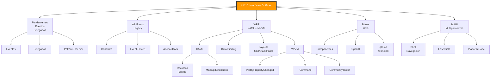

# 14. Resumen y Mapa Mental

- [14. Resumen y Mapa Mental](#14-resumen-y-mapa-mental)
  - [Resumen Ejecutivo](#resumen-ejecutivo)
  - [Mapa Mental](#mapa-mental)
  - [Checklist de Evaluación](#checklist-de-evaluación)
    - [Fundamentos de GUI](#fundamentos-de-gui)
    - [WinForms](#winforms)
    - [WPF](#wpf)
    - [MVVM](#mvvm)
    - [Desarrollo Multiplataforma](#desarrollo-multiplataforma)

## Resumen Ejecutivo

Esta unidad ha cubierto el desarrollo de **interfaces gráficas de usuario** en el ecosistema .NET, incluyendo:

1. **Fundamentos**: Eventos, delegados y patrón Observer
2. **WinForms**: Primera GUI de .NET (2002), modelo imperativo, GDI+
3. **WPF**: XAML declarativo, DirectX, data binding avanzado, MVVM
4. **XAML**: Sintaxis declarativa, recursos, estilos, data binding
5. **Layouts**: Grid, StackPanel, DockPanel, WrapPanel, Canvas
6. **Arquitecturas**: MVC vs MVVM
7. **MVVM**: INotifyPropertyChanged, ICommand, CommunityToolkit.Mvvm
8. **Bindings**: OneWay, TwoWay, OneTime, converters
9. **Navegación**: Show() vs ShowDialog(), pasar datos entre ventanas
10. **Diálogos**: MessageBox, OpenFileDialog, SaveFileDialog
11. **Blazor Server**: C# en la web, SignalR, componentes Razor
12. **.NET MAUI**: Multiplataforma (Win/Mac/iOS/Android), Shell
13. **Estilos y Temas**: Recursos, triggers, templates, MaterialDesign, MahApps
14. **Desarrollo Multiplataforma**: WPF solo Windows, alternativas (Avalonia, Blazor, OpenSilver)

## Mapa Mental

## Checklist de Evaluación

### Fundamentos de GUI
- [ ] Entiendo qué son eventos y delegados en C#
- [ ] Conozco el patrón Observer y cómo se implementa en .NET
- [ ] Sé qué es el UI Thread y por qué existe

### WinForms
- [ ] Puedo crear una aplicación WinForms básica
- [ ] Conozco los controles fundamentales (Button, TextBox, Label, ComboBox)
- [ ] Sé usar Anchor y Dock para layouts responsivos
- [ ] Entienden el modelo imperativo vs declarativo

### WPF
- [ ] Sé escribir XAML básico
- [ ] Conozco la diferencia entre WinForms y WPF
- [ ] Dominos los principales layouts: Grid, StackPanel, DockPanel
- [ ] Sé usar data binding con sintaxis {Binding}
- [ ] Conozco los modos de binding: OneWay, TwoWay, OneTime

### MVVM
- [ ] Entiendo el patrón Model-View-ViewModel
- [ ] Sé implementar INotifyPropertyChanged manualmente
- [ ] Uso CommunityToolkit.Mvvm con [ObservableProperty]
- [ ] Sé crear comandos con [RelayCommand]
- [ ] Conozco la diferencia entre MVC y MVVM

### Blazor Server
- [ ] Sé crear una página Blazor con @page
- [ ] Uso binding con @bind y eventos con @onclick
- [ ] Conozco el ciclo de vida de los componentes
- [ ] Sé inyectar servicios con @inject

### .NET MAUI
- [ ] Conozco la diferencia entre WPF y MAUI
- [ ] Uso layouts específicos de MAUI (VerticalStackLayout)
- [ ] Sé usar Shell para navegación
- [ ] Conozco las Essentials para APIs nativas

### Desarrollo Multiplataforma
- [ ] Sé que WPF solo funciona en Windows
- [ ] Conozco alternativas: Avalonia, Blazor, OpenSilver
- [ ] Sé cuándo usar cada tecnología según el proyecto
- [ ] Conozco el concepto de código compartido entre plataformas

> 📝 **Nota del Profesor**: Esta unidad es práctica. La clave es practicar mucho con código. No te limites a leer, ¡escribe código!

> 💡 **Tip del Examinador**: En el examen suelen preguntar sobre las diferencias entre WinForms y WPF, el patrón MVVM (INotifyPropertyChanged, ICommand), async/await para UI, y cuándo usar cada tecnología. Repasa los conceptos de data binding.
