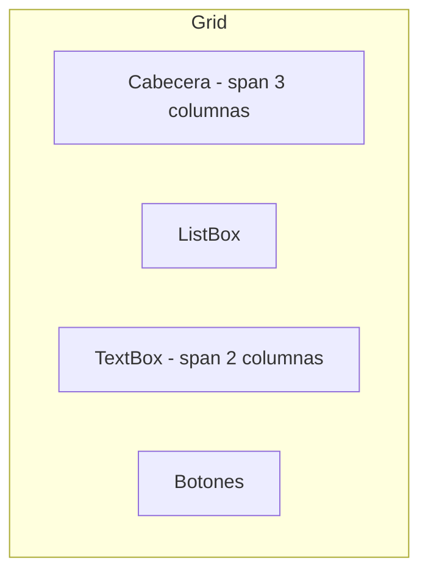

# 04 - Introducción a Windows Presentation Foundation (WPF)

## 1. ¿Qué es WPF?

**Windows Presentation Foundation (WPF)** es el framework de interfaz gráfica de usuario de Microsoft introducido en 2006 con .NET Framework 3.0. WPF representa un cambio radical respecto a Windows Forms, introduciendo un **modelo declarativo** basado en XAML y un motor de renderizado basado en **DirectX**.

### 1.1 ¿Por qué existe WPF?

Windows Forms tenía limitaciones fundamentales:

- ❌ Renderizado por CPU (GDI+) → interfaces lentas
- ❌ Personalización limitada de controles
- ❌ Difícil separación entre diseño y lógica
- ❌ Problemas con pantallas de alta resolución (HiDPI)
- ❌ Animaciones limitadas

**WPF soluciona estos problemas:**

- ✅ Renderizado por GPU (DirectX) → interfaces fluidas
- ✅ Personalización total mediante estilos y plantillas
- ✅ Separación clara: XAML (diseño) + C# (lógica)
- ✅ Soporte nativo para HiDPI/DPI-awareness
- ✅ Motor de animaciones integrado
- ✅ Data binding bidireccional avanzado
- ✅ Arquitectura MVVM nativa

---

## 2. XAML: eXtensible Application Markup Language

### 2.1 ¿Qué es XAML?

**XAML** (pronunciado "zaml") es un lenguaje de marcado declarativo basado en XML para definir interfaces de usuario. Es similar a HTML pero orientado a crear objetos .NET.

**Características clave:**

- 📝 **Declarativo**: describes *qué* quieres, no *cómo* conseguirlo
- 🎨 **Separación de responsabilidades**: diseño (XAML) vs. lógica (C#)
- 🔧 **Herramientas visuales**: diseñadores WYSIWYG en Rider/Visual Studio
- 🔄 **Sincronización**: cambios en XAML reflejan inmediatamente en el diseñador

### 2.2 Estructura Básica de un Archivo XAML

```xml
<Window x:Class="MiApp.MainWindow"
        xmlns="http://schemas.microsoft.com/winfx/2006/xaml/presentation"
        xmlns:x="http://schemas.microsoft.com/winfx/2006/xaml"
        Title="Mi Ventana WPF" Height="450" Width="800">
    <Grid>
        <!-- Contenido aquí -->
    </Grid>
</Window>
```

**Desglose:**

| Elemento | Descripción |
|----------|-------------|
| `x:Class` | Clase C# asociada al XAML (code-behind) |
| `xmlns` | Namespace por defecto de WPF |
| `xmlns:x` | Namespace de extensiones XAML |
| `Title`, `Height`, `Width` | Propiedades del Window |
| `<Grid>` | Contenedor de layout |

### 2.3 Relación entre XAML y C#

```xml
<!-- MainWindow.xaml -->
<Window x:Class="MiApp.MainWindow"
        xmlns="http://schemas.microsoft.com/winfx/2006/xaml/presentation"
        xmlns:x="http://schemas.microsoft.com/winfx/2006/xaml"
        Title="Contador" Height="200" Width="300">
    <StackPanel Margin="20">
        <TextBlock x:Name="txtContador" Text="0" FontSize="48" 
                   HorizontalAlignment="Center" />
        <Button x:Name="btnIncrementar" Content="Incrementar" 
                Height="40" Margin="0,20,0,0" />
    </StackPanel>
</Window>
```

```csharp
// MainWindow.xaml.cs
namespace MiApp;

public partial class MainWindow : Window
{
    private int contador = 0;
    
    public MainWindow()
    {
        InitializeComponent(); // Carga el XAML
        
        // Asignar eventos
        btnIncrementar.Click += (s, e) =>
        {
            contador++;
            txtContador.Text = contador.ToString();
        };
    }
}
```

### 2.4 Sintaxis XAML Avanzada

#### Propiedades como Atributos vs. Elementos

```xml
<!-- Forma 1: Atributo -->
<Button Content="Haz clic" Background="Blue" />

<!-- Forma 2: Elemento (cuando el valor es complejo) -->
<Button>
    <Button.Content>
        <StackPanel>
            <Image Source="icon.png" Width="32" Height="32" />
            <TextBlock Text="Con Icono" />
        </StackPanel>
    </Button.Content>
    <Button.Background>
        <LinearGradientBrush>
            <GradientStop Color="Blue" Offset="0" />
            <GradientStop Color="LightBlue" Offset="1" />
        </LinearGradientBrush>
    </Button.Background>
</Button>
```

#### Content Property

Cada control tiene una propiedad `Content` implícita:

```xml
<!-- Forma larga -->
<Button>
    <Button.Content>
        Texto del botón
    </Button.Content>
</Button>

<!-- Forma corta (Content es implícito) -->
<Button>
    Texto del botón
</Button>

<!-- Para paneles, la propiedad implícita es Children -->
<StackPanel>
    <TextBlock Text="Elemento 1" />
    <TextBlock Text="Elemento 2" />
</StackPanel>
```

#### Markup Extensions

```xml
<!-- StaticResource: referencia a un recurso -->
<Button Background="{StaticResource MiColor}" />

<!-- Binding: vinculación de datos -->
<TextBlock Text="{Binding NombrePropiedad}" />

<!-- x:Null: valor nulo -->
<Button Background="{x:Null}" />

<!-- x:Static: acceso a miembros estáticos -->
<TextBlock Text="{x:Static sys:Environment.MachineName}" />
```

---

## 3. Contenedores de Layout

Los **contenedores de layout** (o *panels*) son elementos que organizan los controles hijos de forma automática. A diferencia de WinForms (posicionamiento absoluto), WPF favorece layouts dinámicos que se adaptan al tamaño de la ventana.

### 3.1 Grid

El **Grid** divide el espacio en filas y columnas, similar a una tabla HTML. Es el contenedor más versátil y usado.

```xml
<Grid>
    <!-- Definir filas y columnas -->
    <Grid.RowDefinitions>
        <RowDefinition Height="Auto" />      <!-- Altura automática -->
        <RowDefinition Height="*" />         <!-- Toma espacio restante -->
        <RowDefinition Height="50" />        <!-- Altura fija -->
    </Grid.RowDefinitions>
    
    <Grid.ColumnDefinitions>
        <ColumnDefinition Width="200" />     <!-- Ancho fijo -->
        <ColumnDefinition Width="2*" />      <!-- 2 partes del espacio -->
        <ColumnDefinition Width="*" />       <!-- 1 parte del espacio -->
    </Grid.ColumnDefinitions>
    
    <!-- Colocar elementos -->
    <TextBlock Text="Cabecera" Grid.Row="0" Grid.Column="0" 
               Grid.ColumnSpan="3" Background="LightGray" Padding="10" />
    
    <ListBox Grid.Row="1" Grid.Column="0" />
    
    <TextBox Grid.Row="1" Grid.Column="1" Grid.ColumnSpan="2" 
             VerticalScrollBarVisibility="Auto" />
    
    <StackPanel Grid.Row="2" Grid.Column="0" Grid.ColumnSpan="3" 
                Orientation="Horizontal" HorizontalAlignment="Right">
        <Button Content="Aceptar" Margin="5" Width="80" />
        <Button Content="Cancelar" Margin="5" Width="80" />
    </StackPanel>
</Grid>
```

**Propiedades de tamaño:**

| Valor | Descripción | Ejemplo |
|-------|-------------|---------|
| `Auto` | Se ajusta al contenido | `Height="Auto"` |
| `*` | Toma parte proporcional del espacio restante | `Width="*"` (1 parte) |
| `2*` | Toma 2 partes del espacio restante | `Width="2*"` |
| `100` | Tamaño fijo en pixels | `Height="100"` |

**Visualización del Grid anterior:**



### 3.2 StackPanel

**StackPanel** apila los elementos uno tras otro, horizontal o verticalmente.

```xml
<!-- Vertical (por defecto) -->
<StackPanel>
    <TextBlock Text="Elemento 1" Background="Red" Margin="5" />
    <TextBlock Text="Elemento 2" Background="Green" Margin="5" />
    <TextBlock Text="Elemento 3" Background="Blue" Margin="5" />
</StackPanel>

<!-- Horizontal -->
<StackPanel Orientation="Horizontal">
    <Button Content="Botón 1" Margin="5" />
    <Button Content="Botón 2" Margin="5" />
    <Button Content="Botón 3" Margin="5" />
</StackPanel>
```

**Características:**

- ✅ Simple y predecible
- ✅ Ideal para barras de herramientas, menús
- ⚠️ No colapsa elementos que no caben (se sale del contenedor)

### 3.3 DockPanel

**DockPanel** acopla elementos a los lados (Top, Bottom, Left, Right). El último elemento ocupa el espacio restante.

```xml
<DockPanel>
    <Menu DockPanel.Dock="Top">
        <MenuItem Header="Archivo" />
        <MenuItem Header="Editar" />
    </Menu>
    
    <StatusBar DockPanel.Dock="Bottom">
        <TextBlock Text="Listo" />
    </StatusBar>
    
    <TreeView DockPanel.Dock="Left" Width="200" />
    
    <!-- El último elemento toma el espacio restante -->
    <TextBox VerticalScrollBarVisibility="Auto" />
</DockPanel>
```

**Resultado visual:**

```
┌─────────────────────────────┐
│       Menu (Top)            │
├────────┬────────────────────┤
│ Tree   │                    │
│ View   │     TextBox        │
│(Left)  │   (espacio rest.)  │
├────────┴────────────────────┤
│    StatusBar (Bottom)       │
└─────────────────────────────┘
```

### 3.4 WrapPanel

**WrapPanel** coloca elementos en línea y salta a la siguiente cuando no hay espacio.

```xml
<WrapPanel Orientation="Horizontal">
    <Button Content="Botón 1" Width="100" Height="40" Margin="5" />
    <Button Content="Botón 2" Width="100" Height="40" Margin="5" />
    <Button Content="Botón 3" Width="100" Height="40" Margin="5" />
    <Button Content="Botón 4" Width="100" Height="40" Margin="5" />
    <Button Content="Botón 5" Width="100" Height="40" Margin="5" />
    <!-- Si no caben, continúa en la siguiente línea -->
</WrapPanel>
```

**Útil para:** galerías de imágenes, colecciones de botones

### 3.5 Canvas

**Canvas** permite posicionamiento absoluto mediante coordenadas X/Y.

```xml
<Canvas>
    <Ellipse Fill="Red" Width="50" Height="50" 
             Canvas.Left="10" Canvas.Top="10" />
    <Rectangle Fill="Blue" Width="100" Height="60" 
               Canvas.Left="80" Canvas.Top="30" />
    <TextBlock Text="Posicionado" 
               Canvas.Left="50" Canvas.Top="100" 
               FontSize="16" />
</Canvas>
```

**Uso:** gráficos, juegos, diagramas. Evitar para layouts de UI general.

### 3.6 UniformGrid

**UniformGrid** crea una cuadrícula donde todas las celdas tienen el mismo tamaño.

```xml
<UniformGrid Columns="3" Rows="2">
    <Button Content="1" />
    <Button Content="2" />
    <Button Content="3" />
    <Button Content="4" />
    <Button Content="5" />
    <Button Content="6" />
</UniformGrid>
```

**Resultado:** una cuadrícula 3×2 donde cada botón ocupa exactamente el mismo espacio.

### 3.7 Tabla Comparativa de Layouts

| Layout | Uso Principal | Ventajas | Desventajas |
|--------|---------------|----------|-------------|
| `Grid` | Layout general, formularios | Muy flexible, poderoso | Más complejo de configurar |
| `StackPanel` | Listas verticales/horizontales | Simple, predecible | No adapta tamaño |
| `DockPanel` | Layouts con barras laterales | Bueno para apps tipo IDE | Menos flexible |
| `WrapPanel` | Galerías, colecciones | Responsivo | Difícil controlar orden |
| `Canvas` | Gráficos, diagramas | Control total | No responsivo |
| `UniformGrid` | Teclados, matrices uniformes | Automático y simétrico | Todas las celdas iguales |

---

## 4. Controles Básicos de WPF

### 4.1 Controles de Texto

#### TextBlock

Muestra texto de solo lectura (equivalente a `Label` en WinForms).

```xml
<TextBlock Text="Texto simple" />

<TextBlock FontSize="24" FontWeight="Bold" Foreground="Blue">
    Texto con estilo
</TextBlock>

<TextBlock TextWrapping="Wrap" Width="200">
    Este texto se ajustará automáticamente al ancho especificado.
</TextBlock>

<!-- TextBlock con formato inline -->
<TextBlock>
    Este texto tiene una palabra en <Bold>negrita</Bold> y otra en <Italic>cursiva</Italic>.
</TextBlock>
```

#### TextBox

Entrada de texto editable.

```xml
<!-- TextBox simple -->
<TextBox Text="Texto inicial" />

<!-- TextBox multilínea -->
<TextBox AcceptsReturn="True" TextWrapping="Wrap" 
         VerticalScrollBarVisibility="Auto" Height="100" />

<!-- TextBox con watermark (placeholder) -->
<TextBox>
    <TextBox.Style>
        <Style TargetType="TextBox">
            <Style.Triggers>
                <Trigger Property="Text" Value="">
                    <Setter Property="Background">
                        <Setter.Value>
                            <VisualBrush Stretch="None">
                                <VisualBrush.Visual>
                                    <TextBlock Text="Escribe aquí..." 
                                               Foreground="Gray" />
                                </VisualBrush.Visual>
                            </VisualBrush>
                        </Setter.Value>
                    </Setter>
                </Trigger>
            </Style.Triggers>
        </Style>
    </TextBox.Style>
</TextBox>
```

#### PasswordBox

Entrada de contraseña oculta.

```xml
<PasswordBox x:Name="pwdPassword" PasswordChar="●" />
```

**Acceder a la contraseña en C#:**

```csharp
string password = pwdPassword.Password;
```

### 4.2 Controles de Acción

#### Button

```xml
<!-- Botón simple -->
<Button Content="Haz clic" Click="Button_Click" />

<!-- Botón con contenido complejo -->
<Button Height="60" Width="120">
    <StackPanel>
        <TextBlock Text="🔍" FontSize="24" HorizontalAlignment="Center" />
        <TextBlock Text="Buscar" HorizontalAlignment="Center" />
    </StackPanel>
</Button>
```

**Code-behind:**

```csharp
private void Button_Click(object sender, RoutedEventArgs e)
{
    MessageBox.Show("¡Botón clicado!");
}
```

#### CheckBox

```xml
<CheckBox Content="Acepto los términos" IsChecked="True" />

<CheckBox x:Name="chkNotificar" 
          Content="Recibir notificaciones por email" 
          Checked="ChkNotificar_Checked" />
```

```csharp
private void ChkNotificar_Checked(object sender, RoutedEventArgs e)
{
    bool estaActivado = chkNotificar.IsChecked == true;
    MessageBox.Show($"Notificaciones: {estaActivado}");
}
```

#### RadioButton

```xml
<StackPanel>
    <TextBlock Text="Selecciona una opción:" Margin="0,0,0,10" />
    
    <!-- RadioButtons del mismo GroupName son mutuamente exclusivos -->
    <RadioButton Content="Opción A" GroupName="Opciones" IsChecked="True" />
    <RadioButton Content="Opción B" GroupName="Opciones" />
    <RadioButton Content="Opción C" GroupName="Opciones" />
</StackPanel>
```

### 4.3 Controles de Selección

#### ComboBox

```xml
<!-- ComboBox con items definidos en XAML -->
<ComboBox SelectedIndex="0">
    <ComboBoxItem Content="España" />
    <ComboBoxItem Content="México" />
    <ComboBoxItem Content="Argentina" />
</ComboBox>

<!-- ComboBox vinculado a código -->
<ComboBox x:Name="cmbPaises" DisplayMemberPath="Name" />
```

```csharp
// C#: Poblar ComboBox
public class Pais
{
    public string Name { get; set; }
    public string Code { get; set; }
}

public MainWindow()
{
    InitializeComponent();
    
    cmbPaises.ItemsSource = new List<Pais>
    {
        new() { Name = "España", Code = "ES" },
        new() { Name = "México", Code = "MX" },
        new() { Name = "Argentina", Code = "AR" }
    };
}
```

#### ListBox

```xml
<ListBox x:Name="lstElementos" Height="150">
    <ListBoxItem Content="Elemento 1" />
    <ListBoxItem Content="Elemento 2" />
    <ListBoxItem Content="Elemento 3" />
</ListBox>
```

```csharp
// Añadir items dinámicamente
lstElementos.Items.Add("Elemento 4");

// Obtener item seleccionado
if (lstElementos.SelectedItem != null)
{
    string seleccionado = ((ListBoxItem)lstElementos.SelectedItem).Content.ToString();
}
```

### 4.4 Controles de Visualización

#### Image

```xml
<!-- Desde archivo local -->
<Image Source="/imagenes/logo.png" Width="200" Height="100" />

<!-- Desde URL -->
<Image Source="https://ejemplo.com/imagen.jpg" />

<!-- Con Stretch mode -->
<Image Source="foto.jpg" Stretch="UniformToFill" />
```

**Modos de Stretch:**

| Modo | Descripción |
|------|-------------|
| `None` | Tamaño original |
| `Fill` | Rellena todo el espacio (puede deformar) |
| `Uniform` | Escala proporcionalmente (puede dejar espacio) |
| `UniformToFill` | Escala y recorta para llenar |

#### ProgressBar

```xml
<!-- Indeterminada (animación continua) -->
<ProgressBar IsIndeterminate="True" Height="20" />

<!-- Con valor específico -->
<ProgressBar Minimum="0" Maximum="100" Value="45" Height="20" />
```

```csharp
// Actualizar progreso
progressBar.Value = 75;
```

### 4.5 Controles de Fecha y Hora

#### DatePicker

```xml
<DatePicker x:Name="dateFechaNacimiento" 
            DisplayDateStart="1900-01-01" 
            DisplayDateEnd="{x:Static sys:DateTime.Today}" />
```

```csharp
// Obtener fecha seleccionada
if (dateFechaNacimiento.SelectedDate.HasValue)
{
    DateTime fecha = dateFechaNacimiento.SelectedDate.Value;
}
```

#### Calendar

```xml
<Calendar x:Name="calendario" 
          SelectionMode="SingleDate" 
          DisplayDate="2025-01-01" />
```

---

## 5. Propiedades Comunes de los Controles

### 5.1 Propiedades de Tamaño y Posición

```xml
<Button Width="100" Height="40" />

<Button MinWidth="80" MaxWidth="200" />

<Button Margin="10" />          <!-- 10 en todos los lados -->
<Button Margin="10,5" />        <!-- 10 horizontal, 5 vertical -->
<Button Margin="10,5,15,20" />  <!-- Izq, Arr, Der, Abajo -->

<Button Padding="10" />         <!-- Espacio interno -->
```

### 5.2 Propiedades de Alineación

```xml
<Button HorizontalAlignment="Left" />     <!-- Left, Center, Right, Stretch -->
<Button VerticalAlignment="Top" />        <!-- Top, Center, Bottom, Stretch -->

<TextBlock HorizontalAlignment="Center" 
           VerticalAlignment="Center" 
           Text="Centrado" />
```

### 5.3 Propiedades de Apariencia

```xml
<Button Background="Blue" Foreground="White" />

<Button Background="#FF5733" />  <!-- Color hexadecimal -->

<Button FontSize="16" FontWeight="Bold" FontFamily="Arial" />

<Button Opacity="0.5" />  <!-- 0 = transparente, 1 = opaco -->

<Button IsEnabled="False" />  <!-- Deshabilitado -->

<Button Visibility="Collapsed" />  <!-- Hidden, Visible, Collapsed -->
```

**Diferencia entre `Hidden` y `Collapsed`:**

- `Hidden`: oculto pero ocupa espacio
- `Collapsed`: oculto y NO ocupa espacio

---

## 6. Eventos en WPF

### 6.1 Eventos Más Comunes

```xml
<Button Click="Button_Click" 
        MouseEnter="Button_MouseEnter"
        MouseLeave="Button_MouseLeave" />

<TextBox TextChanged="TextBox_TextChanged" 
         KeyDown="TextBox_KeyDown" />

<Window Loaded="Window_Loaded" 
        Closing="Window_Closing" />
```

### 6.2 Routed Events

WPF introduce el concepto de **eventos enrutados** (*routed events*) que pueden propagarse hacia arriba (bubbling) o hacia abajo (tunneling) en el árbol visual.

```xml
<Grid MouseDown="Grid_MouseDown">
    <StackPanel MouseDown="StackPanel_MouseDown">
        <Button Content="Clic aquí" MouseDown="Button_MouseDown" />
    </StackPanel>
</Grid>
```

```csharp
private void Button_MouseDown(object sender, MouseButtonEventArgs e)
{
    MessageBox.Show("Evento en Button");
    // e.Handled = true; // Detiene la propagación
}

private void StackPanel_MouseDown(object sender, MouseButtonEventArgs e)
{
    MessageBox.Show("Evento en StackPanel");
}

private void Grid_MouseDown(object sender, MouseButtonEventArgs e)
{
    MessageBox.Show("Evento en Grid");
}
```

**Sin `e.Handled = true`:** Se ejecutan los 3 manejadores (bubbling).  
**Con `e.Handled = true`:** Solo se ejecuta el del Button.

---

## 7. Hot Reload en Rider

**Hot Reload** permite ver cambios en XAML sin reiniciar la aplicación.

### 7.1 Configuración en Rider

1. Ejecuta tu aplicación WPF en modo **Debug**
2. Modifica el XAML (cambiar texto, colores, tamaños)
3. Guarda el archivo (`Ctrl+S`)
4. Los cambios se reflejan **instantáneamente** en la ventana en ejecución

**Limitaciones:**

- ✅ Funciona: cambios en propiedades, añadir controles visuales
- ❌ No funciona: cambios en code-behind, añadir eventos nuevos

### 7.2 Workflow Recomendado

1. Diseña la interfaz en XAML con Hot Reload activo
2. Ajusta visualmente hasta estar satisfecho
3. Añade eventos y lógica en C#
4. Reinicia la aplicación para probar la lógica

---

## 8. Prototipado Rápido con xaml.io

**xaml.io** (https://xaml.io) es una herramienta online para prototipar interfaces XAML sin necesidad de IDE.

**Ventajas:**

- ✅ Acceso desde cualquier navegador
- ✅ Vista previa en tiempo real
- ✅ Snippets de código predefinidos
- ✅ Compartir diseños mediante URL

**Ejemplo en xaml.io:**

```xml
<StackPanel xmlns="http://schemas.microsoft.com/winfx/2006/xaml/presentation"
            xmlns:x="http://schemas.microsoft.com/winfx/2006/xaml"
            Margin="20">
    
    <TextBlock Text="Calculadora Simple" 
               FontSize="24" FontWeight="Bold" 
               HorizontalAlignment="Center" 
               Margin="0,0,0,20" />
    
    <TextBox x:Name="txtDisplay" 
             Text="0" 
             FontSize="32" 
             TextAlignment="Right" 
             Margin="0,0,0,10" />
    
    <UniformGrid Columns="4" Rows="4">
        <Button Content="7" FontSize="20" Margin="2" />
        <Button Content="8" FontSize="20" Margin="2" />
        <Button Content="9" FontSize="20" Margin="2" />
        <Button Content="/" FontSize="20" Margin="2" />
        <Button Content="4" FontSize="20" Margin="2" />
        <Button Content="5" FontSize="20" Margin="2" />
        <Button Content="6" FontSize="20" Margin="2" />
        <Button Content="*" FontSize="20" Margin="2" />
        <Button Content="1" FontSize="20" Margin="2" />
        <Button Content="2" FontSize="20" Margin="2" />
        <Button Content="3" FontSize="20" Margin="2" />
        <Button Content="-" FontSize="20" Margin="2" />
        <Button Content="0" FontSize="20" Margin="2" />
        <Button Content="C" FontSize="20" Margin="2" />
        <Button Content="=" FontSize="20" Margin="2" />
        <Button Content="+" FontSize="20" Margin="2" />
    </UniformGrid>
</StackPanel>
```

---

## 9. Ejemplo Completo: Formulario de Contacto

### 9.1 XAML

```xml
<Window x:Class="FormularioContacto.MainWindow"
        xmlns="http://schemas.microsoft.com/winfx/2006/xaml/presentation"
        xmlns:x="http://schemas.microsoft.com/winfx/2006/xaml"
        Title="Formulario de Contacto" Height="500" Width="450"
        WindowStartupLocation="CenterScreen">
    
    <Grid Margin="20">
        <Grid.RowDefinitions>
            <RowDefinition Height="Auto" />
            <RowDefinition Height="Auto" />
            <RowDefinition Height="Auto" />
            <RowDefinition Height="Auto" />
            <RowDefinition Height="Auto" />
            <RowDefinition Height="*" />
            <RowDefinition Height="Auto" />
            <RowDefinition Height="Auto" />
        </Grid.RowDefinitions>
        
        <Grid.ColumnDefinitions>
            <ColumnDefinition Width="120" />
            <ColumnDefinition Width="*" />
        </Grid.ColumnDefinitions>
        
        <!-- Nombre -->
        <TextBlock Grid.Row="0" Grid.Column="0" Text="Nombre:" 
                   VerticalAlignment="Center" Margin="0,0,10,0" />
        <TextBox Grid.Row="0" Grid.Column="1" x:Name="txtNombre" 
                 Margin="0,5" />
        
        <!-- Email -->
        <TextBlock Grid.Row="1" Grid.Column="0" Text="Email:" 
                   VerticalAlignment="Center" Margin="0,0,10,0" />
        <TextBox Grid.Row="1" Grid.Column="1" x:Name="txtEmail" 
                 Margin="0,5" />
        
        <!-- Teléfono -->
        <TextBlock Grid.Row="2" Grid.Column="0" Text="Teléfono:" 
                   VerticalAlignment="Center" Margin="0,0,10,0" />
        <TextBox Grid.Row="2" Grid.Column="1" x:Name="txtTelefono" 
                 Margin="0,5" />
        
        <!-- Asunto -->
        <TextBlock Grid.Row="3" Grid.Column="0" Text="Asunto:" 
                   VerticalAlignment="Center" Margin="0,0,10,0" />
        <ComboBox Grid.Row="3" Grid.Column="1" x:Name="cmbAsunto" 
                  Margin="0,5">
            <ComboBoxItem Content="Consulta General" IsSelected="True" />
            <ComboBoxItem Content="Soporte Técnico" />
            <ComboBoxItem Content="Ventas" />
            <ComboBoxItem Content="Otro" />
        </ComboBox>
        
        <!-- Urgente -->
        <CheckBox Grid.Row="4" Grid.Column="1" x:Name="chkUrgente" 
                  Content="Marcar como urgente" Margin="0,5" />
        
        <!-- Mensaje -->
        <TextBlock Grid.Row="5" Grid.Column="0" Text="Mensaje:" 
                   VerticalAlignment="Top" Margin="0,5,10,0" />
        <TextBox Grid.Row="5" Grid.Column="1" x:Name="txtMensaje" 
                 AcceptsReturn="True" TextWrapping="Wrap" 
                 VerticalScrollBarVisibility="Auto" Margin="0,5" />
        
        <!-- Botones -->
        <StackPanel Grid.Row="6" Grid.Column="0" Grid.ColumnSpan="2" 
                    Orientation="Horizontal" HorizontalAlignment="Right" 
                    Margin="0,10,0,0">
            <Button Content="Enviar" Width="100" Height="35" 
                    Click="BtnEnviar_Click" Margin="0,0,10,0" />
            <Button Content="Limpiar" Width="100" Height="35" 
                    Click="BtnLimpiar_Click" />
        </StackPanel>
        
        <!-- Mensaje de estado -->
        <TextBlock Grid.Row="7" Grid.Column="0" Grid.ColumnSpan="2" 
                   x:Name="txtEstado" TextWrapping="Wrap" 
                   Foreground="Green" Margin="0,10,0,0" />
    </Grid>
</Window>
```

### 9.2 Code-Behind (C#)

```csharp
namespace FormularioContacto;

public partial class MainWindow : Window
{
    public MainWindow()
    {
        InitializeComponent();
    }
    
    private void BtnEnviar_Click(object sender, RoutedEventArgs e)
    {
        // Validaciones
        if (string.IsNullOrWhiteSpace(txtNombre.Text))
        {
            MostrarError("El nombre es obligatorio.");
            txtNombre.Focus();
            return;
        }
        
        if (string.IsNullOrWhiteSpace(txtEmail.Text) || !txtEmail.Text.Contains('@'))
        {
            MostrarError("El email no es válido.");
            txtEmail.Focus();
            return;
        }
        
        if (string.IsNullOrWhiteSpace(txtMensaje.Text))
        {
            MostrarError("El mensaje es obligatorio.");
            txtMensaje.Focus();
            return;
        }
        
        // Construir resumen
        string asunto = ((ComboBoxItem)cmbAsunto.SelectedItem).Content.ToString() ?? "";
        string urgencia = chkUrgente.IsChecked == true ? " [URGENTE]" : "";
        
        string resumen = $"✅ Formulario enviado correctamente:\n\n" +
                        $"Nombre: {txtNombre.Text}\n" +
                        $"Email: {txtEmail.Text}\n" +
                        $"Teléfono: {txtTelefono.Text}\n" +
                        $"Asunto: {asunto}{urgencia}\n" +
                        $"Mensaje: {txtMensaje.Text}";
        
        MessageBox.Show(resumen, "Formulario Enviado", 
            MessageBoxButton.OK, MessageBoxImage.Information);
        
        txtEstado.Foreground = new SolidColorBrush(Colors.Green);
        txtEstado.Text = "✅ Formulario enviado correctamente. Gracias por contactarnos.";
        
        // Limpiar formulario
        LimpiarFormulario();
    }
    
    private void BtnLimpiar_Click(object sender, RoutedEventArgs e)
    {
        LimpiarFormulario();
        txtEstado.Text = "";
    }
    
    private void LimpiarFormulario()
    {
        txtNombre.Clear();
        txtEmail.Clear();
        txtTelefono.Clear();
        txtMensaje.Clear();
        cmbAsunto.SelectedIndex = 0;
        chkUrgente.IsChecked = false;
    }
    
    private void MostrarError(string mensaje)
    {
        txtEstado.Foreground = new SolidColorBrush(Colors.Red);
        txtEstado.Text = $"❌ {mensaje}";
    }
}
```

---

## 10. Resumen

| Concepto | Descripción |
|----------|-------------|
| WPF | Framework GUI moderno de Microsoft (2006) |
| XAML | Lenguaje declarativo para definir interfaces |
| DirectX | Motor de renderizado por GPU |
| Grid | Contenedor de layout más versátil |
| StackPanel | Apila elementos vertical u horizontalmente |
| DockPanel | Acopla elementos a los lados |
| Hot Reload | Ver cambios XAML sin reiniciar |
| xaml.io | Herramienta online para prototipar XAML |

---

## 11. Ejercicios Propuestos

1. **Calculadora Visual**: Crea una calculadora usando `UniformGrid` para los botones y un `TextBox` para el display.

2. **Formulario de Login**: Diseña un formulario de inicio de sesión con validación (TextBox para usuario, PasswordBox para contraseña).

3. **Galería de Imágenes**: Usa un `WrapPanel` para mostrar una galería de imágenes que se ajuste al tamaño de la ventana.

4. **Dashboard**: Crea un dashboard con `DockPanel` que tenga menú superior, barra lateral izquierda y área de contenido central.

---

## 12. Referencias

- [Documentación oficial WPF](https://learn.microsoft.com/dotnet/desktop/wpf/)
- [XAML Overview](https://learn.microsoft.com/dotnet/desktop/wpf/xaml/)
- [Layout Panels](https://learn.microsoft.com/dotnet/desktop/wpf/controls/panels-overview)
- [xaml.io](https://xaml.io) - Prototipado online

Ver ejemplos completos en `/soluciones/04-wpf-introduccion/`

---

*Documento elaborado para el módulo de Programación del ciclo formativo 1º DAW · Curso 2025-2026*
