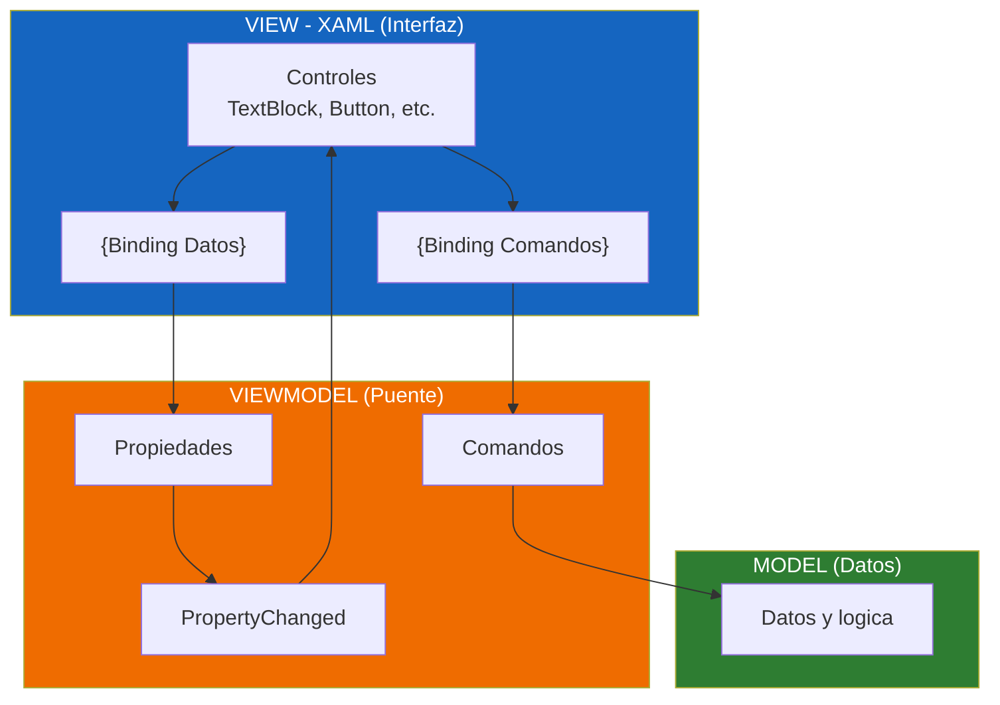
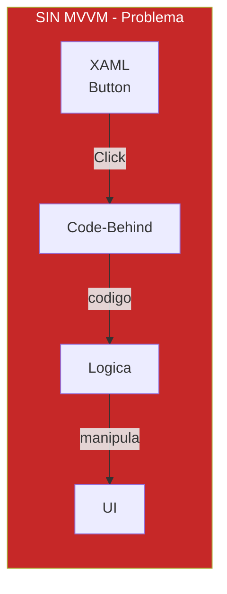
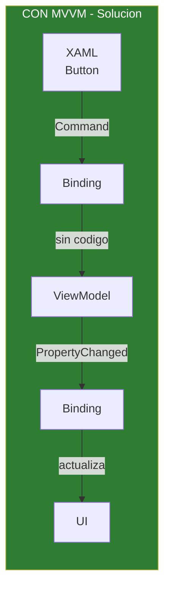
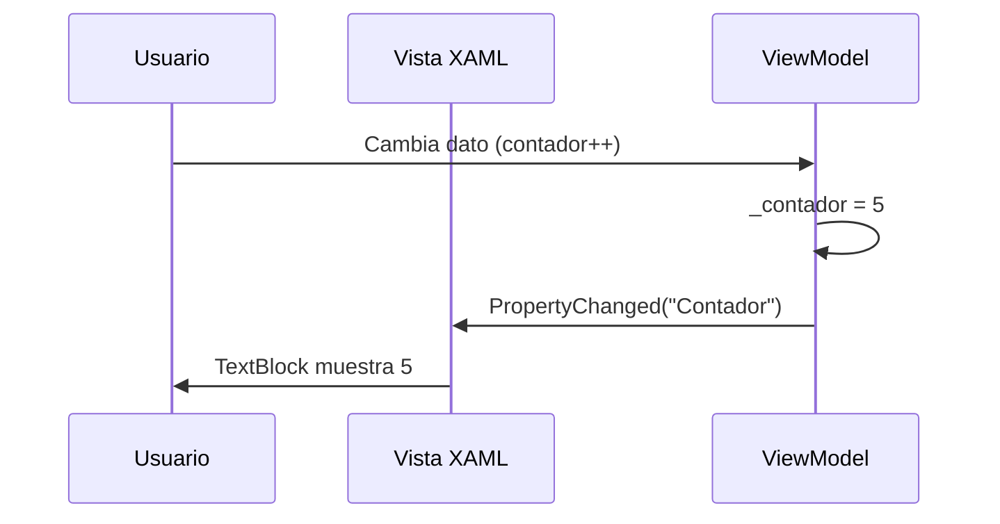
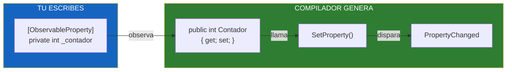
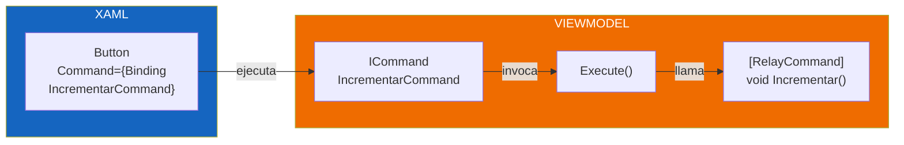
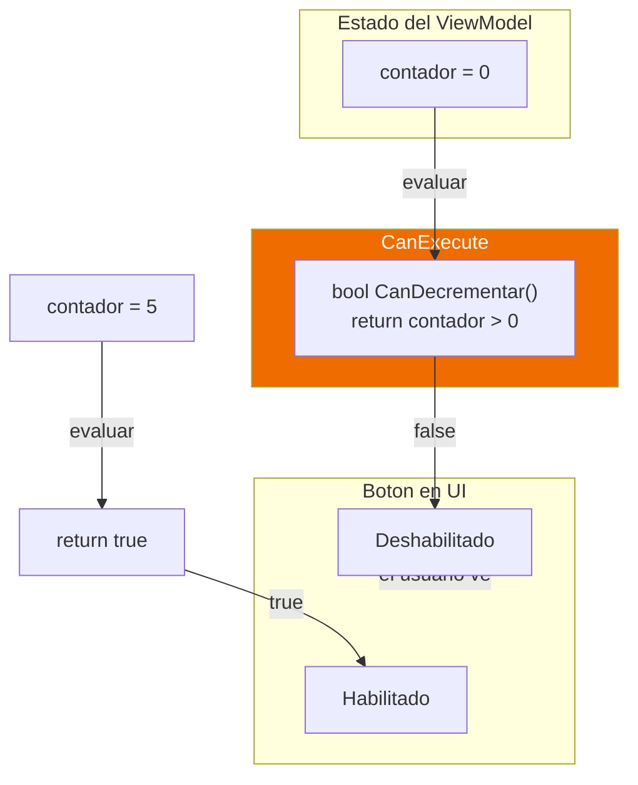
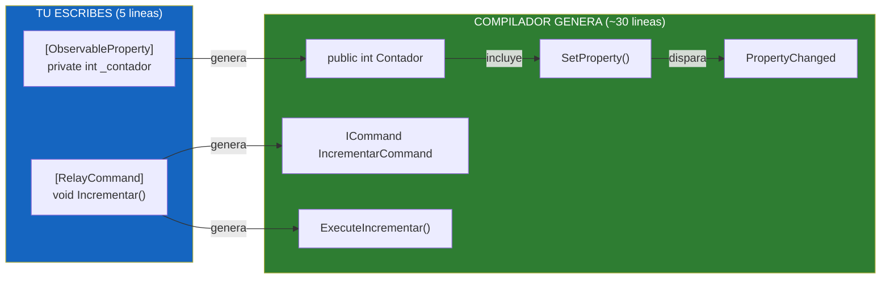

# 11-WpfMVVMCommunityToolkit - MVVM con CommunityToolkit

## Descripcion
Reimplementacion del proyecto `10-MVVMBasico` utilizando **CommunityToolkit.Mvvm**.

## IMPORTANTE: Esta sera nuestra forma de trabajar

A partir de ahora, **todos los proyectos usaran CommunityToolkit.Mvvm**.

---

## Guia Completa: POR QUE y SENTIDO de MVVM

---

## 1. TEORIA: Que es MVVM?

**MVVM** (Model-View-ViewModel) es un patron de arquitectura que separa la aplicacion en tres partes:

- **Model**: Los datos y la logica de negocio
- **View**: La interfaz grafica (XAML)
- **ViewModel**: El puente entre la View y el Model

### Objetivo de MVVM

**Separar la UI de la logica** para que:
- El codigo sea mas limpio
- Sea mas facil de mantener
- Se pueda probar sin la UI
- Varios desarrolladores puedan trabajar en paralelo

---

## 2. DIAGRAMA: Arquitectura MVVM



### Flujo de datos en MVVM:

1. **ViewModel expone datos** mediante propiedades
2. **View se suscribe** a esos datos mediante Binding
3. **ViewModel notifica** cuando los datos cambian
4. **View se actualiza** automaticamente

---

## 3. DIAGRAMA: El problema SIN MVVM



**Problemas:**
- La UI conoce la logica (acoplamiento)
- Dificil de probar
- Codigo mezclado
- Difacil de mantener

---

## 4. DIAGRAMA: La solucion CON MVVM



**Solucion:**
- La UI NO conoce la logica
- Binding conecta todo automaticamente
- Separation of Concerns
- Testeable

---

## 5. POR QUE NECESITAMOS NOTIFICAR CAMBIOS A LA UI?

**PROBLEMA**: Cuando cambiamos un dato en el ViewModel, la UI no lo sabe.

```
ViewModel: contador = 5
UI: sigue mostrando 0 (no se entera del cambio)
```

**PARA QUE SIRVE**: Para que la UI se actualice automaticamente cuando cambian los datos.

**QUE CONSEGUIMOS**:
- La UI cambia automaticamente cuando cambian los datos
- No necesitamos codigo manual para actualizar la UI
- Separation of Concerns: el ViewModel no conoce la UI

---

## 6. DIAGRAMA: Notification de cambios



---

## 7. POR QUE USAMOS [ObservableProperty]?

**PARA QUE SIRVE**: Le dice al compilador: "cuando cambie este campo, notifica automaticamente a la UI".

**QUE CONSEGUIMOS**:
- Menos codigo repetitivo
- Cuando cambiemos el dato, la UI se entera automaticamente
- Codigo mas limpio y mantenible

**EN RESUMEN**: Es la forma de decirsele a la UI que un dato cambio.

---

## 8. DIAGRAMA: Como funciona ObservableProperty



---

## 9. POR QUE USAMOS [RelayCommand]?

**PROBLEMA**: En MVVM, la UI no debe conocer la logica. ¿Como conectamos un boton con una accion?

**PARA QUE SIRVE**: Crea un "puente" entre el boton y la accion sin acoplar.

**QUE CONSEGUIMOS**:
- Separacion total: la UI no conoce la logica
- Codigo limpio: la logica esta en el ViewModel
- Testeable: podemos probar sin la UI

**EN RESUMEN**: Es la forma de conectar botones con logica sin que la UI conozca la logica.

---

## 10. DIAGRAMA: Como funciona RelayCommand



---

## 11. POR QUE USAMOS CanExecute?

**PROBLEMA**: A veces un boton no deberia hacer nada segun el estado.

```
SIN CanExecute:
  - El boton siempre esta habilitado
  - El usuario pulsa y no pasa nada

CON CanExecute:
  - El boton se deshabilita automaticamente
  - El usuario ve claramente que no puede usarlo
```

**PARA QUE SIRVE**: Para habilitar/deshabilitar botones automaticamente segun el estado.

**QUE CONSEGUIMOS**:
- Mejor UX: el usuario sabe que puede y no puede hacer
- Menos errores: no puede pulsar algo que no debe

**EN RESUMEN**: Es la forma de que la UI refleje el estado sin que la UI conozca la logica.

---

## 12. DIAGRAMA: Como funciona CanExecute



---

## 13. DIAGRAMA: CommunityToolkit.Mvvm genera codigo por ti



---

## 14. Resumen: QUE QUEREMOS LOGRAR CON MVVM?

| Objetivo | Como lo logramos |
|----------|------------------|
| UI actualizada automaticamente | [ObservableProperty] + PropertyChanged |
| Botones inteligentes | CanExecute |
| Separacion UI/Logica | Binding + Commands |
| Codigo limpio | CommunityToolkit.Mvvm |
| Testeable | Commands y propiedades separables |

---

## Estructura del Proyecto
```
11-MVVMCommunityToolkit/
└── WpfMVVMCommunityToolkit/
    ├── WpfMVVMCommunityToolkit.csproj
    ├── App.xaml
    ├── App.xaml.cs
    ├── ViewModels/
    │   └── ContadorViewModel.cs
    └── Views/
        └── Main/
            ├── MainWindow.xaml
            └── MainWindow.xaml.cs
```

## Tecnologias
- WPF (.NET 10)
- C# 14
- CommunityToolkit.Mvvm 8.4.1

## Como Ejecutar
```bash
cd WpfMVVMCommunityToolkit
dotnet run
```

## Conclusion

### Por que usamos CommunityToolkit.Mvvm?

1. **Menos codigo repetitivo**: Nos focusamos en la logica
2. **Menos errores**: El compilador ayuda
3. **Estandar de la industria**: Es el toolkit mas usado
4. **Productividad**: Desarrollo mas rapido

### A partir de ahora

**Todos los proyectos usaran CommunityToolkit.Mvvm.**

El ejercicio 10 (implementacion manual) es util para entender como funciona MVVM internamente, pero en la practica usaremos siempre el toolkit.
