# 12-BindingsReactividad

## Descripción

Este proyecto es una guía educativa completa sobre el sistema de binding y reactividad de WPF. Demuestra los cuatro modos de binding (`OneWay`, `TwoWay`, `OneTime`, `OneWayToSource`), el `UpdateSourceTrigger`, converters, `StringFormat`, `ElementName` binding y la construcción de formularios reactivos.

## Objetivos de Aprendizaje

- Comprender los cuatro modos de binding y cuándo usar cada uno
- Controlar cuándo se actualiza la fuente con `UpdateSourceTrigger`
- Usar `StringFormat` y `Converter` para transformar datos
- Enlazar propiedades de controles entre sí con `ElementName`
- Construir formularios reactivos con actualización en tiempo real

---

## 1. Teoría: ¿Qué es el Binding en WPF?

### El Problema

En una aplicación WPF, tenemos dos mundos separados:

```
┌─────────────────────────────────────────────────────────────────┐
│                         APLICACIÓN WPF                          │
├─────────────────────────────────────────────────────────────────┤
│                                                                 │
│   ┌─────────────────────┐        ┌─────────────────────┐       │
│   │    VISTA (XAML)     │        │   VIEWMODEL (C#)    │       │
│   │                     │        │                     │       │
│   │  - TextBoxes        │        │  - Variables        │       │
│   │  - Labels           │  ◄──►  │  - Propiedades      │       │
│   │  - Botones          │  BIND  │  - Comandos         │       │
│   │  - Rectángulos      │        │                     │       │
│   │                     │        │                     │       │
│   └─────────────────────┘        └─────────────────────┘       │
│                                                                 │
│   LO QUE VE EL USUARIO              LA LÓGICA DE NEGOCIOS      │
│                                                                 │
└─────────────────────────────────────────────────────────────────┘
```

**Problema**: ¿Cómo comunicamos estos dos mundos?

**Solución**: El **Binding** (enlace de datos)

### ¿Qué es el Binding?

El binding es un "puente" que conecta una propiedad de la UI con una propiedad del ViewModel. Cuando una cambia, la otra se actualiza automáticamente.

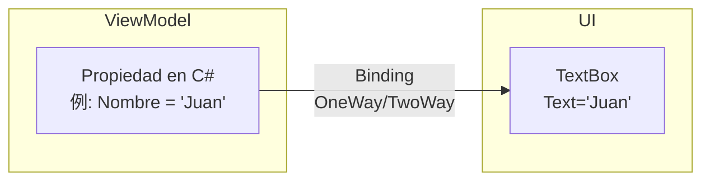

---

## 2. Modos de Binding

### 2.1 OneWay (Predeterminado)

**Flujo**: ViewModel → UI (solo lectura)

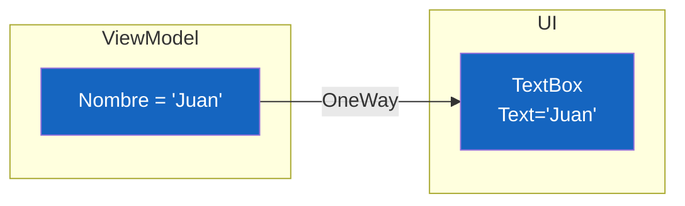

**Cuándo usar**:
- Mostrar títulos, etiquetas
- Datos que solo cambian desde código
- Propiedades de solo lectura

**PROS**:
- ✅ Seguro: usuario no puede modificar
- ✅ Eficiente: menor procesamiento
- ✅ Simple: solo fluye en una dirección

**CONTRAS**:
- ❌ No permite interactividad

**Ejemplo en XAML**:
```xml
<!-- Explicito -->
<TextBlock Text="{Binding Titulo, Mode=OneWay}"/>

<!-- Implícito (es el mismo) -->
<TextBlock Text="{Binding Titulo}"/>
```

### 2.2 TwoWay

**Flujo**: ViewModel ↔ UI (bidireccional)

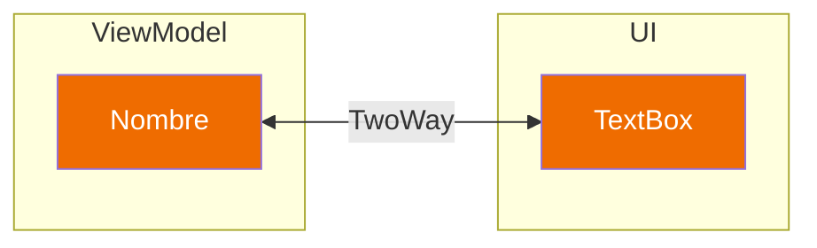

**Cuándo usar**:
- TextBox de entrada de datos
- ComboBox de selección
- CheckBox y RadioButton
- Cualquier control editable

**PROS**:
- ✅ Permite edición completa
- ✅ Sincronización bidireccional
- ✅ Ideal para formularios

**CONTRAS**:
- ❌ Puede causar bucles infinitos
- ❌ Mayor procesamiento

**Ejemplo en XAML**:
```xml
<TextBox Text="{Binding Nombre, Mode=TwoWay}"/>
```

### 2.3 OneTime

**Flujo**: ViewModel → UI (solo una vez al inicio)

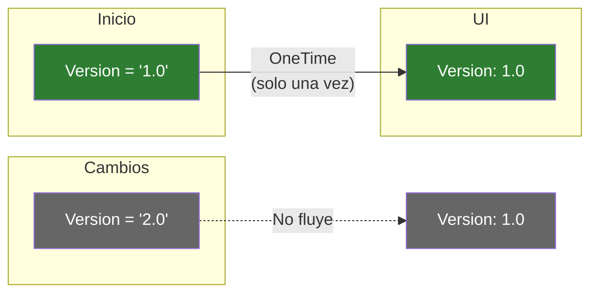

**Cuándo usar**:
- Versión de la aplicación
- Fecha de compilación
- Datos estáticos que nunca cambian

**PROS**:
- ✅ Muy eficiente (no monitorea cambios)
- ✅ Ideal para datos constantes

**CONTRAS**:
- ❌ No se actualiza nunca

**Ejemplo en XAML**:
```xml
<TextBlock Text="{Binding VersionApp, Mode=OneTime}"/>
```

### 2.4 OneWayToSource

**Flujo**: UI → ViewModel (inverso a OneWay)

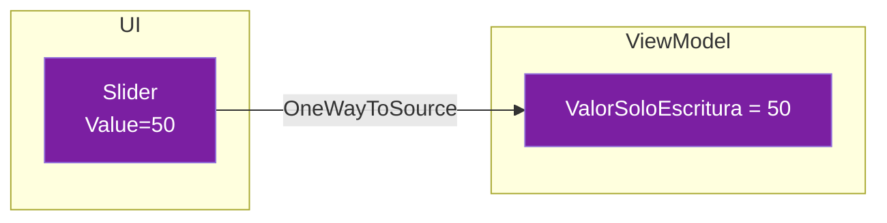

**Cuándo usar**:
- Controles de solo escritura
- Casos raros donde la UI escribe y el ViewModel solo lee
- Ejemplo: ScrollBar que reporta posición

**PROS**:
- ✅ Útil para controles sin propiedad "lectura"

**CONTRAS**:
- ❌ Uso poco común
- ❌ Confuso para otros desarrolladores

**Ejemplo en XAML**:
```xml
<Slider Value="{Binding MiValor, Mode=OneWayToSource}"/>
```

---

## 3. UpdateSourceTrigger

### ¿Qué es?

Controla **cuándo** se envía el cambio de la UI al ViewModel en bindings TwoWay.

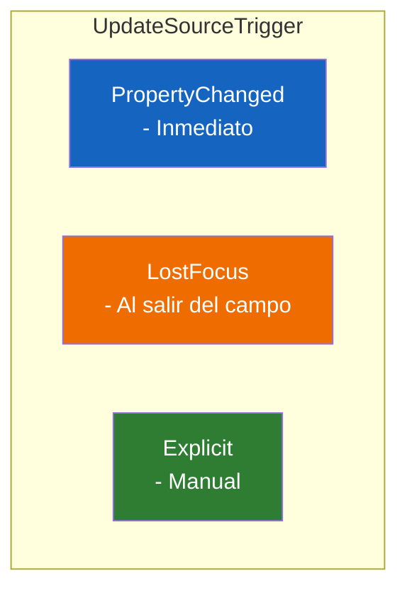

### 3.1 PropertyChanged (Predeterminado en TextBox)

**Se actualiza con cada carácter**

```
Usuario escribe: "H" → ViewModel: "H"
Usuario escribe: "Ho" → ViewModel: "Ho"
Usuario escribe: "Hol" → ViewModel: "Hol"
```

**PROS**:
- ✅ Feedback inmediato
- ✅ Ideal para validación en tiempo real

**CONTRAS**:
- ❌ Puede ser costoso con validaciones pesadas

### 3.2 LostFocus

**Se actualiza al perder el foco**

```
Usuario escribe: "Hola" → ViewModel: ""
Usuario presiona Tab → ViewModel: "Hola"
```

**PROS**:
- ✅ Mejor rendimiento
- ✅ Ideal para campos con validación compleja

**CONTRAS**:
- ❌ Menor feedback inmediato

### 3.3 Explicit

**Solo se actualiza manualmente**

```csharp
// En el code-behind
private void btnGuardar_Click(object sender, RoutedEventArgs)
{
    // Llamada manual para actualizar el ViewModel
    BindingExpression expression = txtNombre.GetBindingExpression(TextBox.TextProperty);
    expression.UpdateSource();
}
```

**PROS**:
- ✅ Total control
- ✅ Útil para botones "Guardar"

**CONTRAS**:
- ❌ Requiere más código

---

## 4. StringFormat

### ¿Qué es?

Permite formatear el valor antes de mostrarlo.

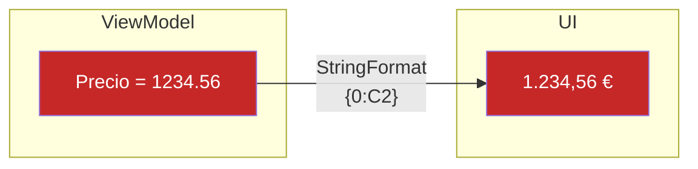

### Formatos comunes

| Formato | Entrada | Salida |
|---------|---------|--------|
| `{0:C2}` | 1234.56 | 1.234,56 € |
| `{0:N2}` | 1234.56 | 1.234,56 |
| `{0:P0}` | 0.25 | 25 % |
| `{0:dd/MM/yyyy}` | 25/03/2026 | 25/03/2026 |
| `{0:HH:mm}` | 14:30 | 14:30 |

### Ejemplo en XAML

```xml
<TextBlock Text="{Binding Precio, StringFormat='{}{0:C2}'}"/>
<TextBlock Text="{Binding Fecha, StringFormat='{}{0:dd/MM/yyyy}'}"/>
```

---

## 5. Converters

### ¿Qué es un Converter?

Un **IValueConverter** transforma un tipo de dato en otro.

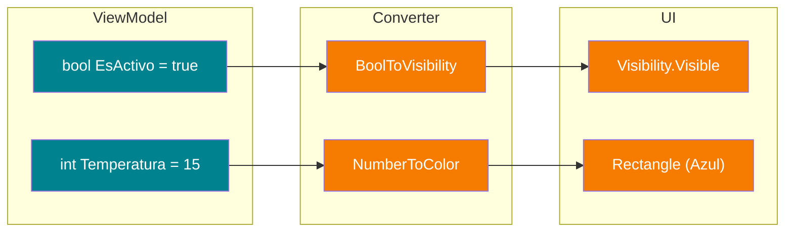

### ¿Por qué necesitamos Converters?

**Problema**: La UI espera un tipo diferente al del ViewModel

| ViewModel (tipo) | UI necesita (tipo) | Converter |
|------------------|---------------------|-----------|
| bool | Visibility | BoolToVisibility |
| int | Color/Brush | NumberToColor |
| DateTime | string | DateToString |
| decimal | string | DecimalToMoney |

### Cómo crear un Converter

```csharp
public class BoolToVisibilityConverter : IValueConverter
{
    public object Convert(object value, Type targetType, 
                         object parameter, CultureInfo culture)
    {
        // ViewModel → UI
        if (value is bool boolValue)
        {
            return boolValue ? Visibility.Visible : Visibility.Collapsed;
        }
        return Visibility.Collapsed;
    }

    public object ConvertBack(object value, Type targetType, 
                             object parameter, CultureInfo culture)
    {
        // UI → ViewModel
        if (value is Visibility visibility)
        {
            return visibility == Visibility.Visible;
        }
        return false;
    }
}
```

### Cómo usar un Converter en XAML

```xml
<!-- 1. Declarar como recurso -->
<Window.Resources>
    <local:BoolToVisibilityConverter x:Key="BoolToVisibility"/>
</Window.Resources>

<!-- 2. Usar en el binding -->
<TextBlock Text="Contenido" 
           Visibility="{Binding EsActivo, Converter={StaticResource BoolToVisibility}}"/>
```

---

## 6. ElementName Binding

### ¿Qué es?

Permite enlazar la propiedad de un control con la de **otro control** (no del ViewModel).

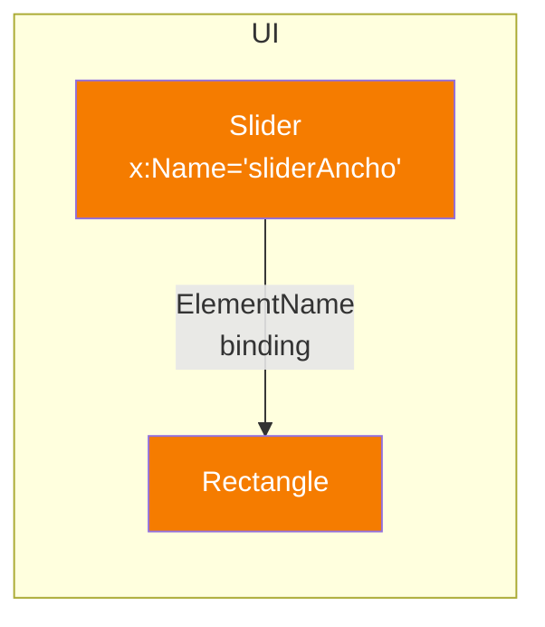

### Ejemplo

```xml
<Slider x:Name="sliderAncho" Minimum="50" Maximum="400" Value="200"/>

<Rectangle Width="{Binding Value, ElementName=sliderAncho}" 
           Height="50" Fill="Orange"/>
```

**PROS**:
- ✅ Respuesta inmediata
- ✅ No necesita propiedad en ViewModel

**CONTRAS**:
- ❌ Acopla la UI entre sí
- ❌ Viola ligeramente MVVM

---

## 7. Formulario Reactivo

### El concepto

Un formulario reactivo se actualiza automáticamente cuando cambian los datos, sin necesidad de botones.

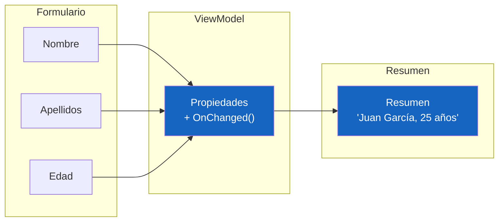

### Cómo funciona

1. Cada campo del formulario está bindeado con **TwoWay**
2. Cada propiedad tiene un método `On[Propiedad]Changed()`
3. Cuando cambia cualquier campo, se recalcula el resumen

```csharp
[ObservableProperty]
private string _nombre = "";

[ObservableProperty]
private string _resumen = "";

partial void OnNombreChanged(string value)
{
    ActualizarResumen();
}

private void ActualizarResumen()
{
    // Combina nombre y edad
    Resumen = $"{Nombre} {Apellidos}, {Edad} años";
}
```

---

## 8. TwoWay Binding vs OneWay + Eventos

### Las dos formas de actualizar el ViewModel

Existen dos enfoques principales para mantener la UI y el ViewModel sincronizados:

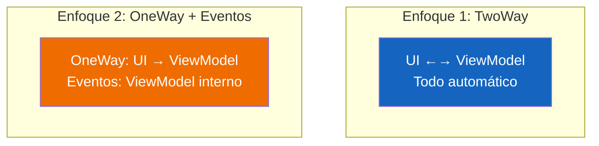

### Enfoque 1: TwoWay Binding (Recomendado)

```xml
<!-- XAML -->
<TextBox Text="{Binding Nombre, Mode=TwoWay}"/>
```

```csharp
// ViewModel
[ObservableProperty]
private string _nombre = "";
```

**Qué ocurre:**
1. Usuario escribe "Juan" → `_nombre` = "Juan" automáticamente
2. Código cambia `_nombre` = "Pedro" → la UI muestra "Pedro" automáticamente

**Ventajas:**
- ✅ Código mínimo
- ✅ Mantiene MVVM puro
- ✅ Fácil mantenimiento
- ✅ Fácil de testear

---

### Enfoque 2: OneWay + Eventos (Para casos especiales)

```xml
<!-- XAML: OneWay, no TwoWay -->
<TextBox x:Name="txtNombre" Text="{Binding Nombre, Mode=OneWay}"/>
```

```csharp
// Code-behind (NO es MVVM puro)
txtNombre.TextChanged += (s, e) => 
{
    _viewModel.Nombre = txtNombre.Text;
};
```

**Qué ocurre:**
1. Usuario escribe → se dispara `TextChanged`
2. El evento actualiza manualmente el ViewModel
3. El binding OneWay muestra el valor del ViewModel

**Ventajas:**
- ✅ Control total sobre cuándo actualizar
- ✅ Puedes añadir lógica antes de actualizar (validaciones, transformaciones)

**Desventajas:**
- ❌ Más código
- ❌ Rompe la separación MVVM (code-behind conoce el ViewModel)
- ❌ Más difícil de mantener
- ❌ Difícil de testear

---

### ¿Cuál usar?

| Situación | Recomendación |
|-----------|---------------|
| Formularios simples | **TwoWay** |
| Necesitas lógica antes de actualizar | **TwoWay + OnChanged** |
| Validación asíncrona (API externa) | **OneWay + Eventos** |
| Optimización extrema | **OneWay + Eventos** |

---

### Ejemplo: Validación con API

```csharp
// Code-behind con OneWay + evento
txtEmail.LostFocus += async (s, e) => 
{
    // Validar con API externa antes de actualizar
    bool valido = await ValidarEmailAPI(txtEmail.Text);
    if (!valido)
    {
        MostrarError("Email no válido");
        txtEmail.Text = _viewModel.Email; // Revertir
    }
    else
    {
        _viewModel.Email = txtEmail.Text;
    }
};
```

En este caso, **OneWay + Eventos** es mejor porque necesitamos lógica asíncrona antes de actualizar.

---

### OneWay + partial void OnChanged

No confundir con `OnChanged`:

| | OneWay + Evento | partial void OnChanged |
|--|------------------|------------------------|
| **Dónde** | Code-behind | ViewModel |
| **Cuándo** | Cuando el usuario interactúa | Cuando la propiedad cambia |
| **Uso** | Control manual de UI | Reaccionar al cambio |

```csharp
// En el ViewModel - se dispara cuando Nombre cambia
partial void OnNombreChanged(string value)
{
    // Reaccionar al cambio (actualizar otras propiedades)
    ActualizarResumen();
}
```

---

## 9. Resumen: Pros y Contras

### Modos de Binding

| Modo | Pros | Contras |
|------|------|---------|
| **OneWay** | Seguro, eficiente, simple | No editable |
| **TwoWay** | Interactivo, completo | Puede causar bucles |
| **OneTime** | Muy eficiente | No se actualiza |
| **OneWayToSource** | Útil para casos especiales | Confuso |

### UpdateSourceTrigger

| Trigger | Pros | Contras |
|---------|------|---------|
| **PropertyChanged** | Feedback inmediato | Puede ser costoso |
| **LostFocus** | Mejor rendimiento | Menor feedback |
| **Explicit** | Control total | Más código |

### Converters

| Aspecto | Valor |
|---------|-------|
| **PRO** | Separa lógica de transformación |
| **PRO** | Reutilizable |
| **PRO** | Mantiene ViewModel limpio |
| **CON** | Requiere clase adicional |

---

## Estructura del Proyecto

```
12-BindingsReactividad/
└── WpfBindingsReactividad/
    ├── WpfBindingsReactividad.csproj
    ├── App.xaml
    ├── App.xaml.cs
    ├── Converters/
    │   ├── BoolToVisibilityConverter.cs
    │   └── NumberToColorConverter.cs
    ├── FormData/
    │   ├── PersonaFormData.cs        # NUEVO: FormData con IDataErrorInfo
    │   └── Models/
    │       └── Persona.cs            # NUEVO: Modelo simple
    ├── ViewModels/
    │   ├── BindingDemoViewModel.cs   # ViewModel original
    │   ├── MainViewModel.cs          # NUEVO: ViewModel combinado
    │   └── FormularioValidacionViewModel.cs  # NUEVO: ViewModel con FormData
    └── Views/
        └── Main/
            ├── MainWindow.xaml
            └── MainWindow.xaml.cs
```

---

## Nuevos Conceptos Aprendidos

### Demo 11: FormData + IDataErrorInfo

Este proyecto ahora incluye un ejemplo completo del patrón FormData con validación IDataErrorInfo:

| Concepto | Descripción |
|----------|-------------|
| **FormData** | DTO que encapsula datos del formulario + validación |
| **IDataErrorInfo** | Interfaz para validación en tiempo real |
| **ValidatesOnDataErrors** | Binding que activa la validación en la UI |
| **IsValid()** | Método para validar todo el formulario |

### Archivos Nuevos

- `FormData/PersonaFormData.cs` - Clase con validación IDataErrorInfo
- `FormData/Models/Persona.cs` - Modelo de dominio
- `ViewModels/MainViewModel.cs` - ViewModel combinado
- `ViewModels/FormularioValidacionViewModel.cs` - ViewModel de ejemplo

---

## Tecnologías

- WPF (.NET 10)
- C# 14
- CommunityToolkit.Mvvm 8.4.1
- JetBrains Rider

---

## Referencias

- [Documentación oficial de WPF Binding](https://docs.microsoft.com/es-es/dotnet/desktop/wpf/data/?view=netdesktop-6.0)
- [UpdateSourceTrigger Enum](https://docs.microsoft.com/es-es/dotnet/api/system.windows.data.updatesourcetrigger)
- [IValueConverter Interface](https://docs.microsoft.com/es-es/dotnet/api/system.windows.data.ivalueconverter)
