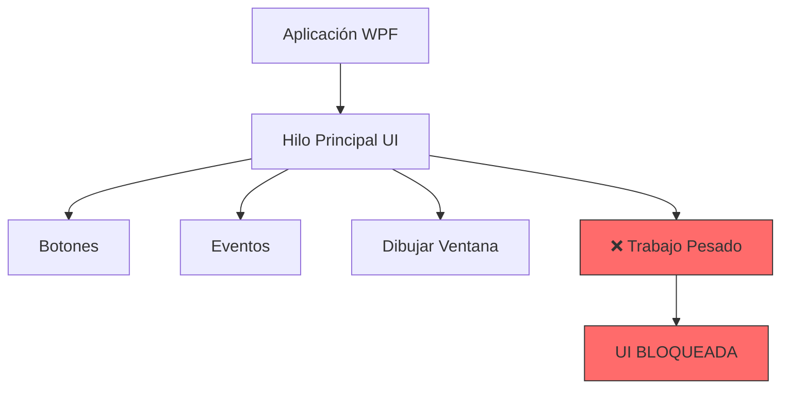
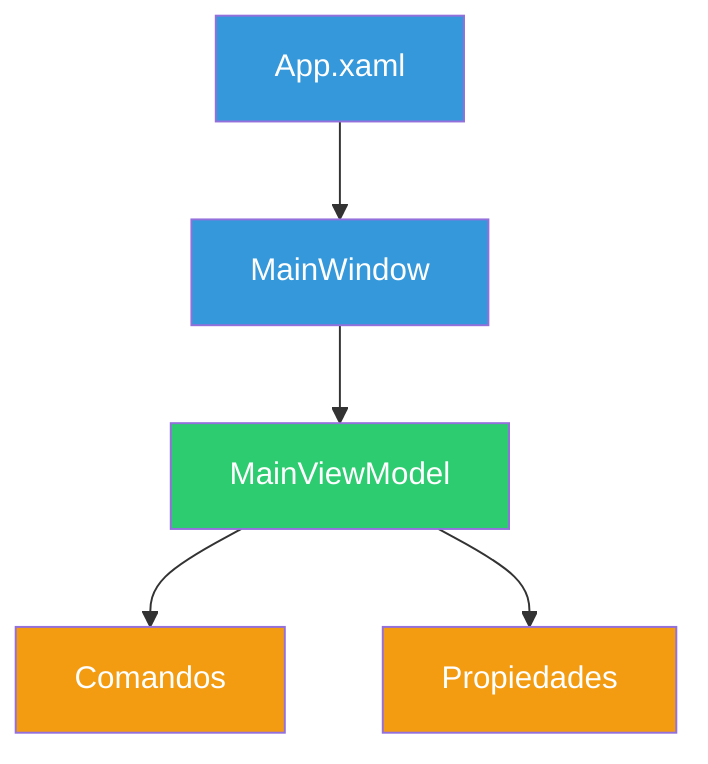
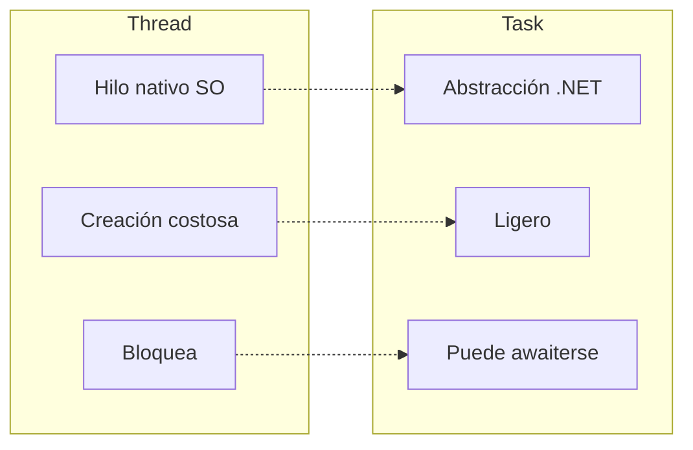
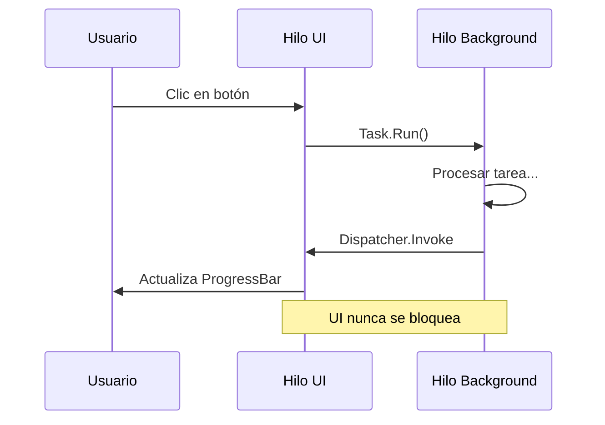
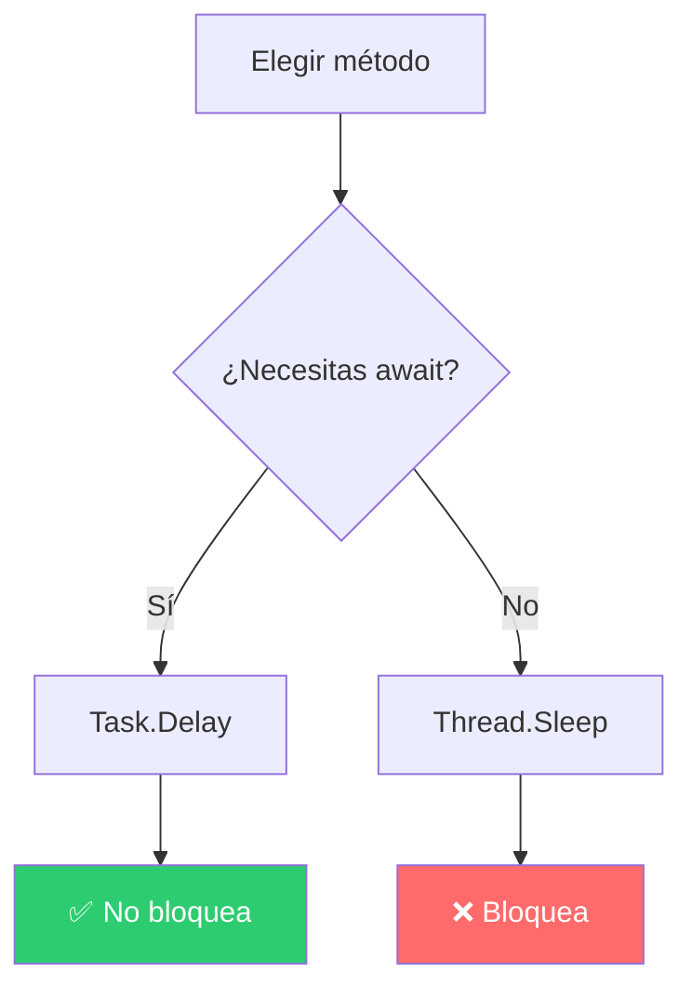

# Tareas en Segundo Plano - WPF

Aplicación de escritorio WPF que demuestra cómo manejar tareas pesadas sin bloquear la interfaz de usuario.

## Descripción del Problema

Cuando ejecutamos operaciones largas (leer archivos grandes, descargar datos, procesar información) en el **hilo principal de la UI**, la aplicación se "congela" porque ese hilo está ocupado.

### El Problema



## Soluciones Demonstradas

### 1. ❌ Tarea Bloqueante (NO USAR)

```csharp
// ESTO BLOQUEA LA UI
public void EjecutarTarea()
{
    for (int i = 0; i <= 100; i++)
    {
        Progreso = i;
        Thread.Sleep(50);  // Bloquea todo
    }
}
```

**Resultado**: La UI se congela completamente.

---

### 2. ✅ Tarea con Task.Run + Dispatcher (CORRECTO)

```csharp
// Esto NO BLOQUEA LA UI
public async Task EjecutarTarea()
{
    await Task.Run(() =>
    {
        for (int i = 0; i <= 100; i++)
        {
            // Actualiza la UI desde el hilo secundario
            Application.Current.Dispatcher.Invoke(() =>
            {
                Progreso = i;
            });
            Thread.Sleep(50);
        }
    });
}
```

**Resultado**: La UI sigue respondiendo.

---

### 3. 🚀 Tarea con Async/Await (RECOMENDADO)

```csharp
// Forma moderna y limpia
public async Task EjecutarTarea()
{
    await Task.Run(async () =>
    {
        for (int i = 0; i <= 100; i++)
        {
            Application.Current.Dispatcher.Invoke(() => Progreso = i);
            await Task.Delay(50);  // Mejor que Thread.Sleep
        }
    });
}
```

**Resultado**: Código limpio, UI responsiva.

---

## Arquitectura del Proyecto

### Tecnologías

| Tecnología | Descripción |
|------------|-------------|
| **WPF** | Interfaz de usuario |
| **.NET 10** | Framework |
| **MVVM** | Patrón arquitectura |
| **CommunityToolkit.Mvvm** | Librería MVVM |
| **Serilog** | Logging |

### Estructura



```
18-TareasBackground/
├── ViewModels/
│   └── MainViewModel.cs            # Lógica de tareas en background
├── Views/
│   ├── MainWindow.xaml            # Interfaz gráfica
│   └── MainWindow.xaml.cs          # Code-behind
├── Infrastructure/
│   └── DependenciesProvider.cs    # Inyección de dependencias
└── App.xaml                       # Punto de entrada
```

## Conceptos Clave

### Thread vs Task



| Thread | Task |
|--------|------|
| Hilo nativo del SO | Abstracción administrada |
| Creación costosa | Ligero |
| Se bloquea | Puede awaiterse |
| Manual | Gestionado por .NET |

### Flujo de Ejecución



### Thread.Sleep vs Task.Delay



```csharp
// ❌ Thread.Sleep - BLOQUEA el hilo actual
Thread.Sleep(1000);

// ✅ Task.Delay - NO BLOQUEA, solo espera
await Task.Delay(1000);
```

### Dispatcher

En WPF, solo el hilo de la UI puede modificar controles de la UI.


```csharp
// Desde hilo secundario, actualizamos la UI
Application.Current.Dispatcher.Invoke(() =>
{
    miBoton.Content = "Nuevo texto";
});
```

## Cómo Ejecutar

```bash
cd 18-TareasBackground
dotnet run
```

## Ejercicios Propuestos

1. **Añadir CancellationToken** para poder cancelar la tarea
2. **Usar IProgress<T>** para reportar progreso de forma limpia
3. **Crear una calculadora** que procese operaciones largas
4. **Simular descarga** de archivo con barra de progreso

---

**Nota**: Este proyecto es con fines educativos para el módulo de Programación.
