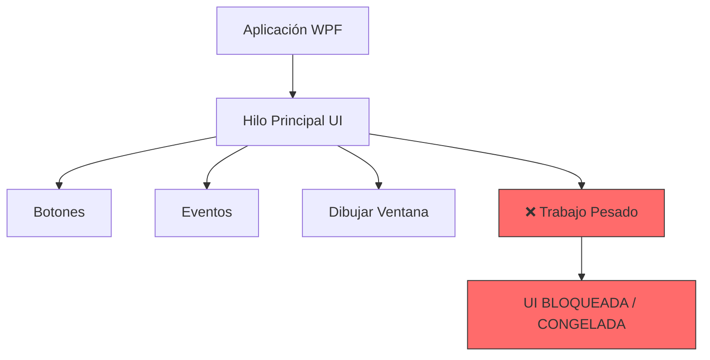

# 18-TareasBackground - Tareas en Segundo Plano y el Hilo de la UI

Aplicación de escritorio WPF que demuestra cómo manejar tareas pesadas sin bloquear la interfaz de usuario (UI Thread).

## 🧠 El Concepto: El Hilo de la UI (Main Thread)

En WPF, existe un **único hilo** encargado de:
1.  **Dibujar** la interfaz (renderizado).
2.  **Procesar eventos** (clics, teclado, movimiento).
3.  **Actualizar** los controles (ProgressBar, TextBlock).

Si este hilo se ocupa con una tarea pesada (un bucle largo, una consulta a BD o un `Thread.Sleep`), la aplicación **deja de responder** porque el hilo no puede atender los eventos de dibujado ni los clics del usuario.


```mermaid
graph TD
    A[Aplicación WPF] --> B[Hilo Principal UI]
    B --> C[Botones]
    B --> D[Eventos]
    B --> E[Dibujar Ventana]
    B --> F[❌ Trabajo Pesado]
    F --> G[UI BLOQUEADA / CONGELADA]
    
    style G fill:#ff6b6b,stroke:#333
    style F fill:#ff6b6b,stroke:#333
```

---

## 🛠️ Soluciones Demostradas

### 1. ❌ Tarea Bloqueante (NO USAR)
Ejecuta el trabajo directamente en el hilo de la UI.
```csharp
[RelayCommand]
public void EjecutarTareaBloqueante() {
    for (int i = 0; i <= 100; i++) {
        Progreso = i;
        System.Threading.Thread.Sleep(50); // BLOQUEA el hilo de la UI
    }
}
```
**Resultado**: La ventana no se puede mover, el progreso no se ve hasta que termina el bucle y la app parece "colgada".

### 2. ✅ Task.Run + Dispatcher
Mueve el trabajo a un hilo secundario y vuelve al hilo de la UI solo para actualizar datos.
```csharp
[RelayCommand]
public async Task EjecutarTareaNoBloqueante() {
    await Task.Run(() => {
        for (int i = 0; i <= 100; i++) {
            // Solo el hilo de la UI puede tocar la UI
            Application.Current.Dispatcher.Invoke(() => {
                Progreso = i;
            });
            System.Threading.Thread.Sleep(50); // Bloquea el hilo secundario (está bien)
        }
    });
}
```
**Resultado**: La UI responde perfectamente mientras el hilo secundario trabaja.

### 3. 🚀 Async/Await Puro (ÓPTIMO)
La forma más moderna y limpia de C#. `await Task.Delay` libera el hilo de la UI durante la espera sin necesidad de hilos manuales complejos.
```csharp
[RelayCommand]
public async Task EjecutarTareaOptima() {
    for (int i = 0; i <= 100; i++) {
        Progreso = i; // Binding automático
        await Task.Delay(50); // PAUSA el método y LIBERA la UI para que se refresque
    }
}
```
**Resultado**: Código minimalista, legibilidad máxima y rendimiento óptimo.

---

## ⚠️ Lecciones Aprendidas (Errores Comunes Corregidos)

### 1. El Orden de Inicio (App Startup Crash)
Si la aplicación se cierra sola al iniciar, suele ser por una `NullReferenceException` en el arranque.
- **Error**: Llamar a `base.OnStartup(e)` antes de inicializar el `ServiceProvider`.
- **Solución**: El contenedor de dependencias debe estar listo **antes** de que WPF intente instanciar la `MainWindow`.

### 2. Nombres de Comandos en MVVM Toolkit
El `CommunityToolkit.Mvvm` genera comandos automáticamente.
- **Regla**: Si el método se llama `EjecutarTareaAsync`, el comando generado será `EjecutarTareaCommand` (quita el sufijo Async).
- **Problema**: Si en el XAML bindeas a `EjecutarTareaAsyncCommand`, no funcionará nada porque ese comando no existe. Siempre verifica el nombre generado por el Source Generator.

### 3. Thread.Sleep vs Task.Delay
- `Thread.Sleep(ms)`: **Detiene** el hilo actual. Si es el de la UI, la app se congela.
- `await Task.Delay(ms)`: **Espera** sin bloquear. Devuelve el control al sistema y regresa cuando el tiempo termina.

---

## 🏗️ Arquitectura del Proyecto

| Capa | Responsabilidad |
|------|-----------------|
| **Models** | Datos puros |
| **ViewModels** | Lógica de negocio y gestión de hilos |
| **Views** | Interfaz visual (XAML) |
| **Infrastructure** | Inyección de Dependencias (DI) |

## Cómo Ejecutar
```bash
cd 18-TareasBackground/TareasBackgorund
dotnet run
```
