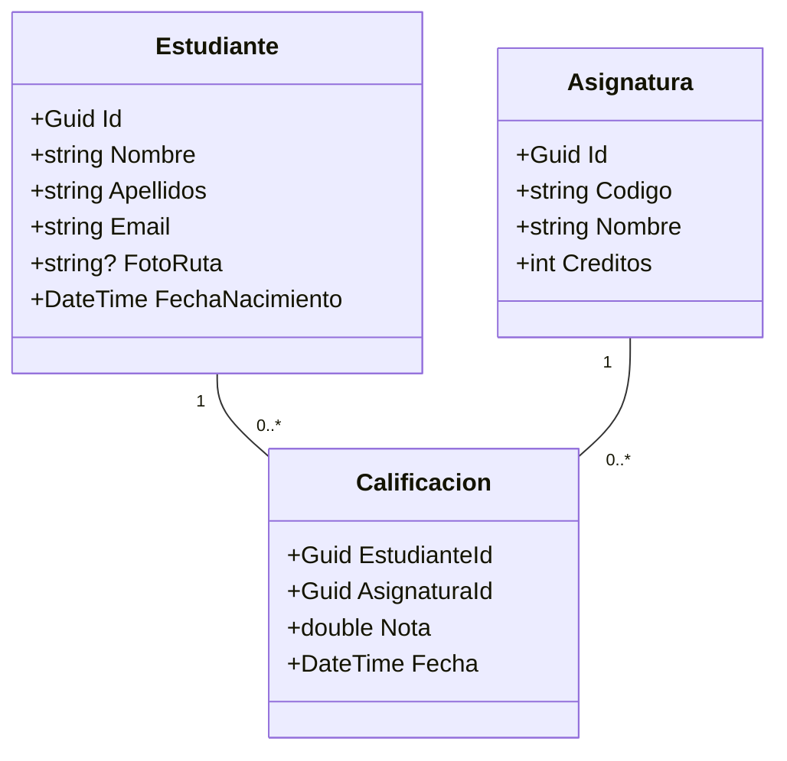

# 18-WpfGestionAcademicaPro

## Descripción
**Proyecto final integrador del curso.** Aplicación profesional de gestión académica que combina todas las tecnologías y patrones vistos a lo largo de la asignatura: MVVM avanzado, CRUD completo con persistencia, gestión de imágenes, gráficas con ScottPlot, informes HTML, testing con NUnit y Moq, inyección de dependencias y logging.

## Objetivos de Aprendizaje
- Integrar todos los conceptos del curso en una aplicación cohesionada y de calidad profesional
- Implementar persistencia de datos en JSON o SQLite con el patrón Repository
- Gestionar imágenes (cargar, actualizar, eliminar, liberar recursos con `IDisposable`)
- Generar gráficas de barras, líneas y circulares con la librería **ScottPlot**
- Producir informes HTML con tablas y gráficas incrustadas (base64)
- Escribir pruebas unitarias con **NUnit** y **Moq** para repositorios y servicios
- Aplicar inyección de dependencias manual o con `Microsoft.Extensions.DependencyInjection`
- Validar datos con `DataAnnotations` y un servicio de validación genérico
- Registrar eventos de la aplicación con `Microsoft.Extensions.Logging`

## Requisitos Funcionales
- RF-01: CRUD completo de estudiantes con foto de perfil (cargar desde disco, actualizar, eliminar)
- RF-02: CRUD de asignaturas y gestión de matrículas con calificaciones
- RF-03: Panel de estadísticas con gráficas: distribución de notas (barra), evolución (línea), aprobados/suspensos (circular)
- RF-04: Generación de informes en HTML exportables con tablas y gráficas incrustadas
- RF-05: Filtrado y búsqueda avanzada de estudiantes (por nombre, curso, nota media)
- RF-06: Importación y exportación de datos en formato JSON
- RF-07: Log de operaciones (altas, bajas, modificaciones) persistido en fichero
- RF-08: Diálogo de configuración de la aplicación (ruta de datos, tema, etc.)

## Requisitos No Funcionales

| Código | Requisito | Descripción |
|--------|-----------|-------------|
| RNF-01 | Arquitectura | Repository + DI + MVVM; desacoplamiento total entre capas |
| RNF-02 | Testing | Cobertura de pruebas unitarias para repositorios y servicios clave |
| RNF-03 | Rendimiento | Operaciones de I/O asíncronas; carga de imágenes no bloquea la UI |
| RNF-04 | Mantenibilidad | Código documentado con XML doc comments en API pública |
| RNF-05 | Robustez | Manejo de excepciones en todas las operaciones de I/O y red |

## Arquitectura
**MVVM + Repository + DI + Servicios**

```
┌──────────┐  binding  ┌─────────────────┐   usa   ┌──────────────┐
│  Views   │ ────────► │   ViewModels    │ ──────► │   Services   │
│  (XAML)  │           │ (MVVM + Toolkit)│         │ (lógica app) │
└──────────┘           └─────────────────┘         └──────┬───────┘
                                                           │ usa
                                              ┌────────────▼───────────┐
                                              │     Repositories       │
                                              │  (JSON / SQLite)       │
                                              └────────────────────────┘
```

### Diagrama de clases simplificado



## Tecnologías
- WPF (.NET 10)
- C# 14
- JetBrains Rider
- CommunityToolkit.Mvvm (NuGet)
- ScottPlot (NuGet) — gráficas
- NUnit + Moq (NuGet) — testing
- Microsoft.Extensions.DependencyInjection (NuGet)
- Microsoft.Extensions.Logging (NuGet)
- System.Text.Json (incluido en .NET 10)

## Estructura Sugerida
```
18-WpfGestionAcademicaPro/
├── WpfGestionAcademicaPro/
│   ├── WpfGestionAcademicaPro.csproj
│   ├── App.xaml
│   ├── App.xaml.cs                  ← configuración de DI y logging
│   ├── Models/
│   │   ├── Estudiante.cs
│   │   ├── Asignatura.cs
│   │   └── Calificacion.cs
│   ├── Repositories/
│   │   ├── IEstudianteRepository.cs
│   │   ├── EstudianteJsonRepository.cs
│   │   └── ...
│   ├── Services/
│   │   ├── IEstadisticasService.cs
│   │   ├── EstadisticasService.cs
│   │   ├── IInformeService.cs
│   │   ├── InformeHtmlService.cs
│   │   ├── IImagenService.cs
│   │   └── ImagenService.cs
│   ├── ViewModels/
│   │   ├── MainViewModel.cs
│   │   ├── EstudiantesViewModel.cs
│   │   ├── EstadisticasViewModel.cs
│   │   └── InformesViewModel.cs
│   └── Views/
│       ├── MainWindow.xaml
│       ├── EstudianteDetalleWindow.xaml
│       ├── EstadisticasView.xaml
│       └── InformesView.xaml
└── WpfGestionAcademicaPro.Tests/
    ├── WpfGestionAcademicaPro.Tests.csproj
    ├── Repositories/
    │   └── EstudianteRepositoryTests.cs
    └── Services/
        └── EstadisticasServiceTests.cs
```

## Funcionalidades Clave
- Gestión de imágenes con liberación de recursos (`BitmapCacheOption.OnLoad` + `StreamSource`)
- Gráficas interactivas con ScottPlot integradas en vistas WPF (`WpfPlot` control)
- Informes HTML generados con plantilla y gráficas en base64
- Tests unitarios con Moq para simular repositorios sin acceso a disco
- Logging estructurado en fichero y consola de debug

## Notas
- Este es el proyecto de mayor complejidad; se recomienda construirlo incrementalmente
- Empezar con el CRUD básico sin imágenes ni gráficas, e ir añadiendo funcionalidades
- ScottPlot 5.x tiene soporte nativo para WPF; usar el paquete `ScottPlot.WPF`
- Para los informes HTML, usar una plantilla con marcadores de posición y `string.Replace`
- La inyección de dependencias en `App.xaml.cs` permite intercambiar repositorios fácilmente (p. ej. JSON ↔ SQLite)
