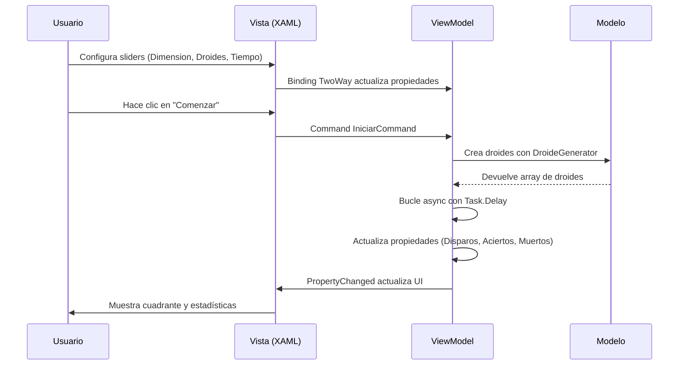

# Star Wars: Clone Wars - Simulación de Batalla

## 📋 Descripción del Proyecto

Este proyecto es una **simulación de batalla espacial** inspirada en el universo Star Wars, desarrollada como práctica de la Unidad Didáctica 10 (WPF y MVVM). El juego consiste en un batallas contra droides en un cuadrante espacial donde el jugador debe disparar a los droides antes de que se agote el tiempo.

## 🎮 Reglas del Juego

1. **Configuración Inicial**: El jugador elige la dimensión del mapa (5-9), el número de droides (5-30) y el tiempo máximo (1-3 segundos).
2. **Objetivo**: Disparar a tantos droides como sea posible antes de que expire el tiempo.
3. **Droides**: Existen 4 tipos de droides con diferentes características:
   - **SW348**: Droide básico con capacidad de defensa.
   - **SW447**: Droide con escudo protector.
   - **SW421**: Droide veloz que puede escapar de los disparos.
   - **SW6969**: Droide inestable que puede explotar al ser alcanzado.
4. **Disparos**: Los disparos pueden ser normales (25 puntos) o críticos (50 puntos, 15% de probabilidad).
5. **Movimiento**: Los droides se reubican cada 300ms.

## 🏗️ Arquitectura del Proyecto

El proyecto sigue el patrón **MVVM (Model-View-ViewModel)** con las siguientes características:

### Estructura de Carpetas

```
StarWars/
├── Config/                          # Configuración centralizada
│   └── Configuration.cs             # Todas las constantes del juego
│
├── Models/                          # Modelo (datos y lógica de negocio)
│   ├── Droide.cs                   # Clase abstracta base
│   ├── Sw348.cs                    # Droide básico (defensa)
│   ├── Sw447.cs                    # Droide con escudo
│   ├── Sw421.cs                    # Droide veloz (movimiento)
│   ├── Sw6969.cs                   # Droide inestable (explosión)
│   ├── IDefensa.cs                 # Interfaz para defensa
│   ├── IEscudo.cs                  # Interfaz para escudo
│   └── IMovimiento.cs              # Interfaz para movimiento
│
├── Factories/                       # Factorías (creación de objetos)
│   └── DroideGenerator.cs          # Generador aleatorio de droides
│
├── ViewModels/                      # ViewModels (lógica de presentación)
│   └── MainViewModel.cs            # ViewModel principal del juego
│
├── Views/                           # Vistas (interfaz gráfica)
│   ├── Main/
│   │   ├── MainWindow.xaml         # Ventana principal (XAML)
│   │   └── MainWindow.xaml.cs      # Code-behind de la ventana
│   └── Dialog/
│       ├── AcercaDeWindow.xaml     # Ventana "Acerca de"
│       └── AcercaDeWindow.xaml.cs # Code-behind
│
├── Converters/                      # Convertidores (transformación de datos)
│   └── InverseBooleanConverter.cs  # Invierte booleanos
│
├── Infrastructure/                   # Infraestructura
│   └── DependenciesProvider.cs     # Proveedor de dependencias (DI)
│
├── Resources/                       # Recursos (imágenes e iconos)
│   ├── icons/                      # Iconos del menú
│   └── images/                     # Imágenes del juego
│
└── App.xaml.cs                      # Punto de entrada y configuración DI
```

### Patrones y Tecnologías Utilizadas

| Aspecto | Tecnología/Patrón |
|---------|-------------------|
| **Patrón MVVM** | CommunityToolkit.Mvvm con atributos `[ObservableProperty]` y `[RelayCommand]` |
| **Inyección de Dependencias** | Microsoft.Extensions.DependencyInjection |
| **Logging** | Serilog |
| **Tareas Asíncronas** | async/await con Task.Run() y Dispatcher.Invoke() |
| **Converters** | IValueConverter para transformación de datos |

## 🔧 Componentes Principales

### 1. Model (Models/)

El modelo contiene la lógica de negocio del juego:

- **Droide (clase abstracta)**: Clase base con propiedades comunes (energía, símbolo, estado de vida).
- **Sw348**: Implementa `IDefensa` (capacidad de defenderse de los ataques).
- **Sw447**: Implementa `IEscudo` (tiene un escudo que absorbe parte del daño).
- **Sw421**: Implementa `IMovimiento` (puede escapar de los disparos).
- **Sw6969**: Tiene probabilidad de explotar al ser alcanzado.

### 2. Factory (Factories/)

- **DroideGenerator**: Crea droides aleatorios según las probabilidades configuradas.

### 3. ViewModel (ViewModels/)

- **MainViewModel**: Gestiona toda la lógica del juego:
  - Controla el estado del juego (en ejecución, terminado).
  - Gestiona la matriz de droides.
  - Ejecuta el bucle principal del juego con async/await.
  - Actualiza la UI mediante propiedades observables.
  - Usa comandos de CommunityToolkit.Mvvm.

### 4. Views (Views/)

- **MainWindow**: Ventana principal con:
  - Sliders para configurar dimensión, droides y tiempo.
  - Área de operaciones (log del juego).
  - Cuadrante visual (mapa del juego).
  - Contador de progreso.
- **AcercaDeWindow**: Diálogo con información del juego.

### 5. Converters (Converters/)

- **InverseBooleanConverter**: Invierte el valor de un booleano. Se usa para deshabilitar los controles cuando el juego está en ejecución (IsRunning=true → IsEnabled=false).

### 6. Configuration (Config/)

- **Configuration**: Clase estática con todas las constantes del juego (parámetros, probabilidades, valores por defecto).

## 🔄 Flujo de Datos (Binding)



## 📦 Dependencias NuGet

- **CommunityToolkit.Mvvm** (v8.x): Simplifica MVVM con atributos.
- **Microsoft.Extensions.DependencyInjection** (v8.x): Contenedor DI.
- **Serilog** + **Serilog.Sinks.Console**: Logging.

## 🚀 Cómo Ejecutar el Proyecto

1. **Requisitos**: .NET 10 SDK o superior.
2. **Compilar**:
   ```bash
   cd soluciones/19-StarWars
   dotnet build
   ```
3. **Ejecutar**:
   ```bash
   dotnet run
   ```

## 🎯 Características Educativas

Este proyecto demuestra:

1. **MVVM con CommunityToolkit**: Uso de `[ObservableProperty]`, `[RelayCommand]`, y comandos asíncronos.
2. **Inyección de Dependencias**: Configuración en `App.xaml.cs` con `DependenciesProvider`.
3. **Logging con Serilog**: Registro de eventos en la consola.
4. **Tareas en Segundo Plano**: Uso de `async/await`, `Task.Delay()`, y `Dispatcher.Invoke()`.
5. **Converters**: Transformación de datos para la UI (InverseBooleanConverter).
6. **Configuration Centralizada**: Todas las constantes en una clase estática.
7. **Interfaces para Comportamientos**: `IDefensa`, `IEscudo`, `IMovimiento`.

## 📚 Conceptos Clave Explicados

### ¿Por qué usar Converters?

Los **Converters** son esenciales en WPF por varias razones:

1. **Separación de responsabilidades**: El ViewModel trabaja con tipos de dominio (bool, enum), mientras que la Vista puede necesitar tipos de presentación (Visibility, colores, texto).

2. **Ejemplo en este proyecto**:
   - El ViewModel tiene `IsRunning = true` cuando el juego corre.
   - Los sliders deben estar **deshabilitados** cuando el juego corre.
   - Pero `IsEnabled` espera un `bool`, y no podemos usar `IsRunning` directamente porque está "alright" (los habilitaría cuando deben estar deshabilitados).
   - El `InverseBooleanConverter` transforma: `true → false`, `false → true`.

3. **Sin converters**, tendríamos que:
   - Escribir código en el code-behind.
   - Modificar el ViewModel para adaptarlo a la UI (violando MVVM).

### Binding en XAML

```xml
<!-- OneWay: la UI se actualiza cuando el ViewModel cambia -->
<TextBlock Text="{Binding Nombre, Mode=OneWay}"/>

<!-- TwoWay: cambios en la UI actualizan el ViewModel -->
<TextBox Text="{Binding Nombre, Mode=TwoWay}"/>

<!-- Con Converter: transformación automática -->
<Slider IsEnabled="{Binding IsRunning, Converter={StaticResource InverseBooleanConverter}}"/>
```

## 📝 Notas para el Desarrollador

- Los droides se generan aleatoriamente según las probabilidades definidas en `Configuration`.
- El bucle principal usa `Task.Delay` para los intervalos de disparo y movimiento.
- La actualización de la UI desde hilos secundarios se hace con `Dispatcher.Invoke()`.
- El converter `InverseBooleanConverter` está registrado en los recursos de `MainWindow.xaml`.

## 📄 Licencia

Este proyecto es para fines educativos.