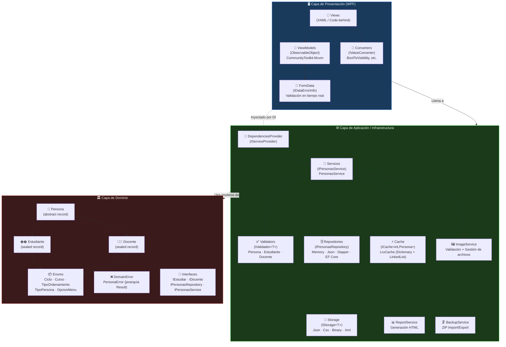
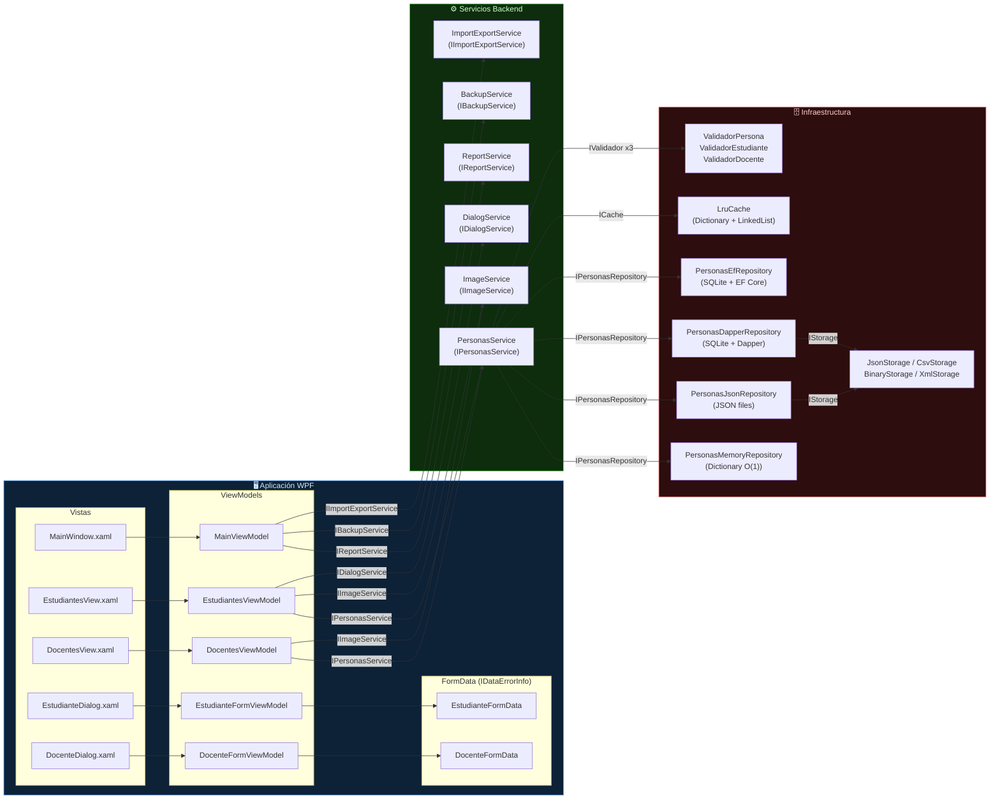
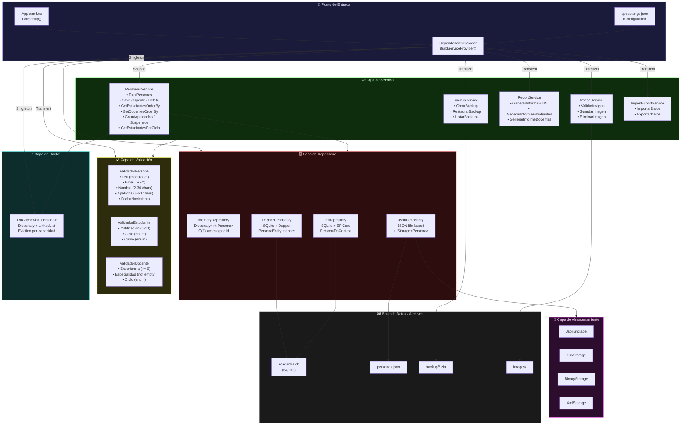
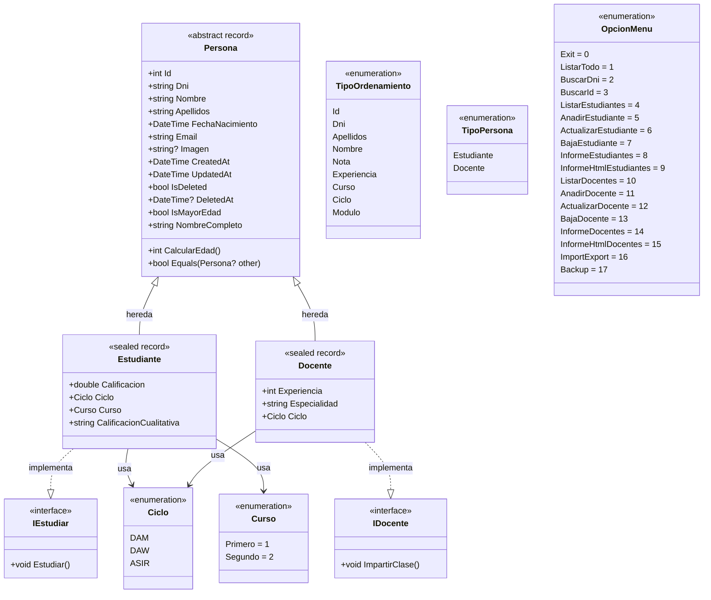

# 🎓 Sistema de Gestión Académica

> **Aplicación de escritorio WPF** construida con **.NET 10** y **C# 14** que implementa un sistema completo de gestión académica para centros educativos, siguiendo los principios de **Clean Architecture** y el patrón **MVVM**.

---

## 1. Introducción y Contexto del Problema

### 1.1. El Problema y el Enunciado

El centro educativo ***"DAW Academy"*** necesita un sistema para gestionar su base de datos de **Estudiantes** y **Docentes**. El reto no consiste únicamente en almacenar datos, sino en garantizar su **integridad**, ofrecer un rendimiento óptimo y facilitar la toma de decisiones mediante **informes estadísticos**.

Los desafíos clave del sistema son:

- **Gestión de Jerarquías**: Modelar `Estudiante` y `Docente` como especializaciones de `Persona` evitando redundancia de datos.
- **Validación de Dominio**: Los datos deben cumplir reglas estrictas de negocio (DNI español válido con algoritmo módulo 23, notas en rango 0-10, experiencia no negativa, imágenes con dimensiones y peso limitados).
- **Motor de Búsqueda**: Filtrado dinámico y ordenación multieje (por Nota, Experiencia, DNI, Apellidos, Ciclo, etc.).
- **Optimización**: Caché LRU para optimizar lecturas repetidas por ID, con política de desalojo automático.
- **Persistencia Configurable**: Soporte para cuatro estrategias de repositorio (Memoria, JSON, Dapper/SQLite, EF Core/SQLite) intercambiables sin recompilar.
- **Soft Delete**: Borrado lógico con historial completo y posibilidad de reactivación.
- **Interfaz Visual**: DataGrid WPF con búsqueda en tiempo real, validación reactiva y gestión de imágenes.

---

### 1.2. Requisitos Funcionales

Los requisitos funcionales describen las operaciones concretas que el sistema debe realizar, organizadas por módulo funcional.

#### 📋 Gestión de Personas (General)

| Código | Requisito | Descripción |
|--------|-----------|-------------|
| RF-GP-01 | Listar Personal | Listado completo con ordenación multicriterio (Id, DNI, Apellidos, Nombre, Ciclo) |
| RF-GP-02 | Buscar por DNI | Localizar cualquier persona mediante su DNI, mostrando todos sus datos |
| RF-GP-03 | Buscar por ID | Localizar cualquier persona mediante su identificador único |

#### 🎓 Gestión de Estudiantes

| Código | Requisito | Descripción |
|--------|-----------|-------------|
| RF-GE-01 | Listar Estudiantes | Listado paginado y ordenable (Id, DNI, Apellidos, Nombre, Nota, Curso, Ciclo) |
| RF-GE-02 | Añadir Estudiante | Registrar nuevos estudiantes con validación completa |
| RF-GE-03 | Actualizar Estudiante | Modificar datos de un estudiante existente |
| RF-GE-04 | Gestionar Baja Estudiante | Borrado lógico con reactivación posterior |
| RF-GE-05 | Informe de Rendimiento | Estadísticas (total, media, aprobados, suspensos) con filtrado por ciclo/curso |
| RF-GE-06 | Informe HTML Rendimiento | Informe HTML que se abre automáticamente en el navegador |
| RF-GE-07 | Paginación de Listados | Recuperación paginada para eficiencia en repositorios de gran volumen |
| RF-GE-08 | Gestión Visual (WPF) | DataGrid con búsqueda en tiempo real y ordenación multicriterio |
| RF-GE-09 | Validación de Imagen | Extensión (png/jpg/jpeg/bmp), máx 5 MB, máx 4096×4096 px |

#### 👨‍🏫 Gestión de Docentes

| Código | Requisito | Descripción |
|--------|-----------|-------------|
| RF-GD-01 | Listar Docentes | Listado paginado y ordenable (Id, DNI, Apellidos, Nombre, Experiencia, Módulo, Ciclo) |
| RF-GD-02 | Añadir Docente | Registrar nuevos docentes con validación completa |
| RF-GD-03 | Actualizar Docente | Modificar datos de un docente existente |
| RF-GD-04 | Gestionar Baja Docente | Borrado lógico con reactivación posterior |
| RF-GD-05 | Informe de Experiencia | Estadísticas de experiencia con filtrado por ciclo |
| RF-GD-06 | Informe HTML Experiencia | Informe HTML que se abre automáticamente en el navegador |
| RF-GD-07 | Mantenimiento (Vacuum) | Compactación del almacenamiento binario |
| RF-GD-08 | Gestión Visual (WPF) | DataGrid con búsqueda en tiempo real y ordenación multicriterio |
| RF-GD-09 | Validación de Imagen | Extensión (png/jpg/jpeg/bmp), máx 5 MB, máx 4096×4096 px |

#### 🔄 Importación / Exportación

| Código | Requisito | Descripción |
|--------|-----------|-------------|
| RF-IE-01 | Importar Datos | Importar datos desde el formato configurado |
| RF-IE-02 | Exportar Datos | Exportar datos al formato configurado |

#### 💾 Copias de Seguridad

| Código | Requisito | Descripción |
|--------|-----------|-------------|
| RF-BK-01 | Crear Backup | Generar copia de seguridad ZIP en el formato configurado |
| RF-BK-02 | Restaurar Backup | Restaurar el sistema desde un ZIP de backup |
| RF-BK-03 | Listar Backups | Mostrar las copias de seguridad disponibles |

---

### 1.3. Requisitos No Funcionales

| Código | Requisito | Descripción |
|--------|-----------|-------------|
| RNF-01 | Rendimiento | Las búsquedas por ID y DNI deben ser O(1) |
| RNF-02 | Integridad | El DNI debe ser único y válido (módulo 23 español); no se permiten duplicados en Email |
| RNF-03 | Persistencia | Los datos deben sobrevivir entre ejecuciones del sistema |
| RNF-04 | Configurabilidad | Repositorio, almacenamiento y backup configurables en `appsettings.json` sin recompilar |
| RNF-05 | Robustez | Gestión de errores con mensajes claros al usuario mediante el patrón `Result` |
| RNF-06 | Trazabilidad | Todas las operaciones deben quedar registradas en logs (Serilog) |
| RNF-07 | Recuperación | El sistema debe poder restaurarse desde una copia de seguridad |
| RNF-08 | Arquitectura MVVM | Uso de `CommunityToolkit.Mvvm` con `[ObservableProperty]` y `[RelayCommand]` |
| RNF-09 | Validación en UI | `IDataErrorInfo` en FormData para validación en tiempo real con binding WPF |
| RNF-10 | Validación de Imágenes | Extensión, peso (máx 5 MB) y dimensiones (máx 4096×4096) validados por cabecera de archivo |
| RNF-11 | Inyección de Dependencias | Constructores primarios de C# 12 en ViewModels para DI |

---

### 1.4. Requisitos de Información

#### Entidades del Sistema

| Entidad | Atributos |
|---------|-----------|
| `Persona` *(abstracta)* | `Id`, `Dni`, `Nombre`, `Apellidos`, `FechaNacimiento`, `Email`, `Imagen`, `IsMayorEdad` *(calculado)*, `NombreCompleto` *(calculado)*, `CreatedAt`, `UpdatedAt`, `IsDeleted`, `DeletedAt` |
| `Estudiante` | Hereda `Persona` + `Calificacion` (0-10), `Ciclo`, `Curso`, `CalificacionCualitativa` *(calculado)* |
| `Docente` | Hereda `Persona` + `Experiencia` (años ≥ 0), `Especialidad`, `Ciclo` |

#### Datos Derivados y Calculados

| Atributo | Fórmula de Cálculo |
|----------|--------------------|
| `NombreCompleto` | `Nombre + " " + Apellidos` |
| `IsMayorEdad` | `CalcularEdad() >= 18`, usando `FechaNacimiento` |
| `CalificacionCualitativa` | `< 5` → Suspenso · `5-6.9` → Aprobado · `7-8.9` → Notable · `≥ 9` → Sobresaliente |
| `PorcentajeAprobados` | `(CountAprobados / TotalEstudiantes) * 100` |

#### Restricciones de Integridad

| Campo | Restricción |
|-------|-------------|
| `Dni` | Obligatorio, único, formato válido (letra + 8 dígitos), verificación módulo 23 |
| `Email` | Obligatorio, único, formato RFC válido |
| `Imagen` | Opcional; solo extensiones `.png`, `.jpg`, `.jpeg`, `.bmp` |
| `Nombre` | Obligatorio, entre 2 y 30 caracteres |
| `Apellidos` | Obligatorio, entre 2 y 50 caracteres |
| `FechaNacimiento` | No puede ser fecha futura; debe estar entre 1900 y hoy |
| `Calificacion` | Valor decimal entre `0.0` y `10.0` (ambos incluidos) |
| `Experiencia` | Entero mayor o igual a `0` |
| `Especialidad` | No puede ser nula ni vacía |

---

### 1.5. Diagrama de Casos de Uso UML

```
┌─────────────────────────────────────────────────────────────────────────────┐
│                    Sistema de Gestión Académica                             │
│                                                                             │
│  ┌─────────────────────────────────────────────────────────────────────┐   │
│  │  Módulo Estudiantes          Módulo Docentes         Módulo Backup  │   │
│  │                                                                     │   │
│  │  ○ Listar Estudiantes        ○ Listar Docentes       ○ Crear Backup │   │
│  │  ○ Añadir Estudiante         ○ Añadir Docente        ○ Restaurar    │   │
│  │  ○ Actualizar Estudiante     ○ Actualizar Docente    ○ Listar BK    │   │
│  │  ○ Dar de Baja               ○ Dar de Baja                          │   │
│  │  ○ Reactivar                 ○ Reactivar             Módulo IE      │   │
│  │  ○ Informe Rendimiento       ○ Informe Experiencia                  │   │
│  │  ○ Informe HTML              ○ Informe HTML          ○ Importar     │   │
│  │  ○ Paginación                ○ Paginación            ○ Exportar     │   │
│  │  ○ Gestión de Imagen         ○ Gestión de Imagen                    │   │
│  │                                                                     │   │
│  │  Módulo General                                                     │   │
│  │  ○ Buscar por DNI                                                   │   │
│  │  ○ Buscar por ID                                                    │   │
│  │  ○ Listar Todo el Personal                                          │   │
│  └─────────────────────────────────────────────────────────────────────┘   │
│                                        ▲                                    │
└────────────────────────────────────────┼────────────────────────────────────┘
                                         │
                                   👤 Administrador
```

---

## 2. Arquitectura del Sistema

### 2.1. Visión General de la Arquitectura

El sistema sigue los principios de **Clean Architecture** combinados con el patrón de presentación **MVVM** (Model-View-ViewModel). Las capas se organizan de forma que las dependencias siempre apuntan hacia el interior (hacia el dominio), nunca hacia el exterior.

```
┌──────────────────────────────────────────────────────────┐
│  Regla de Dependencias: de afuera hacia adentro          │
│                                                          │
│  Presentación → Aplicación → Dominio ← Infraestructura  │
│                                                          │
│  Ninguna capa interior conoce a las capas exteriores     │
└──────────────────────────────────────────────────────────┘
```

#### 2.1.1. Diagrama de Capas del Sistema Completo (Mermaid)



#### 2.1.2. Diagrama de Componentes (Frontend + Backend) (Mermaid)



---

### 2.2. Arquitectura Backend

#### 2.2.1. Sistema de Inyección de Dependencias (DependenciesProvider)

El punto de entrada de la composición del sistema es `DependenciesProvider.cs`, una clase estática que construye el contenedor de servicios de `Microsoft.Extensions.DependencyInjection`. Toda la aplicación accede a sus dependencias exclusivamente a través de este proveedor.

```csharp
public static class DependenciesProvider
{
    public static IServiceProvider BuildServiceProvider()
    {
        var services = new ServiceCollection();

        CleanData();               // Limpieza condicional de datos si DropData=true
        RegisterCaches(services);       // Singleton: LruCache<int, Persona>
        RegisterValidators(services);   // Transient: 3 validadores
        RegisterStorages(services);     // Transient: Json/Csv/Binary/Xml según config
        RegisterRepositories(services); // Singleton: Memory/Json/Dapper/EfCore según config
        RegisterServices(services);     // Scoped: PersonasService + Transient: otros
        RegisterViewModels(services);   // Transient: todos los ViewModels

        return services.BuildServiceProvider();
    }
}
```

El proveedor se inicializa en `App.xaml.cs` y se usa para resolver ViewModels desde las vistas:

```csharp
// En App.xaml.cs
public partial class App : Application
{
    public static IServiceProvider ServiceProvider { get; private set; } = null!;

    protected override void OnStartup(StartupEventArgs e)
    {
        ServiceProvider = DependenciesProvider.BuildServiceProvider();
        base.OnStartup(e);
    }
}

// En una vista WPF (code-behind)
public partial class EstudiantesView : UserControl
{
    public EstudiantesView()
    {
        InitializeComponent();
        var vm = App.ServiceProvider.GetRequiredService<EstudiantesViewModel>();
        vm.Initialize(); // carga inicial de datos
        DataContext = vm;
    }
}
```

#### 2.2.2. Configuración (appsettings.json)

Toda la configuración del sistema se centraliza en `appsettings.json`. El cambio de repositorio, formato de backup o umbral de aprobado no requiere recompilar.

```json
{
  "Storage": {
    "Type": "Json"
  },
  "Repository": {
    "Type": "Dapper",
    "Directory": "data",
    "ConnectionString": "Data Source=data/academia.db",
    "DropData": true,
    "SeedData": true,
    "UseLogicalDelete": true
  },
  "Cache": {
    "Size": 5
  },
  "Backup": {
    "Directory": "backup",
    "Format": "Json"
  },
  "Reports": {
    "Directory": "reports"
  },
  "Academica": {
    "NotaAprobado": 5.0
  },
  "Images": {
    "Directory": "images",
    "AllowedExtensions": [".png", ".jpg", ".jpeg", ".bmp"]
  },
  "Development": {
    "Enabled": true
  },
  "Serilog": {
    "MinimumLevel": "Debug",
    "WriteTo": ["Console", "File"]
  }
}
```

**Valores válidos para `Repository.Type`**: `Memory`, `Json`, `Dapper`, `EfCore`  
**Valores válidos para `Storage.Type`** y `Backup.Format`: `Json`, `Csv`, `Binary`, `Xml`

#### 2.2.3. Ciclo de Vida de Componentes

La elección del ciclo de vida de cada componente es crítica para la correcta gestión de recursos y el rendimiento:

| Ciclo de vida | Componentes | Justificación |
|---------------|-------------|---------------|
| **Singleton** | `IPersonasRepository`, `ICache<int,Persona>`, `IDialogService` | Deben ser únicos durante toda la ejecución; el repositorio mantiene el estado en memoria, la caché acumula entradas y el servicio de diálogos no tiene estado mutable peligroso |
| **Scoped** | `IPersonasService` | Un único servicio por scope de operación; accede al repositorio singleton y coordina validaciones |
| **Transient** | `IValidador<Persona>` (×3), `IStorage<Persona>`, `IBackupService`, `IImageService`, `IReportService`, `IImportExportService`, todos los ViewModels | Se crean y destruyen en cada petición; sin estado persistente entre llamadas |

```csharp
// Registro representativo de cada ciclo de vida
private static void RegisterRepositories(IServiceCollection services)
{
    // Singleton: mismo repositorio para toda la aplicación
    services.AddSingleton<IPersonasRepository, PersonasDapperRepository>();
}

private static void RegisterServices(IServiceCollection services)
{
    // Scoped: nuevo por unidad de trabajo
    services.AddScoped<IPersonasService, PersonasService>();
    // Transient: nuevo en cada inyección
    services.AddTransient<IImageService, ImageService>();
    services.AddTransient<IReportService, ReportService>();
}

private static void RegisterViewModels(IServiceCollection services)
{
    // Transient: cada vista obtiene su propio ViewModel fresco
    services.AddTransient<EstudiantesViewModel>();
    services.AddTransient<DocentesViewModel>();
    services.AddTransient<EstudianteFormViewModel>();
    services.AddTransient<DocenteFormViewModel>();
}
```

#### 2.2.4. Diagrama de Arquitectura en Capas del Backend (Mermaid)



---

### 2.3. Modelo de Dominio

El dominio se modela con **C# records** (tipos inmutables), lo que garantiza que ningún objeto pueda ser mutado accidentalmente después de su creación. Las actualizaciones se realizan mediante el operador `with` que crea una nueva instancia con los campos modificados.

#### 2.3.1. Diagrama de Clases del Modelo de Dominio Completo (Mermaid)



#### 2.3.2. Entidades (Persona, Estudiante, Docente)

Las tres entidades centrales del dominio se implementan como **records de C#**, lo que proporciona:
- **Igualdad por valor** (con override personalizado basado en DNI)
- **Inmutabilidad** mediante propiedades `init`
- **Deconstrucción** automática
- **`with` expressions** para actualizaciones funcionales

**`Persona.cs`** — Record abstracto base:

```csharp
public abstract record Persona
{
    public int Id { get; init; }
    public string Dni { get; init; } = string.Empty;
    public string Nombre { get; init; } = string.Empty;
    public string Apellidos { get; init; } = string.Empty;
    public DateTime FechaNacimiento { get; init; }
    public string Email { get; init; } = string.Empty;
    public string? Imagen { get; init; }
    public DateTime CreatedAt { get; init; } = DateTime.UtcNow;
    public DateTime UpdatedAt { get; init; } = DateTime.UtcNow;
    public bool IsDeleted { get; init; } = false;
    public DateTime? DeletedAt { get; init; } = null;

    // Propiedades calculadas
    public bool IsMayorEdad => CalcularEdad() >= 18;
    public string NombreCompleto => $"{Nombre} {Apellidos}";

    private int CalcularEdad()
    {
        var hoy = DateTime.Today;
        var edad = hoy.Year - FechaNacimiento.Year;
        if (FechaNacimiento.Date > hoy.AddYears(-edad)) edad--;
        return edad;
    }

    // Igualdad semántica basada solo en DNI (no en Id técnico)
    public virtual bool Equals(Persona? other) =>
        other is not null &&
        string.Equals(Dni, other.Dni, StringComparison.OrdinalIgnoreCase);

    public override int GetHashCode() =>
        StringComparer.OrdinalIgnoreCase.GetHashCode(Dni);
}
```

**`Estudiante.cs`** — Record sealed especializado:

```csharp
public sealed record Estudiante : Persona, IEstudiar
{
    public double Calificacion { get; init; }
    public Ciclo Ciclo { get; init; }
    public Curso Curso { get; init; }

    /// <summary>Calificación cualitativa calculada a partir de la nota numérica.</summary>
    public string CalificacionCualitativa => Calificacion switch
    {
        < 5  => "Suspenso",
        < 7  => "Aprobado",
        < 9  => "Notable",
        _    => "Sobresaliente"
    };

    public void Estudiar() =>
        Console.WriteLine($"{NombreCompleto} está estudiando {Ciclo} ({Curso}).");
}
```

**`Docente.cs`** — Record sealed especializado:

```csharp
public sealed record Docente : Persona, IDocente
{
    public int Experiencia { get; init; }
    public string Especialidad { get; init; } = string.Empty;
    public Ciclo Ciclo { get; init; }

    public void ImpartirClase() =>
        Console.WriteLine(
            $"{NombreCompleto} imparte {Especialidad} en {Ciclo} " +
            $"con {Experiencia} años de experiencia.");
}
```

> **Patrón de actualización con `with`**: Dado que los records son inmutables, para modificar una entidad se crea una copia con los campos actualizados:
> ```csharp
> var estudianteActualizado = estudiante with
> {
>     Calificacion = 8.5,
>     UpdatedAt = DateTime.UtcNow
> };
> ```

#### 2.3.3. Records, Enums y Value Objects

**Enumeraciones del dominio:**

```csharp
/// <summary>Ciclos formativos disponibles en el centro.</summary>
public enum Ciclo
{
    DAM,   // Desarrollo de Aplicaciones Multiplataforma
    DAW,   // Desarrollo de Aplicaciones Web
    ASIR   // Administración de Sistemas Informáticos en Red
}

/// <summary>Curso en el que está matriculado el estudiante o imparte el docente.</summary>
public enum Curso
{
    Primero = 1,
    Segundo = 2
}

/// <summary>Criterios de ordenación disponibles para listados.</summary>
public enum TipoOrdenamiento
{
    Id, Dni, Apellidos, Nombre,
    Nota,        // Solo Estudiantes
    Experiencia, // Solo Docentes
    Curso,       // Solo Estudiantes
    Ciclo,
    Modulo       // Solo Docentes (especialidad/módulo)
}

/// <summary>Discriminador de tipo para la entidad de base de datos.</summary>
public enum TipoPersona
{
    Estudiante,
    Docente
}
```

**Interfaces de comportamiento:**

```csharp
public interface IEstudiar
{
    void Estudiar();
}

public interface IDocente
{
    void ImpartirClase();
}
```

#### 2.3.4. Propiedades Calculadas

Las propiedades calculadas se definen directamente en los records como expresiones de propiedad (`=>`). Son **puras** (sin efectos secundarios) y **derivadas** (siempre calculadas desde los datos base):

| Propiedad | Record | Expresión |
|-----------|--------|-----------|
| `NombreCompleto` | `Persona` | `$"{Nombre} {Apellidos}"` |
| `IsMayorEdad` | `Persona` | `CalcularEdad() >= 18` |
| `CalificacionCualitativa` | `Estudiante` | Switch expression sobre `Calificacion` |

```csharp
// Ejemplo de uso en ViewModel
public string EstadoEstudiante =>
    $"{estudiante.NombreCompleto} — {estudiante.CalificacionCualitativa} " +
    $"({estudiante.Calificacion:F1}) — " +
    $"{(estudiante.IsMayorEdad ? "Mayor de edad" : "Menor de edad")}";
```

#### 2.3.5. Restricciones de Integridad

Las restricciones se aplican en **dos capas** de defensa:

**1. Capa de validación (Validators):** Antes de persistir cualquier entidad, los validadores comprueban todas las reglas de negocio y acumulan los errores para mostrarlos al usuario.

**2. Capa de repositorio:** Las verificaciones de unicidad (DNI único, Email único) se realizan en el repositorio antes de insertar o actualizar.

```csharp
// Ejemplo de flujo de validación completo en PersonasService
public Result<Persona, DomainError> Save(Persona persona)
{
    // 1. Validar campos básicos de Persona
    var validacionBase = _validadorPersona.Validar(persona);
    if (validacionBase.IsFailure) return validacionBase;

    // 2. Validar campos específicos del subtipo
    var validacionEspecifica = persona switch
    {
        Estudiante e => _validadorEstudiante.Validar(e),
        Docente d    => _validadorDocente.Validar(d),
        _            => Result.Success<Persona, DomainError>(persona)
    };
    if (validacionEspecifica.IsFailure) return validacionEspecifica;

    // 3. Comprobar unicidad en repositorio
    if (_repository.ExisteDni(persona.Dni))
        return Result.Failure<Persona, DomainError>(
            new PersonaError.DniAlreadyExists(persona.Dni));

    if (_repository.ExisteEmail(persona.Email))
        return Result.Failure<Persona, DomainError>(
            new PersonaError.EmailAlreadyExists(persona.Email));

    // 4. Persistir
    return _repository.Create(persona);
}
```

---

### 2.4. Gestión de Errores

#### 2.4.1. Patrón Result

El sistema abandona el uso de **excepciones** para el flujo de control normal y adopta el **patrón Result** de programación funcional mediante la librería `CSharpFunctionalExtensions`. Este patrón hace explícito en el tipo de retorno si una operación puede fallar, obligando al llamador a manejar ambos casos.

**Jerarquía de errores del dominio:**

```csharp
/// <summary>Error base de dominio. Todos los errores del sistema heredan de este.</summary>
public abstract record DomainError(string Message);

/// <summary>Errores específicos relacionados con operaciones sobre Personas.</summary>
public abstract record PersonaError(string Message) : DomainError(Message)
{
    /// <summary>No se encontró la persona con el identificador dado.</summary>
    public sealed record NotFound(string Id)
        : PersonaError($"No se encontró ninguna persona con el identificador '{Id}'.");

    /// <summary>Los datos de la persona no pasan las validaciones de dominio.</summary>
    public sealed record Validation(IEnumerable<string> Errors)
        : PersonaError($"Errores de validación: {string.Join("; ", Errors)}");

    /// <summary>Ya existe una persona con el mismo DNI en el sistema.</summary>
    public sealed record DniAlreadyExists(string Dni)
        : PersonaError($"Ya existe una persona con el DNI '{Dni}' en el sistema.");

    /// <summary>Ya existe una persona con el mismo Email en el sistema.</summary>
    public sealed record EmailAlreadyExists(string Email)
        : PersonaError($"Ya existe una persona con el email '{Email}' en el sistema.");

    /// <summary>Error al acceder o escribir en la base de datos.</summary>
    public sealed record DatabaseError(string Details)
        : PersonaError($"Error de base de datos: {Details}");

    /// <summary>Error al gestionar el almacenamiento de archivos (imágenes, JSON, etc.).</summary>
    public sealed record StorageError(string Details)
        : PersonaError($"Error de almacenamiento: {Details}");
}
```

**Interfaz del validador con Result:**

```csharp
public interface IValidador<T>
{
    /// <summary>
    /// Valida la entidad dada.
    /// Retorna Success con la entidad si es válida,
    /// o Failure con un DomainError que describe todos los problemas encontrados.
    /// </summary>
    Result<T, DomainError> Validar(T entidad);
}
```

**Ejemplos de validadores concretos:**

```csharp
public class ValidadorPersona : IValidador<Persona>
{
    public Result<Persona, DomainError> Validar(Persona persona)
    {
        var errores = new List<string>();

        // Validación de DNI (algoritmo módulo 23 español)
        if (!EsDniValido(persona.Dni))
            errores.Add($"DNI '{persona.Dni}' no tiene un formato válido (8 dígitos + letra).");

        // Validación de Email
        if (!EsEmailValido(persona.Email))
            errores.Add($"El email '{persona.Email}' no tiene un formato RFC válido.");

        // Validación de Nombre
        if (string.IsNullOrWhiteSpace(persona.Nombre) ||
            persona.Nombre.Length < 2 || persona.Nombre.Length > 30)
            errores.Add("El nombre debe tener entre 2 y 30 caracteres.");

        // Validación de Apellidos
        if (string.IsNullOrWhiteSpace(persona.Apellidos) ||
            persona.Apellidos.Length < 2 || persona.Apellidos.Length > 50)
            errores.Add("Los apellidos deben tener entre 2 y 50 caracteres.");

        // Validación de Fecha de Nacimiento
        if (persona.FechaNacimiento > DateTime.Today)
            errores.Add("La fecha de nacimiento no puede ser futura.");
        if (persona.FechaNacimiento.Year < 1900)
            errores.Add("La fecha de nacimiento debe ser posterior al año 1900.");

        return errores.Count > 0
            ? Result.Failure<Persona, DomainError>(new PersonaError.Validation(errores))
            : Result.Success<Persona, DomainError>(persona);
    }

    private static bool EsDniValido(string dni)
    {
        const string letras = "TRWAGMYFPDXBNJZSQVHLCKE";
        if (string.IsNullOrEmpty(dni) || dni.Length != 9) return false;
        if (!int.TryParse(dni[..8], out var numero)) return false;
        return char.ToUpper(dni[8]) == letras[numero % 23];
    }

    private static bool EsEmailValido(string email) =>
        !string.IsNullOrWhiteSpace(email) &&
        System.Text.RegularExpressions.Regex.IsMatch(
            email, @"^[^@\s]+@[^@\s]+\.[^@\s]+$");
}

public class ValidadorEstudiante : IValidador<Persona>
{
    public Result<Persona, DomainError> Validar(Persona persona)
    {
        if (persona is not Estudiante e)
            return Result.Success<Persona, DomainError>(persona);

        var errores = new List<string>();

        if (e.Calificacion < 0.0 || e.Calificacion > 10.0)
            errores.Add($"La calificación {e.Calificacion} debe estar entre 0.0 y 10.0.");

        if (!Enum.IsDefined(typeof(Ciclo), e.Ciclo))
            errores.Add($"El ciclo '{e.Ciclo}' no es válido.");

        if (!Enum.IsDefined(typeof(Curso), e.Curso))
            errores.Add($"El curso '{e.Curso}' no es válido.");

        return errores.Count > 0
            ? Result.Failure<Persona, DomainError>(new PersonaError.Validation(errores))
            : Result.Success<Persona, DomainError>(persona);
    }
}

public class ValidadorDocente : IValidador<Persona>
{
    public Result<Persona, DomainError> Validar(Persona persona)
    {
        if (persona is not Docente d)
            return Result.Success<Persona, DomainError>(persona);

        var errores = new List<string>();

        if (d.Experiencia < 0)
            errores.Add($"La experiencia ({d.Experiencia}) no puede ser negativa.");

        if (string.IsNullOrWhiteSpace(d.Especialidad))
            errores.Add("La especialidad no puede estar vacía.");

        if (!Enum.IsDefined(typeof(Ciclo), d.Ciclo))
            errores.Add($"El ciclo '{d.Ciclo}' no es válido.");

        return errores.Count > 0
            ? Result.Failure<Persona, DomainError>(new PersonaError.Validation(errores))
            : Result.Success<Persona, DomainError>(persona);
    }
}
```

**Uso del patrón Result en el ViewModel:**

```csharp
// En EstudiantesViewModel
[RelayCommand]
private async Task GuardarEstudianteAsync()
{
    var formData = _estudianteFormData;
    var nuevoEstudiante = new Estudiante
    {
        Dni          = formData.Dni,
        Nombre       = formData.Nombre,
        Apellidos    = formData.Apellidos,
        Email        = formData.Email,
        Calificacion = double.Parse(formData.Calificacion),
        Ciclo        = formData.CicloSeleccionado,
        Curso        = formData.CursoSeleccionado,
        FechaNacimiento = formData.FechaNacimiento
    };

    var resultado = _personasService.Save(nuevoEstudiante);

    // El patrón Result obliga a manejar ambos casos explícitamente
    resultado.Match(
        onSuccess: persona =>
        {
            Estudiantes.Add((Estudiante)persona);
            _dialogService.ShowInfo($"Estudiante '{persona.NombreCompleto}' guardado correctamente.");
        },
        onFailure: error =>
        {
            _dialogService.ShowError($"No se pudo guardar el estudiante:\n{error.Message}");
        }
    );
}
```

**Ventajas del patrón Result frente a excepciones:**

| Aspecto | Excepciones | Patrón Result |
|---------|-------------|---------------|
| **Visibilidad** | Error implícito; el compilador no avisa | Error explícito en el tipo de retorno |
| **Rendimiento** | Las excepciones son costosas en el happy path | Camino feliz sin overhead |
| **Composición** | Try/catch anidados difíciles de leer | Encadenamiento funcional con `.Map()`, `.Bind()`, `.Match()` |
| **Testabilidad** | Necesita `Assert.Throws` en tests | Comprueba `.IsSuccess` / `.IsFailure` directamente |
| **Principio Railway** | No aplicable | ✅ Railway-oriented programming |

```csharp
// Ejemplo de composición encadenada (Railway-Oriented Programming)
public Result<Persona, DomainError> ProcesarActualizacion(int id, Persona nuevaPersona) =>
    _repository.GetById(id) is { } existente
        ? Result.Success<Persona, DomainError>(existente)
        : Result.Failure<Persona, DomainError>(new PersonaError.NotFound(id.ToString()))
    .Bind(_ => _validadorPersona.Validar(nuevaPersona))
    .Bind(p => p is Estudiante e
        ? _validadorEstudiante.Validar(e)
        : _validadorDocente.Validar((Docente)p))
    .Bind(p => _repository.Update(id, p));
```

---

*Generado para el proyecto **GestionAcademica** — .NET 10 · C# 14 · WPF · Clean Architecture · MVVM*
