# 🎓 Guía Maestra: Sistema de Gestión Académica (DAW)


---

## 1. El Problema y el Enunciado
El centro educativo ***"DAW Academy"*** requiere un sistema para gestionar su base de datos de **Estudiantes** y **Docentes**.

### El Reto Académico
No se trata solo de almacenar datos, sino de garantizar su **integridad** y permitir la toma de decisiones mediante **informes estadísticos**.
*   **Gestión de Entidades:** Manejo de jerarquías (Herencia) para evitar redundancia de datos.
*   **Validación de Dominio:** Los datos deben cumplir reglas estrictas (DNI válido, notas en rango, experiencia no negativa).
*   **Motor de Búsqueda:** Implementar filtrado dinámico y ordenación multiaxis (por Nota, por Experiencia, por DNI, etc.).
*   **Optimización:** Implementar una caché LRU para optimizar las lecturas repetidas por ID.
*   **Estructuras de Datos:** Se usa `Dictionary` para búsquedas O(1) en el Repository.

---

### Requisitos Funcionales, No Funcionales y de Información del Sistema

Los requisitos funcionales describen las operaciones que el sistema debe realizar. Se organizan por actor y por categoría de funcionalidad.

#### 1.1 Gestión de Personas (General)

| Código   | Requisito       | Descripción                                                                                                                                                       |
| -------- | --------------- | ----------------------------------------------------------------------------------------------------------------------------------------------------------------- |
| RF-GP-01 | Listar Personal | El sistema deberá mostrar un listado completo de todo el personal (estudiantes y docentes) ordenado por diferentes criterios (ID, DNI, Apellidos, Nombre, Ciclo). |
| RF-GP-02 | Buscar por DNI  | El sistema deberá permitir buscar cualquier persona mediante su DNI, mostrando sus datos completos.                                                               |
| RF-GP-03 | Buscar por ID   | El sistema deberá permitir buscar cualquier persona mediante su identificador único (ID).                                                                         |
| RF-GP-04 | Listado HTML    | El sistema deberá generar y mostrar un listado completo en formato HTML que se abra automáticamente en el navegador.                                             |

#### 1.2 Gestión de Estudiantes

| Código   | Requisito              | Descripción                                                                                                                                                                       |
| -------- | ---------------------- | --------------------------------------------------------------------------------------------------------------------------------------------------------------------------------- |
| RF-GE-01 | Listar Estudiantes     | El sistema deberá mostrar un listado de estudiantes ordenado por diferentes criterios (ID, DNI, Apellidos, Nombre, Nota, Curso, Ciclo).                                           |
| RF-GE-02 | Añadir Estudiante      | El sistema deberá permitir registrar nuevos estudiantes con validación completa (DNI válido, nombre, apellidos, nota 0-10, ciclo y curso).                                        |
| RF-GE-03 | Actualizar Estudiante  | El sistema deberá permitir modificar los datos de un estudiante existente tras verificar su existencia mediante DNI.                                                              |
| RF-GE-04 | Gestionar Baja Estudiante | El sistema permitirá marcar como baja (borrado lógico) a un estudiante tras buscarlo por DNI, preservando su historial. También permitirá su reactivación mediante la actualización. |
| RF-GE-05 | Informe de Rendimiento    | El sistema deberá generar informes estadísticos de estudiantes con métricas (total, media, aprobados, suspensos) y filtrado por alcance (global, ciclo, curso, clase específica). Solo considera estudiantes activos. |
| RF-GE-06 | Informe HTML Rendimiento | El sistema deberá generar y mostrar un informe de rendimiento en formato HTML que se abra automáticamente en el navegador.                                                |
| RF-GE-07 | Paginación de Listados    | El sistema permitirá recuperar estudiantes de forma paginada para mejorar la eficiencia del repositorio. |
| RF-GE-08 | Gestión Visual (WPF) | La interfaz muestra los estudiantes en una DataGrid con búsqueda en tiempo real, ordenación multicriterio y feedback visual del estado. |
| RF-GE-09 | Validación de Imagen | Las imágenes de estudiantes se validan: extensión (png/jpg/jpeg/bmp/gif), tamaño máximo 5 MB, dimensiones máximas 4096×4096 px. |

#### 1.3 Gestión de Docentes

| Código   | Requisito              | Descripción                                                                                                                                   |
| -------- | ---------------------- | --------------------------------------------------------------------------------------------------------------------------------------------- |
| RF-GD-01 | Listar Docentes        | El sistema deberá mostrar un listado de docentes ordenado por diferentes criterios (ID, DNI, Apellidos, Nombre, Experiencia, Módulo, Ciclo).  |
| RF-GD-02 | Añadir Docente         | El sistema deberá permitir registrar nuevos docentes con validación completa (DNI válido, nombre, apellidos, experiencia ≥ 0, módulo, ciclo). |
| RF-GD-03 | Actualizar Docente     | El sistema deberá permitir modificar los datos de un docente existente tras verificar su existencia mediante DNI.                             |
| RF-GD-04 | Gestionar Baja Docente | El sistema permitirá marcar como baja (borrado lógico) a un docente tras buscarlo por DNI, preservando su historial. También permitirá su reactivación mediante la actualización. |
| RF-GD-05 | Informe de Experiencia | El sistema deberá generar informes estadísticos de docentes con métricas (total, experiencia media) y filtrado por ciclo. Solo considera docentes activos. |
| RF-GD-06 | Informe HTML Experiencia | El sistema deberá generar y mostrar un informe de experiencia en formato HTML que se abra automáticamente en el navegador.                  |
| RF-GD-07 | Mantenimiento (Vacuum) | El sistema permitirá compactar el almacén binario eliminando fragmentación física pero manteniendo íntegro el historial de bajas. |
| RF-GD-08 | Gestión Visual (WPF) | La interfaz muestra los docentes en una DataGrid con búsqueda en tiempo real, ordenación multicriterio y feedback visual del estado. |
| RF-GD-09 | Validación de Imagen | Las imágenes de docentes se validan: extensión (png/jpg/jpeg/bmp/gif), tamaño máximo 5 MB, dimensiones máximas 4096×4096 px. |

#### 1.4 Gestión de Importación/Exportación

| Código   | Requisito              | Descripción                                                                                                                                 |
| -------- | ---------------------- | ------------------------------------------------------------------------------------------------------------------------------------------- |
| RF-IE-01 | Importar Datos        | El sistema deberá permitir importar datos desde un archivo externo en el formato configurado, validando la integridad de los datos.            |
| RF-IE-02 | Exportar Datos        | El sistema deberá permitir exportar todos los datos actuales a un archivo externo en el formato configurado.                                     |

#### 1.5 Gestión de Backup

| Código   | Requisito              | Descripción                                                                                                                                 |
| -------- | ---------------------- | ------------------------------------------------------------------------------------------------------------------------------------------- |
| RF-BK-01 | Realizar Backup       | El sistema deberá crear una copia de seguridad en formato ZIP contendo los datos en el formato configurado (JSON por defecto).             |
| RF-BK-02 | Restaurar Backup      | El sistema deberá permitir restaurar una copia de seguridad desde un archivo ZIP, reemplazando todos los datos actuales.                     |
| RF-BK-03 | Listar Backups        | El sistema deberá mostrar un listado de las copias de seguridad disponibles con su fecha, tamaño y ubicación.                               |

---

### 1.6 Requisitos No Funcionales

Los requisitos no funcionales describen las cualidades y restricciones del sistema.

| Código | Requisito | Descripción |
|--------|-----------|-------------|
| RNF-01 | Rendimiento | Las búsquedas por ID y DNI deben ser O(1). |
| RNF-02 | Integridad | El DNI debe ser único y válido. No se permiten duplicados incluso tras bajas. |
| RNF-03 | Persistencia | Los datos deben persistir entre ejecuciones (excepto en repositorio Memory). |
| RNF-04 | Configurabilidad | El tipo de repositorio, storage y backup debe ser configurable sin recompilar. |
| RNF-05 | Robustez | El sistema debe manejar errores de forma correcta con mensajes claros al usuario. |
| RNF-06 | Trazabilidad | Todas las operaciones deben estar registradas en log. |
| RNF-07 | Recuperación | El sistema debe permitir restaurar desde backup en caso de pérdida de datos. |
| RNF-08 | Arquitectura MVVM | La capa de presentación usa el patrón MVVM con CommunityToolkit.Mvvm (primary constructors, ObservableProperty, RelayCommand). |
| RNF-09 | Validación UI | La validación de formularios se implementa con IDataErrorInfo en clases FormData, activada en tiempo real por el binding WPF. |
| RNF-10 | Validación Imágenes | Las imágenes se validan en cuanto a extensión, tamaño máximo (5 MB) y dimensiones máximas (4096×4096 px) usando lectura de cabecera de archivo. |
| RNF-11 | Inyección DI | Todos los ViewModels usan primary constructors (C# 12) con campos inicializados desde los parámetros del constructor. |

---

### 1.7 Requisitos de Información

Los requisitos de información describen los datos que el sistema debe gestionar y mantener.

#### 1.7.1 Entidades del Sistema

| Entidad        | Atributos                                                   | Descripción                                                                                       |
| -------------- | ----------------------------------------------------------- | ------------------------------------------------------------------------------------------------- |
| **Persona**    | Id, Dni, Nombre, Apellidos, FechaNacimiento, Email, Imagen, IsMayorEdad, CreatedAt, UpdatedAt, IsDeleted, DeletedAt | Clase base abstracta. Identidad única basada en DNI. Email es único en el sistema. |
| **Estudiante** | Calificacion (0-10), Ciclo, Curso                           | Hereda de Persona. Representa a un alumno con su rendimiento académica.                           |
| **Docente**    | Experiencia (años), Especialidad, Ciclo                     | Hereda de Persona. Representa a un profesor con su experiencia profesional.                     |

> **Nota:** Los campos `Email` y `Imagen` fueron añadidos posteriormente. `Email` es obligatorio y único en el sistema. `Imagen` es opcional y solo acepta formatos png, jpg, jpeg, bmp.

#### 1.7.2 ValoresEnumerados

| Enum                 | Valores                                                             | Descripción                                        |
| -------------------- | ------------------------------------------------------------------- | -------------------------------------------------- |
| **Ciclo**            | DAM, DAW, ASIR                                                      | Ciclos formativos disponibles en el centro.        |
| **Curso**            | Primero, Segundo                                                    | Curso académico dentro del ciclo.                  |
| **TipoOrdenamiento** | Id, Dni, Apellidos, Nombre, Nota, Experiencia, Curso, Ciclo, Modulo | Criterios de ordenación disponibles para listados. |
| **OpcionMenu**       | 0-17                                                                | Opciones del menú principal de la aplicación.      |
| **TipoPersona**      | Estudiante, Docente                                                 | Tipo de persona del sistema.                       |
| **RepositoryType**   | Memory, Json, Dapper, EfCore                                           | Tipos de repositorio disponibles.                  |

#### 1.7.3 DatosDerivados

| Atributo                    | Fórmula/Descripción                                                    | Entidad           |
| --------------------------- | ---------------------------------------------------------------------- | ----------------- |
| **NombreCompleto**          | Concatenación de Nombre + Apellidos                                    | Persona           |
| **IsMayorEdad**            | true si edad >= 18 años (calculada desde FechaNacimiento)             | Persona           |
| **CalificacionCualitativa** | Suspenso (<5), Aprobado (5-6.9), Notable (7-8.9), Sobresaliente (9-10) | Estudiante        |
| **PorcentajeAprobados**     | (Aprobados / Total) * 100                                              | InformeEstudiante |

#### 1.7.4 Restricciones de Integridad

| Campo   | Tipo      | Restricción                                    | Mensaje de Error                        |
| -------- | --------- | ---------------------------------------------- | --------------------------------------- |
| Dni      | string    | Obligatorio, único en el sistema               | "El DNI ya está registrado"             |
| Email    | string    | Obligatorio, único en el sistema, formato válido | "El email ya está registrado" / "Email inválido" |
| Imagen   | string?   | Opcional, solo extensiones png/jpg/jpeg/bmp   | "La imagen debe ser png, jpg, jpeg o bmp" |
| Nombre   | string    | Obligatorio, mínimo 2 caracteres               | "El nombre es obligatorio (mín. 2 car.)" |
| Apellidos| string    | Obligatorio, mínimo 2 caracteres               | "Los apellidos son obligatorios (mín. 2 car.)" |
| FechaNacimiento | DateTime | No puede ser futura                           | "La fecha de nacimiento no puede ser futura" |

---

## 🖼️ Validación de Imágenes

El sistema implementa validación robusta para las imágenes de estudiantes y docentes:

### 📋 Restricciones de Imágenes

| Aspecto | Restricción | Mensaje de Error |
|---------|-------------|------------------|
| **Extensión** | `.png`, `.jpg`, `.jpeg`, `.bmp`, `.gif` | "Formato de imagen no permitido: {extensión}" |
| **Tamaño máximo** | 5 MB | "El archivo excede el tamaño máximo permitido (5 MB)" |
| **Dimensiones máximas** | 4096 x 4096 px | "La imagen excede las dimensiones máximas permitidas (4096x4096 px)" |

### 🔄 Flujo de Validación

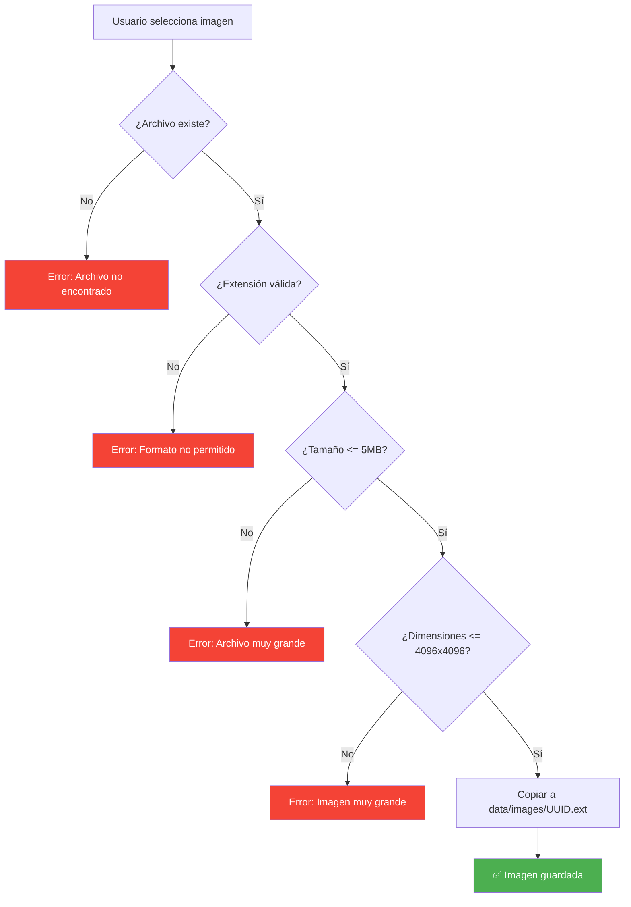
```mermaid
graph TD
    A[Usuario selecciona imagen] --> B{¿Archivo existe?}
    B -->|No| Z1[Error: Archivo no encontrado]
    B -->|Sí| C{¿Extensión válida?}
    C -->|No| Z2[Error: Formato no permitido]
    C -->|Sí| D{¿Tamaño <= 5MB?}
    D -->|No| Z3[Error: Archivo muy grande]
    D -->|Sí| E{¿Dimensiones <= 4096x4096?}
    E -->|No| Z4[Error: Imagen muy grande]
    E -->|Sí| F[Copiar a data/images/UUID.ext]
    F --> G[✅ Imagen guardada]

    style Z1 fill:#f44336,color:#fff
    style Z2 fill:#f44336,color:#fff
    style Z3 fill:#f44336,color:#fff
    style Z4 fill:#f44336,color:#fff
    style G fill:#4CAF50,color:#fff
```

### 💻 Ejemplo de Uso en ViewModel

```csharp
[RelayCommand]
private void SelectImage()
{
    var dialog = new OpenFileDialog
    {
        Filter = "Imágenes (*.png;*.jpg;*.jpeg;*.bmp;*.gif)|*.png;*.jpg;*.jpeg;*.bmp;*.gif",
        Title = "Seleccionar imagen de perfil"
    };

    if (dialog.ShowDialog() == true)
    {
        var result = _imageService.SaveImage(dialog.FileName);

        if (result.IsSuccess)
        {
            FormData.Imagen = result.Value;
            StatusMessage = "Imagen cargada correctamente";
        }
        else
        {
            _dialogService.ShowError(result.Error.Message);
        }
    }
}
```

### 🧪 Validación Programática

```csharp
// Validar tamaño
var sizeResult = _imageService.ValidateImageSize("foto.jpg", maxSizeInBytes: 5_242_880);
if (sizeResult.IsFailure)
{
    Console.WriteLine(sizeResult.Error.Message);
    // "El archivo 'foto.jpg' (8MB) excede el tamaño máximo permitido (5MB)"
}

// Validar dimensiones
var dimensionsResult = _imageService.ValidateImageDimensions("foto.jpg", maxWidth: 4096, maxHeight: 4096);
if (dimensionsResult.IsFailure)
{
    Console.WriteLine(dimensionsResult.Error.Message);
    // "La imagen 'foto.jpg' (5000x3000) excede las dimensiones máximas permitidas (4096x4096)"
}
```

---

### 1.8 Diagrama de Casos de Uso UML

A continuación se presenta el diagrama de casos de uso que modela las interacciones entre los actores y el sistema:

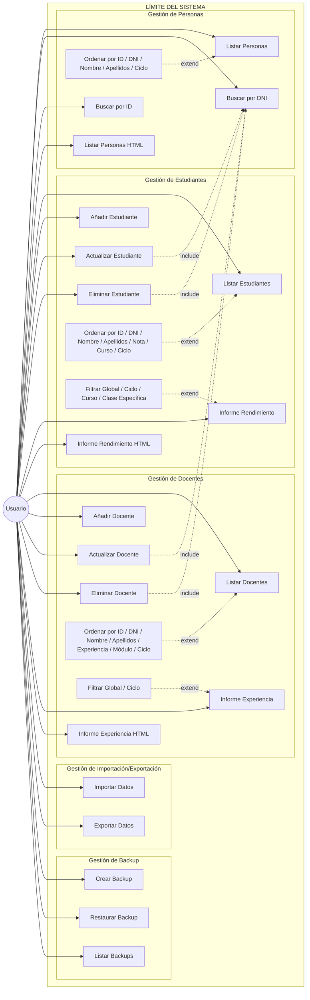
```mermaid
graph LR
    subgraph SISTEMA["LÍMITE DEL SISTEMA"]
        subgraph PERSONAS["Gestión de Personas"]
            LP["Listar Personas"]
            BD["Buscar por DNI"]
            BID["Buscar por ID"]
            LPH["Listar Personas HTML"]
            EXT1["Ordenar por ID / DNI / Nombre / Apellidos / Ciclo"]
        end
        
        subgraph ESTUDIANTES["Gestión de Estudiantes"]
            LE["Listar Estudiantes"]
            AE["Añadir Estudiante"]
            AEE["Actualizar Estudiante"]
            XE["Eliminar Estudiante"]
            IRE["Informe Rendimiento"]
            IREH["Informe Rendimiento HTML"]
            EXT2["Ordenar por ID / DNI / Nombre / Apellidos / Nota / Curso / Ciclo"]
            EXT3["Filtrar Global / Ciclo / Curso / Clase Específica"]
        end
        
        subgraph DOCENTES["Gestión de Docentes"]
            LD["Listar Docentes"]
            AD["Añadir Docente"]
            ADD["Actualizar Docente"]
            XD["Eliminar Docente"]
            IEX["Informe Experiencia"]
            IEXH["Informe Experiencia HTML"]
            EXT4["Ordenar por ID / DNI / Nombre / Apellidos / Experiencia / Módulo / Ciclo"]
            EXT5["Filtrar Global / Ciclo"]
        end
        
        subgraph IMPORTEXPORT["Gestión de Importación/Exportación"]
            ID["Importar Datos"]
            ED["Exportar Datos"]
        end
        
        subgraph BACKUP["Gestión de Backup"]
            CB["Crear Backup"]
            RB["Restaurar Backup"]
            LB["Listar Backups"]
        end
    end
    
    USUARIO((Usuario))
    
    USUARIO --> LP
    USUARIO --> BD
    USUARIO --> BID
    USUARIO --> LPH
    USUARIO --> LE
    USUARIO --> AE
    USUARIO --> AEE
    USUARIO --> XE
    USUARIO --> IRE
    USUARIO --> IREH
    USUARIO --> LD
    USUARIO --> AD
    USUARIO --> ADD
    USUARIO --> XD
    USUARIO --> IEX
    USUARIO --> IEXH
    USUARIO --> ID
    USUARIO --> ED
    USUARIO --> CB
    USUARIO --> RB
    USUARIO --> LB
    
    AEE -.->|include| BD
    XE -.->|include| BD
    ADD -.->|include| BD
    XD -.->|include| BD
    
    EXT1 -.->|extend| LP
    EXT2 -.->|extend| LE
    EXT3 -.->|extend| IRE
    EXT4 -.->|extend| LD
    EXT5 -.->|extend| IEX
```

#### Leyenda

| Elemento           | Descripción                                      |
| ------------------ | ------------------------------------------------ |
| **(Usuario)**      | Actor externo al sistema                         |
| **Rectángulos**    | Casos de uso del sistema                         |
| **→**              | Association (línea continua)                     |
| **-. include .->** | Include - relación obligatoria (base → incluido) |
| **<-. extend .-**  | Extend - relación opcional (extendido → base)    |

#### Descripción de las Relaciones

**Include (línea discontinua):**
- `Actualizar Estudiante` → `Buscar DNI`: Para modificar, primero debe localizarse.
- `Eliminar Estudiante` → `Buscar DNI`: Para eliminar, primero debe localizarse.
- `Actualizar Docente` → `Buscar DNI`: Para modificar, primero debe localizarse.
- `Eliminar Docente` → `Buscar DNI`: Para eliminar, primero debe localizarse.

**Extend (línea discontinua):**
- Los listados pueden extenderse con criterios de ordenación.
- Los informes pueden extenderse con filtros por ciclo/curso.

---

**Parametrizaciones de Ordenación (Extend):**

| Listado                | Criterios de ordenación disponibles                    |
| ---------------------- | ------------------------------------------------------ |
| **Listar Personas**    | ID, DNI, Nombre, Apellidos, Ciclo                      |
| **Listar Estudiantes** | ID, DNI, Nombre, Apellidos, Nota, Curso, Ciclo         |
| **Listar Docentes**    | ID, DNI, Nombre, Apellidos, Experiencia, Módulo, Ciclo |

---

**Parametrizaciones de Informes (Extend):**

| Informe                 | Niveles de filtrado disponibles                |
| ----------------------- | ---------------------------------------------- |
| **Informe Estudiantes** | Global, Por Ciclo, Por Curso, Clase Específica |
| **Informe Docentes**    | Global, Por Ciclo                              |

---

## 1.8 Arquitectura MVVM con WPF

La capa de presentación implementa el patrón **Model-View-ViewModel (MVVM)** usando **CommunityToolkit.Mvvm** y **C# 12 primary constructors**.

### Flujo de Datos MVVM

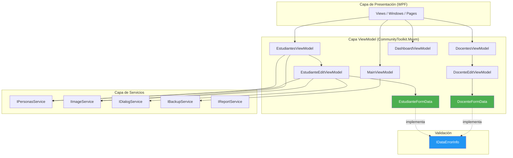
```mermaid
graph TB
    subgraph "Capa de Presentación (WPF)"
        VIEW[Views / Windows / Pages]
    end

    subgraph "Capa ViewModel (CommunityToolkit.Mvvm)"
        VM_MAIN[MainViewModel]
        VM_EST[EstudiantesViewModel]
        VM_DOC[DocentesViewModel]
        VM_DASH[DashboardViewModel]
        VM_EDIT_EST[EstudianteEditViewModel]
        VM_EDIT_DOC[DocenteEditViewModel]
        FORM_EST[EstudianteFormData]
        FORM_DOC[DocenteFormData]
    end

    subgraph "Capa de Servicios"
        SVC_PER[IPersonasService]
        SVC_IMG[IImageService]
        SVC_DLG[IDialogService]
        SVC_BCK[IBackupService]
        SVC_REP[IReportService]
    end

    subgraph "Validación"
        IDEI[IDataErrorInfo]
    end

    VIEW --> VM_MAIN
    VIEW --> VM_EST
    VIEW --> VM_DOC
    VIEW --> VM_DASH
    VM_EST --> VM_EDIT_EST
    VM_DOC --> VM_EDIT_DOC
    VM_EDIT_EST --> FORM_EST
    VM_EDIT_DOC --> FORM_DOC
    FORM_EST -.implementa.-> IDEI
    FORM_DOC -.implementa.-> IDEI
    VM_EST --> SVC_PER
    VM_EST --> SVC_IMG
    VM_EDIT_EST --> SVC_PER
    VM_EDIT_EST --> SVC_IMG
    VM_EDIT_EST --> SVC_DLG
    VM_MAIN --> SVC_BCK

    style FORM_EST fill:#4CAF50,color:#fff
    style FORM_DOC fill:#4CAF50,color:#fff
    style IDEI fill:#2196F3,color:#fff
```

### Primary Constructors en ViewModels

Los ViewModels usan **primary constructors de C# 12** para inyección de dependencias limpia:

```csharp
// Antes (constructor tradicional)
public partial class EstudiantesViewModel : ObservableObject
{
    private readonly IPersonasService _personasService;
    
    public EstudiantesViewModel(IPersonasService personasService, ...)
    {
        _personasService = personasService;
        LoadEstudiantes(); // lógica de inicio en el constructor
    }
}

// Después (primary constructor C# 12)
public partial class EstudiantesViewModel(
    IPersonasService personasService,
    IImageService imageService,
    IDialogService dialogService
) : ObservableObject
{
    private readonly IPersonasService _personasService = personasService;
    private readonly IImageService _imageService = imageService;
    private readonly IDialogService _dialogService = dialogService;
    private readonly ILogger _logger = Log.ForContext<EstudiantesViewModel>();

    public void Initialize()
    {
        LoadEstudiantes(); // lógica de inicio separada
    }
}

// En la View
var vm = App.ServiceProvider.GetRequiredService<EstudiantesViewModel>();
vm.Initialize(); // llamada explícita
DataContext = vm;
```

### Ventajas de esta arquitectura

| Aspecto | Beneficio |
|---------|-----------|
| **Primary constructors** | Código más conciso, parámetros disponibles en inicializadores de campo |
| **Initialize() separado** | La construcción del objeto no tiene efectos secundarios; la inicialización es explícita |
| **ObservableProperty** | Generación automática de propiedades con `INotifyPropertyChanged` |
| **RelayCommand** | Comandos con soporte `CanExecute` sin boilerplate |
| **WeakReferenceMessenger** | Comunicación entre VMs sin acoplamiento directo |

---

## 🎨 Validación de Formularios en Tiempo Real

El sistema implementa validación en tiempo real mediante **FormData classes** que separan la lógica de validación de los ViewModels principales.

### Arquitectura de Validación

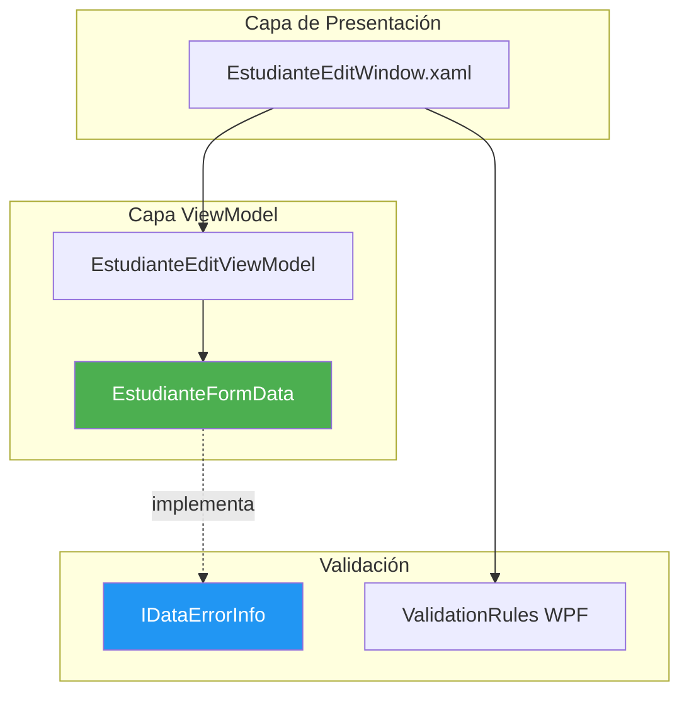
```mermaid
graph TB
    subgraph "Capa de Presentación"
        VIEW[EstudianteEditWindow.xaml]
    end

    subgraph "Capa ViewModel"
        VM[EstudianteEditViewModel]
        FORM[EstudianteFormData]
    end

    subgraph "Validación"
        VAL[IDataErrorInfo]
        RULES[ValidationRules WPF]
    end

    VIEW --> VM
    VM --> FORM
    FORM -.implementa.-> VAL
    VIEW --> RULES

    style FORM fill:#4CAF50,color:#fff
    style VAL fill:#2196F3,color:#fff
```

### Clases FormData

#### 📌 EstudianteFormData.cs
- **Propósito:** Validar datos de estudiante antes de persistir al modelo de dominio
- **Implementa:** `IDataErrorInfo` para binding directo con WPF (`ValidatesOnDataErrors=True`)
- **Validaciones:**
  - **Nombre/Apellidos:** Mínimo 2, máximo 30/50 caracteres
  - **DNI:** Formato `^\d{8}[A-Z]$` (8 dígitos + letra mayúscula)
  - **Email:** Formato válido (`@` + dominio)
  - **Calificación:** Rango 0–10
  - **Fecha de nacimiento:** Posterior a 1900 y no futura

#### 📌 DocenteFormData.cs
- **Propósito:** Validar datos de docente antes de persistir
- **Implementa:** `IDataErrorInfo`
- **Validaciones:**
  - **Nombre/Apellidos:** Mínimo 2, máximo 30/50 caracteres
  - **DNI:** Formato `^\d{8}[A-Z]$`
  - **Email:** Formato válido
  - **Experiencia:** Entre 0 y 50 años
  - **Especialidad:** Mínimo 3 caracteres, obligatoria

### ¿Por qué FormData en lugar de validar en ViewModel?

| Aspecto | FormData | ViewModel |
|---------|----------|-----------|
| **Separación de responsabilidades** | ✅ Aísla validación UI | ❌ Mezcla validación con lógica de negocio |
| **Reutilización** | ✅ Reutilizable en otros contextos | ❌ Acoplado al caso de uso |
| **Testing** | ✅ Testeable independientemente | ❌ Requiere mockear toda la UI |
| **Binding WPF** | ✅ `IDataErrorInfo` funciona de forma nativa | ❌ Requiere lógica adicional |

### Flujo de Validación

1. **Usuario modifica campo** → WPF invoca `IDataErrorInfo[propertyName]`
2. **FormData valida** → Retorna mensaje de error o `null`
3. **WPF actualiza UI** → Muestra/oculta error visual en el campo
4. **ViewModel verifica** → Antes de `Save()`, comprueba `FormData.IsValid()`
5. **Persistencia** → Solo si validación OK, se crea/actualiza el modelo de dominio

### Ejemplo de Uso

```csharp
// En EstudianteEditViewModel
[RelayCommand]
private void Save()
{
    if (!FormData.IsValid())
    {
        _dialogService.ShowWarning("Por favor, corrija los errores del formulario antes de guardar.");
        return;
    }

    var modelo = FormData.ToModel(); // FormData → Modelo de dominio
    var result = _isNew
        ? _personasService.Save(modelo)
        : _personasService.Update(modelo.Id, modelo);

    if (result.IsSuccess)
        CloseAction?.Invoke(true);
    else
        _dialogService.ShowError(result.Error.Message);
}
```

---

## 🖼️ Validación y Gestión de Imágenes

El servicio `ImageService` implementa validación completa de imágenes usando **lectura de cabeceras de archivo** (sin dependencias externas), lo que garantiza compatibilidad multiplataforma.

### Validaciones Implementadas

| Validación | Límite | Método |
|-----------|--------|--------|
| **Extensión** | `.png`, `.jpg`, `.jpeg`, `.bmp`, `.gif` | `IsValidImage()` |
| **Tamaño** | Máximo 5 MB (configurable) | `ValidateImageSize()` |
| **Dimensiones** | Máximo 4096×4096 px (configurable) | `ValidateImageDimensions()` |

### Lectura de Cabeceras de Imagen

La validación de dimensiones se implementa leyendo directamente los bytes de cabecera de cada formato, sin necesidad de `System.Drawing` ni otras dependencias:

```csharp
// PNG: width en bytes [16-19], height en [20-23] (big-endian)
private static (int Width, int Height) ReadPngDimensions(Stream stream)
{
    if (stream.Length < 24) return (0, 0);
    stream.Seek(16, SeekOrigin.Begin);
    var buf = new byte[8];
    stream.ReadExactly(buf, 0, 8);
    int width  = (buf[0] << 24) | (buf[1] << 16) | (buf[2] << 8) | buf[3];
    int height = (buf[4] << 24) | (buf[5] << 16) | (buf[6] << 8) | buf[7];
    return (width, height);
}
```

| Formato | Offset Width | Offset Height | Endianness |
|---------|-------------|--------------|------------|
| PNG | 16-19 | 20-23 | Big-endian |
| BMP | 18-21 | 22-25 | Little-endian |
| GIF | 6-7 | 8-9 | Little-endian |
| JPEG | Marcador SOF | SOF+1-2 | Big-endian |

### Integración en SaveImage/UpdateImage

```csharp
public Result<string, DomainError> SaveImage(string sourcePath)
{
    // 1. Validar existencia
    if (!File.Exists(sourcePath))
        return Result.Failure(..., ImageErrors.NotFound(sourcePath));

    // 2. Validar extensión
    if (!IsValidImage(sourcePath))
        return Result.Failure(..., ImageErrors.InvalidFormat(...));

    // 3. Validar tamaño (máx. 5 MB)
    if (!ValidateImageSize(sourcePath))
        return Result.Failure(..., ImageErrors.FileSizeTooLarge(...));

    // 4. Validar dimensiones (máx. 4096×4096)
    var dims = GetImageDimensions(sourcePath);
    if (dims.Width > 0 && (dims.Width > 4096 || dims.Height > 4096))
        return Result.Failure(..., ImageErrors.DimensionsTooLarge(...));

    // 5. Copiar con nombre UUID
    var newFileName = $"{Guid.NewGuid()}{extension}";
    File.Copy(sourcePath, Path.Combine(_imagesDirectory, newFileName));
    return Result.Success(..., newFileName);
}
```

### Flujo en los ViewModels de Edición

Los ViewModels de edición (`EstudianteEditViewModel`, `DocenteEditViewModel`) usan los métodos del servicio para validación client-side antes de llamar a `SaveImage()`:

```csharp
[RelayCommand]
private void ChangeImage()
{
    var dialog = new OpenFileDialog { Filter = "Imágenes|*.jpg;*.jpeg;*.png;*.bmp;*.gif" };

    if (dialog.ShowDialog() == true)
    {
        // Validación client-side con límites específicos de UI (2MB, 1920×1920)
        if (!_imageService.ValidateImageSize(dialog.FileName, 2 * 1024 * 1024))
        {
            _dialogService.ShowWarning("La imagen no puede superar 2MB");
            return;
        }

        if (!_imageService.ValidateImageDimensions(dialog.FileName, 1920, 1920))
        {
            _dialogService.ShowWarning("La imagen no puede superar 1920x1920 píxeles");
            return;
        }

        // SaveImage añade su propia validación de seguridad (5MB, 4096×4096)
        var result = _imageService.SaveImage(dialog.FileName);
        if (result.IsSuccess)
            FormData.Imagen = result.Value;
        else
            _dialogService.ShowError(result.Error.Message);
    }
}
```

---

## 🐛 Problemas Encontrados y Soluciones

### 1️⃣ Primary Constructors con lógica de inicialización

#### ❌ Problema
Los primary constructors de C# 12 no permiten ejecutar código directamente en el cuerpo de la clase (no existe un "constructor body"):

```csharp
// ❌ NO COMPILA - no hay lugar para poner código de inicialización
public partial class EstudiantesViewModel(IPersonasService service) : ObservableObject
{
    LoadEstudiantes(); // Error: esto no tiene sintaxis válida aquí
}
```

#### ✅ Solución
Separar la inicialización en un método `Initialize()` que las Views llaman explícitamente:

```csharp
public partial class EstudiantesViewModel(IPersonasService service) : ObservableObject
{
    private readonly IPersonasService _personasService = service;

    public void Initialize() => LoadEstudiantes();
}

// En la View
var vm = App.ServiceProvider.GetRequiredService<EstudiantesViewModel>();
vm.Initialize(); // explícito y trazable
DataContext = vm;
```

---

### 2️⃣ Proyecto de Tests incompatible con proyecto WPF

#### ❌ Problema
El proyecto de tests (`net10.0`) no podía referenciar el proyecto WPF (`net10.0-windows`):
```
error NU1201: Project GestionAcademica is not compatible with net10.0
```

#### ✅ Solución
Cambiar el target del proyecto de tests a `net10.0-windows` con `EnableWindowsTargeting=true`:

```xml
<PropertyGroup>
    <TargetFramework>net10.0-windows</TargetFramework>
    <EnableWindowsTargeting>true</EnableWindowsTargeting>
</PropertyGroup>
```

---

### 3️⃣ Validación de dimensiones de imagen sin `System.Drawing`

#### ❌ Problema
`System.Drawing.Common` tiene limitaciones multiplataforma en .NET 6+ y requiere instalación adicional.

#### ✅ Solución
Leer directamente los bytes de la cabecera del archivo según el formato:
- **PNG**: bytes 16-23 contienen width y height en big-endian
- **BMP**: bytes 18-25 contienen width y height en little-endian
- **GIF**: bytes 6-9 contienen width y height en little-endian
- **JPEG**: buscar marcador SOF y leer después

Esto funciona en cualquier plataforma sin dependencias adicionales.

---

### 4️⃣ CA2022: Stream.Read puede no leer todos los bytes

#### ❌ Problema
El compilador con `TreatWarningsAsErrors=true` rechazaba el uso de `Stream.Read(byte[], int, int)` porque puede devolver menos bytes de los solicitados:
```
error CA2022: Avoid inexact read with 'Stream.Read(byte[], int, int)'
```

#### ✅ Solución
Usar `Stream.ReadExactly(byte[], int, int)` disponible desde .NET 7+, que garantiza leer exactamente el número de bytes solicitado o lanzar excepción:

```csharp
// ❌ Antes
stream.Read(buf, 0, 8);

// ✅ Después
stream.ReadExactly(buf, 0, 8);
```

---

### 5️⃣ Binding de errores de validación en formularios WPF

#### ❌ Problema
Los errores de `IDataErrorInfo` no se mostraban automáticamente en los TextBox del formulario de edición.

#### ✅ Solución
Activar `ValidatesOnDataErrors=True` y `NotifyOnValidationError=True` en cada Binding:

```xaml
<TextBox Text="{Binding FormData.Nombre, 
                        ValidatesOnDataErrors=True, 
                        NotifyOnValidationError=True, 
                        UpdateSourceTrigger=PropertyChanged}" />
```

---

## 2. Arquitectura del Sistema (Capas)
El proyecto implementa una **Arquitectura en Capas** (N-Tier Architecture) con **Inyección de Dependencias**, lo que garantiza que el sistema sea modular y escalable.

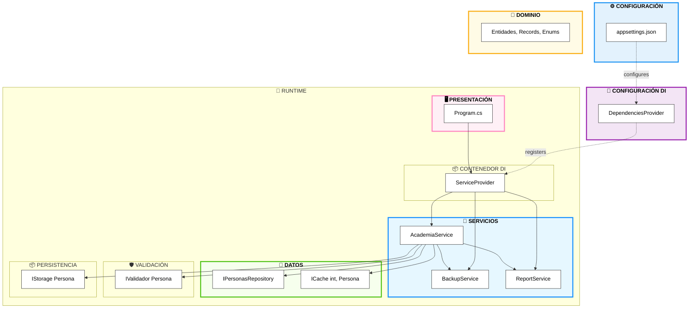
```mermaid
graph TD
    %% Estilos de Capas
    classDef capaUI fill:#fff0f6,stroke:#ff85c0,stroke-width:3px,color:#000000,font-weight:bold;
    classDef capaBLL fill:#e6f7ff,stroke:#1890ff,stroke-width:3px,color:#000000,font-weight:bold;
    classDef capaDAL fill:#f6ffed,stroke:#52c41a,stroke-width:3px,color:#000000,font-weight:bold;
    classDef capaModel fill:#fffbe6,stroke:#faad14,stroke-width:3px,color:#000000,font-weight:bold;
    classDef capaDI fill:#f3e5f5,stroke:#9c27b0,stroke-width:3px,color:#000000,font-weight:bold;
    classDef capaConfig fill:#e3f2fd,stroke:#2196f3,stroke-width:3px,color:#000000,font-weight:bold;

    %% Estilos de Componentes
    classDef comp fill:#ffffff,stroke:#333333,stroke-width:1px,color:#000000;
    classDef config fill:#e3f2fd,stroke:#2196f3,stroke-width:1px,color:#000000;

    subgraph Config [⚙️ CONFIGURACIÓN]
        CF[appsettings.json]
    end

    subgraph DI [🔧 CONFIGURACIÓN DI]
        DP[DependenciesProvider]
    end

    subgraph Runtime [🚀 RUNTIME]
        subgraph UI [🖥️ PRESENTACIÓN]
            P[Program.cs]
        end

        subgraph Container [📦 CONTENEDOR DI]
            SP[ServiceProvider]
        end

        subgraph BLL [🧠 SERVICIOS]
            S[AcademiaService]
            BS[BackupService]
            RS[ReportService]
        end

        subgraph DAL [💾 DATOS]
            R[IPersonasRepository]
            C[ICache int, Persona]
        end

        subgraph Val [🛡️ VALIDACIÓN]
            V[IValidador Persona]
        end

        subgraph Storage [📦 PERSISTENCIA]
            ST[IStorage Persona]
        end
    end

    subgraph Models [📂 DOMINIO]
        M[Entidades, Records, Enums]
    end

    %% Aplicación de Estilos
    class Config capaConfig;
    class DI capaDI;
    class UI capaUI;
    class BLL capaBLL;
    class DAL capaDAL;
    class Models capaModel;
    class P,SP,S,BS,RS,R,C,V,ST,M,CF,DP comp;

    %% Flujo: Configuración
    CF -. configures .-> DP
    
    %% Flujo: Configuración del contenedor
    DP -. registers .-> SP
    
    %% Flujo: Ejecución
    P --> SP
    SP --> S
    SP --> BS
    SP --> RS
    
    %% Flujo: AcademiaService USA dependencias
    S --> R
    S --> C
    S --> V
    S --> ST
    S --> BS
    S --> RS
```

---

## 2.1. Sistema de Inyección de Dependencias (DependenciesProvider)

El proyecto utiliza **Microsoft.Extensions.DependencyInjection** para gestionar las dependencias de forma centralizada, eliminando los patrones Factory (`RepositoryFactory`, `StorageFactory`) y usando un único punto de configuración.

### 🏗️ DependenciesProvider

```csharp
public static class DependenciesProvider
{
    public static IServiceProvider BuildServiceProvider()
    {
        var services = new ServiceCollection();
        
        RegisterStorages(services);
        RegisterRepositories(services);
        RegisterServices(services);
        
        return services.BuildServiceProvider();
    }
}
```

### 📋 Servicios Registrados

| Servicio | Tipo de Vida | Descripción |
|----------|-------------|-------------|
| `IPersonasRepository` | **Singleton** | Mantiene estado en memoria (Memory) o conexión a BD |
| `IStorage<Persona>` | **Transient** | Creado por operación (cada export/import) |
| `ICache<int, Persona>` | **Singleton** | Caché LRU compartida |
| `IValidador<Persona>` | **Transient** | Nuevo validador por operación (Persona + Específico) |
| `IBackupService` | **Transient** | Servicio de backup |
| `IReportService` | **Transient** | Generación de informes HTML |
| `IAcademiaService` | **Scoped** | Servicio principal porrequest |

### 🔄 Ciclo de Vida de los Repositorios

Los repositorios ahora tienen **constructores públicos** sin el patrón `.Instance`:

```csharp
public class PersonasMemoryRepository : IPersonasRepository
{
    private readonly ILogger _logger = Log.ForContext<PersonasMemoryRepository>();
    
    public PersonasMemoryRepository() : this(AppConfig.DropData, AppConfig.SeedData) { }

    private PersonasMemoryRepository(bool dropData, bool seedData)
    {
        // Inicialización...
    }
}
```

### ✅ Ventajas del nuevo enfoque

1. **Centralización**: Toda la configuración DI está en un solo lugar
2. **Control de vida**: Singleton, Scoped, Transient controlado por el contenedor
3. **Testabilidad**: Fácil reemplazar implementaciones en tests
4. **Sin singletons manuales**: Se acabó el `.Instance` y `Lazy<T>`

---

### Responsabilidades Detalladas:

#### 🖥️ Program (`Program.cs`)
Es el **"Camarero"** del sistema. Su única misión es atender al usuario.
*   **Interfaz de Usuario:** Gestiona menús, colores y formato de tablas.
*   **Sanitización de Entrada:** Usa **Regex** para asegurar que el usuario no introduce basura.
*   **Gestión de Resultados:** Usa `.Match()` para manejar operaciones que pueden fallar y mostrar errores de forma amigable.
*   **Configuración de Caché:** Crea e inyecta la caché LRU con capacidad configurable.

#### 🛡️ Validator (`Validators/`)
Es la **"Aduana"** del sistema. No deja pasar ningún objeto que no cumpla las leyes.
*   **Reglas de Integridad:** Aquí se decide qué es un DNI válido, que la nota sea 0-10 o que un docente tenga experiencia coherente.
*   **Desacoplamiento:** El Servicio no sabe *cómo* se valida, solo sabe que el Validador retorna un Result.
*   **Retorna Result:** Los validadores devuelven `Result<T, DomainError>` en lugar de lanzar excepciones.

#### 🧠 Service (`AcademiaService`)
Es el **"Chef"** o cerebro. Orquesta todo el proceso.
*   **Coordinación:** Decide cuándo validar y cuándo guardar.
*   **Transformación de Datos:** Crea los informes estadísticos.
*   **Caché LRU:** Implementa el patrón **Look-Aside**: primero consulta la caché, si no está, va al repositorio y lo guarda en caché.
*   **Gestión de Errores con Result:** Usa el patrón Result para operaciones que pueden fallar (GetById, Save, Update, Delete, Importar, Exportar, Backup).

#### 💾 Repository (`Repositories/`)
Es la **"Despensa"**. Gestión lógica y física de los registros.
*   **Estrategia en Memoria:** `PersonasMemoryRepository` almacena en `Dictionary` para búsquedas O(1).
*   **Estrategia Binaria:** `PersonasBinaryRepository` implementa motor de acceso aleatorio sobre archivos `.dat`, `.idx`, `.frag`.
*   **Estrategia JSON:** `PersonasJsonRepository` persiste en archivo JSON.
*   **Estrategia Dapper:** `PersonasDapperRepository` usa Dapper para acceso a SQLite.
*   **Estrategia ADO.NET:** `PersonasAdoRepository` usa ADO.NET puro para SQLite.
*   **Estrategia Entity Framework:** `PersonasEfRepository` usa Entity Framework Core.
*   **Gestión de Identidad:** Asigna IDs únicos, gestiona marcas de tiempo y estado (Activo/Baja).
*   **Inyección de Dependencias:** `DependenciesProvider` registra el repositorio según configuración (`appsettings.json`).

#### 💾 BackupService (`Services/Backup/`)
Es el **"Guardián"** de las copias de seguridad. Gestiona la creación y restauración de backups.
*   **Creación de Backup:** Extrae datos, serializa en formato configurable (JSON por defecto) y comprime en ZIP.
*   **Restauración:** Extrae el ZIP, carga los datos y reemplaza los existentes.
*   **Gestión de Archivos:** Usa el directorio configurado en `appsettings.json`.

#### 📊 ReportService (`Services/Report/`)
Es el **"Generador de Informes"** del sistema. Genera informes en formato HTML visualmente atractivos.
*   **Informes HTML:** Genera informes con estilo CSS profesional.
*   **Tipos de Informes:**
    *   `GenerarInformeEstudiantesHtml()` - Tabla con estadísticas, notas y estado (aprobado/suspenso).
    *   `GenerarInformeDocentesHtml()` - Tabla con experiencia y ciclos.
    *   `GenerarListadoPersonasHtml()` - Listado general de todo el personal.
*   **Apertura Automática:** Los informes se generan y abren automáticamente en el navegador.
*   **Directorio Configurable:** Se guarda en la carpeta `reports/` configurable via `appsettings.json`.

#### ⚙️ Configuración (`Config/`)
Es el **"Panel de Control"**. Lee y centraliza todas las configuraciones del sistema.
*   **appsettings.json:** Archivo externo que define tipo de repositorio, storage, backup y ConnectionString.
*   **DependenciesProvider:** Lee la configuración y registra los servicios apropiados en el contenedor DI.
*   **Validación:** Los valores no reconocidos se sustituyen por valores por defecto seguros.

#### ⚡ Cache (`LruCache<TKey, TValue>`)
Es el **"buffer de acceso rápido"**. Optimiza las lecturas frecuentes.
*   **Algoritmo LRU:** Least Recently Used - elimina el elemento menos usado al alcanzar la capacidad.
*   **O(1) en operaciones:** Gracias a `Dictionary` + `LinkedList`.
*   **Logging:** Registra ACIERTO/FALLO y expulsiones.

#### 📦 Storage (`Storage/*`)
Es el **"Archivo"** del sistema. Gestiona la persistencia en diferentes formatos para Import/Export.
*   **Interfaz Común:** Usa `IStorage<T>` para abstraer el formato.
*   **DI:** `DependenciesProvider` crea el storage según configuración.
*   **Formatos Soportados:** JSON, CSV (parser custom) y Binario.
*   **Serialización:** Convierte modelos a DTOs antes de guardar y viceversa.

---

## 3. Gestión de Errores: Result y Errores de Dominio
El sistema no utiliza excepciones tradicionales para el flujo de errores, sino que implementa el patrón **Result** combinado con **Errores de Dominio**. Esto permite una comunicación precisa y funcional entre las capas.

### Jerarquía de Errores de Dominio
Utilizamos records anidados para agrupar errores bajo un mismo contexto semántico:

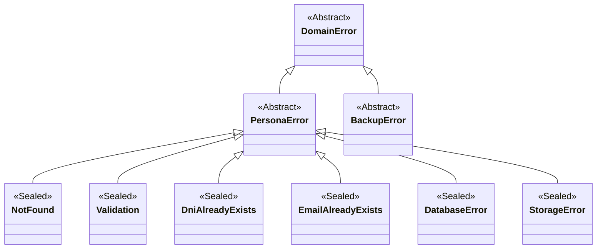
```mermaid
classDiagram
    class DomainError { <<Abstract>> }
    class PersonaError { <<Abstract>> }
    class BackupError { <<Abstract>> }
    class NotFound { <<Sealed>> }
    class Validation { <<Sealed>> }
    class DniAlreadyExists { <<Sealed>> }
    class EmailAlreadyExists { <<Sealed>> }
    class DatabaseError { <<Sealed>> }
    class StorageError { <<Sealed>> }

    DomainError <|-- PersonaError
    DomainError <|-- BackupError
    PersonaError <|-- NotFound
    PersonaError <|-- Validation
    PersonaError <|-- DniAlreadyExists
    PersonaError <|-- EmailAlreadyExists
    PersonaError <|-- DatabaseError
    PersonaError <|-- StorageError
```

**Tipos de errores:**
- `NotFound`: La entidad no existe (para GetById, Update, Delete)
- `Validation`: Error de validación de dominio (formato email, extensión imagen, etc.)
- `DniAlreadyExists`: El DNI ya está registrado en el sistema
- `EmailAlreadyExists`: El email ya está registrado en el sistema
- `DatabaseError`: Error de base de datos (captura excepciones de BD)
- `StorageError`: Error de almacenamiento (archivos, JSON, CSV)

### El Patrón Result
El sistema usa `CSharpFunctionalExtensions.Result<T, TError>` para representar operaciones que pueden fallar:

```csharp
// En el Servicio: métodos que pueden fallar devuelven Result
// Uso del patrón is {} para evitar null checks tradicionales
public Result<Persona, DomainError> GetById(int id) {
    if (cache.Get(id) is {} cached)
        return Result.Success<Persona, DomainError>(cached);
    
    if (repository.GetById(id) is {} persona)
    {
        cache.Add(id, persona);
        return Result.Success<Persona, DomainError>(persona);
    }
    
    return Result.Failure<Persona, DomainError>(PersonaErrors.NotFound(id.ToString()));
}
```

### En Program.cs: Consumo con Match
El consumidor usa `.Match()` para manejar el resultado:

```csharp
service.GetById(id).Match(
    onSuccess: persona => ImprimirFichaPersona(persona),
    onFailure: error => Console.WriteLine($"❌ ERROR: {error.Message}")
);
```

### ¿Por qué usamos Errores de Dominio con Result?
1.  **Semántica Clara:** Es mucho más descriptivo manejar un `NotFound` que un error genérico.
2.  **Desacoplamiento:** La Capa de Presentación no necesita conocer detalles técnicos.
3.  **Flujo Funcional:** Permite encadenar operaciones con `Bind` y `Map`.
4.  **Sin Excepciones en Flujo Normal:** Las excepciones solo para casos truly excepcionales.

---

## 3.1 ¿Por qué NO todo devuelve Result?

Esta es una pregunta importante: **no todo necesita devolver Result**. Solo las operaciones que pueden **fallar por razones de negocio** deben usarlo.

### Operaciones que SÍ devuelven Result (pueden fallar):
| Operación | ¿Por qué puede fallar? |
|-----------|----------------------|
| `GetById(id)` | El ID no existe |
| `GetByDni(dni)` | El DNI no existe |
| `Save(persona)` | Validación fallida, DNI duplicado o Email duplicado |
| `Update(id, persona)` | No existe, validación fallida, DNI/Email duplicado |
| `Delete(id)` | No existe |
| `ImportarDatos()` | Error de lectura/escritura |
| `ExportarDatos()` | Error de lectura/escritura |
| `RealizarBackup()` | Error de compresión/escritura |
| `RestaurarBackup()` | Archivo corrupto o no encontrado |

### Operaciones que NO devuelven Result (nunca fallan):
| Operación | ¿Por qué siempre tiene éxito? |
|-----------|-------------------------|
| `GetAll()` | Siempre devuelve enumerable (puede estar vacío) |
| `GetAllOrderBy()` | Siempre devuelve enumerable (puede estar vacío) |
| `GetEstudiantesOrderBy()` | Siempre devuelve enumerable (puede estar vacío) |
| `GetDocentesOrderBy()` | Siempre devuelve enumerable (puede estar vacío) |
| `TotalPersonas` | Siempre devuelve un entero (0 si no hay datos) |
| `ListarBackups()` | Siempre devuelve lista (vacía si no hay) |
| `GenerarInformeEstudiante()` | Siempre devuelve informe (vacío si no hay datos) |
| `GenerarInformeDocente()` | Siempre devuelve informe (vacío si no hay datos) |

### El Principio
> **"Si una operación siempre va a tener éxito (aunque sea con resultado vacío), no necesita Result."**

Esto hace el código más simple y fácil de usar:
- `GetAll()` → `foreach (var p in personas)` ← Simple
- `GetById()` → `personas.GetById(id).Match(...)` ← Necesita Result porque puede no existir

---

## 4. Diagrama de Clases del Modelo (Detalle Completo)
El modelo de datos refleja fielmente la realidad académica, separando las capacidades mediante interfaces.

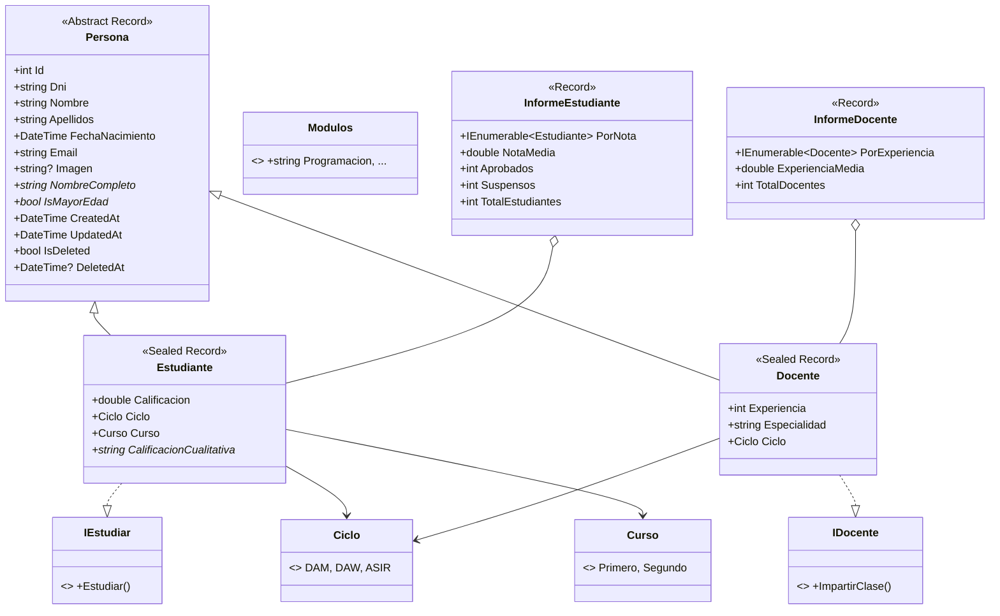
```mermaid
classDiagram
    class Persona {
        <<Abstract Record>>
        +int Id
        +string Dni
        +string Nombre
        +string Apellidos
        +DateTime FechaNacimiento
        +string Email
        +string? Imagen
        +string NombreCompleto*
        +bool IsMayorEdad*
        +DateTime CreatedAt
        +DateTime UpdatedAt
        +bool IsDeleted
        +DateTime? DeletedAt
    }

    class IEstudiar { <<Interface>> +Estudiar() }
    class IDocente { <<Interface>> +ImpartirClase() }

    class Estudiante {
        <<Sealed Record>>
        +double Calificacion
        +Ciclo Ciclo
        +Curso Curso
        +string CalificacionCualitativa*
    }

    class Docente {
        <<Sealed Record>>
        +int Experiencia
        +string Especialidad
        +Ciclo Ciclo
    }

    class Ciclo { <<Enum>> DAM, DAW, ASIR }
    class Curso { <<Enum>> Primero, Segundo }
    class Modulos { <<Static>> +string Programacion, ... }

    class InformeEstudiante {
        <<Record>>
        +IEnumerable~Estudiante~ PorNota
        +double NotaMedia
        +int Aprobados
        +int Suspensos
        +int TotalEstudiantes
    }

    class InformeDocente {
        <<Record>>
        +IEnumerable~Docente~ PorExperiencia
        +double ExperienciaMedia
        +int TotalDocentes
    }

    Persona <|-- Estudiante
    Persona <|-- Docente
    Estudiante ..|> IEstudiar
    Docente ..|> IDocente
    Estudiante --> Ciclo
    Estudiante --> Curso
    Docente --> Ciclo
    InformeEstudiante o-- Estudiante
    InformeDocente o-- Docente
```

---

## 5. IEnumerable: El Contrato de Solo Lectura
El sistema usa `IEnumerable<T>` como tipo de retorno en las consultas. Este es el contrato más simple posible: "te doy los datos, tú iteras".

### ¿Por qué IEnumerable y no IList o ILista?

| Interfaz         | Características                | Uso                   |
| ---------------- | ------------------------------ | --------------------- |
| `IEnumerable<T>` | Solo iteración, sin Add/Remove | Contrato de consulta  |
| `IList<T>`       | Add, Remove, Index             | Modificación de lista |
| `ILista<T>`      | Tu implementación propia       | Estructura de datos   |

```csharp
// El Repository devuelve IEnumerable - el llamador decide qué hacer
public IEnumerable<Persona> GetAll() => _diccionario.Values;

// El Servicio lo transforma con filtros y ordenación
var resultado = repository.GetAll()
    .Where(p => p.Ciclo == Ciclo.DAW)
    .OrderBy(p => p.Nombre);
```

**Ventajas de IEnumerable:**
1. **Desacoplamiento:** El Repository no impone cómo se usa el resultado.
2. **Flexibilidad:** El que llama puede convertir a lista, array, o iterar directamente.
3. **LINQ:** IEnumerable es la base de todas las operaciones LINQ (Where, OrderBy, etc.).
4. **Lazy Evaluation:** Permite procesar grandes conjuntos de datos sin cargar todo en memoria.

---

## 6. El Servicio: Motor de Inteligencia y Consultas
El `Service` no es un simple intermediario; es el **motor de orquestación** donde las reglas del mundo real se convierten en código. Su misión es transformar colecciones de datos en información estratégica.

### 6.1. Inyección de Dependencias
El Servicio recibe sus dependencias desde el exterior (Program.cs), lo que facilita el testing y el cambio de implementaciones.

```csharp
public class AcademiaService(
    IPersonasRepository repository,
    IStorage<Persona> storage,
    IValidador<Persona> valPersona,       // Campos comunes (Nombre, Apellidos, FechaNacimiento)
    IValidador<Persona> valEstudiante,    // Campos específicos de Estudiante
    IValidador<Persona> valDocente,       // Campos específicos de Docente
    ICache<int, Persona> cache,
    IBackupService backupService,
    IReportService reportService
) : IAcademiaService
```

### 6.2. El Hub Central: GetAllOrderBy
Centraliza toda la lógica de ordenación del sistema usando un **Diccionario de Estrategias**.

#### 6.2.1. ¿Qué es el Patrón Strategy?
El Patrón Strategy es un patrón de diseño comportamental que permite seleccionar un algoritmo en tiempo de ejecución. En lugar de usar un gran `switch` o múltiples `if/else`, definimos cada algoritmo (estrategia) como una función y las almacenamos en un diccionario.

```csharp
// DICCIONARIO DE ESTRATEGIAS
// ==========================
// Clave: TipoOrdenamiento (enum con los criterios disponibles)
// Valor: Func<IOrderedEnumerable<Persona>> (una función que devuelve una colección ordenada)

var comparadores = new Dictionary<TipoOrdenamiento, Func<IOrderedEnumerable<Persona>>> {
    { TipoOrdenamiento.Id, () => lista.OrderBy(p => p.Id) },
    { TipoOrdenamiento.Dni, () => lista.OrderBy(p => p.Dni) },
    // ... más estrategias
};
```

#### 6.2.2. ¿Por qué usar un diccionario y no un switch?

| Enfoque                        | Ventajas                                | Inconvenientes                               |
| ------------------------------ | --------------------------------------- | -------------------------------------------- |
| **switch tradicional**         | Familiar, fácil de entender             | Cada caso nuevo requiere modificar el switch |
| **Diccionario de estrategias** | Abierto/Cerrado (Open/Closed Principle) | Menos intuitivo inicialmente                 |

**El switch tradicional:**
```csharp
// PROBLEMA: Si quieres añadir un nuevo criterio, aquí
return orden switch {
    TipoOrdenamiento.Id => lista.OrderBy(p => p.Id),
    TipoOrdenamiento.Dni => lista.OrderBy(p => p.Dni),
    // ... 10 casos después
    _ => lista.OrderBy(p => p.Id)
};
```

**El diccionario de estrategias:**
```csharp
// SOLUCIÓN: Añadir un criterio es añadir UNA LÍNEA al diccionario
// sin tocar el resto del código (Open/Closed Principle)
var comparadores = new Dictionary<...> {
    { TipoOrdenamiento.Id, () => lista.OrderBy(p => p.Id) },
    { TipoOrdenamiento.Dni, () => lista.OrderBy(p => p.Dni) },
    { TipoOrdenamiento.Nombre, () => lista.OrderBy(p => p.Nombre) },
    { TipoOrdenamiento.Edad, () => lista.OrderBy(p => p.Edad) }, // Nueva línea
};
```

#### 6.2.3. La magia de TryGetValue
Una vez definidas las estrategias, la ejecución es trivial:

```csharp
// TryGetValue: busca la clave en el diccionario
// Si existe, ejecuta la función asociada
// Si no existe, usa el fallback (orden por ID)

return comparadores.TryGetValue(orden, out var comparador)
    ? comparador()      // Ejecutar la estrategia encontrada
    : lista.OrderBy(p => p.Id);  // Fallback seguro
```

**¿Por qué TryGetValue?**
- Evita excepciones si la clave no existe
- Devuelve el valor directamente en el parámetro `out`
- Más eficiente que verificar `ContainsKey` + acceder

#### 6.2.4. Pattern Matching en propiedades polimórficas
Algunos criterios (Nota, Experiencia) solo aplican a ciertos tipos. Usamos pattern matching para manejar esto de forma segura:

```csharp
{ TipoOrdenamiento.Nota, () => lista.OrderByDescending(p => 
    p is Estudiante e ? e.Calificacion : -1) },
```

**Desglose:**
1. `p is Estudiante e` - ¿Es Estudiante? Si sí, guarda en `e`
2. `e.Calificacion` - Accedemos a la propiedad del tipo derivado
3. `: -1` - Si no es Estudiante, devolvemos -1 (va al final)

**Ventajas:**
- **Seguridad de tipos:** El compilador garantiza que solo accedemos a propiedades válidas
- **Legibilidad:** El código dice claramente qué queremos hacer
- **Flexibilidad:** Se ordena correctamente cada tipo

```csharp
// RESULTADO:
// Estudiantes: ordenados por nota (9, 8, 7, ...)
// Docentes: aparecen al final con valor -1
```

#### 6.2.5. Código completo del Hub

```csharp
public IEnumerable<Persona> GetAllOrderBy(
    TipoOrdenamiento orden = TipoOrdenamiento.Dni,
    Predicate<Persona>? filtro = null)
{
    // PASO 1: Obtener datos del repositorio
    var lista = filtro == null
        ? repository.GetAll()
        : repository.GetAll().Where(p => filtro(p));

    // PASO 2: Definir estrategias de ordenación
    var comparadores = new Dictionary<TipoOrdenamiento, Func<IOrderedEnumerable<Persona>>> {
        { TipoOrdenamiento.Id, () => lista.OrderBy(p => p.Id) },
        { TipoOrdenamiento.Dni, () => lista.OrderBy(p => p.Dni) },
        { TipoOrdenamiento.Nombre, () => lista.OrderBy(p => p.Nombre) },
        { TipoOrdenamiento.Apellidos, () => lista.OrderBy(p => p.Apellidos) },
        { TipoOrdenamiento.Ciclo, () => lista.OrderBy(p => ObtenerCicloTexto(p)) },
        { TipoOrdenamiento.Nota, () => lista.OrderByDescending(p => 
            p is Estudiante e ? e.Calificacion : -1) },
        { TipoOrdenamiento.Experiencia, () => lista.OrderByDescending(p => 
            p is Docente d ? d.Experiencia : -1) },
        { TipoOrdenamiento.Curso, () => lista.OrderBy(p => 
            p is Estudiante e ? (int)e.Curso : int.MaxValue) },
    };

    // PASO 3: Ejecutar la estrategia seleccionada
    return comparadores.TryGetValue(orden, out var comparador)
        ? comparador()
        : lista.OrderBy(p => p.Id);  // Fallback por seguridad
}
```

**Ventajas del patrón Strategy:**
1. **Open/Closed Principle:** Añadir criterios sin modificar código existente
2. **Desacoplamiento:** Cada estrategia es independiente
3. **Testeabilidad:** Cada estrategia se puede probar aisladamente
4. **Legibilidad:** Toda la lógica de ordenación en un solo lugar

### 6.3. Generación de Informes
Los informes se construyen aplicando filtros y calculando métricas.

```csharp
public InformeEstudiante GenerarInformeEstudiante(Ciclo? ciclo, Curso? curso) {
    var estudiantes = GetEstudiantesOrderBy(TipoOrdenamiento.Nota)
        .Where(e => (ciclo == null || e.Ciclo == ciclo) && 
                    (curso == null || e.Curso == curso))
        .ToList();

    var total = estudiantes.Count;
    if (total == 0) return new InformeEstudiante();

    return new InformeEstudiante {
        PorNota = estudiantes,
        TotalEstudiantes = total,
        Aprobados = estudiantes.Count(e => e.Calificacion >= 5.0),
        Suspensos = estudiantes.Count(e => e.Calificacion < 5.0),
        NotaMedia = estudiantes.Average(e => e.Calificacion)
    };
}
```

**Nota sobre `.ToList()`:** Se materializa el IEnumerable en una lista para poder contar varias veces (Aprobados, Suspensos) sin iterar múltiples veces sobre la colección.

---

## 7. Análisis de Principios SOLID y DRY
Has aplicado los estándares de la industria para garantizar que el código sea mantenible, escalable y fácil de entender.

### 📐 Principios SOLID

#### **S - Single Responsibility (Responsabilidad Única)**
Cada clase tiene una única misión. Por ejemplo, el `ValidadorEstudiante` solo se encarga de las reglas específicas de Estudiante, mientras que `ValidadorPersona` maneja los campos comunes (Nombre, Apellidos, FechaNacimiento).

```csharp
// ValidadorPersona: campos comunes de todas las personas
public class ValidadorPersona : IValidador<Persona> {
    public Result<Persona, DomainError> Validar(Persona persona) {
        var errores = new List<string>();
        if (string.IsNullOrWhiteSpace(persona.Nombre))
            errores.Add("El nombre es obligatorio.");
        if (persona.FechaNacimiento > DateTime.UtcNow)
            errores.Add("La fecha de nacimiento no puede ser futura.");
        // ...
        return errores.Any() 
            ? Result.Failure<Persona, DomainError>(...)
            : Result.Success<Persona, DomainError>(persona);
    }
}

// ValidadorEstudiante: solo campos específicos de Estudiante
public class ValidadorEstudiante : IValidador<Persona> {
    public Result<Persona, DomainError> Validar(Persona persona) {
        // Solo valida Calificacion, Ciclo, Curso
        // (Nombre, Apellidos ya validados por ValidadorPersona)
    }
}
```

#### **D - Dependency Inversion (Validación con Railway Programming)**
El servicio encadena validadores usando `Bind` para aplicar validación en cascada:

```csharp
private Result<Persona, DomainError> ValidarPersona(Persona persona)
{
    return persona switch
    {
        Estudiante => valPersona.Validar(persona)       // 1º: Common
            .Bind(_ => valEstudiante.Validar(persona)), // 2º: Specific
        Docente => valPersona.Validar(persona)
            .Bind(_ => valDocente.Validar(persona)),
        _ => Result.Failure<Persona, DomainError>(...)
    };
}
```

**Ventajas:**
- **DRY:** Los campos de Persona se validan una sola vez
- **Testabilidad:** Cada validador es independiente
- **Extensibilidad:** Añadir nuevo tipo = nuevo validador específico
- **Railway Programming:** Si la primera validación falla, no se ejecuta la segunda

#### **O - Open/Closed (Abierto/Cerrado)**
El sistema permite añadir funcionalidades nuevas (extender) sin modificar el código que ya funciona. Lo logras mediante **inversión de dependencias**.

```csharp
// GetAllOrderBy usa un diccionario de estrategias.
// Para añadir un nuevo criterio, solo añaden una línea al mapa:
{ TipoOrdenamiento.Edad, () => lista.OrderBy(p => p.Edad) }
```

#### **L - Liskov Substitution (Sustitución de Liskov)**
El repositorio almacena `Persona` (clase base), pero el programa funciona perfectamente inyectando `Estudiante` o `Docente`. La clase base es totalmente sustituible por sus hijas.

```csharp
// El repositorio acepta cualquier subtipo de Persona
_diccionario[id] = new Estudiante { ... };
_diccionario[id] = new Docente { ... };
```

#### **I - Interface Segregation (Segregación de Interfaces)**
No has creado una interfaz gigantesca. Has separado las capacidades: `IEstudiar` para alumnos e `IDocente` para profesores.

```csharp
public sealed record Estudiante : Persona, IEstudiar { ... }
public sealed record Docente : Persona, IDocente { ... }
```

#### **D - Dependency Inversion (Inversión de Dependencias)**
El `Service` no depende de implementaciones concretas, sino de sus **Interfaces**. Esto permite cambiar el almacenamiento o añadir caché sin tocar la lógica de negocio.

```csharp
public class AcademiaService(
    IPersonasRepository repository,
    IValidador<Persona> valEstudiante,
    IValidador<Persona> valDocente,
    ICache<int, Persona> cache,
    IBackupService backupService,
    IReportService reportService
) : IAcademiaService
```

---

### 💧 Principio DRY (Don't Repeat Yourself)
Has evitado la repetición de lógica mediante:

1.  **Motor de Consultas Unificado:** Un único `GetAllOrderBy` con Dictionary de estrategias.
2.  **Validación Polimórfica:** Un solo método `ValidarPersona` que selecciona el validador correcto según el tipo y retorna Result.

```csharp
// Un solo método maneja todos los tipos de Persona y retorna Result
private Result<Persona, DomainError> ValidarPersona(Persona persona) {
    return persona switch {
        Estudiante => valEstudiante.Validar(persona),
        Docente => valDocente.Validar(persona),
        _ => Result.Failure<Persona, DomainError>(
            PersonaErrors.Validation(new[] { "Tipo no soportado." }))
    };
}
```

---

## 8. Caché LRU: Optimización de Lecturas
El sistema implementa una caché **LRU (Least Recently Used)** para optimizar las lecturas por ID.

### 8.1. ¿Qué es LRU?
LRU significa "Least Recently Used" (Menos Recientemente Usado). Cuando la caché está llena y se necesita añadir un nuevo elemento, se elimina el que lleva más tiempo sin ser accedido.

### 8.2. Estructura de la Caché

```csharp
public class LruCache<TKey, TValue> : ICache<TKey, TValue> where TKey : notnull {
    private readonly Dictionary<TKey, TValue> _data = new();      // O(1) búsqueda
    private readonly LinkedList<TKey> _usageOrder = new();       // Orden de uso
    private readonly int _capacity;                               // Capacidad máxima

    public LruCache(int capacity) {
        if (capacity <= 0)
            throw new ArgumentException("La capacidad debe ser mayor que 0.");
        _capacity = capacity;
    }
}
```

**¿Por qué dos estructuras?**
- `Dictionary`: Permite buscar cualquier elemento en O(1).
- `LinkedList`: Mantiene el orden de uso. El primer nodo (`First`) es el menos usado; el último (`Last`) es el más reciente.

### 8.3. Operaciones de la Caché

```csharp
// AÑADIR (Add)
public void Add(TKey key, TValue value) {
    if (_data.TryGetValue(key, out _)) {
        RefreshUsage(key); // Ya existe, actualizar y mover al final
        return;
    }

    if (_data.Count >= _capacity) {
        // Caché llena: eliminar el menos usado (First de la lista)
        var oldestKey = _usageOrder.First!.Value;
        _usageOrder.RemoveFirst();
        _data.Remove(oldestKey);
    }

    _data.Add(key, value);
    _usageOrder.AddLast(key);
}

// OBTENER (Get)
public TValue? Get(TKey key) {
    if (!_data.TryGetValue(key, out var value)) return default;
    RefreshUsage(key); // "Rejuvenecer" el elemento
    return value;
}

// REFRESCAR USO (RefreshUsage)
private void RefreshUsage(TKey key) {
    _usageOrder.Remove(key);  // Sacar de donde esté
    _usageOrder.AddLast(key); // Poner como el más reciente
}
```

### 8.4. Patrón Look-Aside en el Servicio
El Servicio implementa el patrón **Look-Aside** para la caché usando el patrón `is {}`:

```csharp
public Result<Persona, DomainError> GetById(int id) {
    // PATRÓN is {} - Más moderno que != null
    if (cache.Get(id) is {} cached)
        return Result.Success<Persona, DomainError>(cached);  // HIT: está en caché

    if (repository.GetById(id) is {} persona)
    {
        cache.Add(id, persona);  // MISS: añadir a caché
        return Result.Success<Persona, DomainError>(persona);
    }
    
    return Result.Failure<Persona, DomainError>(PersonaErrors.NotFound(id.ToString()));
}
```

### 8.5. Estrategias de Caché en Operaciones CRUD

| Operación    | Estrategia             | Código                                     |
| ------------ | ---------------------- | ------------------------------------------ |
| **Create**   | Añadir                 | `cache.Add(id, persona)`                   |
| **Update**   | Invalidar              | `cache.Remove(id)`                         |
| **Delete**   | Invalidar              | `cache.Remove(id)`                         |
| **GetById**  | Look-Aside             | `cache.Get()` → repository → `cache.Add()` |
| **GetByDni** | Añadir (tenemos el ID) | `cache.Add(persona.Id, persona)`           |

**Nota pedagógica:** En producción, Create normalmente NO añade a caché (se repoblará en el primer GetById). Aquí lo hacemos para que veáis el funcionamiento.

### 8.6. Complejidad Algorítmica

| Operación      | Complejidad     |
| -------------- | --------------- |
| `Add`          | O(1) amortizado |
| `Get`          | O(1)            |
| `Remove`       | O(1)            |
| `RefreshUsage` | O(1)            |

---

## 9. Sistema de Repositorios (Repository)
El sistema implementa una **capa de datos** flexible que permite persistir los datos de diferentes maneras. A diferencia del Storage (que es para Import/Export), el Repository gestiona la persistencia principal del sistema entre ejecuciones.

### 9.1. Interfaz Común: IPersonasRepository
Todos los repositorios implementan una interfaz común que define el contrato CRUD:

```csharp
public interface IPersonasRepository : ICrudRepository<int, Persona> {
    // Métodos que devuelven Result (por restricciones de dominio)
    Result<Persona, DomainError> Create(Persona persona);
    Result<Persona, DomainError> Update(int id, Persona persona);

    // Métodos simples (null/bool)
    Persona? GetById(int id);
    Persona? GetByDni(string dni);
    Persona? GetByEmail(string email);
    bool ExisteDni(string dni);
    bool ExisteEmail(string email);
    bool DeleteAll();
}
```

**KISS Principle:** Solo `Create` y `Update` usan `Result` porque son las únicas operaciones con restricciones de dominio (DNI único, Email único). Las demás operaciones usan `null`/`bool` que es más simple e idiomático en .NET.

**Patrón Singleton:** Todos los repositorios usan `Lazy<T>` para garantizar una sola instancia en memoria.

### 9.2. Tipos de Repositorio Disponibles

El sistema ofrece **4 implementaciones diferentes** de repositorio:

| Tipo | Clase | Persistencia | Biblioteca | Uso |
|------|-------|--------------|------------|-----|
| **Memory** | PersonasMemoryRepository | Dictionary en RAM | .NET | Desarrollo, testing |
| **Json** | PersonasJsonRepository | Archivo JSON | System.Text.Json | Producción simple |
| **Dapper** | PersonasDapperRepository | SQLite | Dapper | Micro-ORM rápido |
| **EfCore** | PersonasEfRepository | SQLite | Entity Framework Core | ORM completo |

### 9.3. Interfaz ICrudRepository

Todos los repositorios implementan una interfaz base con paginación y soporte para borrado lógico/físico:

```csharp
public interface ICrudRepository<in TKey, TEntity> where TEntity : class {
    IEnumerable<TEntity> GetAll(int page = 1, int pageSize = 10, bool includeDeleted = true);
    TEntity? GetById(TKey id);
    TEntity? Create(TEntity entity);
    TEntity? Update(TKey id, TEntity entity);
    TEntity? Delete(TKey id, bool isLogical = true);
}
```

### 9.4. Sistema de Borrado

- **Borrado Lógico (isLogical=true):** Marca `IsDeleted = true` y guarda `DeletedAt` con la fecha UTC
- **Borrado Físico (isLogical=false):** Elimina el registro de la base de datos

### 9.5. Sistema de Fechas

- **FechaNacimiento:** Se almacena en formato UTC
- **Email:** Obligatorio y único en el sistema. Si no se proporciona, se autogenera como `{dni}@gestionacademica.local`
- **Imagen:** Opcional, solo acepta formatos png, jpg, jpeg, bmp
- **IsMayorEdad:** Propiedad calculada que devuelve true si la edad >= 18 años
- **CreatedAt, UpdatedAt, DeletedAt:** Todas las fechas se almacenan en UTC

### 9.3. Patrón Entity + Mapper
Todos los repositorios (excepto Memory) usan una tabla única `PersonaEntity` con un campo discriminador `Tipo` para almacenar tanto Estudiantes como Docentes:

*   **PersonaEntity:** Una sola tabla con todos los campos (incluidos Email e Imagen).
*   **PersonaMapper:** Convierte entre Entity y Model.
*   **Discriminador:** El campo `Tipo` indica si es Estudiante o Docente.
*   **Unique Constraints:** DNI y Email tienen restricción UNIQUE en la base de datos.

### 9.4. Sistema de Repositorios con DI

El sistema de repositorios usa **DependenciesProvider** para registrar el repositorio según configuración:

```csharp
services.AddSingleton<IPersonasRepository>(sp => {
    var repoType = AppConfig.RepositoryType.ToLower();
    return repoType switch {
        "memory" => new PersonasMemoryRepository(),
        "json" => new PersonasJsonRepository(),
        "dapper" => new PersonasDapperRepository(),
        "efcore" => new PersonasEfRepository(),
        _ => new PersonasMemoryRepository()
    };
});
```

**Ciclo de vida:** Singleton (para mantener estado en memoria o conexión a BD)

### 9.5. Repositorio en Memoria (Memory)
El repositorio más simple. Almacena todos los datos en un `Dictionary<int, Persona>` en memoria RAM.
- **Ventaja:** Máxima velocidad de acceso O(1).
- **Inconveniente:** Los datos se pierden al cerrar la aplicación.

### 9.6. Repositorio JSON (Json)
Persiste los datos en un archivo JSON:
- **Archivo:** `data/academia.json`
- **Ventaja:** Formato legible, fácil de depurar.

### 9.7. Repositorio Dapper (Dapper)
Accede a SQLite usando **Dapper**, un micro-ORM:
- **Biblioteca:** Dapper
- **Ventaja:** Muy rápido, SQL puro.

### 9.8. Repositorio Entity Framework Core (EfCore)
Accede a SQLite usando **Entity Framework Core**:
- **Biblioteca:** Microsoft.EntityFrameworkCore.Sqlite
- **Ventaja:** ORM completo con migrations.
- **Ventaja:** Persistencia duradera con alto rendimiento.

### 9.7. Repositorio JSON (Json)
Persiste los datos en un archivo JSON:
- **Archivo:** `data/academia.json`
- **Persistencia:** Guarda automáticamente tras cada operación (Create, Update, Delete).
- **Ventaja:** Formato legible, fácil de depurar, estándar.

### 9.8. Repositorio Dapper (Dapper)
Accede a SQLite usando **Dapper**, un micro-ORM que combina la velocidad de ADO.NET con la comodidad del mapeo automático:
- **Biblioteca:** Dapper
- **Ventaja:** Muy rápido, SQL puro, poco código.
- **Inconveniente:** Necesitas escribir SQL manualmente.
- **Uso:** Ideal cuando necesitas control del SQL pero quieres minimizar código repetitivo.

### 9.9. Repositorio ADO.NET (AdoNet)
Accede a SQLite usando **ADO.NET puro** con `SqlConnection`, `SqlCommand`, etc.:
- **Biblioteca:** System.Data.Sqlite
- **Ventaja:** Control total, sin dependencias adicionales.
- **Inconveniente:** Mucho código repetitivo (open, create command, execute, close).
- **Uso:** Ideal para aprender cómo funciona el acceso a datos a bajo nivel.

### 9.10. Repositorio Entity Framework Core (EfCore)
Accede a SQLite usando **Entity Framework Core**, un ORM completo de Microsoft:
- **Biblioteca:** Microsoft.EntityFrameworkCore
- **Ventaja:** Abstracción total, migrations automáticas, LINQ to Entities.
- **Inconveniente:** Más lento que Dapper/ADO.NET, curva de aprendizaje.
- **Uso:** Ideal para aplicaciones donde la productividad es más importante que el rendimiento máximo.

---

## 10. Sistema de Almacenamiento (Storage)
El sistema implementa una **capa de persistencia** flexible que permite almacenar y recuperar datos en múltiples formatos. Esta separación permite cambiar el formato de almacenamiento sin modificar la lógica de negocio.

### 10.1. Interfaz Común: IStorage<T>
Todos los storages implementan una interfaz común que define el contrato de persistencia:

```csharp
public interface IStorage<T> {
    void Salvar(IEnumerable<T> items, string path);
    IEnumerable<T> Cargar(string path);
}
```

**Ventajas:**
- **Desacoplamiento:** El servicio no conoce el formato concreto.
- **Extensibilidad:** Añadir nuevos formatos sin modificar código existente.
- **Testabilidad:** Se pueden crear storages mock para testing.

### 10.2. Sistema de Storage con DI

El sistema de storage usa **DependenciesProvider** para registrar el storage según configuración:

```csharp
services.AddTransient<IStorage<Persona>>(sp => {
    var storageType = AppConfig.StorageType.ToLower();
    return storageType switch {
        "json" => new AcademiaJsonStorage(),
        "xml" => new AcademiaXmlStorage(),
        // ...
    };
});
```

**Ciclo de vida:** Transient (nueva instancia por operación)

---

### 10.3. Formatos de Almacenamiento

| Formato     | Clase                 | Biblioteca          | Extensión | Ventajas                  |
| ----------- | --------------------- | ------------------- | --------- | ------------------------- |
| **JSON**    | AcademiaJsonStorage   | System.Text.Json    | .json     | Estándar moderno, legible |
| **XML**     | AcademiaXmlStorage    | System.Xml          | .xml      | Jerárquico, validable     |
| **CSV**     | AcademiaCsvStorage    | Manual              | .csv      | Universal, ligero         |
| **CSV-Alt** | AcademiaCsvAltStorage | CsvHelper           | .csv      | Robusto, menos código     |
| **Texto**   | AcademiaTextStorage   | Manual              | .txt      | Formato propietario       |
| **Binario** | AcademiaBinStorage    | BinaryWriter/Reader | .bin      | Máximo rendimiento        |

### 10.4. Serialización Binaria (.bin)
El almacenamiento binario secuencial (usado para exportación/importación) implementa lectura/escritura campo a campo de toda la colección:

```csharp
// ESCRIBIR: Cabecera con count + registros
writer.Write(dtos.Count);
foreach (var dto in dtos) {
    writer.Write(dto.Id);
    writer.Write(dto.Dni);
    // ... 13 campos por registro
}

// LEER: Leer count y luego ese número de registros
var total = reader.ReadInt32();
for (int i = 0; i < total; i++) {
    var dto = new PersonaDto(...);
}
```

**Ventajas:**
- Tamaño mínimo (no hay texto, solo bytes)
- Lectura/escritura muy rápida
- Control total sobre el formato

### 10.5. Motor de Persistencia Binaria Avanzado (Repository)
A diferencia de la serialización secuencial, el motor binario del repositorio implementa una gestión de archivos de nivel profesional para permitir acceso aleatorio e integridad:
*   **Separación de Responsabilidades:** Utiliza tres archivos: `.dat` (datos), `.idx` (índices en disco) y `.frag` (mapa de fragmentación).
*   **Gestión de Huecos:** Implementa el algoritmo **First Fit** para reutilizar espacio de registros eliminados físicamente o reubicados.
*   **Proceso de Vacuum:** Permite reescribir el almacén de forma contigua, eliminando toda la fragmentación física y los huecos muertos, pero garantizando la integridad de los registros en borrado lógico (historial).

### 10.6. DTOs y Mapeo
Para separar el modelo de dominio de la persistencia, se usan **DTOs** (Data Transfer Objects). ¿Por qué? Porque el modelo de dominio puede tener lógica, propiedades calculadas o referencias circulares que no son adecuadas para la serialización.

```csharp
public record PersonaDto(
    int Id,
    string Dni,
    string Nombre,
    // ... campos del modelo
);
```

El `PersonaMapper` convierte:
- **Modelo → DTO:** Para guardar (elimina lógica de negocio)
- **DTO → Modelo:** Para cargar (rehidrata objetos)

Usaremos `funciones de extensión` para mantener el código limpio:

```csharp
public static class PersonaMapper {
    public static PersonaDto ToDto(this Persona persona) => new(
        persona.Id,
        persona.Dni,
        persona.Nombre,
        // ...
    );
    public static Persona ToModel(this PersonaDto dto) {
        // Lógica para decidir si es Estudiante o Docente
        if (dto.Curso != null) {
            return new Estudiante(...);
        } else {
            return new Docente(...);
        }
    }
}
```

### 10.7. Lazy Evaluation
Los storages usan `IEnumerable` para evitar cargar todo en memoria. Esto es especialmente importante para formatos como CSV o Texto, donde el parsing es manual y con ello conseguimos eficiencia y escalabilidad.

```csharp
// En AcademiaJsonStorage
return dtos?.Select(dto => dto.ToModel());

// En AcademiaCsvStorage
return File.ReadLines(path)
    .Skip(1)
    .Select(linea => Parsear(linea));
```

### 10.8. Configuración Dinámica
El tipo de storage y repositorio se configuran en `appsettings.json`:

```json
{
  "Storage": {
    "Type": "Json"  // Cambiar a: Xml, Csv, Bin, Text
  },
  "Repository": {
    "Type": "Memory",  // Tipos disponibles: Memory (RAM), Binary (ficheros binarios), Json (fichero JSON)
    "Directory": "data"  // Directorio donde se guardan los datos del repositorio
  },
  "Backup": {
    "Directory": "back",  // Directorio para los archivos ZIP de backup
    "Format": "Json"  // Formato de los datos dentro del ZIP: Json, Xml, Csv, Bin, Text
  },
  "Academica": {
    "NotaAprobado": 5.0
  }
}
```

**Descripción de secciones:**
- **Storage**: Define el formato para operaciones de Import/Export (lectura/escritura de ficheos externos)
- **Repository**: Define el tipo de persistencia del sistema (datos que persisten entre ejecuciones) y su directorio
- **Backup**: Define el directorio y formato para las copias de seguridad ZIP
- **Academica**: Configuración académica como la nota de aprobado

La clase `Configuracion` deduce automáticamente la extensión del archivo.

Para leer la configuración, se puede usar `IConfiguration` de .NET:

```csharp
// Nuevo enfoque con DI
var serviceProvider = DependenciesProvider.BuildServiceProvider();
var storage = serviceProvider.GetService<IStorage<Persona>>();
```

---

## 10. Diagramas de Comportamiento
Los diagramas de secuencia muestran el flujo de mensajes entre los componentes para las operaciones clave del sistema. Esto te ayuda a entender cómo se orquesta el código en tiempo de ejecución.

### 10.1. Diagrama de Secuencia: Listar Todo el Personal (Operación READ ALL)

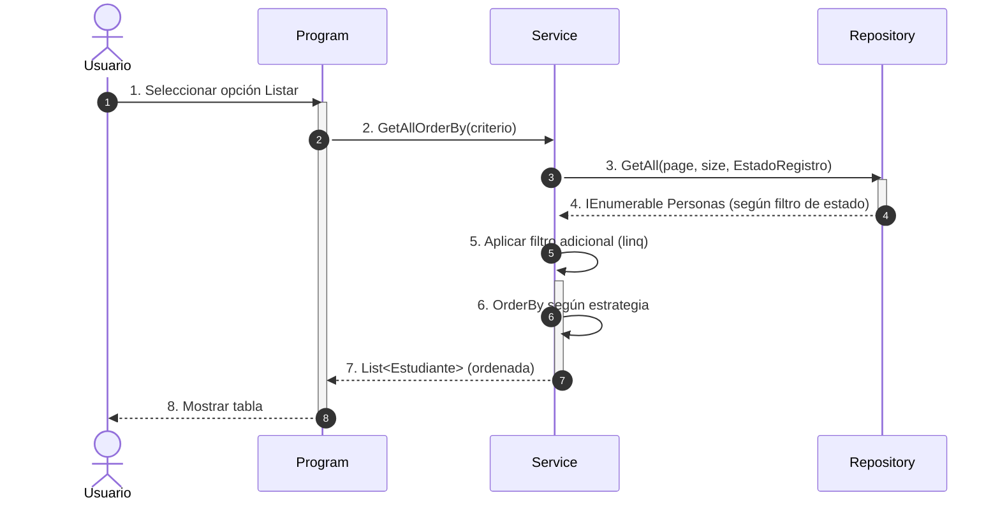
```mermaid
sequenceDiagram
    autonumber
    actor U as Usuario
    participant P as Program
    participant S as Service
    participant R as Repository
    
    U->>P: 1. Seleccionar opción Listar
    activate P
    P->>S: 2. GetAllOrderBy(criterio)
    activate S
    S->>R: 3. GetAll(page, size, EstadoRegistro)
    activate R
    R-->>S: 4. IEnumerable Personas (según filtro de estado)
    deactivate R
    S->>S: 5. Aplicar filtro adicional (linq)
    activate S
    S->>S: 6. OrderBy según estrategia
    S-->>P: 7. List<Estudiante> (ordenada)
    deactivate S
    P-->>U: 8. Mostrar tabla
    deactivate P
```

#### Trazabilidad de Código:
*   **[1] Usuario:** Selecciona opción del menú
*   **[2] Program:** `var lista = service.GetAllOrderBy(criterio);`
*   **[3-4] Repository:** `repository.GetAll(page, size, estado)` → Filtro por estado (Todos/Activos/Historial) y paginación.
*   **[5-6] Service:** Aplicar filtro y ordenación con diccionario de estrategias
*   **[7-8] Program:** `ImprimirTablaPersonas(lista)`

---

### 10.2. Diagrama de Secuencia: Buscar por ID (Operación READ ONE con Caché)

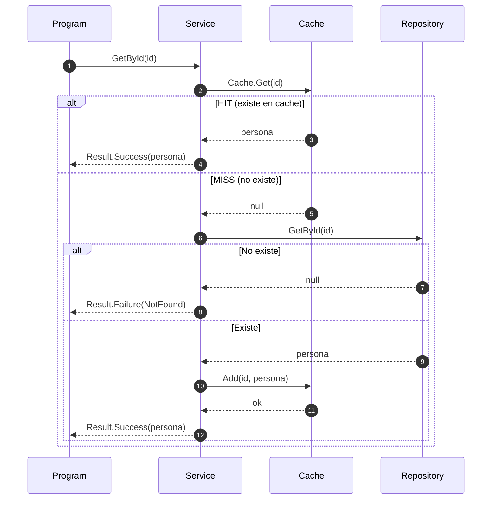
```mermaid
sequenceDiagram
    autonumber
    participant P as Program
    participant S as Service
    participant C as Cache
    participant R as Repository

    P->>S: GetById(id)
    S->>C: Cache.Get(id)
    alt HIT (existe en cache)
        C-->>S: persona
        S-->>P: Result.Success(persona)
    else MISS (no existe)
        C-->>S: null
        S->>R: GetById(id)
        alt No existe
            R-->>S: null
            S-->>P: Result.Failure(NotFound)
        else Existe
            R-->>S: persona
            S->>C: Add(id, persona)
            C-->>S: ok
            S-->>P: Result.Success(persona)
        end
    end
```

#### Trazabilidad de Código:
*   **[1] Program:** `service.GetById(id).Match(...)`
*   **[2] Service:** `cache.Get(id)` - Si existe (HIT) devuelve directamente
*   **[3] Cache:** Si no existe (MISS) → `null`
*   **[4] Repository:** `repository.GetById(id)`
*   **[5-6] Repository:** Localiza la entidad mediante ID (O(1) en RAM o índices en Disco).
*   **[7-8] Service:** Si no existe → `Result.Failure(PersonaErrors.NotFound(id))`
*   **[9-10] Cache:** Si existe → `cache.Add(id, persona)` - Se añade tras lectura
*   **[11] Program:** `.Match(onSuccess: p => Imprimir(p), onFailure: e => Error(e.Message))`

---

### 10.3. Diagrama de Secuencia: Crear Estudiante (Operación CREATE)

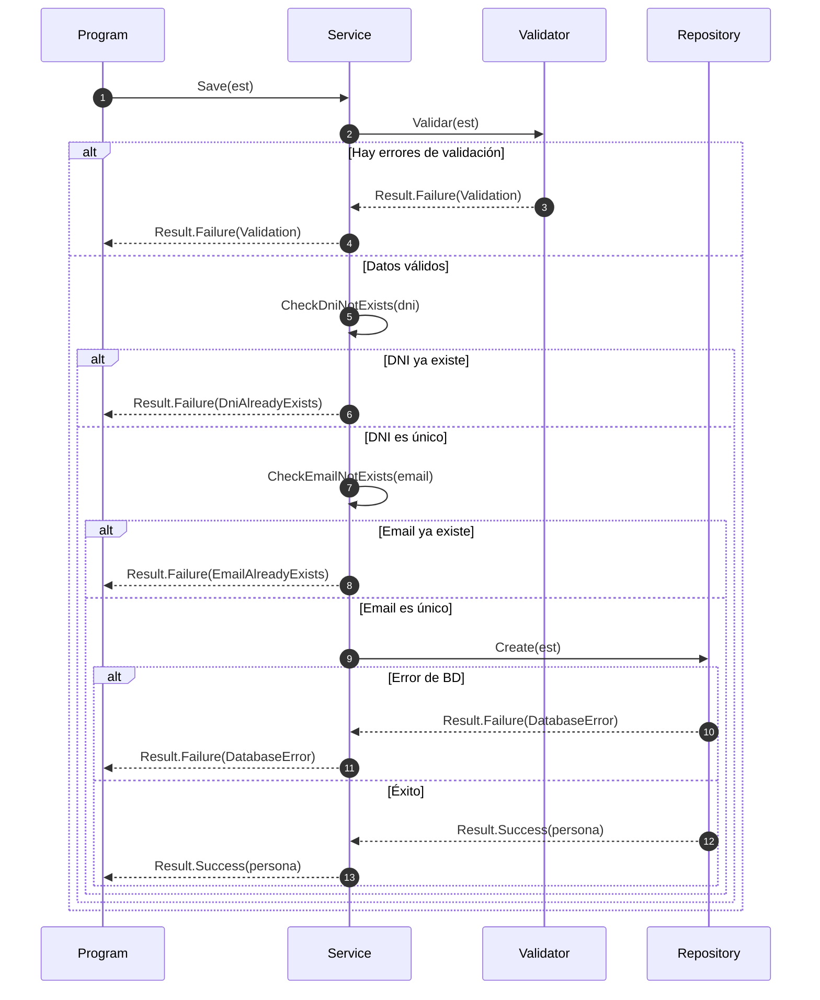
```mermaid
sequenceDiagram
    autonumber
    participant P as Program
    participant S as Service
    participant V as Validator
    participant R as Repository

    P->>S: Save(est)
    S->>V: Validar(est)
    alt Hay errores de validación
        V-->>S: Result.Failure(Validation)
        S-->>P: Result.Failure(Validation)
    else Datos válidos
        S->>S: CheckDniNotExists(dni)
        alt DNI ya existe
            S-->>P: Result.Failure(DniAlreadyExists)
        else DNI es único
            S->>S: CheckEmailNotExists(email)
            alt Email ya existe
                S-->>P: Result.Failure(EmailAlreadyExists)
            else Email es único
                S->>R: Create(est)
                alt Error de BD
                    R-->>S: Result.Failure(DatabaseError)
                    S-->>P: Result.Failure(DatabaseError)
                else Éxito
                    R-->>S: Result.Success(persona)
                    S-->>P: Result.Success(persona)
                end
            end
        end
    end
```

#### Trazabilidad de Código:
*   **[1] Program:** `service.Save(estudiante).Match(...)`
*   **[2] Service:** Llama al Validator (valida formato email, imagen, etc.)
*   **[3] Validator:** `valEstudiante.Validar(estudiante)` → `Result`
*   **[4] Service:** Si hay errores → `Result.Failure(PersonaErrors.Validation(errores))`
*   **[5] Service:** `CheckDniNotExists()` → Busca en índice DNI
*   **[6] Service:** Si DNI existe → `Result.Failure(PersonaErrors.DniAlreadyExists(dni))`
*   **[7] Service:** `CheckEmailNotExists()` → Busca en índice Email
*   **[8] Service:** Si Email existe → `Result.Failure(PersonaErrors.EmailAlreadyExists(email))`
*   **[9] Service:** `repository.Create(estudiante)` → Retorna `Result`
*   **[10-11] Repository:** Verifica unicidad, crea entidad, retorna `Result.Success/Failure`
*   **[12] Service:** Devuelve el resultado al Program
*   **[13] Program:** `.Match(onSuccess: p => Imprimir(p), onFailure: e => Error(e.Message))`

> **Nota:** El Repository ahora retorna `Result<Persona, DomainError>` para manejar errores de BD explícitamente.

---

### 10.4. Diagrama de Secuencia: Actualizar Estudiante (Operación UPDATE)

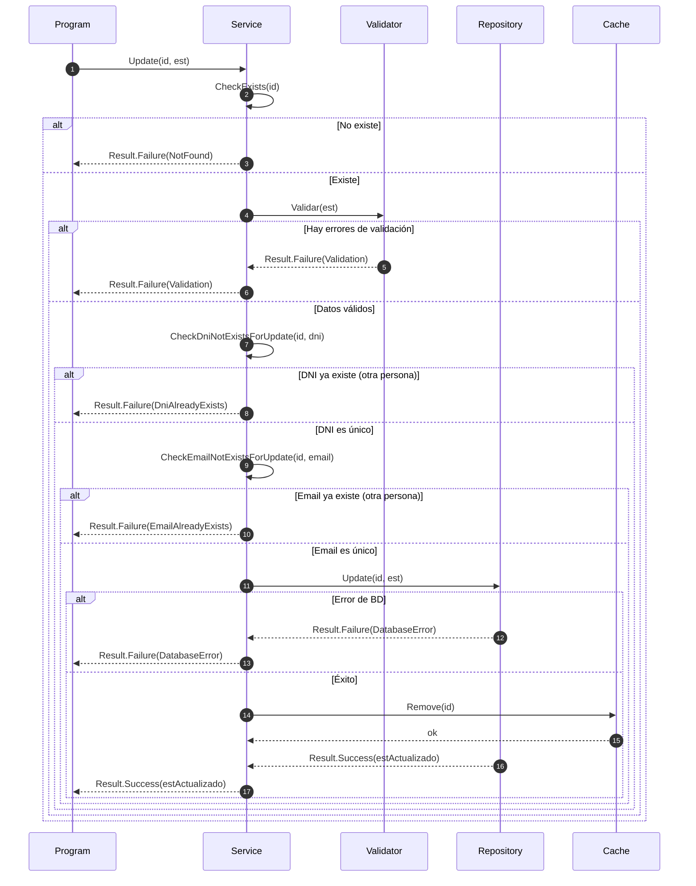
```mermaid
sequenceDiagram
    autonumber
    participant P as Program
    participant S as Service
    participant V as Validator
    participant R as Repository
    participant C as Cache

    P->>S: Update(id, est)
    S->>S: CheckExists(id)
    alt No existe
        S-->>P: Result.Failure(NotFound)
    else Existe
        S->>V: Validar(est)
        alt Hay errores de validación
            V-->>S: Result.Failure(Validation)
            S-->>P: Result.Failure(Validation)
        else Datos válidos
            S->>S: CheckDniNotExistsForUpdate(id, dni)
            alt DNI ya existe (otra persona)
                S-->>P: Result.Failure(DniAlreadyExists)
            else DNI es único
                S->>S: CheckEmailNotExistsForUpdate(id, email)
                alt Email ya existe (otra persona)
                    S-->>P: Result.Failure(EmailAlreadyExists)
                else Email es único
                    S->>R: Update(id, est)
                    alt Error de BD
                        R-->>S: Result.Failure(DatabaseError)
                        S-->>P: Result.Failure(DatabaseError)
                    else Éxito
                        S->>C: Remove(id)
                        C-->>S: ok
                        R-->>S: Result.Success(estActualizado)
                        S-->>P: Result.Success(estActualizado)
                    end
                end
            end
        end
    end
```

#### Trazabilidad de Código:
*   **[1] Program:** `service.Update(id, estudiante).Match(...)`
*   **[2] Service:** `CheckExists(id)` → Verifica que existe
*   **[3] Service:** Si no existe → `Result.Failure(PersonaErrors.NotFound(id))`
*   **[4] Service:** Llama al Validator
*   **[5] Validator:** `valEstudiante.Validar(estudiante)` → `Result`
*   **[6] Service:** Si hay errores → `Result.Failure(PersonaErrors.Validation(errores))`
*   **[7] Service:** `CheckDniNotExistsForUpdate(id, dni)` → Busca DNI que no sea el actual
*   **[8] Service:** Si DNI existe → `Result.Failure(PersonaErrors.DniAlreadyExists(dni))`
*   **[9] Service:** `CheckEmailNotExistsForUpdate(id, email)` → Busca Email que no sea el actual
*   **[10] Service:** Si Email existe → `Result.Failure(PersonaErrors.EmailAlreadyExists(email))`
*   **[11] Service:** `repository.Update(id, estudiante)` → Retorna `Result`
*   **[12] Repository:** Verifica unicidad, actualiza, retorna `Result.Success/Failure`
*   **[13] Service:** `cache.Remove(id)` - Invalida caché
*   **[14] Service:** Devuelve `Result.Success(estudiante)`
*   **[15] Program:** `ImprimirFichaPersona(actualizado)`

> **Nota:** El flujo usa Railway Programming con `Bind` para encadenar validaciones. Si cualquier paso falla, no continúa.

---

### 10.5. Diagrama de Secuencia: Eliminar Estudiante (Operación DELETE)

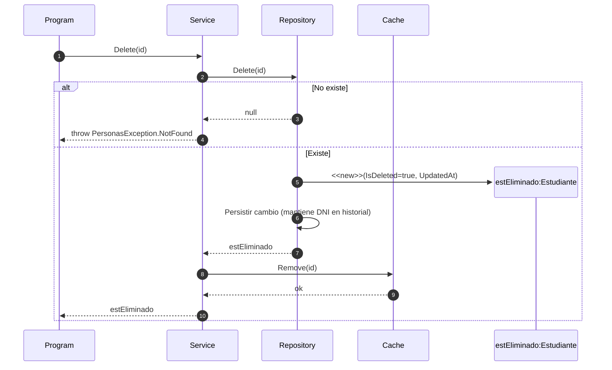
```mermaid
sequenceDiagram
    autonumber
    participant P as Program
    participant S as Service
    participant R as Repository
    participant C as Cache

    P->>S: Delete(id)
    S->>R: Delete(id)
    alt No existe
        R-->>S: null
        S-->>P: throw PersonasException.NotFound
    else Existe
        create participant EstEliminado as estEliminado:Estudiante
        R->>EstEliminado: <<new>>(IsDeleted=true, UpdatedAt)
        R->>R: Persistir cambio (mantiene DNI en historial)
        R-->>S: estEliminado
        S->>C: Remove(id)
        C-->>S: ok
        S-->>P: estEliminado
    end
```

#### Trazabilidad de Código:
*   **[1] Program:** `var eliminado = service.Delete(id);`
*   **[2] Service:** `repository.Delete(id)`
*   **[3-4] Repository:** Busca y valida la existencia del ID. Si no existe → lanza error.
*   **[5-7] Repository:** Marca el registro como `IsDeleted = true`. IMPORTANTE: El DNI permanece en el almacén para detectar futuros conflictos de alta.
*   **[8] Service:** `cache.Remove(id)` - Invalida caché
*   **[9] Service:** Devuelve `estEliminado`
*   **[10] Program:** `ImprimirFichaPersona(eliminado)`


### 10.6. Diagrama de Secuencia: Generar Informe de Rendimiento de Estudiantes (READ con Agregación)

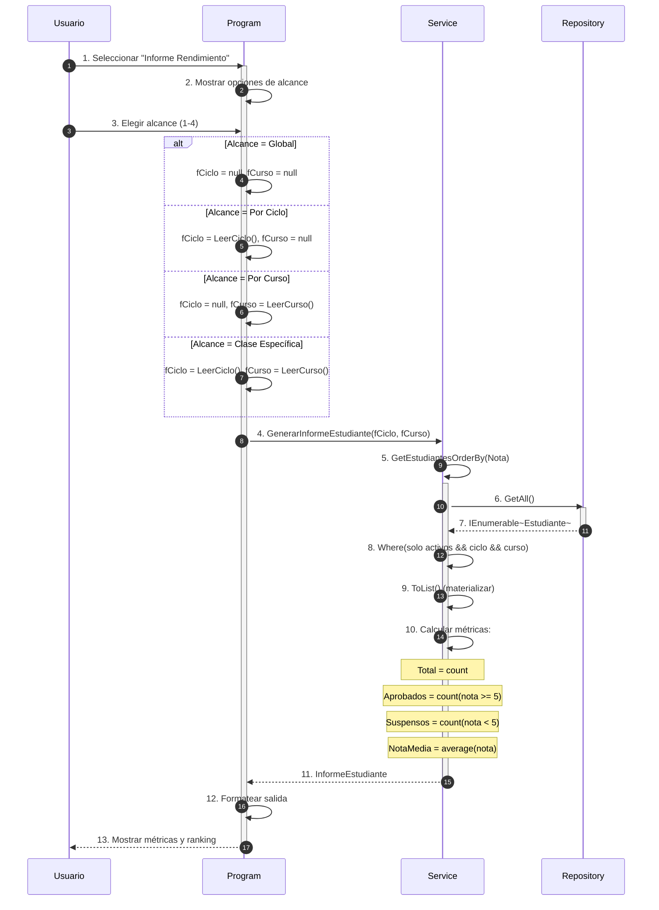
```mermaid
sequenceDiagram
    autonumber
    participant U as Usuario
    participant P as Program
    participant S as Service
    participant R as Repository
    
    U->>P: 1. Seleccionar "Informe Rendimiento"
    activate P
    P->>P: 2. Mostrar opciones de alcance
    U->>P: 3. Elegir alcance (1-4)
    alt Alcance = Global
        P->>P: fCiclo = null, fCurso = null
    else Alcance = Por Ciclo
        P->>P: fCiclo = LeerCiclo(), fCurso = null
    else Alcance = Por Curso
        P->>P: fCiclo = null, fCurso = LeerCurso()
    else Alcance = Clase Específica
        P->>P: fCiclo = LeerCiclo(), fCurso = LeerCurso()
    end
    P->>S: 4. GenerarInformeEstudiante(fCiclo, fCurso)
    activate S
    S->>S: 5. GetEstudiantesOrderBy(Nota)
    activate S
    S->>R: 6. GetAll()
    activate R
    R-->>S: 7. IEnumerable~Estudiante~
    deactivate R
    S->>S: 8. Where(solo activos && ciclo && curso)
    S->>S: 9. ToList() (materializar)
    S->>S: 10. Calcular métricas:
        Note over S: Total = count
        Note over S: Aprobados = count(nota >= 5)
        Note over S: Suspensos = count(nota < 5)
        Note over S: NotaMedia = average(nota)
    S-->>P: 11. InformeEstudiante
    deactivate S
    P->>P: 12. Formatear salida
    P-->>U: 13. Mostrar métricas y ranking
    deactivate P
```

#### Trazabilidad de Código:
*   **[1] Usuario:** Selecciona opción 8 del menú (`OpcionMenu.InformeEstudiantes`)
*   **[2-3] Program:** `MostrarInformeEstudiantes(service)` - Solicita alcance
*   **[4] Program:** `service.GenerarInformeEstudiante(fCiclo, fCurso)` - Pasa filtros
*   **[5-6] Service:** `GetEstudiantesOrderBy(TipoOrdenamiento.Nota)` - Obtiene del repositorio
*   **[7] Repository:** `repository.GetAll()` - Devuelve todos los estudiantes
*   **[8] Service:** `.Where(e => !e.IsDeleted && (ciclo == null || e.Ciclo == ciclo) && ...)` - Filtra solo activos y aplica alcances nulos
*   **[9] Service:** `.ToList()` - Materializa para contar varias veces (LINQ deferred execution)
*   **[10] Service:** Calcula:
    *   `TotalEstudiantes = count`
    *   `Aprobados = count(e => e.Calificacion >= 5.0)`
    *   `Suspensos = count(e => e.Calificacion < 5.0)`
    *   `NotaMedia = average(e => e.Calificacion)`
*   **[11] Service:** Devuelve `InformeEstudiante` con PorNota, Total, Aprobados, Suspensos, NotaMedia
*   **[12-13] Program:** Formatea y muestra tabla con métricas y ranking por nota

#### Punto Clave: Pipeline Funcional con LINQ
El método `GenerarInformeEstudiante` encadena operaciones en una sola expresión fluida:

```csharp
var estudiantes = GetEstudiantesOrderBy(TipoOrdenamiento.Nota)  // Obtener
    .Where(e => !e.IsDeleted)                                    // Solo Activos
    .Where(e => (ciclo == null || e.Ciclo == ciclo) && ...)       // Filtrar Alcance
    .ToList();                                                     // Materializar

return new InformeEstudiante {
    PorNota = estudiantes,
    TotalEstudiantes = estudiantes.Count,
    Aprobados = estudiantes.Count(e => e.Calificacion >= 5.0),
    Suspensos = estudiantes.Count(e => e.Calificacion < 5.0),
    NotaMedia = estudiantes.Average(e => e.Calificacion)
};
```

**Nota sobre `.ToList()`:** Se materializa el IEnumerable en lista para poder:
1. Contar múltiples veces (Aprobados, Suspensos, Total)
2. Calcular la media sin iterar de nuevo
3. Evitar evaluación diferida (deferred execution) en las estadísticas

---

### 10.7. Diagrama de Secuencia: Exportar Datos (Operación EXPORT)

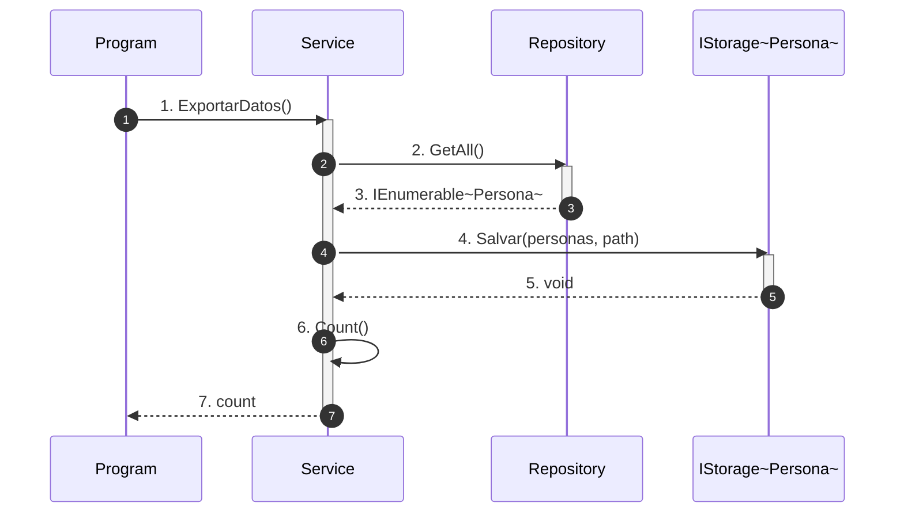
```mermaid
sequenceDiagram
    autonumber
    participant P as Program
    participant S as Service
    participant R as Repository
    participant St as IStorage~Persona~
    
    P->>S: 1. ExportarDatos()
    activate S
    S->>R: 2. GetAll()
    activate R
    R-->>S: 3. IEnumerable~Persona~
    deactivate R
    S->>St: 4. Salvar(personas, path)
    activate St
    St-->>S: 5. void
    deactivate St
    S->>S: 6. Count()
    S-->>P: 7. count
    deactivate S
```

#### Trazabilidad de Código:
*   **[1] Program:** `service.ExportarDatos()`
*   **[2-3] Repository:** `repository.GetAll()` → devuelve IEnumerable de personas
*   **[4-5] Storage:** `storage.Salvar(personas, path)` → guarda en el formato configurado
*   **[6] Service:** `personas.Count()` → obtiene el total de registros exportados
*   **[7] Program:** Devuelve el número de registros al usuario

---

### 10.8. Diagrama de Secuencia: Importar Datos (Operación IMPORT)

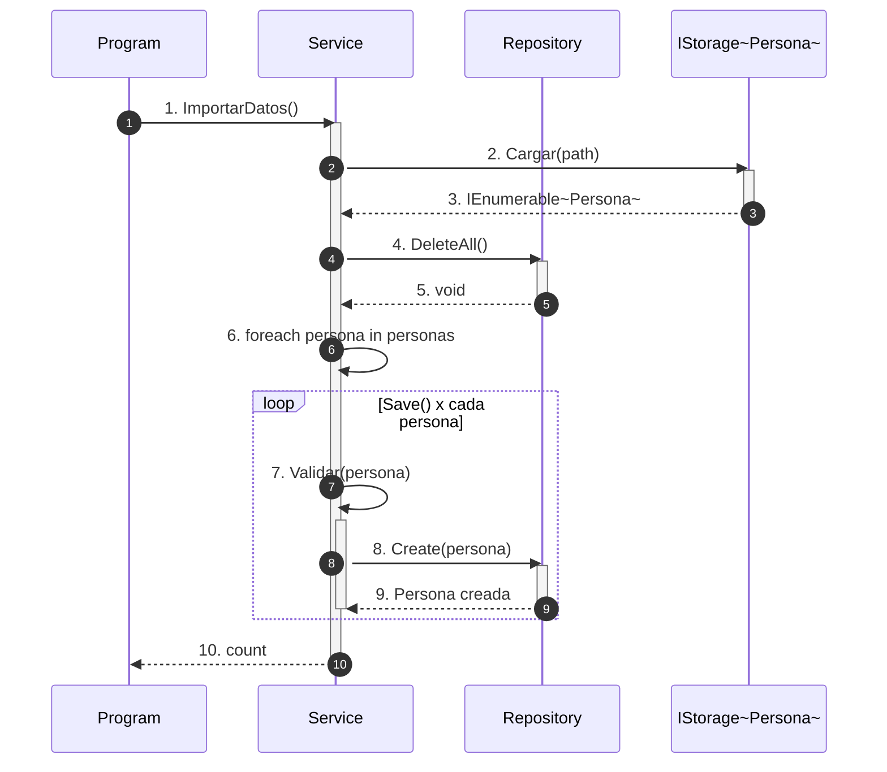
```mermaid
sequenceDiagram
    autonumber
    participant P as Program
    participant S as Service
    participant R as Repository
    participant St as IStorage~Persona~
    
    P->>S: 1. ImportarDatos()
    activate S
    S->>St: 2. Cargar(path)
    activate St
    St-->>S: 3. IEnumerable~Persona~
    deactivate St
    S->>R: 4. DeleteAll()
    activate R
    R-->>S: 5. void
    deactivate R
    S->>S: 6. foreach persona in personas
    loop Save() x cada persona
        S->>S: 7. Validar(persona)
        activate S
        S->>R: 8. Create(persona)
        activate R
        R-->>S: 9. Persona creada
        deactivate R
        deactivate S
    end
    S-->>P: 10. count
    deactivate S
```

#### Trazabilidad de Código:
*   **[1] Program:** `service.ImportarDatos()`
*   **[2-3] Storage:** `storage.Cargar(path)` → lee del formato configurado
*   **[4-5] Repository:** `repository.DeleteAll()` → elimina todos los datos existentes
*   **[6-9] Service:** `foreach` que itera sobre cada persona:
    *   **[7] Service:** `ValidarPersonaConLogicaPolimorfica(persona)` → valida según tipo
    *   **[8-9] Repository:** `repository.Create(persona)` → crea el registro
*   **[10] Program:** Devuelve el número de registros importados

---

### 10.9. Diagrama de Secuencia: Realizar Backup (Operación BACKUP)

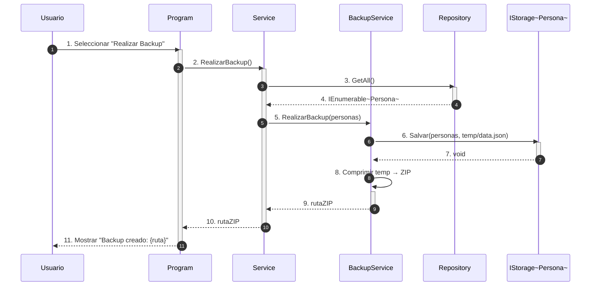
```mermaid
sequenceDiagram
    autonumber
    participant U as Usuario
    participant P as Program
    participant S as Service
    participant BS as BackupService
    participant R as Repository
    participant St as IStorage~Persona~
    
    U->>P: 1. Seleccionar "Realizar Backup"
    activate P
    P->>S: 2. RealizarBackup()
    activate S
    S->>R: 3. GetAll()
    activate R
    R-->>S: 4. IEnumerable~Persona~
    deactivate R
    S->>BS: 5. RealizarBackup(personas)
    activate BS
    BS->>St: 6. Salvar(personas, temp/data.json)
    activate St
    St-->>BS: 7. void
    deactivate St
    BS->>BS: 8. Comprimir temp → ZIP
    activate BS
    BS-->>S: 9. rutaZIP
    deactivate BS
    S-->>P: 10. rutaZIP
    deactivate S
    P-->>U: 11. Mostrar "Backup creado: {ruta}"
    deactivate P
```

#### Trazabilidad de Código:
*   **[1] Usuario:** Selecciona opción 16 del menú (`OpcionMenu.RealizarBackup`)
*   **[2] Program:** `service.RealizarBackup()`
*   **[3-4] Repository:** `repository.GetAll()` → obtiene todas las personas
*   **[5] Service:** `backupService.RealizarBackup(personas)` → pasa los datos al servicio de backup
*   **[6-7] Storage:** `storage.Salvar(personas, tempPath)` → serializa a JSON/XML/etc en directorio temporal
*   **[8] BackupService:** `ZipFile.CreateFromDirectory()` → comprime a ZIP
*   **[9-10] Service:** Devuelve la ruta del archivo ZIP creado
*   **[11] Program:** Muestra mensaje de éxito con la ruta

**Punto Clave:** El servicio de backup y report están inyectados en AcademiaService, lo que permite cambiar su implementación sin modificar la lógica de negocio.

---

### 10.10. Diagrama de Secuencia: Restaurar Backup (Operación RESTORE)

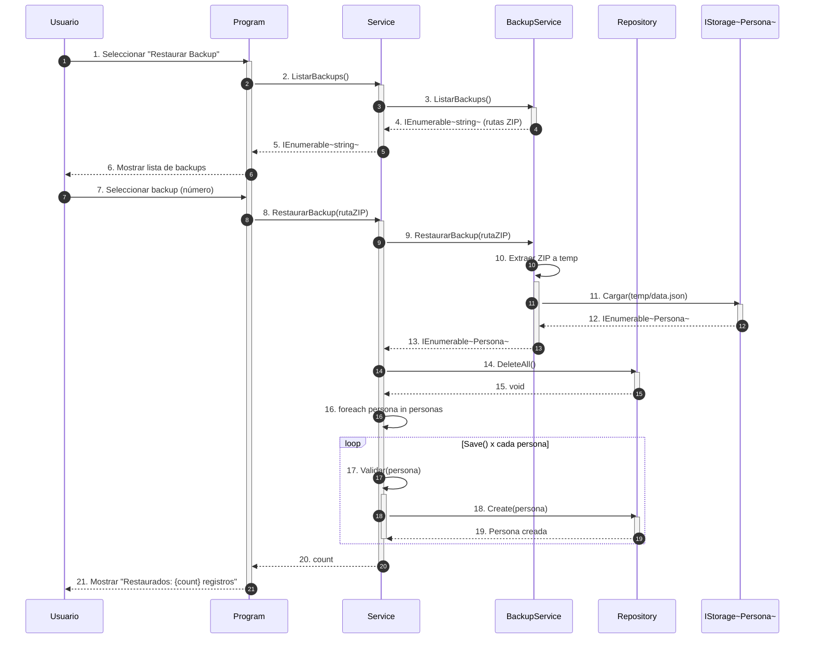
```mermaid
sequenceDiagram
    autonumber
    participant U as Usuario
    participant P as Program
    participant S as Service
    participant BS as BackupService
    participant R as Repository
    participant St as IStorage~Persona~
    
    U->>P: 1. Seleccionar "Restaurar Backup"
    activate P
    P->>S: 2. ListarBackups()
    activate S
    S->>BS: 3. ListarBackups()
    activate BS
    BS-->>S: 4. IEnumerable~string~ (rutas ZIP)
    deactivate BS
    S-->>P: 5. IEnumerable~string~
    deactivate S
    P-->>U: 6. Mostrar lista de backups
    U->>P: 7. Seleccionar backup (número)
    P->>S: 8. RestaurarBackup(rutaZIP)
    activate S
    S->>BS: 9. RestaurarBackup(rutaZIP)
    activate BS
    BS->>BS: 10. Extraer ZIP a temp
    activate BS
    BS->>St: 11. Cargar(temp/data.json)
    activate St
    St-->>BS: 12. IEnumerable~Persona~
    deactivate St
    BS-->>S: 13. IEnumerable~Persona~
    deactivate BS
    S->>R: 14. DeleteAll()
    activate R
    R-->>S: 15. void
    deactivate R
    S->>S: 16. foreach persona in personas
    loop Save() x cada persona
        S->>S: 17. Validar(persona)
        activate S
        S->>R: 18. Create(persona)
        activate R
        R-->>S: 19. Persona creada
        deactivate R
        deactivate S
    end
    S-->>P: 20. count
    deactivate S
    P-->>U: 21. Mostrar "Restaurados: {count} registros"
    deactivate P
```

#### Trazabilidad de Código:
*   **[1] Usuario:** Selecciona opción 17 del menú (`OpcionMenu.RestaurarBackup`)
*   **[2-5] Program:** `service.ListarBackups()` → obtiene lista de archivos ZIP disponibles
*   **[6-7] Program:** Muestra la lista y el usuario selecciona uno
*   **[8] Program:** `service.RestaurarBackup(rutaZip)` → pasa la ruta al servicio
*   **[9-13] BackupService:** 
    *   Extrae el ZIP a un directorio temporal
    *   Carga los datos con `storage.Cargar()`
*   **[14-15] Repository:** `repository.DeleteAll()` → elimina todos los datos actuales
*   **[16-19] Service:** `foreach` que itera sobre cada persona restaurada:
    *   Valida la persona según su tipo
    *   Crea el registro en el repositorio
*   **[20-21] Program:** Muestra el número de registros restaurados

**Punto Clave:** La restauración primero limpia el repositorio y luego reinserta todos los datos, manteniendo la lógica de validación del servicio.

---

### 10.11. Diagrama de Actividad: Actualizar Estudiante (UPDATE)

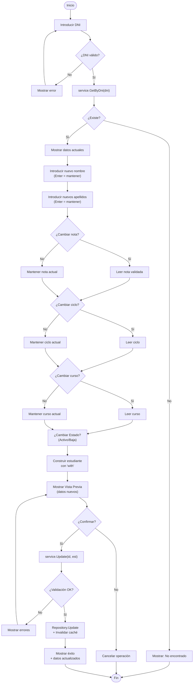
```mermaid
flowchart TD
    A([Inicio]) --> B["Introducir DNI"]
    B --> C{¿DNI válido?}
    C -->|No| D["Mostrar error"]
    D --> B
    C -->|Sí| E["service.GetByDni(dni)"]
    E --> F{¿Existe?}
    F -->|No| G["Mostrar: No encontrado"]
    G --> H([Fin])
    F -->|Sí| I["Mostrar datos actuales"]
    I --> J["Introducir nuevo nombre\n(Enter = mantener)"]
    J --> K["Introducir nuevos apellidos\n(Enter = mantener)"]
    K --> L{¿Cambiar nota?}
    L -->|Sí| M["Leer nota validada"]
    L -->|No| N["Mantener nota actual"]
    M --> O{¿Cambiar ciclo?}
    N --> O
    O -->|Sí| P["Leer ciclo"]
    O -->|No| Q["Mantener ciclo actual"]
    P --> R{¿Cambiar curso?}
    Q --> R
    R -->|Sí| S["Leer curso"]
    R -->|No| T["Mantener curso actual"]
    S --> U["¿Cambiar Estado?\n(Activo/Baja)"]
    T --> U
    U --> V["Construir estudiante\ncon 'with'"]
    V --> W["Mostrar Vista Previa\n(datos nuevos)"]
    W --> X{¿Confirmar?}
    X -->|No| Y["Cancelar operación"]
    Y --> H
    X -->|Sí| Z["service.Update(id, est)"]
    Z --> AA{¿Validación OK?}
    AA -->|No| AB["Mostrar errores"]
    AB --> W
    AA -->|Sí| AC["Repository.Update\n+ Invalidar caché"]
    AC --> AD["Mostrar éxito\n+ datos actualizados"]
    AD --> H
```

#### Trazabilidad de Código:
*   **[A-H] Validación DNI:** `ValidarDniCompleto(d)` - Validación con algoritmo real
*   **[E-F] Búsqueda:** `service.GetByDni(dni)` → `Result.Failure(NotFound)` si no existe
*   **[I] Mostrar actual:** `ImprimirFichaPersona(est)` - Muestra datos antes de modificar
*   **[J-T] Entrada modular:** Cada campo se pide individualmente con opción de mantener
*   **[U] Constructor with:** `est with { Nombre = ..., Calificacion = ... }` - Inmutabilidad
*   **[V] Preview:** `ImprimirFichaPersona(act)` - Revisión antes de confirmar
*   **[Y] Update:** `service.Update(est.Id, act)` - Lógica de negocio + validación
*   **[Z] Validación:** `valEstudiante.Validar(estudiante)` → `Result`
*   **[AB] Persistencia:** `repository.Update()` + `cache.Remove(id)` - Caché LRU

---

### 10.12. Diagrama de Estado: Ciclo de Vida del Estudiante

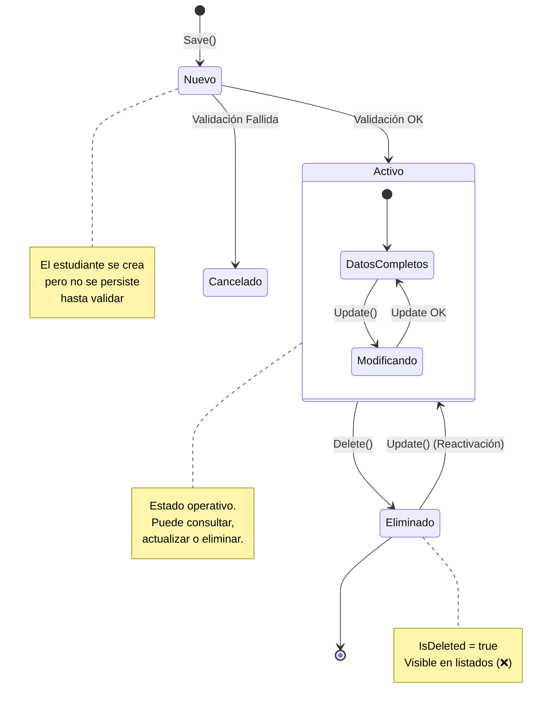
```mermaid
stateDiagram-v2
    [*] --> Nuevo: Save()
    Nuevo --> Activo: Validación OK
    Nuevo --> Cancelado: Validación Fallida
    
    state Activo {
        [*] --> DatosCompletos
        DatosCompletos --> Modificando: Update()
        Modificando --> DatosCompletos: Update OK
    }
    
    Activo --> Eliminado: Delete()
    Eliminado --> Activo: Update() (Reactivación)
    Eliminado --> [*]
    
    note right of Nuevo
        El estudiante se crea
        pero no se persiste
        hasta validar
    end note
    
    note right of Activo
        Estado operativo.
        Puede consultar, 
        actualizar o eliminar.
    end note
    
    note right of Eliminado
        IsDeleted = true
        Visible en listados (❌)
    end note
```

#### Estados del Estudiante:

| Estado          | Descripción                                 | Transiciones                             |
| --------------- | ------------------------------------------- | ---------------------------------------- |
| **Nuevo**       | Estudiante creado en memoria, sin persistir | → Activo (validado), → Cancelado (error) |
| **Activo**      | Estudiante persistido y operativo           | → Modificando, → Eliminado               |
| **Modificando** | Transición temporal durante Update          | → Activo                                 |
| **Eliminado**   | Marcado como borrado (IsDeleted=true)       | → Activo (Reactivación), → Fin           |

#### Transiciones y Eventos:

| Evento          | De Estado   | A Estado    | Acción asociada                        |
| --------------- | ----------- | ----------- | -------------------------------------- |
| `Save()`        | -           | Nuevo       | Crear instancia con ID temporal        |
| Validación OK   | Nuevo       | Activo      | `repository.Create()` + caché          |
| Validación FAIL | Nuevo       | Cancelado   | `Result.Failure(Validation)`          |
| `Update()`      | Activo      | Modificando | Reemplazar datos                       |
| Update OK       | Modificando | Activo      | `repository.Update()` + caché.Remove() |
| `Delete()`      | Activo      | Eliminado   | `IsDeleted = true` + caché.Remove()    |
| `Update()`      | Eliminado   | Activo      | Reactivación (IsDeleted = false)       |

#### Implementación en Código (con Result):

```csharp
// Save - Transición Nuevo → Activo
public Result<Persona, DomainError> Save(Persona persona) {
    return ValidarPersona(persona)              // ¿Validación OK?
        .Map(p => repository.Create(p)!);        // → Activo
}

// Update - Transición Activo/Eliminado → Modificando → Activo  
public Result<Persona, DomainError> Update(int id, Persona persona) {
    return CheckExists(id)                      // ¿Existe?
        .Bind(_ => ValidarPersona(persona))     // ¿Validación OK?
        .Map(p => {
            cache.Remove(id);
            return repository.Update(id, p)!;   // → Activo (nuevos datos)
        });
}

// Delete - Transición Activo → Eliminado
public Persona Delete(int id) {
    var eliminada = repository.Delete(id) ?? throw new PersonasException.NotFound(id.ToString()); // IsDeleted = true
    cache.Remove(id);
    return eliminada;
}
```

---

## 11. Patrones de Diseño y DI

Este proyecto implementa **Inyección de Dependencias** como patrón central, aprovechando `Microsoft.Extensions.DependencyInjection` para gestionar el ciclo de vida de todos los componentes.

### 📦 11.1. Repository Pattern + DI

**Problema:** Necesitamos abstraer la persistencia para que la lógica de negocio no dependa de cómo se almacenan los datos.

```csharp
public interface IPersonasRepository {
    Persona? GetById(int id);
    Persona? GetByDni(string dni);
    IEnumerable<Persona> GetAll();
    Persona? Create(Persona entity);
    Persona? Update(int id, Persona entity);
    Persona? Delete(int id);
}
```

**Con DI:** El repositorio se registra como Singleton y se inyecta en el servicio:

```csharp
services.AddSingleton<IPersonasRepository>(sp => {
    var repoType = AppConfig.RepositoryType.ToLower();
    return repoType switch {
        "memory" => new PersonasMemoryRepository(),
        "binary" => new PersonasBinaryRepository(),
        "json" => new PersonasJsonRepository(),
        "dapper" => new PersonasDapperRepository(),
        "adonet" => new PersonasAdoRepository(),
        "efcore" => new PersonasEfRepository(),
        _ => new PersonasMemoryRepository()
    };
});
```

---

### 🗺️ 11.2. Strategy Pattern

**Problema:** Aplicar diferentes algoritmos de ordenación sin múltiples `if/else`.

```csharp
var comparadores = new Dictionary<TipoOrdenamiento, Func<IOrderedEnumerable<Persona>>> {
    { TipoOrdenamiento.Id, () => lista.OrderBy(p => p.Id) },
    { TipoOrdenamiento.Nota, () => lista.OrderByDescending(p => 
        p is Estudiante e ? e.Calificacion : -1) },
};

return comparadores.TryGetValue(orden, out var comparador)
    ? comparador()
    : lista.OrderBy(p => p.Id);
```

---

### ⚡ 11.3. LRU Cache (Least Recently Used)

**Problema:** Las búsquedas repetidas por ID son costosas.

```csharp
private readonly Dictionary<TKey, TValue> _data = new();
private readonly LinkedList<TKey> _usageOrder = new();

public void Add(TKey key, TValue value) {
    if (_data.TryGetValue(key, out _)) { RefreshUsage(key); return; }
    if (_data.Count >= _capacity) {
        var oldest = _usageOrder.First!.Value;
        _usageOrder.RemoveFirst();
        _data.Remove(oldest);
    }
    _data.Add(key, value);
    _usageOrder.AddLast(key);
}
```

| Operación | Complejidad |
| --------- | ----------- |
| Add/Get   | O(1)        |

**Patrón Look-Aside:**
```csharp
var cached = cache.Get(id);
if (cached != null) return cached;        // HIT
var persona = repository.GetById(id);       // MISS
cache.Add(id, persona);
return persona;
```

---

### 🔄 11.4. Dependency Injection con DependenciesProvider

**Problema:** Necesitamos unificar la creación de todos los servicios (repositorios, storages, validadores, caché) sin hardcodear dependencias en cada clase.

**Solución:** Una clase estática `DependenciesProvider` configura todo el contenedor DI:

```csharp
public static class DependenciesProvider
{
    public static IServiceProvider BuildServiceProvider()
    {
        var services = new ServiceCollection();
        
        RegisterStorages(services);      // Transient: nueva instancia por uso
        RegisterRepositories(services);   // Singleton: mantiene estado
        RegisterServices(services);       // Scoped/Transient según necesidad
        
        return services.BuildServiceProvider();
    }

    private static void RegisterRepositories(IServiceCollection services)
    {
        services.AddSingleton<IPersonasRepository>(sp => {
            var repoType = AppConfig.RepositoryType.ToLower();
            return repoType switch {
                "memory" => new PersonasMemoryRepository(),
                "binary" => new PersonasBinaryRepository(),
                "json" => new PersonasJsonRepository(),
                "dapper" => new PersonasDapperRepository(),
                "adonet" => new PersonasAdoRepository(),
                "efcore" => new PersonasEfRepository(),
                _ => new PersonasMemoryRepository()
            };
        });
    }

    private static void RegisterServices(IServiceCollection services)
    {
        services.AddSingleton<ICache<int, Persona>>(sp => 
            new LruCache<int, Persona>(AppConfig.CacheSize));

        // Validadores: se encadenan en el servicio con Bind (Railway Programming)
        services.AddTransient<IValidador<Persona>, ValidadorPersona>();      // Campos comunes
        services.AddTransient<IValidador<Persona>, ValidadorEstudiante>();  // Campos Estudiante
        services.AddTransient<IValidador<Persona>, ValidadorDocente>();    // Campos Docente

        services.AddTransient<IBackupService, BackupService>();
        services.AddTransient<IReportService, ReportService>();
        
        services.AddScoped<IAcademiaService, AcademiaService>();
    }

    private static void RegisterStorages(IServiceCollection services)
    {
        services.AddTransient<IStorage<Persona>>(sp => {
            var storageType = AppConfig.StorageType.ToLower();
            return storageType switch {
                "json" => new AcademiaJsonStorage(),
                "xml" => new AcademiaXmlStorage(),
                "csv" => new AcademiaCsvStorage(),
                "csv-alt" => new AcademiaCsvAltStorage(),
                "txt" or "text" => new AcademiaTextStorage(),
                "bin" or "binary" => new AcademiaBinStorage(),
                _ => new AcademiaJsonStorage()
            };
        });
    }
}
```

### Ciclo de Vida en el Contenedor

| Servicio | Tipo | Razón |
|----------|------|-------|
| `IPersonasRepository` | **Singleton** | Mantiene estado en memoria o conexión a BD |
| `ICache<int, Persona>` | **Singleton** | Caché compartida entre todas las peticiones |
| `IStorage<Persona>` | **Transient** | Nueva instancia por operación import/export |
| `IValidador<Persona>` | **Transient** | Sin estado, nuevo por validación |
| `IBackupService` | **Transient** | Sin estado, nuevo por operación |
| `IReportService` | **Transient** | Sin estado, nuevo por informe |
| `IAcademiaService` | **Scoped** | Una instancia por scope/request |

### Uso en Program.cs

```csharp
void Main() {
    var serviceProvider = DependenciesProvider.BuildServiceProvider();
    
    using var scope = serviceProvider.CreateScope();
    var service = scope.ServiceProvider.GetRequiredService<IAcademiaService>();
    
    // El servicio ya tiene todas sus dependencias inyectadas
    var personas = service.GetAll();
}
```

### Ventajas del enfoque DI

1. **Desacoplamiento:** Las clases no crean sus dependencias, las reciben
2. **Testabilidad:** Fácil reemplazar implementaciones con mocks
3. **Ciclo de vida controlado:** Singleton, Scoped, Transient gestionados por el contenedor
4. **Configuración centralizada:** Todo en un solo lugar
5. **Sin singletons manuales:** Se acabaron los `.Instance` y `Lazy<T>`


---

## 12 Sistema de Logging con Serilog

El sistema implementa un completo sistema de logging usando **Serilog** que escribe tanto en consola como en archivos.

### 12.1. ¿Por qué es importante usar logs?

El logging es fundamental en cualquier aplicación profesional por varias razones:

| Razón | Descripción |
|-------|------------|
| **Trazabilidad** | Permite seguir el flujo de ejecución y entender qué pasó en caso de error |
| **Depuración** | Facilita encontrar bugs en producción donde no hay debugger |
| **Auditoría** | Mantiene un registro de operaciones para cumplimiento legal |
| **Mantenimiento** | Permite monitorear la salud de la aplicación |
| **Análisis** | Los logs estructurados permiten generar métricas y dashboards |

> **"Los logs son la segunda línea de defensa cuando todo falla."**

### 12.2. Configuración en appsettings.json

El logging se configura en `appsettings.json`:

```json
{
  "Logging": {
    "File": {
      "Enabled": true,
      "Directory": "log",
      "RetainDays": 7,
      "Level": "Error",
      "OutputTemplate": "{Timestamp:yyyy-MM-dd HH:mm:ss.fff} [{Level:u3}] [{SourceContext}] {Message:lj}{NewLine}{Exception}"
    }
  }
}
```

### 12.3. Niveles de Log

Serilog define niveles de severidad:

| Nivel | Uso |
|-------|-----|
| **Debug** | Información detallada para desarrolladores |
| **Information** | Eventos normales de la aplicación |
| **Warning** | Situaciones anomalous pero no críticas |
| **Error** | Errores que afectan una operación específica |
| **Fatal** | Errores críticos que hacen caer la aplicación |

### 12.4. Características del Sistema

| Característica | Descripción |
|---------------|-------------|
| **Archivo diario** | Un archivo por día: `log/log-20260317.txt` |
| **Retención** | Mantiene solo los últimos 7 días (configurable) |
| **Nivel** | Solo registra errores a archivo (configurable) |
| **Limpieza automática** | Serilog elimina archivos antiguos automáticamente |

### 12.5. Configuración en Program.cs

El sistema configura **dos destinos** de logging:

```csharp
var loggerConfiguration = new LoggerConfiguration()
    .MinimumLevel.Debug()
    // Destino 1: Consola (siempre visible durante desarrollo)
    .WriteTo.Console(
        outputTemplate: "{Timestamp:HH:mm:ss.fff} [{Level:u3}] [{SourceContext}] {Message:lj}{NewLine}{Exception}")
    // Destino 2: Archivo (persistente, para análisis posterior)
    .WriteTo.File(
        path: Path.Combine(AppConfig.LogDirectory, "log-.txt"),
        rollingInterval: RollingInterval.Day,
        retainedFileCountLimit: AppConfig.LogRetainDays,
        restrictedToMinimumLevel: logLevel)
    .CreateLogger();
```

**¿Por qué dos destinos?**
- **Consola**: Feedback inmediato durante desarrollo
- **Archivo**: Persistencia para análisis en producción

### 12.6. Logging de Errores

Todos los errores del sistema se registran automáticamente en archivo:

```csharp
void MostrarError(string mensaje)
{
    Log.Error("❌ {ErrorMessage}", mensaje);
    // Mostrar en consola...
}
```

### 12.7. Ubicación de Logs

```
📁 Donde se ejecuta el programa/
   📁 log/
      📄 log-20260317.txt   ← Hoy
      📄 log-20260316.txt   ← Ayer
      ... (máx 7 archivos)
```

### 12.8. Opciones de Configuración

| Opción | Tipo | Default | Descripción |
|--------|------|---------|-------------|
| `Enabled` | bool | true | Habilitar/deshabilitar logging a archivo |
| `Directory` | string | "log" | Directorio donde se guardan los logs |
| `RetainDays` | int | 7 | Días que se mantienen los archivos |
| `Level` | string | "Error" | Nivel mínimo: Debug, Information, Warning, Error |

---

## 13 Lo que has aprendido en este proyecto: Pilares de Ingeniería

Completar este sistema te ha permitido trabajar con decisiones de diseño que reflejan cómo se construye el software de alta calidad en la industria.

### 1. Abstracción de la Estructura de Datos
Has aprendido a separar la lógica de almacenamiento de la lógica de negocio. El `Dictionary` te ha enseñado la diferencia entre **O(n)** (búsqueda secuencial) y **O(1)** (búsqueda por clave).

### 2. Patrón Strategy con Dictionary
Has aprendido a centralizar lógica de ordenación en un diccionario, haciendo el código más mantenible y extensible.

### 3. Caché LRU
Has implementado un algoritmo clásico de optimización de lecturas, entendiendo:
- Patrón Look-Aside
- Trade-off entre memoria y velocidad
- Invalidación de caché

### 4. Dependency Injection con DependenciesProvider
Has comprendido por qué el Servicio no fabrica sus propias dependencias, sino que las recibe desde fuera.
- **Contenedor DI:** Uso de `Microsoft.Extensions.DependencyInjection` para gestionar el ciclo de vida de los servicios.
- **DependenciesProvider:** Clase estática que centraliza el registro de todos los servicios.
- **Ciclo de vida:** Singleton (repositorios, caché), Scoped (servicios principales), Transient (operaciones por uso).
- **Sin patrones Factory:** Eliminación de `RepositoryFactory` y `StorageFactory`, todo configurado en un solo lugar.

### 5. Validación de Dominio
Has aprendido a separar las reglas de negocio (DNI válido, nota 0-10) del resto de la aplicación.

### 6. Serialización Binaria
Has implementado lectura/escritura binaria con `BinaryReader`/`BinaryWriter` para persistencia de alto rendimiento.

### 7. Programación Funcional con CSharpFunctionalExtensions
Has aprendido a usar el patrón `Result` para manejar errores sin excepciones:
- `Result.Success()` y `Result.Failure()` para representar operaciones
- `.Match()` para procesar el resultado de forma clara
- Errores de dominio semánticos

### 8. Pattern Matching Moderno
Has dominado la sintaxis moderna de C#:
- `is {}` para evitar null checks tradicionales
- Expresiones switch avanzadas
- Records con expresiones `with`

### 9. Múltiples Formas de Acceso a Datos
Has aprendido que existen diferentes formas de acceder a una base de datos SQLite, cada una con sus ventajas:

| Enfoque | Biblioteca | Ventajas | Inconvenientes |
|---------|------------|----------|----------------|
| **Dapper** | Dapper | Muy rápido, SQL puro, poco código | Necesitas escribir SQL |
| **ADO.NET** | System.Data.Sqlite | Control total, sin dependencias | Mucho código repetitivo |
| **EF Core** | Microsoft.EntityFrameworkCore | Abstracción total, migrations | Más lento, curva de aprendizaje |

### 10. Entity + Mapper Pattern
Has aprendido un patrón común en aplicaciones profesionales:
- **Una sola tabla** en la base de datos (`PersonaEntity`) con todos los campos.
- **Campo discriminador** (`Tipo`) para saber si es Estudiante o Docente.
- **Mapper** convierte Entity ↔ Model según el tipo.
- Esto simplifica las consultas y mantiene la base de datos simple.

### 11. Interfaces Profesionales con Spectre.Console
Has aprendido a crear interfaces de consola atractivas y funcionales:
- Tablas con bordes y colores
- Paneles decorativos
- Spinners y barras de progreso
- Validación visual con hints

### 12. Logging Profesional
Has implementado un sistema de logging robusto con Serilog:
- Logging estructurado
- Múltiples destinos (consola + archivo)
- Rotación automática de archivos
- Retención configurable

