# 🎓 Sistema de Gestión Académica - Guía Completa para Estudiantes

> **Un proyecto real de arquitectura en capas con WPF, MVVM, Clean Architecture y patrones de diseño profesionales**


---

## 📋 Tabla de Contenidos

- [🎓 Sistema de Gestión Académica - Guía Completa para Estudiantes](#-sistema-de-gestión-académica---guía-completa-para-estudiantes)
  - [📋 Tabla de Contenidos](#-tabla-de-contenidos)
  - [1. Introducción y Contexto del Problema](#1-introducción-y-contexto-del-problema)
    - [1.1. El Problema y el Enunciado](#11-el-problema-y-el-enunciado)
    - [1.2. Requisitos Funcionales](#12-requisitos-funcionales)
      - [1.2.1. Gestión de Personas (General)](#121-gestión-de-personas-general)
      - [1.2.2. Gestión de Estudiantes](#122-gestión-de-estudiantes)
      - [1.2.3. Gestión de Docentes](#123-gestión-de-docentes)
      - [1.2.4. Gestión de Importación/Exportación](#124-gestión-de-importaciónexportación)
      - [1.2.5. Gestión de Backup](#125-gestión-de-backup)
    - [1.3. Requisitos No Funcionales](#13-requisitos-no-funcionales)
    - [1.4. Requisitos de Información](#14-requisitos-de-información)
      - [1.4.1. Modelo de Dominio](#141-modelo-de-dominio)
        - [Entidad: Persona (Clase Base Abstracta)](#entidad-persona-clase-base-abstracta)
        - [Entidad: Estudiante (Hereda de Persona)](#entidad-estudiante-hereda-de-persona)
        - [Entidad: Docente (Hereda de Persona)](#entidad-docente-hereda-de-persona)
      - [1.4.2. Valores Enumerados (Enums)](#142-valores-enumerados-enums)
        - [Enum: Ciclo](#enum-ciclo)
        - [Enum: Curso](#enum-curso)
        - [Enum: TipoDocente](#enum-tipodocente)
        - [Enum: TipoOrdenamiento](#enum-tipoordenamiento)
      - [1.4.3. Records de Dominio](#143-records-de-dominio)
        - [Record: InformeEstudiante](#record-informeestudiante)
        - [Record: InformeDocente](#record-informedocente)
      - [1.4.4. Restricciones de Integridad](#144-restricciones-de-integridad)
    - [1.5. Diagrama de Casos de Uso UML](#15-diagrama-de-casos-de-uso-uml)
      - [📖 Leyenda del Diagrama](#-leyenda-del-diagrama)
      - [🔗 Relaciones del Diagrama](#-relaciones-del-diagrama)
        - [Include (Dependencias Obligatorias)](#include-dependencias-obligatorias)
        - [Extend (Funcionalidades Opcionales)](#extend-funcionalidades-opcionales)
- [2. Arquitectura del Sistema](#2-arquitectura-del-sistema)
  - [2.1. Visión General de la Arquitectura](#21-visión-general-de-la-arquitectura)
    - [2.1.1. Diagrama de Capas del Sistema Completo](#211-diagrama-de-capas-del-sistema-completo)
      - [🎯 Responsabilidades de cada Capa](#-responsabilidades-de-cada-capa)
    - [2.1.2. Diagrama de Componentes (Frontend + Backend)](#212-diagrama-de-componentes-frontend--backend)
      - [📊 Flujo de Datos Completo (Ejemplo: Crear Estudiante)](#-flujo-de-datos-completo-ejemplo-crear-estudiante)
  - [2.2. Arquitectura Backend](#22-arquitectura-backend)
    - [2.2.1. Sistema de Inyección de Dependencias (DependenciesProvider)](#221-sistema-de-inyección-de-dependencias-dependenciesprovider)
      - [Configuración del Contenedor DI](#configuración-del-contenedor-di)
    - [2.2.2. Configuración (appsettings.json)](#222-configuración-appsettingsjson)
    - [2.2.3. Ciclo de Vida de Componentes](#223-ciclo-de-vida-de-componentes)
    - [2.2.4. Diagrama de Arquitectura en Capas del Backend](#224-diagrama-de-arquitectura-en-capas-del-backend)
  - [2.3. Modelo de Dominio](#23-modelo-de-dominio)
    - [2.3.1. Diagrama de Clases del Modelo de Dominio Completo](#231-diagrama-de-clases-del-modelo-de-dominio-completo)
    - [2.3.2. Entidades (Persona, Estudiante, Docente)](#232-entidades-persona-estudiante-docente)
      - [Persona (Clase Base Abstracta)](#persona-clase-base-abstracta)
      - [Estudiante](#estudiante)
      - [Docente](#docente)
    - [2.3.3. Records, Enums y Value Objects](#233-records-enums-y-value-objects)
      - [Records de Dominio](#records-de-dominio)
      - [Enumeraciones](#enumeraciones)
    - [2.3.4. Propiedades Calculadas](#234-propiedades-calculadas)
    - [2.3.5. Restricciones de Integridad](#235-restricciones-de-integridad)
      - [Restricciones en el Dominio (Entidades)](#restricciones-en-el-dominio-entidades)
      - [Restricciones en Validadores (Backend)](#restricciones-en-validadores-backend)
      - [Restricciones en FormData (Frontend)](#restricciones-en-formdata-frontend)
      - [Tabla Resumen de Restricciones](#tabla-resumen-de-restricciones)
  - [2.4. Gestión de Errores](#24-gestión-de-errores)
    - [2.4.1. Patrón Result\<T, TError\>](#241-patrón-resultt-terror)
      - [Uso en el Sistema](#uso-en-el-sistema)
    - [2.4.2. Jerarquía de Errores de Dominio](#242-jerarquía-de-errores-de-dominio)
      - [Implementación](#implementación)
    - [2.4.3. Railway Oriented Programming](#243-railway-oriented-programming)
      - [Implementación en el Código](#implementación-en-el-código)
      - [Métodos de Result](#métodos-de-result)
    - [2.4.4. Cuándo usar Result vs. IEnumerable](#244-cuándo-usar-result-vs-ienumerable)
    - [2.4.5. Diagrama de Flujo: Railway Oriented Programming](#245-diagrama-de-flujo-railway-oriented-programming)
- [3. Capa de Datos (Backend)](#3-capa-de-datos-backend)
  - [3.1. Repositorios (Persistencia Principal)](#31-repositorios-persistencia-principal)
    - [3.1.1. Interfaz IPersonasRepository](#311-interfaz-ipersonasrepository)
    - [3.1.2. PersonasMemoryRepository (Dictionary en RAM)](#312-personasmemoryrepository-dictionary-en-ram)
    - [3.1.3. PersonasJsonRepository (Archivo JSON)](#313-personasjsonrepository-archivo-json)
    - [3.1.4. PersonasDapperRepository (SQLite con Dapper)](#314-personasdapperrepository-sqlite-con-dapper)
    - [3.1.5. PersonasEfRepository (Entity Framework Core)](#315-personasefrepository-entity-framework-core)
    - [3.1.6. Sistema de Paginación](#316-sistema-de-paginación)
    - [3.1.7. Borrado Lógico vs. Físico](#317-borrado-lógico-vs-físico)
    - [3.1.8. Diagrama de Clases: Patrón Repository](#318-diagrama-de-clases-patrón-repository)
  - [3.2. Storage (Import/Export)](#32-storage-importexport)
    - [3.2.1. Interfaz IStorage](#321-interfaz-istorage)
    - [3.2.2. Formatos: JSON, XML, CSV, Binario](#322-formatos-json-xml-csv-binario)
      - [**AcademiaJsonStorage**](#academiajsonstorage)
      - [**AcademiaXmlStorage**](#academiaxmlstorage)
      - [**AcademiaCsvStorage**](#academiacsvstorage)
      - [**AcademiaBinStorage** (Serialización Binaria Secuencial)](#academiabinstorage-serialización-binaria-secuencial)
    - [3.2.3. DTOs y Mappers](#323-dtos-y-mappers)
    - [3.2.4. Lazy Evaluation con IEnumerable](#324-lazy-evaluation-con-ienumerable)
    - [3.2.5. Diagrama de Secuencia: Export/Import de Datos](#325-diagrama-de-secuencia-exportimport-de-datos)
      - [**Exportar Datos**](#exportar-datos)
      - [**Importar Datos**](#importar-datos)
  - [3.3. Caché LRU](#33-caché-lru)
    - [3.3.1. Algoritmo Least Recently Used](#331-algoritmo-least-recently-used)
    - [3.3.2. Estructura: Dictionary + LinkedList](#332-estructura-dictionary--linkedlist)
    - [3.3.3. Patrón Look-Aside](#333-patrón-look-aside)
- [3.3.4. Estrategias de Invalidación](#334-estrategias-de-invalidación)
    - [3.3.5. Diagrama de Actividad: Ciclo de Vida de Búsqueda con Caché](#335-diagrama-de-actividad-ciclo-de-vida-de-búsqueda-con-caché)
    - [3.3.6. Logging de la Caché](#336-logging-de-la-caché)
    - [3.3.7. Configuración de la Caché](#337-configuración-de-la-caché)
    - [3.3.8. Testing de la Caché](#338-testing-de-la-caché)
    - [3.3.9. Métricas de Rendimiento de la Caché](#339-métricas-de-rendimiento-de-la-caché)
- [4. Capa de Lógica de Negocio (Backend)](#4-capa-de-lógica-de-negocio-backend)
  - [4.1. Validadores](#41-validadores)
    - [4.1.1. IValidador](#411-ivalidador)
    - [4.1.2. ValidadorPersona (campos comunes)](#412-validadorpersona-campos-comunes)
    - [4.1.3. ValidadorEstudiante (campos específicos)](#413-validadorestudiante-campos-específicos)
    - [4.1.4. ValidadorDocente (campos específicos)](#414-validadordocente-campos-específicos)
    - [4.1.5. Validación en Cascada con Bind()](#415-validación-en-cascada-con-bind)
    - [4.1.6. Diagrama de Secuencia: Validación Polimórfica](#416-diagrama-de-secuencia-validación-polimórfica)
  - [4.2. Servicios](#42-servicios)
    - [4.2.1. IPersonasService (CRUD + Consultas)](#421-ipersonasservice-crud--consultas)
    - [4.2.2. Patrón Strategy con GetAllOrderBy()](#422-patrón-strategy-con-getallorderby)
    - [4.2.3. Pattern Matching para Ordenación Polimórfica](#423-pattern-matching-para-ordenación-polimórfica)
    - [4.2.4. Generación de Informes Estadísticos](#424-generación-de-informes-estadísticos)
    - [4.2.5. Pipeline Funcional con LINQ](#425-pipeline-funcional-con-linq)
    - [4.2.6. Diagrama de Clases: Patrón Strategy en Ordenación](#426-diagrama-de-clases-patrón-strategy-en-ordenación)
  - [4.3. Servicios Auxiliares](#43-servicios-auxiliares)
    - [4.3.1. IBackupService (ZIP con Storage configurable)](#431-ibackupservice-zip-con-storage-configurable)
    - [4.3.2. IReportService (Generación HTML)](#432-ireportservice-generación-html)
    - [4.3.3. IImageService (Validación y Gestión de Imágenes)](#433-iimageservice-validación-y-gestión-de-imágenes)
    - [4.3.4. IDialogService (Mensajes UI)](#434-idialogservice-mensajes-ui)
- [5. Validación de Imágenes](#5-validación-de-imágenes)
  - [5.1. Restricciones y Límites](#51-restricciones-y-límites)
    - [5.1.1. Extensiones Permitidas](#511-extensiones-permitidas)
    - [5.1.2. Tamaño Máximo (5 MB)](#512-tamaño-máximo-5-mb)
    - [5.1.3. Dimensiones Máximas (4096×4096 px)](#513-dimensiones-máximas-40964096-px)
  - [5.2. Implementación Técnica](#52-implementación-técnica)
    - [5.2.1. Lectura de Cabeceras sin System.Drawing](#521-lectura-de-cabeceras-sin-systemdrawing)
    - [5.2.2. Validación por Formato (PNG, BMP, GIF, JPEG)](#522-validación-por-formato-png-bmp-gif-jpeg)
      - [5.2.2.1. Formato PNG](#5221-formato-png)
      - [5.2.2.2. Formato BMP](#5222-formato-bmp)
      - [5.2.2.3. Formato GIF](#5223-formato-gif)
      - [5.2.2.4. Formato JPEG](#5224-formato-jpeg)
    - [5.2.3. Flujo de Validación Completo](#523-flujo-de-validación-completo)
    - [5.2.4. Integración con ViewModels](#524-integración-con-viewmodels)
    - [5.2.5. Diagrama de Actividad: Validación de Imagen Completa](#525-diagrama-de-actividad-validación-de-imagen-completa)
- [6. Arquitectura Frontend (WPF con MVVM)](#6-arquitectura-frontend-wpf-con-mvvm)
  - [6.1. Patrón MVVM](#61-patrón-mvvm)
    - [6.1.1. Flujo de Datos MVVM](#611-flujo-de-datos-mvvm)
    - [6.1.2. CommunityToolkit.Mvvm](#612-communitytoolkitmvvm)
    - [6.1.3. Diagrama de Arquitectura MVVM del Frontend](#613-diagrama-de-arquitectura-mvvm-del-frontend)
  - [6.2. Views (Presentación)](#62-views-presentación)
    - [6.2.1. MainWindow](#621-mainwindow)
    - [6.2.2. EstudiantesView](#622-estudiantesview)
    - [6.2.3. DocentesView](#623-docentesview)
    - [6.2.4. DashboardView](#624-dashboardview)
    - [6.2.5. Dialogs (EditWindows)](#625-dialogs-editwindows)
    - [6.2.6. Diagrama de Navegación entre Vistas](#626-diagrama-de-navegación-entre-vistas)
  - [6.3. ViewModels](#63-viewmodels)
    - [6.3.1. MainViewModel](#631-mainviewmodel)
    - [6.3.2. EstudiantesViewModel](#632-estudiantesviewmodel)
    - [6.3.3. DocentesViewModel](#633-docentesviewmodel)
    - [6.3.4. DashboardViewModel](#634-dashboardviewmodel)
    - [6.3.5. EstudianteEditViewModel](#635-estudianteeditviewmodel)
    - [6.3.6. DocenteEditViewModel](#636-docenteeditviewmodel)
    - [6.3.7. Diagrama de Clases: Jerarquía de ViewModels](#637-diagrama-de-clases-jerarquía-de-viewmodels)
  - [6.4. Propiedades y Comandos](#64-propiedades-y-comandos)
    - [6.4.1. \[ObservableProperty\] Source Generators](#641-observableproperty-source-generators)
    - [6.4.2. \[RelayCommand\] con CanExecute](#642-relaycommand-con-canexecute)
    - [6.4.3. WeakReferenceMessenger para Comunicación](#643-weakreferencemessenger-para-comunicación)
- [7. Validación de Formularios (Frontend)](#7-validación-de-formularios-frontend)
  - [7.1. Clases FormData](#71-clases-formdata)
    - [7.1.1. EstudianteFormData](#711-estudianteformdata)
    - [7.1.2. DocenteFormData](#712-docenteformdata)
    - [7.1.3. Implementación IDataErrorInfo](#713-implementación-idataerrorinfo)
    - [7.1.4. ¿Por qué FormData en vez de ViewModel?](#714-por-qué-formdata-en-vez-de-viewmodel)
    - [7.1.5. Diagrama de Clases: FormData y sus Validaciones](#715-diagrama-de-clases-formdata-y-sus-validaciones)
  - [7.2. Validación en Tiempo Real](#72-validación-en-tiempo-real)
    - [7.2.1. Binding con ValidatesOnDataErrors=True](#721-binding-con-validatesondataerrorstrue)
    - [7.2.2. UpdateSourceTrigger=PropertyChanged](#722-updatesourcetriggerpropertychanged)
    - [7.2.3. Mensajes de Error por Campo](#723-mensajes-de-error-por-campo)
    - [7.2.4. Validación Global con IsValid()](#724-validación-global-con-isvalid)
    - [7.2.5. Diagrama de Actividad: Validación Frontend Completa](#725-diagrama-de-actividad-validación-frontend-completa)
- [8. Navegación y Comunicación (Frontend)](#8-navegación-y-comunicación-frontend)
  - [8.1. Sistema de Navegación](#81-sistema-de-navegación)
    - [8.1.1. NavigationService](#811-navigationservice)
    - [8.1.2. Paso de Parámetros entre Vistas](#812-paso-de-parámetros-entre-vistas)
    - [8.1.3. Gestión de Modal Dialogs](#813-gestión-de-modal-dialogs)
    - [8.1.4. Callbacks con Action](#814-callbacks-con-action)
  - [8.2. Comunicación entre ViewModels](#82-comunicación-entre-viewmodels)
    - [8.2.1. WeakReferenceMessenger](#821-weakreferencemessenger)
    - [8.2.2. Mensajes Personalizados](#822-mensajes-personalizados)
    - [8.2.3. Register/Unregister Pattern](#823-registerunregister-pattern)
    - [8.2.4. Diagrama de Secuencia: Comunicación vía Messenger](#824-diagrama-de-secuencia-comunicación-vía-messenger)
- [9. Binding y Reactividad (Frontend)](#9-binding-y-reactividad-frontend)
  - [9.1. Data Binding WPF](#91-data-binding-wpf)
    - [9.1.1. OneWay vs. TwoWay](#911-oneway-vs-twoway)
    - [9.1.2. Binding a Colecciones ObservableCollection](#912-binding-a-colecciones-observablecollection)
    - [9.1.3. DataGrid con ItemsSource](#913-datagrid-con-itemssource)
    - [9.1.4. ComboBox con Enums](#914-combobox-con-enums)
  - [9.2. Reactividad con INotifyPropertyChanged](#92-reactividad-con-inotifypropertychanged)
    - [9.2.1. ObservableObject Base Class](#921-observableobject-base-class)
    - [9.2.2. \[ObservableProperty\] Source Generators](#922-observableproperty-source-generators)
    - [9.2.3. OnPropertyChanged() Manual](#923-onpropertychanged-manual)
    - [9.2.4. Notificación en Cascada](#924-notificación-en-cascada)
    - [9.2.5. Diagrama de Secuencia: Flujo de Reactividad](#925-diagrama-de-secuencia-flujo-de-reactividad)
  - [9.3. Conversores de Valores](#93-conversores-de-valores)
    - [9.3.1. BoolToVisibilityConverter](#931-booltovisibilityconverter)
    - [9.3.2. EnumToStringConverter](#932-enumtostringconverter)
    - [9.3.3. ByteArrayToImageConverter](#933-bytearraytoimageconverter)
    - [9.3.4. Custom Converters](#934-custom-converters)
- [10. Búsqueda y Filtrado (Frontend)](#10-búsqueda-y-filtrado-frontend)
  - [10.1. Búsqueda en Tiempo Real](#101-búsqueda-en-tiempo-real)
    - [10.1.1. TextBox con UpdateSourceTrigger=PropertyChanged](#1011-textbox-con-updatesourcetriggerpropertychanged)
    - [10.1.2. Filtrado con CollectionViewSource](#1012-filtrado-con-collectionviewsource)
    - [10.1.3. Filtros Combinados (AND/OR)](#1013-filtros-combinados-andor)
    - [10.1.4. Debouncing para Performance](#1014-debouncing-para-performance)
    - [10.1.5. Diagrama de Secuencia: Búsqueda y Filtrado](#1015-diagrama-de-secuencia-búsqueda-y-filtrado)
  - [10.2. Ordenación Multicriterio](#102-ordenación-multicriterio)
    - [10.2.1. DataGrid SortDescriptions](#1021-datagrid-sortdescriptions)
    - [10.2.2. ComboBox para Criterio de Ordenación](#1022-combobox-para-criterio-de-ordenación)
    - [10.2.3. Integración con TipoOrdenamiento Enum](#1023-integración-con-tipoordenamiento-enum)
- [11. Gestión de Estado Visual (Frontend)](#11-gestión-de-estado-visual-frontend)
  - [11.1. Estados de Carga](#111-estados-de-carga)
    - [11.1.1. IsLoading con ProgressBar](#1111-isloading-con-progressbar)
    - [11.1.2. Skeleton Screens](#1112-skeleton-screens)
    - [11.1.3. Spinner con IsBusy](#1113-spinner-con-isbusy)
  - [11.2. Feedback Visual](#112-feedback-visual)
    - [11.2.1. StatusMessage en Barra de Estado](#1121-statusmessage-en-barra-de-estado)
    - [11.2.2. Colores por Estado (Success/Warning/Error)](#1122-colores-por-estado-successwarningerror)
    - [11.2.3. Animaciones de Transición](#1123-animaciones-de-transición)
    - [11.2.4. Validación Visual en Campos](#1124-validación-visual-en-campos)
  - [12.1. Flujo CRUD: Crear Estudiante](#121-flujo-crud-crear-estudiante)
    - [12.1.1. Diagrama de Secuencia Completo](#1211-diagrama-de-secuencia-completo)
  - [12.2. Flujo CRUD: Listar Estudiantes](#122-flujo-crud-listar-estudiantes)
    - [12.2.1. Diagrama de Secuencia](#1221-diagrama-de-secuencia)
    - [12.2.2. Flujo Detallado](#1222-flujo-detallado)
  - [12.3. Flujo CRUD: Buscar Estudiante por ID](#123-flujo-crud-buscar-estudiante-por-id)
    - [12.3.1. Diagrama de Secuencia con Caché](#1231-diagrama-de-secuencia-con-caché)
    - [12.3.2. Flujo Detallado](#1232-flujo-detallado)
  - [12.4. Flujo CRUD: Actualizar Estudiante](#124-flujo-crud-actualizar-estudiante)
    - [12.4.1. Diagrama de Secuencia](#1241-diagrama-de-secuencia)
    - [12.4.2. Flujo Detallado](#1242-flujo-detallado)
  - [12.5. Flujo CRUD: Eliminar Estudiante](#125-flujo-crud-eliminar-estudiante)
    - [12.5.1. Diagrama de Secuencia](#1251-diagrama-de-secuencia)
    - [12.5.2. Flujo Detallado](#1252-flujo-detallado)
  - [12.6. Flujo de Edición con Validación de Imagen](#126-flujo-de-edición-con-validación-de-imagen)
    - [12.6.1. Diagrama de Secuencia](#1261-diagrama-de-secuencia)
    - [12.6.2. Flujo Detallado](#1262-flujo-detallado)
  - [12.7. Flujo de Búsqueda y Filtrado en Tiempo Real](#127-flujo-de-búsqueda-y-filtrado-en-tiempo-real)
    - [12.7.1. Diagrama de Secuencia](#1271-diagrama-de-secuencia)
    - [12.7.2. Flujo Detallado](#1272-flujo-detallado)
  - [12.8. Flujo de Backup/Restore](#128-flujo-de-backuprestore)
    - [12.8.1. Diagrama de Secuencia: Backup](#1281-diagrama-de-secuencia-backup)
    - [12.8.2. Flujo Detallado: Backup](#1282-flujo-detallado-backup)
    - [12.8.3. Diagrama de Secuencia: Restore](#1283-diagrama-de-secuencia-restore)
    - [12.8.4. Flujo Detallado: Restore](#1284-flujo-detallado-restore)
- [13. Principios y Patrones Aplicados](#13-principios-y-patrones-aplicados)
  - [13.1. Principios SOLID](#131-principios-solid)
    - [13.1.1. Single Responsibility: Cada clase tiene un único motivo para cambiar](#1311-single-responsibility-cada-clase-tiene-un-único-motivo-para-cambiar)
    - [13.1.2. Open/Closed: Extensible mediante Strategy/Repository](#1312-openclosed-extensible-mediante-strategyrepository)
    - [13.1.3. Liskov Substitution: Estudiante/Docente sustituyen Persona](#1313-liskov-substitution-estudiantedocente-sustituyen-persona)
    - [13.1.4. Interface Segregation: IPersonasRepository, IStorage, IValidador](#1314-interface-segregation-ipersonasrepository-istorage-ivalidador)
    - [13.1.5. Dependency Inversion: Todo depende de abstracciones](#1315-dependency-inversion-todo-depende-de-abstracciones)
  - [13.2. Principio DRY (Don't Repeat Yourself)](#132-principio-dry-dont-repeat-yourself)
    - [13.2.1. Motor de Consultas Unificado (GetAllOrderBy con Pattern Matching)](#1321-motor-de-consultas-unificado-getallorderby-con-pattern-matching)
    - [13.2.2. Validación Polimórfica (cadena de validadores)](#1322-validación-polimórfica-cadena-de-validadores)
    - [13.2.3. Reutilización de FormData y Converters](#1323-reutilización-de-formdata-y-converters)
  - [13.3. Patrones de Diseño Implementados](#133-patrones-de-diseño-implementados)
    - [13.3.1. Repository Pattern (abstracción de persistencia)](#1331-repository-pattern-abstracción-de-persistencia)
    - [13.3.2. Strategy Pattern (ordenación polimórfica)](#1332-strategy-pattern-ordenación-polimórfica)
    - [13.3.3. MVVM Pattern (separación UI/lógica)](#1333-mvvm-pattern-separación-uilógica)
    - [13.3.4. Result Pattern (gestión de errores funcional)](#1334-result-pattern-gestión-de-errores-funcional)
    - [13.3.5. Singleton Pattern (servicios inyectados)](#1335-singleton-pattern-servicios-inyectados)
    - [13.3.6. Observer Pattern (Messenger + INotifyPropertyChanged)](#1336-observer-pattern-messenger--inotifypropertychanged)
    - [13.3.7. Factory Pattern (DependenciesProvider)](#1337-factory-pattern-dependenciesprovider)
    - [13.3.8. Diagrama de Patrones Aplicados en el Sistema](#1338-diagrama-de-patrones-aplicados-en-el-sistema)
- [14. Lo que Hemos Aprendido](#14-lo-que-hemos-aprendido)
  - [14.1. Arquitectura y Diseño](#141-arquitectura-y-diseño)
    - [14.1.1. Separación de responsabilidades en capas](#1411-separación-de-responsabilidades-en-capas)
    - [14.1.2. Inversión de dependencias con interfaces](#1412-inversión-de-dependencias-con-interfaces)
    - [14.1.3. Inyección de dependencias manual vs. frameworks](#1413-inyección-de-dependencias-manual-vs-frameworks)
    - [14.1.4. Diseño orientado a contratos (interfaces primero)](#1414-diseño-orientado-a-contratos-interfaces-primero)
  - [14.2. Patrones de Programación Funcional](#142-patrones-de-programación-funcional)
    - [14.2.1. Result\<T, TError\> para gestión de errores explícita](#1421-resultt-terror-para-gestión-de-errores-explícita)
    - [14.2.2. Railway Oriented Programming con Bind/Map/Ensure](#1422-railway-oriented-programming-con-bindmapensure)
    - [14.2.3. Inmutabilidad con Records](#1423-inmutabilidad-con-records)
    - [14.2.4. Pipeline funcional con LINQ](#1424-pipeline-funcional-con-linq)
    - [14.2.5. Lazy evaluation con IEnumerable](#1425-lazy-evaluation-con-ienumerable)
  - [14.3. Validación Multicapa](#143-validación-multicapa)
    - [14.3.1. Validación en Frontend (IDataErrorInfo) para UX](#1431-validación-en-frontend-idataerrorinfo-para-ux)
    - [14.3.2. Validación en Backend (Validators) para integridad](#1432-validación-en-backend-validators-para-integridad)
    - [14.3.3. Validación en Dominio (restricciones de negocio)](#1433-validación-en-dominio-restricciones-de-negocio)
    - [14.3.4. Composición de validadores polimórficos](#1434-composición-de-validadores-polimórficos)
  - [14.4. Gestión de Estado en WPF](#144-gestión-de-estado-en-wpf)
    - [14.4.1. INotifyPropertyChanged y reactividad](#1441-inotifypropertychanged-y-reactividad)
    - [14.4.2. ObservableCollection para listas dinámicas](#1442-observablecollection-para-listas-dinámicas)
    - [14.4.3. CollectionViewSource para filtrado sin modificar origen](#1443-collectionviewsource-para-filtrado-sin-modificar-origen)
    - [14.4.4. Source Generators para reducir boilerplate](#1444-source-generators-para-reducir-boilerplate)
  - [14.5. Comunicación Desacoplada](#145-comunicación-desacoplada)
    - [14.5.1. WeakReferenceMessenger para evitar memory leaks](#1451-weakreferencemessenger-para-evitar-memory-leaks)
    - [14.5.2. Mensajes tipados custom](#1452-mensajes-tipados-custom)
    - [14.5.3. Register/Unregister lifecycle](#1453-registerunregister-lifecycle)
    - [14.5.4. Comunicación sin referencias directas](#1454-comunicación-sin-referencias-directas)
  - [14.6. Optimización con Caché](#146-optimización-con-caché)
    - [14.6.1. Algoritmo LRU (Least Recently Used)](#1461-algoritmo-lru-least-recently-used)
    - [14.6.2. Estructura híbrida Dictionary + LinkedList](#1462-estructura-híbrida-dictionary--linkedlist)
    - [14.6.3. Patrón Look-Aside Cache](#1463-patrón-look-aside-cache)
    - [14.6.4. Estrategias de invalidación (por ID, total)](#1464-estrategias-de-invalidación-por-id-total)
  - [14.7. Persistencia Polimórfica](#147-persistencia-polimórfica)
    - [14.7.1. Múltiples implementaciones de IPersonasRepository](#1471-múltiples-implementaciones-de-ipersonasrepository)
    - [14.7.2. Intercambiabilidad sin cambiar código cliente](#1472-intercambiabilidad-sin-cambiar-código-cliente)
    - [14.7.3. Paginación genérica](#1473-paginación-genérica)
    - [14.7.4. Borrado lógico vs. físico](#1474-borrado-lógico-vs-físico)
  - [14.8. Import/Export de Datos](#148-importexport-de-datos)
    - [14.8.1. Separación Storage vs. Repository](#1481-separación-storage-vs-repository)
    - [14.8.2. DTOs para serialización](#1482-dtos-para-serialización)
    - [14.8.3. Mappers bidireccionales](#1483-mappers-bidireccionales)
    - [14.8.4. Formatos múltiples (JSON, XML, CSV, Binario)](#1484-formatos-múltiples-json-xml-csv-binario)
  - [14.9. Validación de Archivos sin Dependencias Externas](#149-validación-de-archivos-sin-dependencias-externas)
    - [14.9.1. Lectura de cabeceras de imágenes manual](#1491-lectura-de-cabeceras-de-imágenes-manual)
    - [14.9.2. Validación por formato (PNG, JPEG, BMP, GIF)](#1492-validación-por-formato-png-jpeg-bmp-gif)
    - [14.9.3. Gestión de archivos con GUID](#1493-gestión-de-archivos-con-guid)
    - [14.9.4. Evitar System.Drawing en .NET moderno](#1494-evitar-systemdrawing-en-net-moderno)
  - [14.10. Testing y Mantenibilidad](#1410-testing-y-mantenibilidad)
    - [14.10.1. Código testeable por diseño (interfaces)](#14101-código-testeable-por-diseño-interfaces)
    - [14.10.2. Lógica de negocio separada de UI](#14102-lógica-de-negocio-separada-de-ui)
    - [14.10.3. Validadores independientes](#14103-validadores-independientes)
    - [14.10.4. Repositorios mockeables](#14104-repositorios-mockeables)
  - [14.11. Buenas Prácticas en C# Moderno](#1411-buenas-prácticas-en-c-moderno)
    - [14.11.1. Records para DTOs inmutables](#14111-records-para-dtos-inmutables)
    - [14.11.2. Pattern Matching exhaustivo](#14112-pattern-matching-exhaustivo)
    - [14.11.3. Source Generators (CommunityToolkit.Mvvm)](#14113-source-generators-communitytoolkitmvvm)
    - [14.11.4. Nullable reference types](#14114-nullable-reference-types)
    - [14.11.5. Expresiones switch con tuplas](#14115-expresiones-switch-con-tuplas)
  - [14.12. UX y Feedback al Usuario](#1412-ux-y-feedback-al-usuario)
    - [14.12.1. Validación en tiempo real sin bloqueos](#14121-validación-en-tiempo-real-sin-bloqueos)
    - [14.12.2. Mensajes de error descriptivos](#14122-mensajes-de-error-descriptivos)
    - [14.12.3. Estados de carga (IsLoading)](#14123-estados-de-carga-isloading)
    - [14.12.4. Feedback visual inmediato](#14124-feedback-visual-inmediato)
    - [14.12.5. Diálogos modales con resultados](#14125-diálogos-modales-con-resultados)
  - [Reflexión Final](#reflexión-final)


---

## 1. Introducción y Contexto del Problema

### 1.1. El Problema y el Enunciado

**🎯 El Desafío**

El centro educativo **"IES DAW Academy"** necesita un sistema integral para gestionar estudiantes y docentes con las siguientes características críticas:

- ✅ **Gestión completa de personas** (estudiantes y docentes)
- ✅ **Validación multicapa** (frontend + backend + dominio)
- ✅ **Persistencia flexible** (múltiples repositorios intercambiables)
- ✅ **Interfaz profesional** (WPF con MVVM)
- ✅ **Optimización** (caché LRU para lecturas frecuentes)
- ✅ **Gestión de imágenes** (validación sin System.Drawing)
- ✅ **Backup y reportes** (exportación en múltiples formatos)

**💡 Para estudiantes:**

Este no es un CRUD simple. Es un sistema que replica **decisiones arquitectónicas reales** que encontrarás en empresas:

- **Separación de capas** como en aplicaciones enterprise
- **Inyección de dependencias** como en ASP.NET Core
- **Gestión de errores funcional** como en sistemas bancarios
- **Optimización con caché** como en aplicaciones de alto tráfico

---

### 1.2. Requisitos Funcionales

Los requisitos funcionales describen **qué debe hacer el sistema**. Se organizan por categoría:

#### 1.2.1. Gestión de Personas (General)

| Código   | Requisito           | Descripción                                                                                                                                         |
| -------- | ------------------- | --------------------------------------------------------------------------------------------------------------------------------------------------- |
| RF-GP-01 | Listar Personal     | El sistema deberá mostrar un listado completo de todo el personal (estudiantes y docentes) ordenado por diferentes criterios.                       |
| RF-GP-02 | Buscar por DNI      | El sistema deberá permitir buscar cualquier persona mediante su DNI, mostrando sus datos completos.                                                 |
| RF-GP-03 | Buscar por ID       | El sistema deberá permitir buscar cualquier persona mediante su identificador único (ID).                                                           |
| RF-GP-04 | Exportar a HTML     | El sistema deberá generar listados en formato HTML que se abran automáticamente en el navegador.                                                    |
| RF-GP-05 | Filtrar por Estado  | El sistema permitirá filtrar personas por estado: Activos, Dados de baja (historial), o Todos.                                                      |
| RF-GP-06 | Ordenación Dinámica | Los listados permitirán ordenación por: ID, DNI, Nombre, Apellidos, Ciclo, y campos específicos (Nota para estudiantes, Experiencia para docentes). |

#### 1.2.2. Gestión de Estudiantes

| Código   | Requisito                    | Descripción                                                                                                                            |
| -------- | ---------------------------- | -------------------------------------------------------------------------------------------------------------------------------------- |
| RF-GE-01 | Listar Estudiantes           | El sistema deberá mostrar un listado de estudiantes con ordenación por: ID, DNI, Apellidos, Nombre, Nota, Curso, Ciclo.                |
| RF-GE-02 | Crear Estudiante             | El sistema permitirá crear nuevos estudiantes con validación completa en frontend y backend.                                           |
| RF-GE-03 | Actualizar Estudiante        | El sistema permitirá modificar datos de un estudiante existente con validación de unicidad de DNI.                                     |
| RF-GE-04 | Eliminar Estudiante (Lógico) | El sistema marcará estudiantes como dados de baja (`IsDeleted = true`) preservando su historial y evitando reutilización del DNI.      |
| RF-GE-05 | Reactivar Estudiante         | El sistema permitirá reactivar estudiantes dados de baja mediante actualización (`IsDeleted = false`).                                 |
| RF-GE-06 | Gestionar Imagen             | El sistema permitirá asociar una imagen al estudiante con validación de formato, tamaño y dimensiones.                                 |
| RF-GE-07 | Informe de Rendimiento       | El sistema generará informes estadísticos (nota media, aprobados, suspensos) con filtrado por: Global, Ciclo, Curso, Clase específica. |
| RF-GE-08 | Informe HTML Rendimiento     | Los informes de rendimiento se generarán en HTML con estilos profesionales y se abrirán automáticamente en el navegador.               |
| RF-GE-09 | Búsqueda en Tiempo Real      | El sistema permitirá buscar estudiantes escribiendo en un TextBox con actualización instantánea (filtrado por Nombre, DNI, Email).     |
| RF-GE-10 | Validación de Notas          | Las notas deben estar en el rango 0-10 con validación visual en tiempo real.                                                           |

#### 1.2.3. Gestión de Docentes

| Código   | Requisito                 | Descripción                                                                                                                  |
| -------- | ------------------------- | ---------------------------------------------------------------------------------------------------------------------------- |
| RF-GD-01 | Listar Docentes           | El sistema deberá mostrar un listado de docentes con ordenación por: ID, DNI, Apellidos, Nombre, Experiencia, Módulo, Ciclo. |
| RF-GD-02 | Crear Docente             | El sistema permitirá crear nuevos docentes con validación completa en frontend y backend.                                    |
| RF-GD-03 | Actualizar Docente        | El sistema permitirá modificar datos de un docente existente con validación de unicidad de DNI.                              |
| RF-GD-04 | Eliminar Docente (Lógico) | El sistema marcará docentes como dados de baja (`IsDeleted = true`) preservando su historial.                                |
| RF-GD-05 | Reactivar Docente         | El sistema permitirá reactivar docentes dados de baja mediante actualización.                                                |
| RF-GD-06 | Gestionar Imagen          | El sistema permitirá asociar una imagen al docente con validación completa.                                                  |
| RF-GD-07 | Informe de Experiencia    | El sistema generará informes estadísticos (experiencia media, distribución por tipo) con filtrado por Ciclo o Global.        |
| RF-GD-08 | Informe HTML Experiencia  | Los informes de experiencia se generarán en HTML y se abrirán automáticamente.                                               |
| RF-GD-09 | Validación de Experiencia | La experiencia debe ser un número positivo (≥ 0) con validación visual.                                                      |

#### 1.2.4. Gestión de Importación/Exportación

| Código   | Requisito            | Descripción                                                                                                                       |
| -------- | -------------------- | --------------------------------------------------------------------------------------------------------------------------------- |
| RF-IE-01 | Importar Datos       | El sistema permitirá importar datos desde archivos externos (JSON, XML, CSV, Binario) con validación completa antes de persistir. |
| RF-IE-02 | Exportar Datos       | El sistema permitirá exportar todos los datos actuales al formato configurado en `appsettings.json`.                              |
| RF-IE-03 | Validación Import    | Al importar, el sistema validará cada registro y mostrará errores si alguno falla (transacción atómica: todo o nada).             |
| RF-IE-04 | Formato Configurable | El formato de import/export será configurable: JSON, XML, CSV, CSV-Alt (CsvHelper), Texto, Binario.                               |

#### 1.2.5. Gestión de Backup

| Código   | Requisito          | Descripción                                                                                                                 |
| -------- | ------------------ | --------------------------------------------------------------------------------------------------------------------------- |
| RF-BK-01 | Crear Backup       | El sistema creará una copia de seguridad en formato ZIP conteniendo los datos en el formato configurado (JSON por defecto). |
| RF-BK-02 | Restaurar Backup   | El sistema permitirá restaurar desde un archivo ZIP, reemplazando todos los datos actuales tras confirmación del usuario.   |
| RF-BK-03 | Listar Backups     | El sistema mostrará un listado de backups disponibles con fecha, hora, tamaño y ubicación.                                  |
| RF-BK-04 | Validación Restore | Al restaurar, el sistema validará el contenido del ZIP antes de aplicar cambios.                                            |

---

### 1.3. Requisitos No Funcionales

Los requisitos no funcionales describen **cómo debe comportarse el sistema**:

| Código | Categoría            | Requisito                                                                                                                         |
| ------ | -------------------- | --------------------------------------------------------------------------------------------------------------------------------- |
| RNF-01 | **Rendimiento**      | Las búsquedas por ID deben ser **O(1)** mediante Dictionary en repositorio Memory y caché LRU.                                    |
| RNF-02 | **Rendimiento**      | Los listados con más de 100 registros deben cargarse en menos de 500ms (sin contar renderizado UI).                               |
| RNF-03 | **Integridad**       | El DNI debe ser único en todo el sistema (activos + historial). No se permite reutilización de DNIs.                              |
| RNF-04 | **Integridad**       | El Email debe ser único entre registros activos.                                                                                  |
| RNF-05 | **Persistencia**     | Los datos deben persistir entre ejecuciones del programa (excepto en modo Memory).                                                |
| RNF-06 | **Configurabilidad** | El tipo de repositorio, storage y formato de backup deben ser configurables en `appsettings.json` sin recompilar.                 |
| RNF-07 | **Robustez**         | El sistema debe manejar errores de forma controlada usando el patrón `Result<T, TError>` sin excepciones en flujo normal.         |
| RNF-08 | **Robustez**         | Los diálogos de confirmación deben prevenir operaciones destructivas accidentales (eliminar, restaurar backup).                   |
| RNF-09 | **Trazabilidad**     | Todas las operaciones críticas (CRUD, Import/Export, Backup) deben registrarse en logs con nivel Error a archivo.                 |
| RNF-10 | **Recuperación**     | El sistema debe permitir recuperación completa desde backup en caso de corrupción de datos.                                       |
| RNF-11 | **Usabilidad**       | La validación en formularios debe ser en tiempo real con feedback visual inmediato (sin necesidad de "Guardar" para ver errores). |
| RNF-12 | **Usabilidad**       | Los mensajes de error deben ser descriptivos y orientados a solución (ej: "El DNI ya existe. Use otro DNI diferente").            |
| RNF-13 | **Arquitectura**     | El frontend (WPF) y backend (Servicios) deben estar completamente desacoplados mediante interfaces.                               |
| RNF-14 | **Arquitectura**     | El sistema debe seguir los principios SOLID y Clean Architecture.                                                                 |
| RNF-15 | **Seguridad**        | Las imágenes deben validarse sin ejecutar código externo (sin System.Drawing que tiene vulnerabilidades conocidas).               |
| RNF-16 | **Mantenibilidad**   | El código debe estar organizado en capas bien definidas: Presentación, Aplicación, Dominio, Infraestructura.                      |
| RNF-17 | **Testabilidad**     | Todas las capas deben ser testeables unitariamente mediante inyección de dependencias.                                            |

---

### 1.4. Requisitos de Información

Los requisitos de información describen **qué datos gestiona el sistema**.

#### 1.4.1. Modelo de Dominio

##### Entidad: Persona (Clase Base Abstracta)

| Atributo    | Tipo       | Obligatorio | Descripción                                                                                 |
| ----------- | ---------- | ----------- | ------------------------------------------------------------------------------------------- |
| `Id`        | `int`      | ✅           | Identificador único autogenerado. Clave primaria.                                           |
| `Dni`       | `string`   | ✅           | DNI válido (formato español con letra). **Único en todo el sistema** (activos + historial). |
| `Nombre`    | `string`   | ✅           | Nombre de la persona. Mínimo 2 caracteres.                                                  |
| `Apellidos` | `string`   | ✅           | Apellidos de la persona. Mínimo 2 caracteres.                                               |
| `Email`     | `string`   | ✅           | Email válido. **Único entre registros activos**.                                            |
| `Imagen`    | `string?`  | ❌           | Ruta relativa a la imagen (ej: "uuid.jpg"). Null si no tiene.                               |
| `CreatedAt` | `DateTime` | ✅           | Fecha y hora de creación. Autogenerado.                                                     |
| `UpdatedAt` | `DateTime` | ✅           | Fecha y hora de última modificación. Autogenerado.                                          |
| `IsDeleted` | `bool`     | ✅           | Indica si está dado de baja (borrado lógico). Default: `false`.                             |

**Propiedades Calculadas:**

| Propiedad        | Tipo     | Cálculo                   |
| ---------------- | -------- | ------------------------- |
| `NombreCompleto` | `string` | `$"{Nombre} {Apellidos}"` |

---

##### Entidad: Estudiante (Hereda de Persona)

| Atributo       | Tipo     | Obligatorio | Descripción                                        |
| -------------- | -------- | ----------- | -------------------------------------------------- |
| `Calificacion` | `double` | ✅           | Nota del estudiante. Rango: **0.0 - 10.0**.        |
| `Ciclo`        | `Ciclo`  | ✅           | Ciclo formativo al que pertenece (DAM, DAW, ASIR). |
| `Curso`        | `Curso`  | ✅           | Curso académico (Primero, Segundo).                |

**Propiedades Calculadas:**

| Propiedad                 | Tipo     | Cálculo                                                                |
| ------------------------- | -------- | ---------------------------------------------------------------------- |
| `CalificacionCualitativa` | `string` | Suspenso (<5), Aprobado (5-6.9), Notable (7-8.9), Sobresaliente (9-10) |
| `Aprobado`                | `bool`   | `Calificacion >= 5.0`                                                  |

---

##### Entidad: Docente (Hereda de Persona)

| Atributo       | Tipo          | Obligatorio | Descripción                                                           |
| -------------- | ------------- | ----------- | --------------------------------------------------------------------- |
| `Experiencia`  | `int`         | ✅           | Años de experiencia docente. **Debe ser ≥ 0**.                        |
| `Especialidad` | `string`      | ✅           | Módulo/asignatura que imparte (ej: "Programación", "Bases de Datos"). |
| `Ciclo`        | `Ciclo`       | ✅           | Ciclo formativo en el que imparte clases.                             |
| `TipoDocente`  | `TipoDocente` | ✅           | Tipo de docente (Titular, Interino, Sustituto).                       |

---

#### 1.4.2. Valores Enumerados (Enums)

##### Enum: Ciclo

```csharp
public enum Ciclo
{
    DAM,   // Desarrollo de Aplicaciones Multiplataforma
    DAW,   // Desarrollo de Aplicaciones Web
    ASIR   // Administración de Sistemas Informáticos en Red
}
```

##### Enum: Curso

```csharp
public enum Curso
{
    Primero,
    Segundo
}
```

##### Enum: TipoDocente

```csharp
public enum TipoDocente
{
    Titular,    // Plantilla fija
    Interino,   // Temporal con plaza
    Sustituto   // Temporal sin plaza
}
```

##### Enum: TipoOrdenamiento

```csharp
public enum TipoOrdenamiento
{
    Id,
    Dni,
    Apellidos,
    Nombre,
    Nota,          // Solo para estudiantes
    Experiencia,   // Solo para docentes
    Curso,         // Solo para estudiantes
    Ciclo,
    Modulo         // Solo para docentes
}
```

---

#### 1.4.3. Records de Dominio

##### Record: InformeEstudiante

```csharp
public record InformeEstudiante
{
    public IEnumerable<Estudiante> PorNota { get; init; } = [];
    public int TotalEstudiantes { get; init; }
    public int Aprobados { get; init; }
    public int Suspensos { get; init; }
    public double NotaMedia { get; init; }
    public double PorcentajeAprobados => TotalEstudiantes > 0 
        ? (Aprobados * 100.0) / TotalEstudiantes 
        : 0;
}
```

##### Record: InformeDocente

```csharp
public record InformeDocente
{
    public IEnumerable<Docente> PorExperiencia { get; init; } = [];
    public int TotalDocentes { get; init; }
    public double ExperienciaMedia { get; init; }
    public Dictionary<TipoDocente, int> PorTipo { get; init; } = new();
}
```

---

#### 1.4.4. Restricciones de Integridad

| Restricción                 | Tipo   | Descripción                                                                                    |
| --------------------------- | ------ | ---------------------------------------------------------------------------------------------- |
| **DNI Único Global**        | Unique | El DNI debe ser único en TODO el sistema (activos + dados de baja). Nunca se puede reutilizar. |
| **Email Único Activos**     | Unique | El Email debe ser único entre registros con `IsDeleted = false`.                               |
| **DNI Formato Válido**      | Check  | Debe cumplir formato español: 8 dígitos + letra mayúscula válida.                              |
| **Email Formato Válido**    | Check  | Debe contener `@` y dominio válido.                                                            |
| **Calificacion Rango**      | Check  | `0.0 <= Calificacion <= 10.0`                                                                  |
| **Experiencia No Negativa** | Check  | `Experiencia >= 0`                                                                             |
| **Nombre Mínimo**           | Check  | `Nombre.Length >= 2`                                                                           |
| **Apellidos Mínimo**        | Check  | `Apellidos.Length >= 2`                                                                        |
| **Imagen Extensión**        | Check  | Solo: `.jpg`, `.jpeg`, `.png`, `.gif`, `.bmp`                                                  |
| **Imagen Tamaño**           | Check  | Máximo 5 MB                                                                                    |
| **Imagen Dimensiones**      | Check  | Máximo 4096×4096 píxeles                                                                       |

---

### 1.5. Diagrama de Casos de Uso UML

El siguiente diagrama modela las interacciones entre los actores y el sistema:

```mermaid
%%{init: {'theme': 'dark', 'themeVariables': {'darkMode': true, 'background': '#1e1e1e', 'primaryColor': '#4A90E2', 'secondaryColor': '#50C878', 'tertiaryColor': '#FFD700'}}}%%
graph TB
    subgraph SISTEMA["🏛️ SISTEMA DE GESTIÓN ACADÉMICA"]
        subgraph PERSONAS["👥 Gestión de Personas"]
            LP[Listar Personas]
            BD[Buscar por DNI]
            BID[Buscar por ID]
            LPH[Generar Listado HTML]
            EXT1{{Ordenar por:<br/>ID • DNI • Nombre<br/>Apellidos • Ciclo}}
        end
        
        subgraph ESTUDIANTES["🎓 Gestión de Estudiantes"]
            LE[Listar Estudiantes]
            AE[Crear Estudiante]
            AEE[Actualizar Estudiante]
            XE[Eliminar Estudiante]
            RE[Reactivar Estudiante]
            IRE[Generar Informe Rendimiento]
            IREH[Exportar Informe HTML]
            GIE[Gestionar Imagen]
            BTE[Búsqueda Tiempo Real]
            EXT2{{Ordenar por:<br/>ID • DNI • Nombre • Apellidos<br/>Nota • Curso • Ciclo}}
            EXT3{{Filtrar por:<br/>Global • Ciclo<br/>Curso • Clase}}
        end
        
        subgraph DOCENTES["👨‍🏫 Gestión de Docentes"]
            LD[Listar Docentes]
            AD[Crear Docente]
            ADD[Actualizar Docente]
            XD[Eliminar Docente]
            RD[Reactivar Docente]
            IEX[Generar Informe Experiencia]
            IEXH[Exportar Informe HTML]
            GID[Gestionar Imagen]
            BTD[Búsqueda Tiempo Real]
            EXT4{{Ordenar por:<br/>ID • DNI • Nombre • Apellidos<br/>Experiencia • Módulo • Ciclo}}
            EXT5{{Filtrar por:<br/>Global • Ciclo}}
        end
        
        subgraph IMPORTEXPORT["📦 Import/Export"]
            ID[Importar Datos]
            ED[Exportar Datos]
            CF[Configurar Formato]
        end
        
        subgraph BACKUP["💾 Backup"]
            CB[Crear Backup]
            RB[Restaurar Backup]
            LB[Listar Backups]
        end
    end
    
    USUARIO((👤 Usuario<br/>Administrador))
    
    %% Relaciones Usuario con Gestión de Personas
    USUARIO --> LP
    USUARIO --> BD
    USUARIO --> BID
    USUARIO --> LPH
    
    %% Relaciones Usuario con Estudiantes
    USUARIO --> LE
    USUARIO --> AE
    USUARIO --> AEE
    USUARIO --> XE
    USUARIO --> RE
    USUARIO --> IRE
    USUARIO --> IREH
    USUARIO --> GIE
    USUARIO --> BTE
    
    %% Relaciones Usuario con Docentes
    USUARIO --> LD
    USUARIO --> AD
    USUARIO --> ADD
    USUARIO --> XD
    USUARIO --> RD
    USUARIO --> IEX
    USUARIO --> IEXH
    USUARIO --> GID
    USUARIO --> BTD
    
    %% Relaciones Usuario con Import/Export
    USUARIO --> ID
    USUARIO --> ED
    USUARIO --> CF
    
    %% Relaciones Usuario con Backup
    USUARIO --> CB
    USUARIO --> RB
    USUARIO --> LB
    
    %% Relaciones INCLUDE (dependencias obligatorias)
    AEE -.->|include| BD
    XE -.->|include| BD
    RE -.->|include| BD
    ADD -.->|include| BD
    XD -.->|include| BD
    RD -.->|include| BD
    
    %% Relaciones EXTEND (funcionalidades opcionales)
    EXT1 -.->|extend| LP
    EXT2 -.->|extend| LE
    EXT3 -.->|extend| IRE
    EXT4 -.->|extend| LD
    EXT5 -.->|extend| IEX
    
    %% Estilos
    classDef userStyle fill:#4A90E2,stroke:#2E5C8A,stroke-width:3px,color:#fff
    classDef ucStyle fill:#50C878,stroke:#2D8B57,stroke-width:2px,color:#000
    classDef extendStyle fill:#FFD700,stroke:#B8860B,stroke-width:2px,color:#000,stroke-dasharray: 5 5
    
    class USUARIO userStyle
    class LP,BD,BID,LPH,LE,AE,AEE,XE,RE,IRE,IREH,GIE,BTE,LD,AD,ADD,XD,RD,IEX,IEXH,GID,BTD,ID,ED,CF,CB,RB,LB ucStyle
    class EXT1,EXT2,EXT3,EXT4,EXT5 extendStyle
```

---

#### 📖 Leyenda del Diagrama

| Elemento                  | Descripción                                                                                  |
| ------------------------- | -------------------------------------------------------------------------------------------- |
| **Usuario Administrador** | Actor que interactúa con el sistema. Puede ser personal administrativo del centro educativo. |
| **Rectángulos verdes**    | Casos de uso del sistema (funcionalidades principales).                                      |
| **Rectángulos amarillos** | Casos de uso de extensión (funcionalidades opcionales que extienden otros casos de uso).     |
| **Línea continua →**      | Association: el usuario puede ejecutar ese caso de uso.                                      |
| **Línea discontinua -.-** | Include/Extend: relaciones de dependencia entre casos de uso.                                |

---

#### 🔗 Relaciones del Diagrama

##### Include (Dependencias Obligatorias)

Las operaciones que modifican datos **siempre deben buscar primero** por DNI:

| Caso de Uso Base      | Incluye    | Razón                                                   |
| --------------------- | ---------- | ------------------------------------------------------- |
| Actualizar Estudiante | Buscar DNI | Para modificar, primero debemos localizar el registro   |
| Eliminar Estudiante   | Buscar DNI | Para dar de baja, primero debemos localizar el registro |
| Reactivar Estudiante  | Buscar DNI | Para reactivar, primero debemos localizar el registro   |
| Actualizar Docente    | Buscar DNI | Para modificar, primero debemos localizar el registro   |
| Eliminar Docente      | Buscar DNI | Para dar de baja, primero debemos localizar el registro |
| Reactivar Docente     | Buscar DNI | Para reactivar, primero debemos localizar el registro   |

**💡 Para estudiantes:**

La relación `include` significa que **no puedes actualizar sin buscar primero**. Es como decir: "Para cambiar una factura, primero debes encontrarla". El sistema te obliga a seguir este orden.

---

##### Extend (Funcionalidades Opcionales)

Los listados e informes pueden **opcionalmente** aplicar criterios adicionales:

| Caso de Uso Base            | Extiende con                                   | Descripción                                       |
| --------------------------- | ---------------------------------------------- | ------------------------------------------------- |
| Listar Personas             | Ordenar por: ID, DNI, Nombre, Apellidos, Ciclo | El usuario puede elegir el criterio de ordenación |
| Listar Estudiantes          | Ordenar por: ID, DNI, Nota, Curso, Ciclo       | Ordenación específica para estudiantes            |
| Generar Informe Rendimiento | Filtrar por: Global, Ciclo, Curso, Clase       | El informe puede aplicarse a diferentes alcances  |
| Listar Docentes             | Ordenar por: Experiencia, Módulo, Ciclo        | Ordenación específica para docentes               |
| Generar Informe Experiencia | Filtrar por: Global, Ciclo                     | El informe puede ser general o por ciclo          |

**💡 Para estudiantes:**

La relación `extend` significa que **puedes añadir funcionalidad extra sin modificar el caso de uso base**. Es como los "extras" en un pedido de comida: el pedido funciona sin ellos, pero puedes añadirlos si quieres.

---

# 2. Arquitectura del Sistema

## 2.1. Visión General de la Arquitectura

El sistema implementa una **arquitectura en capas** (N-Tier Architecture) siguiendo los principios de **Clean Architecture** y **SOLID**. La separación de responsabilidades permite que cada capa sea independiente, testeable y mantenible.

**💡 Para estudiantes:**

Imagina que estás construyendo un edificio:
- **Cimentación (Dominio)**: Las reglas del negocio que nunca cambian (qué es un estudiante, qué es una nota válida)
- **Estructura (Backend)**: Los servicios que orquestan la lógica (validar, guardar, buscar)
- **Fachada (Frontend)**: La interfaz con la que interactúa el usuario (ventanas, botones, tablas)

Cada capa puede cambiar **sin afectar a las demás** porque se comunican mediante **contratos (interfaces)**.

---

### 2.1.1. Diagrama de Capas del Sistema Completo

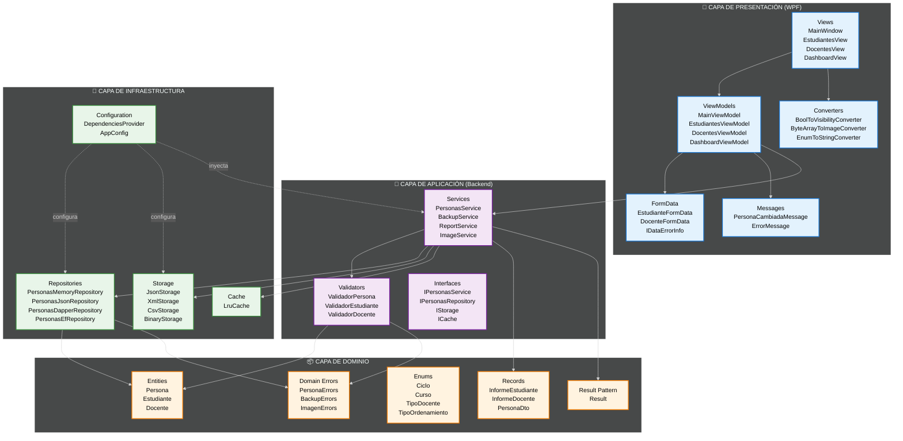

---

#### 🎯 Responsabilidades de cada Capa

| Capa                | Responsabilidad                  | Depende de                | Ejemplos                             |
| ------------------- | -------------------------------- | ------------------------- | ------------------------------------ |
| **Presentación**    | Interacción con el usuario       | Aplicación                | Views, ViewModels, Binding, Comandos |
| **Aplicación**      | Lógica de negocio y orquestación | Dominio + Infraestructura | Servicios, Validadores, Casos de uso |
| **Infraestructura** | Persistencia y acceso a datos    | Dominio                   | Repositorios, Storage, Caché, Config |
| **Dominio**         | Entidades y reglas de negocio    | **Nada** (capa pura)      | Persona, Estudiante, Enums, Errors   |

**⚠️ Importante - Regla de Oro de Clean Architecture:**

> **"Las dependencias fluyen SIEMPRE hacia adentro, nunca hacia afuera"**

Esto significa:
- ✅ El **Dominio** no conoce nada de las demás capas (es puro)
- ✅ La **Aplicación** conoce el Dominio, pero no la Presentación
- ✅ La **Presentación** conoce la Aplicación, pero no la Infraestructura directamente
- ✅ La **Infraestructura** implementa contratos del Dominio

---

### 2.1.2. Diagrama de Componentes (Frontend + Backend)

Este diagrama muestra cómo se comunican los módulos WPF con los servicios backend:

```mermaid
%%{init: {'theme': 'dark', 'themeVariables': {'darkMode': true, 'background': '#1e1e1e', 'primaryColor': '#E3F2FD', 'secondaryColor': '#F3E5F5', 'tertiaryColor': '#E8F5E9', 'quaternaryColor': '#FFF3E0'}}}%%
graph TB
    subgraph FRONTEND["🖥️ FRONTEND WPF"]
        MW[MainWindow]
        MVM[MainViewModel]
        
        subgraph ESTUDIANTES_MODULE["Módulo Estudiantes"]
            EV[EstudiantesView]
            EVM[EstudiantesViewModel]
            EEW[EstudianteEditWindow]
            EEVM[EstudianteEditViewModel]
            EFD[EstudianteFormData]
        end
        
        subgraph DOCENTES_MODULE["Módulo Docentes"]
            DV[DocentesView]
            DVM[DocentesViewModel]
            DEW[DocenteEditWindow]
            DEVM[DocenteEditViewModel]
            DFD[DocenteFormData]
        end
        
        subgraph DASHBOARD_MODULE["Módulo Dashboard"]
            DASHV[DashboardView]
            DASHVM[DashboardViewModel]
        end
        
        MESSENGER[WeakReferenceMessenger]
        DIALOGS[DialogService]
    end
    
    subgraph BACKEND["⚙️ BACKEND SERVICES"]
        PS[PersonasService]
        BS[BackupService]
        RS[ReportService]
        IS[ImageService]
        
        subgraph VALIDATION["Validación"]
            VP[ValidadorPersona]
            VE[ValidadorEstudiante]
            VD[ValidadorDocente]
        end
        
        subgraph DATA_ACCESS["Acceso a Datos"]
            REPO[IPersonasRepository]
            CACHE[LruCache]
            STORAGE[IStorage]
        end
    end
    
    subgraph DOMAIN_LAYER["📦 DOMINIO"]
        PERSONA[Persona]
        EST[Estudiante]
        DOC[Docente]
        RESULT[Result<T, TError>]
    end

    %% Relaciones Frontend
    MW --> MVM
    EV --> EVM
    DV --> DVM
    DASHV --> DASHVM
    EEW --> EEVM
    DEW --> DEVM
    EEVM --> EFD
    DEVM --> DFD
    
    %% ViewModels usan Messenger
    EVM -.->|Send| MESSENGER
    DVM -.->|Send| MESSENGER
    MESSENGER -.->|Receive| DASHVM
    
    %% ViewModels llaman a Servicios
    EVM --> PS
    DVM --> PS
    DASHVM --> PS
    MVM --> BS
    MVM --> RS
    EEVM --> IS
    DEVM --> IS
    
    %% ViewModels usan DialogService
    EVM --> DIALOGS
    DVM --> DIALOGS
    EEVM --> DIALOGS
    DEVM --> DIALOGS
    
    %% Servicios Backend
    PS --> VP
    PS --> VE
    PS --> VD
    PS --> REPO
    PS --> CACHE
    PS --> STORAGE
    BS --> STORAGE
    RS --> PS
    
    %% Validadores validan Entidades
    VP --> PERSONA
    VE --> EST
    VD --> DOC
    
    %% Repositorio gestiona Entidades
    REPO --> PERSONA
    REPO --> EST
    REPO --> DOC
    
    %% Servicios devuelven Result
    PS --> RESULT
    BS --> RESULT
    IS --> RESULT

    %% Estilos
    classDef frontendStyle fill:#E1F5FE,stroke:#0277BD,stroke-width:2px,color:#000
    classDef backendStyle fill:#F3E5F5,stroke:#6A1B9A,stroke-width:2px,color:#000
    classDef domainStyle fill:#FFF9C4,stroke:#F57F17,stroke-width:2px,color:#000
    classDef messengerStyle fill:#FFCCBC,stroke:#BF360C,stroke-width:2px,color:#000

    class MW,MVM,EV,EVM,EEW,EEVM,EFD,DV,DVM,DEW,DEVM,DFD,DASHV,DASHVM,DIALOGS frontendStyle
    class PS,BS,RS,IS,VP,VE,VD,REPO,CACHE,STORAGE backendStyle
    class PERSONA,EST,DOC,RESULT domainStyle
    class MESSENGER messengerStyle
```

---

#### 📊 Flujo de Datos Completo (Ejemplo: Crear Estudiante)

```
1. Usuario click "Nuevo Estudiante" en EstudiantesView
   ↓
2. EstudiantesViewModel.NuevoCommand ejecuta
   ↓
3. Abre EstudianteEditWindow con EstudianteEditViewModel
   ↓
4. Usuario completa EstudianteFormData (validación en tiempo real con IDataErrorInfo)
   ↓
5. Click "Guardar" → EstudianteEditViewModel.GuardarCommand
   ↓
6. FormData.IsValid() → true
   ↓
7. FormData.ToModel() → Estudiante entity
   ↓
8. PersonasService.Create(estudiante)
   ↓
9. ValidadorEstudiante.Validar(estudiante) → Result<Persona, DomainError>
   ↓
10. Repository.Create(estudiante) → Persona guardada
    ↓
11. Cache.Add(id, estudiante)
    ↓
12. Result.Success → CloseAction(true)
    ↓
13. EstudiantesViewModel recibe DialogResult
    ↓
14. LoadEstudiantes() → actualiza ObservableCollection
    ↓
15. WeakReferenceMessenger.Send(new PersonaCambiadaMessage())
    ↓
16. DashboardViewModel.Receive() → LoadStatistics()
    ↓
17. UI actualizada automáticamente (INotifyPropertyChanged)
```

**💡 Para estudiantes:**

Este flujo demuestra **separación perfecta de responsabilidades**:
- **View**: Solo muestra datos y captura eventos
- **ViewModel**: Orquesta la UI (comandos, propiedades observables)
- **FormData**: Valida datos en tiempo real (frontend)
- **Service**: Orquesta la lógica de negocio (backend)
- **Validator**: Valida reglas de negocio (backend)
- **Repository**: Persiste datos
- **Messenger**: Comunica cambios entre ViewModels sin referencias directas

Ninguna capa conoce detalles de implementación de las demás. ¡Eso es Clean Architecture!

---

## 2.2. Arquitectura Backend

### 2.2.1. Sistema de Inyección de Dependencias (DependenciesProvider)

El sistema usa **Microsoft.Extensions.DependencyInjection** para gestionar el ciclo de vida de todos los servicios.

**🎯 ¿Qué problema resuelve?**

Sin DI, cada clase crearía sus propias dependencias:

```csharp
// ❌ MAL: Acoplamiento fuerte
public class PersonasService
{
    private readonly IPersonasRepository _repository = new PersonasMemoryRepository();
    private readonly ICache _cache = new LruCache(100);
    
    // Problema: ¿Cómo cambio a PersonasJsonRepository sin modificar esta clase?
    // Problema: ¿Cómo testeo esto con un repositorio falso?
}
```

Con DI, las dependencias se **inyectan desde fuera**:

```csharp
// ✅ BIEN: Inversión de dependencias
public class PersonasService(
    IPersonasRepository repository,  // ← Inyectado
    ICache<int, Persona> cache,      // ← Inyectado
    IValidador<Persona> validador    // ← Inyectado
)
{
    // Ahora puedo cambiar implementaciones sin tocar esta clase
    // Ahora puedo testear con mocks/fakes
}
```

---

#### Configuración del Contenedor DI

```csharp
public static class DependenciesProvider
{
    public static IServiceProvider BuildServiceProvider()
    {
        var services = new ServiceCollection();
        
        // 1. Registrar Repositorios (Singleton: mantienen estado)
        RegisterRepositories(services);
        
        // 2. Registrar Storages (Transient: nuevos por operación)
        RegisterStorages(services);
        
        // 3. Registrar Servicios (Scoped/Transient según necesidad)
        RegisterServices(services);
        
        return services.BuildServiceProvider();
    }

    private static void RegisterRepositories(IServiceCollection services)
    {
        services.AddSingleton<IPersonasRepository>(sp => {
            var repoType = AppConfig.RepositoryType.ToLower();
            return repoType switch {
                "memory" => new PersonasMemoryRepository(),
                "json" => new PersonasJsonRepository(),
                "dapper" => new PersonasDapperRepository(),
                "efcore" => new PersonasEfRepository(),
                _ => new PersonasMemoryRepository()
            };
        });
    }

    private static void RegisterStorages(IServiceCollection services)
    {
        services.AddTransient<IStorage<Persona>>(sp => {
            var storageType = AppConfig.StorageType.ToLower();
            return storageType switch {
                "json" => new AcademiaJsonStorage(),
                "xml" => new AcademiaXmlStorage(),
                "csv" => new AcademiaCsvStorage(),
                "binary" => new AcademiaBinStorage(),
                _ => new AcademiaJsonStorage()
            };
        });
    }

    private static void RegisterServices(IServiceCollection services)
    {
        // Caché compartida
        services.AddSingleton<ICache<int, Persona>>(sp => 
            new LruCache<int, Persona>(AppConfig.CacheSize));

        // Validadores (sin estado, nuevos por uso)
        services.AddTransient<IValidador<Persona>, ValidadorPersona>();
        services.AddTransient<IValidador<Persona>, ValidadorEstudiante>();
        services.AddTransient<IValidador<Persona>, ValidadorDocente>();

        // Servicios auxiliares
        services.AddTransient<IBackupService, BackupService>();
        services.AddTransient<IReportService, ReportService>();
        services.AddTransient<IImageService, ImageService>();
        services.AddTransient<IDialogService, DialogService>();
        
        // Servicio principal (una instancia por scope)
        services.AddScoped<IPersonasService, PersonasService>();
    }
}
```

---

### 2.2.2. Configuración (appsettings.json)

Toda la configuración del sistema se centraliza en `appsettings.json`:

```json
{
  "Repository": {
    "Type": "Memory",
    "Directory": "data",
    "DropData": false,
    "SeedData": true
  },
  "Storage": {
    "Type": "Json",
    "Directory": "exports"
  },
  "Backup": {
    "Directory": "backups",
    "Format": "Json"
  },
  "Cache": {
    "Enabled": true,
    "Size": 100
  },
  "Images": {
    "Directory": "images",
    "MaxSizeMB": 5,
    "MaxDimensionPx": 4096,
    "AllowedExtensions": [".jpg", ".jpeg", ".png", ".gif", ".bmp"]
  },
  "Reports": {
    "Directory": "reports",
    "OpenInBrowser": true
  },
  "Logging": {
    "File": {
      "Enabled": true,
      "Directory": "logs",
      "RetainDays": 7,
      "Level": "Error"
    }
  },
  "Academia": {
    "NotaAprobado": 5.0
  }
}
```

**💡 Para estudiantes:**

La configuración en JSON permite:
- ✅ Cambiar comportamiento **sin recompilar** (ej: cambiar de Memory a Json)
- ✅ Diferentes configuraciones para **Desarrollo vs. Producción**
- ✅ Configuración **versionada** en Git
- ✅ Validación con esquemas JSON

---

### 2.2.3. Ciclo de Vida de Componentes

Microsoft.Extensions.DependencyInjection ofrece 3 ciclos de vida:

| Ciclo de Vida | Descripción                                 | Cuándo Usar                                           | Ejemplos en el Sistema                        |
| ------------- | ------------------------------------------- | ----------------------------------------------------- | --------------------------------------------- |
| **Singleton** | Una única instancia para toda la aplicación | Componentes con estado compartido o costosos de crear | `IPersonasRepository`, `ICache<int, Persona>` |
| **Scoped**    | Una instancia por scope (request)           | Servicios que mantienen estado durante una operación  | `IPersonasService`                            |
| **Transient** | Nueva instancia cada vez que se solicita    | Servicios sin estado, operaciones únicas              | `IStorage`, `IValidador`, `IBackupService`    |

**🎯 En la práctica:**

```csharp
// SINGLETON: Una sola instancia en toda la app
services.AddSingleton<IPersonasRepository, PersonasMemoryRepository>();
// Resultado: Todos comparten el MISMO Dictionary en memoria

// SCOPED: Una instancia por scope
services.AddScoped<IPersonasService, PersonasService>();
// Resultado: Cada "request" (scope) tiene su propia instancia

// TRANSIENT: Nueva instancia siempre
services.AddTransient<IValidador<Persona>, ValidadorEstudiante>();
// Resultado: Cada validación crea un nuevo validador (sin estado)
```

**⚠️ Importante:**

```csharp
// ❌ PELIGRO: Singleton con estado mutable sin sincronización
services.AddSingleton<MiServicio>(); // Si MiServicio tiene List<T> sin lock = race condition

// ✅ SEGURO: Singleton con estado inmutable o thread-safe
services.AddSingleton<ICache<int, Persona>>(); // Dictionary es thread-safe para lecturas
```

---

### 2.2.4. Diagrama de Arquitectura en Capas del Backend

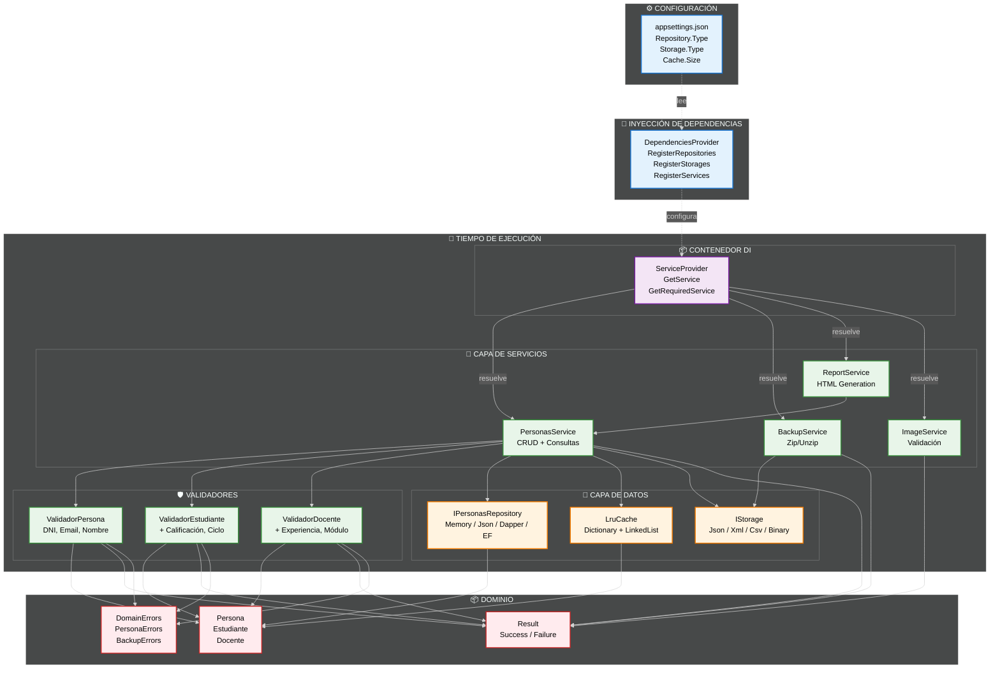

---

## 2.3. Modelo de Dominio

### 2.3.1. Diagrama de Clases del Modelo de Dominio Completo

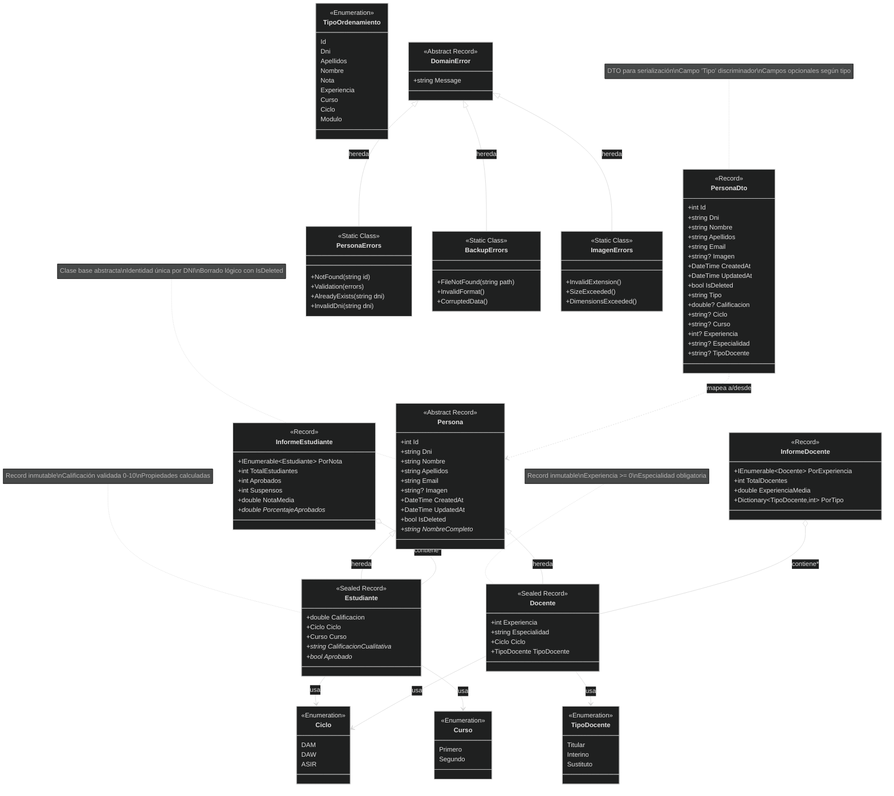

---

### 2.3.2. Entidades (Persona, Estudiante, Docente)

#### Persona (Clase Base Abstracta)

```csharp
public abstract record Persona
{
    public int Id { get; init; }
    public required string Dni { get; init; }
    public required string Nombre { get; init; }
    public required string Apellidos { get; init; }
    public required string Email { get; init; }
    public string? Imagen { get; init; }
    public DateTime CreatedAt { get; init; } = DateTime.Now;
    public DateTime UpdatedAt { get; init; } = DateTime.Now;
    public bool IsDeleted { get; init; } = false;

    // Propiedad calculada
    public string NombreCompleto => $"{Nombre} {Apellidos}";
}
```

**💡 Para estudiantes:**

`abstract record` significa:
- ✅ **Inmutable**: No puedes cambiar valores después de crear (seguridad)
- ✅ **Herencia**: Estudiante y Docente heredan todos estos campos
- ✅ **Abstracta**: No puedes crear instancias directas de Persona (solo de Estudiante/Docente)

**¿Por qué `record` en vez de `class`?**

| Característica            | `class`               | `record`         |
| ------------------------- | --------------------- | ---------------- |
| Inmutabilidad por defecto | ❌ No                  | ✅ Sí             |
| Comparación por valor     | ❌ No (por referencia) | ✅ Sí (por valor) |
| Constructor with          | ❌ No                  | ✅ Sí             |
| ToString automático       | ❌ Básico              | ✅ Completo       |

```csharp
// Con record puedes hacer esto:
var estudiante1 = new Estudiante { Dni = "12345678A", Nombre = "Juan", ... };
var estudiante2 = estudiante1 with { Nombre = "Pedro" }; // Copia con cambio

// Con class necesitarías:
var estudiante2 = new Estudiante {
    Dni = estudiante1.Dni,
    Nombre = "Pedro",
    Apellidos = estudiante1.Apellidos,
    ... // ¡Copiar todos los campos manualmente!
};
```

---

#### Estudiante

```csharp
public sealed record Estudiante : Persona
{
    public required double Calificacion { get; init; }
    public required Ciclo Ciclo { get; init; }
    public required Curso Curso { get; init; }

    // Propiedades calculadas
    public string CalificacionCualitativa => Calificacion switch
    {
        < 5.0 => "Suspenso",
        < 7.0 => "Aprobado",
        < 9.0 => "Notable",
        _ => "Sobresaliente"
    };

    public bool Aprobado => Calificacion >= 5.0;
}
```

**🎯 ¿Por qué `sealed`?**

`sealed` significa que **nadie puede heredar de Estudiante**. Esto cierra la jerarquía:

```
Persona (abstract)
  ├── Estudiante (sealed) ← Fin de rama
  └── Docente (sealed) ← Fin de rama
```

Beneficios:
- ✅ **Claridad**: Sabes que no hay "sub-estudiantes"
- ✅ **Rendimiento**: El compilador puede optimizar mejor
- ✅ **Seguridad**: Evita jerarquías complejas innecesarias

---

#### Docente

```csharp
public sealed record Docente : Persona
{
    public required int Experiencia { get; init; }
    public required string Especialidad { get; init; }
    public required Ciclo Ciclo { get; init; }
    public required TipoDocente TipoDocente { get; init; }
}
```

---

### 2.3.3. Records, Enums y Value Objects

#### Records de Dominio

```csharp
// Record para informes de estudiantes
public record InformeEstudiante
{
    public IEnumerable<Estudiante> PorNota { get; init; } = [];
    public int TotalEstudiantes { get; init; }
    public int Aprobados { get; init; }
    public int Suspensos { get; init; }
    public double NotaMedia { get; init; }
    
    // Propiedad calculada
    public double PorcentajeAprobados => TotalEstudiantes > 0 
        ? (Aprobados * 100.0) / TotalEstudiantes 
        : 0;
}

// Record para informes de docentes
public record InformeDocente
{
    public IEnumerable<Docente> PorExperiencia { get; init; } = [];
    public int TotalDocentes { get; init; }
    public double ExperienciaMedia { get; init; }
    public Dictionary<TipoDocente, int> PorTipo { get; init; } = new();
}

// DTO para serialización
public record PersonaDto(
    int Id,
    string Dni,
    string Nombre,
    string Apellidos,
    string Email,
    string? Imagen,
    DateTime CreatedAt,
    DateTime UpdatedAt,
    bool IsDeleted,
    string Tipo,  // "Estudiante" o "Docente"
    // Campos opcionales según tipo
    double? Calificacion,
    string? Ciclo,
    string? Curso,
    int? Experiencia,
    string? Especialidad,
    string? TipoDocente
);
```

**💡 Para estudiantes - ¿Por qué DTOs?**

Imagina que intentas guardar esto en JSON:

```csharp
public class Estudiante : Persona {
    public Persona Tutor { get; set; } // Referencia circular
    public List<Nota> Notas { get; set; } // Colección compleja
}
```

Problemas:
- ❌ Referencias circulares (Estudiante → Tutor → Estudiante...)
- ❌ Datos innecesarios (¿guardar TODAS las notas cada vez?)
- ❌ Lógica de negocio mezclada con datos

Solución con DTO:

```csharp
public record EstudianteDto(
    int Id,
    string Dni,
    string Nombre,
    // Solo campos simples, sin referencias
);

// Mapper
estudiante.ToDto(); // Modelo → DTO → JSON
dto.ToModel();      // JSON → DTO → Modelo
```

---

#### Enumeraciones

```csharp
public enum Ciclo
{
    DAM,   // Desarrollo de Aplicaciones Multiplataforma
    DAW,   // Desarrollo de Aplicaciones Web
    ASIR   // Administración de Sistemas Informáticos en Red
}

public enum Curso
{
    Primero,
    Segundo
}

public enum TipoDocente
{
    Titular,    // Plantilla fija del centro
    Interino,   // Temporal con plaza asignada
    Sustituto   // Temporal sin plaza
}

public enum TipoOrdenamiento
{
    Id,
    Dni,
    Apellidos,
    Nombre,
    Nota,          // Solo aplicable a Estudiante
    Experiencia,   // Solo aplicable a Docente
    Curso,         // Solo aplicable a Estudiante
    Ciclo,
    Modulo         // Solo aplicable a Docente
}
```

---

### 2.3.4. Propiedades Calculadas

Las propiedades calculadas se computan en tiempo de lectura **sin almacenarse**:

```csharp
// ✅ BIEN: Propiedad calculada
public string NombreCompleto => $"{Nombre} {Apellidos}";
// Ventaja: Siempre consistente, no ocupa espacio en BD

// ❌ MAL: Campo almacenado
public string NombreCompleto { get; set; }
// Problema: Puede quedar desincronizado si cambias Nombre/Apellidos
```

**Ejemplo completo en Estudiante:**

```csharp
public sealed record Estudiante : Persona
{
    // Campos almacenados
    public required double Calificacion { get; init; }
    
    // Propiedades calculadas (no se almacenan)
    public string CalificacionCualitativa => Calificacion switch
    {
        < 5.0 => "Suspenso",
        < 7.0 => "Aprobado",
        < 9.0 => "Notable",
        _ => "Sobresaliente"
    };
    
    public bool Aprobado => Calificacion >= 5.0;
}
```

**🎯 Cuándo usar cada una:**

| Tipo                    | Cuándo Usar                                 | Ejemplo                                                 |
| ----------------------- | ------------------------------------------- | ------------------------------------------------------- |
| **Campo almacenado**    | Datos introducidos por el usuario o sistema | `Nombre`, `Dni`, `Calificacion`                         |
| **Propiedad calculada** | Valores derivados de otros campos           | `NombreCompleto`, `Aprobado`, `CalificacionCualitativa` |

---

### 2.3.5. Restricciones de Integridad

Las restricciones se implementan en **múltiples capas** para máxima seguridad:

#### Restricciones en el Dominio (Entidades)

```csharp
// Restricción: Calificación debe estar en rango 0-10
public sealed record Estudiante : Persona
{
    private double _calificacion;
    
    public required double Calificacion
    {
        get => _calificacion;
        init => _calificacion = value is >= 0 and <= 10
            ? value
            : throw new ArgumentException("Calificación debe estar entre 0 y 10");
    }
}
```

**⚠️ Problema:** Esto lanza excepciones. Mejor usar validadores.

---

#### Restricciones en Validadores (Backend)

```csharp
public class ValidadorEstudiante : IValidador<Persona>
{
    public Result<Persona, DomainError> Validar(Persona persona)
    {
        if (persona is not Estudiante est)
            return Result.Failure<Persona, DomainError>(
                PersonaErrors.Validation(["No es un estudiante"]));

        var errores = new List<string>();

        // Restricción: Calificación 0-10
        if (est.Calificacion is < 0 or > 10)
            errores.Add("La calificación debe estar entre 0.0 y 10.0");

        // Restricción: Nombre mínimo 2 caracteres
        if (est.Nombre.Length < 2)
            errores.Add("El nombre debe tener al menos 2 caracteres");

        return errores.Count > 0
            ? Result.Failure<Persona, DomainError>(PersonaErrors.Validation(errores))
            : Result.Success<Persona, DomainError>(persona);
    }
}
```

---

#### Restricciones en FormData (Frontend)

```csharp
public class EstudianteFormData : IDataErrorInfo
{
    public double Calificacion { get; set; }

    public string this[string columnName]
    {
        get
        {
            return columnName switch
            {
                nameof(Calificacion) when Calificacion is < 0 or > 10
                    => "La calificación debe estar entre 0 y 10",
                _ => string.Empty
            };
        }
    }
}
```

---

#### Tabla Resumen de Restricciones

| Restricción         | Capa Dominio | Capa Validador | Capa FormData      | Base de Datos      |
| ------------------- | ------------ | -------------- | ------------------ | ------------------ |
| DNI único global    | ❌            | ✅ (Repository) | ❌                  | ✅ (Unique Index)   |
| Email único activos | ❌            | ✅ (Repository) | ❌                  | ✅ (Filtered Index) |
| DNI formato válido  | ❌            | ✅ (Regex)      | ✅ (IDataErrorInfo) | ❌                  |
| Calificación 0-10   | ❌            | ✅              | ✅                  | ✅ (Check)          |
| Experiencia >= 0    | ❌            | ✅              | ✅                  | ✅ (Check)          |
| Nombre >= 2 chars   | ❌            | ✅              | ✅                  | ❌                  |

**💡 Para estudiantes - Defensa en profundidad:**

Validamos en **múltiples capas** porque:
1. **Frontend (FormData)**: Feedback inmediato al usuario
2. **Backend (Validadores)**: Seguridad (el frontend puede bypassearse)
3. **Base de Datos**: Última línea de defensa (constraints SQL)

Es como un castillo medieval: **múltiples murallas** 🏰

---

## 2.4. Gestión de Errores

### 2.4.1. Patrón Result<T, TError>

El sistema usa `CSharpFunctionalExtensions.Result<T, TError>` para representar operaciones que pueden fallar **sin lanzar excepciones**.

**🎯 ¿Qué problema resuelve?**

Imagina que estás pidiendo un libro en una biblioteca:

```csharp
// ❌ ENFOQUE TRADICIONAL: Excepciones
public Libro GetLibro(string isbn)
{
    var libro = _catalogo.Find(isbn);
    if (libro == null)
        throw new LibroNoEncontradoException(isbn); // 💥 Explota
    
    return libro;
}

// Problema: ¿Cómo sé que puede lanzar excepción?
// Problema: try/catch para FLUJO NORMAL (libro no existe es normal, no excepcional)
```

```csharp
// ✅ ENFOQUE FUNCIONAL: Result
public Result<Libro, BibliotecaError> GetLibro(string isbn)
{
    var libro = _catalogo.Find(isbn);
    return libro != null
        ? Result.Success<Libro, BibliotecaError>(libro)
        : Result.Failure<Libro, BibliotecaError>(BibliotecaErrors.LibroNoEncontrado(isbn));
}

// Ventaja: La firma del método DICE que puede fallar
// Ventaja: El compilador te OBLIGA a manejar ambos casos
```

---

#### Uso en el Sistema

```csharp
// Servicio devuelve Result
public Result<Persona, DomainError> GetById(int id)
{
    // Patrón is {} - Más moderno que != null
    if (cache.Get(id) is {} cached)
        return Result.Success<Persona, DomainError>(cached);  // HIT

    if (repository.GetById(id) is {} persona)
    {
        cache.Add(id, persona);  // MISS
        return Result.Success<Persona, DomainError>(persona);
    }
    
    return Result.Failure<Persona, DomainError>(PersonaErrors.NotFound(id.ToString()));
}

// ViewModel consume con Match
service.GetById(id).Match(
    onSuccess: persona => MostrarPersona(persona),
    onFailure: error => MostrarError(error.Message)
);
```

**💡 Para estudiantes:**

`Result` es como un **sobre** que contiene:
- ✅ **Success**: El valor que pediste (Persona)
- ❌ **Failure**: El error que pasó (PersonaErrors.NotFound)

Y el sobre **siempre** dice qué contiene (no hay sorpresas):

```csharp
Result<Persona, DomainError> resultado = service.GetById(5);

// El compilador te OBLIGA a abrir el sobre y ver qué hay:
resultado.Match(
    onSuccess: persona => { /* Tengo la persona */ },
    onFailure: error => { /* Tengo el error */ }
);
```

---

### 2.4.2. Jerarquía de Errores de Dominio

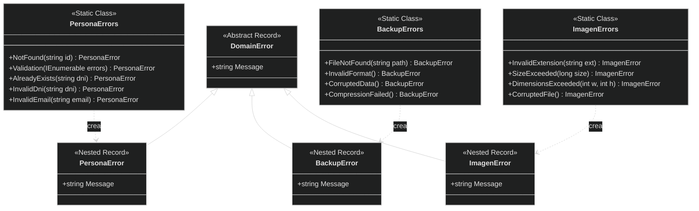

---

#### Implementación

```csharp
// Clase base abstracta
public abstract record DomainError(string Message);

// Errores de Persona (anidados en clase estática)
public static class PersonaErrors
{
    public record NotFound(string Id) : DomainError($"Persona con ID '{Id}' no encontrada");
    
    public record Validation(IEnumerable<string> Errors) 
        : DomainError($"Errores de validación: {string.Join(", ", Errors)}");
    
    public record AlreadyExists(string Dni) 
        : DomainError($"Ya existe una persona con DNI '{Dni}'");
    
    public record InvalidDni(string Dni) 
        : DomainError($"DNI inválido: '{Dni}'");
    
    public record InvalidEmail(string Email) 
        : DomainError($"Email inválido: '{Email}'");
}

// Errores de Backup
public static class BackupErrors
{
    public record FileNotFound(string Path) 
        : DomainError($"Archivo de backup no encontrado: '{Path}'");
    
    public record InvalidFormat() 
        : DomainError("El formato del archivo de backup es inválido");
    
    public record CorruptedData() 
        : DomainError("Los datos del backup están corruptos");
    
    public record CompressionFailed() 
        : DomainError("Error al comprimir el backup");
}

// Errores de Imagen
public static class ImagenErrors
{
    public record InvalidExtension(string Extension) 
        : DomainError($"Extensión '{Extension}' no permitida. Use: .jpg, .png, .gif, .bmp");
    
    public record SizeExceeded(long SizeMB) 
        : DomainError($"Tamaño de {SizeMB}MB excede el máximo de 5MB");
    
    public record DimensionsExceeded(int Width, int Height) 
        : DomainError($"Dimensiones {Width}x{Height} exceden el máximo de 4096x4096");
    
    public record CorruptedFile() 
        : DomainError("El archivo de imagen está corrupto o no es válido");
}
```

**🎯 Ventajas de esta estructura:**

| Ventaja                   | Descripción                       | Ejemplo                                         |
| ------------------------- | --------------------------------- | ----------------------------------------------- |
| **Semántica clara**       | Sabes exactamente qué falló       | `PersonaErrors.NotFound` vs. genérico "Error"   |
| **Type-safe**             | El compilador te ayuda            | Autocomplete muestra todos los errores posibles |
| **Agrupación lógica**     | Errores relacionados juntos       | Todo de Persona en `PersonaErrors`              |
| **Mensajes consistentes** | El error genera su propio mensaje | No hay que recordar formatear el mensaje        |

---

### 2.4.3. Railway Oriented Programming

**🎯 La Metáfora del Tren:**

Imagina que las operaciones son vagones de un tren:
- ✅ **Vía del éxito**: Todo funciona, el tren avanza
- ❌ **Vía del error**: Algo falla, el tren se desvía y **ya no vuelve a la vía del éxito**

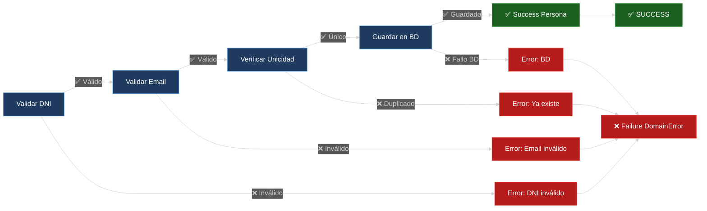

---

#### Implementación en el Código

```csharp
public Result<Persona, DomainError> Create(Persona persona)
{
    return ValidarPersona(persona)                    // ¿Es válida?
        .Ensure(p => !ExisteDni(p.Dni),               // ¿DNI único?
                PersonaErrors.AlreadyExists(persona.Dni))
        .Ensure(p => !ExisteEmailActivo(p.Email),     // ¿Email único entre activos?
                PersonaErrors.AlreadyExists(persona.Email))
        .Map(p => repository.Create(p)!);             // Guardar
}
```

**💡 Para estudiantes - Desglose paso a paso:**

```csharp
// PASO 1: Validar
Result<Persona, DomainError> resultado = ValidarPersona(persona);
// Si falla → return Failure(ValidationError)
// Si OK → continúa con Persona válida

// PASO 2: Ensure - Verificar condición
resultado = resultado.Ensure(
    p => !ExisteDni(p.Dni),                    // Condición: DNI no debe existir
    PersonaErrors.AlreadyExists(persona.Dni)   // Error si falla
);
// Si falla → return Failure(AlreadyExists)
// Si OK → continúa

// PASO 3: Map - Transformar el valor
resultado = resultado.Map(p => repository.Create(p)!);
// Solo se ejecuta si todo lo anterior fue Success
// Transforma Persona validada → Persona guardada

// RESULTADO FINAL:
// ✅ Success<Persona> - Todo OK, persona guardada
// ❌ Failure<ValidationError> - Falló validación
// ❌ Failure<AlreadyExists> - DNI duplicado
```

---

#### Métodos de Result

| Método     | Firma                                       | Cuándo Usar                             | Ejemplo                                                  |
| ---------- | ------------------------------------------- | --------------------------------------- | -------------------------------------------------------- |
| **Map**    | `Result<T> → (T → U) → Result<U>`           | Transformar el valor de éxito           | `result.Map(p => p.ToDto())`                             |
| **Bind**   | `Result<T> → (T → Result<U>) → Result<U>`   | Encadenar operaciones que pueden fallar | `result.Bind(p => Save(p))`                              |
| **Ensure** | `Result<T> → (T → bool, Error) → Result<T>` | Verificar condiciones                   | `result.Ensure(p => p.Edad >= 18, new MenorEdadError())` |
| **Match**  | `Result<T> → (T → R, Error → R) → R`        | Consumir el resultado                   | `result.Match(onSuccess, onFailure)`                     |

---

### 2.4.4. Cuándo usar Result vs. IEnumerable

**❓ ¿Por qué `GetAll()` devuelve `IEnumerable` y `GetById()` devuelve `Result`?**

| Operación             | Retorno                        | Razón                                        |
| --------------------- | ------------------------------ | -------------------------------------------- |
| `GetAll()`            | `IEnumerable<Persona>`         | **Nunca falla**: lista vacía si no hay datos |
| `GetById(id)`         | `Result<Persona, DomainError>` | **Puede fallar**: el ID puede no existir     |
| `Create(persona)`     | `Result<Persona, DomainError>` | **Puede fallar**: validación, DNI duplicado  |
| `Update(id, persona)` | `Result<Persona, DomainError>` | **Puede fallar**: ID no existe, validación   |
| `Delete(id)`          | `Result<Persona, DomainError>` | **Puede fallar**: ID no existe               |

**💡 El Principio:**

> **"Si una operación siempre va a tener éxito (aunque sea con resultado vacío), no necesita Result."**

```csharp
// ✅ BIEN: GetAll siempre tiene éxito
public IEnumerable<Persona> GetAll()
{
    return repository.GetAll(); // Devuelve [] si está vacío
}

// ❌ MAL: GetAll con Result innecesario
public Result<IEnumerable<Persona>, DomainError> GetAll()
{
    return Result.Success<IEnumerable<Persona>, DomainError>(repository.GetAll());
    // Complejidad innecesaria: nunca va a fallar
}

// ✅ BIEN: GetById puede fallar
public Result<Persona, DomainError> GetById(int id)
{
    var persona = repository.GetById(id);
    return persona != null
        ? Result.Success<Persona, DomainError>(persona)
        : Result.Failure<Persona, DomainError>(PersonaErrors.NotFound(id.ToString()));
}
```

---

### 2.4.5. Diagrama de Flujo: Railway Oriented Programming

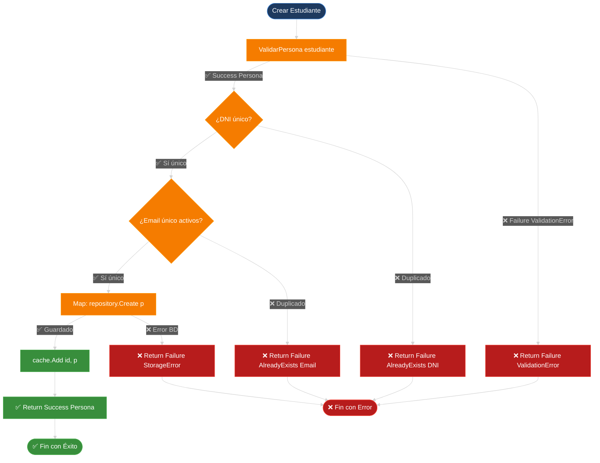

**🎯 Clave del Railway:**

Una vez que entras en la **vía del error** (cualquier Failure), **ya no sales**:
- ❌ Failure → Ensure → **salta Ensure** → sigue Failure
- ❌ Failure → Map → **salta Map** → sigue Failure
- ✅ Success → Ensure/Map → **ejecuta** → puede ser Success o Failure

Es como un **circuito corto eléctrico**: en cuanto hay un error, se corta todo y devuelve el error directamente.

---

# 3. Capa de Datos (Backend)

La **Capa de Datos** es el corazón del sistema de persistencia. Gestiona el almacenamiento, recuperación y manipulación de datos mediante tres pilares fundamentales:

1. **Repositorios**: Persistencia principal del sistema entre ejecuciones
2. **Storage**: Importación/Exportación de datos en múltiples formatos
3. **Caché**: Optimización de lecturas frecuentes con LRU

---

## 3.1. Repositorios (Persistencia Principal)

Los repositorios implementan el **patrón Repository**, que abstrae el acceso a datos y permite cambiar la estrategia de persistencia sin modificar la lógica de negocio.

### 3.1.1. Interfaz IPersonasRepository

Define el contrato común que todas las implementaciones deben cumplir:

```csharp
public interface IPersonasRepository : ICrudRepository<int, Persona>
{
    // CRUD Básico heredado de ICrudRepository<TKey, TEntity>
    // Persona? GetById(int id);
    // IEnumerable<Persona> GetAll();
    // Persona? Create(Persona entity);
    // Persona? Update(int id, Persona entity);
    // Persona? Delete(int id);
    
    // Métodos específicos del dominio
    Persona? GetByDni(string dni);
    bool ExisteDni(string dni);
    bool DeleteAll();
    
    // Paginación y filtrado
    IEnumerable<Persona> GetAll(int page = 1, int size = int.MaxValue, EstadoRegistro estado = EstadoRegistro.Activos);
}
```

**Enum EstadoRegistro:**
```csharp
public enum EstadoRegistro
{
    Activos,     // Solo registros con IsDeleted = false
    Historial,   // Solo registros con IsDeleted = true
    Todos        // Todos los registros sin filtro
}
```

---

### 3.1.2. PersonasMemoryRepository (Dictionary en RAM)

Implementación más simple: almacena todo en memoria usando un `Dictionary<int, Persona>`.

**Características:**
- ✅ Búsqueda O(1) por ID
- ✅ Ideal para desarrollo y testing
- ❌ Los datos se pierden al cerrar la aplicación

```csharp
public class PersonasMemoryRepository : IPersonasRepository
{
    private readonly Dictionary<int, Persona> _diccionario = new();
    private int _nextId = 1;
    private readonly ILogger _logger = Log.ForContext<PersonasMemoryRepository>();
    
    public PersonasMemoryRepository() : this(AppConfig.DropData, AppConfig.SeedData) { }

    private PersonasMemoryRepository(bool dropData, bool seedData)
    {
        if (dropData) _diccionario.Clear();
        if (seedData) SeedData();
    }

    public Persona? GetById(int id)
    {
        _logger.Debug("Buscando persona con ID: {Id}", id);
        return _diccionario.TryGetValue(id, out var persona) ? persona : null;
    }

    public Persona? GetByDni(string dni)
    {
        _logger.Debug("Buscando persona con DNI: {Dni}", dni);
        return _diccionario.Values.FirstOrDefault(p => p.Dni == dni);
    }

    public bool ExisteDni(string dni)
    {
        // CLAVE: Busca en TODOS los registros (activos + historial)
        // para evitar duplicados incluso tras eliminación lógica
        return _diccionario.Values.Any(p => p.Dni == dni);
    }

    public IEnumerable<Persona> GetAll(int page = 1, int size = int.MaxValue, 
                                       EstadoRegistro estado = EstadoRegistro.Activos)
    {
        _logger.Debug("Obteniendo todas las personas - Página: {Page}, Tamaño: {Size}, Estado: {Estado}", 
                      page, size, estado);
        
        var query = _diccionario.Values.AsEnumerable();
        
        // Filtro por estado
        query = estado switch
        {
            EstadoRegistro.Activos => query.Where(p => !p.IsDeleted),
            EstadoRegistro.Historial => query.Where(p => p.IsDeleted),
            EstadoRegistro.Todos => query,
            _ => query.Where(p => !p.IsDeleted)
        };
        
        // Paginación
        return query
            .Skip((page - 1) * size)
            .Take(size);
    }

    public Persona? Create(Persona entity)
    {
        _logger.Debug("Creando nueva persona: {Dni}", entity.Dni);
        
        // Verificar DNI único (incluso en historial)
        if (ExisteDni(entity.Dni))
        {
            _logger.Warning("DNI duplicado: {Dni}", entity.Dni);
            return null;
        }
        
        // Asignar ID y metadatos
        var persona = entity with 
        { 
            Id = _nextId++, 
            CreatedAt = DateTime.Now,
            UpdatedAt = DateTime.Now,
            IsDeleted = false
        };
        
        _diccionario[persona.Id] = persona;
        _logger.Information("Persona creada: ID={Id}, DNI={Dni}", persona.Id, persona.Dni);
        return persona;
    }

    public Persona? Update(int id, Persona entity)
    {
        _logger.Debug("Actualizando persona ID: {Id}", id);
        
        if (!_diccionario.TryGetValue(id, out var actual))
        {
            _logger.Warning("Persona no encontrada: ID={Id}", id);
            return null;
        }
        
        // Mantener CreatedAt original, actualizar UpdatedAt
        var actualizada = entity with 
        { 
            Id = id,
            CreatedAt = actual.CreatedAt,
            UpdatedAt = DateTime.Now
        };
        
        _diccionario[id] = actualizada;
        _logger.Information("Persona actualizada: ID={Id}", id);
        return actualizada;
    }

    public Persona? Delete(int id)
    {
        _logger.Debug("Eliminando persona ID: {Id}", id);
        
        if (!_diccionario.TryGetValue(id, out var persona))
        {
            _logger.Warning("Persona no encontrada: ID={Id}", id);
            return null;
        }
        
        // Borrado LÓGICO: marcar IsDeleted = true
        var eliminada = persona with 
        { 
            IsDeleted = true,
            UpdatedAt = DateTime.Now
        };
        
        _diccionario[id] = eliminada;
        _logger.Information("Persona marcada como eliminada: ID={Id}, DNI={Dni}", id, persona.Dni);
        return eliminada;
    }

    public bool DeleteAll()
    {
        _logger.Warning("Eliminando TODAS las personas del repositorio");
        _diccionario.Clear();
        _nextId = 1;
        return true;
    }

    private void SeedData()
    {
        _logger.Information("Cargando datos de prueba en el repositorio");
        
        Create(new Estudiante
        {
            Dni = "12345678A",
            Nombre = "Ana",
            Apellidos = "García López",
            Calificacion = 8.5,
            Ciclo = Ciclo.DAW,
            Curso = Curso.Segundo
        });
        
        Create(new Docente
        {
            Dni = "87654321B",
            Nombre = "Carlos",
            Apellidos = "Martínez Ruiz",
            Experiencia = 15,
            Especialidad = Modulos.Programacion,
            Ciclo = Ciclo.DAM
        });
        
        _logger.Information("Datos de prueba cargados: {Count} registros", _diccionario.Count);
    }
}
```

**Punto Clave:** `ExisteDni()` busca en **TODOS** los registros (activos + historial) para garantizar unicidad absoluta del DNI.

---

### 3.1.3. PersonasJsonRepository (Archivo JSON)

Persiste los datos en un archivo JSON usando `System.Text.Json`.

**Características:**
- ✅ Formato legible y estándar
- ✅ Persistencia duradera
- ✅ Fácil de depurar
- ❌ Menos eficiente que binario para grandes volúmenes

```csharp
public class PersonasJsonRepository : IPersonasRepository
{
    private readonly string _filePath;
    private readonly Dictionary<int, Persona> _diccionario = new();
    private int _nextId = 1;
    private readonly ILogger _logger = Log.ForContext<PersonasJsonRepository>();
    
    public PersonasJsonRepository()
    {
        _filePath = Path.Combine(AppConfig.RepositoryDirectory, "academia.json");
        Directory.CreateDirectory(AppConfig.RepositoryDirectory);
        
        if (File.Exists(_filePath))
        {
            LoadFromFile();
        }
        else if (AppConfig.SeedData)
        {
            SeedData();
            SaveToFile();
        }
    }

    // Métodos CRUD idénticos a PersonasMemoryRepository
    // pero cada operación de escritura llama a SaveToFile()

    public Persona? Create(Persona entity)
    {
        // ... misma lógica que Memory ...
        
        _diccionario[persona.Id] = persona;
        SaveToFile(); // ← PERSISTENCIA AUTOMÁTICA
        return persona;
    }

    public Persona? Update(int id, Persona entity)
    {
        // ... misma lógica que Memory ...
        
        _diccionario[id] = actualizada;
        SaveToFile(); // ← PERSISTENCIA AUTOMÁTICA
        return actualizada;
    }

    public Persona? Delete(int id)
    {
        // ... misma lógica que Memory ...
        
        _diccionario[id] = eliminada;
        SaveToFile(); // ← PERSISTENCIA AUTOMÁTICA
        return eliminada;
    }

    private void LoadFromFile()
    {
        _logger.Debug("Cargando datos desde: {FilePath}", _filePath);
        
        try
        {
            var json = File.ReadAllText(_filePath);
            var dtos = JsonSerializer.Deserialize<List<PersonaDto>>(json);
            
            if (dtos == null || dtos.Count == 0)
            {
                _logger.Warning("Archivo JSON vacío o inválido");
                return;
            }
            
            _diccionario.Clear();
            foreach (var dto in dtos)
            {
                var persona = dto.ToModel();
                _diccionario[persona.Id] = persona;
                if (persona.Id >= _nextId) _nextId = persona.Id + 1;
            }
            
            _logger.Information("Datos cargados: {Count} personas", _diccionario.Count);
        }
        catch (Exception ex)
        {
            _logger.Error(ex, "Error al cargar datos desde JSON");
        }
    }

    private void SaveToFile()
    {
        _logger.Debug("Guardando datos en: {FilePath}", _filePath);
        
        try
        {
            var dtos = _diccionario.Values.Select(p => p.ToDto()).ToList();
            var options = new JsonSerializerOptions { WriteIndented = true };
            var json = JsonSerializer.Serialize(dtos, options);
            
            File.WriteAllText(_filePath, json);
            _logger.Information("Datos guardados: {Count} personas", dtos.Count);
        }
        catch (Exception ex)
        {
            _logger.Error(ex, "Error al guardar datos en JSON");
        }
    }
}
```

**Patrón:** Cada operación de escritura (Create/Update/Delete) llama automáticamente a `SaveToFile()` para garantizar persistencia inmediata.

---

### 3.1.4. PersonasDapperRepository (SQLite con Dapper)

Accede a SQLite usando **Dapper**, un micro-ORM que combina velocidad de ADO.NET con comodidad de mapeo automático.

**Características:**
- ✅ Muy rápido (casi como ADO.NET puro)
- ✅ Poco código repetitivo
- ✅ SQL puro (control total)
- ❌ Necesitas escribir las queries manualmente

```csharp
public class PersonasDapperRepository : IPersonasRepository
{
    private readonly string _connectionString;
    private readonly ILogger _logger = Log.ForContext<PersonasDapperRepository>();
    
    public PersonasDapperRepository()
    {
        var dbPath = Path.Combine(AppConfig.RepositoryDirectory, "academia.db");
        Directory.CreateDirectory(AppConfig.RepositoryDirectory);
        
        _connectionString = $"Data Source={dbPath};Version=3;";
        
        CreateTableIfNotExists();
        
        if (AppConfig.SeedData && GetAll().Count() == 0)
        {
            SeedData();
        }
    }

    private void CreateTableIfNotExists()
    {
        using var connection = new SQLiteConnection(_connectionString);
        connection.Open();
        
        var sql = @"
            CREATE TABLE IF NOT EXISTS Personas (
                Id INTEGER PRIMARY KEY AUTOINCREMENT,
                Dni TEXT NOT NULL UNIQUE,
                Nombre TEXT NOT NULL,
                Apellidos TEXT NOT NULL,
                Tipo TEXT NOT NULL,
                Calificacion REAL,
                Ciclo TEXT,
                Curso TEXT,
                Experiencia INTEGER,
                Especialidad TEXT,
                CreatedAt TEXT NOT NULL,
                UpdatedAt TEXT NOT NULL,
                IsDeleted INTEGER NOT NULL DEFAULT 0
            );
            
            CREATE INDEX IF NOT EXISTS idx_dni ON Personas(Dni);
            CREATE INDEX IF NOT EXISTS idx_tipo ON Personas(Tipo);
            CREATE INDEX IF NOT EXISTS idx_deleted ON Personas(IsDeleted);
        ";
        
        connection.Execute(sql);
        _logger.Information("Tabla Personas creada o verificada");
    }

    public Persona? GetById(int id)
    {
        _logger.Debug("Buscando persona con ID: {Id}", id);
        
        using var connection = new SQLiteConnection(_connectionString);
        
        var sql = "SELECT * FROM Personas WHERE Id = @Id";
        var entity = connection.QueryFirstOrDefault<PersonaEntity>(sql, new { Id = id });
        
        return entity?.ToModel();
    }

    public Persona? GetByDni(string dni)
    {
        _logger.Debug("Buscando persona con DNI: {Dni}", dni);
        
        using var connection = new SQLiteConnection(_connectionString);
        
        var sql = "SELECT * FROM Personas WHERE Dni = @Dni";
        var entity = connection.QueryFirstOrDefault<PersonaEntity>(sql, new { Dni = dni });
        
        return entity?.ToModel();
    }

    public bool ExisteDni(string dni)
    {
        using var connection = new SQLiteConnection(_connectionString);
        
        // CLAVE: Busca en TODOS los registros (IsDeleted = 0 OR 1)
        var sql = "SELECT COUNT(*) FROM Personas WHERE Dni = @Dni";
        var count = connection.ExecuteScalar<int>(sql, new { Dni = dni });
        
        return count > 0;
    }

    public IEnumerable<Persona> GetAll(int page = 1, int size = int.MaxValue, 
                                       EstadoRegistro estado = EstadoRegistro.Activos)
    {
        _logger.Debug("Obteniendo todas las personas - Página: {Page}, Estado: {Estado}", page, estado);
        
        using var connection = new SQLiteConnection(_connectionString);
        
        var whereClause = estado switch
        {
            EstadoRegistro.Activos => "WHERE IsDeleted = 0",
            EstadoRegistro.Historial => "WHERE IsDeleted = 1",
            EstadoRegistro.Todos => "",
            _ => "WHERE IsDeleted = 0"
        };
        
        var sql = $@"
            SELECT * FROM Personas 
            {whereClause}
            ORDER BY Id
            LIMIT @Size OFFSET @Offset
        ";
        
        var entities = connection.Query<PersonaEntity>(sql, new 
        { 
            Size = size, 
            Offset = (page - 1) * size 
        });
        
        return entities.Select(e => e.ToModel()).ToList();
    }

    public Persona? Create(Persona entity)
    {
        _logger.Debug("Creando nueva persona: {Dni}", entity.Dni);
        
        if (ExisteDni(entity.Dni))
        {
            _logger.Warning("DNI duplicado: {Dni}", entity.Dni);
            return null;
        }
        
        using var connection = new SQLiteConnection(_connectionString);
        
        var personaEntity = entity.ToEntity() with
        {
            CreatedAt = DateTime.Now,
            UpdatedAt = DateTime.Now,
            IsDeleted = false
        };
        
        var sql = @"
            INSERT INTO Personas (Dni, Nombre, Apellidos, Tipo, Calificacion, Ciclo, Curso, 
                                  Experiencia, Especialidad, CreatedAt, UpdatedAt, IsDeleted)
            VALUES (@Dni, @Nombre, @Apellidos, @Tipo, @Calificacion, @Ciclo, @Curso,
                    @Experiencia, @Especialidad, @CreatedAt, @UpdatedAt, @IsDeleted);
            SELECT last_insert_rowid();
        ";
        
        var id = connection.ExecuteScalar<int>(sql, personaEntity);
        
        _logger.Information("Persona creada: ID={Id}, DNI={Dni}", id, entity.Dni);
        
        return GetById(id);
    }

    public Persona? Update(int id, Persona entity)
    {
        _logger.Debug("Actualizando persona ID: {Id}", id);
        
        var actual = GetById(id);
        if (actual == null)
        {
            _logger.Warning("Persona no encontrada: ID={Id}", id);
            return null;
        }
        
        using var connection = new SQLiteConnection(_connectionString);
        
        var personaEntity = entity.ToEntity() with
        {
            Id = id,
            CreatedAt = actual.CreatedAt,
            UpdatedAt = DateTime.Now
        };
        
        var sql = @"
            UPDATE Personas
            SET Dni = @Dni, Nombre = @Nombre, Apellidos = @Apellidos, Tipo = @Tipo,
                Calificacion = @Calificacion, Ciclo = @Ciclo, Curso = @Curso,
                Experiencia = @Experiencia, Especialidad = @Especialidad,
                UpdatedAt = @UpdatedAt, IsDeleted = @IsDeleted
            WHERE Id = @Id
        ";
        
        connection.Execute(sql, personaEntity);
        _logger.Information("Persona actualizada: ID={Id}", id);
        
        return GetById(id);
    }

    public Persona? Delete(int id)
    {
        _logger.Debug("Eliminando persona ID: {Id}", id);
        
        var persona = GetById(id);
        if (persona == null)
        {
            _logger.Warning("Persona no encontrada: ID={Id}", id);
            return null;
        }
        
        using var connection = new SQLiteConnection(_connectionString);
        
        // Borrado LÓGICO
        var sql = @"
            UPDATE Personas
            SET IsDeleted = 1, UpdatedAt = @UpdatedAt
            WHERE Id = @Id
        ";
        
        connection.Execute(sql, new { Id = id, UpdatedAt = DateTime.Now });
        _logger.Information("Persona marcada como eliminada: ID={Id}", id);
        
        return GetById(id);
    }

    public bool DeleteAll()
    {
        _logger.Warning("Eliminando TODAS las personas del repositorio");
        
        using var connection = new SQLiteConnection(_connectionString);
        connection.Execute("DELETE FROM Personas");
        
        return true;
    }
}
```

**Ventajas de Dapper:**
- Mapeo automático de resultados a objetos
- Parámetros con objetos anónimos: `new { Id = id }`
- Menos código que ADO.NET puro
- Performance casi idéntica a ADO.NET

---

### 3.1.5. PersonasEfRepository (Entity Framework Core)

Accede a SQLite usando **Entity Framework Core**, el ORM oficial de Microsoft.

**Características:**
- ✅ Abstracción total (no SQL manual)
- ✅ Migrations automáticas
- ✅ LINQ to Entities
- ❌ Más lento que Dapper/ADO.NET
- ❌ Curva de aprendizaje

```csharp
public class PersonasEfRepository : IPersonasRepository
{
    private readonly AcademiaDbContext _context;
    private readonly ILogger _logger = Log.ForContext<PersonasEfRepository>();
    
    public PersonasEfRepository()
    {
        var dbPath = Path.Combine(AppConfig.RepositoryDirectory, "academia-ef.db");
        Directory.CreateDirectory(AppConfig.RepositoryDirectory);
        
        var options = new DbContextOptionsBuilder<AcademiaDbContext>()
            .UseSqlite($"Data Source={dbPath}")
            .Options;
        
        _context = new AcademiaDbContext(options);
        _context.Database.EnsureCreated();
        
        if (AppConfig.SeedData && !_context.Personas.Any())
        {
            SeedData();
        }
    }

    public Persona? GetById(int id)
    {
        _logger.Debug("Buscando persona con ID: {Id}", id);
        
        var entity = _context.Personas.Find(id);
        return entity?.ToModel();
    }

    public Persona? GetByDni(string dni)
    {
        _logger.Debug("Buscando persona con DNI: {Dni}", dni);
        
        var entity = _context.Personas.FirstOrDefault(p => p.Dni == dni);
        return entity?.ToModel();
    }

    public bool ExisteDni(string dni)
    {
        // CLAVE: Busca en TODOS los registros
        return _context.Personas.Any(p => p.Dni == dni);
    }

    public IEnumerable<Persona> GetAll(int page = 1, int size = int.MaxValue, 
                                       EstadoRegistro estado = EstadoRegistro.Activos)
    {
        _logger.Debug("Obteniendo todas las personas - Página: {Page}, Estado: {Estado}", page, estado);
        
        var query = _context.Personas.AsQueryable();
        
        query = estado switch
        {
            EstadoRegistro.Activos => query.Where(p => !p.IsDeleted),
            EstadoRegistro.Historial => query.Where(p => p.IsDeleted),
            EstadoRegistro.Todos => query,
            _ => query.Where(p => !p.IsDeleted)
        };
        
        return query
            .OrderBy(p => p.Id)
            .Skip((page - 1) * size)
            .Take(size)
            .ToList()
            .Select(e => e.ToModel());
    }

    public Persona? Create(Persona entity)
    {
        _logger.Debug("Creando nueva persona: {Dni}", entity.Dni);
        
        if (ExisteDni(entity.Dni))
        {
            _logger.Warning("DNI duplicado: {Dni}", entity.Dni);
            return null;
        }
        
        var personaEntity = entity.ToEntity() with
        {
            CreatedAt = DateTime.Now,
            UpdatedAt = DateTime.Now,
            IsDeleted = false
        };
        
        _context.Personas.Add(personaEntity);
        _context.SaveChanges();
        
        _logger.Information("Persona creada: ID={Id}, DNI={Dni}", personaEntity.Id, entity.Dni);
        
        return personaEntity.ToModel();
    }

    public Persona? Update(int id, Persona entity)
    {
        _logger.Debug("Actualizando persona ID: {Id}", id);
        
        var actual = _context.Personas.Find(id);
        if (actual == null)
        {
            _logger.Warning("Persona no encontrada: ID={Id}", id);
            return null;
        }
        
        var actualizada = entity.ToEntity() with
        {
            Id = id,
            CreatedAt = actual.CreatedAt,
            UpdatedAt = DateTime.Now
        };
        
        _context.Entry(actual).CurrentValues.SetValues(actualizada);
        _context.SaveChanges();
        
        _logger.Information("Persona actualizada: ID={Id}", id);
        
        return actualizada.ToModel();
    }

    public Persona? Delete(int id)
    {
        _logger.Debug("Eliminando persona ID: {Id}", id);
        
        var persona = _context.Personas.Find(id);
        if (persona == null)
        {
            _logger.Warning("Persona no encontrada: ID={Id}", id);
            return null;
        }
        
        // Borrado LÓGICO
        persona.IsDeleted = true;
        persona.UpdatedAt = DateTime.Now;
        
        _context.SaveChanges();
        _logger.Information("Persona marcada como eliminada: ID={Id}", id);
        
        return persona.ToModel();
    }

    public bool DeleteAll()
    {
        _logger.Warning("Eliminando TODAS las personas del repositorio");
        
        _context.Personas.RemoveRange(_context.Personas);
        _context.SaveChanges();
        
        return true;
    }

    public void Dispose()
    {
        _context.Dispose();
    }
}

// DbContext
public class AcademiaDbContext : DbContext
{
    public DbSet<PersonaEntity> Personas { get; set; }
    
    public AcademiaDbContext(DbContextOptions<AcademiaDbContext> options) : base(options) { }
    
    protected override void OnModelCreating(ModelBuilder modelBuilder)
    {
        modelBuilder.Entity<PersonaEntity>(entity =>
        {
            entity.HasKey(e => e.Id);
            entity.HasIndex(e => e.Dni).IsUnique();
            entity.HasIndex(e => e.Tipo);
            entity.HasIndex(e => e.IsDeleted);
            
            entity.Property(e => e.Dni).IsRequired().HasMaxLength(9);
            entity.Property(e => e.Nombre).IsRequired().HasMaxLength(100);
            entity.Property(e => e.Apellidos).IsRequired().HasMaxLength(200);
            entity.Property(e => e.Tipo).IsRequired().HasMaxLength(20);
        });
    }
}
```

**Ventajas de EF Core:**
- No escribes SQL manualmente
- Migrations para evolución del esquema
- Change Tracking automático
- LINQ to Entities muy expresivo

---

### 3.1.6. Sistema de Paginación

Todos los repositorios implementan paginación para optimizar consultas grandes:

```csharp
// Ejemplo de uso
var pagina1 = repository.GetAll(page: 1, size: 10, estado: EstadoRegistro.Activos);
var pagina2 = repository.GetAll(page: 2, size: 10, estado: EstadoRegistro.Activos);
```

**Parámetros:**
- `page`: Número de página (1-indexed)
- `size`: Elementos por página (default: sin límite)
- `estado`: Filtro por estado de registro

**Implementación genérica:**
```csharp
return query
    .Skip((page - 1) * size)  // Saltar páginas anteriores
    .Take(size);               // Tomar solo los elementos de esta página
```

---

### 3.1.7. Borrado Lógico vs. Físico

El sistema implementa **borrado lógico** por defecto:

| Tipo       | Implementación     | Ventajas                                    | Inconvenientes       |
| ---------- | ------------------ | ------------------------------------------- | -------------------- |
| **Lógico** | `IsDeleted = true` | Mantiene historial, auditoría, restauración | Consume espacio      |
| **Físico** | `DELETE FROM ...`  | Libera espacio                              | Pérdida irreversible |

**Flujo de Eliminación Lógica:**

```csharp
public Persona? Delete(int id)
{
    var persona = GetById(id);
    if (persona == null) return null;
    
    // NO se elimina físicamente
    // Solo se marca como borrado
    var eliminada = persona with 
    { 
        IsDeleted = true,
        UpdatedAt = DateTime.Now
    };
    
    // El DNI permanece en la base de datos
    // para evitar duplicados futuros
    Update(id, eliminada);
    
    return eliminada;
}
```

**Punto Clave:** `ExisteDni()` busca en **todos** los registros (incluso los marcados como eliminados) para garantizar unicidad absoluta del DNI.

**Restauración:**
```csharp
// Se puede "reactivar" simplemente actualizando IsDeleted
var reactivada = eliminada with { IsDeleted = false };
repository.Update(id, reactivada);
```

---

### 3.1.8. Diagrama de Clases: Patrón Repository

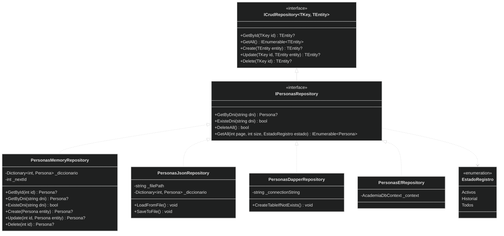

**Relaciones:**
- `IPersonasRepository` **extiende** `ICrudRepository<int, Persona>`
- Cuatro implementaciones concretas del repositorio
- Todas comparten el mismo contrato → **Intercambiables**

---

## 3.2. Storage (Import/Export)

El **Storage** es una capa separada del Repository, diseñada específicamente para **importar/exportar** datos en múltiples formatos.

| Aspecto           | Repository                               | Storage                             |
| ----------------- | ---------------------------------------- | ----------------------------------- |
| **Propósito**     | Persistencia principal entre ejecuciones | Import/Export de datos              |
| **Formatos**      | Uno solo (Memory, JSON, SQLite, etc.)    | Múltiples (JSON, XML, CSV, Binario) |
| **Operaciones**   | CRUD completo                            | Solo Load/Save                      |
| **Ciclo de vida** | Singleton (una instancia)                | Transient (nueva instancia por uso) |

---

### 3.2.1. Interfaz IStorage<T>

Define el contrato para cargar y guardar colecciones completas:

```csharp
public interface IStorage<T>
{
    void Salvar(IEnumerable<T> items, string path);
    IEnumerable<T> Cargar(string path);
}
```

**Ventajas:**
- Contrato simple y claro
- Genérico (funciona con cualquier tipo `T`)
- Desacoplado del formato concreto

---

### 3.2.2. Formatos: JSON, XML, CSV, Binario

El sistema soporta múltiples formatos de serialización:

#### **AcademiaJsonStorage**

```csharp
public class AcademiaJsonStorage : IStorage<Persona>
{
    private readonly ILogger _logger = Log.ForContext<AcademiaJsonStorage>();
    
    public void Salvar(IEnumerable<Persona> items, string path)
    {
        _logger.Debug("Guardando {Count} personas en JSON: {Path}", items.Count(), path);
        
        try
        {
            var dtos = items.Select(p => p.ToDto()).ToList();
            var options = new JsonSerializerOptions 
            { 
                WriteIndented = true,
                PropertyNamingPolicy = JsonNamingPolicy.CamelCase
            };
            
            var json = JsonSerializer.Serialize(dtos, options);
            File.WriteAllText(path, json);
            
            _logger.Information("Datos guardados en JSON: {Count} personas", dtos.Count);
        }
        catch (Exception ex)
        {
            _logger.Error(ex, "Error al guardar datos en JSON");
            throw new StorageException($"Error al guardar en JSON: {ex.Message}", ex);
        }
    }
    
    public IEnumerable<Persona> Cargar(string path)
    {
        _logger.Debug("Cargando personas desde JSON: {Path}", path);
        
        if (!File.Exists(path))
        {
            _logger.Warning("Archivo JSON no encontrado: {Path}", path);
            return Enumerable.Empty<Persona>();
        }
        
        try
        {
            var json = File.ReadAllText(path);
            var dtos = JsonSerializer.Deserialize<List<PersonaDto>>(json);
            
            if (dtos == null || dtos.Count == 0)
            {
                _logger.Warning("Archivo JSON vacío o inválido");
                return Enumerable.Empty<Persona>();
            }
            
            var personas = dtos.Select(dto => dto.ToModel()).ToList();
            _logger.Information("Datos cargados desde JSON: {Count} personas", personas.Count);
            
            return personas;
        }
        catch (Exception ex)
        {
            _logger.Error(ex, "Error al cargar datos desde JSON");
            throw new StorageException($"Error al cargar JSON: {ex.Message}", ex);
        }
    }
}
```

#### **AcademiaXmlStorage**

```csharp
public class AcademiaXmlStorage : IStorage<Persona>
{
    private readonly ILogger _logger = Log.ForContext<AcademiaXmlStorage>();
    
    public void Salvar(IEnumerable<Persona> items, string path)
    {
        _logger.Debug("Guardando {Count} personas en XML: {Path}", items.Count(), path);
        
        try
        {
            var dtos = items.Select(p => p.ToDto()).ToList();
            var serializer = new XmlSerializer(typeof(List<PersonaDto>));
            
            using var writer = new StreamWriter(path);
            serializer.Serialize(writer, dtos);
            
            _logger.Information("Datos guardados en XML: {Count} personas", dtos.Count);
        }
        catch (Exception ex)
        {
            _logger.Error(ex, "Error al guardar datos en XML");
            throw new StorageException($"Error al guardar en XML: {ex.Message}", ex);
        }
    }
    
    public IEnumerable<Persona> Cargar(string path)
    {
        _logger.Debug("Cargando personas desde XML: {Path}", path);
        
        if (!File.Exists(path))
        {
            _logger.Warning("Archivo XML no encontrado: {Path}", path);
            return Enumerable.Empty<Persona>();
        }
        
        try
        {
            var serializer = new XmlSerializer(typeof(List<PersonaDto>));
            
            using var reader = new StreamReader(path);
            var dtos = (List<PersonaDto>)serializer.Deserialize(reader)!;
            
            var personas = dtos.Select(dto => dto.ToModel()).ToList();
            _logger.Information("Datos cargados desde XML: {Count} personas", personas.Count);
            
            return personas;
        }
        catch (Exception ex)
        {
            _logger.Error(ex, "Error al cargar datos desde XML");
            throw new StorageException($"Error al cargar XML: {ex.Message}", ex);
        }
    }
}
```

#### **AcademiaCsvStorage**

```csharp
public class AcademiaCsvStorage : IStorage<Persona>
{
    private readonly ILogger _logger = Log.ForContext<AcademiaCsvStorage>();
    private const string Separador = ";";
    
    public void Salvar(IEnumerable<Persona> items, string path)
    {
        _logger.Debug("Guardando {Count} personas en CSV: {Path}", items.Count(), path);
        
        try
        {
            var lineas = new List<string>
            {
                // Cabecera
                "Id;Dni;Nombre;Apellidos;Tipo;Calificacion;Ciclo;Curso;Experiencia;Especialidad;CreatedAt;UpdatedAt;IsDeleted"
            };
            
            foreach (var persona in items)
            {
                var dto = persona.ToDto();
                lineas.Add(string.Join(Separador,
                    dto.Id,
                    dto.Dni,
                    dto.Nombre,
                    dto.Apellidos,
                    dto.Tipo,
                    dto.Calificacion ?? "",
                    dto.Ciclo ?? "",
                    dto.Curso ?? "",
                    dto.Experiencia ?? "",
                    dto.Especialidad ?? "",
                    dto.CreatedAt,
                    dto.UpdatedAt,
                    dto.IsDeleted
                ));
            }
            
            File.WriteAllLines(path, lineas);
            _logger.Information("Datos guardados en CSV: {Count} personas", items.Count());
        }
        catch (Exception ex)
        {
            _logger.Error(ex, "Error al guardar datos en CSV");
            throw new StorageException($"Error al guardar en CSV: {ex.Message}", ex);
        }
    }
    
    public IEnumerable<Persona> Cargar(string path)
    {
        _logger.Debug("Cargando personas desde CSV: {Path}", path);
        
        if (!File.Exists(path))
        {
            _logger.Warning("Archivo CSV no encontrado: {Path}", path);
            return Enumerable.Empty<Persona>();
        }
        
        try
        {
            var lineas = File.ReadAllLines(path);
            
            // Saltar cabecera
            return lineas.Skip(1)
                .Select(linea =>
                {
                    var campos = linea.Split(Separador);
                    
                    var dto = new PersonaDto(
                        Id: int.Parse(campos[0]),
                        Dni: campos[1],
                        Nombre: campos[2],
                        Apellidos: campos[3],
                        Tipo: campos[4],
                        Calificacion: string.IsNullOrEmpty(campos[5]) ? null : double.Parse(campos[5]),
                        Ciclo: string.IsNullOrEmpty(campos[6]) ? null : campos[6],
                        Curso: string.IsNullOrEmpty(campos[7]) ? null : campos[7],
                        Experiencia: string.IsNullOrEmpty(campos[8]) ? null : int.Parse(campos[8]),
                        Especialidad: string.IsNullOrEmpty(campos[9]) ? null : campos[9],
                        CreatedAt: DateTime.Parse(campos[10]),
                        UpdatedAt: DateTime.Parse(campos[11]),
                        IsDeleted: bool.Parse(campos[12])
                    );
                    
                    return dto.ToModel();
                })
                .ToList();
        }
        catch (Exception ex)
        {
            _logger.Error(ex, "Error al cargar datos desde CSV");
            throw new StorageException($"Error al cargar CSV: {ex.Message}", ex);
        }
    }
}
```

#### **AcademiaBinStorage** (Serialización Binaria Secuencial)

```csharp
public class AcademiaBinStorage : IStorage<Persona>
{
    private readonly ILogger _logger = Log.ForContext<AcademiaBinStorage>();
    
    public void Salvar(IEnumerable<Persona> items, string path)
    {
        _logger.Debug("Guardando {Count} personas en formato binario: {Path}", items.Count(), path);
        
        try
        {
            using var stream = File.Create(path);
            using var writer = new BinaryWriter(stream);
            
            var lista = items.ToList();
            
            // Escribir count
            writer.Write(lista.Count);
            
            // Escribir cada registro
            foreach (var persona in lista)
            {
                var dto = persona.ToDto();
                
                writer.Write(dto.Id);
                writer.Write(dto.Dni);
                writer.Write(dto.Nombre);
                writer.Write(dto.Apellidos);
                writer.Write(dto.Tipo);
                
                writer.Write(dto.Calificacion ?? -1);
                writer.Write(dto.Ciclo ?? "");
                writer.Write(dto.Curso ?? "");
                writer.Write(dto.Experiencia ?? -1);
                writer.Write(dto.Especialidad ?? "");
                
                writer.Write(dto.CreatedAt.ToBinary());
                writer.Write(dto.UpdatedAt.ToBinary());
                writer.Write(dto.IsDeleted);
            }
            
            _logger.Information("Datos guardados en binario: {Count} personas", lista.Count);
        }
        catch (Exception ex)
        {
            _logger.Error(ex, "Error al guardar datos en binario");
            throw new StorageException($"Error al guardar en binario: {ex.Message}", ex);
        }
    }
    
    public IEnumerable<Persona> Cargar(string path)
    {
        _logger.Debug("Cargando personas desde binario: {Path}", path);
        
        if (!File.Exists(path))
        {
            _logger.Warning("Archivo binario no encontrado: {Path}", path);
            return Enumerable.Empty<Persona>();
        }
        
        try
        {
            using var stream = File.OpenRead(path);
            using var reader = new BinaryReader(stream);
            
            var count = reader.ReadInt32();
            var personas = new List<Persona>(count);
            
            for (int i = 0; i < count; i++)
            {
                var id = reader.ReadInt32();
                var dni = reader.ReadString();
                var nombre = reader.ReadString();
                var apellidos = reader.ReadString();
                var tipo = reader.ReadString();
                
                var calificacion = reader.ReadDouble();
                var ciclo = reader.ReadString();
                var curso = reader.ReadString();
                var experiencia = reader.ReadInt32();
                var especialidad = reader.ReadString();
                
                var createdAt = DateTime.FromBinary(reader.ReadInt64());
                var updatedAt = DateTime.FromBinary(reader.ReadInt64());
                var isDeleted = reader.ReadBoolean();
                
                var dto = new PersonaDto(
                    Id: id,
                    Dni: dni,
                    Nombre: nombre,
                    Apellidos: apellidos,
                    Tipo: tipo,
                    Calificacion: calificacion == -1 ? null : calificacion,
                    Ciclo: string.IsNullOrEmpty(ciclo) ? null : ciclo,
                    Curso: string.IsNullOrEmpty(curso) ? null : curso,
                    Experiencia: experiencia == -1 ? null : experiencia,
                    Especialidad: string.IsNullOrEmpty(especialidad) ? null : especialidad,
                    CreatedAt: createdAt,
                    UpdatedAt: updatedAt,
                    IsDeleted: isDeleted
                );
                
                personas.Add(dto.ToModel());
            }
            
            _logger.Information("Datos cargados desde binario: {Count} personas", personas.Count);
            return personas;
        }
        catch (Exception ex)
        {
            _logger.Error(ex, "Error al cargar datos desde binario");
            throw new StorageException($"Error al cargar binario: {ex.Message}", ex);
        }
    }
}
```

---

### 3.2.3. DTOs y Mappers

Para separar el **modelo de dominio** de la **persistencia**, usamos **DTOs** (Data Transfer Objects):

```csharp
public record PersonaDto(
    int Id,
    string Dni,
    string Nombre,
    string Apellidos,
    string Tipo,  // "Estudiante" o "Docente"
    double? Calificacion,
    string? Ciclo,
    string? Curso,
    int? Experiencia,
    string? Especialidad,
    DateTime CreatedAt,
    DateTime UpdatedAt,
    bool IsDeleted
);
```

**¿Por qué DTOs?**

| Sin DTOs                              | Con DTOs                           |
| ------------------------------------- | ---------------------------------- |
| Serialización directa del modelo      | Modelo desacoplado de persistencia |
| Propiedades calculadas causan errores | Solo datos primitivos              |
| Referencias circulares problemáticas  | Estructura plana                   |
| Formato rígido                        | Formato adaptable                  |

**Mappers con Extensiones:**

```csharp
public static class PersonaMapper
{
    public static PersonaDto ToDto(this Persona persona) => new(
        Id: persona.Id,
        Dni: persona.Dni,
        Nombre: persona.Nombre,
        Apellidos: persona.Apellidos,
        Tipo: persona switch
        {
            Estudiante => "Estudiante",
            Docente => "Docente",
            _ => throw new ArgumentException("Tipo no soportado")
        },
        Calificacion: persona is Estudiante e ? e.Calificacion : null,
        Ciclo: persona switch
        {
            Estudiante est => est.Ciclo.ToString(),
            Docente doc => doc.Ciclo.ToString(),
            _ => null
        },
        Curso: persona is Estudiante est2 ? est2.Curso.ToString() : null,
        Experiencia: persona is Docente d ? d.Experiencia : null,
        Especialidad: persona is Docente d2 ? d2.Especialidad : null,
        CreatedAt: persona.CreatedAt,
        UpdatedAt: persona.UpdatedAt,
        IsDeleted: persona.IsDeleted
    );
    
    public static Persona ToModel(this PersonaDto dto) => dto.Tipo switch
    {
        "Estudiante" => new Estudiante
        {
            Id = dto.Id,
            Dni = dto.Dni,
            Nombre = dto.Nombre,
            Apellidos = dto.Apellidos,
            Calificacion = dto.Calificacion!.Value,
            Ciclo = Enum.Parse<Ciclo>(dto.Ciclo!),
            Curso = Enum.Parse<Curso>(dto.Curso!),
            CreatedAt = dto.CreatedAt,
            UpdatedAt = dto.UpdatedAt,
            IsDeleted = dto.IsDeleted
        },
        "Docente" => new Docente
        {
            Id = dto.Id,
            Dni = dto.Dni,
            Nombre = dto.Nombre,
            Apellidos = dto.Apellidos,
            Experiencia = dto.Experiencia!.Value,
            Especialidad = dto.Especialidad!,
            Ciclo = Enum.Parse<Ciclo>(dto.Ciclo!),
            CreatedAt = dto.CreatedAt,
            UpdatedAt = dto.UpdatedAt,
            IsDeleted = dto.IsDeleted
        },
        _ => throw new ArgumentException($"Tipo no soportado: {dto.Tipo}")
    };
}
```

**Uso:**
```csharp
// Modelo → DTO (para guardar)
var dto = estudiante.ToDto();

// DTO → Modelo (para cargar)
var estudiante = dto.ToModel();
```

---

### 3.2.4. Lazy Evaluation con IEnumerable

Los storages devuelven `IEnumerable<T>` para evitar cargar todo en memoria:

```csharp
// NO materializa hasta que se itera
public IEnumerable<Persona> Cargar(string path)
{
    var dtos = JsonSerializer.Deserialize<List<PersonaDto>>(json);
    
    // Lazy: no convierte hasta que se usa
    return dtos?.Select(dto => dto.ToModel()) ?? Enumerable.Empty<Persona>();
}

// Uso eficiente
foreach (var persona in storage.Cargar("data.json"))
{
    // Conversión bajo demanda (uno a uno)
    Console.WriteLine(persona.NombreCompleto);
}
```

**Ventajas:**
- No carga todo en memoria de golpe
- Procesamiento bajo demanda
- Eficiente con archivos grandes
- Compatible con LINQ (filtrado diferido)

---

### 3.2.5. Diagrama de Secuencia: Export/Import de Datos

#### **Exportar Datos**

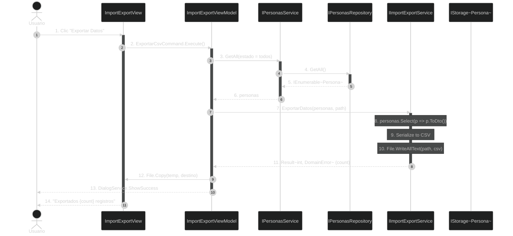

**Trazabilidad de Código:**
- **[1-2]** Usuario: Click botón "Exportar" en la vista → ViewModel ejecuta comando
- **[3-6]** IPersonasService: `GetAll()` → obtiene todas las personas del repositorio
- **[7-11]** IImportExportService: `ExportarDatos()` → convierte a DTO, serializa y guarda
- **[12]** ViewModel: Copia el archivo temporal a la ubicación seleccionada por el usuario
- **[13-14]** DialogService: Muestra mensaje de éxito al usuario

---

#### **Importar Datos**

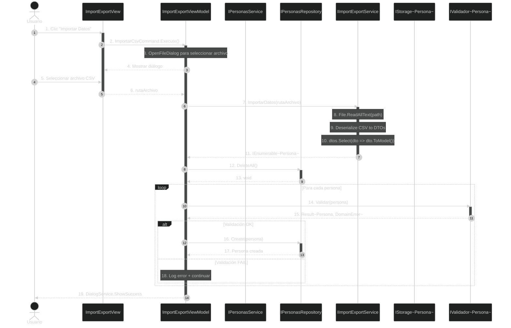

**Trazabilidad de Código:**
- **[1-2]** Usuario: Click botón "Importar" → ViewModel ejecuta comando
- **[3-6]** OpenFileDialog: Usuario selecciona archivo CSV
- **[7-11]** IImportExportService: `ImportarDatos()` → Lee archivo, deserializa y convierte a modelos
- **[12-13]** Repository: `DeleteAll()` → Limpia todos los datos existentes
- **[14-17]** ViewModel: Valida cada persona y la crea en el repositorio
- **[18]** Si falla validación: Registra error y continúa con la siguiente
- **[19]** Muestra mensaje de resultado al usuario
- **[14]** Service: Si validación falla, registra error y continúa
- **[15-16]** Program: Mensaje con total importado

---

## 3.3. Caché LRU

La **Caché LRU** (Least Recently Used) optimiza las lecturas frecuentes manteniendo en memoria los elementos más usados recientemente.

### 3.3.1. Algoritmo Least Recently Used

**Funcionamiento:**
1. Cuando se accede a un elemento, se mueve al final de la lista (más reciente)
2. Cuando se añade un elemento y la caché está llena, se elimina el primero (menos reciente)
3. La posición en la lista indica cuánto tiempo lleva sin ser usado

**Ejemplo:**
```
Capacidad: 3
Estado inicial: []

Add(1) → [1]
Add(2) → [1, 2]
Add(3) → [1, 2, 3]
Get(1) → [2, 3, 1]  ← 1 se mueve al final (recién usado)
Add(4) → [3, 1, 4]  ← 2 se elimina (el menos usado)
```

---

### 3.3.2. Estructura: Dictionary + LinkedList

La implementación combina dos estructuras de datos:

```csharp
public class LruCache<TKey, TValue> : ICache<TKey, TValue> where TKey : notnull
{
    private readonly Dictionary<TKey, TValue> _data = new();           // O(1) búsqueda
    private readonly LinkedList<TKey> _usageOrder = new();            // Orden de uso
    private readonly int _capacity;
    private readonly ILogger _logger = Log.ForContext<LruCache<TKey, TValue>>();
    
    public LruCache(int capacity)
    {
        if (capacity <= 0)
            throw new ArgumentException("La capacidad debe ser mayor que 0.", nameof(capacity));
        
        _capacity = capacity;
        _logger.Debug("Caché LRU creada con capacidad: {Capacity}", capacity);
    }
    
    public TValue? Get(TKey key)
    {
        if (!_data.TryGetValue(key, out var value))
        {
            _logger.Debug("Caché MISS: {Key}", key);
            return default;
        }
        
        _logger.Debug("Caché HIT: {Key}", key);
        
        // Mover al final (más reciente)
        RefreshUsage(key);
        
        return value;
    }
    
    public void Add(TKey key, TValue value)
    {
        if (_data.TryGetValue(key, out _))
        {
            _logger.Debug("Elemento ya existe en caché, actualizando: {Key}", key);
            RefreshUsage(key);
            return;
        }
        
        if (_data.Count >= _capacity)
        {
            // Expulsar el menos usado (primero de la lista)
            var oldest = _usageOrder.First!.Value;
            _usageOrder.RemoveFirst();
            _data.Remove(oldest);
            
            _logger.Debug("Caché llena, expulsando elemento: {OldestKey}", oldest);
        }
        
        _data.Add(key, value);
        _usageOrder.AddLast(key);
        
        _logger.Debug("Elemento añadido a caché: {Key}", key);
    }
    
    public void Remove(TKey key)
    {
        if (_data.Remove(key))
        {
            _usageOrder.Remove(key);
            _logger.Debug("Elemento eliminado de caché: {Key}", key);
        }
    }
    
    public void Clear()
    {
        _data.Clear();
        _usageOrder.Clear();
        _logger.Debug("Caché limpiada completamente");
    }
    
    private void RefreshUsage(TKey key)
    {
        // Mover al final de la lista (más reciente)
        _usageOrder.Remove(key);
        _usageOrder.AddLast(key);
    }
    
    public int Count => _data.Count;
    public int Capacity => _capacity;
}
```

**¿Por qué dos estructuras?**

| Estructura                 | Propósito                   | Complejidad                |
| -------------------------- | --------------------------- | -------------------------- |
| `Dictionary<TKey, TValue>` | Búsqueda rápida por clave   | O(1)                       |
| `LinkedList<TKey>`         | Mantener orden de uso (LRU) | O(1) inserción/eliminación |

**Complejidad Algorítmica:**

| Operación           | Complejidad     |
| ------------------- | --------------- |
| `Get(key)`          | O(1)            |
| `Add(key, value)`   | O(1) amortizado |
| `Remove(key)`       | O(1)            |
| `RefreshUsage(key)` | O(1)            |

---

### 3.3.3. Patrón Look-Aside

El servicio implementa el patrón **Look-Aside** para la caché:

```csharp
public Result<Persona, DomainError> GetById(int id)
{
    _logger.Debug("Buscando persona con ID: {Id}", id);
    
    // PASO 1: Buscar en caché
    if (cache.Get(id) is {} cached)
    {
        _logger.Debug("Persona encontrada en caché: ID={Id}", id);
        return Result.Success<Persona, DomainError>(cached);  // HIT: retornar directamente
    }
    
    // PASO 2: MISS → buscar en repositorio
    if (repository.GetById(id) is {} persona)
    {
        _logger.Debug("Persona encontrada en repositorio: ID={Id}", id);
        
        // PASO 3: Añadir a caché para próximas lecturas
        cache.Add(id, persona);
        
        return Result.Success<Persona, DomainError>(persona);
    }
    
    // PASO 4: No existe ni en caché ni en repositorio
    _logger.Warning("Persona no encontrada: ID={Id}", id);
    return Result.Failure<Persona, DomainError>(PersonaErrors.NotFound(id.ToString()));
}
```

**Flujo del Patrón Look-Aside:**
1. **Buscar en caché** primero (rápido)
2. Si **HIT** → retornar inmediatamente
3. Si **MISS** → buscar en repositorio (lento)
4. **Añadir a caché** tras lectura de repositorio
5. Próximas lecturas del mismo ID → **HIT**

---

# 3.3.4. Estrategias de Invalidación

La caché debe invalidarse (eliminarse) en ciertos momentos para evitar datos obsoletos:

| Operación    | Estrategia de Caché              | Razón                                             |
| ------------ | -------------------------------- | ------------------------------------------------- |
| **Create**   | `cache.Add(id, persona)`         | Añadir el nuevo registro para lecturas futuras    |
| **Update**   | `cache.Remove(id)`               | Invalidar porque los datos cambiaron              |
| **Delete**   | `cache.Remove(id)`               | Invalidar porque el registro fue eliminado        |
| **GetById**  | Look-Aside                       | Consultar caché → si no está, ir al repo y añadir |
| **GetByDni** | `cache.Add(persona.Id, persona)` | Aprovechar que ya tenemos el objeto               |

**Implementación en el Servicio:**

```csharp
public Result<Persona, DomainError> Update(int id, Persona persona)
{
    return CheckExists(id)
        .Bind(_ => ValidarPersona(persona))
        .Map(p => {
            cache.Remove(id);  // INVALIDAR antes de actualizar
            return repository.Update(id, p)!;
        });
}

public Persona Delete(int id)
{
    var eliminada = repository.Delete(id) ?? 
        throw new PersonasException.NotFound(id.ToString());
    cache.Remove(id);  // INVALIDAR tras eliminar
    return eliminada;
}
```

---

### 3.3.5. Diagrama de Actividad: Ciclo de Vida de Búsqueda con Caché

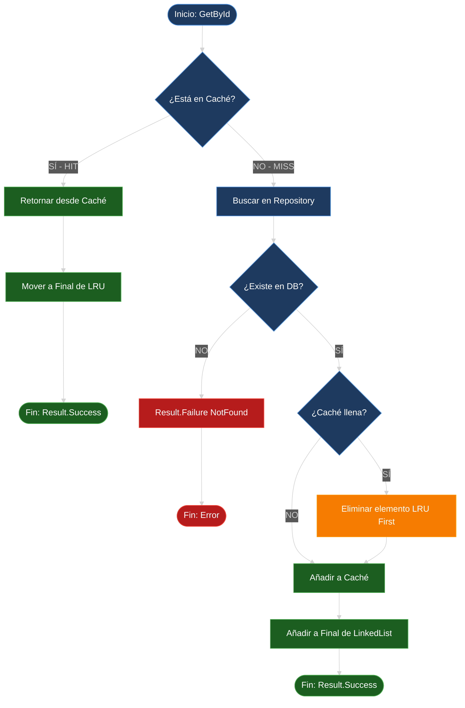

**Trazabilidad del Flujo:**

| Paso                         | Código                                            | Complejidad           |
| ---------------------------- | ------------------------------------------------- | --------------------- |
| **[B] Verificar Caché**      | `if (cache.Get(id) is {} cached)`                 | O(1)                  |
| **[C-D] HIT**                | `return Result.Success(cached)`                   | O(1)                  |
| **[F] Buscar en Repository** | `repository.GetById(id)`                          | O(1) si Memory/Índice |
| **[G] Verificar Existencia** | `if (persona == null)`                            | O(1)                  |
| **[H] Error**                | `Result.Failure(NotFound)`                        | O(1)                  |
| **[J] Verificar Capacidad**  | `if (_data.Count >= _capacity)`                   | O(1)                  |
| **[K] Expulsar LRU**         | `_usageOrder.RemoveFirst()`                       | O(1)                  |
| **[L-M] Añadir**             | `_data.Add(id, persona); _usageOrder.AddLast(id)` | O(1)                  |

**Complejidad Total:** O(1) en todos los casos (caché hit/miss con expulsión)

---

### 3.3.6. Logging de la Caché

Todas las operaciones críticas se registran con Serilog:

```csharp
public TValue? Get(TKey key)
{
    if (!_data.TryGetValue(key, out var value))
    {
        _logger.Debug("❌ CACHE MISS - Key: {Key}", key);
        return default;
    }

    _logger.Debug("✅ CACHE HIT - Key: {Key}", key);
    RefreshUsage(key);
    return value;
}

public void Add(TKey key, TValue value)
{
    if (_data.Count >= _capacity)
    {
        var oldest = _usageOrder.First!.Value;
        _logger.Debug("🗑️ CACHE EVICTION - Expulsando: {Key}", oldest);
        _usageOrder.RemoveFirst();
        _data.Remove(oldest);
    }

    _data.Add(key, value);
    _usageOrder.AddLast(key);
    _logger.Debug("➕ CACHE ADD - Key: {Key}", key);
}
```

**Ejemplo de Log en Producción:**

```
14:32:15.123 [DBG] [LruCache<Int32, Persona>] ✅ CACHE HIT - Key: 42
14:32:18.456 [DBG] [LruCache<Int32, Persona>] ❌ CACHE MISS - Key: 99
14:32:18.457 [DBG] [LruCache<Int32, Persona>] ➕ CACHE ADD - Key: 99
14:35:22.789 [DBG] [LruCache<Int32, Persona>] 🗑️ CACHE EVICTION - Expulsando: 12
```

---

### 3.3.7. Configuración de la Caché

La capacidad de la caché se configura en `appsettings.json`:

```json
{
  "Cache": {
    "Capacity": 100
  }
}
```

**Registro en DependenciesProvider:**

```csharp
services.AddSingleton<ICache<int, Persona>>(sp => 
    new LruCache<int, Persona>(AppConfig.CacheSize));
```

**Trade-offs de Capacidad:**

| Capacidad           | Ventajas                | Inconvenientes                     |
| ------------------- | ----------------------- | ---------------------------------- |
| **Pequeña (10-50)** | Bajo consumo de memoria | Muchas expulsiones, menor hit rate |
| **Media (100-500)** | Balance óptimo          | Consumo moderado                   |
| **Grande (1000+)**  | Alto hit rate           | Alto consumo de memoria            |

**Recomendación:** Empezar con 100 y ajustar según métricas de hit/miss en logs.

---

### 3.3.8. Testing de la Caché

**Test: Verificar Expulsión LRU**

```csharp
[Fact]
public void Add_CuandoCacheLlena_DebeExpulsarMenosReciente()
{
    // Arrange
    var cache = new LruCache<int, string>(capacity: 2);
    cache.Add(1, "primero");
    cache.Add(2, "segundo");
    
    // Act: Añadir tercero debería expulsar "primero"
    cache.Add(3, "tercero");
    
    // Assert
    Assert.Null(cache.Get(1));  // Expulsado
    Assert.Equal("segundo", cache.Get(2));
    Assert.Equal("tercero", cache.Get(3));
}
```

**Test: Verificar Refresh de Uso**

```csharp
[Fact]
public void Get_DebeRejuvenecerElemento()
{
    // Arrange
    var cache = new LruCache<int, string>(capacity: 2);
    cache.Add(1, "primero");
    cache.Add(2, "segundo");
    
    // Act: Acceder a "primero" lo rejuvenece
    var valor = cache.Get(1);
    cache.Add(3, "tercero");  // Debería expulsar "segundo"
    
    // Assert
    Assert.Equal("primero", cache.Get(1));  // Sigue vivo
    Assert.Null(cache.Get(2));              // Expulsado
    Assert.Equal("tercero", cache.Get(3));
}
```

---

### 3.3.9. Métricas de Rendimiento de la Caché

Para evaluar la efectividad de la caché, se pueden calcular métricas:

```csharp
public class LruCacheMetrics<TKey, TValue> : ICache<TKey, TValue> 
    where TKey : notnull
{
    private readonly LruCache<TKey, TValue> _cache;
    private int _hits;
    private int _misses;

    public double HitRate => _hits + _misses == 0 
        ? 0 
        : (double)_hits / (_hits + _misses);

    public TValue? Get(TKey key)
    {
        var value = _cache.Get(key);
        if (value != null) _hits++;
        else _misses++;
        return value;
    }

    public void ResetMetrics()
    {
        _hits = 0;
        _misses = 0;
    }
}
```

**Interpretación:**

| Hit Rate   | Evaluación | Acción                                          |
| ---------- | ---------- | ----------------------------------------------- |
| **> 80%**  | Excelente  | Mantener capacidad                              |
| **60-80%** | Bueno      | Considerar aumentar capacidad                   |
| **< 60%**  | Bajo       | Aumentar capacidad o revisar patrones de acceso |

---

# 4. Capa de Lógica de Negocio (Backend)

La capa de lógica de negocio orquesta las operaciones del sistema, aplicando las reglas de dominio y coordinando la interacción entre la capa de datos y la capa de presentación.

---

## 4.1. Validadores

Los validadores son la **"aduana"** del sistema. Garantizan que ningún dato inválido entre en el repositorio, aplicando las reglas de integridad de dominio.

### 4.1.1. IValidador<Persona>

Interfaz común para todos los validadores del sistema:

```csharp
public interface IValidador<T>
{
    Result<T, DomainError> Validar(T entity);
}
```

**Ventajas del diseño:**
- **Desacoplamiento:** El servicio no conoce la implementación concreta.
- **Composición:** Se pueden encadenar validadores.
- **Testeabilidad:** Fácil crear validadores mock.
- **Extensibilidad:** Añadir nuevos validadores sin modificar código existente.

---

### 4.1.2. ValidadorPersona (campos comunes)

Valida los campos compartidos por Estudiante y Docente:

```csharp
public class ValidadorPersona : IValidador<Persona>
{
    private readonly ILogger _logger = Log.ForContext<ValidadorPersona>();

    public Result<Persona, DomainError> Validar(Persona persona)
    {
        var errores = new List<string>();

        // Validar DNI
        if (string.IsNullOrWhiteSpace(persona.Dni))
            errores.Add("El DNI es obligatorio.");
        else if (!ValidarDniCompleto(persona.Dni))
            errores.Add("El DNI no tiene un formato válido (8 dígitos + letra).");

        // Validar Nombre
        if (string.IsNullOrWhiteSpace(persona.Nombre))
            errores.Add("El nombre es obligatorio.");
        else if (persona.Nombre.Length < 2)
            errores.Add("El nombre debe tener al menos 2 caracteres.");

        // Validar Apellidos
        if (string.IsNullOrWhiteSpace(persona.Apellidos))
            errores.Add("Los apellidos son obligatorios.");
        else if (persona.Apellidos.Length < 2)
            errores.Add("Los apellidos deben tener al menos 2 caracteres.");

        // Validar Email
        if (string.IsNullOrWhiteSpace(persona.Email))
            errores.Add("El email es obligatorio.");
        else if (!ValidarEmail(persona.Email))
            errores.Add("El email no tiene un formato válido.");

        if (errores.Any())
        {
            _logger.Warning("Validación fallida para Persona: {Errores}", errores);
            return Result.Failure<Persona, DomainError>(
                PersonaErrors.Validation(errores));
        }

        return Result.Success<Persona, DomainError>(persona);
    }

    private bool ValidarDniCompleto(string dni)
    {
        if (dni.Length != 9) return false;
        
        var numero = dni[..8];
        var letra = dni[8];
        
        if (!int.TryParse(numero, out var dniNumero)) return false;
        
        var letras = "TRWAGMYFPDXBNJZSQVHLCKE";
        return letras[dniNumero % 23] == char.ToUpper(letra);
    }

    private bool ValidarEmail(string email)
    {
        var regex = new Regex(@"^[^@\s]+@[^@\s]+\.[^@\s]+$");
        return regex.IsMatch(email);
    }
}
```

**Reglas de Validación:**

| Campo         | Regla                              | Mensaje de Error                                  |
| ------------- | ---------------------------------- | ------------------------------------------------- |
| **DNI**       | No vacío, 8 dígitos + letra válida | "El DNI no tiene un formato válido"               |
| **Nombre**    | No vacío, mínimo 2 caracteres      | "El nombre debe tener al menos 2 caracteres"      |
| **Apellidos** | No vacío, mínimo 2 caracteres      | "Los apellidos deben tener al menos 2 caracteres" |
| **Email**     | No vacío, formato válido           | "El email no tiene un formato válido"             |

---

### 4.1.3. ValidadorEstudiante (campos específicos)

Valida los campos exclusivos de Estudiante:

```csharp
public class ValidadorEstudiante : IValidador<Persona>
{
    private readonly ILogger _logger = Log.ForContext<ValidadorEstudiante>();

    public Result<Persona, DomainError> Validar(Persona persona)
    {
        var errores = new List<string>();

        if (persona is not Estudiante estudiante)
        {
            errores.Add("La entidad no es un Estudiante.");
            return Result.Failure<Persona, DomainError>(
                PersonaErrors.Validation(errores));
        }

        // Validar Nota Media (0-10)
        if (estudiante.NotaMedia < 0 || estudiante.NotaMedia > 10)
            errores.Add("La nota media debe estar entre 0 y 10.");

        // Validar Notas de Asignaturas
        foreach (var nota in estudiante.Notas)
        {
            if (nota.Calificacion < 0 || nota.Calificacion > 10)
                errores.Add($"La nota de {nota.Asignatura.Nombre} debe estar entre 0 y 10.");
        }

        // Validar Curso
        if (!Enum.IsDefined(typeof(Curso), estudiante.Curso))
            errores.Add("El curso no es válido.");

        // Validar Ciclo
        if (!Enum.IsDefined(typeof(Ciclo), estudiante.Ciclo))
            errores.Add("El ciclo no es válido.");

        if (errores.Any())
        {
            _logger.Warning("Validación fallida para Estudiante {Dni}: {Errores}", 
                estudiante.Dni, errores);
            return Result.Failure<Persona, DomainError>(
                PersonaErrors.Validation(errores));
        }

        return Result.Success<Persona, DomainError>(estudiante);
    }
}
```

**Reglas de Validación:**

| Campo         | Regla                            | Mensaje de Error                                  |
| ------------- | -------------------------------- | ------------------------------------------------- |
| **NotaMedia** | 0 ≤ nota ≤ 10                    | "La nota media debe estar entre 0 y 10"           |
| **Notas**     | Cada calificación: 0 ≤ nota ≤ 10 | "La nota de {asignatura} debe estar entre 0 y 10" |
| **Curso**     | Enum válido                      | "El curso no es válido"                           |
| **Ciclo**     | Enum válido                      | "El ciclo no es válido"                           |

---

### 4.1.4. ValidadorDocente (campos específicos)

Valida los campos exclusivos de Docente:

```csharp
public class ValidadorDocente : IValidador<Persona>
{
    private readonly ILogger _logger = Log.ForContext<ValidadorDocente>();

    public Result<Persona, DomainError> Validar(Persona persona)
    {
        var errores = new List<string>();

        if (persona is not Docente docente)
        {
            errores.Add("La entidad no es un Docente.");
            return Result.Failure<Persona, DomainError>(
                PersonaErrors.Validation(errores));
        }

        // Validar Experiencia (>= 0)
        if (docente.Experiencia.Anios < 0)
            errores.Add("La experiencia no puede ser negativa.");

        // Validar TipoDocente
        if (!Enum.IsDefined(typeof(TipoDocente), docente.TipoDocente))
            errores.Add("El tipo de docente no es válido.");

        // Validar Asignaturas (al menos una)
        if (!docente.Asignaturas.Any())
            errores.Add("El docente debe impartir al menos una asignatura.");

        // Validar Ciclo
        if (!Enum.IsDefined(typeof(Ciclo), docente.Ciclo))
            errores.Add("El ciclo no es válido.");

        if (errores.Any())
        {
            _logger.Warning("Validación fallida para Docente {Dni}: {Errores}", 
                docente.Dni, errores);
            return Result.Failure<Persona, DomainError>(
                PersonaErrors.Validation(errores));
        }

        return Result.Success<Persona, DomainError>(docente);
    }
}
```

**Reglas de Validación:**

| Campo           | Regla          | Mensaje de Error                                   |
| --------------- | -------------- | -------------------------------------------------- |
| **Experiencia** | Años ≥ 0       | "La experiencia no puede ser negativa"             |
| **TipoDocente** | Enum válido    | "El tipo de docente no es válido"                  |
| **Asignaturas** | Lista no vacía | "El docente debe impartir al menos una asignatura" |
| **Ciclo**       | Enum válido    | "El ciclo no es válido"                            |

---

### 4.1.5. Validación en Cascada con Bind()

El servicio implementa validación polimórfica en cascada usando el patrón **Railway Oriented Programming**:

```csharp
private Result<Persona, DomainError> ValidarPersona(Persona persona)
{
    // PASO 1: Validar campos comunes
    return valPersona.Validar(persona)
        // PASO 2: Si OK, validar campos específicos según tipo
        .Bind(p => persona switch
        {
            Estudiante => valEstudiante.Validar(p),
            Docente => valDocente.Validar(p),
            _ => Result.Failure<Persona, DomainError>(
                PersonaErrors.Validation(new[] { "Tipo no soportado." }))
        });
}
```

**Flujo de Validación:**

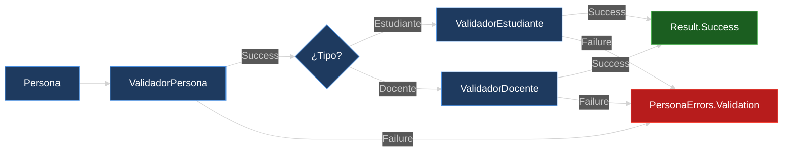

**Ventajas del patrón Bind():**

1. **Early Return:** Si falla la validación común, no se ejecuta la específica.
2. **Composición Funcional:** Se encadenan operaciones que devuelven Result.
3. **Sin Excepciones:** Los errores se propagan de forma controlada.
4. **Código Declarativo:** Lectura clara del flujo: "Valida común → Valida específico".

---

### 4.1.6. Diagrama de Secuencia: Validación Polimórfica

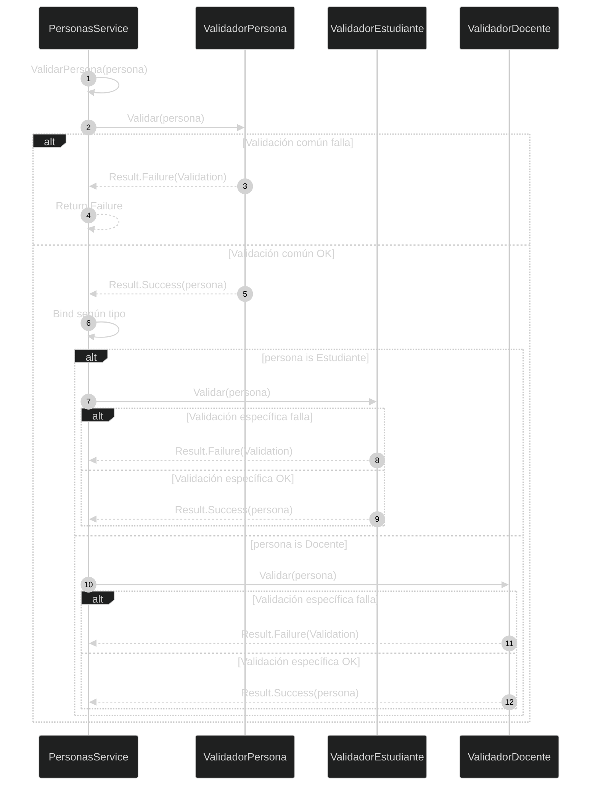

**Trazabilidad del Código:**

| Paso        | Código                             | Descripción                  |
| ----------- | ---------------------------------- | ---------------------------- |
| **[1-2]**   | `valPersona.Validar(persona)`      | Validación de campos comunes |
| **[3-4]**   | `return Result.Failure(...)`       | Early return si falla        |
| **[5-6]**   | `.Bind(p => persona switch {...})` | Selección polimórfica        |
| **[7-8]**   | `valEstudiante.Validar(p)`         | Validación específica        |
| **[11-12]** | `valDocente.Validar(p)`            | Validación específica        |

---

## 4.2. Servicios

El servicio es el **"chef"** del sistema: orquesta todas las operaciones, coordina validadores, repositorio y caché.

### 4.2.1. IPersonasService (CRUD + Consultas)

Interfaz que define el contrato del servicio principal:

```csharp
public interface IPersonasService
{
    // CRUD
    Result<Persona, DomainError> Create(Persona persona);
    Result<Persona, DomainError> Update(int id, Persona persona);
    Result<Persona, DomainError> Delete(int id);
    Result<Persona, DomainError> GetById(int id);
    Result<Persona, DomainError> GetByDni(string dni);
    
    // Consultas
    IEnumerable<Persona> GetAll();
    IEnumerable<Persona> GetAllOrderBy(
        TipoOrdenamiento orden = TipoOrdenamiento.Dni,
        Predicate<Persona>? filtro = null);
    IEnumerable<Estudiante> GetEstudiantesOrderBy(
        TipoOrdenamiento orden = TipoOrdenamiento.Dni);
    IEnumerable<Docente> GetDocentesOrderBy(
        TipoOrdenamiento orden = TipoOrdenamiento.Dni);
    
    // Informes
    InformeEstudiante GenerarInformeEstudiante(
        Ciclo? ciclo = null, Curso? curso = null);
    InformeDocente GenerarInformeDocente(Ciclo? ciclo = null);
    
    // Import/Export
    Result<int, DomainError> ImportarDatos();
    Result<int, DomainError> ExportarDatos();
    
    // Backup
    Result<string, DomainError> RealizarBackup();
    Result<int, DomainError> RestaurarBackup(string rutaZip);
    IEnumerable<string> ListarBackups();
    
    // Propiedades
    int TotalPersonas { get; }
    int TotalEstudiantes { get; }
    int TotalDocentes { get; }
}
```

---

### 4.2.2. Patrón Strategy con GetAllOrderBy()

El método centralizado de ordenación usa un **diccionario de estrategias** para evitar múltiples `if/else`:

```csharp
public IEnumerable<Persona> GetAllOrderBy(
    TipoOrdenamiento orden = TipoOrdenamiento.Dni,
    Predicate<Persona>? filtro = null)
{
    // PASO 1: Obtener datos del repositorio
    var lista = filtro == null
        ? repository.GetAll()
        : repository.GetAll().Where(p => filtro(p));

    // PASO 2: Definir estrategias de ordenación
    var comparadores = new Dictionary<TipoOrdenamiento, Func<IOrderedEnumerable<Persona>>>
    {
        { TipoOrdenamiento.Id, () => lista.OrderBy(p => p.Id) },
        { TipoOrdenamiento.Dni, () => lista.OrderBy(p => p.Dni) },
        { TipoOrdenamiento.Nombre, () => lista.OrderBy(p => p.Nombre) },
        { TipoOrdenamiento.Apellidos, () => lista.OrderBy(p => p.Apellidos) },
        { TipoOrdenamiento.Ciclo, () => lista.OrderBy(p => ObtenerCicloTexto(p)) },
        { TipoOrdenamiento.Nota, () => lista.OrderByDescending(p => 
            p is Estudiante e ? e.NotaMedia : -1) },
        { TipoOrdenamiento.Experiencia, () => lista.OrderByDescending(p => 
            p is Docente d ? d.Experiencia.Anios : -1) },
        { TipoOrdenamiento.Curso, () => lista.OrderBy(p => 
            p is Estudiante e ? (int)e.Curso : int.MaxValue) },
    };

    // PASO 3: Ejecutar la estrategia seleccionada
    return comparadores.TryGetValue(orden, out var comparador)
        ? comparador()
        : lista.OrderBy(p => p.Id);  // Fallback seguro
}

private string ObtenerCicloTexto(Persona p) => p switch
{
    Estudiante e => e.Ciclo.ToString(),
    Docente d => d.Ciclo.ToString(),
    _ => ""
};
```

**Ventajas del patrón Strategy:**

| Ventaja             | Descripción                                     |
| ------------------- | ----------------------------------------------- |
| **Open/Closed**     | Añadir criterios sin modificar código existente |
| **Desacoplamiento** | Cada estrategia es independiente                |
| **Legibilidad**     | Toda la lógica de ordenación en un solo lugar   |
| **Testeabilidad**   | Cada estrategia se puede probar aisladamente    |

---

### 4.2.3. Pattern Matching para Ordenación Polimórfica

Algunos criterios solo aplican a ciertos tipos. Usamos **pattern matching** para manejar esto:

```csharp
// Ordenar por Nota (solo Estudiantes)
{ TipoOrdenamiento.Nota, () => lista.OrderByDescending(p => 
    p is Estudiante e ? e.NotaMedia : -1) }
```

**Desglose:**
1. `p is Estudiante e` → ¿Es Estudiante? Si sí, guarda en `e`
2. `e.NotaMedia` → Accede a la propiedad del tipo derivado
3. `: -1` → Si no es Estudiante, devuelve -1 (va al final)

**Resultado del ordenamiento:**

```
Estudiantes ordenados por nota descendente:
  - Ana García: 9.5
  - Luis Martínez: 8.2
  - ...
Docentes al final con valor -1:
  - Pedro Sánchez (Docente)
  - María López (Docente)
```

---

### 4.2.4. Generación de Informes Estadísticos

Los informes se construyen aplicando filtros y calculando métricas con LINQ:

```csharp
public InformeEstudiante GenerarInformeEstudiante(Ciclo? ciclo = null, Curso? curso = null)
{
    var estudiantes = GetEstudiantesOrderBy(TipoOrdenamiento.Nota)
        .Where(e => !e.IsDeleted)  // Solo activos
        .Where(e => (ciclo == null || e.Ciclo == ciclo) && 
                    (curso == null || e.Curso == curso))
        .ToList();  // Materializar para contar varias veces

    var total = estudiantes.Count;
    if (total == 0) return new InformeEstudiante();  // Informe vacío

    return new InformeEstudiante
    {
        PorNota = estudiantes,
        TotalEstudiantes = total,
        Aprobados = estudiantes.Count(e => e.NotaMedia >= 5.0),
        Suspensos = estudiantes.Count(e => e.NotaMedia < 5.0),
        NotaMedia = estudiantes.Average(e => e.NotaMedia),
        PorcentajeAprobados = (double)estudiantes.Count(e => e.NotaMedia >= 5.0) / total * 100
    };
}

public InformeDocente GenerarInformeDocente(Ciclo? ciclo = null)
{
    var docentes = GetDocentesOrderBy(TipoOrdenamiento.Experiencia)
        .Where(d => !d.IsDeleted)  // Solo activos
        .Where(d => ciclo == null || d.Ciclo == ciclo)
        .ToList();

    var total = docentes.Count;
    if (total == 0) return new InformeDocente();

    return new InformeDocente
    {
        PorExperiencia = docentes,
        TotalDocentes = total,
        ExperienciaMedia = docentes.Average(d => d.Experiencia.Anios),
        PorTipo = docentes.GroupBy(d => d.TipoDocente)
            .ToDictionary(g => g.Key, g => g.Count())
    };
}
```

**Nota sobre `.ToList()`:** Se materializa el `IEnumerable` en lista para poder:
1. Contar múltiples veces (Aprobados, Suspensos, Total) sin iterar de nuevo
2. Calcular la media sin evaluación diferida (deferred execution)
3. Evitar múltiples accesos al repositorio

---

### 4.2.5. Pipeline Funcional con LINQ

Los informes usan un **pipeline funcional** encadenando operaciones LINQ:

```csharp
var estudiantes = GetEstudiantesOrderBy(TipoOrdenamiento.Nota)  // 1. Obtener
    .Where(e => !e.IsDeleted)                                    // 2. Filtrar activos
    .Where(e => (ciclo == null || e.Ciclo == ciclo) && ...)       // 3. Filtrar alcance
    .ToList();                                                     // 4. Materializar
```

**Pipeline de transformación:**


**Ventajas del Pipeline:**
- **Legibilidad:** Cada paso tiene un propósito claro
- **Composición:** Se pueden añadir/quitar filtros fácilmente
- **Lazy Evaluation:** Solo se materializa al final con `ToList()`
- **Inmutabilidad:** Cada operación retorna una nueva colección

---

### 4.2.6. Diagrama de Clases: Patrón Strategy en Ordenación

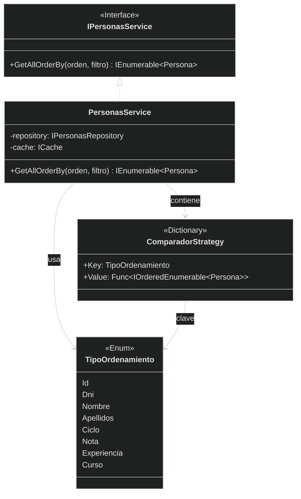

**Flujo de Ejecución:**

1. **Cliente** llama `service.GetAllOrderBy(TipoOrdenamiento.Nota)`
2. **PersonasService** consulta el diccionario de estrategias
3. **ComparadorStrategy** retorna la función `() => lista.OrderByDescending(p => ...)`
4. **Función** se ejecuta y retorna `IOrderedEnumerable<Persona>`
5. **Cliente** recibe la colección ordenada

---

## 4.3. Servicios Auxiliares

Servicios especializados que se inyectan en el servicio principal para delegar responsabilidades específicas.

### 4.3.1. IBackupService (ZIP con Storage configurable)

Servicio encargado de crear y restaurar copias de seguridad en formato ZIP:

```csharp
public interface IBackupService
{
    Result<string, DomainError> CrearBackup(IEnumerable<Persona> personas);
    Result<IEnumerable<Persona>, DomainError> RestaurarBackup(string rutaZip);
    IEnumerable<string> ListarBackups();
}

public class BackupService : IBackupService
{
    private readonly IStorage<Persona> _storage;
    private readonly ILogger _logger = Log.ForContext<BackupService>();
    private readonly string _backupDirectory;

    public BackupService(IStorage<Persona> storage)
    {
        _storage = storage;
        _backupDirectory = AppConfig.BackupDirectory;
        Directory.CreateDirectory(_backupDirectory);
    }

    public Result<string, DomainError> CrearBackup(IEnumerable<Persona> personas)
    {
        try
        {
            var timestamp = DateTime.Now.ToString("yyyyMMdd_HHmmss");
            var tempDir = Path.Combine(Path.GetTempPath(), $"backup_{timestamp}");
            var zipPath = Path.Combine(_backupDirectory, $"backup_{timestamp}.zip");

            // Crear directorio temporal
            Directory.CreateDirectory(tempDir);

            // Exportar datos al formato configurado
            var dataPath = Path.Combine(tempDir, $"data{GetExtension()}");
            _storage.Salvar(personas, dataPath);

            // Comprimir en ZIP
            ZipFile.CreateFromDirectory(tempDir, zipPath);

            // Limpiar directorio temporal
            Directory.Delete(tempDir, recursive: true);

            _logger.Information("✅ Backup creado: {Ruta}", zipPath);
            return Result.Success<string, DomainError>(zipPath);
        }
        catch (Exception ex)
        {
            _logger.Error(ex, "❌ Error al crear backup");
            return Result.Failure<string, DomainError>(
                BackupErrors.CreationFailed(ex.Message));
        }
    }

    public Result<IEnumerable<Persona>, DomainError> RestaurarBackup(string rutaZip)
    {
        try
        {
            var tempDir = Path.Combine(Path.GetTempPath(), $"restore_{Guid.NewGuid()}");
            
            // Extraer ZIP
            ZipFile.ExtractToDirectory(rutaZip, tempDir);

            // Buscar archivo de datos
            var dataPath = Directory.GetFiles(tempDir, $"data{GetExtension()}").FirstOrDefault();
            if (dataPath == null)
                return Result.Failure<IEnumerable<Persona>, DomainError>(
                    BackupErrors.InvalidFormat("No se encontró archivo de datos"));

            // Cargar datos
            var personas = _storage.Cargar(dataPath);

            // Limpiar directorio temporal
            Directory.Delete(tempDir, recursive: true);

            _logger.Information("✅ Backup restaurado desde: {Ruta}", rutaZip);
            return Result.Success<IEnumerable<Persona>, DomainError>(personas);
        }
        catch (Exception ex)
        {
            _logger.Error(ex, "❌ Error al restaurar backup");
            return Result.Failure<IEnumerable<Persona>, DomainError>(
                BackupErrors.RestoreFailed(ex.Message));
        }
    }

    public IEnumerable<string> ListarBackups()
    {
        return Directory.Exists(_backupDirectory)
            ? Directory.GetFiles(_backupDirectory, "backup_*.zip")
                .OrderByDescending(f => f)
            : Enumerable.Empty<string>();
    }

    private string GetExtension() => AppConfig.BackupFormat.ToLower() switch
    {
        "json" => ".json",
        "xml" => ".xml",
        "csv" => ".csv",
        "bin" or "binary" => ".bin",
        _ => ".json"
    };
}
```

**Características:**
- **ZIP automático:** Comprime los datos para reducir espacio
- **Timestamp:** Nombre único con fecha y hora
- **Storage configurable:** Usa el formato definido en `appsettings.json`
- **Limpieza automática:** Elimina archivos temporales tras crear/restaurar

---

### 4.3.2. IReportService (Generación HTML)

Servicio que genera informes HTML visuales:

```csharp
public interface IReportService
{
    Result<string, DomainError> GenerarInformeEstudiantesHtml(InformeEstudiante informe);
    Result<string, DomainError> GenerarInformeDocentesHtml(InformeDocente informe);
    Result<string, DomainError> GenerarListadoPersonasHtml(IEnumerable<Persona> personas);
}

public class ReportService : IReportService
{
    private readonly ILogger _logger = Log.ForContext<ReportService>();
    private readonly string _reportsDirectory;

    public ReportService()
    {
        _reportsDirectory = AppConfig.ReportsDirectory;
        Directory.CreateDirectory(_reportsDirectory);
    }

    public Result<string, DomainError> GenerarInformeEstudiantesHtml(InformeEstudiante informe)
    {
        try
        {
            var timestamp = DateTime.Now.ToString("yyyyMMdd_HHmmss");
            var filename = $"informe_estudiantes_{timestamp}.html";
            var filepath = Path.Combine(_reportsDirectory, filename);

            var html = $@"
<!DOCTYPE html>
<html>
<head>
    <meta charset='UTF-8'>
    <title>Informe de Estudiantes</title>
    <style>
        body {{ font-family: Arial, sans-serif; margin: 20px; }}
        h1 {{ color: #2c3e50; }}
        .stats {{ background: #ecf0f1; padding: 15px; border-radius: 5px; margin: 20px 0; }}
        table {{ border-collapse: collapse; width: 100%; margin-top: 20px; }}
        th {{ background: #3498db; color: white; padding: 12px; text-align: left; }}
        td {{ border: 1px solid #ddd; padding: 10px; }}
        tr:nth-child(even) {{ background: #f2f2f2; }}
        .aprobado {{ color: green; font-weight: bold; }}
        .suspenso {{ color: red; font-weight: bold; }}
    </style>
</head>
<body>
    <h1>📊 Informe de Rendimiento de Estudiantes</h1>
    <div class='stats'>
        <p><strong>Total Estudiantes:</strong> {informe.TotalEstudiantes}</p>
        <p><strong>Nota Media:</strong> {informe.NotaMedia:F2}</p>
        <p><strong>Aprobados:</strong> {informe.Aprobados} ({informe.PorcentajeAprobados:F1}%)</p>
        <p><strong>Suspensos:</strong> {informe.Suspensos}</p>
    </div>
    <table>
        <tr>
            <th>DNI</th>
            <th>Nombre Completo</th>
            <th>Ciclo</th>
            <th>Curso</th>
            <th>Nota Media</th>
            <th>Estado</th>
        </tr>
        {string.Join("", informe.PorNota.Select(e => $@"
        <tr>
            <td>{e.Dni}</td>
            <td>{e.NombreCompleto}</td>
            <td>{e.Ciclo}</td>
            <td>{e.Curso}</td>
            <td>{e.NotaMedia:F2}</td>
            <td class='{(e.NotaMedia >= 5 ? "aprobado" : "suspenso")}'>
                {(e.NotaMedia >= 5 ? "✅ Aprobado" : "❌ Suspenso")}
            </td>
        </tr>"))}
    </table>
    <p style='margin-top: 30px; color: #7f8c8d;'>
        Generado: {DateTime.Now:dd/MM/yyyy HH:mm:ss}
    </p>
</body>
</html>";

            File.WriteAllText(filepath, html);
            _logger.Information("✅ Informe HTML generado: {Ruta}", filepath);
            
            // Abrir en navegador
            Process.Start(new ProcessStartInfo(filepath) { UseShellExecute = true });

            return Result.Success<string, DomainError>(filepath);
        }
        catch (Exception ex)
        {
            _logger.Error(ex, "❌ Error al generar informe HTML");
            return Result.Failure<string, DomainError>(
                ReportErrors.GenerationFailed(ex.Message));
        }
    }
}
```

**Características:**
- **CSS incrustado:** Estilo profesional sin dependencias externas
- **Tabla responsive:** Se adapta al tamaño de la ventana
- **Apertura automática:** Se abre en el navegador predeterminado
- **Timestamp:** Nombre único para cada informe

---

### 4.3.3. IImageService (Validación y Gestión de Imágenes)

Servicio que valida y gestiona las imágenes de perfil:

```csharp
public interface IImageService
{
    Result<string, DomainError> SaveImage(string sourcePath);
    Result<byte[], DomainError> LoadImage(string imagePath);
    bool DeleteImage(string imagePath);
}

public class ImageService : IImageService
{
    private readonly ILogger _logger = Log.ForContext<ImageService>();
    private readonly string _imagesDirectory;
    private const long MaxFileSize = 5 * 1024 * 1024; // 5 MB
    private const int MaxWidth = 4096;
    private const int MaxHeight = 4096;

    public ImageService()
    {
        _imagesDirectory = AppConfig.ImagesDirectory;
        Directory.CreateDirectory(_imagesDirectory);
    }

    public Result<string, DomainError> SaveImage(string sourcePath)
    {
        try
        {
            // Validar extensión
            var extension = Path.GetExtension(sourcePath).ToLower();
            if (!new[] { ".jpg", ".jpeg", ".png", ".gif", ".bmp" }.Contains(extension))
                return Result.Failure<string, DomainError>(
                    ImageErrors.InvalidFormat("Solo se permiten: JPG, PNG, GIF, BMP"));

            // Validar tamaño de archivo
            var fileInfo = new FileInfo(sourcePath);
            if (fileInfo.Length > MaxFileSize)
                return Result.Failure<string, DomainError>(
                    ImageErrors.FileTooLarge($"Tamaño máximo: {MaxFileSize / 1024 / 1024} MB"));

            // Validar dimensiones (sin System.Drawing)
            var (width, height) = GetImageDimensions(sourcePath);
            if (width > MaxWidth || height > MaxHeight)
                return Result.Failure<string, DomainError>(
                    ImageErrors.DimensionsTooLarge($"Dimensiones máximas: {MaxWidth}x{MaxHeight}"));

            // Copiar con nombre único
            var filename = $"{Guid.NewGuid()}{extension}";
            var destPath = Path.Combine(_imagesDirectory, filename);
            File.Copy(sourcePath, destPath, overwrite: true);

            _logger.Information("✅ Imagen guardada: {Filename}", filename);
            return Result.Success<string, DomainError>(filename);
        }
        catch (Exception ex)
        {
            _logger.Error(ex, "❌ Error al guardar imagen");
            return Result.Failure<string, DomainError>(
                ImageErrors.SaveFailed(ex.Message));
        }
    }

    private (int width, int height) GetImageDimensions(string path)
    {
        using var stream = File.OpenRead(path);
        var extension = Path.GetExtension(path).ToLower();

        return extension switch
        {
            ".png" => ReadPngDimensions(stream),
            ".jpg" or ".jpeg" => ReadJpegDimensions(stream),
            ".gif" => ReadGifDimensions(stream),
            ".bmp" => ReadBmpDimensions(stream),
            _ => (0, 0)
        };
    }

    // Implementaciones de lectura de cabeceras...
    // (Ver sección 5 para detalles completos)
}
```

---

### 4.3.4. IDialogService (Mensajes UI)

Servicio para mostrar mensajes al usuario (se implementa en el frontend):

```csharp
public interface IDialogService
{
    void ShowError(string message);
    void ShowSuccess(string message);
    void ShowWarning(string message);
    bool ShowConfirmation(string message);
}
```

Este servicio se inyecta en los ViewModels para desacoplar la lógica de presentación de la lógica de negocio.

---

# 5. Validación de Imágenes

El sistema implementa un robusto sistema de validación de imágenes **sin dependencias externas** como `System.Drawing`, usando lectura directa de cabeceras binarias para garantizar compatibilidad con .NET moderno.

---

## 5.1. Restricciones y Límites

El sistema aplica restricciones estrictas para garantizar la calidad y el rendimiento del almacenamiento de imágenes.

### 5.1.1. Extensiones Permitidas

Solo se aceptan los formatos de imagen más comunes:

| Formato  | Extensiones     | Descripción                                 |
| -------- | --------------- | ------------------------------------------- |
| **JPEG** | `.jpg`, `.jpeg` | Formato comprimido universal                |
| **PNG**  | `.png`          | Formato sin pérdida con transparencia       |
| **GIF**  | `.gif`          | Formato para animaciones y gráficos simples |
| **BMP**  | `.bmp`          | Formato sin compresión de Windows           |

**Validación en código:**

```csharp
private static readonly string[] AllowedExtensions = { ".jpg", ".jpeg", ".png", ".gif", ".bmp" };

public bool IsValidExtension(string path)
{
    var extension = Path.GetExtension(path).ToLower();
    return AllowedExtensions.Contains(extension);
}
```

**¿Por qué estos formatos?**
- **JPEG:** Mejor relación calidad/tamaño para fotos
- **PNG:** Soporte para transparencia, ideal para logos
- **GIF:** Compatibilidad universal, ligero
- **BMP:** Formato nativo de Windows, sin pérdida

---

### 5.1.2. Tamaño Máximo (5 MB)

El tamaño máximo de archivo está limitado a **5 MB** para:

1. **Rendimiento:** Evitar que la aplicación se ralentice al cargar imágenes enormes
2. **Almacenamiento:** Optimizar el espacio en disco/base de datos
3. **Transferencia:** Facilitar la sincronización si se implementa en red

**Validación en código:**

```csharp
private const long MaxFileSize = 5 * 1024 * 1024; // 5 MB en bytes

public Result<string, DomainError> ValidateFileSize(string path)
{
    var fileInfo = new FileInfo(path);
    
    if (fileInfo.Length > MaxFileSize)
    {
        var sizeMB = fileInfo.Length / 1024.0 / 1024.0;
        return Result.Failure<string, DomainError>(
            ImageErrors.FileTooLarge(
                $"El archivo pesa {sizeMB:F2} MB. Tamaño máximo: {MaxFileSize / 1024 / 1024} MB"));
    }
    
    return Result.Success<string, DomainError>(path);
}
```

**Tabla de tamaños típicos:**

| Resolución | Formato    | Tamaño Aprox. |
| ---------- | ---------- | ------------- |
| 1920×1080  | JPEG (80%) | ~500 KB       |
| 1920×1080  | PNG        | ~2-3 MB       |
| 4096×4096  | JPEG (80%) | ~2-4 MB       |
| 4096×4096  | PNG        | ~8-15 MB ❌    |

> **Nota:** PNG sin compresión puede superar fácilmente los 5 MB en resoluciones altas.

---

### 5.1.3. Dimensiones Máximas (4096×4096 px)

El límite de dimensiones es **4096×4096 píxeles** por:

1. **Memoria:** Evitar consumo excesivo de RAM al cargar la imagen
2. **Renderizado:** Límite de texturas en muchos motores gráficos
3. **Compatibilidad:** Límite común en navegadores y sistemas operativos

**Validación en código:**

```csharp
private const int MaxWidth = 4096;
private const int MaxHeight = 4096;

public Result<string, DomainError> ValidateDimensions(string path)
{
    var (width, height) = GetImageDimensions(path);
    
    if (width > MaxWidth || height > MaxHeight)
    {
        return Result.Failure<string, DomainError>(
            ImageErrors.DimensionsTooLarge(
                $"La imagen mide {width}×{height} px. Máximo permitido: {MaxWidth}×{MaxHeight} px"));
    }
    
    if (width == 0 || height == 0)
    {
        return Result.Failure<string, DomainError>(
            ImageErrors.InvalidFormat("No se pudieron leer las dimensiones de la imagen"));
    }
    
    return Result.Success<string, DomainError>(path);
}
```

**Tabla de resoluciones comunes:**

| Nombre  | Resolución | Estado            |
| ------- | ---------- | ----------------- |
| HD      | 1280×720   | ✅ Válido          |
| Full HD | 1920×1080  | ✅ Válido          |
| 2K      | 2048×1080  | ✅ Válido          |
| 4K      | 3840×2160  | ✅ Válido          |
| 4K DCI  | 4096×2160  | ✅ Válido (límite) |
| 8K      | 7680×4320  | ❌ Supera límite   |

---

## 5.2. Implementación Técnica

El sistema implementa lectura directa de cabeceras binarias para **evitar dependencias externas** y garantizar compatibilidad con .NET 6+.

### 5.2.1. Lectura de Cabeceras sin System.Drawing

En .NET moderno, `System.Drawing` no está recomendado (solo disponible en Windows). La solución es leer las cabeceras de cada formato manualmente.

**¿Por qué no usar System.Drawing?**

| Razón              | Descripción                                                |
| ------------------ | ---------------------------------------------------------- |
| **Cross-platform** | `System.Drawing` solo funciona bien en Windows             |
| **Dependencias**   | Requiere libgdiplus en Linux/macOS                         |
| **Performance**    | Carga toda la imagen en memoria solo para leer dimensiones |
| **.NET moderno**   | Microsoft recomienda alternativas (SkiaSharp, ImageSharp)  |

**Nuestra solución:** Leer solo los primeros bytes (cabecera) del archivo para extraer las dimensiones.

---

### 5.2.2. Validación por Formato (PNG, BMP, GIF, JPEG)

Cada formato tiene una estructura binaria diferente. Implementamos lectores específicos para cada uno.

#### 5.2.2.1. Formato PNG

**Estructura de cabecera PNG:**

```
Bytes 0-7:   Firma PNG (89 50 4E 47 0D 0A 1A 0A)
Bytes 8-11:  Longitud del chunk IHDR (siempre 13)
Bytes 12-15: Tipo de chunk "IHDR"
Bytes 16-19: Ancho (32 bits, big-endian)
Bytes 20-23: Alto (32 bits, big-endian)
```

**Implementación:**

```csharp
private static (int width, int height) ReadPngDimensions(Stream stream)
{
    try
    {
        var buffer = new byte[24];
        stream.Read(buffer, 0, 24);

        // Verificar firma PNG: 89 50 4E 47 0D 0A 1A 0A
        if (buffer[0] != 0x89 || buffer[1] != 0x50 || buffer[2] != 0x4E || buffer[3] != 0x47)
            return (0, 0);

        // PNG usa big-endian: convertir bytes a int
        int width = (buffer[16] << 24) | (buffer[17] << 16) | (buffer[18] << 8) | buffer[19];
        int height = (buffer[20] << 24) | (buffer[21] << 16) | (buffer[22] << 8) | buffer[23];

        return (width, height);
    }
    catch
    {
        return (0, 0);
    }
}
```

**Desglose de conversión big-endian:**

```csharp
// Ejemplo: bytes [00 00 07 80] representan 1920 en big-endian
int width = (buffer[16] << 24)  // 0x00 << 24 = 0x00000000
          | (buffer[17] << 16)  // 0x00 << 16 = 0x00000000
          | (buffer[18] << 8)   // 0x07 << 8  = 0x00000700
          | buffer[19];         // 0x80       = 0x00000080
// Resultado: 0x00000780 = 1920
```

---

#### 5.2.2.2. Formato BMP

**Estructura de cabecera BMP:**

```
Bytes 0-1:   Firma BMP "BM" (42 4D)
Bytes 18-21: Ancho (32 bits, little-endian)
Bytes 22-25: Alto (32 bits, little-endian)
```

**Implementación:**

```csharp
private static (int width, int height) ReadBmpDimensions(Stream stream)
{
    try
    {
        var buffer = new byte[26];
        stream.Read(buffer, 0, 26);

        // Verificar firma BMP: "BM" (42 4D)
        if (buffer[0] != 0x42 || buffer[1] != 0x4D)
            return (0, 0);

        // BMP usa little-endian (nativo de .NET)
        int width = BitConverter.ToInt32(buffer, 18);
        int height = BitConverter.ToInt32(buffer, 22);

        return (width, Math.Abs(height)); // El alto puede ser negativo (indica top-down)
    }
    catch
    {
        return (0, 0);
    }
}
```

**¿Por qué `Math.Abs(height)`?**

En BMP, el alto puede ser negativo para indicar que la imagen está almacenada de arriba hacia abajo (top-down). Para dimensiones, nos interesa el valor absoluto.

---

#### 5.2.2.3. Formato GIF

**Estructura de cabecera GIF:**

```
Bytes 0-2:   Firma GIF "GIF"
Bytes 3-5:   Versión "87a" o "89a"
Bytes 6-7:   Ancho (16 bits, little-endian)
Bytes 8-9:   Alto (16 bits, little-endian)
```

**Implementación:**

```csharp
private static (int width, int height) ReadGifDimensions(Stream stream)
{
    try
    {
        var buffer = new byte[10];
        stream.Read(buffer, 0, 10);

        // Verificar firma GIF: "GIF"
        if (buffer[0] != 0x47 || buffer[1] != 0x49 || buffer[2] != 0x46)
            return (0, 0);

        // GIF usa little-endian (16 bits)
        int width = BitConverter.ToUInt16(buffer, 6);
        int height = BitConverter.ToUInt16(buffer, 8);

        return (width, height);
    }
    catch
    {
        return (0, 0);
    }
}
```

---

#### 5.2.2.4. Formato JPEG

**Estructura de cabecera JPEG:**

JPEG es más complejo porque las dimensiones están en un **segmento SOF** (Start Of Frame), no al inicio del archivo.

```
Bytes 0-1:   Firma JPEG (FF D8)
Luego:       Secuencia de segmentos (FF XX ...)
Segmento SOF (FF C0/C1/C2): Contiene dimensiones
```

**Implementación:**

```csharp
private static (int width, int height) ReadJpegDimensions(Stream stream)
{
    try
    {
        var buffer = new byte[2];
        stream.Read(buffer, 0, 2);

        // Verificar firma JPEG: FF D8
        if (buffer[0] != 0xFF || buffer[1] != 0xD8)
            return (0, 0);

        // Buscar segmento SOF (Start Of Frame)
        while (stream.Position < stream.Length)
        {
            // Leer marcador de segmento
            if (stream.ReadByte() != 0xFF)
                continue;

            var marker = (byte)stream.ReadByte();

            // SOF0 (Baseline), SOF1 (Extended), SOF2 (Progressive)
            if (marker == 0xC0 || marker == 0xC1 || marker == 0xC2)
            {
                // Leer longitud del segmento (2 bytes)
                var segmentLength = new byte[2];
                stream.Read(segmentLength, 0, 2);

                // Saltar precisión (1 byte)
                stream.ReadByte();

                // Leer dimensiones (big-endian)
                var dimensions = new byte[4];
                stream.Read(dimensions, 0, 4);

                int height = (dimensions[0] << 8) | dimensions[1];
                int width = (dimensions[2] << 8) | dimensions[3];

                return (width, height);
            }

            // Saltar al siguiente segmento
            var lengthBytes = new byte[2];
            stream.Read(lengthBytes, 0, 2);
            int length = (lengthBytes[0] << 8) | lengthBytes[1];
            stream.Seek(length - 2, SeekOrigin.Current);
        }

        return (0, 0);
    }
    catch
    {
        return (0, 0);
    }
}
```

**¿Por qué es más complejo?**

JPEG almacena metadatos en segmentos. Debemos recorrer el archivo buscando el segmento correcto (`SOF0`, `SOF1`, `SOF2`) que contiene las dimensiones.

---

### 5.2.3. Flujo de Validación Completo

El servicio `ImageService` orquesta todas las validaciones:

```csharp
public class ImageService : IImageService
{
    private readonly ILogger _logger = Log.ForContext<ImageService>();
    private readonly string _imagesDirectory;
    
    private const long MaxFileSize = 5 * 1024 * 1024; // 5 MB
    private const int MaxWidth = 4096;
    private const int MaxHeight = 4096;
    private static readonly string[] AllowedExtensions = { ".jpg", ".jpeg", ".png", ".gif", ".bmp" };

    public ImageService()
    {
        _imagesDirectory = AppConfig.ImagesDirectory;
        Directory.CreateDirectory(_imagesDirectory);
    }

    public Result<string, DomainError> SaveImage(string sourcePath)
    {
        return ValidateExtension(sourcePath)
            .Bind(ValidateFileSize)
            .Bind(ValidateDimensions)
            .Bind(CopyToImagesDirectory);
    }

    private Result<string, DomainError> ValidateExtension(string path)
    {
        var extension = Path.GetExtension(path).ToLower();
        
        if (!AllowedExtensions.Contains(extension))
        {
            var allowed = string.Join(", ", AllowedExtensions);
            return Result.Failure<string, DomainError>(
                ImageErrors.InvalidFormat($"Solo se permiten: {allowed}"));
        }
        
        return Result.Success<string, DomainError>(path);
    }

    private Result<string, DomainError> ValidateFileSize(string path)
    {
        var fileInfo = new FileInfo(path);
        
        if (fileInfo.Length > MaxFileSize)
        {
            var sizeMB = fileInfo.Length / 1024.0 / 1024.0;
            return Result.Failure<string, DomainError>(
                ImageErrors.FileTooLarge(
                    $"El archivo pesa {sizeMB:F2} MB. Tamaño máximo: {MaxFileSize / 1024 / 1024} MB"));
        }
        
        return Result.Success<string, DomainError>(path);
    }

    private Result<string, DomainError> ValidateDimensions(string path)
    {
        var (width, height) = GetImageDimensions(path);
        
        if (width == 0 || height == 0)
        {
            return Result.Failure<string, DomainError>(
                ImageErrors.InvalidFormat("No se pudieron leer las dimensiones de la imagen"));
        }
        
        if (width > MaxWidth || height > MaxHeight)
        {
            return Result.Failure<string, DomainError>(
                ImageErrors.DimensionsTooLarge(
                    $"La imagen mide {width}×{height} px. Máximo permitido: {MaxWidth}×{MaxHeight} px"));
        }
        
        return Result.Success<string, DomainError>(path);
    }

    private Result<string, DomainError> CopyToImagesDirectory(string sourcePath)
    {
        try
        {
            var extension = Path.GetExtension(sourcePath);
            var filename = $"{Guid.NewGuid()}{extension}";
            var destPath = Path.Combine(_imagesDirectory, filename);
            
            File.Copy(sourcePath, destPath, overwrite: true);
            
            _logger.Information("✅ Imagen guardada: {Filename} ({Size} bytes)", 
                filename, new FileInfo(destPath).Length);
            
            return Result.Success<string, DomainError>(filename);
        }
        catch (Exception ex)
        {
            _logger.Error(ex, "❌ Error al copiar imagen");
            return Result.Failure<string, DomainError>(
                ImageErrors.SaveFailed(ex.Message));
        }
    }

    private (int width, int height) GetImageDimensions(string path)
    {
        try
        {
            using var stream = File.OpenRead(path);
            var extension = Path.GetExtension(path).ToLower();

            return extension switch
            {
                ".png" => ReadPngDimensions(stream),
                ".jpg" or ".jpeg" => ReadJpegDimensions(stream),
                ".gif" => ReadGifDimensions(stream),
                ".bmp" => ReadBmpDimensions(stream),
                _ => (0, 0)
            };
        }
        catch (Exception ex)
        {
            _logger.Error(ex, "❌ Error al leer dimensiones de imagen: {Path}", path);
            return (0, 0);
        }
    }

    // ReadPngDimensions, ReadBmpDimensions, ReadGifDimensions, ReadJpegDimensions
    // (implementados en sección 5.2.2)
}
```

**Pipeline de validación con Railway Oriented Programming:**

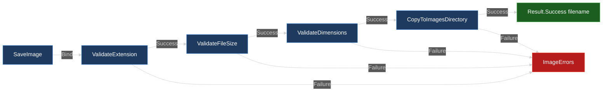

**Ventajas del pipeline:**

1. **Early return:** Si falla cualquier paso, se detiene la cadena
2. **Inmutabilidad:** Cada paso retorna un nuevo `Result`
3. **Composición:** Fácil añadir/quitar validaciones
4. **Claridad:** El código refleja el flujo de negocio

---

### 5.2.4. Integración con ViewModels

Los ViewModels usan el servicio para validar imágenes seleccionadas por el usuario:

```csharp
public partial class EstudianteEditViewModel : ObservableObject
{
    private readonly IImageService _imageService;
    private readonly IDialogService _dialogService;

    [ObservableProperty]
    private string? _imagenPath;

    [ObservableProperty]
    private byte[]? _imagenPreview;

    public EstudianteEditViewModel(
        IImageService imageService,
        IDialogService dialogService)
    {
        _imageService = imageService;
        _dialogService = dialogService;
    }

    [RelayCommand]
    private async Task SeleccionarImagen()
    {
        var dialog = new OpenFileDialog
        {
            Title = "Seleccionar imagen de perfil",
            Filter = "Imágenes|*.jpg;*.jpeg;*.png;*.gif;*.bmp",
            Multiselect = false
        };

        if (dialog.ShowDialog() != true)
            return;

        var sourcePath = dialog.FileName;

        // Validar y guardar imagen
        var result = _imageService.SaveImage(sourcePath);

        result.Match(
            onSuccess: filename =>
            {
                ImagenPath = filename;
                LoadImagePreview(filename);
                _dialogService.ShowSuccess("✅ Imagen cargada correctamente");
            },
            onFailure: error =>
            {
                _dialogService.ShowError($"❌ {error.Message}");
            }
        );
    }

    private void LoadImagePreview(string filename)
    {
        var result = _imageService.LoadImage(filename);
        
        result.Match(
            onSuccess: bytes => ImagenPreview = bytes,
            onFailure: error => _dialogService.ShowError($"❌ {error.Message}")
        );
    }
}
```

**Binding en XAML:**

```xml
<Grid>
    <Grid.RowDefinitions>
        <RowDefinition Height="Auto"/>
        <RowDefinition Height="*"/>
    </Grid.RowDefinitions>

    <!-- Botón para seleccionar imagen -->
    <Button Grid.Row="0" 
            Content="📷 Seleccionar Imagen"
            Command="{Binding SeleccionarImagenCommand}"
            Margin="0,0,0,10"/>

    <!-- Preview de la imagen -->
    <Border Grid.Row="1" 
            BorderBrush="#ddd" 
            BorderThickness="1"
            CornerRadius="5"
            Background="#f5f5f5">
        <Image Source="{Binding ImagenPreview, Converter={StaticResource ByteArrayToImageConverter}}"
               Stretch="Uniform"
               MaxHeight="200"/>
    </Border>
</Grid>
```

**Converter para mostrar byte[] como imagen:**

```csharp
public class ByteArrayToImageConverter : IValueConverter
{
    public object? Convert(object value, Type targetType, object parameter, CultureInfo culture)
    {
        if (value is not byte[] bytes || bytes.Length == 0)
            return null;

        var image = new BitmapImage();
        using var stream = new MemoryStream(bytes);
        
        image.BeginInit();
        image.CacheOption = BitmapCacheOption.OnLoad;
        image.StreamSource = stream;
        image.EndInit();
        image.Freeze();

        return image;
    }

    public object ConvertBack(object value, Type targetType, object parameter, CultureInfo culture)
    {
        throw new NotImplementedException();
    }
}
```

---

### 5.2.5. Diagrama de Actividad: Validación de Imagen Completa

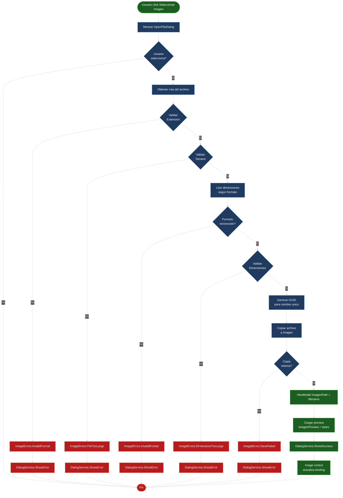

**Trazabilidad del flujo:**

| Paso     | Código                               | Descripción                   |
| -------- | ------------------------------------ | ----------------------------- |
| **[1]**  | `SeleccionarImagenCommand.Execute()` | Usuario click botón           |
| **[2]**  | `OpenFileDialog.ShowDialog()`        | Mostrar diálogo de selección  |
| **[3]**  | `dialog.FileName`                    | Obtener ruta seleccionada     |
| **[4]**  | `ValidateExtension(path)`            | ¿Extensión válida?            |
| **[5]**  | `ValidateFileSize(path)`             | ¿Tamaño <= 5 MB?              |
| **[6]**  | `GetImageDimensions(path)`           | Leer cabecera según formato   |
| **[7]**  | `ValidateDimensions(path)`           | ¿Dimensiones <= 4096×4096?    |
| **[8]**  | `Guid.NewGuid() + extension`         | Generar nombre único          |
| **[9]**  | `File.Copy(source, dest)`            | Copiar a directorio Images/   |
| **[10]** | `ImagenPath = filename`              | Actualizar ViewModel          |
| **[11]** | `LoadImage(filename)`                | Cargar bytes para preview     |
| **[12]** | `ImagenPreview = bytes`              | Actualizar binding            |
| **[13]** | `ByteArrayToImageConverter`          | Convertir bytes → BitmapImage |

---

# 6. Arquitectura Frontend (WPF con MVVM)

El frontend del sistema está construido usando **WPF (Windows Presentation Foundation)** con el patrón **MVVM (Model-View-ViewModel)**, aprovechando **CommunityToolkit.Mvvm** para reducir el código repetitivo y mejorar la mantenibilidad.

---

## 6.1. Patrón MVVM

MVVM es un patrón arquitectónico que separa la lógica de presentación de la interfaz de usuario, facilitando el testing, la reutilización de código y el trabajo en equipo.

### 6.1.1. Flujo de Datos MVVM

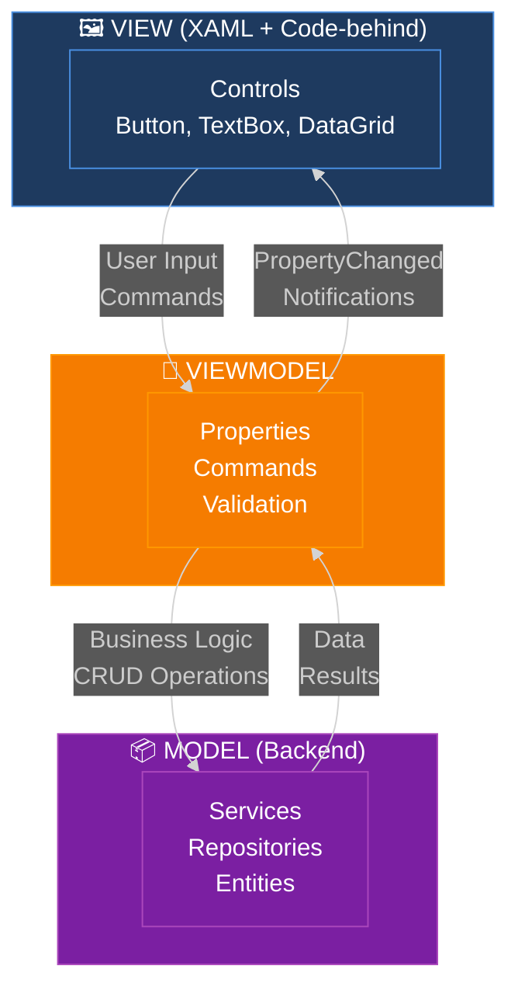

**Responsabilidades de cada capa:**

| Capa          | Responsabilidad                                    | Ejemplo                          |
| ------------- | -------------------------------------------------- | -------------------------------- |
| **View**      | Presentación visual, binding, eventos UI           | `EstudiantesView.xaml`           |
| **ViewModel** | Lógica de presentación, comandos, validación       | `EstudiantesViewModel.cs`        |
| **Model**     | Lógica de negocio, persistencia, reglas de dominio | `IPersonasService`, `Estudiante` |

**Características clave:**

1. **View no conoce Model:** Solo se comunica con ViewModel
2. **ViewModel no conoce View:** No tiene referencias a controles
3. **Data Binding bidireccional:** Cambios en VM → View y viceversa
4. **Comandos en lugar de eventos:** `RelayCommand` en vez de `Click` handlers
5. **Testabilidad:** El ViewModel se puede testear sin UI

---

### 6.1.2. CommunityToolkit.Mvvm

**CommunityToolkit.Mvvm** (antes MVVM Toolkit) es la biblioteca oficial de Microsoft que simplifica la implementación de MVVM mediante **Source Generators**.

**Instalación:**

```bash
dotnet add package CommunityToolkit.Mvvm
```

**Características principales:**

| Feature                      | Descripción                                     | Beneficio                     |
| ---------------------------- | ----------------------------------------------- | ----------------------------- |
| **`[ObservableProperty]`**   | Genera propiedades con `INotifyPropertyChanged` | Reduce código repetitivo      |
| **`[RelayCommand]`**         | Genera comandos `ICommand` automáticamente      | Simplifica binding de botones |
| **`ObservableObject`**       | Clase base con `INotifyPropertyChanged`         | Infraestructura lista         |
| **`ObservableRecipient`**    | Soporte para Messenger integrado                | Comunicación entre VMs        |
| **`WeakReferenceMessenger`** | Sistema de mensajería débil                     | Evita memory leaks            |

**Ejemplo sin CommunityToolkit (código tradicional):**

```csharp
// ❌ CÓDIGO REPETITIVO (más de 20 líneas para una propiedad)
public class EstudiantesViewModel : INotifyPropertyChanged
{
    private string _searchText;
    
    public string SearchText
    {
        get => _searchText;
        set
        {
            if (_searchText != value)
            {
                _searchText = value;
                OnPropertyChanged();
                FilterEstudiantes(); // Lógica adicional
            }
        }
    }
    
    public event PropertyChangedEventHandler PropertyChanged;
    
    protected virtual void OnPropertyChanged([CallerMemberName] string propertyName = null)
    {
        PropertyChanged?.Invoke(this, new PropertyChangedEventArgs(propertyName));
    }
}
```

**Mismo ejemplo con CommunityToolkit:**

```csharp
// ✅ CÓDIGO CONCISO (4 líneas con Source Generators)
public partial class EstudiantesViewModel : ObservableObject
{
    [ObservableProperty]
    [NotifyPropertyChangedFor(nameof(EstudiantesFiltrados))]
    private string _searchText;
    
    // El compilador genera automáticamente:
    // - public string SearchText { get; set; }
    // - INotifyPropertyChanged completo
    // - OnSearchTextChanged() (método partial que puedes implementar)
}
```

**Ventajas de Source Generators:**

1. **Menos código:** 70% menos líneas que MVVM tradicional
2. **Sin reflexión:** Mejor performance que frameworks como Prism
3. **Type-safe:** Errores en tiempo de compilación, no en runtime
4. **Debugging:** El código generado es visible en el IDE
5. **Mantenibilidad:** Cambios centralizados en atributos

---

### 6.1.3. Diagrama de Arquitectura MVVM del Frontend

```mermaid
%%{init: {'theme': 'dark', 'themeVariables': {'darkMode': true, 'background': '#1e1e1e'}}}%%
graph TB
    subgraph UI["🖥️ UI LAYER"]
        MW[MainWindow]
        EV[EstudiantesView]
        DV[DocentesView]
        DashV[DashboardView]
        EditE[EstudianteEditWindow]
        EditD[DocenteEditWindow]
    end
    
    subgraph VM["🧠 VIEWMODEL LAYER"]
        MVM[MainViewModel]
        EVM[EstudiantesViewModel]
        DVM[DocentesViewModel]
        DashVM[DashboardViewModel]
        EditEVM[EstudianteEditViewModel]
        EditDVM[DocenteEditViewModel]
    end
    
    subgraph Services["⚙️ SERVICES LAYER"]
        PS[IPersonasService]
        IS[IImageService]
        DS[IDialogService]
        BS[IBackupService]
        RS[IReportService]
    end
    
    subgraph Infra["🔧 INFRASTRUCTURE"]
        Msg[WeakReferenceMessenger]
        Nav[NavigationService]
        DI[DependencyInjection]
    end
    
    MW -.->|DataContext| MVM
    EV -.->|DataContext| EVM
    DV -.->|DataContext| DVM
    DashV -.->|DataContext| DashVM
    EditE -.->|DataContext| EditEVM
    EditD -.->|DataContext| EditDVM
    
    MVM --> Nav
    EVM --> PS
    EVM --> IS
    EVM --> DS
    EVM --> Msg
    DVM --> PS
    DVM --> IS
    DVM --> DS
    DVM --> Msg
    DashVM --> PS
    DashVM --> RS
    DashVM --> Msg
    EditEVM --> PS
    EditEVM --> IS
    EditEVM --> DS
    EditDVM --> PS
    EditDVM --> IS
    EditDVM --> DS
    
    MVM --> DI
    EVM --> DI
    DVM --> DI
    DashVM --> DI
    
    style UI fill:#1E3A5F,stroke:#4A90E2,color:#fff
    style VM fill:#F57C00,stroke:#FF9800,color:#fff
    style Services fill:#7B1FA2,stroke:#AB47BC,color:#fff
    style Infra fill:#388E3C,stroke:#4CAF50,color:#fff
    style MW fill:#1E3A5F,stroke:#4A90E2,color:#fff
    style EV fill:#1E3A5F,stroke:#4A90E2,color:#fff
    style DV fill:#1E3A5F,stroke:#4A90E2,color:#fff
    style DashV fill:#1E3A5F,stroke:#4A90E2,color:#fff
    style EditE fill:#1E3A5F,stroke:#4A90E2,color:#fff
    style EditD fill:#1E3A5F,stroke:#4A90E2,color:#fff
    style MVM fill:#F57C00,stroke:#FF9800,color:#fff
    style EVM fill:#F57C00,stroke:#FF9800,color:#fff
    style DVM fill:#F57C00,stroke:#FF9800,color:#fff
    style DashVM fill:#F57C00,stroke:#FF9800,color:#fff
    style EditEVM fill:#F57C00,stroke:#FF9800,color:#fff
    style EditDVM fill:#F57C00,stroke:#FF9800,color:#fff
    style PS fill:#7B1FA2,stroke:#AB47BC,color:#fff
    style IS fill:#7B1FA2,stroke:#AB47BC,color:#fff
    style DS fill:#7B1FA2,stroke:#AB47BC,color:#fff
    style BS fill:#7B1FA2,stroke:#AB47BC,color:#fff
    style RS fill:#7B1FA2,stroke:#AB47BC,color:#fff
    style Msg fill:#388E3C,stroke:#4CAF50,color:#fff
    style Nav fill:#388E3C,stroke:#4CAF50,color:#fff
    style DI fill:#388E3C,stroke:#4CAF50,color:#fff
```

**Flujo de dependencias:**

```mermaid
%%{init: {'theme': 'dark', 'themeVariables': {'darkMode': true, 'background': '#1e1e1e'}}}%%
graph LR
    A[App.xaml.cs] -->|ConfigureDI| B[ServiceProvider]
    B -->|Resolve| C[ViewModels]
    C -->|Inject| D[Services]
    D -->|Inject| E[Repositories]
    
    F[View] -->|DataContext =| C
    C -->|Binding| F
    
    style A fill:#BF360C,stroke:#FF5722,color:#fff
    style B fill:#5E35B1,stroke:#7E57C2,color:#fff
    style C fill:#F57C00,stroke:#FF9800,color:#fff
    style D fill:#7B1FA2,stroke:#AB47BC,color:#fff
    style E fill:#388E3C,stroke:#4CAF50,color:#fff
    style F fill:#1E3A5F,stroke:#4A90E2,color:#fff
```

**Configuración DI en `App.xaml.cs`:**

```csharp
public partial class App : Application
{
    private readonly IServiceProvider _serviceProvider;

    public App()
    {
        _serviceProvider = ConfigureServices();
    }

    private static IServiceProvider ConfigureServices()
    {
        var services = new ServiceCollection();

        // Backend services
        services.AddSingleton<IPersonasService, PersonasService>();
        services.AddSingleton<IImageService, ImageService>();
        services.AddSingleton<IBackupService, BackupService>();
        services.AddSingleton<IReportService, ReportService>();
        
        // UI services
        services.AddSingleton<IDialogService, DialogService>();
        services.AddSingleton<INavigationService, NavigationService>();
        
        // ViewModels
        services.AddTransient<MainViewModel>();
        services.AddTransient<EstudiantesViewModel>();
        services.AddTransient<DocentesViewModel>();
        services.AddTransient<DashboardViewModel>();
        services.AddTransient<EstudianteEditViewModel>();
        services.AddTransient<DocenteEditViewModel>();
        
        // Messenger
        services.AddSingleton<WeakReferenceMessenger>(WeakReferenceMessenger.Default);

        return services.BuildServiceProvider();
    }

    protected override void OnStartup(StartupEventArgs e)
    {
        var mainWindow = new MainWindow
        {
            DataContext = _serviceProvider.GetRequiredService<MainViewModel>()
        };
        mainWindow.Show();
    }
}
```

---

## 6.2. Views (Presentación)

Las vistas son archivos XAML que definen la estructura visual de la aplicación. Cada vista se enlaza a un ViewModel mediante `DataContext`.

### 6.2.1. MainWindow

**Responsabilidad:** Ventana principal que contiene el menú de navegación y el área de contenido principal.

**Estructura:**

```xml
<Window x:Class="GestionAcademica.Views.MainWindow"
        xmlns="http://schemas.microsoft.com/winfx/2006/xaml/presentation"
        xmlns:x="http://schemas.microsoft.com/winfx/2006/xaml"
        Title="Sistema de Gestión Académica" 
        Height="700" Width="1200"
        WindowStartupLocation="CenterScreen">
    
    <Grid>
        <Grid.RowDefinitions>
            <RowDefinition Height="Auto"/> <!-- Menu -->
            <RowDefinition Height="*"/>    <!-- Content -->
            <RowDefinition Height="Auto"/> <!-- StatusBar -->
        </Grid.RowDefinitions>
        
        <!-- MENU -->
        <Menu Grid.Row="0" Background="#2196F3" Foreground="White">
            <MenuItem Header="📊 Dashboard" Command="{Binding NavigateToDashboardCommand}"/>
            <MenuItem Header="👨‍🎓 Estudiantes" Command="{Binding NavigateToEstudiantesCommand}"/>
            <MenuItem Header="👨‍🏫 Docentes" Command="{Binding NavigateToDocentesCommand}"/>
            <MenuItem Header="⚙️ Herramientas">
                <MenuItem Header="💾 Crear Backup" Command="{Binding BackupCommand}"/>
                <MenuItem Header="♻️ Restaurar Backup" Command="{Binding RestoreCommand}"/>
                <MenuItem Header="📤 Exportar Datos" Command="{Binding ExportCommand}"/>
                <MenuItem Header="📥 Importar Datos" Command="{Binding ImportCommand}"/>
            </MenuItem>
            <MenuItem Header="📄 Informes">
                <MenuItem Header="📊 Informe Estudiantes" Command="{Binding GenerarInformeEstudiantesCommand}"/>
                <MenuItem Header="👨‍🏫 Informe Docentes" Command="{Binding GenerarInformeDocentesCommand}"/>
            </MenuItem>
        </Menu>
        
        <!-- CONTENT AREA -->
        <ContentControl Grid.Row="1" Content="{Binding CurrentView}"/>
        
        <!-- STATUS BAR -->
        <StatusBar Grid.Row="2" Background="#f5f5f5">
            <StatusBarItem>
                <TextBlock Text="{Binding StatusMessage}"/>
            </StatusBarItem>
            <StatusBarItem HorizontalAlignment="Right">
                <StackPanel Orientation="Horizontal">
                    <TextBlock Text="👥 Total: "/>
                    <TextBlock Text="{Binding TotalPersonas}" FontWeight="Bold"/>
                </StackPanel>
            </StatusBarItem>
        </StatusBar>
    </Grid>
</Window>
```

**Características:**

- **Menu dinámico:** Comandos bindados al ViewModel
- **ContentControl:** Permite cambiar la vista actual sin recargar la ventana
- **StatusBar:** Información en tiempo real del estado de la aplicación

---

### 6.2.2. EstudiantesView

**Responsabilidad:** Lista, búsqueda y gestión de estudiantes.

**Estructura:**

```xml
<UserControl x:Class="GestionAcademica.Views.EstudiantesView"
             xmlns="http://schemas.microsoft.com/winfx/2006/xaml/presentation"
             xmlns:x="http://schemas.microsoft.com/winfx/2006/xaml">
    
    <Grid Margin="20">
        <Grid.RowDefinitions>
            <RowDefinition Height="Auto"/> <!-- Header + Search -->
            <RowDefinition Height="Auto"/> <!-- Toolbar -->
            <RowDefinition Height="*"/>    <!-- DataGrid -->
            <RowDefinition Height="Auto"/> <!-- Pagination -->
        </Grid.RowDefinitions>
        
        <!-- HEADER -->
        <StackPanel Grid.Row="0" Orientation="Horizontal" Margin="0,0,0,15">
            <TextBlock Text="👨‍🎓 Estudiantes" FontSize="24" FontWeight="Bold"/>
            <TextBox Width="300" Margin="20,0,0,0"
                     Text="{Binding SearchText, UpdateSourceTrigger=PropertyChanged}"
                     materialDesign:HintAssist.Hint="🔍 Buscar por nombre, DNI o email..."/>
        </StackPanel>
        
        <!-- TOOLBAR -->
        <StackPanel Grid.Row="1" Orientation="Horizontal" Margin="0,0,0,10">
            <Button Content="�� Nuevo" Command="{Binding NuevoCommand}"/>
            <Button Content="✏️ Editar" Command="{Binding EditarCommand}" 
                    IsEnabled="{Binding SelectedEstudiante, Converter={StaticResource NotNullConverter}}"/>
            <Button Content="🗑️ Eliminar" Command="{Binding EliminarCommand}"
                    IsEnabled="{Binding SelectedEstudiante, Converter={StaticResource NotNullConverter}}"/>
            <ComboBox Width="150" Margin="20,0,0,0"
                      ItemsSource="{Binding CriteriosOrdenacion}"
                      SelectedItem="{Binding CriterioSeleccionado}"/>
        </StackPanel>
        
        <!-- DATAGRID -->
        <DataGrid Grid.Row="2" 
                  ItemsSource="{Binding EstudiantesFiltrados}"
                  SelectedItem="{Binding SelectedEstudiante}"
                  AutoGenerateColumns="False"
                  IsReadOnly="True"
                  CanUserSortColumns="True">
            <DataGrid.Columns>
                <DataGridTextColumn Header="ID" Binding="{Binding Id}" Width="50"/>
                <DataGridTextColumn Header="DNI" Binding="{Binding Dni}" Width="100"/>
                <DataGridTextColumn Header="Nombre" Binding="{Binding Nombre}" Width="*"/>
                <DataGridTextColumn Header="Apellidos" Binding="{Binding Apellidos}" Width="*"/>
                <DataGridTextColumn Header="Email" Binding="{Binding Email}" Width="200"/>
                <DataGridTextColumn Header="Nota" Binding="{Binding NotaMedia, StringFormat=N2}" Width="80"/>
                <DataGridTextColumn Header="Ciclo" Binding="{Binding Ciclo}" Width="100"/>
                <DataGridTextColumn Header="Curso" Binding="{Binding Curso}" Width="100"/>
                <DataGridTemplateColumn Header="Estado" Width="80">
                    <DataGridTemplateColumn.CellTemplate>
                        <DataTemplate>
                            <TextBlock Text="{Binding IsDeleted, Converter={StaticResource EstadoConverter}}"
                                       Foreground="{Binding IsDeleted, Converter={StaticResource EstadoColorConverter}}"/>
                        </DataTemplate>
                    </DataGridTemplateColumn.CellTemplate>
                </DataGridTemplateColumn>
            </DataGrid.Columns>
        </DataGrid>
        
        <!-- PAGINATION -->
        <StackPanel Grid.Row="3" Orientation="Horizontal" HorizontalAlignment="Center" Margin="0,10,0,0">
            <Button Content="◀ Anterior" Command="{Binding PreviousPageCommand}"/>
            <TextBlock Text="{Binding PaginaActual}" Margin="15,0" VerticalAlignment="Center"/>
            <Button Content="Siguiente ▶" Command="{Binding NextPageCommand}"/>
        </StackPanel>
    </Grid>
</UserControl>
```

**Características:**

- **Búsqueda en tiempo real:** `UpdateSourceTrigger=PropertyChanged`
- **Comandos contextuales:** Botones habilitados según selección
- **DataGrid personalizado:** Columnas adaptadas al modelo
- **Paginación:** Navegación entre páginas de resultados

---

### 6.2.3. DocentesView

**Responsabilidad:** Lista, búsqueda y gestión de docentes.

**Estructura (similar a EstudiantesView):**

```xml
<UserControl x:Class="GestionAcademica.Views.DocentesView">
    <Grid Margin="20">
        <!-- Similar estructura a EstudiantesView -->
        
        <DataGrid Grid.Row="2" ItemsSource="{Binding DocentesFiltrados}">
            <DataGrid.Columns>
                <DataGridTextColumn Header="ID" Binding="{Binding Id}"/>
                <DataGridTextColumn Header="DNI" Binding="{Binding Dni}"/>
                <DataGridTextColumn Header="Nombre Completo" Binding="{Binding NombreCompleto}"/>
                <DataGridTextColumn Header="Especialidad" Binding="{Binding Especialidad}"/>
                <DataGridTextColumn Header="Tipo" Binding="{Binding TipoDocente}"/>
                <DataGridTextColumn Header="Experiencia (años)" Binding="{Binding Experiencia}"/>
                <DataGridTextColumn Header="Ciclo" Binding="{Binding Ciclo}"/>
                <!-- Columnas específicas de docentes -->
            </DataGrid.Columns>
        </DataGrid>
    </Grid>
</UserControl>
```

**Diferencias con EstudiantesView:**

- Columnas adaptadas al modelo `Docente`
- Filtros por `TipoDocente` y `Especialidad`
- Sin columna de nota ni curso

---

### 6.2.4. DashboardView

**Responsabilidad:** Pantalla inicial con estadísticas y métricas.

**Estructura:**

```xml
<UserControl x:Class="GestionAcademica.Views.DashboardView">
    <ScrollViewer>
        <StackPanel Margin="20">
            <!-- HEADER -->
            <TextBlock Text="📊 Dashboard" FontSize="28" FontWeight="Bold" Margin="0,0,0,20"/>
            
            <!-- CARDS DE ESTADÍSTICAS -->
            <UniformGrid Columns="3" Rows="1" Margin="0,0,0,30">
                <!-- Total Estudiantes -->
                <Border Background="#E3F2FD" CornerRadius="10" Padding="20" Margin="0,0,10,0">
                    <StackPanel>
                        <TextBlock Text="👨‍🎓" FontSize="40" HorizontalAlignment="Center"/>
                        <TextBlock Text="{Binding TotalEstudiantes}" FontSize="48" FontWeight="Bold" 
                                   HorizontalAlignment="Center"/>
                        <TextBlock Text="Estudiantes" FontSize="16" HorizontalAlignment="Center"/>
                    </StackPanel>
                </Border>
                
                <!-- Total Docentes -->
                <Border Background="#F3E5F5" CornerRadius="10" Padding="20" Margin="5,0">
                    <StackPanel>
                        <TextBlock Text="👨‍🏫" FontSize="40" HorizontalAlignment="Center"/>
                        <TextBlock Text="{Binding TotalDocentes}" FontSize="48" FontWeight="Bold" 
                                   HorizontalAlignment="Center"/>
                        <TextBlock Text="Docentes" FontSize="16" HorizontalAlignment="Center"/>
                    </StackPanel>
                </Border>
                
                <!-- Nota Media -->
                <Border Background="#E8F5E9" CornerRadius="10" Padding="20" Margin="10,0,0,0">
                    <StackPanel>
                        <TextBlock Text="📈" FontSize="40" HorizontalAlignment="Center"/>
                        <TextBlock Text="{Binding NotaMedia, StringFormat=N2}" FontSize="48" FontWeight="Bold" 
                                   HorizontalAlignment="Center"/>
                        <TextBlock Text="Nota Media" FontSize="16" HorizontalAlignment="Center"/>
                    </StackPanel>
                </Border>
            </UniformGrid>
            
            <!-- GRÁFICOS -->
            <Grid>
                <Grid.ColumnDefinitions>
                    <ColumnDefinition Width="*"/>
                    <ColumnDefinition Width="*"/>
                </Grid.ColumnDefinitions>
                
                <!-- Distribución por Ciclo -->
                <Border Grid.Column="0" Background="White" BorderBrush="#ddd" BorderThickness="1" 
                        CornerRadius="10" Padding="20" Margin="0,0,10,0">
                    <StackPanel>
                        <TextBlock Text="📊 Estudiantes por Ciclo" FontSize="18" FontWeight="Bold" Margin="0,0,0,15"/>
                        <ItemsControl ItemsSource="{Binding EstudiantesPorCiclo}">
                            <ItemsControl.ItemTemplate>
                                <DataTemplate>
                                    <Grid Margin="0,5">
                                        <Grid.ColumnDefinitions>
                                            <ColumnDefinition Width="Auto"/>
                                            <ColumnDefinition Width="*"/>
                                            <ColumnDefinition Width="Auto"/>
                                        </Grid.ColumnDefinitions>
                                        
                                        <TextBlock Grid.Column="0" Text="{Binding Ciclo}" Width="80"/>
                                        <ProgressBar Grid.Column="1" Value="{Binding Porcentaje}" 
                                                     Maximum="100" Height="20" Margin="10,0"/>
                                        <TextBlock Grid.Column="2" Text="{Binding Total}" FontWeight="Bold"/>
                                    </Grid>
                                </DataTemplate>
                            </ItemsControl.ItemTemplate>
                        </ItemsControl>
                    </StackPanel>
                </Border>
                
                <!-- Distribución de Notas -->
                <Border Grid.Column="1" Background="White" BorderBrush="#ddd" BorderThickness="1" 
                        CornerRadius="10" Padding="20" Margin="10,0,0,0">
                    <StackPanel>
                        <TextBlock Text="📈 Distribución de Notas" FontSize="18" FontWeight="Bold" Margin="0,0,0,15"/>
                        <ItemsControl ItemsSource="{Binding DistribucionNotas}">
                            <!-- Similar estructura -->
                        </ItemsControl>
                    </StackPanel>
                </Border>
            </Grid>
            
            <!-- ACCIONES RÁPIDAS -->
            <Border Background="#FFF3E0" CornerRadius="10" Padding="20" Margin="0,30,0,0">
                <StackPanel>
                    <TextBlock Text="⚡ Acciones Rápidas" FontSize="18" FontWeight="Bold" Margin="0,0,0,15"/>
                    <UniformGrid Columns="4">
                        <Button Content="📄 Informe Estudiantes" Command="{Binding GenerarInformeEstudiantesCommand}"/>
                        <Button Content="📄 Informe Docentes" Command="{Binding GenerarInformeDocentesCommand}"/>
                        <Button Content="💾 Backup" Command="{Binding BackupCommand}"/>
                        <Button Content="📤 Exportar" Command="{Binding ExportCommand}"/>
                    </UniformGrid>
                </StackPanel>
            </Border>
        </StackPanel>
    </ScrollViewer>
</UserControl>
```

**Características:**

- **Cards de métricas:** Resumen visual de totales
- **Gráficos de distribución:** ProgressBar como visualización simple
- **Acciones rápidas:** Botones para operaciones comunes
- **Actualización automática:** Se refresca al recibir mensajes de cambio

---

### 6.2.5. Dialogs (EditWindows)

**Responsabilidad:** Ventanas modales para creación/edición de entidades.

**EstudianteEditWindow.xaml:**

```xml
<Window x:Class="GestionAcademica.Views.EstudianteEditWindow"
        Title="{Binding Title}" 
        Height="600" Width="500"
        WindowStartupLocation="CenterOwner"
        ShowInTaskbar="False">
    
    <Grid Margin="20">
        <Grid.RowDefinitions>
            <RowDefinition Height="*"/>
            <RowDefinition Height="Auto"/>
        </Grid.RowDefinitions>
        
        <!-- FORM -->
        <ScrollViewer Grid.Row="0">
            <StackPanel>
                <!-- Imagen de perfil -->
                <Border BorderBrush="#ddd" BorderThickness="1" CornerRadius="5" 
                        Height="150" Width="150" Margin="0,0,0,20">
                    <Image Source="{Binding FormData.ImagenPreview, Converter={StaticResource ByteArrayToImageConverter}}"
                           Stretch="Uniform"/>
                </Border>
                <Button Content="📷 Seleccionar Imagen" Command="{Binding SeleccionarImagenCommand}" Margin="0,0,0,20"/>
                
                <!-- DNI -->
                <TextBox Text="{Binding FormData.Dni, UpdateSourceTrigger=PropertyChanged, ValidatesOnDataErrors=True}"
                         materialDesign:HintAssist.Hint="DNI *"
                         Margin="0,0,0,15"/>
                
                <!-- Nombre -->
                <TextBox Text="{Binding FormData.Nombre, UpdateSourceTrigger=PropertyChanged, ValidatesOnDataErrors=True}"
                         materialDesign:HintAssist.Hint="Nombre *"
                         Margin="0,0,0,15"/>
                
                <!-- Apellidos -->
                <TextBox Text="{Binding FormData.Apellidos, UpdateSourceTrigger=PropertyChanged, ValidatesOnDataErrors=True}"
                         materialDesign:HintAssist.Hint="Apellidos *"
                         Margin="0,0,0,15"/>
                
                <!-- Email -->
                <TextBox Text="{Binding FormData.Email, UpdateSourceTrigger=PropertyChanged, ValidatesOnDataErrors=True}"
                         materialDesign:HintAssist.Hint="Email *"
                         Margin="0,0,0,15"/>
                
                <!-- Teléfono -->
                <TextBox Text="{Binding FormData.Telefono, UpdateSourceTrigger=PropertyChanged, ValidatesOnDataErrors=True}"
                         materialDesign:HintAssist.Hint="Teléfono"
                         Margin="0,0,0,15"/>
                
                <!-- Fecha de Nacimiento -->
                <DatePicker SelectedDate="{Binding FormData.FechaNacimiento, ValidatesOnDataErrors=True}"
                            materialDesign:HintAssist.Hint="Fecha de Nacimiento *"
                            Margin="0,0,0,15"/>
                
                <!-- Ciclo -->
                <ComboBox ItemsSource="{Binding CiclosDisponibles}"
                          SelectedItem="{Binding FormData.Ciclo, ValidatesOnDataErrors=True}"
                          materialDesign:HintAssist.Hint="Ciclo *"
                          Margin="0,0,0,15"/>
                
                <!-- Curso -->
                <ComboBox ItemsSource="{Binding CursosDisponibles}"
                          SelectedItem="{Binding FormData.Curso, ValidatesOnDataErrors=True}"
                          materialDesign:HintAssist.Hint="Curso *"
                          Margin="0,0,0,15"/>
                
                <!-- Notas por Asignatura -->
                <TextBlock Text="📚 Notas por Asignatura" FontSize="16" FontWeight="Bold" Margin="0,10,0,10"/>
                <ItemsControl ItemsSource="{Binding FormData.Notas}">
                    <ItemsControl.ItemTemplate>
                        <DataTemplate>
                            <Grid Margin="0,5">
                                <Grid.ColumnDefinitions>
                                    <ColumnDefinition Width="*"/>
                                    <ColumnDefinition Width="100"/>
                                </Grid.ColumnDefinitions>
                                
                                <TextBlock Grid.Column="0" Text="{Binding NombreAsignatura}" VerticalAlignment="Center"/>
                                <TextBox Grid.Column="1" 
                                         Text="{Binding Calificacion, UpdateSourceTrigger=PropertyChanged, ValidatesOnDataErrors=True}"
                                         materialDesign:HintAssist.Hint="Nota (0-10)"/>
                            </Grid>
                        </DataTemplate>
                    </ItemsControl.ItemTemplate>
                </ItemsControl>
            </StackPanel>
        </ScrollViewer>
        
        <!-- BUTTONS -->
        <StackPanel Grid.Row="1" Orientation="Horizontal" HorizontalAlignment="Right" Margin="0,20,0,0">
            <Button Content="✅ Guardar" Command="{Binding GuardarCommand}" 
                    IsEnabled="{Binding FormData.IsValid}" Margin="0,0,10,0"/>
            <Button Content="❌ Cancelar" Command="{Binding CancelarCommand}"/>
        </StackPanel>
    </Grid>
</Window>
```

**Características:**

- **Validación en tiempo real:** `ValidatesOnDataErrors=True`
- **Binding bidireccional:** Cambios reflejados inmediatamente
- **Material Design:** Hints flotantes en campos
- **Imagen de perfil:** Preview y selección
- **Botón Guardar habilitado:** Solo si `FormData.IsValid == true`

---

### 6.2.6. Diagrama de Navegación entre Vistas

```mermaid
%%{init: {'theme': 'dark', 'themeVariables': {'darkMode': true, 'background': '#1e1e1e'}}}%%
graph TD
    Start([App.xaml.cs]) --> Main[MainWindow<br/>MainViewModel]
    
    Main -->|NavigateToDashboard| Dash[DashboardView<br/>DashboardViewModel]
    Main -->|NavigateToEstudiantes| Est[EstudiantesView<br/>EstudiantesViewModel]
    Main -->|NavigateToDocentes| Doc[DocentesView<br/>DocentesViewModel]
    
    Est -->|NuevoCommand| NewE[EstudianteEditWindow<br/>EstudianteEditViewModel<br/>Mode: Create]
    Est -->|EditarCommand| EditE[EstudianteEditWindow<br/>EstudianteEditViewModel<br/>Mode: Edit]
    
    Doc -->|NuevoCommand| NewD[DocenteEditWindow<br/>DocenteEditViewModel<br/>Mode: Create]
    Doc -->|EditarCommand| EditD[DocenteEditWindow<br/>DocenteEditViewModel<br/>Mode: Edit]
    
    NewE -->|GuardarCommand OK| Est
    EditE -->|GuardarCommand OK| Est
    NewD -->|GuardarCommand OK| Doc
    EditD -->|GuardarCommand OK| Doc
    
    Est -->|PersonaCambiadaMessage| Dash
    Doc -->|PersonaCambiadaMessage| Dash
    
    style Start fill:#1E3A5F,stroke:#4A90E2,color:#fff
    style Main fill:#1E3A5F,stroke:#4A90E2,color:#fff
    style Dash fill:#7B1FA2,stroke:#AB47BC,color:#fff
    style Est fill:#388E3C,stroke:#4CAF50,color:#fff
    style Doc fill:#F57C00,stroke:#FF9800,color:#fff
    style NewE fill:#BF360C,stroke:#FF5722,color:#fff
    style EditE fill:#BF360C,stroke:#FF5722,color:#fff
    style NewD fill:#BF360C,stroke:#FF5722,color:#fff
    style EditD fill:#BF360C,stroke:#FF5722,color:#fff
```

**Flujo de navegación:**

1. **App.xaml.cs** crea `MainWindow` con `MainViewModel` inyectado
2. **MainWindow** muestra `DashboardView` por defecto
3. Usuario navega usando menú → `CurrentView` cambia
4. Desde vistas de lista, se abren ventanas modales para editar
5. Al guardar, se envía mensaje `PersonaCambiadaMessage`
6. `DashboardViewModel` recibe el mensaje y se actualiza

---

## 6.3. ViewModels

Los ViewModels contienen la lógica de presentación y orquestan las operaciones entre la vista y los servicios.

### 6.3.1. MainViewModel

**Responsabilidad:** Gestión de navegación y operaciones globales.

```csharp
public partial class MainViewModel : ObservableObject
{
    private readonly IPersonasService _personasService;
    private readonly IBackupService _backupService;
    private readonly IReportService _reportService;
    private readonly IDialogService _dialogService;

    [ObservableProperty]
    private object? _currentView;

    [ObservableProperty]
    private string _statusMessage = "Listo";

    [ObservableProperty]
    private int _totalPersonas;

    public MainViewModel(
        IPersonasService personasService,
        IBackupService backupService,
        IReportService reportService,
        IDialogService dialogService,
        DashboardViewModel dashboardViewModel)
    {
        _personasService = personasService;
        _backupService = backupService;
        _reportService = reportService;
        _dialogService = dialogService;

        // Vista inicial
        CurrentView = dashboardViewModel;
        LoadStatistics();
    }

    [RelayCommand]
    private void NavigateToDashboard()
    {
        CurrentView = App.Current.Services.GetRequiredService<DashboardViewModel>();
        StatusMessage = "📊 Dashboard";
    }

    [RelayCommand]
    private void NavigateToEstudiantes()
    {
        CurrentView = App.Current.Services.GetRequiredService<EstudiantesViewModel>();
        StatusMessage = "👨‍🎓 Gestionando estudiantes";
    }

    [RelayCommand]
    private void NavigateToDocentes()
    {
        CurrentView = App.Current.Services.GetRequiredService<DocentesViewModel>();
        StatusMessage = "👨‍🏫 Gestionando docentes";
    }

    [RelayCommand]
    private async Task Backup()
    {
        StatusMessage = "💾 Creando backup...";
        
        var result = await _backupService.CreateBackupAsync();
        
        result.Match(
            onSuccess: path =>
            {
                StatusMessage = "✅ Backup creado correctamente";
                _dialogService.ShowSuccess($"Backup guardado en:\n{path}");
            },
            onFailure: error =>
            {
                StatusMessage = "❌ Error al crear backup";
                _dialogService.ShowError(error.Message);
            }
        );
    }

    [RelayCommand]
    private async Task GenerarInformeEstudiantes()
    {
        StatusMessage = "📄 Generando informe...";
        
        var result = await _reportService.GenerarInformeEstudiantesHtmlAsync();
        
        result.Match(
            onSuccess: path =>
            {
                StatusMessage = "✅ Informe generado";
                Process.Start(new ProcessStartInfo(path) { UseShellExecute = true });
            },
            onFailure: error =>
            {
                StatusMessage = "❌ Error al generar informe";
                _dialogService.ShowError(error.Message);
            }
        );
    }

    private void LoadStatistics()
    {
        TotalPersonas = _personasService.GetAll().Count();
    }
}
```

---

### 6.3.2. EstudiantesViewModel

**Responsabilidad:** Gestión de lista, búsqueda y CRUD de estudiantes.

```csharp
public partial class EstudiantesViewModel : ObservableRecipient
{
    private readonly IPersonasService _personasService;
    private readonly IImageService _imageService;
    private readonly IDialogService _dialogService;

    [ObservableProperty]
    private ObservableCollection<Estudiante> _estudiantes = new();

    [ObservableProperty]
    private ObservableCollection<Estudiante> _estudiantesFiltrados = new();

    [ObservableProperty]
    [NotifyCanExecuteChangedFor(nameof(EditarCommand), nameof(EliminarCommand))]
    private Estudiante? _selectedEstudiante;

    [ObservableProperty]
    [NotifyPropertyChangedFor(nameof(EstudiantesFiltrados))]
    private string _searchText = string.Empty;

    [ObservableProperty]
    private TipoOrdenamiento _criterioSeleccionado = TipoOrdenamiento.Apellidos;

    public EstudiantesViewModel(
        IPersonasService personasService,
        IImageService imageService,
        IDialogService dialogService)
    {
        _personasService = personasService;
        _imageService = imageService;
        _dialogService = dialogService;

        // Suscribirse a mensajes
        WeakReferenceMessenger.Default.Register<PersonaCambiadaMessage>(this, (r, m) => OnPersonaCambiada());

        LoadEstudiantes();
    }

    [RelayCommand]
    private void Nuevo()
    {
        var vm = new EstudianteEditViewModel(_personasService, _imageService, _dialogService);
        var window = new EstudianteEditWindow { DataContext = vm };
        
        if (window.ShowDialog() == true)
        {
            LoadEstudiantes();
            WeakReferenceMessenger.Default.Send(new PersonaCambiadaMessage());
        }
    }

    [RelayCommand(CanExecute = nameof(CanEditOrDelete))]
    private void Editar()
    {
        if (SelectedEstudiante == null) return;

        var vm = new EstudianteEditViewModel(_personasService, _imageService, _dialogService, SelectedEstudiante);
        var window = new EstudianteEditWindow { DataContext = vm };
        
        if (window.ShowDialog() == true)
        {
            LoadEstudiantes();
            WeakReferenceMessenger.Default.Send(new PersonaCambiadaMessage());
        }
    }

    [RelayCommand(CanExecute = nameof(CanEditOrDelete))]
    private void Eliminar()
    {
        if (SelectedEstudiante == null) return;

        if (!_dialogService.ShowConfirmation($"¿Eliminar a {SelectedEstudiante.NombreCompleto}?"))
            return;

        var result = _personasService.Delete(SelectedEstudiante.Id);

        result.Match(
            onSuccess: _ =>
            {
                LoadEstudiantes();
                _dialogService.ShowSuccess("✅ Estudiante eliminado");
                WeakReferenceMessenger.Default.Send(new PersonaCambiadaMessage());
            },
            onFailure: error => _dialogService.ShowError(error.Message)
        );
    }

    private bool CanEditOrDelete() => SelectedEstudiante != null;

    private void LoadEstudiantes()
    {
        var estudiantes = _personasService.GetAllOrderBy(CriterioSeleccionado)
            .OfType<Estudiante>()
            .ToList();

        Estudiantes = new ObservableCollection<Estudiante>(estudiantes);
        FilterEstudiantes();
    }

    partial void OnSearchTextChanged(string value)
    {
        FilterEstudiantes();
    }

    partial void OnCriterioSeleccionadoChanged(TipoOrdenamiento value)
    {
        LoadEstudiantes();
    }

    private void FilterEstudiantes()
    {
        if (string.IsNullOrWhiteSpace(SearchText))
        {
            EstudiantesFiltrados = new ObservableCollection<Estudiante>(Estudiantes);
            return;
        }

        var filtered = Estudiantes.Where(e =>
            e.Nombre.Contains(SearchText, StringComparison.OrdinalIgnoreCase) ||
            e.Apellidos.Contains(SearchText, StringComparison.OrdinalIgnoreCase) ||
            e.Dni.Contains(SearchText, StringComparison.OrdinalIgnoreCase) ||
            e.Email.Contains(SearchText, StringComparison.OrdinalIgnoreCase)
        );

        EstudiantesFiltrados = new ObservableCollection<Estudiante>(filtered);
    }

    private void OnPersonaCambiada()
    {
        LoadEstudiantes();
    }
}
```

---

### 6.3.3. DocentesViewModel

**Estructura similar a `EstudiantesViewModel` pero para docentes.**

---

### 6.3.4. DashboardViewModel

**Responsabilidad:** Estadísticas y métricas del sistema.

```csharp
public partial class DashboardViewModel : ObservableRecipient
{
    private readonly IPersonasService _personasService;
    private readonly IReportService _reportService;

    [ObservableProperty]
    private int _totalEstudiantes;

    [ObservableProperty]
    private int _totalDocentes;

    [ObservableProperty]
    private double _notaMedia;

    [ObservableProperty]
    private ObservableCollection<CicloStat> _estudiantesPorCiclo = new();

    public DashboardViewModel(
        IPersonasService personasService,
        IReportService reportService)
    {
        _personasService = personasService;
        _reportService = reportService;

        WeakReferenceMessenger.Default.Register<PersonaCambiadaMessage>(this, (r, m) => LoadStatistics());

        LoadStatistics();
    }

    private void LoadStatistics()
    {
        var personas = _personasService.GetAll().ToList();

        TotalEstudiantes = personas.OfType<Estudiante>().Count();
        TotalDocentes = personas.OfType<Docente>().Count();

        var estudiantes = personas.OfType<Estudiante>().ToList();
        NotaMedia = estudiantes.Any() ? estudiantes.Average(e => e.NotaMedia) : 0;

        // Estudiantes por ciclo
        var porCiclo = estudiantes
            .GroupBy(e => e.Ciclo)
            .Select(g => new CicloStat
            {
                Ciclo = g.Key.ToString(),
                Total = g.Count(),
                Porcentaje = TotalEstudiantes > 0 ? (g.Count() * 100.0 / TotalEstudiantes) : 0
            })
            .ToList();

        EstudiantesPorCiclo = new ObservableCollection<CicloStat>(porCiclo);
    }
}

public record CicloStat
{
    public string Ciclo { get; init; } = string.Empty;
    public int Total { get; init; }
    public double Porcentaje { get; init; }
}
```

---

### 6.3.5. EstudianteEditViewModel

**Responsabilidad:** Lógica de creación/edición de estudiante.

```csharp
public partial class EstudianteEditViewModel : ObservableObject
{
    private readonly IPersonasService _personasService;
    private readonly IImageService _imageService;
    private readonly IDialogService _dialogService;
    private readonly Estudiante? _estudianteOriginal;

    [ObservableProperty]
    private string _title;

    [ObservableProperty]
    private EstudianteFormData _formData = new();

    public Action<bool>? CloseAction { get; set; }

    // Constructor para crear
    public EstudianteEditViewModel(
        IPersonasService personasService,
        IImageService imageService,
        IDialogService dialogService)
        : this(personasService, imageService, dialogService, null)
    {
    }

    // Constructor para editar
    public EstudianteEditViewModel(
        IPersonasService personasService,
        IImageService imageService,
        IDialogService dialogService,
        Estudiante? estudiante)
    {
        _personasService = personasService;
        _imageService = imageService;
        _dialogService = dialogService;
        _estudianteOriginal = estudiante;

        Title = estudiante == null ? "➕ Nuevo Estudiante" : "✏️ Editar Estudiante";

        FormData = estudiante == null
            ? new EstudianteFormData()
            : EstudianteFormData.FromModel(estudiante);
    }

    [RelayCommand(CanExecute = nameof(CanGuardar))]
    private void Guardar()
    {
        if (!FormData.IsValid())
        {
            _dialogService.ShowError("❌ Hay errores en el formulario");
            return;
        }

        var estudiante = FormData.ToModel(_estudianteOriginal?.Id ?? 0);

        var result = _estudianteOriginal == null
            ? _personasService.Create(estudiante)
            : _personasService.Update(_estudianteOriginal.Id, estudiante);

        result.Match(
            onSuccess: _ =>
            {
                _dialogService.ShowSuccess("✅ Guardado correctamente");
                CloseAction?.Invoke(true);
            },
            onFailure: error => _dialogService.ShowError(error.Message)
        );
    }

    [RelayCommand]
    private void Cancelar()
    {
        CloseAction?.Invoke(false);
    }

    [RelayCommand]
    private void SeleccionarImagen()
    {
        var dialog = new OpenFileDialog
        {
            Filter = "Imágenes|*.jpg;*.jpeg;*.png;*.gif;*.bmp"
        };

        if (dialog.ShowDialog() != true) return;

        var result = _imageService.SaveImage(dialog.FileName);

        result.Match(
            onSuccess: filename => FormData.Imagen = filename,
            onFailure: error => _dialogService.ShowError(error.Message)
        );
    }

    private bool CanGuardar() => FormData.IsValid();
}
```

---

### 6.3.6. DocenteEditViewModel

**Estructura similar a `EstudianteEditViewModel` pero para docentes.**

---

### 6.3.7. Diagrama de Clases: Jerarquía de ViewModels

```mermaid
%%{init: {'theme': 'dark', 'themeVariables': {'darkMode': true, 'background': '#1e1e1e'}}}%%
classDiagram
    class ObservableObject {
        <<CommunityToolkit>>
        +PropertyChanged event
        #OnPropertyChanged()
        #SetProperty()
    }
    
    class ObservableRecipient {
        <<CommunityToolkit>>
        +IsActive bool
        +OnActivated()
        +OnDeactivated()
    }
    
    class MainViewModel {
        -IPersonasService _personasService
        -IBackupService _backupService
        +object CurrentView
        +string StatusMessage
        +NavigateToDashboard()
        +NavigateToEstudiantes()
        +Backup()
    }
    
    class EstudiantesViewModel {
        -IPersonasService _personasService
        +ObservableCollection~Estudiante~ Estudiantes
        +Estudiante SelectedEstudiante
        +string SearchText
        +NuevoCommand()
        +EditarCommand()
        +EliminarCommand()
        -FilterEstudiantes()
    }
    
    class DocentesViewModel {
        -IPersonasService _personasService
        +ObservableCollection~Docente~ Docentes
        +Docente SelectedDocente
        +NuevoCommand()
        +EditarCommand()
    }
    
    class DashboardViewModel {
        -IPersonasService _personasService
        +int TotalEstudiantes
        +int TotalDocentes
        +double NotaMedia
        +ObservableCollection~CicloStat~ EstudiantesPorCiclo
        -LoadStatistics()
    }
    
    class EstudianteEditViewModel {
        -IPersonasService _personasService
        -IImageService _imageService
        +EstudianteFormData FormData
        +string Title
        +GuardarCommand()
        +CancelarCommand()
        +SeleccionarImagenCommand()
    }
    
    ObservableObject <|-- ObservableRecipient
    ObservableObject <|-- MainViewModel
    ObservableRecipient <|-- EstudiantesViewModel
    ObservableRecipient <|-- DocentesViewModel
    ObservableRecipient <|-- DashboardViewModel
    ObservableObject <|-- EstudianteEditViewModel
    
    EstudiantesViewModel --> EstudianteEditViewModel : creates
    EstudiantesViewModel ..> WeakReferenceMessenger : sends PersonaCambiadaMessage
    DashboardViewModel ..> WeakReferenceMessenger : receives PersonaCambiadaMessage
```

---

## 6.4. Propiedades y Comandos

### 6.4.1. [ObservableProperty] Source Generators

**Antes de Source Generators (código manual):**

```csharp
private string _nombre;

public string Nombre
{
    get => _nombre;
    set => SetProperty(ref _nombre, value);
}
```

**Con Source Generators:**

```csharp
[ObservableProperty]
private string _nombre;

// El compilador genera automáticamente:
// public string Nombre { get; set; }
// con INotifyPropertyChanged completo
```

**Funcionalidades avanzadas:**

```csharp
// Notificar otras propiedades cuando ésta cambia
[ObservableProperty]
[NotifyPropertyChangedFor(nameof(NombreCompleto))]
private string _nombre;

// Notificar que un comando puede cambiar su estado
[ObservableProperty]
[NotifyCanExecuteChangedFor(nameof(EditarCommand))]
private Estudiante? _selectedEstudiante;

// Implementar método parcial para lógica adicional
[ObservableProperty]
private string _searchText;

partial void OnSearchTextChanged(string value)
{
    FilterEstudiantes();
}
```

---

### 6.4.2. [RelayCommand] con CanExecute

**Comando simple:**

```csharp
[RelayCommand]
private void Nuevo()
{
    // Lógica del comando
}

// Genera: public ICommand NuevoCommand { get; }
```

**Comando con CanExecute:**

```csharp
[RelayCommand(CanExecute = nameof(CanEditar))]
private void Editar()
{
    // Solo se ejecuta si CanEditar() == true
}

private bool CanEditar() => SelectedEstudiante != null;
```

**Comando asíncrono:**

```csharp
[RelayCommand]
private async Task GuardarAsync()
{
    await _personasService.CreateAsync(estudiante);
}

// Genera: public IAsyncRelayCommand GuardarCommand { get; }
```

**Notificar cambios en CanExecute:**

```csharp
[ObservableProperty]
[NotifyCanExecuteChangedFor(nameof(EditarCommand), nameof(EliminarCommand))]
private Estudiante? _selectedEstudiante;

// Cuando SelectedEstudiante cambia, se re-evalúa CanEditar() y CanEliminar()
```

---

### 6.4.3. WeakReferenceMessenger para Comunicación

**Problema:** Necesitamos que cuando se crea/edita/elimina un estudiante, el `DashboardViewModel` se actualice automáticamente sin tener una referencia directa.

**Solución:** Usar `WeakReferenceMessenger` para enviar mensajes entre ViewModels sin crear dependencias fuertes.

**Definir mensaje personalizado:**

```csharp
public class PersonaCambiadaMessage
{
    // Puede tener propiedades si necesitas pasar datos
}
```

**Enviar mensaje:**

```csharp
// En EstudiantesViewModel después de crear/editar/eliminar
WeakReferenceMessenger.Default.Send(new PersonaCambiadaMessage());
```

**Recibir mensaje:**

```csharp
// En DashboardViewModel
public DashboardViewModel(IPersonasService personasService)
{
    _personasService = personasService;
    
    // Registrarse para recibir mensajes
    WeakReferenceMessenger.Default.Register<PersonaCambiadaMessage>(this, (r, m) =>
    {
        LoadStatistics(); // Actualizar estadísticas
    });
    
    LoadStatistics();
}
```

**Cleanup:**

```csharp
// ObservableRecipient hace el cleanup automático cuando IsActive = false
// Si heredas de ObservableObject, debes limpiar manualmente:
protected override void OnDeactivated()
{
    WeakReferenceMessenger.Default.UnregisterAll(this);
    base.OnDeactivated();
}
```

**Ventajas de WeakReferenceMessenger:**

| Característica      | Beneficio                                          |
| ------------------- | -------------------------------------------------- |
| **Weak References** | No evita garbage collection, previene memory leaks |
| **Desacoplamiento** | ViewModels no se conocen entre sí                  |
| **Type-safe**       | Mensajes tipados, errores en tiempo de compilación |
| **Flexible**        | Puedes pasar datos en el mensaje                   |
| **Testeable**       | Fácil mockear para testing                         |

---

# 7. Validación de Formularios (Frontend)

El sistema implementa un robusto sistema de validación en el frontend que proporciona **feedback inmediato al usuario** antes de enviar datos al backend, mejorando la experiencia de usuario y reduciendo la carga en el servidor.

---

## 7.1. Clases FormData

Las clases `FormData` son **objetos de transferencia de datos (DTO)** especializados que encapsulan los datos del formulario y su lógica de validación, separándola del ViewModel.

### 7.1.1. EstudianteFormData

Clase que representa los datos del formulario de estudiante con validación integrada:

```csharp
public class EstudianteFormData : INotifyPropertyChanged, IDataErrorInfo
{
    private string _dni = string.Empty;
    private string _nombre = string.Empty;
    private string _apellidos = string.Empty;
    private string _email = string.Empty;
    private string? _telefono;
    private DateTime? _fechaNacimiento;
    private Ciclo? _ciclo;
    private Curso? _curso;
    private string? _imagen;
    private byte[]? _imagenPreview;
    private ObservableCollection<NotaFormData> _notas = new();

    // PROPIEDADES CON NOTIFICACIÓN
    public string Dni
    {
        get => _dni;
        set { _dni = value; OnPropertyChanged(); }
    }

    public string Nombre
    {
        get => _nombre;
        set { _nombre = value; OnPropertyChanged(); }
    }

    public string Apellidos
    {
        get => _apellidos;
        set { _apellidos = value; OnPropertyChanged(); }
    }

    public string Email
    {
        get => _email;
        set { _email = value; OnPropertyChanged(); }
    }

    public string? Telefono
    {
        get => _telefono;
        set { _telefono = value; OnPropertyChanged(); }
    }

    public DateTime? FechaNacimiento
    {
        get => _fechaNacimiento;
        set { _fechaNacimiento = value; OnPropertyChanged(); }
    }

    public Ciclo? Ciclo
    {
        get => _ciclo;
        set { _ciclo = value; OnPropertyChanged(); OnPropertyChanged(nameof(AsignaturasDisponibles)); }
    }

    public Curso? Curso
    {
        get => _curso;
        set { _curso = value; OnPropertyChanged(); }
    }

    public string? Imagen
    {
        get => _imagen;
        set { _imagen = value; OnPropertyChanged(); }
    }

    public byte[]? ImagenPreview
    {
        get => _imagenPreview;
        set { _imagenPreview = value; OnPropertyChanged(); }
    }

    public ObservableCollection<NotaFormData> Notas
    {
        get => _notas;
        set { _notas = value; OnPropertyChanged(); }
    }

    // PROPIEDADES CALCULADAS
    public List<Asignatura> AsignaturasDisponibles => Ciclo switch
    {
        Models.Ciclo.DAM => Asignaturas.AsignaturasDam,
        Models.Ciclo.DAW => Asignaturas.AsignaturasDaw,
        Models.Ciclo.ASIR => Asignaturas.AsignaturasAsir,
        _ => new List<Asignatura>()
    };

    public double NotaMedia => Notas.Any() 
        ? Notas.Average(n => n.Calificacion) 
        : 0.0;

    // VALIDACIÓN (IDataErrorInfo)
    public string Error => string.Empty; // No usado

    public string this[string propertyName]
    {
        get
        {
            var error = propertyName switch
            {
                nameof(Dni) => ValidarDni(),
                nameof(Nombre) => ValidarNombre(),
                nameof(Apellidos) => ValidarApellidos(),
                nameof(Email) => ValidarEmail(),
                nameof(Telefono) => ValidarTelefono(),
                nameof(FechaNacimiento) => ValidarFechaNacimiento(),
                nameof(Ciclo) => ValidarCiclo(),
                nameof(Curso) => ValidarCurso(),
                _ => string.Empty
            };

            return error;
        }
    }

    // MÉTODOS DE VALIDACIÓN INDIVIDUALES
    private string ValidarDni()
    {
        if (string.IsNullOrWhiteSpace(Dni))
            return "El DNI es obligatorio";

        if (Dni.Length != 9)
            return "El DNI debe tener 9 caracteres";

        if (!ValidarDniCompleto(Dni))
            return "El DNI no es válido (letra incorrecta)";

        return string.Empty;
    }

    private string ValidarNombre()
    {
        if (string.IsNullOrWhiteSpace(Nombre))
            return "El nombre es obligatorio";

        if (Nombre.Length < 2)
            return "El nombre debe tener al menos 2 caracteres";

        if (Nombre.Length > 50)
            return "El nombre no puede superar 50 caracteres";

        if (!Regex.IsMatch(Nombre, @"^[a-zA-ZáéíóúÁÉÍÓÚñÑ\s]+$"))
            return "El nombre solo puede contener letras";

        return string.Empty;
    }

    private string ValidarApellidos()
    {
        if (string.IsNullOrWhiteSpace(Apellidos))
            return "Los apellidos son obligatorios";

        if (Apellidos.Length < 2)
            return "Los apellidos deben tener al menos 2 caracteres";

        if (Apellidos.Length > 100)
            return "Los apellidos no pueden superar 100 caracteres";

        return string.Empty;
    }

    private string ValidarEmail()
    {
        if (string.IsNullOrWhiteSpace(Email))
            return "El email es obligatorio";

        var emailRegex = new Regex(@"^[^@\s]+@[^@\s]+\.[^@\s]+$");
        if (!emailRegex.IsMatch(Email))
            return "El email no tiene un formato válido";

        return string.Empty;
    }

    private string ValidarTelefono()
    {
        if (string.IsNullOrWhiteSpace(Telefono))
            return string.Empty; // Opcional

        if (!Regex.IsMatch(Telefono, @"^[0-9]{9}$"))
            return "El teléfono debe tener 9 dígitos";

        return string.Empty;
    }

    private string ValidarFechaNacimiento()
    {
        if (FechaNacimiento == null)
            return "La fecha de nacimiento es obligatoria";

        if (FechaNacimiento > DateTime.Now)
            return "La fecha de nacimiento no puede ser futura";

        var edad = DateTime.Now.Year - FechaNacimiento.Value.Year;
        if (edad < 16)
            return "El estudiante debe tener al menos 16 años";

        if (edad > 100)
            return "La fecha de nacimiento no es válida";

        return string.Empty;
    }

    private string ValidarCiclo()
    {
        if (Ciclo == null)
            return "El ciclo es obligatorio";

        return string.Empty;
    }

    private string ValidarCurso()
    {
        if (Curso == null)
            return "El curso es obligatorio";

        return string.Empty;
    }

    // VALIDACIÓN GLOBAL
    public bool IsValid()
    {
        var propiedades = new[]
        {
            nameof(Dni), nameof(Nombre), nameof(Apellidos),
            nameof(Email), nameof(Telefono), nameof(FechaNacimiento),
            nameof(Ciclo), nameof(Curso)
        };

        foreach (var prop in propiedades)
        {
            if (!string.IsNullOrEmpty(this[prop]))
                return false;
        }

        // Validar que todas las notas sean válidas
        foreach (var nota in Notas)
        {
            if (nota.Calificacion < 0 || nota.Calificacion > 10)
                return false;
        }

        return true;
    }

    // CONVERSIÓN MODELO ↔ FORMDATA
    public static EstudianteFormData FromModel(Estudiante estudiante)
    {
        var formData = new EstudianteFormData
        {
            Dni = estudiante.Dni,
            Nombre = estudiante.Nombre,
            Apellidos = estudiante.Apellidos,
            Email = estudiante.Email,
            Telefono = estudiante.Telefono,
            FechaNacimiento = estudiante.FechaNacimiento,
            Ciclo = estudiante.Ciclo,
            Curso = estudiante.Curso,
            Imagen = estudiante.Imagen
        };

        // Cargar notas
        foreach (var nota in estudiante.Notas)
        {
            formData.Notas.Add(new NotaFormData
            {
                AsignaturaId = nota.Asignatura.Id,
                NombreAsignatura = nota.Asignatura.Nombre,
                Calificacion = nota.Calificacion,
                TipoEvaluacion = nota.TipoEvaluacion
            });
        }

        return formData;
    }

    public Estudiante ToModel(int id = 0)
    {
        var notas = Notas.Select(n => new Nota
        {
            Asignatura = new Asignatura(n.AsignaturaId, n.NombreAsignatura, Ciclo!.Value),
            Calificacion = n.Calificacion,
            TipoEvaluacion = n.TipoEvaluacion
        }).ToList();

        return new Estudiante
        {
            Id = id,
            Dni = Dni,
            Nombre = Nombre,
            Apellidos = Apellidos,
            Email = Email,
            Telefono = Telefono,
            FechaNacimiento = FechaNacimiento!.Value,
            Ciclo = Ciclo!.Value,
            Curso = Curso!.Value,
            Imagen = Imagen,
            Notas = notas
        };
    }

    // VALIDACIÓN DNI COMPLETA
    private bool ValidarDniCompleto(string dni)
    {
        if (dni.Length != 9) return false;

        var numero = dni[..8];
        var letra = dni[8];

        if (!int.TryParse(numero, out var dniNumero)) return false;

        var letras = "TRWAGMYFPDXBNJZSQVHLCKE";
        return letras[dniNumero % 23] == char.ToUpper(letra);
    }

    // INotifyPropertyChanged
    public event PropertyChangedEventHandler? PropertyChanged;

    protected virtual void OnPropertyChanged([CallerMemberName] string? propertyName = null)
    {
        PropertyChanged?.Invoke(this, new PropertyChangedEventArgs(propertyName));
    }
}
```

**Clase auxiliar para notas:**

```csharp
public class NotaFormData : INotifyPropertyChanged
{
    private int _asignaturaId;
    private string _nombreAsignatura = string.Empty;
    private double _calificacion;
    private TipoEvaluacion _tipoEvaluacion = TipoEvaluacion.Ordinaria;

    public int AsignaturaId
    {
        get => _asignaturaId;
        set { _asignaturaId = value; OnPropertyChanged(); }
    }

    public string NombreAsignatura
    {
        get => _nombreAsignatura;
        set { _nombreAsignatura = value; OnPropertyChanged(); }
    }

    public double Calificacion
    {
        get => _calificacion;
        set
        {
            if (value < 0) value = 0;
            if (value > 10) value = 10;
            _calificacion = value;
            OnPropertyChanged();
        }
    }

    public TipoEvaluacion TipoEvaluacion
    {
        get => _tipoEvaluacion;
        set { _tipoEvaluacion = value; OnPropertyChanged(); }
    }

    public event PropertyChangedEventHandler? PropertyChanged;

    protected virtual void OnPropertyChanged([CallerMemberName] string? propertyName = null)
    {
        PropertyChanged?.Invoke(this, new PropertyChangedEventArgs(propertyName));
    }
}
```

---

### 7.1.2. DocenteFormData

Similar estructura pero adaptada a los campos de Docente:

```csharp
public class DocenteFormData : INotifyPropertyChanged, IDataErrorInfo
{
    private string _dni = string.Empty;
    private string _nombre = string.Empty;
    private string _apellidos = string.Empty;
    private string _email = string.Empty;
    private string? _telefono;
    private DateTime? _fechaNacimiento;
    private TipoDocente? _tipoDocente;
    private string _especialidad = string.Empty;
    private int _aniosExperiencia;
    private Ciclo? _ciclo;
    private string? _imagen;
    private ObservableCollection<Asignatura> _asignaturas = new();

    // Propiedades similares a EstudianteFormData...

    public string this[string propertyName]
    {
        get
        {
            var error = propertyName switch
            {
                nameof(Dni) => ValidarDni(),
                nameof(Nombre) => ValidarNombre(),
                nameof(Apellidos) => ValidarApellidos(),
                nameof(Email) => ValidarEmail(),
                nameof(Telefono) => ValidarTelefono(),
                nameof(FechaNacimiento) => ValidarFechaNacimiento(),
                nameof(TipoDocente) => ValidarTipoDocente(),
                nameof(Especialidad) => ValidarEspecialidad(),
                nameof(AniosExperiencia) => ValidarExperiencia(),
                nameof(Ciclo) => ValidarCiclo(),
                nameof(Asignaturas) => ValidarAsignaturas(),
                _ => string.Empty
            };

            return error;
        }
    }

    private string ValidarTipoDocente()
    {
        if (TipoDocente == null)
            return "El tipo de docente es obligatorio";

        return string.Empty;
    }

    private string ValidarEspecialidad()
    {
        if (string.IsNullOrWhiteSpace(Especialidad))
            return "La especialidad es obligatoria";

        if (Especialidad.Length < 3)
            return "La especialidad debe tener al menos 3 caracteres";

        return string.Empty;
    }

    private string ValidarExperiencia()
    {
        if (AniosExperiencia < 0)
            return "La experiencia no puede ser negativa";

        if (AniosExperiencia > 50)
            return "La experiencia no puede superar 50 años";

        return string.Empty;
    }

    private string ValidarAsignaturas()
    {
        if (Asignaturas.Count == 0)
            return "Debe seleccionar al menos una asignatura";

        return string.Empty;
    }

    public bool IsValid()
    {
        var propiedades = new[]
        {
            nameof(Dni), nameof(Nombre), nameof(Apellidos),
            nameof(Email), nameof(Telefono), nameof(FechaNacimiento),
            nameof(TipoDocente), nameof(Especialidad), nameof(AniosExperiencia),
            nameof(Ciclo), nameof(Asignaturas)
        };

        return propiedades.All(prop => string.IsNullOrEmpty(this[prop]));
    }

    // FromModel / ToModel similar a EstudianteFormData
}
```

---

### 7.1.3. Implementación IDataErrorInfo

`IDataErrorInfo` es una interfaz de .NET que permite que los controles WPF muestren errores de validación automáticamente.

**Interfaz:**

```csharp
public interface IDataErrorInfo
{
    string Error { get; }           // Error general (no usado en nuestro caso)
    string this[string propertyName] { get; } // Error por propiedad
}
```

**Funcionamiento:**

1. WPF llama al indexador `this[propertyName]` cuando el binding se actualiza
2. Si el indexador retorna un string vacío → sin error
3. Si retorna un mensaje → WPF muestra el error en el control

**Ventajas:**

| Ventaja                    | Descripción                                                 |
| -------------------------- | ----------------------------------------------------------- |
| **Estándar .NET**          | No requiere librerías externas                              |
| **Integración automática** | WPF lo soporta nativamente con `ValidatesOnDataErrors=True` |
| **Control granular**       | Validación campo por campo                                  |
| **Feedback visual**        | Bordes rojos y tooltips automáticos                         |

**Alternativas:**

| Enfoque                  | Características                                                  |
| ------------------------ | ---------------------------------------------------------------- |
| **IDataErrorInfo**       | Simple, estándar, limitado                                       |
| **INotifyDataErrorInfo** | Más completo, soporta múltiples errores por propiedad, asíncrono |
| **FluentValidation**     | Librería externa, muy potente, más complejo                      |
| **Data Annotations**     | Atributos `[Required]`, `[Range]`, etc.                          |

**¿Por qué usamos IDataErrorInfo?**

- **Simplicidad:** No necesitamos múltiples errores por campo
- **Control:** Lógica de validación en código, no atributos
- **Sincronía:** Validación instantánea sin async
- **Suficiente:** Cubre todos nuestros requisitos

---

### 7.1.4. ¿Por qué FormData en vez de ViewModel?

**Patrón de diseño:**

```mermaid
graph LR
    V[View] -->|Binding| VM[ViewModel]
    VM -->|Contains| FD[FormData]
    FD -->|ToModel| M[Model/Entity]
    M -->|FromModel| FD
```

**Razones para separar FormData del ViewModel:**

| Razón                     | Explicación                                                                    |
| ------------------------- | ------------------------------------------------------------------------------ |
| **Responsabilidad Única** | ViewModel gestiona comandos y navegación; FormData gestiona datos y validación |
| **Reutilización**         | El mismo FormData puede usarse en múltiples ViewModels                         |
| **Testing**               | Fácil testear la validación sin instanciar ViewModels                          |
| **Conversión**            | Encapsula la lógica de conversión Model ↔ FormData                             |
| **Limpieza**              | ViewModel más limpio sin mezclarse con validación de campos                    |
| **Estado intermedio**     | FormData puede tener estado inválido mientras el usuario escribe               |

**Comparación:**

**❌ SIN FormData (todo en ViewModel):**

```csharp
public class EstudianteEditViewModel : ObservableObject, IDataErrorInfo
{
    // 30+ propiedades de datos
    [ObservableProperty] private string _dni;
    [ObservableProperty] private string _nombre;
    // ...

    // 10+ métodos de validación
    private string ValidarDni() { ... }
    private string ValidarNombre() { ... }
    // ...

    // Comandos
    [RelayCommand] private void Guardar() { ... }
    
    // Lógica de navegación
    public Action<bool>? CloseAction { get; set; }

    // IDataErrorInfo
    public string this[string prop] { ... }
    
    // ¡MÁS DE 500 LÍNEAS EN UNA SOLA CLASE!
}
```

**✅ CON FormData (separación de responsabilidades):**

```csharp
// FormData: Solo datos y validación (200 líneas)
public class EstudianteFormData : IDataErrorInfo
{
    public string Dni { get; set; }
    public string Nombre { get; set; }
    // ...
    public string this[string prop] { ... }
    public bool IsValid() { ... }
}

// ViewModel: Solo comandos y orquestación (100 líneas)
public class EstudianteEditViewModel : ObservableObject
{
    [ObservableProperty] private EstudianteFormData _formData;
    
    [RelayCommand] private void Guardar() 
    {
        if (!FormData.IsValid()) return;
        var estudiante = FormData.ToModel();
        _service.Create(estudiante);
    }
}
```

---

### 7.1.5. Diagrama de Clases: FormData y sus Validaciones

```mermaid
%%{init: {'theme': 'dark', 'themeVariables': {'darkMode': true, 'background': '#1e1e1e'}}}%%
classDiagram
    class INotifyPropertyChanged {
        <<interface>>
        +PropertyChanged event
    }
    
    class IDataErrorInfo {
        <<interface>>
        +string Error
        +string this[string propertyName]
    }
    
    class EstudianteFormData {
        -string _dni
        -string _nombre
        -string _apellidos
        -string _email
        -DateTime? _fechaNacimiento
        -Ciclo? _ciclo
        -Curso? _curso
        -ObservableCollection~NotaFormData~ _notas
        
        +string Dni
        +string Nombre
        +string Apellidos
        +string Email
        +DateTime? FechaNacimiento
        +Ciclo? Ciclo
        +Curso? Curso
        +ObservableCollection~NotaFormData~ Notas
        +double NotaMedia
        
        +string this[string propertyName]
        -string ValidarDni()
        -string ValidarNombre()
        -string ValidarApellidos()
        -string ValidarEmail()
        -string ValidarFechaNacimiento()
        -string ValidarCiclo()
        -string ValidarCurso()
        +bool IsValid()
        
        +EstudianteFormData FromModel(Estudiante)
        +Estudiante ToModel(int id)
    }
    
    class DocenteFormData {
        -string _dni
        -string _nombre
        -TipoDocente? _tipoDocente
        -string _especialidad
        -int _aniosExperiencia
        -ObservableCollection~Asignatura~ _asignaturas
        
        +string Dni
        +string Nombre
        +TipoDocente? TipoDocente
        +string Especialidad
        +int AniosExperiencia
        +ObservableCollection~Asignatura~ Asignaturas
        
        +string this[string propertyName]
        -string ValidarTipoDocente()
        -string ValidarEspecialidad()
        -string ValidarExperiencia()
        -string ValidarAsignaturas()
        +bool IsValid()
        
        +DocenteFormData FromModel(Docente)
        +Docente ToModel(int id)
    }
    
    class NotaFormData {
        -int _asignaturaId
        -string _nombreAsignatura
        -double _calificacion
        -TipoEvaluacion _tipoEvaluacion
        
        +int AsignaturaId
        +string NombreAsignatura
        +double Calificacion
        +TipoEvaluacion TipoEvaluacion
    }
    
    class EstudianteEditViewModel {
        -IPersonasService _service
        -EstudianteFormData _formData
        
        +EstudianteFormData FormData
        +GuardarCommand()
        +CancelarCommand()
        +SeleccionarImagenCommand()
    }
    
    class DocenteEditViewModel {
        -IPersonasService _service
        -DocenteFormData _formData
        
        +DocenteFormData FormData
        +GuardarCommand()
        +CancelarCommand()
    }
    
    INotifyPropertyChanged <|.. EstudianteFormData
    IDataErrorInfo <|.. EstudianteFormData
    INotifyPropertyChanged <|.. DocenteFormData
    IDataErrorInfo <|.. DocenteFormData
    INotifyPropertyChanged <|.. NotaFormData
    
    EstudianteFormData *-- NotaFormData : contains
    EstudianteEditViewModel --> EstudianteFormData : uses
    DocenteEditViewModel --> DocenteFormData : uses
```

---

## 7.2. Validación en Tiempo Real

La validación en tiempo real proporciona feedback inmediato mientras el usuario escribe, mejorando la experiencia de usuario.

### 7.2.1. Binding con ValidatesOnDataErrors=True

**XAML:**

```xml
<TextBox Text="{Binding FormData.Dni, 
                        UpdateSourceTrigger=PropertyChanged, 
                        ValidatesOnDataErrors=True}"
         materialDesign:HintAssist.Hint="DNI *"/>
```

**Desglose de propiedades:**

| Propiedad                 | Valor             | Función                                 |
| ------------------------- | ----------------- | --------------------------------------- |
| **Binding**               | `FormData.Dni`    | Enlace bidireccional                    |
| **UpdateSourceTrigger**   | `PropertyChanged` | Actualizar en cada tecla                |
| **ValidatesOnDataErrors** | `True`            | Activar validación con `IDataErrorInfo` |

**¿Qué hace WPF automáticamente?**

1. Usuario escribe en el TextBox
2. WPF actualiza `FormData.Dni` (por `UpdateSourceTrigger=PropertyChanged`)
3. WPF llama a `FormData[nameof(Dni)]` (por `ValidatesOnDataErrors=True`)
4. Si retorna error → borde rojo + tooltip con mensaje
5. Si retorna vacío → borde normal

**Estilos visuales predeterminados:**

- **Error:** Borde rojo grueso
- **Tooltip:** Mensaje de error al hacer hover
- **Ícono:** Signo de exclamación (según tema)

---

### 7.2.2. UpdateSourceTrigger=PropertyChanged

**Opciones de UpdateSourceTrigger:**

| Valor               | Cuándo se actualiza                           | Uso típico                          |
| ------------------- | --------------------------------------------- | ----------------------------------- |
| **PropertyChanged** | En cada tecla                                 | Validación en tiempo real, búsqueda |
| **LostFocus**       | Al salir del campo                            | Validación al terminar de escribir  |
| **Explicit**        | Manual con `BindingExpression.UpdateSource()` | Control total                       |
| **Default**         | Según el control (TextBox: LostFocus)         | Comportamiento estándar             |

**Ejemplo comparativo:**

```xml
<!-- ❌ VALIDACIÓN TARDÍA (al salir del campo) -->
<TextBox Text="{Binding FormData.Dni, 
                        UpdateSourceTrigger=LostFocus, 
                        ValidatesOnDataErrors=True}"/>

<!-- ✅ VALIDACIÓN INMEDIATA (en cada tecla) -->
<TextBox Text="{Binding FormData.Dni, 
                        UpdateSourceTrigger=PropertyChanged, 
                        ValidatesOnDataErrors=True}"/>
```

**Flujo con PropertyChanged:**

```mermaid
%%{init: {'theme': 'dark', 'themeVariables': {'darkMode': true, 'background': '#1e1e1e'}}}%%
sequenceDiagram
    actor U as Usuario
    participant TB as TextBox
    participant B as Binding Engine
    participant FD as FormData
    participant IDE as IDataErrorInfo

    U->>TB: Escribe "1234567"
    TB->>B: Text cambió
    B->>FD: FormData.Dni = "1234567"
    FD->>FD: OnPropertyChanged("Dni")
    B->>IDE: FormData["Dni"]
    IDE->>IDE: ValidarDni()
    IDE-->>B: "El DNI debe tener 9 caracteres"
    B->>TB: Mostrar borde rojo + tooltip
```

**Ventajas:**

- **Feedback inmediato:** El usuario sabe de inmediato si hay error
- **Prevención:** Evita enviar formularios con errores
- **UX moderna:** Comportamiento esperado en aplicaciones modernas

**Inconvenientes:**

- **Performance:** Más llamadas (mitigado con validación simple)
- **"Molesto":** Error antes de terminar de escribir (mitigado con validación inteligente)

---

### 7.2.3. Mensajes de Error por Campo

**Customización de mensajes:**

```csharp
private string ValidarDni()
{
    if (string.IsNullOrWhiteSpace(Dni))
        return "El DNI es obligatorio";

    if (Dni.Length != 9)
        return "El DNI debe tener 9 caracteres (8 dígitos + letra)";

    if (!char.IsLetter(Dni[8]))
        return "El último carácter debe ser una letra";

    if (!ValidarDniCompleto(Dni))
        return "La letra del DNI no es correcta";

    return string.Empty; // SIN ERROR
}
```

**Jerarquía de validación:**

```mermaid
%%{init: {'theme': 'dark', 'themeVariables': {'darkMode': true, 'background': '#1e1e1e'}}}%%
graph TD
    A[ValidarDni] --> B{¿Vacío?}
    B -->|Sí| E1["❌ El DNI es obligatorio"]
    B -->|No| C{¿Longitud != 9?}
    C -->|Sí| E2["❌ El DNI debe tener 9 caracteres"]
    C -->|No| D{¿Letra correcta?}
    D -->|No| E3["❌ La letra del DNI no es correcta"]
    D -->|Sí| OK["✅ string.Empty"]
    
    style A fill:#1E3A5F,stroke:#4A90E2,color:#fff
    style B fill:#1E3A5F,stroke:#4A90E2,color:#fff
    style C fill:#1E3A5F,stroke:#4A90E2,color:#fff
    style D fill:#1E3A5F,stroke:#4A90E2,color:#fff
    style E1 fill:#B71C1C,stroke:#F44336,color:#fff
    style E2 fill:#B71C1C,stroke:#F44336,color:#fff
    style E3 fill:#B71C1C,stroke:#F44336,color:#fff
    style OK fill:#388E3C,stroke:#4CAF50,color:#fff
```

**Mensajes efectivos:**

| ❌ Mensaje Malo       | ✅ Mensaje Bueno                   |
| -------------------- | --------------------------------- |
| "Error en DNI"       | "El DNI debe tener 9 caracteres"  |
| "Formato incorrecto" | "El email debe contener @"        |
| "Valor inválido"     | "La nota debe estar entre 0 y 10" |
| "Campo requerido"    | "El nombre es obligatorio"        |

**Principios:**

1. **Específico:** Decir exactamente qué está mal
2. **Accionable:** Indicar cómo corregirlo
3. **Positivo:** "debe tener" en vez de "no puede no tener"
4. **Conciso:** Máximo 1-2 líneas

---

### 7.2.4. Validación Global con IsValid()

**Propósito:** Verificar que todos los campos son válidos antes de guardar.

**Implementación:**

```csharp
public bool IsValid()
{
    // Lista de todas las propiedades a validar
    var propiedades = new[]
    {
        nameof(Dni),
        nameof(Nombre),
        nameof(Apellidos),
        nameof(Email),
        nameof(Telefono),
        nameof(FechaNacimiento),
        nameof(Ciclo),
        nameof(Curso)
    };

    // Verificar que ninguna propiedad tiene error
    foreach (var prop in propiedades)
    {
        if (!string.IsNullOrEmpty(this[prop]))
            return false; // Hay error en esta propiedad
    }

    // Validaciones adicionales complejas
    if (Notas.Any(n => n.Calificacion < 0 || n.Calificacion > 10))
        return false;

    return true; // Todo válido
}
```

**Uso en el ViewModel:**

```csharp
[RelayCommand(CanExecute = nameof(CanGuardar))]
private void Guardar()
{
    if (!FormData.IsValid())
    {
        _dialogService.ShowError("❌ Hay errores en el formulario. Por favor, corrígelos antes de guardar.");
        return;
    }

    // Convertir FormData → Model
    var estudiante = FormData.ToModel(_estudianteOriginal?.Id ?? 0);

    // Guardar en backend
    var result = _estudianteOriginal == null
        ? _personasService.Create(estudiante)
        : _personasService.Update(_estudianteOriginal.Id, estudiante);

    result.Match(
        onSuccess: _ =>
        {
            _dialogService.ShowSuccess("✅ Guardado correctamente");
            CloseAction?.Invoke(true);
        },
        onFailure: error => _dialogService.ShowError(error.Message)
    );
}

private bool CanGuardar() => FormData.IsValid();
```

**Binding del botón Guardar:**

```xml
<Button Content="✅ Guardar" 
        Command="{Binding GuardarCommand}"
        IsEnabled="{Binding FormData.IsValid}"/>
```

**Problema:** `IsValid()` es un método, no una propiedad bindable.

**Solución:** Crear propiedad computed:

```csharp
public class EstudianteFormData : INotifyPropertyChanged, IDataErrorInfo
{
    // ... propiedades ...

    // Propiedad bindable que llama al método
    public bool IsFormValid => IsValid();

    // Notificar cuando cualquier propiedad cambia
    protected override void OnPropertyChanged([CallerMemberName] string? propertyName = null)
    {
        PropertyChanged?.Invoke(this, new PropertyChangedEventArgs(propertyName));
        
        // Notificar también IsFormValid
        PropertyChanged?.Invoke(this, new PropertyChangedEventArgs(nameof(IsFormValid)));
    }
}
```

**Ahora en XAML:**

```xml
<Button Content="✅ Guardar" 
        Command="{Binding GuardarCommand}"
        IsEnabled="{Binding FormData.IsFormValid}"/>
```

---

### 7.2.5. Diagrama de Actividad: Validación Frontend Completa

```mermaid
%%{init: {'theme': 'dark', 'themeVariables': {'darkMode': true, 'background': '#1e1e1e'}}}%%
flowchart TD
    Start([Usuario escribe en campo]) --> Trigger{UpdateSourceTrigger}
    
    Trigger -->|PropertyChanged| Update1[Actualizar FormData.Property]
    Trigger -->|LostFocus| Wait[Esperar a que pierda foco]
    Wait --> Update2[Actualizar FormData.Property]
    
    Update1 --> Notify[OnPropertyChanged]
    Update2 --> Notify
    
    Notify --> Validate{ValidatesOnDataErrors?}
    
    Validate -->|False| SkipVal[No validar]
    SkipVal --> EndFlow([Fin])
    
    Validate -->|True| CallIndexer[WPF llama FormData propertyName]
    
    CallIndexer --> Switch{Switch propertyName}
    Switch -->|Dni| VDni[ValidarDni]
    Switch -->|Nombre| VNom[ValidarNombre]
    Switch -->|Email| VEmail[ValidarEmail]
    Switch -->|Otros| VOther[ValidarXXX]
    
    VDni --> CheckError{Error diferente de vacio}
    VNom --> CheckError
    VEmail --> CheckError
    VOther --> CheckError
    
    CheckError -->|Si| ShowError[Borde rojo + Tooltip]
    CheckError -->|No| ShowOK[Borde normal]
    
    ShowError --> NotifyValid[OnPropertyChanged IsFormValid]
    ShowOK --> NotifyValid
    
    NotifyValid --> CheckAll{Todos<br/>los campos<br/>validos}
    
    CheckAll -->|No| DisableBtn[IsFormValid = false<br/>Boton Guardar disabled]
    CheckAll -->|Si| EnableBtn[IsFormValid = true<br/>Boton Guardar enabled]
    
    DisableBtn --> EndFlow
    EnableBtn --> EndFlow
    
    style Start fill:#388E3C,stroke:#4CAF50,color:#fff
    style ShowError fill:#B71C1C,stroke:#F44336,color:#fff
    style ShowOK fill:#388E3C,stroke:#4CAF50,color:#fff
    style EnableBtn fill:#388E3C,stroke:#4CAF50,color:#fff
    style DisableBtn fill:#B71C1C,stroke:#F44336,color:#fff
    style EndFlow fill:#757575,stroke:#9E9E9E,color:#fff
    style Trigger fill:#1E3A5F,stroke:#4A90E2,color:#fff
    style Update1 fill:#1E3A5F,stroke:#4A90E2,color:#fff
    style Wait fill:#1E3A5F,stroke:#4A90E2,color:#fff
    style Update2 fill:#1E3A5F,stroke:#4A90E2,color:#fff
    style Notify fill:#F57C00,stroke:#FF9800,color:#fff
    style Validate fill:#F57C00,stroke:#FF9800,color:#fff
    style SkipVal fill:#757575,stroke:#9E9E9E,color:#fff
    style CallIndexer fill:#F57C00,stroke:#FF9800,color:#fff
    style Switch fill:#F57C00,stroke:#FF9800,color:#fff
    style VDni fill:#F57C00,stroke:#FF9800,color:#fff
    style VNom fill:#F57C00,stroke:#FF9800,color:#fff
    style VEmail fill:#F57C00,stroke:#FF9800,color:#fff
    style VOther fill:#F57C00,stroke:#FF9800,color:#fff
    style CheckError fill:#F57C00,stroke:#FF9800,color:#fff
    style NotifyValid fill:#F57C00,stroke:#FF9800,color:#fff
    style CheckAll fill:#F57C00,stroke:#FF9800,color:#fff
```

**Trazabilidad del flujo:**

| Paso     | Código/Componente                  | Descripción                        |
| -------- | ---------------------------------- | ---------------------------------- |
| **[1]**  | Usuario escribe                    | Evento `TextChanged` o `LostFocus` |
| **[2]**  | `UpdateSourceTrigger`              | Determina cuándo actualizar        |
| **[3]**  | `FormData.Property = value`        | Setter de propiedad                |
| **[4]**  | `OnPropertyChanged("Property")`    | Notifica cambio                    |
| **[5]**  | WPF Binding Engine                 | Detecta cambio y activa validación |
| **[6]**  | `FormData[propertyName]`           | Llamada al indexer                 |
| **[7]**  | `ValidarXXX()`                     | Método de validación específico    |
| **[8]**  | `return "mensaje"` o `return ""`   | Retorna error o vacío              |
| **[9]**  | WPF actualiza visual               | Borde rojo/normal + tooltip        |
| **[10]** | `OnPropertyChanged("IsFormValid")` | Notifica estado global             |
| **[11]** | `IsFormValid` binding              | Actualiza `IsEnabled` del botón    |

**Ejemplo completo en acción:**

```
Usuario escribe: "1234"
↓
UpdateSourceTrigger=PropertyChanged → actualización inmediata
↓
FormData.Dni = "1234"
↓
OnPropertyChanged("Dni")
↓
WPF llama FormData["Dni"]
↓
ValidarDni() → "El DNI debe tener 9 caracteres"
↓
TextBox muestra borde rojo + tooltip con mensaje
↓
OnPropertyChanged("IsFormValid")
↓
IsFormValid = false (porque ValidarDni retornó error)
↓
Botón Guardar disabled
```

---

# 8. Navegación y Comunicación (Frontend)

El sistema implementa un robusto mecanismo de navegación y comunicación entre componentes del frontend, permitiendo que las vistas y ViewModels interactúen de forma desacoplada y mantenible.

---

## 8.1. Sistema de Navegación

La navegación permite cambiar entre diferentes vistas de la aplicación sin recargar la ventana principal, proporcionando una experiencia fluida al usuario.

### 8.1.1. NavigationService

**Responsabilidad:** Centralizar la lógica de navegación entre vistas.

**Interfaz:**

```csharp
public interface INavigationService
{
    void NavigateTo<TViewModel>() where TViewModel : class;
    void NavigateTo(object viewModel);
    bool ShowDialog<TViewModel>(Action<bool>? callback = null) where TViewModel : class;
    bool ShowDialog(Window dialog);
    object? CurrentView { get; }
}
```

**Implementación:**

```csharp
public class NavigationService : INavigationService
{
    private readonly IServiceProvider _serviceProvider;
    private object? _currentView;

    public object? CurrentView
    {
        get => _currentView;
        private set
        {
            _currentView = value;
            CurrentViewChanged?.Invoke(this, value);
        }
    }

    public event EventHandler<object?>? CurrentViewChanged;

    public NavigationService(IServiceProvider serviceProvider)
    {
        _serviceProvider = serviceProvider;
    }

    // NAVEGACIÓN POR TIPO DE VIEWMODEL
    public void NavigateTo<TViewModel>() where TViewModel : class
    {
        var viewModel = _serviceProvider.GetRequiredService<TViewModel>();
        NavigateTo(viewModel);
    }

    // NAVEGACIÓN POR INSTANCIA
    public void NavigateTo(object viewModel)
    {
        if (viewModel == null)
            throw new ArgumentNullException(nameof(viewModel));

        // Buscar la vista correspondiente al ViewModel
        var viewType = FindViewForViewModel(viewModel.GetType());
        if (viewType == null)
            throw new InvalidOperationException($"No se encontró vista para {viewModel.GetType().Name}");

        // Crear instancia de la vista
        var view = Activator.CreateInstance(viewType) as UserControl;
        if (view == null)
            throw new InvalidOperationException($"No se pudo crear instancia de {viewType.Name}");

        // Asignar DataContext
        view.DataContext = viewModel;

        // Activar ViewModel si es ObservableRecipient
        if (viewModel is ObservableRecipient recipient)
            recipient.IsActive = true;

        // Desactivar ViewModel anterior
        if (CurrentView is FrameworkElement { DataContext: ObservableRecipient oldRecipient })
            oldRecipient.IsActive = false;

        // Actualizar vista actual
        CurrentView = view;
    }

    // MOSTRAR DIÁLOGO MODAL
    public bool ShowDialog<TViewModel>(Action<bool>? callback = null) where TViewModel : class
    {
        var viewModel = _serviceProvider.GetRequiredService<TViewModel>();
        
        // Buscar la ventana correspondiente
        var windowType = FindWindowForViewModel(viewModel.GetType());
        if (windowType == null)
            throw new InvalidOperationException($"No se encontró ventana para {viewModel.GetType().Name}");

        // Crear instancia de la ventana
        var window = Activator.CreateInstance(windowType) as Window;
        if (window == null)
            throw new InvalidOperationException($"No se pudo crear instancia de {windowType.Name}");

        // Asignar DataContext
        window.DataContext = viewModel;

        // Configurar callback si el ViewModel lo soporta
        if (viewModel is IDialogViewModel dialogViewModel && callback != null)
            dialogViewModel.CloseAction = callback;

        // Mostrar modal
        var result = window.ShowDialog() == true;

        // Ejecutar callback
        callback?.Invoke(result);

        return result;
    }

    public bool ShowDialog(Window dialog)
    {
        return dialog.ShowDialog() == true;
    }

    // CONVENCIÓN: View/ViewModel Naming
    private Type? FindViewForViewModel(Type viewModelType)
    {
        var viewModelName = viewModelType.Name;
        var viewName = viewModelName.Replace("ViewModel", "View");
        
        // Buscar en el ensamblado actual
        var assembly = viewModelType.Assembly;
        return assembly.GetTypes()
            .FirstOrDefault(t => t.Name == viewName && typeof(UserControl).IsAssignableFrom(t));
    }

    private Type? FindWindowForViewModel(Type viewModelType)
    {
        var viewModelName = viewModelType.Name;
        var windowName = viewModelName.Replace("ViewModel", "Window");
        
        var assembly = viewModelType.Assembly;
        return assembly.GetTypes()
            .FirstOrDefault(t => t.Name == windowName && typeof(Window).IsAssignableFrom(t));
    }
}
```

**Convención de nombres:**

| ViewModel                 | Vista Principal                 | Diálogo Modal                   |
| ------------------------- | ------------------------------- | ------------------------------- |
| `EstudiantesViewModel`    | `EstudiantesView` (UserControl) | -                               |
| `DocentesViewModel`       | `DocentesView` (UserControl)    | -                               |
| `DashboardViewModel`      | `DashboardView` (UserControl)   | -                               |
| `EstudianteEditViewModel` | -                               | `EstudianteEditWindow` (Window) |
| `DocenteEditViewModel`    | -                               | `DocenteEditWindow` (Window)    |

**Uso en MainViewModel:**

```csharp
public partial class MainViewModel : ObservableObject
{
    private readonly INavigationService _navigationService;

    public MainViewModel(INavigationService navigationService)
    {
        _navigationService = navigationService;
        
        // Suscribirse a cambios de vista
        _navigationService.CurrentViewChanged += (s, view) =>
        {
            CurrentView = view;
        };
    }

    [ObservableProperty]
    private object? _currentView;

    [RelayCommand]
    private void NavigateToDashboard()
    {
        _navigationService.NavigateTo<DashboardViewModel>();
    }

    [RelayCommand]
    private void NavigateToEstudiantes()
    {
        _navigationService.NavigateTo<EstudiantesViewModel>();
    }

    [RelayCommand]
    private void NavigateToDocentes()
    {
        _navigationService.NavigateTo<DocentesViewModel>();
    }
}
```

**Binding en MainWindow:**

```xml
<ContentControl Content="{Binding CurrentView}" Grid.Row="1"/>
```

---

### 8.1.2. Paso de Parámetros entre Vistas

**Problema:** Necesitamos pasar datos entre vistas (ej: ID del estudiante seleccionado).

**Solución 1: Constructor del ViewModel**

```csharp
public class EstudianteEditViewModel : ObservableObject
{
    private readonly Estudiante? _estudianteOriginal;

    // Constructor sin parámetros (para crear nuevo)
    public EstudianteEditViewModel(
        IPersonasService personasService,
        IImageService imageService,
        IDialogService dialogService)
        : this(personasService, imageService, dialogService, null)
    {
    }

    // Constructor con parámetro (para editar existente)
    public EstudianteEditViewModel(
        IPersonasService personasService,
        IImageService imageService,
        IDialogService dialogService,
        Estudiante? estudiante)
    {
        _personasService = personasService;
        _imageService = imageService;
        _dialogService = dialogService;
        _estudianteOriginal = estudiante;

        Title = estudiante == null ? "➕ Nuevo Estudiante" : "✏️ Editar Estudiante";

        FormData = estudiante == null
            ? new EstudianteFormData()
            : EstudianteFormData.FromModel(estudiante);
    }
}
```

**Uso desde otro ViewModel:**

```csharp
[RelayCommand(CanExecute = nameof(CanEditar))]
private void Editar()
{
    if (SelectedEstudiante == null) return;

    // Crear ViewModel con parámetro
    var viewModel = new EstudianteEditViewModel(
        _personasService,
        _imageService,
        _dialogService,
        SelectedEstudiante); // PASAR PARÁMETRO

    var window = new EstudianteEditWindow { DataContext = viewModel };
    
    if (window.ShowDialog() == true)
    {
        LoadEstudiantes();
        WeakReferenceMessenger.Default.Send(new PersonaCambiadaMessage());
    }
}
```

**Solución 2: Propiedad de inicialización**

```csharp
public class DetalleViewModel : ObservableObject
{
    private int _estudianteId;

    public void Initialize(int estudianteId)
    {
        _estudianteId = estudianteId;
        LoadEstudiante();
    }

    private void LoadEstudiante()
    {
        var result = _personasService.GetById(_estudianteId);
        result.Match(
            onSuccess: estudiante => Estudiante = estudiante,
            onFailure: error => _dialogService.ShowError(error.Message)
        );
    }
}
```

**Uso:**

```csharp
[RelayCommand]
private void MostrarDetalle()
{
    var viewModel = _serviceProvider.GetRequiredService<DetalleViewModel>();
    viewModel.Initialize(SelectedEstudiante.Id); // PASAR PARÁMETRO
    _navigationService.NavigateTo(viewModel);
}
```

**Solución 3: Messenger con parámetros**

```csharp
// Mensaje con datos
public class NavigateToDetalleMessage
{
    public int EstudianteId { get; init; }
}

// Emisor
WeakReferenceMessenger.Default.Send(new NavigateToDetalleMessage 
{ 
    EstudianteId = SelectedEstudiante.Id 
});

// Receptor
WeakReferenceMessenger.Default.Register<NavigateToDetalleMessage>(this, (r, m) =>
{
    LoadEstudiante(m.EstudianteId);
});
```

**Comparación de enfoques:**

| Enfoque          | Ventajas                                  | Inconvenientes                                  |
| ---------------- | ----------------------------------------- | ----------------------------------------------- |
| **Constructor**  | Type-safe, explícito, simple              | Requiere crear instancia manualmente            |
| **Initialize()** | Flexible, se puede llamar múltiples veces | Puede olvidarse llamarlo                        |
| **Messenger**    | Desacoplado, no requiere referencias      | Menos explícito, requiere limpiar suscripciones |

---

### 8.1.3. Gestión de Modal Dialogs

**Características de diálogos modales:**

- Bloquean la ventana padre hasta cerrarse
- Retornan un resultado (`DialogResult`)
- Se usan para operaciones que requieren confirmación

**Interfaz para ViewModels de diálogo:**

```csharp
public interface IDialogViewModel
{
    Action<bool>? CloseAction { get; set; }
}
```

**Implementación en ViewModel:**

```csharp
public partial class EstudianteEditViewModel : ObservableObject, IDialogViewModel
{
    [ObservableProperty]
    private EstudianteFormData _formData = new();

    public Action<bool>? CloseAction { get; set; }

    [RelayCommand(CanExecute = nameof(CanGuardar))]
    private void Guardar()
    {
        if (!FormData.IsValid())
        {
            _dialogService.ShowError("❌ Hay errores en el formulario");
            return;
        }

        var estudiante = FormData.ToModel(_estudianteOriginal?.Id ?? 0);

        var result = _estudianteOriginal == null
            ? _personasService.Create(estudiante)
            : _personasService.Update(_estudianteOriginal.Id, estudiante);

        result.Match(
            onSuccess: _ =>
            {
                _dialogService.ShowSuccess("✅ Guardado correctamente");
                CloseAction?.Invoke(true); // CERRAR CON ÉXITO
            },
            onFailure: error => _dialogService.ShowError(error.Message)
        );
    }

    [RelayCommand]
    private void Cancelar()
    {
        if (FormData.HasChanges())
        {
            if (!_dialogService.ShowConfirmation("¿Descartar cambios?"))
                return;
        }

        CloseAction?.Invoke(false); // CERRAR SIN GUARDAR
    }

    private bool CanGuardar() => FormData.IsFormValid;
}
```

**Code-behind de la ventana modal:**

```csharp
public partial class EstudianteEditWindow : Window
{
    public EstudianteEditWindow()
    {
        InitializeComponent();

        // Suscribirse al CloseAction del ViewModel
        Loaded += (s, e) =>
        {
            if (DataContext is IDialogViewModel viewModel)
            {
                viewModel.CloseAction = result =>
                {
                    DialogResult = result;
                    Close();
                };
            }
        };
    }
}
```

**Uso desde el llamador:**

```csharp
[RelayCommand]
private void Nuevo()
{
    var viewModel = new EstudianteEditViewModel(_personasService, _imageService, _dialogService);
    var window = new EstudianteEditWindow { DataContext = viewModel };
    
    // ShowDialog() bloquea hasta que se cierre la ventana
    if (window.ShowDialog() == true) // true si se guardó
    {
        LoadEstudiantes(); // Refrescar lista
        WeakReferenceMessenger.Default.Send(new PersonaCambiadaMessage());
    }
    // Si DialogResult == false, no hacer nada (se canceló)
}
```

**Diagrama de flujo:**

```mermaid
%%{init: {'theme': 'dark', 'themeVariables': {'darkMode': true, 'background': '#1e1e1e'}}}%%
sequenceDiagram
    participant LVM as ListViewModel
    participant W as Window
    participant EVM as EditViewModel
    participant S as Service

    LVM->>EVM: new EditViewModel(estudiante)
    LVM->>W: new Window { DataContext = EVM }
    LVM->>W: ShowDialog()
    Note over LVM: BLOQUEADO esperando

    W->>EVM: CloseAction = callback

    alt Usuario click Guardar
        EVM->>S: Create/Update(estudiante)
        S-->>EVM: Result.Success
        EVM->>EVM: CloseAction(true)
        EVM->>W: DialogResult = true
        EVM->>W: Close()
        W-->>LVM: ShowDialog retorna true
        LVM->>LVM: LoadEstudiantes()
    else Usuario click Cancelar
        EVM->>EVM: CloseAction(false)
        EVM->>W: DialogResult = false
        EVM->>W: Close()
        W-->>LVM: ShowDialog retorna false
        Note over LVM: No hacer nada
    end
```

---

### 8.1.4. Callbacks con Action<bool>

**¿Por qué usar `Action<bool>` en lugar de eventos?**

| Característica   | `Action<bool>`       | Eventos                          |
| ---------------- | -------------------- | -------------------------------- |
| **Simplicidad**  | Asignación directa   | Suscripción + unsuscripción      |
| **Alcance**      | Una sola suscripción | Múltiples suscriptores           |
| **Memory leaks** | Menor riesgo         | Mayor riesgo si no se desuscribe |
| **Uso típico**   | Callbacks únicos     | Notificaciones broadcast         |

**Implementación completa:**

```csharp
// 1. DEFINIR INTERFAZ
public interface IDialogViewModel
{
    Action<bool>? CloseAction { get; set; }
}

// 2. IMPLEMENTAR EN VIEWMODEL
public partial class EstudianteEditViewModel : ObservableObject, IDialogViewModel
{
    public Action<bool>? CloseAction { get; set; }

    private void CerrarConExito()
    {
        CloseAction?.Invoke(true);
    }

    private void CerrarSinGuardar()
    {
        CloseAction?.Invoke(false);
    }
}

// 3. CONECTAR EN CODE-BEHIND DE LA VENTANA
public partial class EstudianteEditWindow : Window
{
    public EstudianteEditWindow()
    {
        InitializeComponent();

        Loaded += (s, e) =>
        {
            if (DataContext is IDialogViewModel vm)
            {
                vm.CloseAction = result =>
                {
                    DialogResult = result;
                    Close();
                };
            }
        };
    }
}

// 4. USAR DESDE LLAMADOR
[RelayCommand]
private void Editar()
{
    var vm = new EstudianteEditViewModel(...);
    var window = new EstudianteEditWindow { DataContext = vm };
    
    var result = window.ShowDialog();
    
    if (result == true)
    {
        // Usuario guardó cambios
        RefreshData();
    }
    else
    {
        // Usuario canceló
        Console.WriteLine("Edición cancelada");
    }
}
```

**Alternativa con callback explícito:**

```csharp
public bool ShowDialog<TViewModel>(Action<bool>? callback = null) 
    where TViewModel : class
{
    var viewModel = _serviceProvider.GetRequiredService<TViewModel>();
    var window = CreateWindowForViewModel(viewModel);
    
    // Asignar callback
    if (viewModel is IDialogViewModel dialogViewModel)
    {
        dialogViewModel.CloseAction = result =>
        {
            window.DialogResult = result;
            callback?.Invoke(result);
            window.Close();
        };
    }
    
    return window.ShowDialog() == true;
}

// Uso con callback inline
_navigationService.ShowDialog<EstudianteEditViewModel>(success =>
{
    if (success)
    {
        LoadEstudiantes();
        SendUpdateMessage();
    }
});
```

---

## 8.2. Comunicación entre ViewModels

La comunicación entre ViewModels sin referencias directas es fundamental para mantener el código desacoplado y testeable.

### 8.2.1. WeakReferenceMessenger

**¿Qué es WeakReferenceMessenger?**

Es un sistema de mensajería publicador/suscriptor (pub/sub) que usa **referencias débiles** para evitar memory leaks.

**Características:**

| Característica       | Descripción                                 |
| -------------------- | ------------------------------------------- |
| **WeakReference**    | No impide que el GC recoja los suscriptores |
| **Type-safe**        | Mensajes tipados, errores en compilación    |
| **Default instance** | Singleton global compartido                 |
| **Filtros**          | Se puede filtrar por token o tipo           |
| **Sincronía**        | Entrega inmediata en el mismo thread        |

**Instalación:**

```bash
dotnet add package CommunityToolkit.Mvvm
```

**Uso básico:**

```csharp
// ENVIAR MENSAJE
WeakReferenceMessenger.Default.Send(new PersonaCambiadaMessage());

// RECIBIR MENSAJE
WeakReferenceMessenger.Default.Register<PersonaCambiadaMessage>(this, (recipient, message) =>
{
    // Manejar mensaje
    LoadData();
});

// LIMPIAR SUSCRIPCIÓN
WeakReferenceMessenger.Default.Unregister<PersonaCambiadaMessage>(this);
```

---

### 8.2.2. Mensajes Personalizados

**Definir mensajes simples:**

```csharp
// Mensaje sin datos (solo notificación)
public class PersonaCambiadaMessage { }

// Mensaje con datos
public class EstudianteSeleccionadoMessage
{
    public int EstudianteId { get; init; }
}

// Mensaje con múltiples propiedades
public class FiltroAplicadoMessage
{
    public Ciclo? Ciclo { get; init; }
    public Curso? Curso { get; init; }
    public string? SearchText { get; init; }
}

// Mensaje de solicitud/respuesta
public class SolicitarEstudianteMessage
{
    public int EstudianteId { get; init; }
    public Estudiante? Estudiante { get; set; } // Respuesta
}
```

**Usar mensajes con ValueChangedMessage<T>:**

```csharp
// Mensaje genérico del toolkit
WeakReferenceMessenger.Default.Send(new ValueChangedMessage<int>(estudianteId));

// Recibir
WeakReferenceMessenger.Default.Register<ValueChangedMessage<int>>(this, (r, m) =>
{
    var id = m.Value;
    LoadEstudiante(id);
});
```

**Crear mensajes base personalizados:**

```csharp
// Mensaje base
public abstract class NavigationMessage
{
    public string TargetView { get; init; } = string.Empty;
}

// Mensajes específicos
public class NavigateToDashboardMessage : NavigationMessage
{
    public NavigateToDashboardMessage()
    {
        TargetView = "Dashboard";
    }
}

public class NavigateToEstudiantesMessage : NavigationMessage
{
    public NavigateToEstudiantesMessage()
    {
        TargetView = "Estudiantes";
    }
}

// Receptor genérico
WeakReferenceMessenger.Default.Register<NavigationMessage>(this, (r, m) =>
{
    _navigationService.NavigateTo(m.TargetView);
});
```

---

### 8.2.3. Register/Unregister Pattern

**Ciclo de vida de suscripciones:**

```mermaid
%%{init: {'theme': 'dark', 'themeVariables': {'darkMode': true, 'background': '#1e1e1e'}}}%%
graph LR
    A[ViewModel Created] --> B[Register Listener]
    B --> C[Receive Messages]
    C --> D{ViewModel Active?}
    D -->|Yes| C
    D -->|No| E[Unregister Listener]
    E --> F[ViewModel Disposed]
    
    style A fill:#388E3C,stroke:#4CAF50,color:#fff
    style B fill:#1E3A5F,stroke:#4A90E2,color:#fff
    style C fill:#1E3A5F,stroke:#4A90E2,color:#fff
    style D fill:#F57C00,stroke:#FF9800,color:#fff
    style E fill:#F57C00,stroke:#FF9800,color:#fff
    style F fill:#B71C1C,stroke:#F44336,color:#fff
```

**Implementación manual:**

```csharp
public class EstudiantesViewModel : ObservableObject, IDisposable
{
    public EstudiantesViewModel(IPersonasService personasService)
    {
        _personasService = personasService;
        
        // REGISTRAR al crear
        WeakReferenceMessenger.Default.Register<PersonaCambiadaMessage>(this, OnPersonaCambiada);
        
        LoadEstudiantes();
    }

    private void OnPersonaCambiada(object recipient, PersonaCambiadaMessage message)
    {
        LoadEstudiantes();
    }

    // LIMPIAR al destruir
    public void Dispose()
    {
        WeakReferenceMessenger.Default.Unregister<PersonaCambiadaMessage>(this);
    }
}
```

**Implementación con ObservableRecipient:**

```csharp
public partial class EstudiantesViewModel : ObservableRecipient
{
    public EstudiantesViewModel(IPersonasService personasService)
    {
        _personasService = personasService;
        
        // Activar receptor (auto-registra mensajes)
        IsActive = true;
        
        LoadEstudiantes();
    }

    // AUTOMÁTICO: Se registra cuando IsActive = true
    protected override void OnActivated()
    {
        // Registrar mensajes
        Messenger.Register<PersonaCambiadaMessage>(this, (r, m) => OnPersonaCambiada());
        
        base.OnActivated();
    }

    // AUTOMÁTICO: Se limpia cuando IsActive = false
    protected override void OnDeactivated()
    {
        // Limpiar mensajes (automático en ObservableRecipient)
        base.OnDeactivated();
    }

    private void OnPersonaCambiada()
    {
        LoadEstudiantes();
    }
}
```

**Ventajas de ObservableRecipient:**

| Característica   | Manual                    | ObservableRecipient               |
| ---------------- | ------------------------- | --------------------------------- |
| **Register**     | Explícito                 | Automático con `IsActive = true`  |
| **Unregister**   | Requiere `Dispose()`      | Automático con `IsActive = false` |
| **Memory leaks** | Riesgo si olvidas limpiar | Protegido                         |
| **Código**       | Más verboso               | Más limpio                        |

**Múltiples mensajes:**

```csharp
protected override void OnActivated()
{
    // Registrar múltiples tipos de mensajes
    Messenger.Register<PersonaCambiadaMessage>(this, (r, m) => OnPersonaCambiada());
    Messenger.Register<FiltroAplicadoMessage>(this, (r, m) => OnFiltroAplicado(m));
    Messenger.Register<EstudianteSeleccionadoMessage>(this, (r, m) => OnEstudianteSeleccionado(m));
    
    base.OnActivated();
}
```

**Limpiar todas las suscripciones:**

```csharp
// Limpiar TODOS los mensajes de este receptor
WeakReferenceMessenger.Default.UnregisterAll(this);

// O en ObservableRecipient
IsActive = false; // Limpia automáticamente
```

---

### 8.2.4. Diagrama de Secuencia: Comunicación vía Messenger

**Escenario:** Usuario crea un nuevo estudiante → Dashboard se actualiza automáticamente.

```mermaid
%%{init: {'theme': 'dark', 'themeVariables': {'darkMode': true, 'background': '#1e1e1e'}}}%%
sequenceDiagram
    actor U as Usuario
    participant EV as EstudiantesView
    participant EVM as EstudiantesViewModel
    participant EditVM as EstudianteEditViewModel
    participant S as PersonasService
    participant M as WeakReferenceMessenger
    participant DVM as DashboardViewModel

    Note over DVM: Registrado en OnActivated()
    DVM->>M: Register<PersonaCambiadaMessage>
    
    U->>EV: Click "Nuevo Estudiante"
    EV->>EVM: NuevoCommand.Execute()
    
    EVM->>EditVM: new EstudianteEditViewModel()
    EVM->>EditVM: ShowDialog()
    
    Note over EditVM: Usuario completa formulario
    
    U->>EditVM: Click "Guardar"
    EditVM->>EditVM: FormData.IsValid() → true
    EditVM->>S: Create(estudiante)
    
    S->>S: ValidarPersona()
    S->>S: repository.Create()
    S-->>EditVM: Result.Success(estudiante)
    
    EditVM->>EditVM: CloseAction(true)
    EditVM-->>EVM: DialogResult = true
    
    EVM->>EVM: LoadEstudiantes()
    
    EVM->>M: Send(PersonaCambiadaMessage)
    
    M->>M: Buscar suscriptores
    M->>DVM: Notify<PersonaCambiadaMessage>
    
    DVM->>DVM: OnPersonaCambiada()
    DVM->>S: GetAll()
    S-->>DVM: IEnumerable<Persona>
    
    DVM->>DVM: LoadStatistics()
    DVM->>DVM: OnPropertyChanged("TotalEstudiantes")
    DVM->>DVM: OnPropertyChanged("NotaMedia")
    
    Note over DVM: Dashboard actualizado sin referencia directa
```

**Trazabilidad del código:**

| Paso        | Código                                                              | Componente                             |
| ----------- | ------------------------------------------------------------------- | -------------------------------------- |
| **[1]**     | `Messenger.Register<PersonaCambiadaMessage>(this, ...)`             | DashboardViewModel.OnActivated()       |
| **[2]**     | `NuevoCommand.Execute()`                                            | EstudiantesViewModel                   |
| **[3]**     | `new EstudianteEditViewModel()`                                     | EstudiantesViewModel.Nuevo()           |
| **[4]**     | `ShowDialog()`                                                      | EstudiantesViewModel.Nuevo()           |
| **[5]**     | `GuardarCommand.Execute()`                                          | EstudianteEditViewModel                |
| **[6]**     | `_personasService.Create(estudiante)`                               | EstudianteEditViewModel.Guardar()      |
| **[7]**     | `CloseAction?.Invoke(true)`                                         | EstudianteEditViewModel.Guardar()      |
| **[8]**     | `LoadEstudiantes()`                                                 | EstudiantesViewModel.Nuevo()           |
| **[9]**     | `WeakReferenceMessenger.Default.Send(new PersonaCambiadaMessage())` | EstudiantesViewModel.Nuevo()           |
| **[10]**    | Messenger busca suscriptores                                        | WeakReferenceMessenger                 |
| **[11]**    | `OnPersonaCambiada()`                                               | DashboardViewModel (listener)          |
| **[12]**    | `LoadStatistics()`                                                  | DashboardViewModel.OnPersonaCambiada() |
| **[13-14]** | `OnPropertyChanged(...)`                                            | DashboardViewModel.LoadStatistics()    |

**Código completo del flujo:**

**EstudiantesViewModel (Emisor):**

```csharp
public partial class EstudiantesViewModel : ObservableRecipient
{
    [RelayCommand]
    private void Nuevo()
    {
        var vm = new EstudianteEditViewModel(_personasService, _imageService, _dialogService);
        var window = new EstudianteEditWindow { DataContext = vm };
        
        if (window.ShowDialog() == true)
        {
            LoadEstudiantes();
            
            // ENVIAR MENSAJE
            WeakReferenceMessenger.Default.Send(new PersonaCambiadaMessage());
        }
    }
}
```

**DashboardViewModel (Receptor):**

```csharp
public partial class DashboardViewModel : ObservableRecipient
{
    public DashboardViewModel(IPersonasService personasService)
    {
        _personasService = personasService;
        
        // Activar receptor
        IsActive = true;
        
        LoadStatistics();
    }

    protected override void OnActivated()
    {
        // REGISTRAR MENSAJE
        Messenger.Register<PersonaCambiadaMessage>(this, (r, m) => OnPersonaCambiada());
        
        base.OnActivated();
    }

    private void OnPersonaCambiada()
    {
        // REACCIONAR AL MENSAJE
        LoadStatistics();
    }

    private void LoadStatistics()
    {
        var personas = _personasService.GetAll().ToList();
        
        TotalEstudiantes = personas.OfType<Estudiante>().Count();
        TotalDocentes = personas.OfType<Docente>().Count();
        
        var estudiantes = personas.OfType<Estudiante>().ToList();
        NotaMedia = estudiantes.Any() ? estudiantes.Average(e => e.NotaMedia) : 0;
        
        // ... más estadísticas
    }
}
```

**Definición del mensaje:**

```csharp
public class PersonaCambiadaMessage
{
    // Mensaje vacío (solo notificación)
}
```

---

**Patrones avanzados de mensajería:**

**1. Mensajes con respuesta:**

```csharp
// Mensaje de solicitud
public class SolicitarConfiguracionMessage
{
    public Dictionary<string, string>? Config { get; set; }
}

// Emisor
var mensaje = new SolicitarConfiguracionMessage();
WeakReferenceMessenger.Default.Send(mensaje);

if (mensaje.Config != null)
{
    // Usar configuración recibida
}

// Receptor
Messenger.Register<SolicitarConfiguracionMessage>(this, (r, m) =>
{
    m.Config = LoadConfiguration();
});
```

**2. Mensajes con tokens (canales):**

```csharp
// Definir tokens
public static class MessageTokens
{
    public static readonly object EstudiantesChannel = new();
    public static readonly object DocentesChannel = new();
}

// Enviar con token
WeakReferenceMessenger.Default.Send(new PersonaCambiadaMessage(), MessageTokens.EstudiantesChannel);

// Recibir solo mensajes de ese token
Messenger.Register<PersonaCambiadaMessage, object>(
    this, 
    MessageTokens.EstudiantesChannel, 
    (r, m) => OnPersonaCambiada());
```

**3. Mensajes con prioridad:**

```csharp
// No soportado nativamente, pero se puede implementar
public class PriorityMessage : IComparable<PriorityMessage>
{
    public int Priority { get; init; }
    public object Content { get; init; }
    
    public int CompareTo(PriorityMessage? other) => 
        other?.Priority.CompareTo(Priority) ?? 1;
}
```

---

# 9. Binding y Reactividad (Frontend)

## 9.1. Data Binding WPF

El binding en WPF es el mecanismo que conecta la UI (View) con los datos (ViewModel) de forma automática, sin necesidad de código manual.

### 9.1.1. OneWay vs. TwoWay

**Tipos de binding:**

| Modo               | Dirección                  | Uso típico                    | Ejemplo                        |
| ------------------ | -------------------------- | ----------------------------- | ------------------------------ |
| **OneWay**         | ViewModel → View           | Mostrar datos de solo lectura | `TextBlock`, `Label`           |
| **TwoWay**         | ViewModel ↔ View           | Edición de datos              | `TextBox`, `CheckBox`          |
| **OneTime**        | ViewModel → View (una vez) | Datos estáticos               | Títulos, configuración inicial |
| **OneWayToSource** | View → ViewModel           | Raro, eventos especiales      | Controles custom               |

**OneWay (por defecto en TextBlock):**

```xml
<!-- XAML: Solo lectura, no se puede editar -->
<TextBlock Text="{Binding Estudiante.Nombre}"/>

<!-- Equivalente explícito -->
<TextBlock Text="{Binding Estudiante.Nombre, Mode=OneWay}"/>
```

**Flujo OneWay:**

```mermaid
%%{init: {'theme': 'dark', 'themeVariables': {'darkMode': true, 'background': '#1e1e1e'}}}%%
graph LR
    VM[ViewModel.Nombre] -->|OnPropertyChanged| B[Binding Engine]
    B -->|Update| TB[TextBlock.Text]
    
    style VM fill:#F57C00,stroke:#FF9800,color:#fff
    style B fill:#1E3A5F,stroke:#4A90E2,color:#fff
    style TB fill:#388E3C,stroke:#4CAF50,color:#fff
```

**TwoWay (por defecto en TextBox):**

```xml
<!-- XAML: Edición bidireccional -->
<TextBox Text="{Binding FormData.Nombre}"/>

<!-- Equivalente explícito -->
<TextBox Text="{Binding FormData.Nombre, Mode=TwoWay, UpdateSourceTrigger=PropertyChanged}"/>
```

**Flujo TwoWay:**

```mermaid
%%{init: {'theme': 'dark', 'themeVariables': {'darkMode': true, 'background': '#1e1e1e'}}}%%
graph LR
    VM[ViewModel.Nombre] <-->|OnPropertyChanged| B[Binding Engine]
    B <-->|Update| TB[TextBox.Text]
    
    style VM fill:#F57C00,stroke:#FF9800,color:#fff
    style B fill:#1E3A5F,stroke:#4A90E2,color:#fff
    style TB fill:#388E3C,stroke:#4CAF50,color:#fff
```

**Ejemplo completo:**

```xml
<StackPanel>
    <!-- OneWay: Solo muestra el nombre -->
    <TextBlock Text="{Binding Estudiante.Nombre}" 
               FontSize="20" FontWeight="Bold"/>
    
    <!-- TwoWay: Edita el nombre -->
    <TextBox Text="{Binding FormData.Nombre, UpdateSourceTrigger=PropertyChanged}"
             materialDesign:HintAssist.Hint="Nombre *"/>
    
    <!-- OneTime: Título fijo desde config -->
    <TextBlock Text="{Binding AppTitle, Mode=OneTime}" 
               FontSize="24"/>
</StackPanel>
```

**ViewModel:**

```csharp
public partial class EstudianteEditViewModel : ObservableObject
{
    // OneWay: Estudiante original (solo lectura en preview)
    [ObservableProperty]
    private Estudiante? _estudiante;

    // TwoWay: FormData para edición
    [ObservableProperty]
    private EstudianteFormData _formData = new();

    // OneTime: Configuración estática
    public string AppTitle => "Sistema de Gestión Académica";
}
```

---

### 9.1.2. Binding a Colecciones ObservableCollection

**¿Por qué ObservableCollection en lugar de List?**

| Colección                   | INotifyCollectionChanged    | Uso en WPF                           |
| --------------------------- | --------------------------- | ------------------------------------ |
| **List<T>**                 | ❌ No notifica               | ❌ UI no se actualiza automáticamente |
| **ObservableCollection<T>** | ✅ Notifica Add/Remove/Clear | ✅ UI se actualiza automáticamente    |
| **IEnumerable<T>**          | ❌ No notifica               | ❌ Solo lectura, no reactividad       |

**Ejemplo sin ObservableCollection (NO funciona):**

```csharp
public partial class EstudiantesViewModel : ObservableObject
{
    [ObservableProperty]
    private List<Estudiante> _estudiantes = new(); // ❌ MAL

    public void LoadEstudiantes()
    {
        Estudiantes = _personasService.GetAll().OfType<Estudiante>().ToList();
        // ✅ Esto funciona porque cambia la referencia completa
    }

    public void AgregarEstudiante(Estudiante estudiante)
    {
        Estudiantes.Add(estudiante); // ❌ UI NO SE ACTUALIZA
    }
}
```

**Ejemplo con ObservableCollection (SÍ funciona):**

```csharp
public partial class EstudiantesViewModel : ObservableObject
{
    [ObservableProperty]
    private ObservableCollection<Estudiante> _estudiantes = new(); // ✅ BIEN

    public void LoadEstudiantes()
    {
        var data = _personasService.GetAll().OfType<Estudiante>();
        
        Estudiantes.Clear();
        foreach (var estudiante in data)
        {
            Estudiantes.Add(estudiante); // ✅ UI se actualiza por cada Add
        }
    }

    public void AgregarEstudiante(Estudiante estudiante)
    {
        Estudiantes.Add(estudiante); // ✅ UI SE ACTUALIZA
    }
}
```

**Optimización: AddRange sin múltiples notificaciones**

```csharp
// Extensión personalizada
public static class ObservableCollectionExtensions
{
    public static void AddRange<T>(this ObservableCollection<T> collection, IEnumerable<T> items)
    {
        foreach (var item in items)
        {
            collection.Add(item);
        }
    }
    
    public static void ReplaceAll<T>(this ObservableCollection<T> collection, IEnumerable<T> items)
    {
        collection.Clear();
        foreach (var item in items)
        {
            collection.Add(item);
        }
    }
}

// Uso
Estudiantes.ReplaceAll(_personasService.GetAll().OfType<Estudiante>());
```

**Binding en XAML:**

```xml
<DataGrid ItemsSource="{Binding Estudiantes}" 
          AutoGenerateColumns="False">
    <!-- Columnas -->
</DataGrid>
```

---

### 9.1.3. DataGrid con ItemsSource

**Configuración básica:**

```xml
<DataGrid ItemsSource="{Binding EstudiantesFiltrados}"
          SelectedItem="{Binding SelectedEstudiante}"
          AutoGenerateColumns="False"
          IsReadOnly="True"
          SelectionMode="Single"
          CanUserSortColumns="True"
          CanUserResizeColumns="True">
    
    <DataGrid.Columns>
        <!-- ID -->
        <DataGridTextColumn Header="ID" 
                            Binding="{Binding Id}" 
                            Width="60"
                            IsReadOnly="True"/>
        
        <!-- DNI -->
        <DataGridTextColumn Header="DNI" 
                            Binding="{Binding Dni}" 
                            Width="100"/>
        
        <!-- Nombre Completo -->
        <DataGridTextColumn Header="Nombre Completo" 
                            Binding="{Binding NombreCompleto}" 
                            Width="*"/>
        
        <!-- Email -->
        <DataGridTextColumn Header="Email" 
                            Binding="{Binding Email}" 
                            Width="200"/>
        
        <!-- Nota Media con formato -->
        <DataGridTextColumn Header="Nota Media" 
                            Binding="{Binding NotaMedia, StringFormat=N2}" 
                            Width="100"/>
        
        <!-- Ciclo -->
        <DataGridTextColumn Header="Ciclo" 
                            Binding="{Binding Ciclo}" 
                            Width="100"/>
        
        <!-- Curso -->
        <DataGridTextColumn Header="Curso" 
                            Binding="{Binding Curso}" 
                            Width="100"/>
        
        <!-- Estado con template personalizado -->
        <DataGridTemplateColumn Header="Estado" Width="100">
            <DataGridTemplateColumn.CellTemplate>
                <DataTemplate>
                    <StackPanel Orientation="Horizontal">
                        <Ellipse Width="10" Height="10" 
                                 Fill="{Binding IsDeleted, Converter={StaticResource EstadoColorConverter}}"
                                 Margin="0,0,5,0"/>
                        <TextBlock Text="{Binding IsDeleted, Converter={StaticResource EstadoConverter}}"/>
                    </StackPanel>
                </DataTemplate>
            </DataGridTemplateColumn.CellTemplate>
        </DataGridTemplateColumn>
        
        <!-- Imagen con template -->
        <DataGridTemplateColumn Header="Imagen" Width="60">
            <DataGridTemplateColumn.CellTemplate>
                <DataTemplate>
                    <Image Source="{Binding Imagen, Converter={StaticResource ByteArrayToImageConverter}}"
                           Width="40" Height="40" 
                           Stretch="UniformToFill"/>
                </DataTemplate>
            </DataGridTemplateColumn.CellTemplate>
        </DataGridTemplateColumn>
    </DataGrid.Columns>
    
    <!-- Estilo alternado de filas -->
    <DataGrid.RowStyle>
        <Style TargetType="DataGridRow">
            <Style.Triggers>
                <Trigger Property="AlternationIndex" Value="0">
                    <Setter Property="Background" Value="White"/>
                </Trigger>
                <Trigger Property="AlternationIndex" Value="1">
                    <Setter Property="Background" Value="#f5f5f5"/>
                </Trigger>
            </Style.Triggers>
        </Style>
    </DataGrid.RowStyle>
</DataGrid>
```

**Tipos de columnas:**

| Tipo                        | Uso               | Binding                               |
| --------------------------- | ----------------- | ------------------------------------- |
| **DataGridTextColumn**      | Texto simple      | `Binding="{Binding Property}"`        |
| **DataGridCheckBoxColumn**  | Boolean           | `Binding="{Binding IsActive}"`        |
| **DataGridComboBoxColumn**  | Enums/listas      | `ItemsSource`, `SelectedItemBinding`  |
| **DataGridTemplateColumn**  | Cualquier control | `CellTemplate`, `CellEditingTemplate` |
| **DataGridHyperlinkColumn** | Enlaces           | `Binding="{Binding Url}"`             |

**SelectedItem binding:**

```csharp
public partial class EstudiantesViewModel : ObservableObject
{
    [ObservableProperty]
    [NotifyCanExecuteChangedFor(nameof(EditarCommand), nameof(EliminarCommand))]
    private Estudiante? _selectedEstudiante;

    [RelayCommand(CanExecute = nameof(CanEditar))]
    private void Editar()
    {
        if (SelectedEstudiante == null) return;
        
        // Lógica de edición...
    }

    private bool CanEditar() => SelectedEstudiante != null;
}
```

---

### 9.1.4. ComboBox con Enums

**Binding directo a enum:**

```xml
<!-- XAML -->
<ComboBox ItemsSource="{Binding CiclosDisponibles}"
          SelectedItem="{Binding FormData.Ciclo}"
          DisplayMemberPath="Nombre"
          SelectedValuePath="Valor"/>
```

**ViewModel:**

```csharp
public partial class EstudianteEditViewModel : ObservableObject
{
    // Opción 1: Enum directo (muestra nombre del enum)
    public IEnumerable<Ciclo> CiclosDisponibles => Enum.GetValues<Ciclo>();

    // Opción 2: Con descripción personalizada
    public List<EnumItem<Ciclo>> CiclosConDescripcion => new()
    {
        new(Ciclo.DAM, "Desarrollo de Aplicaciones Multiplataforma"),
        new(Ciclo.DAW, "Desarrollo de Aplicaciones Web"),
        new(Ciclo.ASIR, "Administración de Sistemas Informáticos en Red")
    };
}

public record EnumItem<T>(T Valor, string Nombre) where T : Enum;
```

**Con converter para mostrar descripción:**

```csharp
public class EnumToStringConverter : IValueConverter
{
    public object Convert(object value, Type targetType, object parameter, CultureInfo culture)
    {
        if (value is not Enum enumValue) return string.Empty;

        var fieldInfo = enumValue.GetType().GetField(enumValue.ToString());
        var attribute = fieldInfo?.GetCustomAttribute<DescriptionAttribute>();

        return attribute?.Description ?? enumValue.ToString();
    }

    public object ConvertBack(object value, Type targetType, object parameter, CultureInfo culture)
    {
        throw new NotImplementedException();
    }
}
```

**Enum con Description attribute:**

```csharp
public enum Ciclo
{
    [Description("Desarrollo de Aplicaciones Multiplataforma")]
    DAM,
    
    [Description("Desarrollo de Aplicaciones Web")]
    DAW,
    
    [Description("Administración de Sistemas Informáticos en Red")]
    ASIR
}
```

**XAML con converter:**

```xml
<Window.Resources>
    <local:EnumToStringConverter x:Key="EnumToStringConverter"/>
</Window.Resources>

<ComboBox ItemsSource="{Binding CiclosDisponibles}"
          SelectedItem="{Binding FormData.Ciclo}">
    <ComboBox.ItemTemplate>
        <DataTemplate>
            <TextBlock Text="{Binding Converter={StaticResource EnumToStringConverter}}"/>
        </DataTemplate>
    </ComboBox.ItemTemplate>
</ComboBox>
```

---

## 9.2. Reactividad con INotifyPropertyChanged

### 9.2.1. ObservableObject Base Class

**INotifyPropertyChanged interface:**

```csharp
public interface INotifyPropertyChanged
{
    event PropertyChangedEventHandler? PropertyChanged;
}
```

**Implementación manual tradicional:**

```csharp
public class EstudianteViewModel : INotifyPropertyChanged
{
    private string _nombre = string.Empty;

    public string Nombre
    {
        get => _nombre;
        set
        {
            if (_nombre != value)
            {
                _nombre = value;
                OnPropertyChanged();
                OnPropertyChanged(nameof(NombreCompleto)); // Notificar propiedad derivada
            }
        }
    }

    public event PropertyChangedEventHandler? PropertyChanged;

    protected virtual void OnPropertyChanged([CallerMemberName] string? propertyName = null)
    {
        PropertyChanged?.Invoke(this, new PropertyChangedEventArgs(propertyName));
    }
}
```

**Con ObservableObject de CommunityToolkit:**

```csharp
public partial class EstudianteViewModel : ObservableObject
{
    private string _nombre = string.Empty;

    public string Nombre
    {
        get => _nombre;
        set
        {
            if (SetProperty(ref _nombre, value))
            {
                OnPropertyChanged(nameof(NombreCompleto));
            }
        }
    }
}
```

**Métodos de ObservableObject:**

| Método                          | Descripción                       |
| ------------------------------- | --------------------------------- |
| `SetProperty(ref field, value)` | Asigna valor y notifica si cambió |
| `OnPropertyChanged(name)`       | Notifica cambio manual            |
| `OnPropertyChanging(name)`      | Notifica antes del cambio (raro)  |

---

### 9.2.2. [ObservableProperty] Source Generators

**Código manual (sin source generators):**

```csharp
public partial class EstudiantesViewModel : ObservableObject
{
    private string _searchText = string.Empty;

    public string SearchText
    {
        get => _searchText;
        set
        {
            if (SetProperty(ref _searchText, value))
            {
                FilterEstudiantes();
            }
        }
    }
}
```

**Con source generators:**

```csharp
public partial class EstudiantesViewModel : ObservableObject
{
    [ObservableProperty]
    private string _searchText = string.Empty;

    // El compilador genera automáticamente:
    // - public string SearchText { get; set; }
    // - Notificación OnPropertyChanged
    // - Método partial OnSearchTextChanged(string value)

    partial void OnSearchTextChanged(string value)
    {
        FilterEstudiantes(); // Lógica adicional
    }
}
```

**Atributos adicionales:**

```csharp
public partial class EstudiantesViewModel : ObservableObject
{
    // Notificar otra propiedad cuando ésta cambia
    [ObservableProperty]
    [NotifyPropertyChangedFor(nameof(EstudiantesFiltrados))]
    private string _searchText = string.Empty;

    // Notificar que un comando puede cambiar su CanExecute
    [ObservableProperty]
    [NotifyCanExecuteChangedFor(nameof(EditarCommand), nameof(EliminarCommand))]
    private Estudiante? _selectedEstudiante;

    // Validación con Data Annotations
    [ObservableProperty]
    [Required(ErrorMessage = "El nombre es obligatorio")]
    [MinLength(2, ErrorMessage = "Mínimo 2 caracteres")]
    private string _nombre = string.Empty;
}
```

**Código generado (visible en IDE):**

```csharp
// Generado automáticamente por ObservablePropertyGenerator
partial class EstudiantesViewModel
{
    public string SearchText
    {
        get => _searchText;
        set
        {
            if (!EqualityComparer<string>.Default.Equals(_searchText, value))
            {
                string oldValue = _searchText;
                OnSearchTextChanging(value);
                _searchText = value;
                OnSearchTextChanged(oldValue);
                OnPropertyChanged(nameof(SearchText));
                OnPropertyChanged(nameof(EstudiantesFiltrados));
            }
        }
    }

    partial void OnSearchTextChanging(string value);
    partial void OnSearchTextChanged(string oldValue);
}
```

---

### 9.2.3. OnPropertyChanged() Manual

**Cuándo usar notificación manual:**

1. **Propiedades calculadas:**

```csharp
public partial class EstudianteViewModel : ObservableObject
{
    [ObservableProperty]
    [NotifyPropertyChangedFor(nameof(NombreCompleto))]
    private string _nombre = string.Empty;

    [ObservableProperty]
    [NotifyPropertyChangedFor(nameof(NombreCompleto))]
    private string _apellidos = string.Empty;

    // Propiedad calculada (sin setter)
    public string NombreCompleto => $"{Nombre} {Apellidos}";
}
```

2. **Notificaciones múltiples:**

```csharp
public void LoadEstudiantes()
{
    var estudiantes = _personasService.GetAll().OfType<Estudiante>().ToList();
    
    Estudiantes.ReplaceAll(estudiantes);
    
    // Notificar múltiples propiedades derivadas
    OnPropertyChanged(nameof(TotalEstudiantes));
    OnPropertyChanged(nameof(NotaMedia));
    OnPropertyChanged(nameof(PorcentajeAprobados));
}
```

3. **Propiedades complejas:**

```csharp
public void UpdateStatistics()
{
    // Actualizar múltiples propiedades calculadas
    OnPropertyChanged(nameof(TotalEstudiantes));
    OnPropertyChanged(nameof(TotalDocentes));
    OnPropertyChanged(nameof(TotalPersonas));
    OnPropertyChanged(nameof(EstudiantesPorCiclo));
    OnPropertyChanged(nameof(DocentesPorTipo));
}
```

---

### 9.2.4. Notificación en Cascada

**Escenario:** Cambiar `Ciclo` debe actualizar `AsignaturasDisponibles` y limpiar `Notas`.

```csharp
public partial class EstudianteFormData : ObservableObject
{
    [ObservableProperty]
    [NotifyPropertyChangedFor(nameof(AsignaturasDisponibles))]
    private Ciclo? _ciclo;

    [ObservableProperty]
    private ObservableCollection<NotaFormData> _notas = new();

    // Propiedad calculada que depende de Ciclo
    public List<Asignatura> AsignaturasDisponibles => Ciclo switch
    {
        Models.Ciclo.DAM => Asignaturas.AsignaturasDam,
        Models.Ciclo.DAW => Asignaturas.AsignaturasDaw,
        Models.Ciclo.ASIR => Asignaturas.AsignaturasAsir,
        _ => new List<Asignatura>()
    };

    // Lógica adicional cuando cambia Ciclo
    partial void OnCicloChanged(Ciclo? value)
    {
        // Limpiar notas del ciclo anterior
        Notas.Clear();

        // Crear notas para el nuevo ciclo
        if (value.HasValue)
        {
            foreach (var asignatura in AsignaturasDisponibles)
            {
                Notas.Add(new NotaFormData
                {
                    AsignaturaId = asignatura.Id,
                    NombreAsignatura = asignatura.Nombre,
                    Calificacion = 0
                });
            }
        }

        // Notificar cambios adicionales
        OnPropertyChanged(nameof(NotaMedia));
    }
}
```

**Diagrama de cascada:**

```mermaid
%%{init: {'theme': 'dark', 'themeVariables': {'darkMode': true, 'background': '#1e1e1e'}}}%%
graph TD
    A[Usuario selecciona Ciclo] --> B[Ciclo = DAW]
    B --> C[OnCicloChanging oldValue]
    C --> D[_ciclo = DAW]
    D --> E[OnCicloChanged newValue]
    E --> F[OnPropertyChanged Ciclo]
    E --> G[OnPropertyChanged AsignaturasDisponibles]
    E --> H[Notas.Clear]
    E --> I[Crear notas DAW]
    I --> J[OnPropertyChanged NotaMedia]
    
    F --> K[UI actualiza ComboBox]
    G --> L[UI actualiza lista asignaturas]
    J --> M[UI actualiza nota media]
    
    style A fill:#1E3A5F,stroke:#4A90E2,color:#fff
    style B fill:#1E3A5F,stroke:#4A90E2,color:#fff
    style C fill:#1E3A5F,stroke:#4A90E2,color:#fff
    style D fill:#1E3A5F,stroke:#4A90E2,color:#fff
    style E fill:#F57C00,stroke:#FF9800,color:#fff
    style F fill:#F57C00,stroke:#FF9800,color:#fff
    style G fill:#F57C00,stroke:#FF9800,color:#fff
    style H fill:#F57C00,stroke:#FF9800,color:#fff
    style I fill:#F57C00,stroke:#FF9800,color:#fff
    style J fill:#F57C00,stroke:#FF9800,color:#fff
    style K fill:#388E3C,stroke:#4CAF50,color:#fff
    style L fill:#388E3C,stroke:#4CAF50,color:#fff
    style M fill:#388E3C,stroke:#4CAF50,color:#fff
```

---

### 9.2.5. Diagrama de Secuencia: Flujo de Reactividad

```mermaid
%%{init: {'theme': 'dark', 'themeVariables': {'darkMode': true, 'background': '#1e1e1e'}}}%%
sequenceDiagram
    actor U as Usuario
    participant TB as TextBox
    participant BE as Binding Engine
    participant VM as ViewModel
    participant OC as ObservableCollection
    participant DG as DataGrid

    U->>TB: Escribe "José"
    TB->>BE: Text = "José"
    BE->>VM: SearchText = "José"
    VM->>VM: OnSearchTextChanging("José")
    VM->>VM: _searchText = "José"
    VM->>VM: OnSearchTextChanged("José")
    VM->>VM: FilterEstudiantes()
    VM->>OC: EstudiantesFiltrados.Clear()
    VM->>OC: EstudiantesFiltrados.Add(...)
    OC->>OC: CollectionChanged event
    OC->>BE: Notify collection changed
    BE->>DG: Update ItemsSource
    DG->>DG: Refresh rows
    
    VM->>VM: OnPropertyChanged("SearchText")
    VM->>BE: PropertyChanged event
    BE->>TB: Update Text (ya igual, no cambia)
    
    VM->>VM: OnPropertyChanged("TotalResultados")
    VM->>BE: PropertyChanged event
    BE->>DG: Update footer count
```

---

## 9.3. Conversores de Valores

Los conversores permiten transformar datos entre el ViewModel y la View sin modificar el modelo.

### 9.3.1. BoolToVisibilityConverter

**Implementación:**

```csharp
public class BoolToVisibilityConverter : IValueConverter
{
    public object Convert(object value, Type targetType, object parameter, CultureInfo culture)
    {
        if (value is bool boolValue)
        {
            // Invertir si parameter = "Invert"
            if (parameter is string param && param == "Invert")
                boolValue = !boolValue;

            return boolValue ? Visibility.Visible : Visibility.Collapsed;
        }

        return Visibility.Collapsed;
    }

    public object ConvertBack(object value, Type targetType, object parameter, CultureInfo culture)
    {
        if (value is Visibility visibility)
        {
            var result = visibility == Visibility.Visible;
            
            if (parameter is string param && param == "Invert")
                return !result;
            
            return result;
        }

        return false;
    }
}
```

**Registro en XAML:**

```xml
<Window.Resources>
    <local:BoolToVisibilityConverter x:Key="BoolToVisibilityConverter"/>
</Window.Resources>
```

**Uso:**

```xml
<!-- Mostrar solo si IsLoading = true -->
<ProgressBar Visibility="{Binding IsLoading, Converter={StaticResource BoolToVisibilityConverter}}"
             IsIndeterminate="True"/>

<!-- Mostrar solo si IsLoading = false (invertido) -->
<DataGrid Visibility="{Binding IsLoading, 
                               Converter={StaticResource BoolToVisibilityConverter},
                               ConverterParameter=Invert}"/>
```

---

### 9.3.2. EnumToStringConverter

```csharp
public class EnumToStringConverter : IValueConverter
{
    public object Convert(object value, Type targetType, object parameter, CultureInfo culture)
    {
        if (value is not Enum enumValue) return string.Empty;

        // Buscar atributo [Description]
        var fieldInfo = enumValue.GetType().GetField(enumValue.ToString());
        var attribute = fieldInfo?.GetCustomAttribute<DescriptionAttribute>();

        return attribute?.Description ?? enumValue.ToString();
    }

    public object ConvertBack(object value, Type targetType, object parameter, CultureInfo culture)
    {
        throw new NotImplementedException();
    }
}
```

**Uso:**

```xml
<TextBlock Text="{Binding Estudiante.Ciclo, Converter={StaticResource EnumToStringConverter}}"/>
```

---

### 9.3.3. ByteArrayToImageConverter

```csharp
public class ByteArrayToImageConverter : IValueConverter
{
    public object? Convert(object value, Type targetType, object parameter, CultureInfo culture)
    {
        if (value is not byte[] bytes || bytes.Length == 0)
            return null;

        try
        {
            var image = new BitmapImage();
            using var stream = new MemoryStream(bytes);
            
            image.BeginInit();
            image.CacheOption = BitmapCacheOption.OnLoad;
            image.StreamSource = stream;
            image.EndInit();
            image.Freeze(); // Importante para performance

            return image;
        }
        catch
        {
            return null;
        }
    }

    public object ConvertBack(object value, Type targetType, object parameter, CultureInfo culture)
    {
        throw new NotImplementedException();
    }
}
```

**Uso:**

```xml
<Image Source="{Binding Estudiante.Imagen, Converter={StaticResource ByteArrayToImageConverter}}"
       Width="100" Height="100" 
       Stretch="UniformToFill"/>
```

---

### 9.3.4. Custom Converters

**NotaToColorConverter:**

```csharp
public class NotaToColorConverter : IValueConverter
{
    public object Convert(object value, Type targetType, object parameter, CultureInfo culture)
    {
        if (value is not double nota) return Brushes.Gray;

        return nota switch
        {
            < 5.0 => Brushes.Red,
            >= 5.0 and < 7.0 => Brushes.Orange,
            >= 7.0 and < 9.0 => Brushes.Blue,
            >= 9.0 => Brushes.Green,
            _ => Brushes.Gray
        };
    }

    public object ConvertBack(object value, Type targetType, object parameter, CultureInfo culture)
    {
        throw new NotImplementedException();
    }
}
```

**EstadoToIconConverter:**

```csharp
public class EstadoToIconConverter : IValueConverter
{
    public object Convert(object value, Type targetType, object parameter, CultureInfo culture)
    {
        if (value is bool isDeleted)
        {
            return isDeleted ? "❌" : "✅";
        }

        return "❓";
    }

    public object ConvertBack(object value, Type targetType, object parameter, CultureInfo culture)
    {
        throw new NotImplementedException();
    }
}
```

**MultiValueConverter (múltiples valores):**

```csharp
public class NombreCompletoConverter : IMultiValueConverter
{
    public object Convert(object[] values, Type targetType, object parameter, CultureInfo culture)
    {
        if (values.Length < 2) return string.Empty;
        
        var nombre = values[0]?.ToString() ?? string.Empty;
        var apellidos = values[1]?.ToString() ?? string.Empty;
        
        return $"{nombre} {apellidos}".Trim();
    }

    public object[] ConvertBack(object value, Type[] targetTypes, object parameter, CultureInfo culture)
    {
        throw new NotImplementedException();
    }
}
```

**Uso de MultiValueConverter:**

```xml
<TextBlock>
    <TextBlock.Text>
        <MultiBinding Converter="{StaticResource NombreCompletoConverter}">
            <Binding Path="Nombre"/>
            <Binding Path="Apellidos"/>
        </MultiBinding>
    </TextBlock.Text>
</TextBlock>
```

---

# 10. Búsqueda y Filtrado (Frontend)

## 10.1. Búsqueda en Tiempo Real

### 10.1.1. TextBox con UpdateSourceTrigger=PropertyChanged

```xml
<TextBox Text="{Binding SearchText, UpdateSourceTrigger=PropertyChanged}"
         materialDesign:HintAssist.Hint="🔍 Buscar por nombre, DNI o email..."
         Margin="0,0,0,15"/>
```

**ViewModel:**

```csharp
public partial class EstudiantesViewModel : ObservableObject
{
    [ObservableProperty]
    private string _searchText = string.Empty;

    [ObservableProperty]
    private ObservableCollection<Estudiante> _estudiantes = new();

    [ObservableProperty]
    private ObservableCollection<Estudiante> _estudiantesFiltrados = new();

    partial void OnSearchTextChanged(string value)
    {
        FilterEstudiantes();
    }

    private void FilterEstudiantes()
    {
        if (string.IsNullOrWhiteSpace(SearchText))
        {
            EstudiantesFiltrados = new ObservableCollection<Estudiante>(Estudiantes);
            return;
        }

        var filtered = Estudiantes.Where(e =>
            e.Nombre.Contains(SearchText, StringComparison.OrdinalIgnoreCase) ||
            e.Apellidos.Contains(SearchText, StringComparison.OrdinalIgnoreCase) ||
            e.Dni.Contains(SearchText, StringComparison.OrdinalIgnoreCase) ||
            e.Email.Contains(SearchText, StringComparison.OrdinalIgnoreCase)
        );

        EstudiantesFiltrados = new ObservableCollection<Estudiante>(filtered);
    }
}
```

---

### 10.1.2. Filtrado con CollectionViewSource

**Ventaja:** No crear nueva colección, solo cambiar vista.

```csharp
public partial class EstudiantesViewModel : ObservableObject
{
    [ObservableProperty]
    private ObservableCollection<Estudiante> _estudiantes = new();

    public ICollectionView EstudiantesView { get; }

    public EstudiantesViewModel(IPersonasService personasService)
    {
        _personasService = personasService;
        
        // Crear vista sobre la colección
        EstudiantesView = CollectionViewSource.GetDefaultView(Estudiantes);
        EstudiantesView.Filter = FilterPredicate;
        
        LoadEstudiantes();
    }

    [ObservableProperty]
    private string _searchText = string.Empty;

    partial void OnSearchTextChanged(string value)
    {
        EstudiantesView.Refresh(); // Re-aplicar filtro
    }

    private bool FilterPredicate(object obj)
    {
        if (obj is not Estudiante estudiante) return false;
        if (string.IsNullOrWhiteSpace(SearchText)) return true;

        return estudiante.Nombre.Contains(SearchText, StringComparison.OrdinalIgnoreCase) ||
               estudiante.Apellidos.Contains(SearchText, StringComparison.OrdinalIgnoreCase) ||
               estudiante.Dni.Contains(SearchText, StringComparison.OrdinalIgnoreCase) ||
               estudiante.Email.Contains(SearchText, StringComparison.OrdinalIgnoreCase);
    }
}
```

**Binding:**

```xml
<DataGrid ItemsSource="{Binding EstudiantesView}"/>
```

---

### 10.1.3. Filtros Combinados (AND/OR)

```csharp
public partial class EstudiantesViewModel : ObservableObject
{
    [ObservableProperty]
    private string _searchText = string.Empty;

    [ObservableProperty]
    private Ciclo? _filtro Ciclo;

    [ObservableProperty]
    private Curso? _filtroCurso;

    partial void OnSearchTextChanged(string value) => FilterEstudiantes();
    partial void OnFiltroCicloChanged(Ciclo? value) => FilterEstudiantes();
    partial void OnFiltroCursoChanged(Curso? value) => FilterEstudiantes();

    private void FilterEstudiantes()
    {
        var filtered = Estudiantes.AsEnumerable();

        // Filtro de texto (OR entre campos)
        if (!string.IsNullOrWhiteSpace(SearchText))
        {
            filtered = filtered.Where(e =>
                e.Nombre.Contains(SearchText, StringComparison.OrdinalIgnoreCase) ||
                e.Apellidos.Contains(SearchText, StringComparison.OrdinalIgnoreCase) ||
                e.Dni.Contains(SearchText, StringComparison.OrdinalIgnoreCase) ||
                e.Email.Contains(SearchText, StringComparison.OrdinalIgnoreCase));
        }

        // Filtro de ciclo (AND)
        if (FiltroCiclo.HasValue)
        {
            filtered = filtered.Where(e => e.Ciclo == FiltroCiclo.Value);
        }

        // Filtro de curso (AND)
        if (FiltroCurso.HasValue)
        {
            filtered = filtered.Where(e => e.Curso == FiltroCurso.Value);
        }

        EstudiantesFiltrados = new ObservableCollection<Estudiante>(filtered);
    }
}
```

---

### 10.1.4. Debouncing para Performance

**Problema:** Filtrar en cada tecla puede ser costoso con muchos datos.

**Solución:** Esperar a que el usuario deje de escribir.

```csharp
public partial class EstudiantesViewModel : ObservableObject
{
    private CancellationTokenSource? _debounceTokenSource;
    private const int DebounceMilliseconds = 300;

    [ObservableProperty]
    private string _searchText = string.Empty;

    partial void OnSearchTextChanged(string value)
    {
        // Cancelar búsqueda anterior
        _debounceTokenSource?.Cancel();
        _debounceTokenSource = new CancellationTokenSource();

        // Ejecutar después de 300ms sin cambios
        Task.Delay(DebounceMilliseconds, _debounceTokenSource.Token)
            .ContinueWith(_ =>
            {
                if (!_.IsCanceled)
                {
                    Application.Current.Dispatcher.Invoke(() => FilterEstudiantes());
                }
            }, TaskScheduler.Default);
    }
}
```

---

### 10.1.5. Diagrama de Secuencia: Búsqueda y Filtrado

```mermaid
%%{init: {'theme': 'dark', 'themeVariables': {'darkMode': true, 'background': '#1e1e1e'}}}%%
sequenceDiagram
    actor U as Usuario
    participant TB as TextBox
    participant VM as ViewModel
    participant Deb as Debouncer
    participant OC as ObservableCollection
    participant DG as DataGrid

    U->>TB: Escribe "J"
    TB->>VM: SearchText = "J"
    VM->>Deb: Delay(300ms, token1)
    
    U->>TB: Escribe "Jo"
    TB->>VM: SearchText = "Jo"
    VM->>Deb: Cancel(token1)
    VM->>Deb: Delay(300ms, token2)
    
    U->>TB: Escribe "José"
    TB->>VM: SearchText = "José"
    VM->>Deb: Cancel(token2)
    VM->>Deb: Delay(300ms, token3)
    
    Note over U: Usuario deja de escribir
    
    Deb->>VM: 300ms elapsed → FilterEstudiantes()
    VM->>VM: LINQ Where(...)
    VM->>OC: EstudiantesFiltrados.Clear()
    VM->>OC: EstudiantesFiltrados.Add(e1)
    VM->>OC: EstudiantesFiltrados.Add(e2)
    OC->>DG: CollectionChanged
    DG->>DG: Refresh UI
```

---

## 10.2. Ordenación Multicriterio

### 10.2.1. DataGrid SortDescriptions

**Ordenación automática en DataGrid:**

```xml
<DataGrid ItemsSource="{Binding EstudiantesView}"
          CanUserSortColumns="True">
    <!-- Las columnas se ordenan al hacer click en el header -->
</DataGrid>
```

**Ordenación programática:**

```csharp
public void OrdenarPorNota()
{
    EstudiantesView.SortDescriptions.Clear();
    EstudiantesView.SortDescriptions.Add(new SortDescription(nameof(Estudiante.NotaMedia), ListSortDirection.Descending));
}

public void OrdenarPorApellidos()
{
    EstudiantesView.SortDescriptions.Clear();
    EstudiantesView.SortDescriptions.Add(new SortDescription(nameof(Estudiante.Apellidos), ListSortDirection.Ascending));
    EstudiantesView.SortDescriptions.Add(new SortDescription(nameof(Estudiante.Nombre), ListSortDirection.Ascending));
}
```

---

### 10.2.2. ComboBox para Criterio de Ordenación

```xml
<ComboBox ItemsSource="{Binding CriteriosOrdenacion}"
          SelectedItem="{Binding CriterioSeleccionado}"
          Width="200"/>
```

**ViewModel:**

```csharp
public partial class EstudiantesViewModel : ObservableObject
{
    public List<OrdenacionItem> CriteriosOrdenacion { get; } = new()
    {
        new(TipoOrdenamiento.Apellidos, "Apellidos (A-Z)"),
        new(TipoOrdenamiento.Nombre, "Nombre (A-Z)"),
        new(TipoOrdenamiento.Nota, "Nota (Mayor a Menor)"),
        new(TipoOrdenamiento.Dni, "DNI"),
        new(TipoOrdenamiento.Ciclo, "Ciclo"),
        new(TipoOrdenamiento.Curso, "Curso")
    };

    [ObservableProperty]
    private OrdenacionItem _criterioSeleccionado;

    partial void OnCriterioSeleccionadoChanged(OrdenacionItem value)
    {
        LoadEstudiantes();
    }

    private void LoadEstudiantes()
    {
        var estudiantes = _personasService
            .GetAllOrderBy(CriterioSeleccionado.Tipo)
            .OfType<Estudiante>();

        Estudiantes.ReplaceAll(estudiantes);
        FilterEstudiantes();
    }
}

public record OrdenacionItem(TipoOrdenamiento Tipo, string Descripcion)
{
    public override string ToString() => Descripcion;
}
```

### 10.2.3. Integración con TipoOrdenamiento Enum

**Enum de criterios de ordenación:**

```csharp
public enum TipoOrdenamiento
{
    Id,
    Dni,
    Nombre,
    Apellidos,
    Ciclo,
    Nota,
    Curso,
    Experiencia,
    Modulo
}
```

**Servicio backend con patrón Strategy:**

```csharp
public class PersonasService : IPersonasService
{
    public IEnumerable<Persona> GetAllOrderBy(
        TipoOrdenamiento orden = TipoOrdenamiento.Apellidos,
        Predicate<Persona>? filtro = null)
    {
        var lista = filtro == null
            ? _repository.GetAll()
            : _repository.GetAll().Where(p => filtro(p));

        // Diccionario de estrategias de ordenación
        var comparadores = new Dictionary<TipoOrdenamiento, Func<IOrderedEnumerable<Persona>>>
        {
            { TipoOrdenamiento.Id, () => lista.OrderBy(p => p.Id) },
            { TipoOrdenamiento.Dni, () => lista.OrderBy(p => p.Dni) },
            { TipoOrdenamiento.Nombre, () => lista.OrderBy(p => p.Nombre) },
            { TipoOrdenamiento.Apellidos, () => lista.OrderBy(p => p.Apellidos).ThenBy(p => p.Nombre) },
            { TipoOrdenamiento.Ciclo, () => lista.OrderBy(p => ObtenerCicloTexto(p)) },
            { TipoOrdenamiento.Nota, () => lista.OrderByDescending(p => 
                p is Estudiante e ? e.NotaMedia : -1) },
            { TipoOrdenamiento.Experiencia, () => lista.OrderByDescending(p => 
                p is Docente d ? d.Experiencia : -1) },
            { TipoOrdenamiento.Curso, () => lista.OrderBy(p => 
                p is Estudiante e ? (int)e.Curso : int.MaxValue) }
        };

        return comparadores.TryGetValue(orden, out var comparador)
            ? comparador()
            : lista.OrderBy(p => p.Apellidos);
    }

    private static string ObtenerCicloTexto(Persona p) => p switch
    {
        Estudiante e => e.Ciclo.ToString(),
        Docente d => d.Ciclo.ToString(),
        _ => string.Empty
    };
}
```

**ViewModel con integración completa:**

```csharp
public partial class EstudiantesViewModel : ObservableRecipient
{
    private readonly IPersonasService _personasService;

    [ObservableProperty]
    private ObservableCollection<Estudiante> _estudiantes = new();

    [ObservableProperty]
    private ObservableCollection<Estudiante> _estudiantesFiltrados = new();

    [ObservableProperty]
    private string _searchText = string.Empty;

    [ObservableProperty]
    private Ciclo? _filtroCiclo;

    [ObservableProperty]
    private Curso? _filtroCurso;

    [ObservableProperty]
    private TipoOrdenamiento _criterioSeleccionado = TipoOrdenamiento.Apellidos;

    // Lista de criterios disponibles para ComboBox
    public List<CriterioOrdenacionItem> CriteriosDisponibles { get; } = new()
    {
        new(TipoOrdenamiento.Apellidos, "📝 Apellidos y Nombre"),
        new(TipoOrdenamiento.Nota, "📊 Nota Media (Mayor a Menor)"),
        new(TipoOrdenamiento.Dni, "🆔 DNI"),
        new(TipoOrdenamiento.Ciclo, "🎓 Ciclo Formativo"),
        new(TipoOrdenamiento.Curso, "📚 Curso Académico"),
        new(TipoOrdenamiento.Id, "🔢 ID del Sistema")
    };

    public EstudiantesViewModel(IPersonasService personasService)
    {
        _personasService = personasService;
        IsActive = true;
        LoadEstudiantes();
    }

    // Reaccionar a cambios en criterio de ordenación
    partial void OnCriterioSeleccionadoChanged(TipoOrdenamiento value)
    {
        LoadEstudiantes();
    }

    // Reaccionar a cambios en filtros
    partial void OnSearchTextChanged(string value) => FilterEstudiantes();
    partial void OnFiltroCicloChanged(Ciclo? value) => FilterEstudiantes();
    partial void OnFiltroCursoChanged(Curso? value) => FilterEstudiantes();

    private void LoadEstudiantes()
    {
        // Obtener datos ordenados del servicio
        var estudiantes = _personasService
            .GetAllOrderBy(CriterioSeleccionado)
            .OfType<Estudiante>()
            .ToList();

        // Actualizar colección principal
        Estudiantes.Clear();
        foreach (var estudiante in estudiantes)
        {
            Estudiantes.Add(estudiante);
        }

        // Aplicar filtros
        FilterEstudiantes();
    }

    private void FilterEstudiantes()
    {
        var filtered = Estudiantes.AsEnumerable();

        // Filtro de búsqueda de texto
        if (!string.IsNullOrWhiteSpace(SearchText))
        {
            filtered = filtered.Where(e =>
                e.Nombre.Contains(SearchText, StringComparison.OrdinalIgnoreCase) ||
                e.Apellidos.Contains(SearchText, StringComparison.OrdinalIgnoreCase) ||
                e.Dni.Contains(SearchText, StringComparison.OrdinalIgnoreCase) ||
                e.Email.Contains(SearchText, StringComparison.OrdinalIgnoreCase));
        }

        // Filtro por ciclo
        if (FiltroCiclo.HasValue)
        {
            filtered = filtered.Where(e => e.Ciclo == FiltroCiclo.Value);
        }

        // Filtro por curso
        if (FiltroCurso.HasValue)
        {
            filtered = filtered.Where(e => e.Curso == FiltroCurso.Value);
        }

        // Actualizar colección filtrada
        EstudiantesFiltrados.Clear();
        foreach (var estudiante in filtered)
        {
            EstudiantesFiltrados.Add(estudiante);
        }

        // Notificar métricas
        OnPropertyChanged(nameof(TotalResultados));
    }

    public int TotalResultados => EstudiantesFiltrados.Count;
}

// Record para items del ComboBox
public record CriterioOrdenacionItem(TipoOrdenamiento Tipo, string Descripcion)
{
    public override string ToString() => Descripcion;
}
```

**XAML completo con ordenación y filtros:**

```xml
<UserControl x:Class="GestionAcademica.Views.EstudiantesView">
    <Grid Margin="20">
        <Grid.RowDefinitions>
            <RowDefinition Height="Auto"/> <!-- Header -->
            <RowDefinition Height="Auto"/> <!-- Filtros -->
            <RowDefinition Height="Auto"/> <!-- Toolbar -->
            <RowDefinition Height="*"/>    <!-- DataGrid -->
            <RowDefinition Height="Auto"/> <!-- Footer -->
        </Grid.RowDefinitions>
        
        <!-- HEADER -->
        <TextBlock Grid.Row="0" 
                   Text="👨‍🎓 Gestión de Estudiantes" 
                   FontSize="28" 
                   FontWeight="Bold"
                   Margin="0,0,0,20"/>
        
        <!-- FILTROS -->
        <Border Grid.Row="1" 
                Background="#f5f5f5" 
                CornerRadius="8" 
                Padding="15"
                Margin="0,0,0,15">
            <Grid>
                <Grid.ColumnDefinitions>
                    <ColumnDefinition Width="*"/>
                    <ColumnDefinition Width="200"/>
                    <ColumnDefinition Width="150"/>
                    <ColumnDefinition Width="150"/>
                </Grid.ColumnDefinitions>
                
                <!-- Búsqueda de texto -->
                <TextBox Grid.Column="0"
                         Text="{Binding SearchText, UpdateSourceTrigger=PropertyChanged}"
                         materialDesign:HintAssist.Hint="🔍 Buscar por nombre, DNI o email..."
                         Margin="0,0,10,0"/>
                
                <!-- Ordenación -->
                <ComboBox Grid.Column="1"
                          ItemsSource="{Binding CriteriosDisponibles}"
                          SelectedItem="{Binding CriterioSeleccionado}"
                          DisplayMemberPath="Descripcion"
                          materialDesign:HintAssist.Hint="Ordenar por..."
                          Margin="0,0,10,0"/>
                
                <!-- Filtro por Ciclo -->
                <ComboBox Grid.Column="2"
                          ItemsSource="{Binding CiclosDisponibles}"
                          SelectedItem="{Binding FiltroCiclo}"
                          materialDesign:HintAssist.Hint="🎓 Ciclo"
                          Margin="0,0,10,0">
                    <ComboBox.ItemTemplate>
                        <DataTemplate>
                            <TextBlock Text="{Binding Converter={StaticResource EnumToStringConverter}}"/>
                        </DataTemplate>
                    </ComboBox.ItemTemplate>
                </ComboBox>
                
                <!-- Filtro por Curso -->
                <ComboBox Grid.Column="3"
                          ItemsSource="{Binding CursosDisponibles}"
                          SelectedItem="{Binding FiltroCurso}"
                          materialDesign:HintAssist.Hint="📚 Curso">
                    <ComboBox.ItemTemplate>
                        <DataTemplate>
                            <TextBlock Text="{Binding Converter={StaticResource EnumToStringConverter}}"/>
                        </DataTemplate>
                    </ComboBox.ItemTemplate>
                </ComboBox>
            </Grid>
        </Border>
        
        <!-- TOOLBAR -->
        <StackPanel Grid.Row="2" 
                    Orientation="Horizontal" 
                    Margin="0,0,0,10">
            <Button Content="➕ Nuevo Estudiante" 
                    Command="{Binding NuevoCommand}"
                    Style="{StaticResource MaterialDesignRaisedButton}"
                    Margin="0,0,10,0"/>
            
            <Button Content="✏️ Editar" 
                    Command="{Binding EditarCommand}"
                    IsEnabled="{Binding SelectedEstudiante, Converter={StaticResource NotNullConverter}}"
                    Margin="0,0,10,0"/>
            
            <Button Content="🗑️ Eliminar" 
                    Command="{Binding EliminarCommand}"
                    IsEnabled="{Binding SelectedEstudiante, Converter={StaticResource NotNullConverter}}"
                    Style="{StaticResource MaterialDesignRaisedButton}"
                    Background="#f44336"/>
            
            <Separator Margin="10,0" Style="{StaticResource {x:Static ToolBar.SeparatorStyleKey}}"/>
            
            <Button Content="🔄 Actualizar" 
                    Command="{Binding RefreshCommand}"
                    Margin="0,0,10,0"/>
            
            <Button Content="📤 Exportar" 
                    Command="{Binding ExportarCommand}"/>
        </StackPanel>
        
        <!-- DATAGRID -->
        <DataGrid Grid.Row="3"
                  ItemsSource="{Binding EstudiantesFiltrados}"
                  SelectedItem="{Binding SelectedEstudiante}"
                  AutoGenerateColumns="False"
                  IsReadOnly="True"
                  SelectionMode="Single"
                  CanUserSortColumns="True"
                  CanUserResizeColumns="True"
                  AlternationCount="2">
            
            <DataGrid.Columns>
                <DataGridTextColumn Header="ID" Binding="{Binding Id}" Width="60"/>
                <DataGridTextColumn Header="DNI" Binding="{Binding Dni}" Width="100"/>
                <DataGridTextColumn Header="Nombre" Binding="{Binding Nombre}" Width="150"/>
                <DataGridTextColumn Header="Apellidos" Binding="{Binding Apellidos}" Width="200"/>
                <DataGridTextColumn Header="Email" Binding="{Binding Email}" Width="250"/>
                <DataGridTextColumn Header="Nota Media" Binding="{Binding NotaMedia, StringFormat=N2}" Width="100"/>
                <DataGridTextColumn Header="Ciclo" Binding="{Binding Ciclo}" Width="100"/>
                <DataGridTextColumn Header="Curso" Binding="{Binding Curso}" Width="100"/>
                
                <DataGridTemplateColumn Header="Estado" Width="100">
                    <DataGridTemplateColumn.CellTemplate>
                        <DataTemplate>
                            <StackPanel Orientation="Horizontal">
                                <Ellipse Width="10" Height="10" 
                                         Fill="{Binding IsDeleted, Converter={StaticResource EstadoColorConverter}}"
                                         Margin="0,0,5,0"/>
                                <TextBlock Text="{Binding IsDeleted, Converter={StaticResource EstadoConverter}}"
                                           FontWeight="Bold"/>
                            </StackPanel>
                        </DataTemplate>
                    </DataGridTemplateColumn.CellTemplate>
                </DataGridTemplateColumn>
            </DataGrid.Columns>
            
            <DataGrid.RowStyle>
                <Style TargetType="DataGridRow">
                    <Style.Triggers>
                        <Trigger Property="AlternationIndex" Value="0">
                            <Setter Property="Background" Value="White"/>
                        </Trigger>
                        <Trigger Property="AlternationIndex" Value="1">
                            <Setter Property="Background" Value="#f9f9f9"/>
                        </Trigger>
                        <Trigger Property="IsSelected" Value="True">
                            <Setter Property="Background" Value="#e3f2fd"/>
                        </Trigger>
                    </Style.Triggers>
                </Style>
            </DataGrid.RowStyle>
        </DataGrid>
        
        <!-- FOOTER -->
        <Border Grid.Row="4" 
                Background="#f5f5f5" 
                Padding="10" 
                Margin="0,10,0,0">
            <Grid>
                <StackPanel Orientation="Horizontal">
                    <TextBlock Text="📊 Total de resultados: " 
                               FontWeight="Bold"/>
                    <TextBlock Text="{Binding TotalResultados}" 
                               FontWeight="Bold" 
                               Foreground="#1976d2"/>
                </StackPanel>
                
                <StackPanel Orientation="Horizontal" 
                            HorizontalAlignment="Right">
                    <TextBlock Text="Nota media general: "/>
                    <TextBlock Text="{Binding NotaMediaGeneral, StringFormat=N2}" 
                               FontWeight="Bold" 
                               Foreground="{Binding NotaMediaGeneral, Converter={StaticResource NotaToColorConverter}}"/>
                </StackPanel>
            </Grid>
        </Border>
    </Grid>
</UserControl>
```

**Propiedades calculadas adicionales en ViewModel:**

```csharp
public partial class EstudiantesViewModel : ObservableRecipient
{
    // ... código anterior ...

    // Propiedad calculada para nota media de resultados filtrados
    public double NotaMediaGeneral => EstudiantesFiltrados.Any() 
        ? EstudiantesFiltrados.Average(e => e.NotaMedia) 
        : 0.0;

    // Listas para ComboBox de filtros
    public List<Ciclo?> CiclosDisponibles { get; } = new()
    {
        null, // "Todos"
        Ciclo.DAM,
        Ciclo.DAW,
        Ciclo.ASIR
    };

    public List<Curso?> CursosDisponibles { get; } = new()
    {
        null, // "Todos"
        Curso.Primero,
        Curso.Segundo
    };

    private void FilterEstudiantes()
    {
        // ... código de filtrado anterior ...

        // Actualizar colección filtrada
        EstudiantesFiltrados.Clear();
        foreach (var estudiante in filtered)
        {
            EstudiantesFiltrados.Add(estudiante);
        }

        // Notificar propiedades calculadas
        OnPropertyChanged(nameof(TotalResultados));
        OnPropertyChanged(nameof(NotaMediaGeneral));
    }
}
```

**Conversores personalizados para los filtros:**

```csharp
// Converter para mostrar "Todos" cuando el valor es null
public class NullToTodosConverter : IValueConverter
{
    public object Convert(object value, Type targetType, object parameter, CultureInfo culture)
    {
        if (value == null) return "Todos";
        
        if (value is Enum enumValue)
        {
            var fieldInfo = enumValue.GetType().GetField(enumValue.ToString());
            var attribute = fieldInfo?.GetCustomAttribute<DescriptionAttribute>();
            return attribute?.Description ?? enumValue.ToString();
        }
        
        return value.ToString() ?? string.Empty;
    }

    public object ConvertBack(object value, Type targetType, object parameter, CultureInfo culture)
    {
        throw new NotImplementedException();
    }
}

// Converter para color según nota
public class NotaToColorConverter : IValueConverter
{
    public object Convert(object value, Type targetType, object parameter, CultureInfo culture)
    {
        if (value is not double nota) return Brushes.Gray;

        return nota switch
        {
            < 5.0 => new SolidColorBrush(Color.FromRgb(244, 67, 54)),   // Rojo
            >= 5.0 and < 7.0 => new SolidColorBrush(Color.FromRgb(255, 152, 0)), // Naranja
            >= 7.0 and < 9.0 => new SolidColorBrush(Color.FromRgb(33, 150, 243)), // Azul
            >= 9.0 => new SolidColorBrush(Color.FromRgb(76, 175, 80)),  // Verde
            _ => Brushes.Gray
        };
    }

    public object ConvertBack(object value, Type targetType, object parameter, CultureInfo culture)
    {
        throw new NotImplementedException();
    }
}

// Converter para estado (Activo/Baja)
public class EstadoConverter : IValueConverter
{
    public object Convert(object value, Type targetType, object parameter, CultureInfo culture)
    {
        if (value is bool isDeleted)
        {
            return isDeleted ? "Baja" : "Activo";
        }
        return "Desconocido";
    }

    public object ConvertBack(object value, Type targetType, object parameter, CultureInfo culture)
    {
        throw new NotImplementedException();
    }
}

public class EstadoColorConverter : IValueConverter
{
    public object Convert(object value, Type targetType, object parameter, CultureInfo culture)
    {
        if (value is bool isDeleted)
        {
            return isDeleted 
                ? new SolidColorBrush(Color.FromRgb(244, 67, 54))  // Rojo
                : new SolidColorBrush(Color.FromRgb(76, 175, 80)); // Verde
        }
        return Brushes.Gray;
    }

    public object ConvertBack(object value, Type targetType, object parameter, CultureInfo culture)
    {
        throw new NotImplementedException();
    }
}
```

**Registro de conversores en App.xaml:**

```xml
<Application x:Class="GestionAcademica.App"
             xmlns="http://schemas.microsoft.com/winfx/2006/xaml/presentation"
             xmlns:x="http://schemas.microsoft.com/winfx/2006/xaml"
             xmlns:local="clr-namespace:GestionAcademica"
             xmlns:converters="clr-namespace:GestionAcademica.Converters">
    <Application.Resources>
        <ResourceDictionary>
            <ResourceDictionary.MergedDictionaries>
                <ResourceDictionary Source="pack://application:,,,/MaterialDesignThemes.Wpf;component/Themes/MaterialDesignTheme.Light.xaml"/>
                <ResourceDictionary Source="pack://application:,,,/MaterialDesignThemes.Wpf;component/Themes/MaterialDesignTheme.Defaults.xaml"/>
                <ResourceDictionary Source="pack://application:,,,/MaterialDesignColors;component/Themes/Recommended/Primary/MaterialDesignColor.Blue.xaml"/>
                <ResourceDictionary Source="pack://application:,,,/MaterialDesignColors;component/Themes/Recommended/Accent/MaterialDesignColor.LightBlue.xaml"/>
            </ResourceDictionary.MergedDictionaries>
            
            <!-- CONVERSORES GLOBALES -->
            <converters:BoolToVisibilityConverter x:Key="BoolToVisibilityConverter"/>
            <converters:EnumToStringConverter x:Key="EnumToStringConverter"/>
            <converters:ByteArrayToImageConverter x:Key="ByteArrayToImageConverter"/>
            <converters:NotaToColorConverter x:Key="NotaToColorConverter"/>
            <converters:EstadoConverter x:Key="EstadoConverter"/>
            <converters:EstadoColorConverter x:Key="EstadoColorConverter"/>
            <converters:NullToTodosConverter x:Key="NullToTodosConverter"/>
            <converters:NotNullConverter x:Key="NotNullConverter"/>
        </ResourceDictionary>
    </Application.Resources>
</Application>
```

**Comandos adicionales en ViewModel:**

```csharp
public partial class EstudiantesViewModel : ObservableRecipient
{
    [RelayCommand]
    private void Refresh()
    {
        LoadEstudiantes();
    }

    [RelayCommand]
    private void LimpiarFiltros()
    {
        SearchText = string.Empty;
        FiltroCiclo = null;
        FiltroCurso = null;
        CriterioSeleccionado = TipoOrdenamiento.Apellidos;
    }

    [RelayCommand]
    private async Task Exportar()
    {
        try
        {
            var dialog = new SaveFileDialog
            {
                Filter = "Archivo CSV|*.csv|Archivo Excel|*.xlsx|Todos los archivos|*.*",
                DefaultExt = ".csv",
                FileName = $"estudiantes_{DateTime.Now:yyyyMMdd_HHmmss}"
            };

            if (dialog.ShowDialog() != true) return;

            // Exportar solo estudiantes filtrados
            var resultado = await _exportService.ExportarAsync(
                EstudiantesFiltrados, 
                dialog.FileName);

            resultado.Match(
                onSuccess: path => _dialogService.ShowSuccess($"✅ Exportado a:\n{path}"),
                onFailure: error => _dialogService.ShowError(error.Message)
            );
        }
        catch (Exception ex)
        {
            _dialogService.ShowError($"Error al exportar: {ex.Message}");
        }
    }

    [RelayCommand(CanExecute = nameof(CanEliminar))]
    private void Eliminar()
    {
        if (SelectedEstudiante == null) return;

        if (!_dialogService.ShowConfirmation(
            $"¿Está seguro de eliminar a {SelectedEstudiante.NombreCompleto}?",
            "Confirmar eliminación"))
            return;

        var result = _personasService.Delete(SelectedEstudiante.Id);

        result.Match(
            onSuccess: _ =>
            {
                LoadEstudiantes();
                _dialogService.ShowSuccess("✅ Estudiante eliminado correctamente");
                WeakReferenceMessenger.Default.Send(new PersonaCambiadaMessage());
            },
            onFailure: error => _dialogService.ShowError(error.Message)
        );
    }

    private bool CanEliminar() => SelectedEstudiante != null;
}
```

**Diagrama de flujo completo de ordenación y filtrado:**

```mermaid
%%{init: {'theme': 'dark', 'themeVariables': {'darkMode': true, 'background': '#1e1e1e'}}}%%
graph TD
    A[Usuario interactua con filtros] --> B{Que cambio?}
    
    B -->|SearchText| C[OnSearchTextChanged]
    B -->|FiltroCiclo| D[OnFiltroCicloChanged]
    B -->|FiltroCurso| E[OnFiltroCursoChanged]
    B -->|CriterioSeleccionado| F[OnCriterioSeleccionadoChanged]
    
    C --> G[FilterEstudiantes]
    D --> G
    E --> G
    
    F --> H[LoadEstudiantes]
    H --> I[_personasService.GetAllOrderBy]
    I --> J[Aplicar ordenacion en backend]
    J --> K[Retornar IEnumerable ordenado]
    K --> L[Estudiantes.ReplaceAll]
    L --> G
    
    G --> M[LINQ Where con filtros]
    M --> N{SearchText?}
    N -->|Si| O[Filtrar por texto]
    N -->|No| P[Pasar siguiente]
    
    O --> Q{FiltroCiclo?}
    P --> Q
    Q -->|Si| R[Filtrar por ciclo]
    Q -->|No| S[Pasar siguiente]
    
    R --> T{FiltroCurso?}
    S --> T
    T -->|Si| U[Filtrar por curso]
    T -->|No| V[Fin filtrado]
    
    U --> V
    V --> W[EstudiantesFiltrados.Clear]
    W --> X[EstudiantesFiltrados.AddRange]
    X --> Y[OnPropertyChanged TotalResultados]
    Y --> Z[OnPropertyChanged NotaMediaGeneral]
    Z --> AA[DataGrid actualizado]
    
    style A fill:#1E3A5F,stroke:#4A90E2,color:#fff
    style B fill:#F57C00,stroke:#FF9800,color:#fff
    style C fill:#1E3A5F,stroke:#4A90E2,color:#fff
    style D fill:#1E3A5F,stroke:#4A90E2,color:#fff
    style E fill:#1E3A5F,stroke:#4A90E2,color:#fff
    style F fill:#1E3A5F,stroke:#4A90E2,color:#fff
    style G fill:#F57C00,stroke:#FF9800,color:#fff
    style H fill:#7B1FA2,stroke:#AB47BC,color:#fff
    style I fill:#7B1FA2,stroke:#AB47BC,color:#fff
    style J fill:#7B1FA2,stroke:#AB47BC,color:#fff
    style K fill:#7B1FA2,stroke:#AB47BC,color:#fff
    style L fill:#7B1FA2,stroke:#AB47BC,color:#fff
    style M fill:#F57C00,stroke:#FF9800,color:#fff
    style N fill:#F57C00,stroke:#FF9800,color:#fff
    style O fill:#1E3A5F,stroke:#4A90E2,color:#fff
    style P fill:#1E3A5F,stroke:#4A90E2,color:#fff
    style Q fill:#F57C00,stroke:#FF9800,color:#fff
    style R fill:#1E3A5F,stroke:#4A90E2,color:#fff
    style S fill:#1E3A5F,stroke:#4A90E2,color:#fff
    style T fill:#F57C00,stroke:#FF9800,color:#fff
    style U fill:#1E3A5F,stroke:#4A90E2,color:#fff
    style V fill:#388E3C,stroke:#4CAF50,color:#fff
    style W fill:#388E3C,stroke:#4CAF50,color:#fff
    style X fill:#388E3C,stroke:#4CAF50,color:#fff
    style Y fill:#388E3C,stroke:#4CAF50,color:#fff
    style Z fill:#388E3C,stroke:#4CAF50,color:#fff
    style AA fill:#388E3C,stroke:#4CAF50,color:#fff
```

**Ventajas del enfoque integrado:**

| Característica            | Beneficio                                    |
| ------------------------- | -------------------------------------------- |
| **Ordenación en backend** | Rendimiento óptimo para grandes volúmenes    |
| **Filtrado en frontend**  | Respuesta inmediata sin llamadas al servidor |
| **Filtros combinados**    | Búsqueda flexible y potente                  |
| **Reactividad total**     | UI actualizada automáticamente               |
| **Código reutilizable**   | Mismo patrón para Estudiantes/Docentes       |
| **Type-safe**             | Enum previene errores de criterios           |

---

# 11. Gestión de Estado Visual (Frontend)

## 11.1. Estados de Carga

### 11.1.1. IsLoading con ProgressBar

**Propiedad en ViewModel:**

```csharp
public partial class EstudiantesViewModel : ObservableRecipient
{
    [ObservableProperty]
    private bool _isLoading;

    [ObservableProperty]
    private string _loadingMessage = "Cargando...";

    private async Task LoadEstudiantes()
    {
        try
        {
            IsLoading = true;
            LoadingMessage = "Cargando estudiantes...";

            // Simular operación asíncrona
            await Task.Run(() =>
            {
                var estudiantes = _personasService
                    .GetAllOrderBy(CriterioSeleccionado)
                    .OfType<Estudiante>()
                    .ToList();

                Application.Current.Dispatcher.Invoke(() =>
                {
                    Estudiantes.Clear();
                    foreach (var estudiante in estudiantes)
                    {
                        Estudiantes.Add(estudiante);
                    }
                });
            });

            FilterEstudiantes();
        }
        catch (Exception ex)
        {
            _dialogService.ShowError($"Error al cargar: {ex.Message}");
        }
        finally
        {
            IsLoading = false;
        }
    }
}
```

**XAML con ProgressBar indeterminado:**

```xml
<Grid>
    <!-- Contenido principal -->
    <DataGrid ItemsSource="{Binding EstudiantesFiltrados}"
              Visibility="{Binding IsLoading, 
                                   Converter={StaticResource BoolToVisibilityConverter},
                                   ConverterParameter=Invert}"/>
    
    <!-- Overlay de carga -->
    <Border Background="#80000000" 
            Visibility="{Binding IsLoading, Converter={StaticResource BoolToVisibilityConverter}}">
        <StackPanel VerticalAlignment="Center" 
                    HorizontalAlignment="Center"
                    Background="White"
                    Padding="40,30"
                    CornerRadius="8">
            
            <ProgressBar IsIndeterminate="True"
                         Width="300"
                         Height="6"
                         Margin="0,0,0,15"/>
            
            <TextBlock Text="{Binding LoadingMessage}"
                       FontSize="16"
                       Foreground="#666"
                       HorizontalAlignment="Center"/>
        </StackPanel>
    </Border>
</Grid>
```

**Con progreso determinado:**

```csharp
public partial class ImportViewModel : ObservableObject
{
    [ObservableProperty]
    private double _progress;

    [ObservableProperty]
    private int _progressPercentage;

    [ObservableProperty]
    private string _statusMessage = string.Empty;

    private async Task ImportarDatos(string archivo)
    {
        try
        {
            var lineas = File.ReadAllLines(archivo);
            var total = lineas.Length;

            for (int i = 0; i < total; i++)
            {
                // Procesar línea
                await ProcesarLineaAsync(lineas[i]);

                // Actualizar progreso
                Progress = (double)(i + 1) / total;
                ProgressPercentage = (int)(Progress * 100);
                StatusMessage = $"Procesando {i + 1} de {total}...";

                // Dar tiempo a la UI para actualizarse
                await Task.Delay(10);
            }

            StatusMessage = "✅ Importación completada";
        }
        catch (Exception ex)
        {
            StatusMessage = $"❌ Error: {ex.Message}";
        }
    }
}
```

**XAML con ProgressBar determinado:**

```xml
<StackPanel>
    <ProgressBar Value="{Binding Progress}"
                 Maximum="1"
                 Height="8"
                 Margin="0,0,0,10"/>
    
    <Grid>
        <TextBlock Text="{Binding StatusMessage}"
                   FontSize="14"
                   Foreground="#666"/>
        
        <TextBlock Text="{Binding ProgressPercentage, StringFormat={}{0}%}"
                   FontSize="14"
                   FontWeight="Bold"
                   HorizontalAlignment="Right"/>
    </Grid>
</StackPanel>
```

---

### 11.1.2. Skeleton Screens

**Skeleton para carga de lista:**

```xml
<ItemsControl ItemsSource="{Binding SkeletonItems}"
              Visibility="{Binding IsLoading, Converter={StaticResource BoolToVisibilityConverter}}">
    <ItemsControl.ItemTemplate>
        <DataTemplate>
            <Border Background="White" 
                    Padding="15" 
                    Margin="0,0,0,10"
                    CornerRadius="4"
                    BorderBrush="#e0e0e0"
                    BorderThickness="1">
                <Grid>
                    <Grid.ColumnDefinitions>
                        <ColumnDefinition Width="60"/>
                        <ColumnDefinition Width="*"/>
                    </Grid.ColumnDefinitions>
                    
                    <!-- Avatar skeleton -->
                    <Border Grid.Column="0"
                            Width="50" Height="50"
                            CornerRadius="25"
                            Background="#e0e0e0">
                        <Border.Triggers>
                            <EventTrigger RoutedEvent="Loaded">
                                <BeginStoryboard>
                                    <Storyboard RepeatBehavior="Forever">
                                        <ColorAnimation Storyboard.TargetProperty="(Border.Background).(SolidColorBrush.Color)"
                                                        From="#e0e0e0" To="#f5f5f5" Duration="0:0:1"
                                                        AutoReverse="True"/>
                                    </Storyboard>
                                </BeginStoryboard>
                            </EventTrigger>
                        </Border.Triggers>
                    </Border>
                    
                    <!-- Content skeleton -->
                    <StackPanel Grid.Column="1" Margin="15,0,0,0">
                        <Border Height="16" Width="200" Background="#e0e0e0" CornerRadius="2" Margin="0,0,0,8"/>
                        <Border Height="14" Width="150" Background="#e0e0e0" CornerRadius="2"/>
                    </StackPanel>
                </Grid>
            </Border>
        </DataTemplate>
    </ItemsControl.ItemTemplate>
</ItemsControl>
```

**ViewModel:**

```csharp
public partial class EstudiantesViewModel : ObservableRecipient
{
    [ObservableProperty]
    private bool _isLoading;

    // Items dummy para skeleton
    public List<object> SkeletonItems { get; } = Enumerable.Range(0, 5).Select(_ => new object()).ToList();
}
```

**Skeleton con animación shimmer:**

```xml
<UserControl.Resources>
    <Storyboard x:Key="ShimmerAnimation" RepeatBehavior="Forever">
        <DoubleAnimation Storyboard.TargetName="ShimmerTranslate"
                         Storyboard.TargetProperty="X"
                         From="-300" To="300" 
                         Duration="0:0:1.5"/>
    </Storyboard>
</UserControl.Resources>

<Border Background="#e0e0e0" ClipToBounds="True">
    <Border.Triggers>
        <EventTrigger RoutedEvent="Loaded">
            <BeginStoryboard Storyboard="{StaticResource ShimmerAnimation}"/>
        </EventTrigger>
    </Border.Triggers>
    
    <Rectangle Fill="White" Opacity="0.3">
        <Rectangle.RenderTransform>
            <TranslateTransform x:Name="ShimmerTranslate"/>
        </Rectangle.RenderTransform>
        <Rectangle.OpacityMask>
            <LinearGradientBrush StartPoint="0,0" EndPoint="1,0">
                <GradientStop Color="Transparent" Offset="0"/>
                <GradientStop Color="White" Offset="0.5"/>
                <GradientStop Color="Transparent" Offset="1"/>
            </LinearGradientBrush>
        </Rectangle.OpacityMask>
    </Rectangle>
</Border>
```

---

### 11.1.3. Spinner con IsBusy

**Custom UserControl: BusyIndicator**

```xml
<!-- BusyIndicator.xaml -->
<UserControl x:Class="GestionAcademica.Controls.BusyIndicator">
    <Grid Visibility="{Binding IsBusy, Converter={StaticResource BoolToVisibilityConverter}}">
        <Border Background="#80000000"/>
        
        <Border Background="White"
                CornerRadius="8"
                Padding="30,20"
                HorizontalAlignment="Center"
                VerticalAlignment="Center"
                Effect="{StaticResource MaterialDesignElevationShadow4}">
            <StackPanel>
                <!-- Spinner animado -->
                <Grid Width="60" Height="60" Margin="0,0,0,15">
                    <Ellipse Stroke="#1976d2" StrokeThickness="4" Opacity="0.3"/>
                    <Ellipse Stroke="#1976d2" StrokeThickness="4" 
                             StrokeDashArray="20 80"
                             RenderTransformOrigin="0.5,0.5">
                        <Ellipse.RenderTransform>
                            <RotateTransform x:Name="SpinnerRotation"/>
                        </Ellipse.RenderTransform>
                        <Ellipse.Triggers>
                            <EventTrigger RoutedEvent="Loaded">
                                <BeginStoryboard>
                                    <Storyboard RepeatBehavior="Forever">
                                        <DoubleAnimation Storyboard.TargetName="SpinnerRotation"
                                                         Storyboard.TargetProperty="Angle"
                                                         From="0" To="360"
                                                         Duration="0:0:1"/>
                                    </Storyboard>
                                </BeginStoryboard>
                            </EventTrigger>
                        </Ellipse.Triggers>
                    </Ellipse>
                </Grid>
                
                <TextBlock Text="{Binding BusyMessage}"
                           FontSize="16"
                           Foreground="#666"
                           HorizontalAlignment="Center"/>
            </StackPanel>
        </Border>
    </Grid>
</UserControl>
```

**Uso en vista:**

```xml
<Grid>
    <!-- Contenido principal -->
    <ContentControl Content="{Binding CurrentView}"/>
    
    <!-- Busy indicator -->
    <local:BusyIndicator IsBusy="{Binding IsBusy}"
                         BusyMessage="{Binding BusyMessage}"/>
</Grid>
```

**ViewModel con operaciones async:**

```csharp
public partial class MainViewModel : ObservableObject
{
    [ObservableProperty]
    private bool _isBusy;

    [ObservableProperty]
    private string _busyMessage = "Procesando...";

    [RelayCommand]
    private async Task GuardarCambios()
    {
        try
        {
            IsBusy = true;
            BusyMessage = "Guardando cambios...";

            await Task.Delay(1000); // Simular operación

            var result = await _personasService.SaveAsync(DatosModificados);

            result.Match(
                onSuccess: _ => _dialogService.ShowSuccess("✅ Guardado correctamente"),
                onFailure: error => _dialogService.ShowError(error.Message)
            );
        }
        finally
        {
            IsBusy = false;
        }
    }
}
```

**BusyIndicator con Material Design:**

```xml
<materialDesign:Card UniformCornerRadius="8"
                     Visibility="{Binding IsBusy, Converter={StaticResource BoolToVisibilityConverter}}">
    <StackPanel Padding="40">
        <ProgressBar Style="{StaticResource MaterialDesignCircularProgressBar}"
                     Value="0"
                     IsIndeterminate="True"
                     Width="60" Height="60"
                     Margin="0,0,0,20"/>
        
        <TextBlock Text="{Binding BusyMessage}"
                   Style="{StaticResource MaterialDesignBody1TextBlock}"
                   HorizontalAlignment="Center"/>
    </StackPanel>
</materialDesign:Card>
```

---

## 11.2. Feedback Visual

### 11.2.1. StatusMessage en Barra de Estado

**ViewModel con StatusBar:**

```csharp
public partial class MainViewModel : ObservableObject
{
    [ObservableProperty]
    private string _statusMessage = "Listo";

    [ObservableProperty]
    private Brush _statusColor = Brushes.Gray;

    [ObservableProperty]
    private string _statusIcon = "ℹ️";

    public void ShowStatus(string message, StatusType type = StatusType.Info)
    {
        StatusMessage = message;
        
        (StatusIcon, StatusColor) = type switch
        {
            StatusType.Success => ("✅", new SolidColorBrush(Color.FromRgb(76, 175, 80))),
            StatusType.Warning => ("⚠️", new SolidColorBrush(Color.FromRgb(255, 152, 0))),
            StatusType.Error => ("❌", new SolidColorBrush(Color.FromRgb(244, 67, 54))),
            StatusType.Info => ("ℹ️", new SolidColorBrush(Color.FromRgb(33, 150, 243))),
            _ => ("ℹ️", Brushes.Gray)
        };

        // Auto-limpiar después de 5 segundos (excepto errores)
        if (type != StatusType.Error)
        {
            Task.Delay(5000).ContinueWith(_ =>
            {
                Application.Current.Dispatcher.Invoke(() =>
                {
                    if (StatusMessage == message) // Solo limpiar si no cambió
                    {
                        StatusMessage = "Listo";
                        StatusIcon = "ℹ️";
                        StatusColor = Brushes.Gray;
                    }
                });
            });
        }
    }
}

public enum StatusType
{
    Info,
    Success,
    Warning,
    Error
}
```

**XAML StatusBar:**

```xml
<StatusBar Grid.Row="2" Height="30">
    <StatusBarItem>
        <StackPanel Orientation="Horizontal">
            <TextBlock Text="{Binding StatusIcon}" 
                       FontSize="14"
                       Margin="0,0,5,0"/>
            <TextBlock Text="{Binding StatusMessage}"
                       Foreground="{Binding StatusColor}"
                       FontWeight="SemiBold"/>
        </StackPanel>
    </StatusBarItem>
    
    <Separator/>
    
    <StatusBarItem HorizontalAlignment="Right">
        <StackPanel Orientation="Horizontal">
            <TextBlock Text="👥 Total: "/>
            <TextBlock Text="{Binding TotalPersonas}" FontWeight="Bold"/>
            <Separator Margin="10,0"/>
            <TextBlock Text="👨‍🎓 Estudiantes: "/>
            <TextBlock Text="{Binding TotalEstudiantes}" FontWeight="Bold"/>
            <Separator Margin="10,0"/>
            <TextBlock Text="👨‍🏫 Docentes: "/>
            <TextBlock Text="{Binding TotalDocentes}" FontWeight="Bold"/>
        </StackPanel>
    </StatusBarItem>
</StatusBar>
```

**Uso en comandos:**

```csharp
[RelayCommand]
private void Guardar()
{
    var result = _personasService.Create(Estudiante);

    result.Match(
        onSuccess: _ =>
        {
            _mainViewModel.ShowStatus("Estudiante guardado correctamente", StatusType.Success);
            CloseAction?.Invoke(true);
        },
        onFailure: error =>
        {
            _mainViewModel.ShowStatus($"Error al guardar: {error.Message}", StatusType.Error);
        }
    );
}
```

---

### 11.2.2. Colores por Estado (Success/Warning/Error)

**Snackbar personalizado:**

```xml
<Border x:Name="Snackbar"
        Background="{Binding SnackbarBackground}"
        CornerRadius="4"
        Padding="16,12"
        HorizontalAlignment="Center"
        VerticalAlignment="Bottom"
        Margin="0,0,0,20"
        Visibility="Collapsed">
    <Border.Effect>
        <DropShadowEffect Color="Black" Opacity="0.3" BlurRadius="10" ShadowDepth="2"/>
    </Border.Effect>
    
    <StackPanel Orientation="Horizontal">
        <TextBlock Text="{Binding SnackbarIcon}"
                   FontSize="18"
                   Margin="0,0,10,0"
                   VerticalAlignment="Center"/>
        
        <TextBlock Text="{Binding SnackbarMessage}"
                   Foreground="White"
                   FontSize="14"
                   VerticalAlignment="Center"/>
    </StackPanel>
</Border>
```

**ViewModel con Snackbar:**

```csharp
public partial class MainViewModel : ObservableObject
{
    [ObservableProperty]
    private string _snackbarMessage = string.Empty;

    [ObservableProperty]
    private string _snackbarIcon = string.Empty;

    [ObservableProperty]
    private Brush _snackbarBackground = Brushes.Gray;

    public void ShowSnackbar(string message, StatusType type, int durationMs = 3000)
    {
        SnackbarMessage = message;
        
        (SnackbarIcon, SnackbarBackground) = type switch
        {
            StatusType.Success => ("✅", new SolidColorBrush(Color.FromRgb(76, 175, 80))),
            StatusType.Warning => ("⚠️", new SolidColorBrush(Color.FromRgb(255, 152, 0))),
            StatusType.Error => ("❌", new SolidColorBrush(Color.FromRgb(244, 67, 54))),
            StatusType.Info => ("ℹ️", new SolidColorBrush(Color.FromRgb(33, 150, 243))),
            _ => ("ℹ️", Brushes.Gray)
        };

        // Mostrar con animación
        ShowSnackbarAnimation();

        // Ocultar después del tiempo especificado
        Task.Delay(durationMs).ContinueWith(_ =>
        {
            Application.Current.Dispatcher.Invoke(HideSnackbarAnimation);
        });
    }

    private void ShowSnackbarAnimation()
    {
        var snackbar = Application.Current.MainWindow
            .FindName("Snackbar") as Border;

        if (snackbar == null) return;

        snackbar.Visibility = Visibility.Visible;

        var fadeIn = new DoubleAnimation(0, 1, TimeSpan.FromMilliseconds(200));
        var slideUp = new DoubleAnimation(20, 0, TimeSpan.FromMilliseconds(200));

        snackbar.BeginAnimation(UIElement.OpacityProperty, fadeIn);
        snackbar.RenderTransform = new TranslateTransform();
        snackbar.RenderTransform.BeginAnimation(TranslateTransform.YProperty, slideUp);
    }

    private void HideSnackbarAnimation()
    {
        var snackbar = Application.Current.MainWindow
            .FindName("Snackbar") as Border;

        if (snackbar == null) return;

        var fadeOut = new DoubleAnimation(1, 0, TimeSpan.FromMilliseconds(200));
        fadeOut.Completed += (s, e) =>
        {
            snackbar.Visibility = Visibility.Collapsed;
        };

        snackbar.BeginAnimation(UIElement.OpacityProperty, fadeOut);
    }
}
```

**Toast notifications con biblioteca:**

```xml
<!-- Instalar: Install-Package ToastNotifications -->
<Window xmlns:toast="clr-namespace:ToastNotifications.Messages;assembly=ToastNotifications.Messages">
    <!-- Contenido -->
</Window>
```

```csharp
using ToastNotifications;
using ToastNotifications.Messages;

public class NotificationService : INotificationService
{
    private readonly Notifier _notifier;

    public NotificationService()
    {
        _notifier = new Notifier(cfg =>
        {
            cfg.PositionProvider = new WindowPositionProvider(
                Application.Current.MainWindow,
                Corner.BottomRight,
                10, 10);

            cfg.LifetimeSupervisor = new TimeAndCountBasedLifetimeSupervisor(
                TimeSpan.FromSeconds(3),
                MaximumNotificationCount.FromCount(3));

            cfg.Dispatcher = Application.Current.Dispatcher;
        });
    }

    public void ShowSuccess(string message)
    {
        _notifier.ShowSuccess(message);
    }

    public void ShowError(string message)
    {
        _notifier.ShowError(message);
    }

    public void ShowWarning(string message)
    {
        _notifier.ShowWarning(message);
    }

    public void ShowInfo(string message)
    {
        _notifier.ShowInformation(message);
    }
}
```

---

### 11.2.3. Animaciones de Transición

**Fade in/out al cargar vista:**

```xml
<UserControl>
    <UserControl.Triggers>
        <EventTrigger RoutedEvent="Loaded">
            <BeginStoryboard>
                <Storyboard>
                    <DoubleAnimation Storyboard.TargetProperty="Opacity"
                                     From="0" To="1" 
                                     Duration="0:0:0.3"/>
                    <DoubleAnimation Storyboard.TargetProperty="(UIElement.RenderTransform).(TranslateTransform.Y)"
                                     From="20" To="0" 
                                     Duration="0:0:0.3">
                        <DoubleAnimation.EasingFunction>
                            <QuadraticEase EasingMode="EaseOut"/>
                        </DoubleAnimation.EasingFunction>
                    </DoubleAnimation>
                </Storyboard>
            </BeginStoryboard>
        </EventTrigger>
    </UserControl.Triggers>
    
    <UserControl.RenderTransform>
        <TranslateTransform/>
    </UserControl.RenderTransform>
    
    <!-- Contenido -->
</UserControl>
```

**Animación de botones al hover:**

```xml
<Button.Style>
    <Style TargetType="Button" BasedOn="{StaticResource MaterialDesignRaisedButton}">
        <Style.Triggers>
            <Trigger Property="IsMouseOver" Value="True">
                <Trigger.EnterActions>
                    <BeginStoryboard>
                        <Storyboard>
                            <DoubleAnimation Storyboard.TargetProperty="(UIElement.RenderTransform).(ScaleTransform.ScaleX)"
                                             To="1.05" Duration="0:0:0.1"/>
                            <DoubleAnimation Storyboard.TargetProperty="(UIElement.RenderTransform).(ScaleTransform.ScaleY)"
                                             To="1.05" Duration="0:0:0.1"/>
                        </Storyboard>
                    </BeginStoryboard>
                </Trigger.EnterActions>
                <Trigger.ExitActions>
                    <BeginStoryboard>
                        <Storyboard>
                            <DoubleAnimation Storyboard.TargetProperty="(UIElement.RenderTransform).(ScaleTransform.ScaleX)"
                                             To="1" Duration="0:0:0.1"/>
                            <DoubleAnimation Storyboard.TargetProperty="(UIElement.RenderTransform).(ScaleTransform.ScaleY)"
                                             To="1" Duration="0:0:0.1"/>
                        </Storyboard>
                    </BeginStoryboard>
                </Trigger.ExitActions>
            </Trigger>
        </Style.Triggers>
    </Style>
</Button.Style>

<Button.RenderTransform>
    <ScaleTransform CenterX="0.5" CenterY="0.5"/>
</Button.RenderTransform>
```

**Animación de lista al añadir items:**

```xml
<ItemsControl ItemsSource="{Binding Estudiantes}">
    <ItemsControl.ItemContainerStyle>
        <Style>
            <Style.Triggers>
                <EventTrigger RoutedEvent="Loaded">
                    <BeginStoryboard>
                        <Storyboard>
                            <DoubleAnimation Storyboard.TargetProperty="Opacity"
                                             From="0" To="1"
                                             Duration="0:0:0.5"/>
                            <DoubleAnimation Storyboard.TargetProperty="(UIElement.RenderTransform).(TranslateTransform.X)"
                                             From="-50" To="0"
                                             Duration="0:0:0.5">
                                <DoubleAnimation.EasingFunction>
                                    <CubicEase EasingMode="EaseOut"/>
                                </DoubleAnimation.EasingFunction>
                            </DoubleAnimation>
                        </Storyboard>
                    </BeginStoryboard>
                </EventTrigger>
            </Style.Triggers>
            <Setter Property="RenderTransform">
                <Setter.Value>
                    <TranslateTransform/>
                </Setter.Value>
            </Setter>
        </Style>
    </ItemsControl.ItemContainerStyle>
</ItemsControl>
```

**Transición entre vistas:**

```csharp
public class FadeTransitionService : ITransitionService
{
    public void TransitionTo(UIElement oldView, UIElement newView, Action onComplete)
    {
        var fadeOut = new DoubleAnimation(1, 0, TimeSpan.FromMilliseconds(150));
        fadeOut.Completed += (s, e) =>
        {
            oldView.Visibility = Visibility.Collapsed;
            newView.Visibility = Visibility.Visible;

            var fadeIn = new DoubleAnimation(0, 1, TimeSpan.FromMilliseconds(150));
            fadeIn.Completed += (s2, e2) => onComplete?.Invoke();

            newView.BeginAnimation(UIElement.OpacityProperty, fadeIn);
        };

        oldView.BeginAnimation(UIElement.OpacityProperty, fadeOut);
    }
}
```

---

### 11.2.4. Validación Visual en Campos

**Estilos de validación personalizados:**

```xml
<Style x:Key="ValidatedTextBox" TargetType="TextBox" BasedOn="{StaticResource MaterialDesignTextBox}">
    <Style.Triggers>
        <Trigger Property="Validation.HasError" Value="True">
            <Setter Property="BorderBrush" Value="#f44336"/>
            <Setter Property="BorderThickness" Value="2"/>
            <Setter Property="ToolTip" Value="{Binding RelativeSource={RelativeSource Self}, Path=(Validation.Errors)[0].ErrorContent}"/>
        </Trigger>
    </Style.Triggers>
</Style>
```

**TextBox con validación visual:**

```xml
<TextBox Text="{Binding FormData.Dni, 
                        UpdateSourceTrigger=PropertyChanged,
                        ValidatesOnDataErrors=True}"
         Style="{StaticResource ValidatedTextBox}"
         materialDesign:HintAssist.Hint="DNI *">
    
    <!-- Icono de validación -->
    <TextBox.Resources>
        <Style TargetType="materialDesign:PackIcon">
            <Setter Property="Visibility" Value="Collapsed"/>
            <Style.Triggers>
                <DataTrigger Binding="{Binding FormData.Dni, Converter={StaticResource DniValidConverter}}" Value="True">
                    <Setter Property="Visibility" Value="Visible"/>
                    <Setter Property="Kind" Value="CheckCircle"/>
                    <Setter Property="Foreground" Value="#4caf50"/>
                </DataTrigger>
            </Style.Triggers>
        </Style>
    </TextBox.Resources>
</TextBox>
```

**Mensajes de error personalizados:**

```xml
<StackPanel>
    <TextBox Text="{Binding FormData.Email, 
                            UpdateSourceTrigger=PropertyChanged,
                            ValidatesOnDataErrors=True}"
             x:Name="EmailTextBox"
             materialDesign:HintAssist.Hint="Email *"/>
    
    <!-- Mensaje de error -->
    <TextBlock Text="{Binding ElementName=EmailTextBox, Path=(Validation.Errors)[0].ErrorContent}"
               Foreground="#f44336"
               FontSize="12"
               Margin="0,5,0,0"
               Visibility="{Binding ElementName=EmailTextBox, 
                                    Path=(Validation.HasError),
                                    Converter={StaticResource BoolToVisibilityConverter}}"/>
</StackPanel>
```

**Control de validación con icono y mensaje:**

```xml
<UserControl x:Class="GestionAcademica.Controls.ValidatedTextBox">
    <StackPanel>
        <Grid>
            <TextBox x:Name="InputTextBox"
                     Text="{Binding Text, RelativeSource={RelativeSource AncestorType=UserControl}, 
                                    UpdateSourceTrigger=PropertyChanged,
                                    ValidatesOnDataErrors=True}"
                     materialDesign:HintAssist.Hint="{Binding Hint, RelativeSource={RelativeSource AncestorType=UserControl}}"/>
            
            <!-- Icono de estado -->
            <materialDesign:PackIcon Kind="CheckCircle"
                                     Foreground="#4caf50"
                                     Width="20" Height="20"
                                     HorizontalAlignment="Right"
                                     VerticalAlignment="Center"
                                     Margin="0,0,10,0"
                                     Visibility="{Binding IsValid, 
                                                          RelativeSource={RelativeSource AncestorType=UserControl},
                                                          Converter={StaticResource BoolToVisibilityConverter}}"/>
            
            <materialDesign:PackIcon Kind="AlertCircle"
                                     Foreground="#f44336"
                                     Width="20" Height="20"
                                     HorizontalAlignment="Right"
                                     VerticalAlignment="Center"
                                     Margin="0,0,10,0"
                                     Visibility="{Binding ElementName=InputTextBox,
                                                          Path=(Validation.HasError),
                                                          Converter={StaticResource BoolToVisibilityConverter}}"/>
        </Grid>
        
        <!-- Mensaje de error -->
        <Border Background="#ffebee"
                BorderBrush="#f44336"
                BorderThickness="1"
                CornerRadius="4"
                Padding="8,4"
                Margin="0,5,0,0"
                Visibility="{Binding ElementName=InputTextBox,
                                     Path=(Validation.HasError),
                                     Converter={StaticResource BoolToVisibilityConverter}}">
            <StackPanel Orientation="Horizontal">
                <materialDesign:PackIcon Kind="AlertCircle"
                                         Foreground="#f44336"
                                         Width="16" Height="16"
                                         VerticalAlignment="Center"
                                         Margin="0,0,5,0"/>
                <TextBlock Text="{Binding ElementName=InputTextBox, Path=(Validation.Errors)[0].ErrorContent}"
                           Foreground="#c62828"
                           FontSize="12"
                           TextWrapping="Wrap"/>
            </StackPanel>
        </Border>
        
        <!-- Mensaje de ayuda -->
        <TextBlock Text="{Binding HelpText, RelativeSource={RelativeSource AncestorType=UserControl}}"
                   Foreground="#999"
                   FontSize="11"
                   Margin="0,5,0,0"
                   TextWrapping="Wrap"
                   Visibility="{Binding HelpText,
                                        RelativeSource={RelativeSource AncestorType=UserControl},
                                        Converter={StaticResource NullToVisibilityConverter},
                                        ConverterParameter=Invert}"/>
    </StackPanel>
</UserControl>
```

**Code-behind del control:**

```csharp
public partial class ValidatedTextBox : UserControl
{
    public static readonly DependencyProperty TextProperty =
        DependencyProperty.Register(nameof(Text), typeof(string), typeof(ValidatedTextBox));

    public static readonly DependencyProperty HintProperty =
        DependencyProperty.Register(nameof(Hint), typeof(string), typeof(ValidatedTextBox));

    public static readonly DependencyProperty HelpTextProperty =
        DependencyProperty.Register(nameof(HelpText), typeof(string), typeof(ValidatedTextBox));

    public static readonly DependencyProperty IsValidProperty =
        DependencyProperty.Register(nameof(IsValid), typeof(bool), typeof(ValidatedTextBox));

    public string Text
    {
        get => (string)GetValue(TextProperty);
        set => SetValue(TextProperty, value);
    }

    public string Hint
    {
        get => (string)GetValue(HintProperty);
        set => SetValue(HintProperty, value);
    }

    public string HelpText
    {
        get => (string)GetValue(HelpTextProperty);
        set => SetValue(HelpTextProperty, value);
    }

    public bool IsValid
    {
        get => (bool)GetValue(IsValidProperty);
        set => SetValue(IsValidProperty, value);
    }

    public ValidatedTextBox()
    {
        InitializeComponent();
    }
}
```

**Uso del control personalizado:**

```xml
<local:ValidatedTextBox Text="{Binding FormData.Dni}"
                        Hint="DNI *"
                        HelpText="Formato: 12345678A"
                        IsValid="{Binding FormData.IsDniValid}"/>
```

**Validación en tiempo real con colores:**

```xml
<TextBox Text="{Binding FormData.Nombre, UpdateSourceTrigger=PropertyChanged}">
    <TextBox.Style>
        <Style TargetType="TextBox" BasedOn="{StaticResource MaterialDesignTextBox}">
            <Setter Property="BorderBrush" Value="#e0e0e0"/>
            <Style.Triggers>
                <!-- Vacío o error -->
                <DataTrigger Binding="{Binding FormData.Nombre}" Value="">
                    <Setter Property="BorderBrush" Value="#e0e0e0"/>
                </DataTrigger>
                
                <!-- Válido -->
                <MultiDataTrigger>
                    <MultiDataTrigger.Conditions>
                        <Condition Binding="{Binding FormData.Nombre, Converter={StaticResource NotEmptyConverter}}" Value="True"/>
                        <Condition Binding="{Binding RelativeSource={RelativeSource Self}, Path=(Validation.HasError)}" Value="False"/>
                    </MultiDataTrigger.Conditions>
                    <Setter Property="BorderBrush" Value="#4caf50"/>
                </MultiDataTrigger>
                
                <!-- Inválido -->
                <Trigger Property="Validation.HasError" Value="True">
                    <Setter Property="BorderBrush" Value="#f44336"/>
                    <Setter Property="BorderThickness" Value="2"/>
                </Trigger>
            </Style.Triggers>
        </Style>
    </TextBox.Style>
</TextBox>
```

## 12.1. Flujo CRUD: Crear Estudiante

### 12.1.1. Diagrama de Secuencia Completo

```mermaid
%%{init: {'theme': 'dark', 'themeVariables': {'darkMode': true, 'background': '#1e1e1e'}}}%%
sequenceDiagram
    actor U as Usuario
    participant EV as EstudiantesView
    participant EVM as EstudiantesViewModel
    participant EditVM as EstudianteEditViewModel
    participant FD as EstudianteFormData
    participant IS as ImageService
    participant PS as PersonasService
    participant VP as ValidadorPersona
    participant VE as ValidadorEstudiante
    participant R as Repository
    participant C as Cache
    participant M as Messenger
    participant DVM as DashboardViewModel

    U->>EV: Click Nuevo Estudiante
    EV->>EVM: NuevoCommand.Execute
    
    EVM->>EditVM: new EstudianteEditViewModel
    EditVM->>FD: new EstudianteFormData
    
    EVM->>EditVM: ShowDialog EstudianteEditWindow
    Note over EditVM: Ventana modal se abre
    
    U->>EditVM: Completa campos
    EditVM->>FD: Binding TwoWay actualiza propiedades
    FD->>FD: IDataErrorInfo validacion
    
    U->>EditVM: Click Seleccionar Imagen
    EditVM->>IS: OpenFileDialog
    U->>IS: Selecciona archivo
    IS->>IS: ValidarExtension
    IS->>IS: ValidarTamano
    IS->>IS: ValidarDimensiones
    
    alt Validacion imagen OK
        IS->>IS: Generar GUID
        IS->>IS: File.Copy a Images
        IS-->>EditVM: Result.Success nombreArchivo
        EditVM->>FD: FormData.Imagen = nombreArchivo
    else Validacion imagen falla
        IS-->>EditVM: Result.Failure ImagenError
        EditVM->>U: DialogService.ShowError error
    end
    
    U->>EditVM: Click Guardar
    EditVM->>EditVM: GuardarCommand.Execute
    
    EditVM->>FD: FormData.IsValid
    FD-->>EditVM: true
    
    EditVM->>FD: FormData.ToModel
    FD-->>EditVM: Estudiante entity
    
    EditVM->>PS: Create estudiante
    
    PS->>VP: ValidarPersona estudiante
    VP-->>PS: Result.Success
    
    PS->>VE: ValidarEstudiante estudiante
    VE-->>PS: Result.Success
    
    PS->>PS: Ensure noExisteDni
    PS->>PS: Ensure noExisteEmail
    
    PS->>R: Create estudiante
    R->>R: GenerarNuevoId
    R->>R: AsignarCreatedAt
    R-->>PS: Estudiante guardado
    
    PS->>C: Add id, estudiante
    C-->>PS: OK
    
    PS-->>EditVM: Result.Success estudiante
    
    EditVM->>EditVM: CloseAction true
    EditVM->>EV: DialogResult = true
    EditVM->>EV: Close
    
    EVM->>EVM: if ShowDialog equals true
    EVM->>EVM: LoadEstudiantes
    EVM->>PS: GetAllOrderBy criterio
    PS->>R: GetAll
    R-->>PS: IEnumerable Persona
    PS-->>EVM: IEnumerable Estudiante
    
    EVM->>EVM: FilterEstudiantes
    EVM->>EVM: EstudiantesFiltrados.ReplaceAll
    
    EVM->>M: Send PersonaCambiadaMessage
    M->>DVM: Notify
    
    DVM->>DVM: OnPersonaCambiada
    DVM->>PS: GetAll
    PS-->>DVM: IEnumerable Persona
    DVM->>DVM: LoadStatistics
    DVM->>DVM: OnPropertyChanged TotalEstudiantes
    
    Note over U,DVM: UI actualizada
```

### 12.1.2. Flujo Paso a Paso Detallado

**1. EstudiantesView: Usuario click "Nuevo Estudiante"**

```xml
<!-- EstudiantesView.xaml -->
<Button Content="➕ Nuevo Estudiante" 
        Command="{Binding NuevoCommand}"/>
```

**2. EstudiantesViewModel: Ejecutar comando**

```csharp
// EstudiantesViewModel.cs (L180-185)
[RelayCommand]
private void Nuevo()
{
    var viewModel = new EstudianteEditViewModel(
        _personasService,
        _imageService,
        _dialogService);
    
    var window = new EstudianteEditWindow { DataContext = viewModel };
    
    if (window.ShowDialog() == true)
    {
        LoadEstudiantes();
        FilterEstudiantes();
        WeakReferenceMessenger.Default.Send(new PersonaCambiadaMessage());
    }
}
```

**3. EstudianteEditWindow carga EstudianteFormData vacío**

```csharp
// EstudianteEditViewModel.cs
public EstudianteEditViewModel(
    IPersonasService personasService,
    IImageService imageService,
    IDialogService dialogService)
    : this(personasService, imageService, dialogService, null) // Sin estudiante = NUEVO
{
}

private EstudianteEditViewModel(
    IPersonasService personasService,
    IImageService imageService,
    IDialogService dialogService,
    Estudiante? estudiante)
{
    _personasService = personasService;
    _imageService = imageService;
    _dialogService = dialogService;
    _estudianteOriginal = estudiante;

    Title = estudiante == null ? "➕ Nuevo Estudiante" : "✏️ Editar Estudiante";

    // Crear FormData vacío o desde modelo
    FormData = estudiante == null
        ? new EstudianteFormData() // VACÍO para nuevo
        : EstudianteFormData.FromModel(estudiante);
}
```

**XAML con binding TwoWay:**

```xml
<!-- EstudianteEditWindow.xaml -->
<TextBox Text="{Binding FormData.Nombre, 
                        Mode=TwoWay, 
                        UpdateSourceTrigger=PropertyChanged,
                        ValidatesOnDataErrors=True}"
         materialDesign:HintAssist.Hint="Nombre *"/>
```

**4. Usuario completa campos + selecciona imagen**

```csharp
// EstudianteEditViewModel.cs
[RelayCommand]
private async Task SeleccionarImagen()
{
    var dialog = new OpenFileDialog
    {
        Filter = "Imágenes|*.jpg;*.jpeg;*.png;*.gif;*.bmp",
        Title = "Seleccionar imagen del estudiante"
    };

    if (dialog.ShowDialog() != true) return;

    var result = await _imageService.SaveImageAsync(dialog.FileName);

    result.Match(
        onSuccess: nombreArchivo =>
        {
            FormData.Imagen = nombreArchivo;
            OnPropertyChanged(nameof(FormData.ImagenPreview));
        },
        onFailure: error => _dialogService.ShowError(error.Message)
    );
}
```

**5. EstudianteEditViewModel.GuardarCommand**

```csharp
// EstudianteEditViewModel.cs
[RelayCommand(CanExecute = nameof(CanGuardar))]
private void Guardar()
{
    // Validación frontend
    if (!FormData.IsValid())
    {
        _dialogService.ShowError("❌ Hay errores en el formulario. Por favor, corrígelos antes de guardar.");
        return;
    }

    // Convertir FormData → Model
    var estudiante = FormData.ToModel(_estudianteOriginal?.Id ?? 0);

    // Llamar al servicio
    var result = _estudianteOriginal == null
        ? _personasService.Create(estudiante)  // CREAR
        : _personasService.Update(_estudianteOriginal.Id, estudiante); // ACTUALIZAR

    result.Match(
        onSuccess: estudianteGuardado =>
        {
            _dialogService.ShowSuccess("✅ Estudiante guardado correctamente");
            CloseAction?.Invoke(true); // Cerrar ventana con éxito
        },
        onFailure: error =>
        {
            _dialogService.ShowError($"❌ Error al guardar: {error.Message}");
        }
    );
}

private bool CanGuardar() => FormData.IsFormValid;
```

**6. PersonasService.Create(estudiante)**

```csharp
// PersonasService.cs
public Result<Persona, DomainError> Create(Persona persona)
{
    _logger.Information("Creando persona: {@Persona}", persona);

    // VALIDACIÓN EN CASCADA
    return ValidarPersona(persona)                    // 1. Validar campos comunes
        .Bind(p => ValidarPersonaEspecifica(p))       // 2. Validar campos específicos
        .Ensure(p => !_repository.ExisteDni(p.Dni),   // 3. Unicidad de DNI
                PersonaErrors.AlreadyExists("DNI", persona.Dni))
        .Ensure(p => !_repository.ExisteEmail(p.Email), // 4. Unicidad de Email
                PersonaErrors.AlreadyExists("Email", persona.Email))
        .Map(p =>
        {
            // CREAR EN REPOSITORIO
            var creada = _repository.Create(p)
                ?? throw new InvalidOperationException("Error al crear persona");

            // AÑADIR A CACHÉ
            _cache.Add(creada.Id, creada);

            _logger.Information("Persona creada con ID: {Id}", creada.Id);

            return creada;
        });
}

private Result<Persona, DomainError> ValidarPersona(Persona persona)
{
    return persona switch
    {
        Estudiante => _validadorEstudiante.Validar(persona),
        Docente => _validadorDocente.Validar(persona),
        _ => Result.Failure<Persona, DomainError>(
            PersonaErrors.Validation(new[] { "Tipo de persona no soportado" }))
    };
}
```

**Validadores en acción:**

```csharp
// ValidadorPersona.cs (campos comunes)
public Result<Persona, DomainError> Validar(Persona persona)
{
    var errores = new List<string>();

    // DNI
    if (string.IsNullOrWhiteSpace(persona.Dni))
        errores.Add("El DNI es obligatorio");
    else if (!ValidarDniCompleto(persona.Dni))
        errores.Add("El DNI no es válido");

    // Nombre
    if (string.IsNullOrWhiteSpace(persona.Nombre))
        errores.Add("El nombre es obligatorio");
    else if (persona.Nombre.Length < 2)
        errores.Add("El nombre debe tener al menos 2 caracteres");

    // Email
    if (string.IsNullOrWhiteSpace(persona.Email))
        errores.Add("El email es obligatorio");
    else if (!Regex.IsMatch(persona.Email, @"^[^@\s]+@[^@\s]+\.[^@\s]+$"))
        errores.Add("El email no es válido");

    return errores.Any()
        ? Result.Failure<Persona, DomainError>(PersonaErrors.Validation(errores))
        : Result.Success<Persona, DomainError>(persona);
}

// ValidadorEstudiante.cs (campos específicos)
public Result<Persona, DomainError> Validar(Persona persona)
{
    if (persona is not Estudiante estudiante)
        return Result.Failure<Persona, DomainError>(
            PersonaErrors.Validation(new[] { "La entidad no es un Estudiante" }));

    var errores = new List<string>();

    // Ciclo
    if (!Enum.IsDefined(typeof(Ciclo), estudiante.Ciclo))
        errores.Add("El ciclo no es válido");

    // Curso
    if (!Enum.IsDefined(typeof(Curso), estudiante.Curso))
        errores.Add("El curso no es válido");

    // Notas
    foreach (var nota in estudiante.Notas)
    {
        if (nota.Calificacion < 0 || nota.Calificacion > 10)
            errores.Add($"La nota de {nota.Asignatura.Nombre} debe estar entre 0 y 10");
    }

    return errores.Any()
        ? Result.Failure<Persona, DomainError>(PersonaErrors.Validation(errores))
        : Result.Success<Persona, DomainError>(estudiante);
}
```

**Repository.Create:**

```csharp
// PersonasMemoryRepository.cs
public Persona? Create(Persona entity)
{
    var nuevoId = _ultimoId + 1;
    
    var personaConId = entity switch
    {
        Estudiante e => e with 
        { 
            Id = nuevoId,
            CreatedAt = DateTime.Now,
            UpdatedAt = DateTime.Now,
            IsDeleted = false
        },
        Docente d => d with 
        { 
            Id = nuevoId,
            CreatedAt = DateTime.Now,
            UpdatedAt = DateTime.Now,
            IsDeleted = false
        },
        _ => throw new NotSupportedException()
    };

    _personas[nuevoId] = personaConId;
    _ultimoId = nuevoId;

    _logger.Debug("Persona creada en repositorio: {@Persona}", personaConId);

    return personaConId;
}
```

**7. Result.IsSuccess → CloseAction(true)**

```csharp
// EstudianteEditViewModel.cs
result.Match(
    onSuccess: estudianteGuardado =>
    {
        _dialogService.ShowSuccess("✅ Estudiante guardado correctamente");
        CloseAction?.Invoke(true); // ← AQUÍ
    },
    onFailure: error => { ... }
);
```

**EstudianteEditWindow.xaml.cs:**

```csharp
public partial class EstudianteEditWindow : Window
{
    public EstudianteEditWindow()
    {
        InitializeComponent();

        Loaded += (s, e) =>
        {
            if (DataContext is IDialogViewModel viewModel)
            {
                viewModel.CloseAction = result =>
                {
                    DialogResult = result; // ← Establecer DialogResult
                    Close();               // ← Cerrar ventana
                };
            }
        };
    }
}
```

**8. EstudiantesViewModel: Refrescar lista y notificar**

```csharp
// EstudiantesViewModel.cs (L200-205)
if (window.ShowDialog() == true) // ← DialogResult = true
{
    LoadEstudiantes();
    FilterEstudiantes();
    WeakReferenceMessenger.Default.Send(new PersonaCambiadaMessage());
}

private void LoadEstudiantes()
{
    var estudiantes = _personasService
        .GetAllOrderBy(CriterioSeleccionado)
        .OfType<Estudiante>();

    Estudiantes.Clear();
    foreach (var estudiante in estudiantes)
    {
        Estudiantes.Add(estudiante);
    }
}
```

**9. DashboardViewModel recibe mensaje y actualiza**

```csharp
// DashboardViewModel.cs
protected override void OnActivated()
{
    Messenger.Register<PersonaCambiadaMessage>(this, (r, m) => OnPersonaCambiada());
    base.OnActivated();
}

private void OnPersonaCambiada()
{
    LoadStatistics();
}

private void LoadStatistics()
{
    var personas = _personasService.GetAll().ToList();

    TotalEstudiantes = personas.OfType<Estudiante>().Count(e => !e.IsDeleted);
    TotalDocentes = personas.OfType<Docente>().Count(d => !d.IsDeleted);
    TotalPersonas = TotalEstudiantes + TotalDocentes;

    var estudiantes = personas.OfType<Estudiante>().Where(e => !e.IsDeleted).ToList();
    NotaMedia = estudiantes.Any() ? estudiantes.Average(e => e.NotaMedia) : 0;

    PorcentajeAprobados = estudiantes.Any()
        ? (double)estudiantes.Count(e => e.NotaMedia >= 5.0) / estudiantes.Count * 100
        : 0;

    // Notificar todas las propiedades
    OnPropertyChanged(nameof(TotalEstudiantes));
    OnPropertyChanged(nameof(TotalDocentes));
    OnPropertyChanged(nameof(TotalPersonas));
    OnPropertyChanged(nameof(NotaMedia));
    OnPropertyChanged(nameof(PorcentajeAprobados));
}
```

---

## 12.2. Flujo CRUD: Listar Estudiantes

### 12.2.1. Diagrama de Secuencia

```mermaid
%%{init: {'theme': 'dark', 'themeVariables': {'darkMode': true, 'background': '#1e1e1e'}}}%%
sequenceDiagram
    actor U as Usuario
    participant EV as EstudiantesView
    participant EVM as EstudiantesViewModel
    participant PS as PersonasService
    participant R as Repository
    participant DG as DataGrid

    U->>EV: Loaded Event
    EV->>EVM: Initialize
    
    EVM->>EVM: LoadEstudiantes
    EVM->>PS: GetAllOrderBy criterio
    
    PS->>R: GetAll
    R-->>PS: IEnumerable Persona
    
    PS->>PS: Aplicar estrategia de ordenacion
    PS-->>EVM: IEnumerable Persona ordenados
    
    EVM->>EVM: OfType Estudiante
    EVM->>EVM: Estudiantes.ReplaceAll
    
    EVM->>EVM: FilterEstudiantes
    EVM->>EVM: EstudiantesFiltrados.ReplaceAll
    
    EVM->>DG: CollectionChanged
    DG->>DG: Refresh UI
```

### 12.2.2. Flujo Detallado

**1. EstudiantesView: LoadedEvent**

```xml
<!-- EstudiantesView.xaml -->
<UserControl Loaded="OnLoaded">
    <!-- Contenido -->
</UserControl>
```

```csharp
// EstudiantesView.xaml.cs
private void OnLoaded(object sender, RoutedEventArgs e)
{
    if (DataContext is EstudiantesViewModel viewModel)
    {
        viewModel.Initialize();
    }
}
```

**2. EstudiantesViewModel.Initialize()**

```csharp
// EstudiantesViewModel.cs
public void Initialize()
{
    LoadEstudiantes();
}

private void LoadEstudiantes()
{
    try
    {
        var estudiantes = _personasService
            .GetAllOrderBy(CriterioSeleccionado)
            .OfType<Estudiante>()
            .ToList();

        Estudiantes.Clear();
        foreach (var estudiante in estudiantes)
        {
            Estudiantes.Add(estudiante);
        }

        FilterEstudiantes();

        _logger.Information("Cargados {Count} estudiantes", Estudiantes.Count);
    }
    catch (Exception ex)
    {
        _logger.Error(ex, "Error al cargar estudiantes");
        _dialogService.ShowError($"Error al cargar estudiantes: {ex.Message}");
    }
}
```

**3. PersonasService.GetAll()**

```csharp
// PersonasService.cs
public IEnumerable<Persona> GetAllOrderBy(
    TipoOrdenamiento orden = TipoOrdenamiento.Apellidos,
    Predicate<Persona>? filtro = null)
{
    var lista = filtro == null
        ? _repository.GetAll()
        : _repository.GetAll().Where(p => filtro(p));

    var comparadores = new Dictionary<TipoOrdenamiento, Func<IOrderedEnumerable<Persona>>>
    {
        { TipoOrdenamiento.Id, () => lista.OrderBy(p => p.Id) },
        { TipoOrdenamiento.Dni, () => lista.OrderBy(p => p.Dni) },
        { TipoOrdenamiento.Nombre, () => lista.OrderBy(p => p.Nombre) },
        { TipoOrdenamiento.Apellidos, () => lista.OrderBy(p => p.Apellidos).ThenBy(p => p.Nombre) },
        { TipoOrdenamiento.Ciclo, () => lista.OrderBy(p => ObtenerCicloTexto(p)) },
        { TipoOrdenamiento.Nota, () => lista.OrderByDescending(p => 
            p is Estudiante e ? e.NotaMedia : -1) },
        { TipoOrdenamiento.Curso, () => lista.OrderBy(p => 
            p is Estudiante e ? (int)e.Curso : int.MaxValue) }
    };

    return comparadores.TryGetValue(orden, out var comparador)
        ? comparador()
        : lista.OrderBy(p => p.Apellidos);
}
```

**Nota:** La caché NO se usa en `GetAll()`, solo en `GetById()`.

**4. ViewModel: Procesamiento**

```csharp
// EstudiantesViewModel.cs
private void LoadEstudiantes()
{
    var estudiantes = _personasService
        .GetAllOrderBy(CriterioSeleccionado)
        .OfType<Estudiante>()          // ← Filtrar solo estudiantes
        .ToList();                      // ← Materializar

    // Actualizar colección principal
    Estudiantes.ReplaceAll(estudiantes);

    // Aplicar filtros actuales
    FilterEstudiantes();
}

private void FilterEstudiantes()
{
    var filtered = Estudiantes.AsEnumerable();

    if (!string.IsNullOrWhiteSpace(SearchText))
    {
        filtered = filtered.Where(e =>
            e.Nombre.Contains(SearchText, StringComparison.OrdinalIgnoreCase) ||
            e.Apellidos.Contains(SearchText, StringComparison.OrdinalIgnoreCase) ||
            e.Dni.Contains(SearchText, StringComparison.OrdinalIgnoreCase) ||
            e.Email.Contains(SearchText, StringComparison.OrdinalIgnoreCase));
    }

    if (FiltroCiclo.HasValue)
    {
        filtered = filtered.Where(e => e.Ciclo == FiltroCiclo.Value);
    }

    if (FiltroCurso.HasValue)
    {
        filtered = filtered.Where(e => e.Curso == FiltroCurso.Value);
    }

    EstudiantesFiltrados.ReplaceAll(filtered);

    OnPropertyChanged(nameof(TotalResultados));
    OnPropertyChanged(nameof(NotaMediaGeneral));
}
```

**5. DataGrid actualizado automáticamente**

```xml
<!-- EstudiantesView.xaml -->
<DataGrid ItemsSource="{Binding EstudiantesFiltrados}"
          SelectedItem="{Binding SelectedEstudiante}"
          AutoGenerateColumns="False">
    
    <DataGrid.Columns>
        <DataGridTextColumn Header="DNI" Binding="{Binding Dni}"/>
        <DataGridTextColumn Header="Nombre" Binding="{Binding Nombre}"/>
        <DataGridTextColumn Header="Apellidos" Binding="{Binding Apellidos}"/>
        <DataGridTextColumn Header="Email" Binding="{Binding Email}"/>
        <DataGridTextColumn Header="Nota Media" Binding="{Binding NotaMedia, StringFormat=N2}"/>
        <DataGridTextColumn Header="Ciclo" Binding="{Binding Ciclo, Converter={StaticResource EnumToStringConverter}}"/>
        <DataGridTextColumn Header="Curso" Binding="{Binding Curso, Converter={StaticResource EnumToStringConverter}}"/>
    </DataGrid.Columns>
</DataGrid>
```

**Binding funciona porque:**
1. `EstudiantesFiltrados` es `ObservableCollection<Estudiante>`
2. Implementa `INotifyCollectionChanged`
3. `ReplaceAll()` dispara `CollectionChanged` event
4. WPF escucha el evento y actualiza el DataGrid automáticamente

---

## 12.3. Flujo CRUD: Buscar Estudiante por ID

### 12.3.1. Diagrama de Secuencia con Caché

```mermaid
%%{init: {'theme': 'dark', 'themeVariables': {'darkMode': true, 'background': '#1e1e1e'}}}%%
sequenceDiagram
    actor U as Usuario
    participant EV as EstudiantesView
    participant EVM as EstudiantesViewModel
    participant PS as PersonasService
    participant C as Cache
    participant R as Repository

    U->>EV: Introduce ID + Click "Buscar"
    EV->>EVM: BuscarCommand.Execute()
    
    EVM->>PS: GetById(id)
    
    PS->>C: Get(id)
    
    alt Cache HIT
        C-->>PS: Persona (desde caché)
        PS-->>EVM: Result.Success(persona)
        Note over PS,C: No toca repositorio
    else Cache MISS
        C-->>PS: null
        PS->>R: GetById(id)
        
        alt Existe
            R-->>PS: Persona
            PS->>C: Add(id, persona)
            PS-->>EVM: Result.Success(persona)
        else No existe
            R-->>PS: null
            PS-->>EVM: Result.Failure(NotFound)
        end
    end
    
    alt Success
        EVM->>EV: Mostrar en UI
    else Failure
        EVM->>U: DialogService.ShowError(error)
    end
```

### 12.3.2. Flujo Detallado

**1. EstudiantesView: Usuario introduce ID y click "Buscar"**

```xml
<!-- Panel de búsqueda -->
<StackPanel Orientation="Horizontal">
    <TextBox Text="{Binding BuscarId, UpdateSourceTrigger=PropertyChanged}"
             materialDesign:HintAssist.Hint="🔍 Buscar por ID"
             Width="150"
             Margin="0,0,10,0"/>
    
    <Button Content="Buscar" 
            Command="{Binding BuscarCommand}"/>
</StackPanel>
```

**2. EstudiantesViewModel.BuscarCommand**

```csharp
// EstudiantesViewModel.cs
[ObservableProperty]
private int _buscarId;

[RelayCommand(CanExecute = nameof(CanBuscar))]
private void Buscar()
{
    var result = _personasService.GetById(BuscarId);

    result.Match(
        onSuccess: persona =>
        {
            if (persona is Estudiante estudiante)
            {
                SelectedEstudiante = estudiante;
                
                // Scroll al estudiante en el DataGrid
                var index = EstudiantesFiltrados.IndexOf(estudiante);
                if (index >= 0)
                {
                    // Scroll logic here
                }
                else
                {
                    _dialogService.ShowInfo($"Estudiante encontrado pero no visible en la vista actual (filtros aplicados)");
                }
            }
            else
            {
                _dialogService.ShowWarning("El ID corresponde a un docente, no a un estudiante");
            }
        },
        onFailure: error =>
        {
            _dialogService.ShowError($"No se encontró ninguna persona con ID {BuscarId}");
        }
    );
}

private bool CanBuscar() => BuscarId > 0;
```

**3. PersonasService.GetById(id) con caché**

```csharp
// PersonasService.cs
public Result<Persona, DomainError> GetById(int id)
{
    _logger.Debug("Buscando persona por ID: {Id}", id);

    // PATRÓN LOOK-ASIDE: Primero buscar en caché
    if (_cache.Get(id) is {} cached)
    {
        _logger.Debug("Cache HIT para ID: {Id}", id);
        return Result.Success<Persona, DomainError>(cached);
    }

    _logger.Debug("Cache MISS para ID: {Id}", id);

    // Si no está en caché, buscar en repositorio
    if (_repository.GetById(id) is {} persona)
    {
        // Añadir a caché para futuras consultas
        _cache.Add(id, persona);
        
        _logger.Information("Persona encontrada y cacheada: {@Persona}", persona);
        
        return Result.Success<Persona, DomainError>(persona);
    }

    _logger.Warning("Persona no encontrada con ID: {Id}", id);
    
    return Result.Failure<Persona, DomainError>(
        PersonaErrors.NotFound(id.ToString()));
}
```

**4a. [Cache HIT]: Retorna directamente**

```csharp
// LruCache.cs
public TValue? Get(TKey key)
{
    if (!_data.TryGetValue(key, out var value))
    {
        _logger.Debug("Cache MISS: {Key}", key);
        return default;
    }

    _logger.Debug("Cache HIT: {Key}", key);

    // "Rejuvenecer" el elemento (mover al final)
    RefreshUsage(key);

    return value;
}

private void RefreshUsage(TKey key)
{
    _usageOrder.Remove(key);    // Eliminar de posición actual
    _usageOrder.AddLast(key);   // Añadir al final (más reciente)
}
```

**4b. [Cache MISS]: Buscar en repositorio y cachear**

```csharp
// PersonasMemoryRepository.cs
public Persona? GetById(int id)
{
    return _personas.TryGetValue(id, out var persona) 
        ? persona 
        : null;
}

// PersonasService.cs
if (_repository.GetById(id) is {} persona)
{
    _cache.Add(id, persona); // ← Añadir a caché
    return Result.Success<Persona, DomainError>(persona);
}
```

**LruCache.Add:**

```csharp
// LruCache.cs
public void Add(TKey key, TValue value)
{
    // Si ya existe, solo actualizar y rejuvenecer
    if (_data.TryGetValue(key, out _))
    {
        _data[key] = value;
        RefreshUsage(key);
        return;
    }

    // Si la caché está llena, eliminar el menos usado
    if (_data.Count >= _capacity)
    {
        var oldest = _usageOrder.First!.Value;
        _usageOrder.RemoveFirst();
        _data.Remove(oldest);
        
        _logger.Debug("Cache EVICT: {Key} (capacidad alcanzada)", oldest);
    }

    // Añadir nuevo elemento
    _data.Add(key, value);
    _usageOrder.AddLast(key);
    
    _logger.Debug("Cache ADD: {Key}", key);
}
```

**5. ViewModel: Mostrar resultado**

```csharp
result.Match(
    onSuccess: persona =>
    {
        // ✅ ÉXITO
        if (persona is Estudiante estudiante)
        {
            SelectedEstudiante = estudiante;
            _dialogService.ShowSuccess($"✅ Estudiante encontrado: {estudiante.NombreCompleto}");
        }
    },
    onFailure: error =>
    {
        // ❌ ERROR
        _dialogService.ShowError($"❌ {error.Message}");
    }
);
```

---

## 12.4. Flujo CRUD: Actualizar Estudiante

### 12.4.1. Diagrama de Secuencia

```mermaid
%%{init: {'theme': 'dark', 'themeVariables': {'darkMode': true, 'background': '#1e1e1e'}}}%%
sequenceDiagram
    actor U as Usuario
    participant EV as EstudiantesView
    participant EVM as EstudiantesViewModel
    participant EditVM as EstudianteEditViewModel
    participant FD as EstudianteFormData
    participant PS as PersonasService
    participant R as Repository
    participant C as Cache
    participant M as Messenger

    U->>EV: Selecciona fila + Click "Editar"
    EV->>EVM: EditarCommand.Execute()
    
    EVM->>EditVM: new EditViewModel(estudianteSeleccionado)
    EditVM->>FD: FromModel(estudiante)
    
    EVM->>EditVM: ShowDialog()
    
    U->>EditVM: Modifica campos
    EditVM->>FD: Binding actualiza propiedades
    
    U->>EditVM: Click "Guardar"
    EditVM->>FD: IsValid()
    FD-->>EditVM: true
    
    EditVM->>FD: ToModel()
    FD-->>EditVM: Estudiante modificado
    
    EditVM->>PS: Update(id, estudiante)
    PS->>PS: ValidarPersona()
    PS->>PS: Ensure(!ExisteDniOtro)
    PS->>R: Update(id, estudiante)
    R-->>PS: Estudiante actualizado
    
    PS->>C: Remove(id)
    PS-->>EditVM: Result.Success()
    
    EditVM->>EVM: CloseAction(true)
    
    EVM->>EVM: LoadEstudiantes()
    EVM->>M: Send(PersonaCambiadaMessage)
```

### 12.4.2. Flujo Detallado

**1. EstudiantesView: Usuario selecciona fila + click "Editar"**

```xml
<Button Content="✏️ Editar" 
        Command="{Binding EditarCommand}"
        IsEnabled="{Binding SelectedEstudiante, Converter={StaticResource NotNullConverter}}"/>
```

**2. EstudiantesViewModel.EditarCommand**

```csharp
// EstudiantesViewModel.cs
[ObservableProperty]
[NotifyCanExecuteChangedFor(nameof(EditarCommand), nameof(EliminarCommand))]
private Estudiante? _selectedEstudiante;

[RelayCommand(CanExecute = nameof(CanEditar))]
private void Editar()
{
    if (SelectedEstudiante == null) return;

    var viewModel = new EstudianteEditViewModel(
        _personasService,
        _imageService,
        _dialogService,
        SelectedEstudiante); // ← Pasar estudiante existente

    var window = new EstudianteEditWindow { DataContext = viewModel };

    if (window.ShowDialog() == true)
    {
        LoadEstudiantes();
        FilterEstudiantes();
        WeakReferenceMessenger.Default.Send(new PersonaCambiadaMessage());
    }
}

private bool CanEditar() => SelectedEstudiante != null;
```

**3. EstudianteEditWindow: FormData desde modelo**

```csharp
// EstudianteEditViewModel.cs
private EstudianteEditViewModel(
    IPersonasService personasService,
    IImageService imageService,
    IDialogService dialogService,
    Estudiante? estudiante)
{
    _personasService = personasService;
    _imageService = imageService;
    _dialogService = dialogService;
    _estudianteOriginal = estudiante; // ← Guardar original

    Title = estudiante == null ? "➕ Nuevo Estudiante" : "✏️ Editar Estudiante";

    FormData = estudiante == null
        ? new EstudianteFormData()
        : EstudianteFormData.FromModel(estudiante); // ← Cargar desde modelo
}
```

**EstudianteFormData.FromModel:**

```csharp
// EstudianteFormData.cs
public static EstudianteFormData FromModel(Estudiante estudiante)
{
    var formData = new EstudianteFormData
    {
        Dni = estudiante.Dni,
        Nombre = estudiante.Nombre,
        Apellidos = estudiante.Apellidos,
        Email = estudiante.Email,
        Telefono = estudiante.Telefono,
        FechaNacimiento = estudiante.FechaNacimiento,
        Ciclo = estudiante.Ciclo,
        Curso = estudiante.Curso,
        Imagen = estudiante.Imagen
    };

    // Cargar notas
    foreach (var nota in estudiante.Notas)
    {
        formData.Notas.Add(new NotaFormData
        {
            AsignaturaId = nota.Asignatura.Id,
            NombreAsignatura = nota.Asignatura.Nombre,
            Calificacion = nota.Calificacion,
            TipoEvaluacion = nota.TipoEvaluacion
        });
    }

    return formData;
}
```

**4. EstudianteEditViewModel.GuardarCommand**

```csharp
// EstudianteEditViewModel.cs
[RelayCommand(CanExecute = nameof(CanGuardar))]
private void Guardar()
{
    if (!FormData.IsValid())
    {
        _dialogService.ShowError("❌ Hay errores en el formulario");
        return;
    }

    var estudiante = FormData.ToModel(_estudianteOriginal?.Id ?? 0);

    var result = _estudianteOriginal == null
        ? _personasService.Create(estudiante)
        : _personasService.Update(_estudianteOriginal.Id, estudiante); // ← UPDATE

    result.Match(
        onSuccess: _ =>
        {
            _dialogService.ShowSuccess("✅ Guardado correctamente");
            CloseAction?.Invoke(true);
        },
        onFailure: error => _dialogService.ShowError(error.Message)
    );
}
```

**5. PersonasService.Update(id, estudiante)**

```csharp
// PersonasService.cs
public Result<Persona, DomainError> Update(int id, Persona persona)
{
    _logger.Information("Actualizando persona ID: {Id}", id);

    return CheckExists(id)                              // 1. Verificar que existe
        .Bind(_ => ValidarPersona(persona))             // 2. Validar datos
        .Bind(p => ValidarPersonaEspecifica(p))         // 3. Validar específicos
        .Ensure(p => !ExisteDniEnOtro(id, p.Dni),       // 4. DNI único (excepto mismo registro)
                PersonaErrors.AlreadyExists("DNI", persona.Dni))
        .Ensure(p => !ExisteEmailEnOtro(id, p.Email),   // 5. Email único
                PersonaErrors.AlreadyExists("Email", persona.Email))
        .Map(p =>
        {
            // ACTUALIZAR EN REPOSITORIO
            var actualizada = _repository.Update(id, p)
                ?? throw new InvalidOperationException("Error al actualizar persona");

            // INVALIDAR CACHÉ (versión anterior ya no es válida)
            _cache.Remove(id);

            _logger.Information("Persona actualizada: {@Persona}", actualizada);

            return actualizada;
        });
}

private Result<Persona, DomainError> CheckExists(int id)
{
    return _repository.GetById(id) is {} persona
        ? Result.Success<Persona, DomainError>(persona)
        : Result.Failure<Persona, DomainError>(PersonaErrors.NotFound(id.ToString()));
}

private bool ExisteDniEnOtro(int idActual, string dni)
{
    return _repository.GetAll()
        .Any(p => p.Dni == dni && p.Id != idActual);
}

private bool ExisteEmailEnOtro(int idActual, string email)
{
    return _repository.GetAll()
        .Any(p => p.Email == email && p.Id != idActual);
}
```

**Repository.Update:**

```csharp
// PersonasMemoryRepository.cs
public Persona? Update(int id, Persona entity)
{
    if (!_personas.ContainsKey(id))
        return null;

    var original = _personas[id];

    var actualizada = entity switch
    {
        Estudiante e => e with
        {
            Id = id,
            CreatedAt = original.CreatedAt,      // ← Mantener fecha creación
            UpdatedAt = DateTime.Now,            // ← Actualizar fecha modificación
            IsDeleted = entity.IsDeleted         // ← Permitir reactivación
        },
        Docente d => d with
        {
            Id = id,
            CreatedAt = original.CreatedAt,
            UpdatedAt = DateTime.Now,
            IsDeleted = entity.IsDeleted
        },
        _ => throw new NotSupportedException()
    };

    _personas[id] = actualizada;

    _logger.Debug("Persona actualizada: {@Persona}", actualizada);

    return actualizada;
}
```

**Cache.Remove:**

```csharp
// LruCache.cs
public void Remove(TKey key)
{
    if (_data.Remove(key))
    {
        _usageOrder.Remove(key);
        _logger.Debug("Cache REMOVE: {Key}", key);
    }
}
```

**6-8. Cerrar ventana, refrescar y notificar**

```csharp
// EstudiantesViewModel.cs
if (window.ShowDialog() == true)
{
    LoadEstudiantes();                          // Refrescar lista
    FilterEstudiantes();                        // Reaplicar filtros
    WeakReferenceMessenger.Default.Send(new PersonaCambiadaMessage()); // Notificar
}
```

---

## 12.5. Flujo CRUD: Eliminar Estudiante

### 12.5.1. Diagrama de Secuencia

```mermaid
%%{init: {'theme': 'dark', 'themeVariables': {'darkMode': true, 'background': '#1e1e1e'}}}%%
sequenceDiagram
    actor U as Usuario
    participant EVM as EstudiantesViewModel
    participant DS as DialogService
    participant PS as PersonasService
    participant R as Repository
    participant C as Cache
    participant M as Messenger
    participant DVM as DashboardViewModel

    U->>EVM: Selecciona fila + Click "Eliminar"
    EVM->>DS: ShowConfirmation("¿Eliminar?")
    DS-->>U: Mostrar diálogo
    U->>DS: Click "Sí"
    DS-->>EVM: true
    
    EVM->>PS: Delete(id)
    PS->>R: GetById(id)
    R-->>PS: Estudiante
    PS->>R: Delete(id)
    R->>R: IsDeleted = true, UpdatedAt = Now
    R-->>PS: Estudiante eliminado
    
    PS->>C: Remove(id)
    PS-->>EVM: Result.Success()
    
    EVM->>EVM: LoadEstudiantes()
    EVM->>DS: ShowSuccess("Eliminado")
    EVM->>M: Send(PersonaCambiadaMessage)
    
    M->>DVM: Notify
    DVM->>DVM: LoadStatistics()
```

### 12.5.2. Flujo Detallado

**1. EstudiantesView: Usuario selecciona fila + click "Eliminar"**

```xml
<Button Content="🗑️ Eliminar" 
        Command="{Binding EliminarCommand}"
        IsEnabled="{Binding SelectedEstudiante, Converter={StaticResource NotNullConverter}}"
        Style="{StaticResource MaterialDesignRaisedButton}"
        Background="#f44336"/>
```

**2. EstudiantesViewModel.EliminarCommand con confirmación**

```csharp
// EstudiantesViewModel.cs
[RelayCommand(CanExecute = nameof(CanEliminar))]
private void Eliminar()
{
    if (SelectedEstudiante == null) return;

    // CONFIRMACIÓN
    if (!_dialogService.ShowConfirmation(
        $"¿Está seguro de eliminar a {SelectedEstudiante.NombreCompleto}?",
        "Confirmar eliminación"))
        return;

    var result = _personasService.Delete(SelectedEstudiante.Id);

    result.Match(
        onSuccess: _ =>
        {
            LoadEstudiantes();
            _dialogService.ShowSuccess("✅ Estudiante eliminado correctamente");
            WeakReferenceMessenger.Default.Send(new PersonaCambiadaMessage());
        },
        onFailure: error => _dialogService.ShowError(error.Message)
    );
}

private bool CanEliminar() => SelectedEstudiante != null;
```

**3. DialogService.ShowConfirmation**

```csharp
// DialogService.cs
public bool ShowConfirmation(string message, string title = "Confirmación")
{
    var result = MessageBox.Show(
        message,
        title,
        MessageBoxButton.YesNo,
        MessageBoxImage.Question);

    return result == MessageBoxResult.Yes;
}
```

**4. PersonasService.Delete(id)**

```csharp
// PersonasService.cs
public Result<Persona, DomainError> Delete(int id)
{
    _logger.Information("Eliminando persona ID: {Id}", id);

    return CheckExists(id)
        .Map(persona =>
        {
            // BORRADO LÓGICO en repositorio
            var eliminada = _repository.Delete(id)
                ?? throw new InvalidOperationException("Error al eliminar persona");

            // INVALIDAR CACHÉ
            _cache.Remove(id);

            _logger.Information("Persona eliminada (borrado lógico): {@Persona}", eliminada);

            return eliminada;
        });
}
```

**Repository.Delete (Borrado lógico)**

```csharp
// PersonasMemoryRepository.cs
public Persona? Delete(int id)
{
    if (!_personas.TryGetValue(id, out var persona))
        return null;

    // BORRADO LÓGICO: Solo marcar como eliminado
    var eliminada = persona switch
    {
        Estudiante e => e with
        {
            IsDeleted = true,
            UpdatedAt = DateTime.Now
        },
        Docente d => d with
        {
            IsDeleted = true,
            UpdatedAt = DateTime.Now
        },
        _ => throw new NotSupportedException()
    };

    _personas[id] = eliminada;

    _logger.Debug("Persona marcada como eliminada: {@Persona}", eliminada);

    // IMPORTANTE: El DNI permanece en el almacén
    // Esto permite detectar intentos de re-alta con el mismo DNI

    return eliminada;
}
```

**5-6. ViewModel: Refrescar y notificar**

```csharp
result.Match(
    onSuccess: _ =>
    {
        LoadEstudiantes();                      // Refrescar lista
        _dialogService.ShowSuccess("✅ Eliminado correctamente");
        WeakReferenceMessenger.Default.Send(new PersonaCambiadaMessage());
    },
    onFailure: error => _dialogService.ShowError(error.Message)
);
```

**DashboardViewModel actualiza estadísticas:**

```csharp
// DashboardViewModel.cs
private void OnPersonaCambiada()
{
    LoadStatistics();
}

private void LoadStatistics()
{
    var personas = _personasService.GetAll().ToList();

    // Solo contar activos (IsDeleted = false)
    TotalEstudiantes = personas.OfType<Estudiante>().Count(e => !e.IsDeleted);
    TotalDocentes = personas.OfType<Docente>().Count(d => !d.IsDeleted);

    // ... más estadísticas
}
```

---

**Diagrama completo de estados de un Estudiante:**

```mermaid
%%{init: {'theme': 'dark', 'themeVariables': {'darkMode': true, 'background': '#1e1e1e'}}}%%
stateDiagram-v2
    [*] --> Nuevo: Create()
    Nuevo --> Activo: Guardado exitoso
    Nuevo --> [*]: Cancelar/Error
    
    Activo --> Modificando: Update()
    Modificando --> Activo: Guardado exitoso
    Modificando --> Activo: Cancelar
    
    Activo --> Eliminado: Delete()
    Eliminado --> Activo: Update(IsDeleted=false)
    
    Eliminado --> [*]: Borrado físico
    
    note right of Activo
        IsDeleted = false
        Visible en listados
        Cuenta en estadísticas
    end note
    
    note right of Eliminado
        IsDeleted = true
        No visible (filtrado)
        No cuenta en estadísticas
        DNI bloqueado para re-alta
    end note
```

## 12.6. Flujo de Edición con Validación de Imagen

### 12.6.1. Diagrama de Secuencia

```mermaid
%%{init: {'theme': 'dark', 'themeVariables': {'darkMode': true, 'background': '#1e1e1e'}}}%%
sequenceDiagram
    actor U as Usuario
    participant EditVM as EstudianteEditViewModel
    participant FD as OpenFileDialog
    participant IS as ImageService
    participant FS as FileSystem
    participant Img as Image Control

    U->>EditVM: Click Seleccionar Imagen
    EditVM->>EditVM: SeleccionarImagenCommand.Execute

    EditVM->>FD: ShowDialog
    FD-->>U: Mostrar dialogo
    U->>FD: Selecciona archivo
    FD-->>EditVM: rutaArchivo

    EditVM->>IS: ValidateAndSaveImageAsync rutaArchivo

    IS->>IS: ValidarExtension
    alt Extension no permitida
        IS-->>EditVM: Result.Failure Extension no valida
        EditVM->>U: ShowError Solo jpg png gif bmp
    end

    IS->>FS: FileInfo rutaArchivo
    FS-->>IS: fileInfo.Length
    IS->>IS: ValidarTamano menor que 5MB
    alt Tamano excedido
        IS-->>EditVM: Result.Failure Tamano maximo 5MB
        EditVM->>U: ShowError La imagen supera 5MB
    end

    IS->>FS: File.OpenRead rutaArchivo
    FS-->>IS: FileStream
    IS->>IS: LeerCabeceraImagen stream
    IS->>IS: ValidarDimensiones menor que 4096x4096
    alt Dimensiones excedidas
        IS-->>EditVM: Result.Failure Dimensiones max 4096x4096
        EditVM->>U: ShowError Dimensiones muy grandes
    end

    IS->>IS: Guid.NewGuid mas extension
    IS->>FS: Directory.CreateDirectory Images
    IS->>FS: File.Copy origen a Images
    IS-->>EditVM: Result.Success nombreArchivo

    EditVM->>EditVM: FormData.Imagen = nombreArchivo
    EditVM->>EditVM: OnPropertyChanged ImagenPreview
    EditVM->>EditVM: CargarImagenPreview
    EditVM->>FS: File.ReadAllBytes ruta
    FS-->>EditVM: bytes
    EditVM->>EditVM: FormData.ImagenPreview = bytes
    EditVM->>Img: Binding actualiza Source
    Img->>Img: ByteArrayToImageConverter
    Img->>U: Muestra preview
```

### 12.6.2. Flujo Detallado

**1. EstudianteEditWindow: Usuario click "Seleccionar Imagen"**

```xml
<!-- EstudianteEditWindow.xaml -->
<StackPanel>
    <Button Content="📷 Seleccionar Imagen" 
            Command="{Binding SeleccionarImagenCommand}"
            Margin="0,10,0,10"/>
    
    <!-- Preview de la imagen -->
    <Border BorderBrush="#e0e0e0" 
            BorderThickness="2" 
            CornerRadius="8"
            Width="200" Height="200"
            Margin="0,10,0,0"
            Visibility="{Binding FormData.ImagenPreview, 
                                 Converter={StaticResource NullToVisibilityConverter},
                                 ConverterParameter=Invert}">
        <Image Source="{Binding FormData.ImagenPreview, 
                                Converter={StaticResource ByteArrayToImageConverter}}"
               Stretch="UniformToFill"/>
    </Border>
    
    <TextBlock Text="{Binding FormData.Imagen}"
               FontSize="12"
               Foreground="#999"
               Margin="0,5,0,0"
               TextAlignment="Center"/>
</StackPanel>
```

**2. EstudianteEditViewModel.SeleccionarImagenCommand**

```csharp
// EstudianteEditViewModel.cs
[RelayCommand]
private async Task SeleccionarImagen()
{
    var dialog = new OpenFileDialog
    {
        Filter = "Imágenes|*.jpg;*.jpeg;*.png;*.gif;*.bmp",
        Title = "Seleccionar imagen del estudiante",
        Multiselect = false
    };

    if (dialog.ShowDialog() != true) return;

    try
    {
        IsBusy = true;
        BusyMessage = "Validando imagen...";

        var result = await _imageService.ValidateAndSaveImageAsync(dialog.FileName);

        result.Match(
            onSuccess: nombreArchivo =>
            {
                FormData.Imagen = nombreArchivo;
                CargarImagenPreview(nombreArchivo);
                _dialogService.ShowSuccess($"✅ Imagen guardada: {nombreArchivo}");
            },
            onFailure: error =>
            {
                _dialogService.ShowError($"❌ {error.Message}");
            }
        );
    }
    catch (Exception ex)
    {
        _logger.Error(ex, "Error al seleccionar imagen");
        _dialogService.ShowError($"Error inesperado: {ex.Message}");
    }
    finally
    {
        IsBusy = false;
    }
}

private void CargarImagenPreview(string nombreArchivo)
{
    try
    {
        var rutaCompleta = Path.Combine(AppConfig.ImageDirectory, nombreArchivo);
        
        if (File.Exists(rutaCompleta))
        {
            var bytes = File.ReadAllBytes(rutaCompleta);
            FormData.ImagenPreview = bytes;
            OnPropertyChanged(nameof(FormData.ImagenPreview));
        }
    }
    catch (Exception ex)
    {
        _logger.Error(ex, "Error al cargar preview de imagen");
    }
}
```

**3. ImageService.ValidateAndSaveImageAsync**

```csharp
// ImageService.cs
public interface IImageService
{
    Task<Result<string, DomainError>> ValidateAndSaveImageAsync(string rutaOrigen);
    Result<byte[], DomainError> LoadImage(string nombreArchivo);
    bool DeleteImage(string nombreArchivo);
}

public class ImageService : IImageService
{
    private readonly ILogger _logger = Log.ForContext<ImageService>();
    private readonly string _imageDirectory;

    // Restricciones
    private const long MaxFileSizeBytes = 5 * 1024 * 1024; // 5 MB
    private const int MaxWidth = 4096;
    private const int MaxHeight = 4096;
    
    private static readonly string[] AllowedExtensions = { ".jpg", ".jpeg", ".png", ".gif", ".bmp" };

    public ImageService(string imageDirectory)
    {
        _imageDirectory = imageDirectory;
        
        // Crear directorio si no existe
        if (!Directory.Exists(_imageDirectory))
        {
            Directory.CreateDirectory(_imageDirectory);
            _logger.Information("Directorio de imágenes creado: {Directory}", _imageDirectory);
        }
    }

    public async Task<Result<string, DomainError>> ValidateAndSaveImageAsync(string rutaOrigen)
    {
        _logger.Information("Validando imagen: {Ruta}", rutaOrigen);

        // 1. VALIDAR EXTENSIÓN
        var extension = Path.GetExtension(rutaOrigen).ToLowerInvariant();
        if (!AllowedExtensions.Contains(extension))
        {
            return Result.Failure<string, DomainError>(
                ImagenErrors.InvalidExtension(extension, AllowedExtensions));
        }

        // 2. VALIDAR TAMAÑO DEL ARCHIVO
        var fileInfo = new FileInfo(rutaOrigen);
        if (fileInfo.Length > MaxFileSizeBytes)
        {
            var sizeMb = fileInfo.Length / (1024.0 * 1024.0);
            return Result.Failure<string, DomainError>(
                ImagenErrors.FileTooLarge(sizeMb, MaxFileSizeBytes / (1024.0 * 1024.0)));
        }

        // 3. VALIDAR DIMENSIONES (sin System.Drawing)
        var dimensionsResult = await ValidateDimensionsAsync(rutaOrigen, extension);
        if (dimensionsResult.IsFailure)
            return Result.Failure<string, DomainError>(dimensionsResult.Error);

        // 4. GENERAR NOMBRE ÚNICO
        var nombreArchivo = $"{Guid.NewGuid()}{extension}";
        var rutaDestino = Path.Combine(_imageDirectory, nombreArchivo);

        // 5. COPIAR ARCHIVO
        try
        {
            await Task.Run(() => File.Copy(rutaOrigen, rutaDestino, overwrite: false));
            
            _logger.Information("Imagen guardada: {NombreArchivo} ({Size} bytes)", 
                nombreArchivo, fileInfo.Length);

            return Result.Success<string, DomainError>(nombreArchivo);
        }
        catch (Exception ex)
        {
            _logger.Error(ex, "Error al copiar imagen");
            return Result.Failure<string, DomainError>(
                ImagenErrors.SaveError(ex.Message));
        }
    }

    private async Task<Result<(int Width, int Height), DomainError>> ValidateDimensionsAsync(
        string rutaArchivo, 
        string extension)
    {
        try
        {
            using var stream = File.OpenRead(rutaArchivo);

            var dimensions = extension switch
            {
                ".png" => await ReadPngDimensionsAsync(stream),
                ".jpg" or ".jpeg" => await ReadJpegDimensionsAsync(stream),
                ".gif" => await ReadGifDimensionsAsync(stream),
                ".bmp" => await ReadBmpDimensionsAsync(stream),
                _ => throw new NotSupportedException($"Formato no soportado: {extension}")
            };

            if (dimensions.Width > MaxWidth || dimensions.Height > MaxHeight)
            {
                return Result.Failure<(int, int), DomainError>(
                    ImagenErrors.DimensionsTooLarge(
                        dimensions.Width, 
                        dimensions.Height, 
                        MaxWidth, 
                        MaxHeight));
            }

            _logger.Debug("Dimensiones validadas: {Width}x{Height}", 
                dimensions.Width, dimensions.Height);

            return Result.Success<(int, int), DomainError>(dimensions);
        }
        catch (Exception ex)
        {
            _logger.Error(ex, "Error al leer dimensiones de imagen");
            return Result.Failure<(int, int), DomainError>(
                ImagenErrors.ReadError(ex.Message));
        }
    }

    // LECTURA DE CABECERAS SIN System.Drawing

    private async Task<(int Width, int Height)> ReadPngDimensionsAsync(Stream stream)
    {
        // PNG signature: 8 bytes
        var signature = new byte[8];
        await stream.ReadAsync(signature, 0, 8);

        // Verificar firma PNG
        if (signature[0] != 0x89 || signature[1] != 0x50 || 
            signature[2] != 0x4E || signature[3] != 0x47)
        {
            throw new InvalidDataException("No es un archivo PNG válido");
        }

        // Leer chunk IHDR (primeros 8 bytes después de firma)
        stream.Seek(16, SeekOrigin.Begin); // Saltar a dimensiones
        
        var widthBytes = new byte[4];
        var heightBytes = new byte[4];
        
        await stream.ReadAsync(widthBytes, 0, 4);
        await stream.ReadAsync(heightBytes, 0, 4);

        // Big-endian
        if (BitConverter.IsLittleEndian)
        {
            Array.Reverse(widthBytes);
            Array.Reverse(heightBytes);
        }

        var width = BitConverter.ToInt32(widthBytes, 0);
        var height = BitConverter.ToInt32(heightBytes, 0);

        return (width, height);
    }

    private async Task<(int Width, int Height)> ReadJpegDimensionsAsync(Stream stream)
    {
        // JPEG: Buscar marcador SOF0 (Start Of Frame)
        var buffer = new byte[2];
        
        while (await stream.ReadAsync(buffer, 0, 2) == 2)
        {
            if (buffer[0] != 0xFF)
                continue;

            // SOF0 marker: 0xFFC0
            if (buffer[1] == 0xC0)
            {
                // Saltar longitud del segmento (2 bytes) y precisión (1 byte)
                stream.Seek(3, SeekOrigin.Current);

                var heightBytes = new byte[2];
                var widthBytes = new byte[2];

                await stream.ReadAsync(heightBytes, 0, 2);
                await stream.ReadAsync(widthBytes, 0, 2);

                // Big-endian
                if (BitConverter.IsLittleEndian)
                {
                    Array.Reverse(heightBytes);
                    Array.Reverse(widthBytes);
                }

                var height = BitConverter.ToUInt16(heightBytes, 0);
                var width = BitConverter.ToUInt16(widthBytes, 0);

                return (width, height);
            }
        }

        throw new InvalidDataException("No se encontró marcador SOF0 en JPEG");
    }

    private async Task<(int Width, int Height)> ReadGifDimensionsAsync(Stream stream)
    {
        // GIF signature: 6 bytes (GIF89a o GIF87a)
        var signature = new byte[6];
        await stream.ReadAsync(signature, 0, 6);

        // Dimensiones en bytes 6-9 (little-endian)
        var widthBytes = new byte[2];
        var heightBytes = new byte[2];

        await stream.ReadAsync(widthBytes, 0, 2);
        await stream.ReadAsync(heightBytes, 0, 2);

        var width = BitConverter.ToUInt16(widthBytes, 0);
        var height = BitConverter.ToUInt16(heightBytes, 0);

        return (width, height);
    }

    private async Task<(int Width, int Height)> ReadBmpDimensionsAsync(Stream stream)
    {
        // BMP header: 14 bytes
        stream.Seek(14, SeekOrigin.Begin);

        // DIB header: ancho y alto en bytes 4-11 (little-endian)
        stream.Seek(4, SeekOrigin.Current);

        var widthBytes = new byte[4];
        var heightBytes = new byte[4];

        await stream.ReadAsync(widthBytes, 0, 4);
        await stream.ReadAsync(heightBytes, 0, 4);

        var width = BitConverter.ToInt32(widthBytes, 0);
        var height = Math.Abs(BitConverter.ToInt32(heightBytes, 0)); // Puede ser negativo

        return (width, height);
    }

    public Result<byte[], DomainError> LoadImage(string nombreArchivo)
    {
        try
        {
            var rutaCompleta = Path.Combine(_imageDirectory, nombreArchivo);

            if (!File.Exists(rutaCompleta))
            {
                return Result.Failure<byte[], DomainError>(
                    ImagenErrors.NotFound(nombreArchivo));
            }

            var bytes = File.ReadAllBytes(rutaCompleta);
            
            _logger.Debug("Imagen cargada: {NombreArchivo} ({Size} bytes)", 
                nombreArchivo, bytes.Length);

            return Result.Success<byte[], DomainError>(bytes);
        }
        catch (Exception ex)
        {
            _logger.Error(ex, "Error al cargar imagen: {NombreArchivo}", nombreArchivo);
            return Result.Failure<byte[], DomainError>(
                ImagenErrors.LoadError(ex.Message));
        }
    }

    public bool DeleteImage(string nombreArchivo)
    {
        try
        {
            var rutaCompleta = Path.Combine(_imageDirectory, nombreArchivo);

            if (File.Exists(rutaCompleta))
            {
                File.Delete(rutaCompleta);
                _logger.Information("Imagen eliminada: {NombreArchivo}", nombreArchivo);
                return true;
            }

            return false;
        }
        catch (Exception ex)
        {
            _logger.Error(ex, "Error al eliminar imagen: {NombreArchivo}", nombreArchivo);
            return false;
        }
    }
}
```

**Errores de dominio para imágenes:**

```csharp
// DomainErrors.cs
public static class ImagenErrors
{
    public static DomainError InvalidExtension(string extension, string[] allowed) =>
        new DomainError.Validation(
            $"Extensión '{extension}' no permitida. Formatos válidos: {string.Join(", ", allowed)}");

    public static DomainError FileTooLarge(double actualMb, double maxMb) =>
        new DomainError.Validation(
            $"Archivo muy grande ({actualMb:F2} MB). Tamaño máximo: {maxMb:F2} MB");

    public static DomainError DimensionsTooLarge(int width, int height, int maxWidth, int maxHeight) =>
        new DomainError.Validation(
            $"Dimensiones muy grandes ({width}x{height}). Máximo permitido: {maxWidth}x{maxHeight}");

    public static DomainError NotFound(string nombreArchivo) =>
        new DomainError.NotFound($"Imagen no encontrada: {nombreArchivo}");

    public static DomainError ReadError(string message) =>
        new DomainError.Validation($"Error al leer imagen: {message}");

    public static DomainError SaveError(string message) =>
        new DomainError.Validation($"Error al guardar imagen: {message}");

    public static DomainError LoadError(string message) =>
        new DomainError.Validation($"Error al cargar imagen: {message}");
}
```

**4a. [Validación falla]: Mostrar error**

```csharp
result.Match(
    onSuccess: nombreArchivo => { ... },
    onFailure: error =>
    {
        _dialogService.ShowError($"❌ {error.Message}");
        // Ejemplo de mensajes:
        // "❌ Extensión '.txt' no permitida. Formatos válidos: .jpg, .png, .gif, .bmp"
        // "❌ Archivo muy grande (7.5 MB). Tamaño máximo: 5.0 MB"
        // "❌ Dimensiones muy grandes (5000x4000). Máximo permitido: 4096x4096"
    }
);
```

**4b. [Validación OK]: Guardar y mostrar preview**

```csharp
result.Match(
    onSuccess: nombreArchivo =>
    {
        // 1. Actualizar FormData
        FormData.Imagen = nombreArchivo;

        // 2. Cargar preview
        CargarImagenPreview(nombreArchivo);

        // 3. Notificar éxito
        _dialogService.ShowSuccess($"✅ Imagen guardada: {nombreArchivo}");
    },
    onFailure: error => { ... }
);
```

**5. ViewModel: Actualizar preview**

```csharp
private void CargarImagenPreview(string nombreArchivo)
{
    var result = _imageService.LoadImage(nombreArchivo);

    result.Match(
        onSuccess: bytes =>
        {
            FormData.ImagenPreview = bytes;
            OnPropertyChanged(nameof(FormData.ImagenPreview));
        },
        onFailure: error =>
        {
            _logger.Warning("No se pudo cargar preview: {Error}", error.Message);
        }
    );
}
```

**ByteArrayToImageConverter:**

```csharp
// ByteArrayToImageConverter.cs
public class ByteArrayToImageConverter : IValueConverter
{
    public object? Convert(object value, Type targetType, object parameter, CultureInfo culture)
    {
        if (value is not byte[] bytes || bytes.Length == 0)
            return null;

        try
        {
            var image = new BitmapImage();
            using var stream = new MemoryStream(bytes);

            image.BeginInit();
            image.CacheOption = BitmapCacheOption.OnLoad;
            image.StreamSource = stream;
            image.EndInit();
            image.Freeze(); // Importante para performance y thread-safety

            return image;
        }
        catch (Exception ex)
        {
            Log.Error(ex, "Error al convertir bytes a imagen");
            return null;
        }
    }

    public object ConvertBack(object value, Type targetType, object parameter, CultureInfo culture)
    {
        throw new NotImplementedException();
    }
}
```

**Configuración en appsettings.json:**

```json
{
  "Images": {
    "Directory": "Images",
    "MaxSizeMB": 5,
    "MaxWidth": 4096,
    "MaxHeight": 4096,
    "AllowedExtensions": [".jpg", ".jpeg", ".png", ".gif", ".bmp"]
  }
}
```

---

## 12.7. Flujo de Búsqueda y Filtrado en Tiempo Real

### 12.7.1. Diagrama de Secuencia

```mermaid
%%{init: {'theme': 'dark', 'themeVariables': {'darkMode': true, 'background': '#1e1e1e'}}}%%
sequenceDiagram
    actor U as Usuario
    participant TB as TextBox
    participant BE as Binding Engine
    participant VM as EstudiantesViewModel
    participant Deb as Debouncer
    participant LINQ as LINQ Engine
    participant OC as ObservableCollection
    participant DG as DataGrid

    U->>TB: Escribe "J"
    TB->>BE: Text = "J"
    BE->>VM: SearchText = "J"
    VM->>VM: OnSearchTextChanged("J")
    VM->>Deb: CancelToken1 + Delay(300ms, Token2)
    
    U->>TB: Escribe "o"
    TB->>BE: Text = "Jo"
    BE->>VM: SearchText = "Jo"
    VM->>VM: OnSearchTextChanged("Jo")
    VM->>Deb: CancelToken2 + Delay(300ms, Token3)
    
    U->>TB: Escribe "sé"
    TB->>BE: Text = "José"
    BE->>VM: SearchText = "José"
    VM->>VM: OnSearchTextChanged("José")
    VM->>Deb: CancelToken3 + Delay(300ms, Token4)
    
    Note over U: Usuario deja de escribir
    
    Deb->>VM: 300ms elapsed → FilterEstudiantes()
    
    VM->>LINQ: Where(e => predicados)
    LINQ->>LINQ: e.Nombre.Contains("José")
    LINQ->>LINQ: e.Apellidos.Contains("José")
    LINQ->>LINQ: e.Dni.Contains("José")
    LINQ->>LINQ: e.Email.Contains("José")
    LINQ-->>VM: IEnumerable<Estudiante> filtrados
    
    VM->>OC: EstudiantesFiltrados.Clear()
    VM->>OC: EstudiantesFiltrados.AddRange(filtrados)
    
    OC->>BE: CollectionChanged event
    BE->>DG: ItemsSource updated
    DG->>DG: Refresh rows
    
    VM->>VM: OnPropertyChanged("TotalResultados")
    VM->>VM: OnPropertyChanged("NotaMediaGeneral")
    
    BE->>DG: Update footer bindings
```

### 12.7.2. Flujo Detallado

**1. EstudiantesView: Usuario escribe en TextBox "SearchText"**

```xml
<!-- EstudiantesView.xaml -->
<TextBox Text="{Binding SearchText, 
                        UpdateSourceTrigger=PropertyChanged}"
         materialDesign:HintAssist.Hint="🔍 Buscar por nombre, DNI o email..."
         Margin="0,0,0,15"/>
```

**2. Binding con UpdateSourceTrigger=PropertyChanged**

```csharp
// Cada tecla dispara:
// 1. TextBox.Text cambia
// 2. Binding Engine detecta cambio
// 3. Llama a setter de SearchText en ViewModel
// 4. ViewModel ejecuta OnSearchTextChanged
```

**3. EstudiantesViewModel.OnSearchTextChanged() CON DEBOUNCING**

```csharp
// EstudiantesViewModel.cs
public partial class EstudiantesViewModel : ObservableRecipient
{
    private CancellationTokenSource? _debounceTokenSource;
    private const int DebounceMilliseconds = 300;

    [ObservableProperty]
    private string _searchText = string.Empty;

    partial void OnSearchTextChanged(string value)
    {
        // Cancelar búsqueda anterior
        _debounceTokenSource?.Cancel();
        _debounceTokenSource = new CancellationTokenSource();

        var token = _debounceTokenSource.Token;

        // Ejecutar después de 300ms sin cambios
        Task.Delay(DebounceMilliseconds, token)
            .ContinueWith(task =>
            {
                if (!task.IsCanceled)
                {
                    Application.Current.Dispatcher.Invoke(() =>
                    {
                        FilterEstudiantes();
                    });
                }
            }, TaskScheduler.Default);
    }
}
```

**Alternativa SIN debouncing (filtrado inmediato):**

```csharp
partial void OnSearchTextChanged(string value)
{
    FilterEstudiantes(); // Filtrar en cada tecla
}
```

**4. FilterEstudiantes() con filtros combinados**

```csharp
// EstudiantesViewModel.cs
private void FilterEstudiantes()
{
    var filtered = Estudiantes.AsEnumerable();

    // FILTRO 1: Búsqueda de texto (OR entre campos)
    if (!string.IsNullOrWhiteSpace(SearchText))
    {
        var searchLower = SearchText.ToLowerInvariant();

        filtered = filtered.Where(e =>
            e.Nombre.Contains(searchLower, StringComparison.OrdinalIgnoreCase) ||
            e.Apellidos.Contains(searchLower, StringComparison.OrdinalIgnoreCase) ||
            e.Dni.Contains(searchLower, StringComparison.OrdinalIgnoreCase) ||
            e.Email.Contains(searchLower, StringComparison.OrdinalIgnoreCase));
    }

    // FILTRO 2: Ciclo (AND)
    if (FiltroCiclo.HasValue)
    {
        filtered = filtered.Where(e => e.Ciclo == FiltroCiclo.Value);
    }

    // FILTRO 3: Curso (AND)
    if (FiltroCurso.HasValue)
    {
        filtered = filtered.Where(e => e.Curso == FiltroCurso.Value);
    }

    // FILTRO 4: Solo activos (AND)
    if (!MostrarEliminados)
    {
        filtered = filtered.Where(e => !e.IsDeleted);
    }

    // Materializar resultado
    var resultados = filtered.ToList();

    // Actualizar colección filtrada
    EstudiantesFiltrados.Clear();
    foreach (var estudiante in resultados)
    {
        EstudiantesFiltrados.Add(estudiante);
    }

    // Notificar métricas
    OnPropertyChanged(nameof(TotalResultados));
    OnPropertyChanged(nameof(NotaMediaGeneral));

    _logger.Debug("Filtrado aplicado: {Total} resultados de {Original}", 
        resultados.Count, Estudiantes.Count);
}

public int TotalResultados => EstudiantesFiltrados.Count;

public double NotaMediaGeneral => EstudiantesFiltrados.Any()
    ? EstudiantesFiltrados.Average(e => e.NotaMedia)
    : 0.0;
```

**5. EstudiantesFiltrados.Clear() + AddRange()**

```csharp
// ObservableCollectionExtensions.cs
public static class ObservableCollectionExtensions
{
    public static void ReplaceAll<T>(this ObservableCollection<T> collection, IEnumerable<T> items)
    {
        collection.Clear(); // Dispara CollectionChanged (Reset)
        
        foreach (var item in items)
        {
            collection.Add(item); // Dispara CollectionChanged (Add) por cada item
        }
    }
}
```

**Optimización: Suspender notificaciones durante actualizaciones masivas**

```csharp
public class OptimizedObservableCollection<T> : ObservableCollection<T>
{
    private bool _suppressNotification;

    protected override void OnCollectionChanged(NotifyCollectionChangedEventArgs e)
    {
        if (!_suppressNotification)
            base.OnCollectionChanged(e);
    }

    public void AddRange(IEnumerable<T> items)
    {
        _suppressNotification = true;

        foreach (var item in items)
        {
            Add(item);
        }

        _suppressNotification = false;

        // Notificar UNA sola vez al final
        OnCollectionChanged(new NotifyCollectionChangedEventArgs(
            NotifyCollectionChangedAction.Reset));
    }
}
```

**6. DataGrid actualizado automáticamente**

```xml
<DataGrid ItemsSource="{Binding EstudiantesFiltrados}">
    <!-- Columnas -->
</DataGrid>

<!-- Footer con contadores -->
<Border Background="#f5f5f5" Padding="10">
    <Grid>
        <StackPanel Orientation="Horizontal">
            <TextBlock Text="📊 Resultados: "/>
            <TextBlock Text="{Binding TotalResultados}" FontWeight="Bold"/>
        </StackPanel>
        
        <StackPanel Orientation="Horizontal" HorizontalAlignment="Right">
            <TextBlock Text="Nota media: "/>
            <TextBlock Text="{Binding NotaMediaGeneral, StringFormat=N2}" 
                       FontWeight="Bold"
                       Foreground="{Binding NotaMediaGeneral, 
                                            Converter={StaticResource NotaToColorConverter}}"/>
        </StackPanel>
    </Grid>
</Border>
```

**Flujo completo paso a paso:**

```
Usuario escribe: "j"
↓
UpdateSourceTrigger=PropertyChanged → setter inmediato
↓
OnSearchTextChanged("j")
↓
Cancel token anterior + nuevo Delay(300ms)
↓
Usuario sigue escribiendo: "jo"
↓
Cancel token anterior + nuevo Delay(300ms)
↓
Usuario sigue escribiendo: "josé"
↓
Cancel token anterior + nuevo Delay(300ms)
↓
[Usuario deja de escribir]
↓
300ms elapsed sin nuevos cambios
↓
FilterEstudiantes()
↓
LINQ: Where(e => 
    e.Nombre.Contains("josé") ||
    e.Apellidos.Contains("josé") ||
    e.Dni.Contains("josé") ||
    e.Email.Contains("josé"))
↓
EstudiantesFiltrados.ReplaceAll(resultados)
↓
CollectionChanged event → DataGrid.Refresh()
↓
OnPropertyChanged("TotalResultados") → Footer actualizado
↓
UI completamente actualizada
```

---

## 12.8. Flujo de Backup/Restore

### 12.8.1. Diagrama de Secuencia: Backup

```mermaid
%%{init: {'theme': 'dark', 'themeVariables': {'darkMode': true, 'background': '#1e1e1e'}}}%%
sequenceDiagram
    actor U as Usuario
    participant MV as MainWindow
    participant MVM as MainViewModel
    participant FD as SaveFileDialog
    participant BS as BackupService
    participant PS as PersonasService
    participant ST as IStorage
    participant FS as FileSystem
    participant ZIP as ZipFile

    U->>MV: Click "💾 Crear Backup"
    MV->>MVM: BackupCommand.Execute()
    
    MVM->>FD: ShowDialog()
    FD-->>U: Seleccionar ubicación
    U->>FD: "backup_20260403.zip"
    FD-->>MVM: rutaDestino
    
    MVM->>BS: CreateBackupAsync(rutaDestino)
    
    BS->>PS: GetAll()
    PS-->>BS: IEnumerable<Persona>
    
    BS->>FS: Directory.CreateDirectory("temp")
    BS->>ST: Export(personas, "temp/data.json")
    ST->>ST: Serializar a JSON
    ST->>FS: File.WriteAllText("temp/data.json")
    
    BS->>ZIP: CreateFromDirectory("temp", rutaDestino)
    ZIP->>ZIP: Comprimir archivos
    ZIP->>FS: Guardar ZIP
    
    BS->>FS: Directory.Delete("temp", recursive)
    
    BS-->>MVM: Result.Success(rutaZip)
    
    MVM->>U: ShowSuccess($"✅ Backup creado: {ruta}")
```

### 12.8.2. Flujo Detallado: Backup

**1. MainWindow: Usuario click "Crear Backup"**

```xml
<!-- MainWindow.xaml -->
<MenuItem Header="💾 Crear Backup" Command="{Binding BackupCommand}"/>
```

**2. MainViewModel.BackupCommand**

```csharp
// MainViewModel.cs
[RelayCommand]
private async Task Backup()
{
    try
    {
        var dialog = new SaveFileDialog
        {
            Filter = "Archivo ZIP|*.zip",
            DefaultExt = ".zip",
            FileName = $"backup_{DateTime.Now:yyyyMMdd_HHmmss}.zip",
            Title = "Guardar backup como..."
        };

        if (dialog.ShowDialog() != true) return;

        IsBusy = true;
        BusyMessage = "Creando backup...";

        var result = await _backupService.CreateBackupAsync(dialog.FileName);

        result.Match(
            onSuccess: rutaZip =>
            {
                _dialogService.ShowSuccess($"✅ Backup creado correctamente:\n{rutaZip}");
                ShowStatus($"Backup guardado: {Path.GetFileName(rutaZip)}", StatusType.Success);
            },
            onFailure: error =>
            {
                _dialogService.ShowError($"❌ Error al crear backup:\n{error.Message}");
                ShowStatus("Error al crear backup", StatusType.Error);
            }
        );
    }
    catch (Exception ex)
    {
        _logger.Error(ex, "Error inesperado al crear backup");
        _dialogService.ShowError($"Error inesperado: {ex.Message}");
    }
    finally
    {
        IsBusy = false;
    }
}
```

**3. BackupService.CreateBackupAsync**

```csharp
// BackupService.cs
public interface IBackupService
{
    Task<Result<string, DomainError>> CreateBackupAsync(string rutaDestino);
    Task<Result<int, DomainError>> RestoreBackupAsync(string rutaZip);
    List<BackupInfo> ListBackups();
}

public class BackupService : IBackupService
{
    private readonly IPersonasService _personasService;
    private readonly IStorage<Persona> _storage;
    private readonly string _backupDirectory;
    private readonly ILogger _logger = Log.ForContext<BackupService>();

    public BackupService(
        IPersonasService personasService,
        IStorage<Persona> storage,
        string backupDirectory)
    {
        _personasService = personasService;
        _storage = storage;
        _backupDirectory = backupDirectory;

        if (!Directory.Exists(_backupDirectory))
        {
            Directory.CreateDirectory(_backupDirectory);
        }
    }

    public async Task<Result<string, DomainError>> CreateBackupAsync(string rutaDestino)
    {
        _logger.Information("Iniciando creación de backup: {Ruta}", rutaDestino);

        var tempDir = Path.Combine(Path.GetTempPath(), $"backup_{Guid.NewGuid()}");

        try
        {
            // 1. OBTENER TODOS LOS DATOS
            var personas = _personasService.GetAll().ToList();
            
            _logger.Information("Obtenidas {Count} personas para backup", personas.Count);

            // 2. CREAR DIRECTORIO TEMPORAL
            Directory.CreateDirectory(tempDir);

            // 3. EXPORTAR A ARCHIVO (formato configurado)
            var dataFile = Path.Combine(tempDir, "data.json");
            await Task.Run(() => _storage.Export(personas, dataFile));

            _logger.Debug("Datos exportados a: {File}", dataFile);

            // 4. CREAR ARCHIVO DE METADATOS
            var metadataFile = Path.Combine(tempDir, "metadata.json");
            var metadata = new BackupMetadata
            {
                Version = "1.0",
                CreatedAt = DateTime.Now,
                TotalPersonas = personas.Count,
                TotalEstudiantes = personas.OfType<Estudiante>().Count(),
                TotalDocentes = personas.OfType<Docente>().Count(),
                Application = "GestionAcademica",
                Format = "JSON"
            };

            await File.WriteAllTextAsync(metadataFile, 
                JsonSerializer.Serialize(metadata, new JsonSerializerOptions { WriteIndented = true }));

            // 5. COMPRIMIR A ZIP
            if (File.Exists(rutaDestino))
            {
                File.Delete(rutaDestino);
            }

            await Task.Run(() => ZipFile.CreateFromDirectory(tempDir, rutaDestino));

            _logger.Information("Backup creado exitosamente: {Ruta} ({Size} bytes)", 
                rutaDestino, new FileInfo(rutaDestino).Length);

            return Result.Success<string, DomainError>(rutaDestino);
        }
        catch (Exception ex)
        {
            _logger.Error(ex, "Error al crear backup");
            return Result.Failure<string, DomainError>(
                BackupErrors.CreateError(ex.Message));
        }
        finally
        {
            // 6. LIMPIAR DIRECTORIO TEMPORAL
            if (Directory.Exists(tempDir))
            {
                Directory.Delete(tempDir, recursive: true);
            }
        }
    }
}

public record BackupMetadata
{
    public string Version { get; init; } = string.Empty;
    public DateTime CreatedAt { get; init; }
    public int TotalPersonas { get; init; }
    public int TotalEstudiantes { get; init; }
    public int TotalDocentes { get; init; }
    public string Application { get; init; } = string.Empty;
    public string Format { get; init; } = string.Empty;
}
```

**4. Result.IsSuccess → Mostrar mensaje**

```csharp
result.Match(
    onSuccess: rutaZip =>
    {
        _dialogService.ShowSuccess($"✅ Backup creado correctamente:\n{rutaZip}");
    },
    onFailure: error => { ... }
);
```

---

### 12.8.3. Diagrama de Secuencia: Restore

```mermaid
%%{init: {'theme': 'dark', 'themeVariables': {'darkMode': true, 'background': '#1e1e1e'}}}%%
sequenceDiagram
    actor U as Usuario
    participant BV as BackupViewModel
    participant DS as DialogService
    participant BS as BackupService
    participant PS as PersonasService
    participant R as Repository
    participant C as Cache
    participant FS as FileSystem
    participant ZIP as ZipFile
    participant ST as IStorage

    U->>BV: Click "Restaurar" (backup seleccionado)
    
    BV->>DS: ShowConfirmation("⚠️ Se borrarán TODOS los datos...")
    DS-->>U: Diálogo con advertencia detallada
    U->>DS: Click "Sí"
    DS-->>BV: true
    
    BV->>BS: RestaurarBackupSistema(rutaZip, deleteAllCallback, createCallback)
    
    BS->>PS: deleteAllCallback() → DeleteAll()
    PS->>R: DeleteAll()
    R->>R: _personas.Clear()
    PS->>C: Clear()
    C->>C: _data.Clear()
    
    BS->>FS: CleanImagesDirectory()
    FS->>FS: Eliminar archivos de data/images/
    
    BS->>ZIP: ExtractToDirectory(rutaZip, "temp")
    ZIP->>ZIP: Descomprimir data/ + img/
    
    BS->>ST: Cargar("temp/data/personas.json")
    ST->>ST: Deserializar JSON
    ST-->>BS: IEnumerable<Persona>
    
    loop Para cada persona con imagen
        BS->>FS: File.Copy("temp/img/{img}", "data/images/{img}")
        FS->>FS: Restaurar imagen
    end
    
    loop Para cada persona
        BS->>PS: createCallback(persona) → Save(persona)
        PS->>R: Create(persona)
    end
    
    BS-->>BV: Result.Success(count)
    
    BV->>U: ShowSuccess($"✅ {count} registros restaurados")
```

### 12.8.4. Flujo Detallado: Restore

**1. BackupView: Usuario selecciona backup y pulsa Restaurar**

```xml
<!-- BackupView.xaml -->
<Button Content="♻️ Restaurar" Command="{Binding RestaurarBackupCommand}"/>
```

**2. BackupViewModel.RestaurarBackup con confirmación detallada**

```csharp
// BackupViewModel.cs
[RelayCommand]
private void RestaurarBackup()
{
    if (string.IsNullOrEmpty(SelectedBackup))
    {
        _dialogService.ShowWarning("Selecciona un backup para restaurar");
        return;
    }

    if (!_dialogService.ShowConfirmation(
        $"¿Restaurar el backup {Path.GetFileName(SelectedBackup)}?\n\n" +
        $"⚠️ ADVERTENCIA: Se borrarán TODOS los datos actuales (personas e imágenes)\n" +
        $"y se reemplazarán por el contenido de la copia de seguridad.\n\n" +
        $"Esta acción no se puede deshacer.",
        "Confirmar restauración"))
        return;

    try
    {
        IsLoading = true;
        StatusMessage = "Restaurando backup...";

        var restoreResult = _backupService.RestaurarBackupSistema(
            SelectedBackup,
            () => _personasService.DeleteAll(),
            p => _personasService.Save(p));

        if (restoreResult.IsSuccess)
        {
            StatusMessage = $"Restaurados {restoreResult.Value} registros";
            _dialogService.ShowSuccess(
                $"Backup restaurado correctamente\n{restoreResult.Value} registros");
        }
        else
        {
            _dialogService.ShowError(restoreResult.Error.Message);
            StatusMessage = "Error al restaurar";
        }
    }
    catch (Exception ex)
    {
        _logger.Error(ex, "Error al restaurar backup");
        StatusMessage = "Error al restaurar";
    }
    finally
    {
        IsLoading = false;
    }
}
```

**3. BackupService.RestaurarBackupSistema**

```csharp
// BackupService.cs
public Result<int, DomainError> RestaurarBackupSistema(
    string archivoBackup,
    Func<bool> deleteAllCallback,
    Func<Persona, Result<Persona, DomainError>> createCallback,
    string? customImagesDirectory = null)
{
    _logger.Information("Iniciando restauración completa desde: {archivo}", archivoBackup);

    // 1. BORRAR TODOS LOS DATOS EXISTENTES
    var deleteResult = deleteAllCallback();
    if (!deleteResult)
    {
        return Result.Failure<int, DomainError>(
            BackupErrors.RestorationError("No se pudieron borrar los datos existentes."));
    }

    // 2. LIMPIAR DIRECTORIO DE IMÁGENES
    CleanImagesDirectory(customImagesDirectory);

    // 3. EXTRAER ZIP Y CARGAR DATOS
    return RestaurarBackup(archivoBackup, customImagesDirectory)
        .Bind(personas =>
        {
            var contador = 0;
            DomainError? primerError = null;

            foreach (var p in personas)
            {
                var result = createCallback(p);
                if (result.IsSuccess)
                    contador++;
                else if (primerError == null)
                    primerError = result.Error;
            }

            if (primerError != null && contador == 0)
                return Result.Failure<int, DomainError>(primerError);

            return Result.Success<int, DomainError>(contador);
        });
}
```

**4. BackupService.RestaurarBackup (extracción + imágenes)**

```csharp
// BackupService.cs
public Result<IEnumerable<Persona>, DomainError> RestaurarBackup(
    string archivoBackup,
    string? customImagesDirectory = null)
{
    // 1. EXTRAER ZIP a directorio temporal
    var tempDir = Path.Combine(Path.GetTempPath(), $"restore-{Guid.NewGuid()}");
    ZipFile.ExtractToDirectory(archivoBackup, tempDir);

    // 2. CARGAR DATOS JSON
    var jsonPath = Path.Combine(tempDir, "data", "personas.json");
    var cargarResult = storage.Cargar(jsonPath);
    var personas = cargarResult.Value.ToList();

    // 3. RESTAURAR IMÁGENES desde temp/img/ → data/images/
    var imgDir = Path.Combine(tempDir, "img");
    if (Directory.Exists(imgDir))
    {
        foreach (var persona in personas)
        {
            if (!string.IsNullOrWhiteSpace(persona.Imagen))
            {
                var sourcePath = Path.Combine(imgDir, persona.Imagen);
                if (File.Exists(sourcePath))
                {
                    var destPath = GetImageDestPath(persona.Imagen, customImagesDirectory);
                    Directory.CreateDirectory(Path.GetDirectoryName(destPath)!);
                    File.Copy(sourcePath, destPath, true);
                }
            }
        }
    }

    // 4. LIMPIAR TEMP
    Directory.Delete(tempDir, true);

    return Result.Success<IEnumerable<Persona>, DomainError>(personas);
}
```

**5. BackupService.CleanImagesDirectory**

```csharp
// BackupService.cs
private void CleanImagesDirectory(string? customDirectory = null)
{
    var imagesDir = customDirectory != null 
        ? Path.Combine(customDirectory, "images")
        : Path.Combine(GetDataFolder(), "images");
        
    if (Directory.Exists(imagesDir))
    {
        foreach (var file in Directory.GetFiles(imagesDir))
        {
            try { File.Delete(file); }
            catch { /* Ignorar archivos en uso */ }
        }
        foreach (var dir in Directory.GetDirectories(imagesDir))
        {
            try { Directory.Delete(dir, true); }
            catch { /* Ignorar directorios en uso */ }
        }
        _logger.Information("Directorio de imágenes limpiado: {dir}", imagesDir);
    }
}
```

**6. PersonasService.DeleteAll + Cache.Clear**

```csharp
// PersonasService.cs
public void DeleteAll()
{
    _logger.Warning("Eliminando TODOS los datos");
    
    _repository.DeleteAll();
    _cache.Clear();
}

// PersonasMemoryRepository.cs
public void DeleteAll()
{
    _personas.Clear();
    _ultimoId = 0;
    
    _logger.Warning("Repositorio limpiado");
}

// LruCache.cs
public void Clear()
{
    _data.Clear();
    _usageOrder.Clear();
    
    _logger.Information("Caché limpiada");
}
```

**5. WeakReferenceMessenger.Send → Refrescar todas las vistas**

```csharp
// MainViewModel.cs
WeakReferenceMessenger.Default.Send(new PersonaCambiadaMessage());

// Todos los ViewModels registrados reciben el mensaje:
// - EstudiantesViewModel → LoadEstudiantes()
// - DocentesViewModel → LoadDocentes()
// - DashboardViewModel → LoadStatistics()
```

**Listar backups disponibles:**

```csharp
// BackupService.cs
public List<BackupInfo> ListBackups()
{
    if (!Directory.Exists(_backupDirectory))
        return new List<BackupInfo>();

    return Directory.GetFiles(_backupDirectory, "*.zip")
        .Select(file => new BackupInfo
        {
            RutaCompleta = file,
            Nombre = Path.GetFileName(file),
            Fecha = File.GetCreationTime(file),
            TamañoBytes = new FileInfo(file).Length
        })
        .OrderByDescending(b => b.Fecha)
        .ToList();
}

public record BackupInfo
{
    public string RutaCompleta { get; init; } = string.Empty;
    public string Nombre { get; init; } = string.Empty;
    public DateTime Fecha { get; init; }
    public long TamañoBytes { get; init; }
    public string TamañoFormateado => $"{TamañoBytes / 1024.0:N2} KB";
}
```

**XAML para listar backups:**

```xml
<ListBox ItemsSource="{Binding BackupsDisponibles}"
         SelectedItem="{Binding BackupSeleccionado}">
    <ListBox.ItemTemplate>
        <DataTemplate>
            <StackPanel Margin="5">
                <TextBlock Text="{Binding Nombre}" FontWeight="Bold"/>
                <StackPanel Orientation="Horizontal">
                    <TextBlock Text="📅 "/>
                    <TextBlock Text="{Binding Fecha, StringFormat=dd/MM/yyyy HH:mm}"/>
                    <TextBlock Text=" - " Margin="5,0"/>
                    <TextBlock Text="💾 "/>
                    <TextBlock Text="{Binding TamañoFormateado}"/>
                </StackPanel>
            </StackPanel>
        </DataTemplate>
    </ListBox.ItemTemplate>
</ListBox>
```

---

# 13. Principios y Patrones Aplicados

## 13.1. Principios SOLID

### 13.1.1. Single Responsibility: Cada clase tiene un único motivo para cambiar

**Principio:** Una clase debe tener una sola razón para cambiar, es decir, debe tener una única responsabilidad.

**Aplicación en el sistema:**

| Clase                    | Responsabilidad Única                         | ¿Qué NO hace?                             |
| ------------------------ | --------------------------------------------- | ----------------------------------------- |
| **ValidadorEstudiante**  | Validar reglas de negocio de estudiantes      | No persiste, no muestra UI, no consulta   |
| **PersonasRepository**   | Persistir y recuperar datos                   | No valida, no transforma, no muestra      |
| **EstudiantesViewModel** | Coordinar UI de estudiantes                   | No persiste directamente, no valida datos |
| **ImageService**         | Gestionar imágenes (validar, guardar, cargar) | No conoce el modelo de negocio            |
| **BackupService**        | Crear y restaurar backups                     | No conoce detalles de UI o validación     |
| **EstudianteFormData**   | Almacenar datos del formulario y validar      | No persiste, no coordina comandos         |

**Ejemplo 1: ValidadorEstudiante**

```csharp
// ✅ BIEN: Solo valida
public class ValidadorEstudiante : IValidador<Persona>
{
    public Result<Persona, DomainError> Validar(Persona persona)
    {
        if (persona is not Estudiante estudiante)
            return Result.Failure<Persona, DomainError>(
                PersonaErrors.Validation(new[] { "No es un Estudiante" }));

        var errores = new List<string>();

        if (!Enum.IsDefined(typeof(Ciclo), estudiante.Ciclo))
            errores.Add("Ciclo no válido");

        if (!Enum.IsDefined(typeof(Curso), estudiante.Curso))
            errores.Add("Curso no válido");

        foreach (var nota in estudiante.Notas)
        {
            if (nota.Calificacion < 0 || nota.Calificacion > 10)
                errores.Add($"Nota de {nota.Asignatura.Nombre} fuera de rango");
        }

        return errores.Any()
            ? Result.Failure<Persona, DomainError>(PersonaErrors.Validation(errores))
            : Result.Success<Persona, DomainError>(estudiante);
    }
}

// ❌ MAL: Múltiples responsabilidades
public class ValidadorEstudianteMalo
{
    public bool Validar(Estudiante estudiante)
    {
        // Validación
        if (estudiante.Ciclo == null) return false;
        
        // Persistencia (NO debería estar aquí)
        var repository = new PersonasRepository();
        repository.Save(estudiante);
        
        // UI (NO debería estar aquí)
        MessageBox.Show("Validado correctamente");
        
        return true;
    }
}
```

**Ejemplo 2: Separación de responsabilidades en ViewModel**

```csharp
// ✅ BIEN: ViewModel coordina, no hace todo
public partial class EstudiantesViewModel : ObservableRecipient
{
    private readonly IPersonasService _service;      // Lógica de negocio
    private readonly IDialogService _dialogService;  // UI
    private readonly IImageService _imageService;    // Imágenes

    [RelayCommand]
    private void Guardar()
    {
        // Solo coordina, delega responsabilidades
        var result = _service.Create(Estudiante);
        
        result.Match(
            onSuccess: _ => _dialogService.ShowSuccess("Guardado"),
            onFailure: error => _dialogService.ShowError(error.Message)
        );
    }
}

// ❌ MAL: ViewModel hace de todo
public class EstudiantesViewModelMalo
{
    [RelayCommand]
    private void Guardar()
    {
        // Validación directa (debería delegar)
        if (string.IsNullOrEmpty(Estudiante.Nombre))
        {
            MessageBox.Show("Nombre requerido");
            return;
        }
        
        // Persistencia directa (debería delegar)
        using var connection = new SqlConnection("...");
        connection.Execute("INSERT INTO ...");
        
        // Logging directo (debería delegar)
        File.AppendAllText("log.txt", "Guardado");
    }
}
```

---

### 13.1.2. Open/Closed: Extensible mediante Strategy/Repository

**Principio:** Las entidades de software deben estar abiertas para extensión pero cerradas para modificación.

**Aplicación en el sistema:**

**Ejemplo 1: Strategy Pattern para ordenación**

```csharp
// ✅ ABIERTO para extensión: Añadir nuevo criterio sin modificar código existente
public IEnumerable<Persona> GetAllOrderBy(TipoOrdenamiento orden)
{
    var lista = _repository.GetAll();

    var comparadores = new Dictionary<TipoOrdenamiento, Func<IOrderedEnumerable<Persona>>>
    {
        { TipoOrdenamiento.Id, () => lista.OrderBy(p => p.Id) },
        { TipoOrdenamiento.Dni, () => lista.OrderBy(p => p.Dni) },
        { TipoOrdenamiento.Nombre, () => lista.OrderBy(p => p.Nombre) },
        // NUEVO CRITERIO: Solo añadir línea, no modificar lógica
        { TipoOrdenamiento.Email, () => lista.OrderBy(p => p.Email) }
    };

    return comparadores.TryGetValue(orden, out var comparador)
        ? comparador()
        : lista.OrderBy(p => p.Id);
}

// Para añadir nuevo criterio:
// 1. Añadir valor al enum TipoOrdenamiento
// 2. Añadir entrada al diccionario
// NO modificar el resto del código
```

**Ejemplo 2: Repository Pattern**

```csharp
// ✅ ABIERTO para extensión: Nuevas implementaciones sin modificar interfaz
public interface IPersonasRepository
{
    Persona? GetById(int id);
    IEnumerable<Persona> GetAll();
    Persona? Create(Persona entity);
    Persona? Update(int id, Persona entity);
    Persona? Delete(int id);
}

// Implementaciones existentes (CERRADAS para modificación)
public class PersonasMemoryRepository : IPersonasRepository { }
public class PersonasJsonRepository : IPersonasRepository { }
public class PersonasDapperRepository : IPersonasRepository { }

// NUEVA implementación (EXTENSIÓN sin modificar existentes)
public class PersonasMongoRepository : IPersonasRepository
{
    // Nueva implementación para MongoDB
    public Persona? GetById(int id)
    {
        // Lógica específica de MongoDB
    }
    // ...
}

// El servicio NO necesita cambios
public class PersonasService
{
    private readonly IPersonasRepository _repository; // Trabaja con abstracción

    public PersonasService(IPersonasRepository repository)
    {
        _repository = repository; // Acepta cualquier implementación
    }
}
```

**Ejemplo 3: Validadores polimórficos**

```csharp
// ✅ ABIERTO: Añadir nuevos validadores sin modificar servicio
public interface IValidador<T>
{
    Result<T, DomainError> Validar(T entity);
}

// Validadores existentes (CERRADOS)
public class ValidadorPersona : IValidador<Persona> { }
public class ValidadorEstudiante : IValidador<Persona> { }
public class ValidadorDocente : IValidador<Persona> { }

// NUEVO validador (EXTENSIÓN)
public class ValidadorEmailUnico : IValidador<Persona>
{
    private readonly IPersonasRepository _repository;

    public Result<Persona, DomainError> Validar(Persona persona)
    {
        var existe = _repository.GetAll()
            .Any(p => p.Email == persona.Email && p.Id != persona.Id);

        return existe
            ? Result.Failure<Persona, DomainError>(
                PersonaErrors.AlreadyExists("Email", persona.Email))
            : Result.Success<Persona, DomainError>(persona);
    }
}

// Servicio puede componer validadores sin modificarse
private Result<Persona, DomainError> ValidarPersona(Persona persona)
{
    return _validadorPersona.Validar(persona)
        .Bind(p => _validadorEspecifico.Validar(p))
        .Bind(p => _validadorEmailUnico.Validar(p)); // Nuevo validador encadenado
}
```

---

### 13.1.3. Liskov Substitution: Estudiante/Docente sustituyen Persona

**Principio:** Los objetos de una clase derivada deben poder sustituir a objetos de la clase base sin alterar el comportamiento del programa.

**Aplicación en el sistema:**

```csharp
// Clase base
public abstract record Persona
{
    public int Id { get; init; }
    public string Dni { get; init; } = string.Empty;
    public string Nombre { get; init; } = string.Empty;
    public string Apellidos { get; init; } = string.Empty;
    public string NombreCompleto => $"{Nombre} {Apellidos}";
    public DateTime CreatedAt { get; init; }
    public DateTime UpdatedAt { get; init; }
    public bool IsDeleted { get; init; }
}

// Clases derivadas
public sealed record Estudiante : Persona
{
    public Ciclo Ciclo { get; init; }
    public Curso Curso { get; init; }
    public List<Nota> Notas { get; init; } = new();
    public double NotaMedia => Notas.Any() ? Notas.Average(n => n.Calificacion) : 0;
}

public sealed record Docente : Persona
{
    public TipoDocente TipoDocente { get; init; }
    public string Especialidad { get; init; } = string.Empty;
    public int Experiencia { get; init; }
    public Ciclo Ciclo { get; init; }
    public List<Asignatura> Asignaturas { get; init; } = new();
}
```

**✅ Cumple LSP: Sustitución transparente**

```csharp
// Método que acepta la clase base
public void ProcesarPersona(Persona persona)
{
    Console.WriteLine($"DNI: {persona.Dni}");
    Console.WriteLine($"Nombre: {persona.NombreCompleto}");
    Console.WriteLine($"Creado: {persona.CreatedAt}");
    // Funciona con CUALQUIER subtipo
}

// Uso con diferentes subtipos
ProcesarPersona(new Estudiante { Dni = "12345678A", Nombre = "Juan", Apellidos = "Pérez" });
ProcesarPersona(new Docente { Dni = "87654321B", Nombre = "María", Apellidos = "García" });

// Repository trabaja con clase base
public interface IPersonasRepository
{
    Persona? GetById(int id);              // Retorna Persona (puede ser Estudiante o Docente)
    IEnumerable<Persona> GetAll();         // Retorna colección de Persona
    Persona? Create(Persona entity);       // Acepta Persona (cualquier subtipo)
}

// Servicio trabaja con abstracción
public class PersonasService
{
    public Result<Persona, DomainError> Create(Persona persona) // Acepta Persona
    {
        return ValidarPersona(persona)     // Valida según tipo real
            .Map(p => _repository.Create(p)!); // Persiste cualquier subtipo
    }

    public IEnumerable<Persona> GetAll()   // Retorna Persona
    {
        return _repository.GetAll();       // Puede contener Estudiantes y Docentes
    }
}

// Cliente puede filtrar por tipo específico
var estudiantes = service.GetAll().OfType<Estudiante>();
var docentes = service.GetAll().OfType<Docente>();
```

**❌ Violación de LSP (qué NO hacer)**

```csharp
// MAL: Método que no acepta todos los subtipos
public void ProcesarPersonaMal(Persona persona)
{
    if (persona is not Estudiante)
        throw new InvalidOperationException("Solo acepta estudiantes"); // Viola LSP
    
    var estudiante = (Estudiante)persona;
    Console.WriteLine(estudiante.NotaMedia);
}

// MAL: Comportamiento diferente según subtipo
public class PersonaRepositoryMalo : IPersonasRepository
{
    public Persona? Create(Persona entity)
    {
        if (entity is Docente)
            throw new NotSupportedException("No soporta docentes"); // Viola LSP
        
        return entity;
    }
}
```

**✅ Correcto: Pattern matching sin violar LSP**

```csharp
// BIEN: Comportamiento polimórfico sin romper sustitución
public string ObtenerDescripcion(Persona persona)
{
    return persona switch
    {
        Estudiante e => $"Estudiante de {e.Ciclo} - Nota media: {e.NotaMedia:F2}",
        Docente d => $"Docente de {d.Especialidad} - Experiencia: {d.Experiencia} años",
        _ => $"Persona: {persona.NombreCompleto}"
    };
    // Funciona con CUALQUIER subtipo actual o futuro
}
```

---

### 13.1.4. Interface Segregation: IPersonasRepository, IStorage, IValidador

**Principio:** Ningún cliente debe ser forzado a depender de métodos que no usa.

**Aplicación en el sistema:**

**❌ Violación: Interfaz "gorda"**

```csharp
// MAL: Interfaz con demasiadas responsabilidades
public interface IPersonasRepositoryMalo
{
    // CRUD
    Persona? GetById(int id);
    IEnumerable<Persona> GetAll();
    Persona? Create(Persona entity);
    Persona? Update(int id, Persona entity);
    Persona? Delete(int id);
    
    // Búsqueda
    Persona? GetByDni(string dni);
    IEnumerable<Persona> Search(string query);
    
    // Estadísticas
    int Count();
    double GetNotaMedia();
    
    // Import/Export
    void ExportToJson(string path);
    void ImportFromJson(string path);
    
    // Backup
    void CreateBackup(string path);
    void RestoreBackup(string path);
    
    // Validación
    bool Validate(Persona persona);
}

// Problema: Un repository simple debe implementar TODO
public class SimpleRepository : IPersonasRepositoryMalo
{
    // Obligado a implementar métodos que no necesita
    public void CreateBackup(string path) => throw new NotImplementedException();
    public void RestoreBackup(string path) => throw new NotImplementedException();
    public bool Validate(Persona persona) => throw new NotImplementedException();
}
```

**✅ Cumple ISP: Interfaces segregadas**

```csharp
// BIEN: Interfaces específicas por responsabilidad

// 1. Operaciones CRUD básicas
public interface IPersonasRepository
{
    Persona? GetById(int id);
    IEnumerable<Persona> GetAll();
    Persona? Create(Persona entity);
    Persona? Update(int id, Persona entity);
    Persona? Delete(int id);
}

// 2. Búsquedas adicionales (opcional)
public interface IPersonasSearchRepository
{
    Persona? GetByDni(string dni);
    IEnumerable<Persona> Search(string query);
    bool ExisteDni(string dni);
}

// 3. Validación (responsabilidad separada)
public interface IValidador<T>
{
    Result<T, DomainError> Validar(T entity);
}

// 4. Import/Export (responsabilidad separada)
public interface IStorage<T>
{
    void Export(IEnumerable<T> items, string path);
    IEnumerable<T> Import(string path);
}

// 5. Backup (responsabilidad separada)
public interface IBackupService
{
    Task<Result<string, DomainError>> CreateBackupAsync(string path);
    Task<Result<int, DomainError>> RestoreBackupAsync(string path);
}

// Implementación: Solo implementa lo que necesita
public class PersonasMemoryRepository : IPersonasRepository, IPersonasSearchRepository
{
    // Solo CRUD + búsquedas
    public Persona? GetById(int id) { /* ... */ }
    public Persona? GetByDni(string dni) { /* ... */ }
    // NO necesita implementar backup, validación, export, etc.
}

// Cliente: Solo depende de lo que usa
public class PersonasService
{
    private readonly IPersonasRepository _repository;    // Solo CRUD
    private readonly IValidador<Persona> _validador;     // Solo validación
    private readonly IStorage<Persona> _storage;         // Solo import/export

    // Cada dependencia es mínima y específica
}
```

**Ventajas de segregar interfaces:**

| Aspecto            | Interfaz Gorda              | Interfaces Segregadas |
| ------------------ | --------------------------- | --------------------- |
| **Implementación** | Obligado a implementar TODO | Solo lo necesario     |
| **Testabilidad**   | Mocks complejos             | Mocks simples         |
| **Mantenibilidad** | Cambios afectan a todos     | Cambios aislados      |
| **Comprensión**    | Difícil entender qué hace   | Clara responsabilidad |

**Ejemplo real en el sistema:**

```csharp
// Cliente que solo valida
public class ValidacionController
{
    private readonly IValidador<Persona> _validador; // Solo necesita validar

    public void ValidarFormulario(Persona persona)
    {
        var result = _validador.Validar(persona);
        // No necesita repositorio, storage, backup, etc.
    }
}

// Cliente que solo persiste
public class PersistenciaController
{
    private readonly IPersonasRepository _repository; // Solo necesita CRUD

    public void Guardar(Persona persona)
    {
        _repository.Create(persona);
        // No necesita validador, storage, backup, etc.
    }
}

// Cliente que solo exporta
public class ExportController
{
    private readonly IStorage<Persona> _storage; // Solo necesita export

    public void Exportar(IEnumerable<Persona> personas, string path)
    {
        _storage.Export(personas, path);
        // No necesita repositorio, validador, backup, etc.
    }
}
```

---

### 13.1.5. Dependency Inversion: Todo depende de abstracciones

**Principio:** Los módulos de alto nivel no deben depender de módulos de bajo nivel. Ambos deben depender de abstracciones.

**Aplicación en el sistema:**

**❌ Violación: Dependencias concretas**

```csharp
// MAL: Dependencia directa de implementaciones concretas
public class PersonasServiceMalo
{
    private readonly PersonasMemoryRepository _repository;    // Concreto
    private readonly ValidadorEstudiante _validador;          // Concreto
    private readonly LruCache<int, Persona> _cache;           // Concreto

    public PersonasServiceMalo()
    {
        _repository = new PersonasMemoryRepository();         // Acoplamiento fuerte
        _validador = new ValidadorEstudiante();
        _cache = new LruCache<int, Persona>(100);
    }

    // Imposible cambiar implementaciones sin modificar esta clase
    // Imposible testear con mocks
}
```

**✅ Cumple DIP: Dependencias de abstracciones**

```csharp
// BIEN: Dependencia de abstracciones (interfaces)
public class PersonasService : IPersonasService
{
    private readonly IPersonasRepository _repository;    // Abstracción
    private readonly IValidador<Persona> _validador;     // Abstracción
    private readonly ICache<int, Persona> _cache;        // Abstracción

    // Inyección de dependencias: recibe abstracciones
    public PersonasService(
        IPersonasRepository repository,
        IValidador<Persona> validadorEstudiante,
        IValidador<Persona> validadorDocente,
        ICache<int, Persona> cache)
    {
        _repository = repository;
        _validadorEstudiante = validadorEstudiante;
        _validadorDocente = validadorDocente;
        _cache = cache;
    }

    // Métodos trabajan con abstracciones
    public Result<Persona, DomainError> Create(Persona persona)
    {
        return ValidarPersona(persona)
            .Map(p => _repository.Create(p)!);
    }
}
```

**Diagrama de dependencias:**

```mermaid
%%{init: {'theme': 'dark', 'themeVariables': {'darkMode': true, 'background': '#1e1e1e'}}}%%
graph TD
    subgraph "Alto Nivel (Abstracciones)"
        IPS[IPersonasService]
        IPR[IPersonasRepository]
        IV[IValidador]
        IC[ICache]
    end
    
    subgraph "Implementaciones Concretas"
        PS[PersonasService]
        PMR[PersonasMemoryRepository]
        PJR[PersonasJsonRepository]
        PDR[PersonasDapperRepository]
        VE[ValidadorEstudiante]
        VD[ValidadorDocente]
        LRU[LruCache]
    end
    
    PS -.implementa.-> IPS
    PMR -.implementa.-> IPR
    PJR -.implementa.-> IPR
    PDR -.implementa.-> IPR
    VE -.implementa.-> IV
    VD -.implementa.-> IV
    LRU -.implementa.-> IC
    
    PS -->|depende de| IPR
    PS -->|depende de| IV
    PS -->|depende de| IC
    
    style IPS fill:#7B1FA2,stroke:#AB47BC,color:#fff
    style IPR fill:#7B1FA2,stroke:#AB47BC,color:#fff
    style IV fill:#7B1FA2,stroke:#AB47BC,color:#fff
    style IC fill:#7B1FA2,stroke:#AB47BC,color:#fff
    style PS fill:#F57C00,stroke:#FF9800,color:#fff
    style PMR fill:#388E3C,stroke:#4CAF50,color:#fff
    style PJR fill:#388E3C,stroke:#4CAF50,color:#fff
    style PDR fill:#388E3C,stroke:#4CAF50,color:#fff
    style VE fill:#388E3C,stroke:#4CAF50,color:#fff
    style VD fill:#388E3C,stroke:#4CAF50,color:#fff
    style LRU fill:#388E3C,stroke:#4CAF50,color:#fff
```
```

**Configuración con DependenciesProvider:**

```csharp
// DependenciesProvider.cs (Factory que resuelve dependencias)
public static class DependenciesProvider
{
    public static IServiceProvider BuildServiceProvider()
    {
        var services = new ServiceCollection();

        // Registrar abstracciones con implementaciones concretas
        RegisterRepositories(services);
        RegisterValidators(services);
        RegisterServices(services);
        RegisterCache(services);

        return services.BuildServiceProvider();
    }

    private static void RegisterRepositories(IServiceCollection services)
    {
        // Configuración determina implementación concreta
        services.AddSingleton<IPersonasRepository>(sp =>
        {
            var repoType = AppConfig.RepositoryType.ToLower();
            return repoType switch
            {
                "memory" => new PersonasMemoryRepository(),
                "json" => new PersonasJsonRepository(),
                "dapper" => new PersonasDapperRepository(),
                _ => new PersonasMemoryRepository()
            };
        });
    }

    private static void RegisterValidators(IServiceCollection services)
    {
        services.AddTransient<IValidador<Persona>>(sp => 
            new ValidadorPersona());
        services.AddTransient<IValidador<Persona>>(sp => 
            new ValidadorEstudiante());
    }

    private static void RegisterServices(IServiceCollection services)
    {
        services.AddScoped<IPersonasService, PersonasService>();
    }

    private static void RegisterCache(IServiceCollection services)
    {
        services.AddSingleton<ICache<int, Persona>>(sp =>
            new LruCache<int, Persona>(AppConfig.CacheSize));
    }
}
```

**Uso en Program.cs:**

```csharp
// Program.cs
var serviceProvider = DependenciesProvider.BuildServiceProvider();

using var scope = serviceProvider.CreateScope();
var service = scope.ServiceProvider.GetRequiredService<IPersonasService>();

// service tiene TODAS sus dependencias inyectadas automáticamente
// Podemos cambiar implementaciones sin tocar el código del servicio
```

**Ventajas de Dependency Inversion:**

| Aspecto            | Sin DI                        | Con DI              |
| ------------------ | ----------------------------- | ------------------- |
| **Acoplamiento**   | Fuerte (concreto)             | Débil (abstracción) |
| **Testabilidad**   | Difícil (dependencias reales) | Fácil (mocks)       |
| **Flexibilidad**   | Rígido                        | Intercambiable      |
| **Mantenibilidad** | Cambios en cascada            | Cambios aislados    |

**Ejemplo de testing con mocks:**

```csharp
// Test unitario con mocks
[Fact]
public void Create_DeberiaValidarAntesDePersistir()
{
    // Arrange: Crear mocks de dependencias
    var mockRepository = new Mock<IPersonasRepository>();
    var mockValidador = new Mock<IValidador<Persona>>();
    var mockCache = new Mock<ICache<int, Persona>>();

    mockValidador
        .Setup(v => v.Validar(It.IsAny<Persona>()))
        .Returns(Result.Failure<Persona, DomainError>(
            PersonaErrors.Validation(new[] { "Error de prueba" })));

    var service = new PersonasService(
        mockRepository.Object,
        mockValidador.Object,
        mockValidador.Object,
        mockCache.Object);

    var estudiante = new Estudiante { Dni = "12345678A" };

    // Act
    var result = service.Create(estudiante);

    // Assert
    Assert.True(result.IsFailure);
    mockRepository.Verify(r => r.Create(It.IsAny<Persona>()), Times.Never);
}
```

---

## 13.2. Principio DRY (Don't Repeat Yourself)

### 13.2.1. Motor de Consultas Unificado (GetAllOrderBy con Pattern Matching)

**Principio:** Evitar duplicación de código y lógica. Cada pieza de conocimiento debe tener una representación única en el sistema.

**❌ Violación: Código repetido**

```csharp
// MAL: Métodos duplicados por cada criterio
public IEnumerable<Persona> GetAllOrderById()
{
    return _repository.GetAll().OrderBy(p => p.Id);
}

public IEnumerable<Persona> GetAllOrderByDni()
{
    return _repository.GetAll().OrderBy(p => p.Dni);
}

public IEnumerable<Persona> GetAllOrderByNombre()
{
    return _repository.GetAll().OrderBy(p => p.Nombre);
}

public IEnumerable<Persona> GetAllOrderByApellidos()
{
    return _repository.GetAll().OrderBy(p => p.Apellidos);
}

// ... 10 métodos más ...
```

**✅ Cumple DRY: Motor unificado con Strategy Pattern**

```csharp
// BIEN: Un solo método con estrategias
public IEnumerable<Persona> GetAllOrderBy(
    TipoOrdenamiento orden = TipoOrdenamiento.Apellidos,
    Predicate<Persona>? filtro = null)
{
    var lista = filtro == null
        ? _repository.GetAll()
        : _repository.GetAll().Where(p => filtro(p));

    // Diccionario de estrategias (código único)
    var comparadores = new Dictionary<TipoOrdenamiento, Func<IOrderedEnumerable<Persona>>>
    {
        { TipoOrdenamiento.Id, () => lista.OrderBy(p => p.Id) },
        { TipoOrdenamiento.Dni, () => lista.OrderBy(p => p.Dni) },
        { TipoOrdenamiento.Nombre, () => lista.OrderBy(p => p.Nombre) },
        { TipoOrdenamiento.Apellidos, () => lista.OrderBy(p => p.Apellidos).ThenBy(p => p.Nombre) },
        { TipoOrdenamiento.Ciclo, () => lista.OrderBy(p => ObtenerCicloTexto(p)) },
        { TipoOrdenamiento.Nota, () => lista.OrderByDescending(p => 
            p is Estudiante e ? e.NotaMedia : -1) },
        { TipoOrdenamiento.Experiencia, () => lista.OrderByDescending(p => 
            p is Docente d ? d.Experiencia : -1) },
        { TipoOrdenamiento.Curso, () => lista.OrderBy(p => 
            p is Estudiante e ? (int)e.Curso : int.MaxValue) }
    };

    return comparadores.TryGetValue(orden, out var comparador)
        ? comparador()
        : lista.OrderBy(p => p.Apellidos);
}

// Método auxiliar reutilizable
private static string ObtenerCicloTexto(Persona p) => p switch
{
    Estudiante e => e.Ciclo.ToString(),
    Docente d => d.Ciclo.ToString(),
    _ => string.Empty
};
```

**Ventajas:**
- Un solo punto de mantenimiento
- Añadir criterio = añadir 1 línea
- Lógica de ordenación centralizada
- Reutilizable en todo el sistema

---

### 13.2.2. Validación Polimórfica (cadena de validadores)

**❌ Violación: Validación repetida**

```csharp
// MAL: Validación duplicada en múltiples lugares
public class EstudianteEditViewModel
{
    private bool ValidarEstudiante(Estudiante estudiante)
    {
        // Validación DNI
        if (string.IsNullOrEmpty(estudiante.Dni)) return false;
        if (estudiante.Dni.Length != 9) return false;
        
        // Validación Nombre
        if (string.IsNullOrEmpty(estudiante.Nombre)) return false;
        if (estudiante.Nombre.Length < 2) return false;
        
        // Validación Email
        if (!Regex.IsMatch(estudiante.Email, @"^[^@\s]+@[^@\s]+\.[^@\s]+$")) return false;
        
        // Validación Nota
        if (estudiante.NotaMedia < 0 || estudiante.NotaMedia > 10) return false;
        
        return true;
    }
}

public class PersonasService
{
    public void Create(Estudiante estudiante)
    {
        // MISMA validación repetida aquí
        if (string.IsNullOrEmpty(estudiante.Dni)) throw new Exception();
        if (estudiante.Dni.Length != 9) throw new Exception();
        // ...
    }
}
```

**✅ Cumple DRY: Validadores reutilizables**

```csharp
// BIEN: Validación en un solo lugar, reutilizable

// 1. Validador de campos comunes
public class ValidadorPersona : IValidador<Persona>
{
    public Result<Persona, DomainError> Validar(Persona persona)
    {
        var errores = new List<string>();

        if (string.IsNullOrWhiteSpace(persona.Dni))
            errores.Add("El DNI es obligatorio");
        else if (!ValidarDniCompleto(persona.Dni))
            errores.Add("El DNI no es válido");

        if (string.IsNullOrWhiteSpace(persona.Nombre))
            errores.Add("El nombre es obligatorio");
        else if (persona.Nombre.Length < 2)
            errores.Add("El nombre debe tener al menos 2 caracteres");

        if (string.IsNullOrWhiteSpace(persona.Email))
            errores.Add("El email es obligatorio");
        else if (!Regex.IsMatch(persona.Email, @"^[^@\s]+@[^@\s]+\.[^@\s]+$"))
            errores.Add("El email no es válido");

        return errores.Any()
            ? Result.Failure<Persona, DomainError>(PersonaErrors.Validation(errores))
            : Result.Success<Persona, DomainError>(persona);
    }
}

// 2. Validador específico de Estudiante
public class ValidadorEstudiante : IValidador<Persona>
{
    public Result<Persona, DomainError> Validar(Persona persona)
    {
        if (persona is not Estudiante estudiante)
            return Result.Success<Persona, DomainError>(persona);

        var errores = new List<string>();

        if (!Enum.IsDefined(typeof(Ciclo), estudiante.Ciclo))
            errores.Add("El ciclo no es válido");

        if (!Enum.IsDefined(typeof(Curso), estudiante.Curso))
            errores.Add("El curso no es válido");

        foreach (var nota in estudiante.Notas)
        {
            if (nota.Calificacion < 0 || nota.Calificacion > 10)
                errores.Add($"La nota de {nota.Asignatura.Nombre} debe estar entre 0 y 10");
        }

        return errores.Any()
            ? Result.Failure<Persona, DomainError>(PersonaErrors.Validation(errores))
            : Result.Success<Persona, DomainError>(persona);
    }
}

// 3. Servicio compone validadores (Railway Oriented Programming)
public class PersonasService
{
    private Result<Persona, DomainError> ValidarPersona(Persona persona)
    {
        return persona switch
        {
            Estudiante => _validadorPersona.Validar(persona)
                .Bind(p => _validadorEstudiante.Validar(p)),
            
            Docente => _validadorPersona.Validar(persona)
                .Bind(p => _validadorDocente.Validar(p)),
            
            _ => Result.Failure<Persona, DomainError>(
                PersonaErrors.Validation(new[] { "Tipo no soportado" }))
        };
    }

    public Result<Persona, DomainError> Create(Persona persona)
    {
        return ValidarPersona(persona)
            .Ensure(p => !_repository.ExisteDni(p.Dni),
                PersonaErrors.AlreadyExists("DNI", persona.Dni))
            .Map(p => _repository.Create(p)!);
    }
}

// 4. Frontend reutiliza validación
public class EstudianteEditViewModel
{
    private readonly IValidador<Persona> _validador;

    [RelayCommand]
    private void Guardar()
    {
        var result = _validador.Validar(Estudiante);
        
        if (result.IsFailure)
        {
            _dialogService.ShowError(result.Error.Message);
            return;
        }

        // Guardar...
    }
}
```

**Ventajas:**
- Validación en UN solo lugar
- Reutilizable en frontend y backend
- Composable con `.Bind()`
- Testeable independientemente

---

### 13.2.3. Reutilización de FormData y Converters

**✅ FormData reutilizable**

```csharp
// BIEN: FormData reutilizable en múltiples contextos

// 1. Crear nuevo estudiante
public class NuevoEstudianteViewModel
{
    public EstudianteFormData FormData { get; } = new();
}

// 2. Editar estudiante existente
public class EditarEstudianteViewModel
{
    public EstudianteFormData FormData { get; }

    public EditarEstudianteViewModel(Estudiante estudiante)
    {
        FormData = EstudianteFormData.FromModel(estudiante); // Reutilizar
    }
}

// 3. Duplicar estudiante
public class DuplicarEstudianteViewModel
{
    public EstudianteFormData FormData { get; }

    public DuplicarEstudianteViewModel(Estudiante estudiante)
    {
        var formData = EstudianteFormData.FromModel(estudiante);
        formData.Dni = string.Empty; // Limpiar DNI (debe ser único)
        FormData = formData;
    }
}
```

**✅ Converters reutilizables**

```csharp
// BIEN: Converters definidos una vez, usados en todo el XAML

// 1. Definir en App.xaml (global)
<Application.Resources>
    <converters:BoolToVisibilityConverter x:Key="BoolToVisibilityConverter"/>
    <converters:EnumToStringConverter x:Key="EnumToStringConverter"/>
    <converters:ByteArrayToImageConverter x:Key="ByteArrayToImageConverter"/>
    <converters:NotaToColorConverter x:Key="NotaToColorConverter"/>
</Application.Resources>

// 2. Reutilizar en múltiples vistas
<!-- Vista 1: Estudiantes -->
<TextBlock Text="{Binding Ciclo, Converter={StaticResource EnumToStringConverter}}"/>
<Image Source="{Binding Imagen, Converter={StaticResource ByteArrayToImageConverter}}"/>

<!-- Vista 2: Docentes -->
<TextBlock Text="{Binding TipoDocente, Converter={StaticResource EnumToStringConverter}}"/>
<Image Source="{Binding Foto, Converter={StaticResource ByteArrayToImageConverter}}"/>

<!-- Vista 3: Dashboard -->
<Border Visibility="{Binding IsLoading, Converter={StaticResource BoolToVisibilityConverter}}"/>
```

**Ventajas:**
- Definir una vez, usar en todas partes
- Mantenimiento centralizado
- Consistencia visual
- Menos código XAML

---

## 13.3. Patrones de Diseño Implementados

### 13.3.1. Repository Pattern (abstracción de persistencia)

**Propósito:** Encapsular la lógica de acceso a datos y proporcionar una interfaz orientada a objetos.

**Implementación:**

```csharp
// Abstracción
public interface IPersonasRepository
{
    Persona? GetById(int id);
    IEnumerable<Persona> GetAll();
    Persona? Create(Persona entity);
    Persona? Update(int id, Persona entity);
    Persona? Delete(int id);
}

// Implementaciones intercambiables
public class PersonasMemoryRepository : IPersonasRepository { }
public class PersonasJsonRepository : IPersonasRepository { }
public class PersonasDapperRepository : IPersonasRepository { }
public class PersonasEfRepository : IPersonasRepository { }

// Cliente desacoplado
public class PersonasService
{
    private readonly IPersonasRepository _repository;

    public PersonasService(IPersonasRepository repository)
    {
        _repository = repository; // Cualquier implementación
    }
}
```

**Ventajas:**
- Abstrae detalles de persistencia
- Intercambiable sin cambiar código cliente
- Testeable con mocks
- Centraliza queries

---

### 13.3.2. Strategy Pattern (ordenación polimórfica)

**Propósito:** Definir una familia de algoritmos, encapsularlos y hacerlos intercambiables.

**Implementación:**

```csharp
public IEnumerable<Persona> GetAllOrderBy(TipoOrdenamiento orden)
{
    var lista = _repository.GetAll();

    // Familia de estrategias de ordenación
    var estrategias = new Dictionary<TipoOrdenamiento, Func<IOrderedEnumerable<Persona>>>
    {
        { TipoOrdenamiento.Id, () => lista.OrderBy(p => p.Id) },
        { TipoOrdenamiento.Nombre, () => lista.OrderBy(p => p.Nombre) },
        { TipoOrdenamiento.Nota, () => lista.OrderByDescending(p => 
            p is Estudiante e ? e.NotaMedia : -1) }
    };

    // Seleccionar estrategia en runtime
    return estrategias.TryGetValue(orden, out var estrategia)
        ? estrategia()
        : lista.OrderBy(p => p.Id);
}
```

**Ventajas:**
- Añadir algoritmo = añadir entrada al diccionario
- Algoritmos intercambiables
- Elimina múltiples `if/switch`

---

### 13.3.3. MVVM Pattern (separación UI/lógica)

**Propósito:** Separar la lógica de presentación de la lógica de negocio.

**Implementación:**

```mermaid
%%{init: {'theme': 'dark', 'themeVariables': {'darkMode': true, 'background': '#1e1e1e'}}}%%
graph LR
    V[View XAML] -->|Binding| VM[ViewModel]
    VM -->|Comandos| S[Service]
    S -->|CRUD| R[Repository]
    
    VM -.->|INotifyPropertyChanged| V
    VM -.->|Commands| V
    
    style V fill:#1E3A5F,stroke:#4A90E2,color:#fff
    style VM fill:#F57C00,stroke:#FF9800,color:#fff
    style S fill:#388E3C,stroke:#4CAF50,color:#fff
    style R fill:#7B1FA2,stroke:#AB47BC,color:#fff
```

```csharp
// View (XAML): Solo presentación
<DataGrid ItemsSource="{Binding Estudiantes}"/>
<Button Content="Guardar" Command="{Binding GuardarCommand}"/>

// ViewModel: Lógica de presentación
public partial class EstudiantesViewModel : ObservableObject
{
    [ObservableProperty]
    private ObservableCollection<Estudiante> _estudiantes = new();

    [RelayCommand]
    private void Guardar()
    {
        var result = _service.Create(Estudiante);
        // Coordinar, no implementar lógica de negocio
    }
}

// Service: Lógica de negocio
public class PersonasService
{
    public Result<Persona, DomainError> Create(Persona persona)
    {
        return ValidarPersona(persona)
            .Map(p => _repository.Create(p)!);
    }
}
```

**Ventajas:**
- UI testeable sin UI
- Lógica reutilizable
- Separación de responsabilidades

---

### 13.3.4. Result Pattern (gestión de errores funcional)

**Propósito:** Hacer explícito el éxito o fallo de operaciones sin excepciones.

**Implementación:**

```csharp
// Retornar Result en lugar de lanzar excepciones
public Result<Persona, DomainError> GetById(int id)
{
    if (_cache.Get(id) is {} cached)
        return Result.Success<Persona, DomainError>(cached);

    if (_repository.GetById(id) is {} persona)
        return Result.Success<Persona, DomainError>(persona);

    return Result.Failure<Persona, DomainError>(
        PersonaErrors.NotFound(id.ToString()));
}

// Consumir con Match
service.GetById(id).Match(
    onSuccess: persona => MostrarPersona(persona),
    onFailure: error => MostrarError(error.Message)
);

// Encadenar con Bind
public Result<Persona, DomainError> Create(Persona persona)
{
    return ValidarPersona(persona)
        .Bind(p => ValidarUnicidad(p))
        .Map(p => _repository.Create(p)!);
}
```

**Ventajas:**
- Errores explícitos en firma
- Railway Oriented Programming
- Composable con `.Bind()` y `.Map()`

---

### 13.3.5. Singleton Pattern (servicios inyectados)

**Propósito:** Garantizar una única instancia compartida.

**Implementación:**

```csharp
// Registrado como Singleton en DI
services.AddSingleton<IPersonasRepository>(sp =>
{
    var repoType = AppConfig.RepositoryType;
    return repoType switch
    {
        "memory" => new PersonasMemoryRepository(),
        "json" => new PersonasJsonRepository(),
        _ => new PersonasMemoryRepository()
    };
});

services.AddSingleton<ICache<int, Persona>>(sp =>
    new LruCache<int, Persona>(AppConfig.CacheSize));

// Una sola instancia compartida en toda la aplicación
var repo1 = serviceProvider.GetRequiredService<IPersonasRepository>();
var repo2 = serviceProvider.GetRequiredService<IPersonasRepository>();
// repo1 == repo2 (misma instancia)
```

**Ventajas:**
- Estado compartido (caché, repositorio)
- Gestión automática por DI
- Thread-safe por contenedor

---

### 13.3.6. Observer Pattern (Messenger + INotifyPropertyChanged)

**Propósito:** Notificar cambios a múltiples suscriptores.

**Implementación 1: INotifyPropertyChanged**

```csharp
public partial class EstudiantesViewModel : ObservableObject
{
    [ObservableProperty]
    private string _nombre = string.Empty;

    // Genera automáticamente:
    // public string Nombre
    // {
    //     get => _nombre;
    //     set
    //     {
    //         if (_nombre != value)
    //         {
    //             _nombre = value;
    //             OnPropertyChanged(nameof(Nombre)); // ← Observer
    //         }
    //     }
    // }
}

// XAML se suscribe automáticamente
<TextBox Text="{Binding Nombre}"/> // ← Suscriptor
```

**Implementación 2: WeakReferenceMessenger**

```csharp
// Publicador
WeakReferenceMessenger.Default.Send(new PersonaCambiadaMessage());

// Suscriptores
public class DashboardViewModel : ObservableRecipient
{
    protected override void OnActivated()
    {
        Messenger.Register<PersonaCambiadaMessage>(this, (r, m) =>
        {
            LoadStatistics(); // Reaccionar al cambio
        });
    }
}
```

**Ventajas:**
- Desacoplamiento total
- Múltiples suscriptores
- WeakReference previene memory leaks

---

### 13.3.7. Factory Pattern (DependenciesProvider)

**Propósito:** Centralizar la creación de objetos complejos.

**Implementación:**

```csharp
public static class DependenciesProvider
{
    public static IServiceProvider BuildServiceProvider()
    {
        var services = new ServiceCollection();

        RegisterRepositories(services);
        RegisterValidators(services);
        RegisterServices(services);
        RegisterCache(services);

        return services.BuildServiceProvider();
    }

    private static void RegisterRepositories(IServiceCollection services)
    {
        services.AddSingleton<IPersonasRepository>(sp =>
        {
            // Factory decide implementación según configuración
            var repoType = AppConfig.RepositoryType.ToLower();
            return repoType switch
            {
                "memory" => new PersonasMemoryRepository(),
                "json" => new PersonasJsonRepository(),
                "dapper" => new PersonasDapperRepository(),
                _ => new PersonasMemoryRepository()
            };
        });
    }
}

// Uso
var serviceProvider = DependenciesProvider.BuildServiceProvider();
var service = serviceProvider.GetRequiredService<IPersonasService>();
```

**Ventajas:**
- Creación centralizada
- Configuración externa
- Ocultación de complejidad

---

### 13.3.8. Diagrama de Patrones Aplicados en el Sistema

```mermaid
%%{init: {'theme': 'dark', 'themeVariables': {'darkMode': true, 'background': '#1e1e1e'}}}%%
graph TB
    subgraph "Presentación (MVVM)"
        V[View XAML]
        VM[ViewModel]
        FD[FormData]
        Conv[Converters]
    end
    
    subgraph "Lógica de Negocio"
        S[Service]
        Val[Validators]
        BS[BackupService]
        RS[ReportService]
    end
    
    subgraph "Persistencia (Repository)"
        IR[IPersonasRepository]
        MR[MemoryRepository]
        JR[JsonRepository]
        DR[DapperRepository]
    end
    
    subgraph "Infraestructura"
        Cache[LRU Cache]
        ST[Storage]
        Msg[Messenger]
    end
    
    subgraph "Configuración (Factory)"
        DP[DependenciesProvider]
        DI[ServiceProvider]
    end
    
    V -.->|Binding Observer| VM
    VM -->|Commands| S
    VM -->|FormData| FD
    V -.->|Converters| Conv
    
    S -->|Repository| IR
    S -->|Validators| Val
    S -->|Cache| Cache
    S -->|Backup| BS
    S -->|Report| RS
    
    IR <-.->|Strategy| MR
    IR <-.->|Strategy| JR
    IR <-.->|Strategy| DR
    
    S -.->|Result Pattern| VM
    VM -.->|Messenger Observer| Msg
    
    DP -->|Factory| DI
    DI -->|Singleton| IR
    DI -->|Singleton| Cache
    DI -->|Scoped| S
    
    style V fill:#1E3A5F,stroke:#4A90E2,color:#fff
    style VM fill:#F57C00,stroke:#FF9800,color:#fff
    style FD fill:#1E3A5F,stroke:#4A90E2,color:#fff
    style Conv fill:#1E3A5F,stroke:#4A90E2,color:#fff
    style S fill:#388E3C,stroke:#4CAF50,color:#fff
    style Val fill:#388E3C,stroke:#4CAF50,color:#fff
    style BS fill:#388E3C,stroke:#4CAF50,color:#fff
    style RS fill:#388E3C,stroke:#4CAF50,color:#fff
    style IR fill:#7B1FA2,stroke:#AB47BC,color:#fff
    style MR fill:#7B1FA2,stroke:#AB47BC,color:#fff
    style JR fill:#7B1FA2,stroke:#AB47BC,color:#fff
    style DR fill:#7B1FA2,stroke:#AB47BC,color:#fff
    style Cache fill:#BF360C,stroke:#FF5722,color:#fff
    style ST fill:#BF360C,stroke:#FF5722,color:#fff
    style Msg fill:#BF360C,stroke:#FF5722,color:#fff
    style DP fill:#F57C00,stroke:#FF9800,color:#fff
    style DI fill:#F57C00,stroke:#FF9800,color:#fff
```

**Leyenda de patrones en el diagrama:**

| Patrón         | Ubicación                                | Color                 |
| -------------- | ---------------------------------------- | --------------------- |
| **MVVM**       | View ↔ ViewModel                         | Azul + Amarillo       |
| **Repository** | IPersonasRepository + Implementaciones   | Morado                |
| **Strategy**   | Múltiples implementaciones de Repository | Conexiones moradas    |
| **Observer**   | Binding + Messenger                      | Líneas punteadas      |
| **Result**     | Service → ViewModel                      | Línea punteada verde  |
| **Factory**    | DependenciesProvider                     | Naranja               |
| **Singleton**  | Inyectado por DI                         | Registrado en Factory |

**Resumen de aplicación:**

| Patrón         | Dónde                  | Por qué                            |
| -------------- | ---------------------- | ---------------------------------- |
| **Repository** | Persistencia           | Abstraer acceso a datos            |
| **Strategy**   | Ordenación, Repository | Algoritmos intercambiables         |
| **MVVM**       | UI                     | Separar presentación de lógica     |
| **Result**     | Servicios              | Errores explícitos sin excepciones |
| **Singleton**  | Repository, Cache      | Una instancia compartida           |
| **Observer**   | Binding, Messenger     | Notificación de cambios            |
| **Factory**    | DependenciesProvider   | Creación centralizada              |

---

# 14. Lo que Hemos Aprendido

Este capítulo final es un **resumen reflexivo** sobre las decisiones técnicas, patrones y prácticas aplicadas en el sistema. No se trata de repetir código, sino de **comprender el porqué** detrás de cada elección.

---

## 14.1. Arquitectura y Diseño

### 14.1.1. Separación de responsabilidades en capas

**Lo aprendido:**
- Una aplicación bien estructurada se divide en capas con responsabilidades claras: **Presentación (Views/ViewModels)**, **Lógica de Negocio (Services/Validators)** y **Persistencia (Repositories/Storage)**.
- Cada capa solo conoce la inmediatamente inferior, nunca la superior. La vista no sabe nada de la base de datos, el repositorio no conoce la UI.
- Esta separación permite **trabajar en paralelo** (un desarrollador en UI, otro en backend) sin colisiones.
- Facilita **reemplazar** una capa completa (cambiar WPF por Blazor, cambiar SQL por MongoDB) sin tocar el resto.

**Por qué es importante:**
- **Mantenibilidad**: Un cambio en la UI no afecta la lógica de negocio.
- **Testabilidad**: Puedes testear lógica de negocio sin levantar la UI.
- **Escalabilidad**: Separar en microservicios es más fácil con capas bien definidas.
- **Claridad**: Cada desarrollador sabe dónde colocar código nuevo.

---

### 14.1.2. Inversión de dependencias con interfaces

**Lo aprendido:**
- En lugar de que `PersonasService` dependa directamente de `PersonasMemoryRepository`, depende de `IPersonasRepository`.
- Las **abstracciones (interfaces)** no cambian, las **implementaciones** sí.
- El módulo de alto nivel (servicio) no debe conocer detalles de bajo nivel (cómo se persiste).

**Por qué es importante:**
- **Flexibilidad**: Cambiar de repositorio en memoria a base de datos real requiere **cero cambios** en el servicio.
- **Testing**: Podemos crear `MockRepository` para tests sin tocar código de producción.
- **Desacoplamiento**: Las capas se comunican mediante contratos (interfaces), no implementaciones concretas.

**Ejemplo mental:**
- Un enchufe (interfaz) acepta cualquier aparato que cumpla el estándar. No necesitas cambiar el enchufe si cambias de lámpara a ventilador.

---

### 14.1.3. Inyección de dependencias manual vs. frameworks

**Lo aprendido:**
- La **inyección de dependencias (DI)** significa que las clases reciben sus dependencias desde fuera (constructor), no las crean internamente.
- Implementamos DI manualmente con `DependenciesProvider` usando `Microsoft.Extensions.DependencyInjection`.
- Registramos servicios como **Singleton** (una instancia compartida), **Scoped** (instancia por petición) o **Transient** (nueva instancia cada vez).

**Por qué DI manual:**
- **Control total**: Sabemos exactamente qué se crea y cuándo.
- **Aprendizaje**: Entendemos cómo funciona DI internamente (sin magia).
- **Portabilidad**: Fácil migrar a otro contenedor DI (Autofac, Unity) si es necesario.

**Beneficio clave:**
- Un cambio en `appsettings.json` puede cambiar de repositorio en memoria a JSON sin recompilar.

---

### 14.1.4. Diseño orientado a contratos (interfaces primero)

**Lo aprendido:**
- Definimos **primero las interfaces** (`IPersonasRepository`, `IValidador<T>`, `IStorage<T>`), luego las implementaciones.
- El contrato (interfaz) es la API pública que promete el sistema.
- Los clientes programan contra la interfaz, no contra clases concretas.

**Por qué es importante:**
- **Diseño claro**: La interfaz fuerza a pensar en el "qué" (operaciones necesarias) antes del "cómo" (implementación).
- **Intercambiabilidad**: Cualquier clase que implemente `IPersonasRepository` puede sustituir a otra.
- **Documentación viva**: La interfaz es el contrato documentado de lo que hace el módulo.

**Lección práctica:**
- Si alguien te pide "crea un repositorio de personas", primero define `IPersonasRepository` con las operaciones necesarias (`GetById`, `Create`, etc.), luego decide si usas memoria, JSON o SQL.

---

## 14.2. Patrones de Programación Funcional

### 14.2.1. Result<T, TError> para gestión de errores explícita

**Lo aprendido:**
- En lugar de lanzar excepciones (costosas y ocultas), retornamos `Result<T, TError>` que **explícitamente** indica éxito o fallo.
- El tipo de retorno `Result<Persona, DomainError>` dice: "esta operación puede retornar una Persona o un error de dominio".
- Obliga al llamador a manejar ambos casos con `.Match()`.

**Por qué evitar excepciones para flujo de control:**
- **Performance**: Las excepciones son lentas (stack unwinding).
- **Claridad**: Ver `Result<Persona, DomainError>` en la firma indica que puede fallar.
- **Composición**: Se puede encadenar con `.Bind()`, `.Map()`, `.Ensure()` (Railway Oriented Programming).

**Lección mental:**
- Una excepción es para casos **excepcionales** (fallo de red, disco lleno). No encontrar un estudiante por ID es un caso de negocio normal, no excepcional.

---

### 14.2.2. Railway Oriented Programming con Bind/Map/Ensure

**Lo aprendido:**
- **Railway Oriented Programming** visualiza el código como dos vías de tren: una para éxito, otra para fallo.
- `.Bind()`: Encadena operaciones que retornan `Result` (cambia de vía si falla).
- `.Map()`: Transforma el valor de éxito sin cambiar de tipo `Result`.
- `.Ensure()`: Valida una condición, cambia a vía de fallo si no se cumple.

**Por qué es elegante:**
- **Early return automático**: Si un paso falla, el resto se saltea automáticamente.
- **Código declarativo**: Lee como una receta: "Valida → Verifica unicidad → Persiste".
- **Sin anidamiento**: Evita el "pyramid of doom" de múltiples `if (result != null)`.

**Ejemplo mental del flujo:**

```
Validar persona (éxito) 
  → Validar específico (éxito) 
    → Verificar DNI único (éxito) 
      → Crear en repositorio (éxito) 
        = Result.Success

Validar persona (éxito) 
  → Validar específico (FALLO: nota inválida) 
    = Result.Failure (resto no se ejecuta)
```

---

### 14.2.3. Inmutabilidad con Records

**Lo aprendido:**
- Los `record` en C# son **inmutables por defecto**: una vez creados, no se pueden modificar.
- Para "cambiar" un record, usamos `with` que crea una **nueva instancia** con las propiedades modificadas.
- Las entidades del dominio (`Persona`, `Estudiante`, `Docente`) son records.

**Por qué inmutabilidad:**
- **Thread-safety**: Múltiples hilos pueden leer sin locks.
- **Historial**: Puedes mantener versiones anteriores sin temor a que cambien.
- **Predecibilidad**: Sabes que un objeto no mutará bajo tus pies.
- **Debugging**: Más fácil rastrear bugs si los objetos no cambian silenciosamente.

**Trade-off:**
- **Performance**: Crear nuevas instancias es ligeramente más lento que mutar.
- **Memoria**: Múltiples versiones ocupan más memoria.
- En nuestro caso, la **claridad y seguridad** superan el costo.

---

### 14.2.4. Pipeline funcional con LINQ

**Lo aprendido:**
- LINQ permite **componer operaciones** como un pipeline: `GetAll() → Where() → OrderBy() → Select()`.
- Cada operación retorna un `IEnumerable`, permitiendo encadenar infinitamente.
- El código es **declarativo** (qué quieres) en lugar de imperativo (cómo hacerlo).

**Por qué LINQ es poderoso:**
- **Legibilidad**: `estudiantes.Where(e => e.NotaMedia >= 5).OrderBy(e => e.Apellidos)` se lee como inglés.
- **Composición**: Puedes añadir/quitar filtros sin romper el código.
- **Lazy evaluation**: No se ejecuta hasta que llamas `.ToList()` o iteras.

**Lección práctica:**
- Filtrar estudiantes aprobados, ordenarlos por nota y tomar los top 10 es **una línea** con LINQ, mientras que con loops tradicionales serían 20 líneas.

---

### 14.2.5. Lazy evaluation con IEnumerable

**Lo aprendido:**
- `IEnumerable<T>` no ejecuta operaciones hasta que **iteras** (foreach, ToList, Count).
- Permite construir queries complejas sin ejecutar hasta que realmente necesitas los datos.
- Fundamental para optimización: no procesas datos que no vas a usar.

**Por qué es importante:**
- **Performance**: Si solo necesitas el primer resultado, no procesas los 10,000 restantes.
- **Composición**: Puedes pasar un `IEnumerable` a otro método que añade más filtros antes de materializar.
- **Memoria**: No cargas todo en memoria hasta que sea necesario.

**Ejemplo mental:**
- Es como una receta de cocina escrita en papel. No cocinas hasta que realmente vas a comer. Si cambias de opinión, solo tachaste líneas en el papel, no desperdiciaste ingredientes.

---

## 14.3. Validación Multicapa

### 14.3.1. Validación en Frontend (IDataErrorInfo) para UX

**Lo aprendido:**
- La validación en el frontend con `IDataErrorInfo` proporciona **feedback inmediato** mientras el usuario escribe.
- Muestra errores en tiempo real (borde rojo, tooltip) sin llamar al backend.
- Mejora la **experiencia de usuario**: sabe de inmediato si algo está mal.

**Por qué en frontend:**
- **Velocidad**: No esperas un round-trip al servidor para saber que el email es inválido.
- **UX fluida**: El usuario corrige errores antes de enviar el formulario.
- **Reducción de carga**: Menos peticiones al servidor con datos inválidos.

**Limitación:**
- No es seguridad, es conveniencia. Un atacante puede saltarse validación de frontend.

---

### 14.3.2. Validación en Backend (Validators) para integridad

**Lo aprendido:**
- La validación en el backend con `IValidador<T>` es **obligatoria** y no se puede saltear.
- Aplica reglas de negocio complejas (DNI único, email válido, experiencia no negativa).
- Es la **última línea de defensa** antes de persistir datos corruptos.

**Por qué en backend:**
- **Seguridad**: No confías en el cliente (puede ser malicioso).
- **Integridad**: Garantizas que los datos en la base son siempre válidos.
- **Lógica centralizada**: Todas las aplicaciones (web, móvil, API) usan las mismas reglas.

**Principio clave:**
- **Never trust the client.** Siempre valida en backend aunque tengas validación en frontend.

---

### 14.3.3. Validación en Dominio (restricciones de negocio)

**Lo aprendido:**
- El dominio (`Persona`, `Estudiante`, `Docente`) tiene **invariantes** que nunca deben violarse.
- Ejemplo: `NotaMedia` siempre debe estar entre 0 y 10, `Dni` siempre debe tener 9 caracteres.
- Las entidades pueden tener propiedades calculadas que garantizan consistencia.

**Por qué en dominio:**
- **Encapsulación**: Las reglas de negocio viven cerca de los datos que protegen.
- **Consistencia**: No importa desde dónde crees un `Estudiante`, las reglas se aplican.
- **Documentación**: El modelo mismo documenta las restricciones.

**Ejemplo:**
- Si `NotaMedia` es una propiedad calculada del promedio de `Notas`, es **imposible** que esté inconsistente.

---

### 14.3.4. Composición de validadores polimórficos

**Lo aprendido:**
- Validamos en **cascada**: primero campos comunes (`ValidadorPersona`), luego específicos (`ValidadorEstudiante`).
- Usamos `.Bind()` para componer: si falla el primero, no se ejecuta el segundo (Railway Oriented Programming).
- Los validadores son **polimórficos**: el mismo `IValidador<Persona>` valida `Estudiante` y `Docente` según el tipo real.

**Por qué composición:**
- **DRY**: No repetimos validación de DNI en `ValidadorEstudiante` y `ValidadorDocente`.
- **Extensibilidad**: Añadir un nuevo validador (email único) es añadir un `.Bind()`.
- **Testabilidad**: Cada validador se puede testear independientemente.

**Lección mental:**
- Como un control de seguridad en aeropuerto: primero pasas el escáner (validación común), luego revisión de equipaje (validación específica). Si fallas el primero, no llegas al segundo.

---

## 14.4. Gestión de Estado en WPF

### 14.4.1. INotifyPropertyChanged y reactividad

**Lo aprendido:**
- WPF necesita **notificaciones** cuando una propiedad cambia para actualizar la UI.
- `INotifyPropertyChanged` es el mecanismo estándar: disparas `PropertyChanged` y WPF actualiza el binding.
- `ObservableObject` de CommunityToolkit simplifica esto automáticamente.

**Por qué es fundamental:**
- **Reactividad**: La UI se actualiza automáticamente cuando cambias `Nombre` en el ViewModel.
- **Unidireccional**: El ViewModel no conoce la vista, solo notifica cambios.
- **Desacoplamiento**: Puedes tener múltiples vistas suscriptas a la misma propiedad.

**Analogía:**
- Como un periódico: los lectores se suscriben, el editor publica noticias, y todos los suscriptores reciben la actualización sin que el editor conozca quiénes son.

---

### 14.4.2. ObservableCollection para listas dinámicas

**Lo aprendido:**
- `List<T>` no notifica cuando añades/quitas elementos. `ObservableCollection<T>` sí.
- `DataGrid` vinculado a `ObservableCollection` se actualiza automáticamente con cada `Add()` o `Remove()`.
- Es el estándar para listas dinámicas en WPF.

**Por qué ObservableCollection:**
- **Sincronización automática**: Añades un estudiante, aparece en el DataGrid sin `Refresh()`.
- **Performance**: Solo notifica cambios incrementales, no recarga toda la lista.
- **Simplicidad**: No necesitas código manual de actualización.

**Trade-off:**
- `ObservableCollection` es más lenta que `List` en operaciones masivas. Solución: suspender notificaciones durante `AddRange()`.

---

### 14.4.3. CollectionViewSource para filtrado sin modificar origen

**Lo aprendido:**
- `CollectionViewSource` permite **filtrar, ordenar y agrupar** una colección sin modificar el origen.
- Creas una "vista" sobre los datos: la colección original permanece intacta.
- Cambiar el filtro solo actualiza la vista, no copia datos.

**Por qué es útil:**
- **Performance**: No creas nuevas colecciones cada vez que filtras.
- **Reversibilidad**: Quitar el filtro restaura la vista completa sin recargar datos.
- **Múltiples vistas**: Puedes tener dos DataGrids con diferentes filtros sobre la misma colección.

**Cuándo usar:**
- **CollectionViewSource**: Cuando cambias filtros frecuentemente sin modificar la colección.
- **LINQ + nueva colección**: Cuando necesitas materializar resultados o aplicar transformaciones complejas.

---

### 14.4.4. Source Generators para reducir boilerplate

**Lo aprendido:**
- **Source Generators** (CommunityToolkit.Mvvm) generan código automáticamente en tiempo de compilación.
- `[ObservableProperty]` genera la propiedad pública + `INotifyPropertyChanged` + métodos `OnChanging/OnChanged`.
- `[RelayCommand]` genera `ICommand` completo con `CanExecute`.

**Por qué es revolucionario:**
- **Productividad**: Escribes 2 líneas en lugar de 20.
- **Sin reflexión**: Generado en compilación, no en runtime (mejor performance).
- **Type-safe**: Errores en compilación, no en ejecución.
- **Mantenible**: Cambiar `[ObservableProperty]` actualiza todo automáticamente.

**Ejemplo de ahorro:**
- Sin generator: 25 líneas para una propiedad con validación.
- Con generator: 3 líneas con atributos.

---

## 14.5. Comunicación Desacoplada

### 14.5.1. WeakReferenceMessenger para evitar memory leaks

**Lo aprendido:**
- `WeakReferenceMessenger` permite que ViewModels se comuniquen **sin conocerse** entre sí.
- Usa **referencias débiles**: si un ViewModel muere, no se mantiene vivo por suscripciones.
- Previene memory leaks comunes en sistemas de mensajería tradicionales.

**Por qué WeakReference:**
- **Memory safety**: El garbage collector puede recoger ViewModels no usados aunque estén suscritos.
- **Sin limpieza manual**: No necesitas `Unregister()` religiosamente (aunque es buena práctica).
- **Escalabilidad**: Puedes tener docenas de suscriptores sin preocuparte por leaks.

**Comparación:**
- **Referencias fuertes** (eventos tradicionales): El suscriptor vive para siempre si no te desuscribes.
- **Referencias débiles** (WeakReferenceMessenger): El suscriptor puede morir naturalmente.

---

### 14.5.2. Mensajes tipados custom

**Lo aprendido:**
- Creamos clases de mensaje específicas (`PersonaCambiadaMessage`, `EstudianteSeleccionadoMessage`).
- Los mensajes pueden llevar **datos** (ID del estudiante, filtros aplicados).
- Type-safe: El compilador garantiza que envías/recibes el mensaje correcto.

**Por qué mensajes tipados:**
- **Claridad**: `PersonaCambiadaMessage` es más descriptivo que `string "persona_cambiada"`.
- **Type-safety**: No puedes confundir mensajes, el compilador te protege.
- **Extensibilidad**: Añadir datos al mensaje no rompe suscriptores existentes.

**Lección:**
- En sistemas grandes, define mensajes específicos en lugar de usar strings mágicas o enums genéricos.

---

### 14.5.3. Register/Unregister lifecycle

**Lo aprendido:**
- Los ViewModels que heredan de `ObservableRecipient` tienen un ciclo de vida: `IsActive = true` registra, `IsActive = false` limpia.
- Registrar en `OnActivated()`, limpiar en `OnDeactivated()` es el patrón estándar.
- Aunque `WeakReference` previene leaks, limpiar manualmente es buena práctica.

**Por qué gestionar lifecycle:**
- **Orden**: Los mensajes solo se procesan cuando el ViewModel está activo.
- **Performance**: No procesas mensajes para ViewModels inactivos.
- **Claridad**: El código es explícito sobre cuándo escucha.

**Buena práctica:**
- Activa el recipient cuando el ViewModel se carga, desactiva cuando se descarga.

---

### 14.5.4. Comunicación sin referencias directas

**Lo aprendido:**
- `EstudiantesViewModel` envía `PersonaCambiadaMessage` sin saber que `DashboardViewModel` existe.
- `DashboardViewModel` recibe el mensaje sin conocer a `EstudiantesViewModel`.
- **Desacoplamiento total**: Puedes añadir/quitar ViewModels sin tocar código existente.

**Por qué es poderoso:**
- **Escalabilidad**: Añadir un nuevo ViewModel que reacciona a cambios es trivial.
- **Testabilidad**: Puedes testear `EstudiantesViewModel` sin instanciar `DashboardViewModel`.
- **Mantenibilidad**: Cambiar un ViewModel no rompe otros.

**Analogía:**
- Como una estación de radio: el emisor transmite sin saber quién escucha, los oyentes sintonizan sin conocer al locutor.

---

## 14.6. Optimización con Caché

### 14.6.1. Algoritmo LRU (Least Recently Used)

**Lo aprendido:**
- **LRU** expulsa el elemento **menos recientemente usado** cuando la caché está llena.
- Garantiza que los datos "calientes" (accedidos frecuentemente) permanecen en caché.
- Es el algoritmo más común para cachés de tamaño limitado.

**Por qué LRU:**
- **Efectividad**: Los datos accedidos recientemente probablemente se accedan de nuevo (principio de localidad temporal).
- **Simplicidad**: Fácil de implementar con `Dictionary + LinkedList`.
- **Predictibilidad**: Comportamiento determinista.

**Alternativas no elegidas:**
- **FIFO**: Expulsa el más antiguo (menos efectivo).
- **LFU**: Expulsa el menos frecuente (más complejo, menos adaptable a cambios de patrón).

---

### 14.6.2. Estructura híbrida Dictionary + LinkedList

**Lo aprendido:**
- `Dictionary<TKey, TValue>` proporciona acceso **O(1)** por clave.
- `LinkedList<TKey>` mantiene el **orden de uso** para saber qué expulsar.
- Juntos: acceso rápido + orden LRU eficiente.

**Por qué esta estructura:**
- **Performance**: Todas las operaciones son O(1) (Get, Add, Remove, Evict).
- **Memory**: Solo almacena claves una vez (en el diccionario) más el orden (en la lista).
- **Simplicidad**: No requiere estructuras de datos complejas.

**Trade-off:**
- Más memoria que solo un diccionario (LinkedList adicional).
- Complejidad de mantener dos estructuras sincronizadas.

---

### 14.6.3. Patrón Look-Aside Cache

**Lo aprendido:**
- **Look-Aside**: Primero consulta la caché, si falla (MISS), consulta el repositorio y cachea el resultado.
- El cliente (servicio) gestiona la lógica de caché, no el repositorio.
- Patrón más común en cachés de aplicación.

**Por qué Look-Aside:**
- **Control**: El servicio decide qué cachear y cuándo invalidar.
- **Flexibilidad**: Puedes tener lógica de caché diferente por operación.
- **Transparencia**: El repositorio no sabe que hay caché (separación de responsabilidades).

**Alternativa no elegida:**
- **Cache-Aside (Write-Through)**: La caché intercepta todas las operaciones. Más complejo, menos flexible.

---

### 14.6.4. Estrategias de invalidación (por ID, total)

**Lo aprendido:**
- **Invalidación por ID**: Al actualizar/eliminar, quitamos solo ese registro de la caché.
- **Invalidación total**: Al importar/restaurar, limpiamos toda la caché.
- **No invalidar en Create**: Añadimos el nuevo registro a la caché inmediatamente.

**Por qué estas estrategias:**
- **Consistencia**: La caché nunca contiene datos obsoletos.
- **Performance**: Solo invalidamos lo necesario, no todo.
- **Simplicidad**: Reglas claras: Update/Delete → Remove(id), Import → Clear(), Create → Add(id).

**Lección:**
- Invalidación incorrecta es peor que no tener caché (datos inconsistentes).

---

## 14.7. Persistencia Polimórfica

### 14.7.1. Múltiples implementaciones de IPersonasRepository

**Lo aprendido:**
- Implementamos **4 repositorios**: Memory, JSON, Dapper (SQL), Entity Framework Core.
- Todos implementan la misma interfaz `IPersonasRepository`.
- El servicio trabaja con la interfaz, no con implementaciones concretas.

**Por qué múltiples implementaciones:**
- **Desarrollo**: Memory para prototipar rápido sin base de datos.
- **Testing**: Memory para tests rápidos sin setup.
- **Producción**: SQL/EF para persistencia real.
- **Portabilidad**: JSON para archivos portables.

**Lección práctica:**
- Empieza con Memory, valida lógica de negocio, luego migra a SQL sin cambiar servicios.

---

### 14.7.2. Intercambiabilidad sin cambiar código cliente

**Lo aprendido:**
- Cambiar de repositorio en memoria a SQL es **una línea** en `appsettings.json`: `"RepositoryType": "dapper"`.
- El servicio, validadores, ViewModels **no cambian**.
- Inyección de dependencias + interfaces hacen esto posible.

**Por qué es valioso:**
- **Flexibilidad**: Experimentar con diferentes bases de datos sin refactorizar.
- **Deployment**: Desarrollo con Memory, producción con SQL.
- **Testing**: Tests unitarios con Memory, tests de integración con SQL real.

**Ejemplo real:**
- Tu jefe dice "cambia a MongoDB". Implementas `PersonasMongoRepository`, cambias config, listo.

---

### 14.7.3. Paginación genérica

**Lo aprendido:**
- Implementamos `GetPage(pageNumber, pageSize)` para no cargar 10,000 registros de golpe.
- La paginación es **genérica**: funciona con `Estudiante`, `Docente`, cualquier `Persona`.
- Solo cargamos lo que mostramos en pantalla.

**Por qué paginación:**
- **Performance**: Transferir/renderizar 10,000 filas es lento.
- **Memoria**: No cargas todo en RAM.
- **UX**: El usuario solo ve 50 a la vez, no necesita más.

**Implementación inteligente:**
- Memory: Usa `Skip(offset).Take(size)`.
- SQL: Traduce a `OFFSET/FETCH` en la query.

---

### 14.7.4. Borrado lógico vs. físico

**Lo aprendido:**
- **Borrado lógico**: Marcar `IsDeleted = true` sin eliminar el registro.
- **Borrado físico**: Eliminar el registro permanentemente.
- Usamos **lógico** para mantener historial y prevenir re-alta con mismo DNI.

**Por qué lógico:**
- **Auditoría**: Sabes quién fue dado de baja y cuándo.
- **Recuperación**: Puedes "reactivar" en lugar de recrear.
- **Integridad**: Detectas intentos de crear estudiante con DNI de uno dado de baja.
- **Reportes históricos**: Puedes generar "estudiantes que cursaron en 2025" aunque ahora estén de baja.

**Trade-off:**
- **Espacio**: Los registros ocupan espacio aunque estén "eliminados".
- **Complejidad**: Siempre debes filtrar `WHERE IsDeleted = false` en queries.

---

## 14.8. Import/Export de Datos

### 14.8.1. Separación Storage vs. Repository

**Lo aprendido:**
- **Repository** gestiona CRUD (Create, Read, Update, Delete).
- **Storage** gestiona serialización/deserialización (Import, Export).
- Son responsabilidades **ortogonales**: Repository no debe saber de JSON, Storage no debe saber de base de datos.

**Por qué separar:**
- **Single Responsibility**: Cada uno hace una cosa bien.
- **Reutilización**: Puedes exportar datos de cualquier repositorio con cualquier storage.
- **Testing**: Testeas serialización sin base de datos, y viceversa.

**Ejemplo:**
- Quieres exportar a XML en lugar de JSON. Implementas `XmlStorage`, no tocas `Repository`.

---

### 14.8.2. DTOs para serialización

**Lo aprendido:**
- **DTOs (Data Transfer Objects)** son clases planas diseñadas para serialización.
- Separamos el modelo de dominio (`Estudiante`) del DTO (`EstudianteDto`).
- DTOs tienen propiedades simples (strings, ints), dominio puede tener lógica compleja.

**Por qué DTOs:**
- **Estabilidad**: Cambiar el modelo de dominio no rompe la serialización.
- **Versionado**: Puedes tener `EstudianteDtoV1` y `EstudianteDtoV2` sin afectar el dominio.
- **Control**: Decides qué serializar (no expones propiedades calculadas innecesariamente).

**Contra-argumento:**
- Algunos dicen "duplicación innecesaria". En sistemas pequeños puede ser overkill, pero en producción, la separación paga dividendos.

---

### 14.8.3. Mappers bidireccionales

**Lo aprendido:**
- **Mappers** convierten entre DTOs y entidades de dominio: `ToDto()` y `FromDto()`.
- Son **bidireccionales**: Dominio → DTO (export), DTO → Dominio (import).
- Centralizan la lógica de transformación.

**Por qué mappers:**
- **DRY**: La lógica de conversión está en un solo lugar.
- **Testabilidad**: Puedes testear mappers independientemente.
- **Mantenibilidad**: Cambiar estructura de DTO requiere actualizar solo el mapper.

**Trade-off:**
- **Boilerplate**: Escribir mappers manualmente es tedioso. Librerías como AutoMapper ayudan, pero añaden magia.

---

### 14.8.4. Formatos múltiples (JSON, XML, CSV, Binario)

**Lo aprendido:**
- Implementamos **4 formatos** de storage: JSON, XML, CSV, Binario.
- Todos implementan `IStorage<T>`, intercambiables mediante configuración.
- JSON para legibilidad, XML para interoperabilidad, CSV para Excel, Binario para compacidad.

**Por qué múltiples formatos:**
- **Interoperabilidad**: XML para sistemas legacy.
- **Análisis**: CSV para importar en Excel/Power BI.
- **Performance**: Binario es más rápido y compacto.
- **Desarrollo**: JSON para debuggear fácilmente.

**Elección práctica:**
- **Por defecto**: JSON (legible, universal).
- **Producción**: Binario si performance es crítica.
- **Integración**: XML/CSV para sistemas externos.

---

## 14.9. Validación de Archivos sin Dependencias Externas

### 14.9.1. Lectura de cabeceras de imágenes manual

**Lo aprendido:**
- En lugar de usar `System.Drawing` (no recomendado en .NET moderno), leemos las **cabeceras binarias** de imágenes manualmente.
- Cada formato (PNG, JPEG, BMP, GIF) tiene una estructura de cabecera documentada.
- Con `FileStream` leemos los primeros bytes y extraemos ancho/alto.

**Por qué evitar System.Drawing:**
- **Cross-platform**: `System.Drawing` solo funciona bien en Windows (requiere libgdiplus en Linux).
- **Deprecado**: Microsoft recomienda alternativas (SkiaSharp, ImageSharp).
- **Overhead**: Cargar toda la imagen en memoria solo para leer dimensiones es desperdicio.

**Lección:**
- A veces la solución "sin librería" es más eficiente y portable que usar una librería pesada.

---

### 14.9.2. Validación por formato (PNG, JPEG, BMP, GIF)

**Lo aprendido:**
- Cada formato tiene una **firma única** (magic bytes) y estructura de cabecera específica.
- PNG: Firma `89 50 4E 47`, dimensiones en bytes 16-23 (big-endian).
- JPEG: Buscar marcador SOF (`FF C0`), dimensiones en segmento.
- BMP: Firma `42 4D`, dimensiones en bytes 18-25 (little-endian).
- GIF: Firma `47 49 46`, dimensiones en bytes 6-9 (little-endian).

**Por qué leer cabeceras:**
- **Rapidez**: Solo lees ~100 bytes, no 5 MB.
- **Precisión**: Detectas archivos corruptos o renombrados (`.txt` renombrado a `.jpg`).
- **Sin dependencias**: Código completamente portable.

**Lección técnica:**
- Entender formatos binarios a bajo nivel te da control total y evita dependencias frágiles.

---

### 14.9.3. Gestión de archivos con GUID

**Lo aprendido:**
- Al guardar imágenes, generamos un **GUID** único como nombre: `f3d2a9b7-4e8c-4a1d-9f2e-5b3c8d1e6a7f.jpg`.
- Evita colisiones de nombres (dos usuarios suben `foto.jpg`).
- Previene ataques de path traversal (`../../etc/passwd.jpg`).

**Por qué GUID:**
- **Unicidad**: Matemáticamente imposible colisionar.
- **Seguridad**: No expones nombres originales de archivos.
- **Escalabilidad**: No necesitas verificar si el nombre ya existe.

**Trade-off:**
- **Legibilidad**: Los nombres no son descriptivos (pero no importa, el usuario no los ve).

---

### 14.9.4. Evitar System.Drawing en .NET moderno

**Lo aprendido:**
- `System.Drawing` es una envoltura sobre GDI+ de Windows, no diseñada para .NET Core/.NET 5+.
- En .NET 6+, Microsoft recomienda **no usarla** para nuevas aplicaciones.
- Alternativas modernas: SkiaSharp (Google), ImageSharp (SixLabors), Magick.NET.

**Por qué evitarla:**
- **Dependencias nativas**: Requiere libgdiplus en Linux (problemas de deployment).
- **Limitaciones**: No soporta todos los formatos modernos.
- **Performance**: No optimizada para procesamiento de imágenes moderno.

**Nuestra solución:**
- Para validación simple (dimensiones), leer cabeceras manualmente es suficiente y no requiere dependencias.

---

## 14.10. Testing y Mantenibilidad

### 14.10.1. Código testeable por diseño (interfaces)

**Lo aprendido:**
- Programar contra **interfaces** hace el código automáticamente testeable.
- Puedes crear **mocks** de `IPersonasRepository` sin tocar el repositorio real.
- Inyección de dependencias permite inyectar mocks en lugar de dependencias reales.

**Por qué es crítico:**
- **Tests unitarios**: Puedes testear `PersonasService` sin base de datos.
- **Tests rápidos**: Mocks en memoria son 1000x más rápidos que SQL.
- **Aislamiento**: Fallas en el repositorio no afectan tests del servicio.

**Ejemplo mental:**
- Un test de `Create()` no debe fallar porque la base de datos está caída. Con mocks, el test es determinista.

---

### 14.10.2. Lógica de negocio separada de UI

**Lo aprendido:**
- La lógica de negocio (validación, cálculos, reglas) vive en **servicios**, no en ViewModels.
- Los ViewModels **coordinan**, no implementan lógica.
- Puedes reutilizar servicios en aplicaciones console, web API, móvil.

**Por qué separar:**
- **Reutilización**: La lógica de validación de DNI funciona en WPF, Blazor, API REST.
- **Testabilidad**: Testeas lógica sin levantar UI.
- **Mantenibilidad**: Cambiar reglas de negocio no requiere tocar ViewModels.

**Lección:**
- Si tu ViewModel tiene un bucle `for` calculando promedios, probablemente esa lógica debería estar en un servicio.

---

### 14.10.3. Validadores independientes

**Lo aprendido:**
- Cada validador (`ValidadorPersona`, `ValidadorEstudiante`) es una clase independiente con una sola responsabilidad.
- Los validadores **no tienen dependencias complejas** (solo tal vez el repositorio para validar unicidad).
- Se pueden testear en completo aislamiento.

**Por qué independientes:**
- **Tests sencillos**: Testeas validación de DNI sin instanciar servicios, repositorios, UI.
- **Reutilización**: Puedes usar `ValidadorPersona` en múltiples contextos.
- **Composición**: Encadenas validadores sin acoplamiento fuerte.

**Ejemplo de test:**

```csharp
[Fact]
public void Validar_DniInvalido_DeberiaRetornarError()
{
    var validador = new ValidadorPersona();
    var persona = new Estudiante { Dni = "123" }; // Inválido
    
    var result = validador.Validar(persona);
    
    Assert.True(result.IsFailure);
    Assert.Contains("DNI", result.Error.Message);
}
```

Ese test es **instantáneo** y **determinista**.

---

### 14.10.4. Repositorios mockeables

**Lo aprendido:**
- Gracias a `IPersonasRepository`, podemos crear **mocks** con Moq/NSubstitute para tests.
- No necesitamos base de datos real para testear servicios.
- Los tests son rápidos (milisegundos) y aislados.

**Por qué mockear:**
- **Velocidad**: Tests se ejecutan en <1ms en lugar de 100ms+ con SQL.
- **Aislamiento**: Un test del servicio no falla porque la base de datos está caída.
- **Control**: Puedes simular errores (conexión perdida) fácilmente.

**Ejemplo con Moq:**

```csharp
var mockRepo = new Mock<IPersonasRepository>();
mockRepo.Setup(r => r.GetById(1)).Returns(new Estudiante { Id = 1 });

var service = new PersonasService(mockRepo.Object, ...);
var result = service.GetById(1);

Assert.True(result.IsSuccess);
```

Sin interfaces, esto sería **imposible**.

---

## 14.11. Buenas Prácticas en C# Moderno

### 14.11.1. Records para DTOs inmutables

**Lo aprendido:**
- `record` es perfecto para DTOs: inmutable, igualdad por valor, sintaxis concisa.
- `record Person(string Nombre, int Edad);` genera constructor, propiedades, `Equals`, `GetHashCode`.
- Usamos records para entidades de dominio (`Persona`, `Estudiante`) y DTOs.

**Por qué records:**
- **Inmutabilidad**: Seguridad en concurrencia.
- **Igualdad por valor**: Dos registros con los mismos datos son iguales.
- **Sintaxis**: Menos código que clases tradicionales.
- **Deconstrucción**: `var (nombre, edad) = persona;`.

**Lección:**
- Si tus datos son inmutables (entidades de dominio, DTOs), usa `record`. Si necesitas mutabilidad (ViewModels), usa `class`.

---

### 14.11.2. Pattern Matching exhaustivo

**Lo aprendido:**
- Pattern matching con `switch` es más expresivo que `if/else` cascadas.
- El compilador **avisa** si no cubres todos los casos (exhaustividad).
- Perfecto para polimorfismo: `persona switch { Estudiante e => ..., Docente d => ... }`.

**Por qué pattern matching:**
- **Legibilidad**: Se lee como un "caso por caso" claro.
- **Seguridad**: El compilador detecta casos no manejados.
- **Expresividad**: Puedes combinar condiciones complejas.

**Ejemplo de exhaustividad:**

```csharp
string Describir(Persona p) => p switch
{
    Estudiante e => $"Estudiante: {e.NotaMedia}",
    Docente d => $"Docente: {d.Especialidad}",
    _ => throw new ArgumentException("Tipo no soportado") // Compilador obliga a tener default
};
```

Si añades un nuevo tipo `Administrativo : Persona`, el compilador te avisará que falta un caso.

---

### 14.11.3. Source Generators (CommunityToolkit.Mvvm)

**Lo aprendido:**
- Source Generators generan código en **tiempo de compilación**, no runtime.
- `[ObservableProperty]` genera propiedades completas con `INotifyPropertyChanged`.
- `[RelayCommand]` genera comandos `ICommand` con `CanExecute`.

**Por qué son el futuro:**
- **Performance**: Sin reflexión, código generado optimizado.
- **Productividad**: Escribes 10% del código, obtienes 100% de funcionalidad.
- **Mantenibilidad**: Cambiar un atributo actualiza todo el código generado.
- **Debugging**: El código generado es visible en el IDE (puedes debuggearlo).

**Lección:**
- Source Generators reemplazan técnicas antiguas (reflection, T4 templates) con algo más rápido y type-safe.

---

### 14.11.4. Nullable reference types

**Lo aprendido:**
- Con `#nullable enable`, el compilador distingue entre `string` (nunca null) y `string?` (puede ser null).
- Previene `NullReferenceException` en tiempo de compilación.
- Obligas a manejar casos null explícitamente.

**Por qué habilitarlo:**
- **Seguridad**: Menos crashes por null en producción.
- **Documentación**: `string?` indica que puede ser null, `string` garantiza que no.
- **Refactorización**: El compilador te guía cuando cambias firmas.

**Ejemplo:**

```csharp
public Persona? GetById(int id) // Puede retornar null
{
    return _repository.GetById(id); // OK
}

public void Procesar(Persona persona) // Nunca puede ser null
{
    Console.WriteLine(persona.Nombre); // OK, garantizado no-null
}

// Uso
var persona = GetById(1);
Procesar(persona); // ⚠️ Warning: persona puede ser null
Procesar(persona!); // Suprimir warning (solo si estás seguro)

if (persona != null)
    Procesar(persona); // ✅ OK, null-check explícito
```

---

### 14.11.5. Expresiones switch con tuplas

**Lo aprendido:**
- Puedes hacer pattern matching sobre **tuplas** para combinar múltiples valores.
- Útil para lógica compleja que depende de múltiples condiciones.

**Ejemplo:**

```csharp
string DescribirEstado(bool isDeleted, double notaMedia) => (isDeleted, notaMedia) switch
{
    (true, _) => "❌ Dado de baja",
    (false, >= 9.0) => "⭐ Sobresaliente",
    (false, >= 7.0) => "✅ Notable",
    (false, >= 5.0) => "👍 Aprobado",
    (false, < 5.0) => "❌ Suspenso",
    _ => "Desconocido"
};
```

**Por qué es poderoso:**
- **Concisión**: Evita `if/else` anidados profundos.
- **Legibilidad**: Cada caso es una línea clara.
- **Exhaustividad**: El compilador verifica que cubres todos los casos.

---

## 14.12. UX y Feedback al Usuario

### 14.12.1. Validación en tiempo real sin bloqueos

**Lo aprendido:**
- La validación con `IDataErrorInfo` + `UpdateSourceTrigger=PropertyChanged` valida **mientras el usuario escribe**.
- No bloquea la UI, es instantáneo.
- Muestra errores antes de enviar el formulario.

**Por qué es buena UX:**
- **Feedback inmediato**: El usuario corrige errores sobre la marcha.
- **No frustrante**: No envía formulario solo para ver "DNI inválido".
- **Guía**: Los mensajes de error son ayuda contextual.

**Balance:**
- Validación muy agresiva (error desde el primer carácter) puede ser molesta. Usa **debouncing** (300ms de delay) para suavizar.

---

### 14.12.2. Mensajes de error descriptivos

**Lo aprendido:**
- En lugar de "Error de validación", decimos **"El DNI debe tener 9 caracteres (8 dígitos + letra)"**.
- Los mensajes incluyen **qué está mal** y **cómo corregirlo**.
- Usamos íconos (❌, ⚠️, ✅) para reforzar visualmente.

**Por qué es crítico:**
- **Usabilidad**: El usuario sabe exactamente qué hacer.
- **Reducción de soporte**: Menos emails preguntando "¿qué significa error X?".
- **Profesionalismo**: Los usuarios perciben la aplicación como pulida.

**Comparación:**

| ❌ Mensaje malo       | ✅ Mensaje bueno                                |
| -------------------- | ---------------------------------------------- |
| "Error"              | "El DNI debe tener 9 caracteres"               |
| "Valor inválido"     | "La nota debe estar entre 0 y 10"              |
| "No se pudo guardar" | "Error al guardar: El DNI 12345678A ya existe" |

---

### 14.12.3. Estados de carga (IsLoading)

**Lo aprendido:**
- Mientras una operación asíncrona se ejecuta, mostramos un **spinner** o **progress bar**.
- `IsLoading` controla la visibilidad del indicador de carga.
- Deshabilitamos botones para prevenir clics múltiples.

**Por qué es esencial:**
- **Feedback**: El usuario sabe que algo está pasando (no piensa que la app se colgó).
- **Prevención**: Evita clics múltiples (enviar formulario 5 veces).
- **Profesionalismo**: Todas las apps modernas tienen indicadores de carga.

**Patrón estándar:**

```csharp
try
{
    IsLoading = true;
    BusyMessage = "Guardando...";
    await _service.CreateAsync(estudiante);
}
finally
{
    IsLoading = false;
}
```

---

### 14.12.4. Feedback visual inmediato

**Lo aprendido:**
- Cambios en el ViewModel se reflejan **instantáneamente** en la UI gracias a `INotifyPropertyChanged`.
- Colores, bordes, íconos cambian según el estado (válido/inválido, aprobado/suspenso).
- Animaciones suaves (fade in/out) mejoran la percepción de fluidez.

**Por qué importa:**
- **Respuesta**: La UI se siente "viva" y reactiva.
- **Claridad**: El color rojo/verde indica estado sin leer texto.
- **Engagement**: Animaciones suaves son más agradables que cambios bruscos.

**Ejemplos:**
- Borde rojo en TextBox con error.
- ✅ Ícono verde cuando el DNI es válido.
- Fade in cuando aparece un mensaje de éxito.

---

### 14.12.5. Diálogos modales con resultados

**Lo aprendido:**
- Los diálogos modales (ventanas de edición) bloquean la ventana padre hasta cerrarse.
- Retornan un **resultado** (`DialogResult = true/false`) indicando si se guardó o canceló.
- Usan `Action<bool>` callback para comunicar el resultado al ViewModel.

**Por qué usar modales:**
- **Enfoque**: El usuario completa una tarea antes de continuar.
- **Validación**: No puedes cerrar hasta que los datos sean válidos (opcional).
- **Claridad**: Es obvio que estás en "modo edición" vs. vista principal.

**Patrón implementado:**

```csharp
// ViewModel abre modal
var dialog = new EstudianteEditWindow { DataContext = viewModel };
if (dialog.ShowDialog() == true) // Bloquea hasta cerrar
{
    RefreshData(); // Solo si guardó
}

// Modal cierra con resultado
CloseAction?.Invoke(true); // Guardado exitoso
DialogResult = true;
Close();
```

**Trade-off:**
- **Modales** bloquean flujo (bueno para edición).
- **No modales** permiten multitarea (bueno para consultas paralelas).

---

## Reflexión Final

Este sistema no es solo código funcional, es un **catálogo de decisiones de diseño**. Cada patrón, cada separación de responsabilidades, cada validación tiene una **razón de ser** basada en principios probados:

- **SOLID** para código extensible y mantenible.
- **Programación funcional** para flujo de errores predecible.
- **MVVM** para separar UI de lógica.
- **Caché LRU** para performance sin complejidad.
- **Validación multicapa** para integridad y UX.
- **Inyección de dependencias** para flexibilidad.
- **Source Generators** para productividad.

Lo más valioso no es el código en sí, sino **entender por qué** cada pieza está donde está. Este conocimiento es transferible a cualquier proyecto, lenguaje o tecnología.

**La arquitectura de software no es seguir reglas ciegamente, es tomar decisiones informadas basadas en trade-offs conocidos.**

