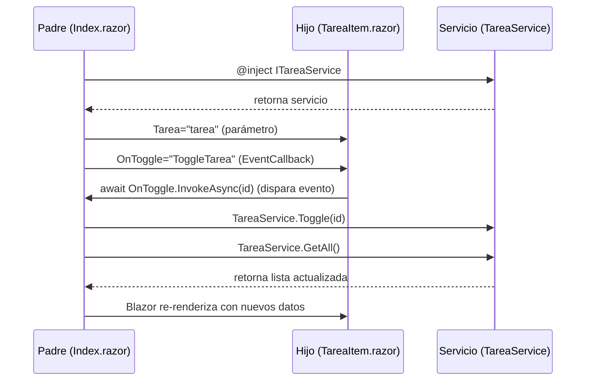

# Lista de Tareas - Blazor Server

## 📋 Descripción

Aplicación web de **gestión de tareas** (to-do list) desarrollada con **Blazor Server** como ejercicio práctico de introducción a esta tecnología.

La aplicación permite:
- ✅ **Añadir tareas** - Campo de texto + botón
- ✅ **Listar tareas** - Muestra todas las tareas con su estado
- ✅ **Marcar completada** - Checkbox para cada tarea
- ✅ **Eliminar tarea** - Botón para borrar
- ✅ **Contador** - Muestra tareas pendientes

## 🏗️ Arquitectura y Tecnologías

### Tecnologías Utilizadas
- **Blazor Server** (.NET 10) - Framework de aplicaciones web
- **C# 14** - Lenguaje de programación
- **Inyección de Dependencias** - Microsoft.Extensions.DependencyInjection

### Arquitectura

```
ListaTareasBlazor/
├── Models/
│   └── Tarea.cs                  # Modelo de datos
├── Services/
│   ├── ITareaService.cs          # Interfaz del servicio
│   └── TareaService.cs           # Implementación del servicio
├── Components/
│   ├── Pages/
│   │   ├── Index.razor           # Página principal
│   │   └── TareaItem.razor       # Componente hijo (una tarea)
│   └── _Imports.razor            # Imports globales
└── Program.cs                    # Configuración DI
```

## 🔄 Comunicación entre Componentes (CONCEPTO CLAVE)

En Blazor, la comunicación entre componentes padre e hijo se realiza mediante:

### 1. **Parámetros (PADRE → HIJO)**
El componente padre pasa datos al hijo mediante propiedades con `[Parameter]`:

```csharp
// En el padre (Index.razor)
<TareaItem Tarea="tarea" ... />

// En el hijo (TareaItem.razor)
[Parameter]
public Tarea Tarea { get; set; } = new();
```

### 2. **EventCallbacks (HIJO → PADRE)**
El componente hijo notifica eventos al padre mediante `EventCallback`:

```csharp
// En el padre (Index.razor)
// Define el método que maneja el evento
private void EliminarTarea(Guid id) { ... }

// Pasa el callback al hijo
<TareaItem OnDelete="EliminarTarea" ... />

// En el hijo (TareaItem.razor)
// Declara el callback como parámetro
[Parameter]
public EventCallback<Guid> OnDelete { get; set; }

// Lo dispara cuando ocurre la acción
await OnDelete.InvokeAsync(Tarea.Id);
```

### Diagrama de Flujo



## 📦 Inyección de Dependencias

### En Program.cs

```csharp
// Registro del servicio
// AddScoped = una instancia por sesión de usuario
builder.Services.AddScoped<ITareaService, TareaService>();
```

### En Componentes

```csharp
// @inject crea una propiedad automáticamente con el servicio
@inject ITareaService TareaService
```

## 🎯 Estructura del Proyecto

### Models/Tarea.cs
```csharp
public class Tarea
{
    public Guid Id { get; set; } = Guid.NewGuid();
    public string Titulo { get; set; } = string.Empty;
    public bool Completada { get; set; } = false;
    public DateTime FechaCreacion { get; set; } = DateTime.Now;
}
```

### Services/ITareaService.cs (Interfaz)
```csharp
public interface ITareaService
{
    List<Tarea> GetAll();
    void Add(string titulo);
    void Toggle(Guid id);
    void Remove(Guid id);
    int GetPendientes();
}
```

### Services/TareaService.cs (Implementación)
Implementación en memoria (sin persistencia). Para cambiar a archivo o base de datos, solo implementaríamos esta interfaz.

### Components/Pages/Index.razor (Página Principal)
- Gestiona la lista de tareas
- Maneja los eventos de añadir, togglear y eliminar
- Usa `@bind` para binding bidireccional con el input
- Renderiza `TareaItem` para cada tarea

### Components/TareaItem.razor (Componente Hijo)
- Muestra una sola tarea
- Recibe la tarea como parámetro
- Dispara `OnToggle` y `OnDelete` cuando el usuario interactúa

## 🚀 Cómo Ejecutar

```bash
cd ListaTareasBlazor
dotnet run
```

Luego abrir en el navegador: `http://localhost:5000`

## 📚 Conceptos Educativos

Esta práctica introduce:

1. **Componentes Blazor** - Bloques reutilizables de UI
2. **Binding en Blazor** - `@bind` para datos bidireccionales
3. **Inyección de Dependencias** - `@inject` para servicios
4. **Comunicación Padre-Hijo** - Parámetros + EventCallbacks
5. **Ciclo de vida** - `OnInitialized`, `StateHasChanged`
6. **Sintaxis Razor** - Mezcla de HTML y C#

## 📝 Notas para el Alumno

### ¿Por qué usamos EventCallback?
En Blazor Server, los eventos del cliente (clic, cambio) se comunican al servidor mediante SignalR. `EventCallback` es la forma recomendada de manejar esto porque:
- Es type-safe (seguro tipos)
- Maneja la comunicación asíncrona automáticamente
- Permite pasar parámetros

### Diferencia con WPF/WinForms
- **Blazor**: La UI se renderiza en el servidor y se envía al cliente
- **WPF**: La UI se renderiza en el cliente
- **Blazor** usa componentes, no XAML
- **Blazor** usa `@bind` en lugar de bindings de XAML

### ¿Por qué una interfaz para el servicio?
Separar la interfaz de la implementación permite:
- Cambiar la implementación sin modificar el código que la usa
- Hacer testing con implementaciones mock
- Usar inyección de dependencias correctamente