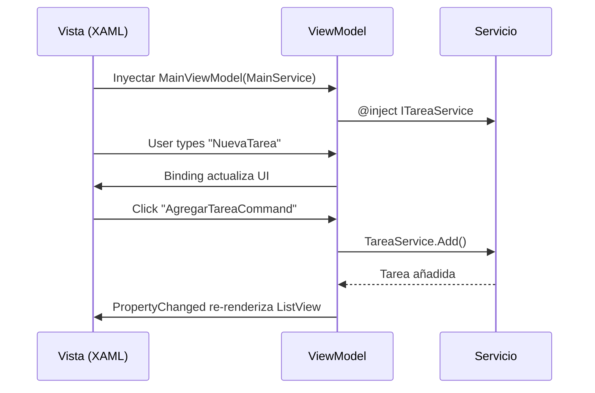

# Lista de Tareas - WPF (Como base para MAUI)

## 📋 Descripción

Aplicación de **gestión de tareas** (to-do list) desarrollada con **WPF** como ejercicio práctico. Esta implementación sirve como base para entender cómo移植 a .NET MAUI (multiplataforma).

La aplicación permite:
- ✅ **Añadir tareas** - Campo de texto + botón
- ✅ **Listar tareas** - Muestra todas las tareas con su estado
- ✅ **Marcar completada** - Checkbox para cada tarea
- ✅ **Eliminar tarea** - Botón para borrar
- ✅ **Contador** - Muestra tareas pendientes
- ✅ **Persistencia** - Guarda en archivo JSON local

## 🏗️ Arquitectura y Tecnologías

### Tecnologías Utilizadas
- **WPF** (.NET 10) - Windows Presentation Foundation
- **C# 14** - Lenguaje de programación
- **CommunityToolkit.Mvvm** - Simplifica el patrón MVVM
- **Microsoft.Extensions.DependencyInjection** - Inyección de dependencias

### Arquitectura MVVM

```
ListaTareasMAUI/
├── Models/
│   └── Tarea.cs                  # Modelo de datos
├── Services/
│   ├── ITareaService.cs          # Interfaz del servicio
│   └── TareaService.cs           # Implementación con persistencia
├── ViewModels/
│   └── MainViewModel.cs          # Lógica de presentación
├── Views/
│   ├── MainWindow.xaml           # Interfaz de usuario
│   └── MainWindow.xaml.cs        # Code-behind
└── App.xaml.cs                   # Configuración DI
```

## 📊 Comparación: Blazor vs WPF/MAUI

### Conceptos Equivalentes

| Blazor | WPF/MAUI | Descripción |
|--------|----------|-------------|
| `@inject` | Constructor DI | Inyectar servicios |
| `@bind` | `{Binding }` | Sincronizar datos |
| `EventCallback<T>` | `ICommand` | Eventos al ViewModel |
| Componente .razor | Page/Window .xaml | UI del componente |
| `@code { }` | Code-behind .cs | Lógica del componente |

### Binding en Blazor vs WPF

**Blazor:**
```razor
<input @bind="NuevaTarea" />
<button @onclick="AgregarTarea" />
```

**WPF:**
```xml
<TextBox Text="{Binding NuevaTarea, Mode=TwoWay}" />
<Button Command="{Binding AgregarTareaCommand}" />
```

### Comunicación Padre-Hijo

**Blazor (EventCallback):**
```csharp
// Hijo
[Parameter] public EventCallback<Guid> OnDelete { get; set; }
await OnDelete.InvokeAsync(id);

// Padre
<TareaItem OnDelete="EliminarTarea" />
```

**WPF (Commands):**
```xml
<!-- XAML -->
<Button Command="{Binding EliminarTareaCommand}" CommandParameter="{Binding}" />

// ViewModel
[RelayCommand]
private void EliminarTarea(Tarea tarea) { ... }
```

## 🔄 Comunicación entre Componentes (CONCEPTO CLAVE)

En WPF/MAUI, la comunicación entre la Vista y el ViewModel se realiza mediante:

### 1. **DataBinding (VISTA ← VIEWMODEL)**
El ViewModel expone propiedades que la Vista muestra:

```csharp
// ViewModel
[ObservableProperty]
private string _nuevaTarea;

// XAML
<TextBox Text="{Binding NuevaTarea}" />
```

### 2. **Commands (VISTA → VIEWMODEL)**
La Vista dispara métodos del ViewModel:

```csharp
// ViewModel
[RelayCommand]
private void AgregarTarea() { ... }

// XAML
<Button Command="{Binding AgregarTareaCommand}" />
```

### 3. **Binding Modes**

| Mode | Descripción |
|------|-------------|
| `OneWay` | Vista solo lee del ViewModel |
| `TwoWay` | Cambios fluyen en ambos sentidos |
| `OneTime` | Se lee solo una vez |

### Diagrama de Flujo



## 📦 Inyección de Dependencias

### En App.xaml.cs

```csharp
// Registro del servicio
services.AddSingleton<ITareaService, TareaService>();
services.AddTransient<MainViewModel>();
```

### En Vista (Code-behind)

```csharp
// El ViewModel se inyecta en el constructor
public MainWindow(MainViewModel viewModel)
{
    InitializeComponent();
    DataContext = viewModel;
}
```

## 🎯 Estructura del Proyecto

### Models/Tarea.cs
```csharp
public class Tarea
{
    public Guid Id { get; set; } = Guid.NewGuid();
    public string Titulo { get; set; } = string.Empty;
    public bool Completada { get; set; } = false;
    public DateTime FechaCreacion { get; set; } = DateTime.Now;
}
```

### Services/ITareaService.cs
```csharp
public interface ITareaService
{
    List<Tarea> GetAll();
    void Add(string titulo);
    void Toggle(Guid id);
    void Remove(Guid id);
    int GetPendientes();
}
```

### ViewModels/MainViewModel.cs
Usa CommunityToolkit.Mvvm:
- `[ObservableProperty]` genera propiedades con notificación
- `[RelayCommand]` genera comandos

### Views/MainWindow.xaml
- `ItemsSource` bindea la colección de tareas
- `DataTemplate` define cómo renderizar cada tarea
- `Style` define la apariencia visual
- `Trigger` para tachar tareas completadas

## 🚀 Cómo Ejecutar

```bash
cd ListaTareasMAUI
dotnet run
```

## 📚 Conceptos Educativos

Esta práctica introduce:

1. **MVVM** - Separación de responsabilidades
2. **DataBinding** - Conexión entre UI y lógica
3. **Commands** - Patrón para acciones del usuario
4. **Inyección de Dependencias** - Gestión de dependencias
5. **CommunityToolkit.Mvvm** - Simplificación del código
6. **PersistenciajSON** - Guardar datos en archivo

## 📝 Diferencias Clave con Blazor

| Aspecto | Blazor Server | WPF/MAUI |
|---------|---------------|----------|
| UI se renderiza en | Servidor (SignalR) | Cliente |
| Lenguaje de UI | .razor (HTML/C#) | XAML |
| Binding | `@bind` | `{Binding }` |
| Eventos | `EventCallback` | `ICommand` |
| Estilos | CSS | Estilos XAML |
| Navigación | Router | Pages/Windows |

## 🎓 Ejercicio para el Alumno

移植ar esta aplicación WPF a .NET MAUI:

1. Cambiar `Window` por `ContentPage`
2. Cambiar `TextBox` por `Entry`
3. Cambiar `TextBlock` por `Label`
4. Usar namespace de MAUI: `xmlns="http://schemas.microsoft.com/winfx/2006/xaml/presentation"` → `xmlns="http://xamarin.com/winfx/xaml/standard"`
5. Ajustar propiedades específicas de cada plataforma